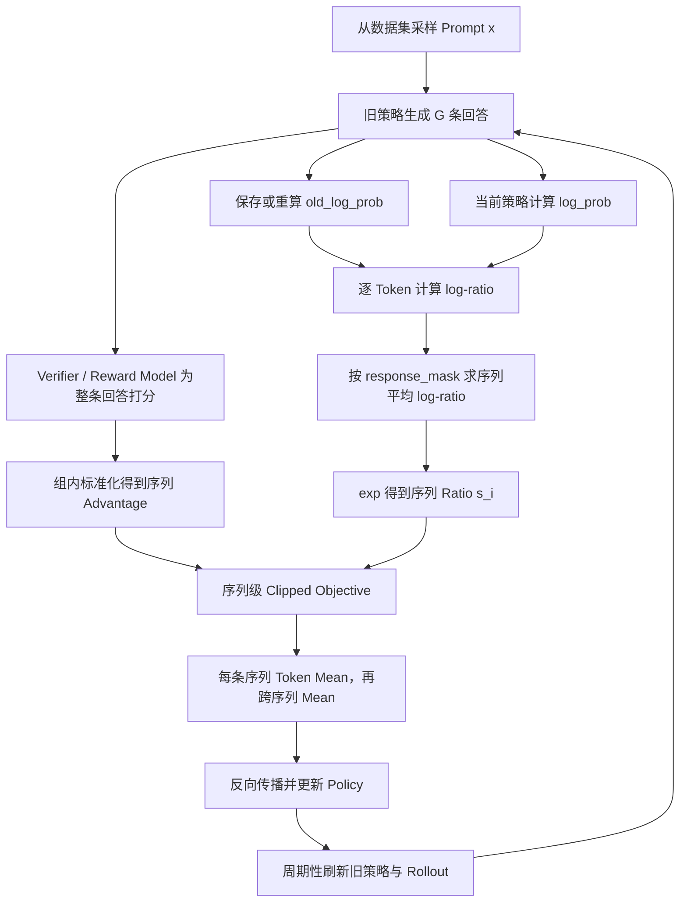

# GSPO：从 Token 级重要性比率到序列级策略优化

> 参考资料：
>
> - 论文：[Group Sequence Policy Optimization](https://arxiv.org/abs/2507.18071)
> - 官方解读：[GSPO: Towards Scalable Reinforcement Learning for Language Models](https://qwenlm.github.io/blog/gspo/)
> - 实现锚点：[verl `compute_policy_loss_gspo`](https://verl.readthedocs.io/en/latest/_modules/verl/trainer/ppo/core_algos.html#compute_policy_loss_gspo)
> - 训练示例：[verl Qwen3-8B GSPO](https://github.com/verl-project/verl/blob/main/examples/gspo_trainer/run_qwen3_8b_fsdp.sh)
> - 写作框架参考：[DAPO：从 GRPO 到稳定的长链推理强化学习](https://www.xiaohongshu.com/explore/69e4de63000000001a028d2c)

> [!note]
> GSPO 保留 GRPO 的组采样与组内相对优势估计，但把重要性比率、裁剪和优化单位从 Token 级提升到序列级，使“整条回答获得奖励”与“整条回答接受策略约束”保持一致。它不是把梯度从 Token 上移走：梯度最终仍通过每个 Token 的 Log Probability 回传，只是同一回答内的 Token 共享同一个序列级权重。

## 0. 一句话定位

> **GRPO 用一个序列奖励监督整条回答，却让每个 Token 使用不同的重要性比率；GSPO 把一条回答的 Token 比率汇总为一个长度归一化的序列比率，再对整条回答统一裁剪和更新。**

核心变化可以压缩成一张图：

```text
GRPO
  序列级 Reward / Advantage
          ×
  Token 级 Ratio / Clipping

                 ↓ GSPO

GSPO
  序列级 Reward / Advantage
          ×
  序列级 Ratio / Clipping
```

GSPO 主要想解决三类问题：

1. 长序列中 Token 级重要性比率带来的高方差和噪声积累；
2. MoE 模型专家路由变化导致单 Token Log Probability 大幅波动；
3. Rollout 引擎与训练引擎之间的数值误差，使 Token 级 Ratio 不可靠。

## 1. GSPO 的定位

GSPO 全称为 Group Sequence Policy Optimization，由 Qwen 团队提出，并用于 Qwen3 系列模型的强化学习训练。

它继承了 GRPO 的主干：

- 对每个 Prompt 使用旧策略采样一组回答；
- 用同组回答之间的 Reward 差异构造相对 Advantage；
- 不依赖与 Policy 同等规模的 Value Model；
- 通过 Clipped Surrogate Objective 限制一次策略更新的幅度。

它改变的是 Policy Loss 的优化粒度：

| 方法 | Reward / Advantage | Importance Ratio | Clipping | Loss 聚合 |
| --- | --- | --- | --- | --- |
| PPO | 通常为 Token 级 GAE | Token 级 | Token 级 | Token 级 |
| GRPO | 序列 Reward 经组内归一化 | Token 级 | Token 级 | 常见 Token Mean 或 Sequence Mean |
| GSPO | 序列 Reward 经组内归一化 | 长度归一化的序列级 | 序列级 | Sequence Mean + Token Mean |

> [!important]
> GSPO 不是新的 Reward Estimator。它仍然使用 GRPO 的 Group-Relative Advantage；创新集中在 Importance Ratio、Clipping 和梯度权重的粒度。

## 2. 为什么需要 Old Policy 与 Importance Ratio

### 2.1 Rollout 与训练不是完全同时发生

设当前用于生成回答的旧策略为 $`\pi_{\theta_{\mathrm{old}}}`$，正在训练的新策略为 $`\pi_\theta`$。

对于输入 $`x`$，旧策略采样回答：

```math
y\sim\pi_{\theta_{\mathrm{old}}}(\cdot\mid x)
```

如果只执行一次极小更新，$`\pi_\theta`$ 与 $`\pi_{\theta_{\mathrm{old}}}`$ 很接近。但大规模训练通常会：

- 一次生成很大的 Rollout Batch；
- 将 Batch 切成多个 Mini-Batch；
- 对同一批 Rollout 执行多个梯度更新。

随着更新进行，训练策略逐渐离开生成数据的旧策略，Batch 内部因此形成有限的 Off-Policy Mismatch。

### 2.2 Importance Sampling 的基本身份

如果样本来自行为分布 $`p_{\mathrm{beh}}`$，但希望估计目标分布 $`p_{\mathrm{tar}}`$ 下的期望，可以写成：

```math
\mathbb{E}_{z\sim p_{\mathrm{tar}}}[f(z)]
=
\mathbb{E}_{z\sim p_{\mathrm{beh}}}
\left[
\frac{p_{\mathrm{tar}}(z)}{p_{\mathrm{beh}}(z)}f(z)
\right]
```

其中：

```math
w(z)=\frac{p_{\mathrm{tar}}(z)}{p_{\mathrm{beh}}(z)}
```

称为 Importance Ratio。放到 Policy Optimization 中：

- 行为分布是生成 Rollout 的 $`\pi_{\theta_{\mathrm{old}}}`$；
- 目标分布是正在更新的 $`\pi_\theta`$。

### 2.3 为什么还要 Clipping

如果新旧策略差异过大，Importance Ratio 可能极端放大某些样本，使训练不稳定。PPO 系方法用裁剪限制它：

```math
\mathrm{clip}(w,1-\varepsilon,1+\varepsilon)
```

Clipping 不是精确的概率分布约束，而是一个易计算的近端更新代理：当新策略相对旧策略变化过大时，截断继续扩大目标带来的收益。

## 3. 从序列概率开始

### 3.1 自回归序列概率

回答 $`y=(y_1,y_2,\ldots,y_T)`$ 的序列概率是所有条件概率的乘积：

```math
\pi_\theta(y\mid x)
=
\prod_{t=1}^{T}
\pi_\theta(y_t\mid x,y_{1:t-1})
```

为了避免小概率连乘造成数值下溢，实际计算使用 Log Probability：

```math
\log\pi_\theta(y\mid x)
=
\sum_{t=1}^{T}
\log\pi_\theta(y_t\mid x,y_{1:t-1})
```

### 3.2 Token 级 Ratio

在第 $`t`$ 个位置，GRPO 使用：

```math
w_{i,t}(\theta)
=
\frac{
\pi_\theta(y_{i,t}\mid x,y_{i,1:t-1})
}{
\pi_{\theta_{\mathrm{old}}}(y_{i,t}\mid x,y_{i,1:t-1})
}
```

对应的 Log-Ratio 是：

```math
\delta_{i,t}
=
\log\pi_\theta(y_{i,t}\mid x,y_{i,1:t-1})
-
\log\pi_{\theta_{\mathrm{old}}}(y_{i,t}\mid x,y_{i,1:t-1})
```

因此：

```math
w_{i,t}(\theta)=\exp(\delta_{i,t})
```

### 3.3 原始序列级 Ratio

如果把完整回答视为 Importance Sampling 的随机变量，序列级概率比是：

```math
\rho_i(\theta)
=
\frac{\pi_\theta(y_i\mid x)}
{\pi_{\theta_{\mathrm{old}}}(y_i\mid x)}
```

将自回归概率展开：

```math
\rho_i(\theta)
=
\prod_{t=1}^{T_i}w_{i,t}(\theta)
```

在 Log 空间中：

```math
\log\rho_i(\theta)
=
\sum_{t=1}^{T_i}\delta_{i,t}
```

这才是严格意义上的完整序列概率比，但它不适合直接用于长序列训练：几十、几千个略大于或略小于 1 的 Token Ratio 连乘后，可能迅速爆炸或趋近 0；不同长度回答的数值尺度也不一致。

## 4. GRPO 的基础目标

### 4.1 Group-Relative Advantage

对于同一个 Prompt $`x`$，旧策略采样 $`G`$ 条回答：

```math
\{y_i\}_{i=1}^{G}
\sim
\pi_{\theta_{\mathrm{old}}}(\cdot\mid x)
```

验证器给出序列级 Reward：

```math
r_i=r(x,y_i)
```

GRPO 和 GSPO 都使用组内标准化 Advantage：

```math
\widehat A_i
=
\frac{
r_i-\mathrm{mean}(r_1,\ldots,r_G)
}{
\mathrm{std}(r_1,\ldots,r_G)+\epsilon_A
}
```

$`\epsilon_A`$ 是防止分母为 0 的数值稳定项。

同一回答中的 Token 通常共享同一个 $`\widehat A_i`$：

```math
\widehat A_{i,t}=\widehat A_i
```

它表达的是“这条回答相对同一个问题下的其他回答更好还是更差”，而不是第 $`t`$ 个 Token 单独有多好。

### 4.2 GRPO 的 Token 级目标

忽略额外 KL 正则时，GRPO 的核心目标是：

```math
J_{\mathrm{GRPO}}(\theta)
=
\mathbb E
\left[
\frac{1}{G}
\sum_{i=1}^{G}
\frac{1}{T_i}
\sum_{t=1}^{T_i}
\min
\left(
w_{i,t}(\theta)\widehat A_i,
\mathrm{clip}(w_{i,t}(\theta),1-\varepsilon,1+\varepsilon)\widehat A_i
\right)
\right]
```

这里出现了 GSPO 论文认为不协调的地方：

| 信号 | 粒度 |
| --- | --- |
| Reward $`r_i`$ | 整条回答 |
| Advantage $`\widehat A_i`$ | 整条回答 |
| Ratio $`w_{i,t}`$ | 单个 Token |
| Clipping | 单个 Token |

## 5. GSPO 认为 GRPO 的问题在哪里

### 5.1 一个条件分布通常只有一个 Token 样本

在固定前缀 $`(x,y_{i,1:t-1})`$ 上，Rollout 通常只采到一个 Token $`y_{i,t}`$。GRPO 用这个单样本对应的 Ratio 修正该 Token 的梯度，但没有在同一个前缀上取得大量 next-token 样本来平均 Ratio。

GSPO 论文认为，这使 Token Ratio 很难发挥传统 Importance Sampling 的分布校正作用，反而将单 Token 的概率波动直接注入梯度。

> [!warning]
> 更严谨地说，Importance Sampling 并非原则上不能用于自回归轨迹；轨迹级 IS、Per-Decision IS 都有严格定义。GSPO 批评的是：**共享一个序列 Advantage，却把每个 Token 的单样本条件概率比当作独立权重的 GRPO 目标，不等同于标准的完整轨迹校正。**

### 5.2 长序列会积累更多噪声

GRPO 的梯度中，不同 Token 使用不同权重：

```math
\nabla_\theta J_{\mathrm{GRPO}}
\propto
\widehat A_i
\frac{1}{T_i}
\sum_{t=1}^{T_i}
w_{i,t}(\theta)
\nabla_\theta\log\pi_\theta(y_{i,t}\mid x,y_{i,1:t-1})
```

长回答包含更多随机波动的 $`w_{i,t}`$。即使每个 Ratio 单独看并不极端，不均匀权重也会在大量 Token 上持续改变梯度方向与大小。

### 5.3 序列奖励与 Token 裁剪并不完全对齐

对于正 Advantage 的回答，一些 Token 可能未被裁剪，另一些 Token 可能超过上界而被裁剪。同一回答因此被拆成不同更新强度的 Token 集合。

但序列级 Reward 只告诉模型“整条回答相对更好或更差”，并没有提供哪个 Token 应该承担更多 Credit 的信息。单纯依靠 Token Ratio 形成不同权重，不等于获得了可靠的 Token-Level Credit Assignment。

## 6. GSPO 的序列级 Importance Ratio

### 6.1 长度归一化

GSPO 不直接使用原始序列 Ratio $`\rho_i`$，而是取 $`T_i`$ 次方根：

```math
s_i(\theta)
=
\left(
\frac{
\pi_\theta(y_i\mid x)
}{
\pi_{\theta_{\mathrm{old}}}(y_i\mid x)
}
\right)^{1/T_i}
```

代入 Token Ratio：

```math
s_i(\theta)
=
\left(
\prod_{t=1}^{T_i}w_{i,t}(\theta)
\right)^{1/T_i}
```

所以 $`s_i`$ 是整条回答所有 Token Ratio 的几何平均。

在 Log 空间计算更清楚：

```math
\log s_i(\theta)
=
\frac{1}{T_i}
\sum_{t=1}^{T_i}
\left[
\log\pi_\theta(y_{i,t}\mid x,y_{i,1:t-1})
-
\log\pi_{\theta_{\mathrm{old}}}(y_{i,t}\mid x,y_{i,1:t-1})
\right]
```

最后：

```math
s_i(\theta)=\exp(\log s_i(\theta))
```

### 6.2 几何平均的直觉

假设一条回答有四个 Token，Token Ratio 分别为：

```math
(1.02,0.98,1.01,0.99)
```

算术平均接近 1，但它没有序列概率比的乘法语义。GSPO 使用几何平均：

```math
s
=
(1.02\times0.98\times1.01\times0.99)^{1/4}
```

它保留“序列概率由 Token 概率相乘得到”的结构，同时避免原始乘积随序列长度指数缩放。

### 6.3 长度归一化改变了什么

长度归一化带来两个效果：

1. 不同回答长度下的 Ratio 更容易落在相近数值区间；
2. Clipping Range 不必随回答长度显著变化。

但也要注意：

> $`s_i=\rho_i^{1/T_i}`$ 不再是原始的严格 Importance Sampling Weight，而是一个长度归一化的序列级代理目标。

因此，GSPO 的优势主要来自优化动力学和训练稳定性，而不是“完全恢复了严格无偏的 Importance Sampling”。

## 7. GSPO 的完整目标

GSPO 使用序列级 Clipped Surrogate Objective：

```math
J_{\mathrm{GSPO}}(\theta)
=
\mathbb E
\left[
\frac{1}{G}
\sum_{i=1}^{G}
\min
\left(
s_i(\theta)\widehat A_i,
\mathrm{clip}(s_i(\theta),1-\varepsilon_{\mathrm{low}},1+\varepsilon_{\mathrm{high}})\widehat A_i
\right)
\right]
```

训练代码通常最小化相反数：

```math
L_{\mathrm{GSPO}}(\theta)=-J_{\mathrm{GSPO}}(\theta)
```

### 7.1 正 Advantage

当 $`\widehat A_i>0`$ 时，希望提高整条回答的概率。如果：

```math
s_i(\theta)>1+\varepsilon_{\mathrm{high}}
```

说明新策略已经把这条回答的长度归一化概率提高得太多，继续提高不再增加代理目标的收益。

### 7.2 负 Advantage

当 $`\widehat A_i<0`$ 时，希望降低整条回答的概率。如果：

```math
s_i(\theta)<1-\varepsilon_{\mathrm{low}}
```

说明这条回答的概率已经下降得足够多，代理目标阻止策略继续从过度下降中获益。

### 7.3 为什么论文里的 Clip Range 很小

论文实验为 GSPO 使用：

```math
\varepsilon_{\mathrm{low}}=3\times10^{-4}
```

```math
\varepsilon_{\mathrm{high}}=4\times10^{-4}
```

这远小于 PPO/GRPO 中常见的 0.1 或 0.2，因为 GSPO 裁剪的是“平均到每个 Token 后的序列几何平均 Ratio”，它与 Token Ratio 的数值尺度不同。

> [!warning]
> 这个范围来自论文特定模型和训练设置，不应机械迁移到所有模型。只要 Ratio 定义、Loss Reduction、Rollout Batch Freshness 或训练框架不同，就需要重新观察 $`s_i`$ 分布与 Clip Fraction。

## 8. GSPO 的梯度为什么仍然落在 Token 上

先忽略 Clipping。单条回答的目标为：

```math
J_i(\theta)=s_i(\theta)\widehat A_i
```

求梯度：

```math
\nabla_\theta J_i(\theta)
=
s_i(\theta)\widehat A_i
\nabla_\theta\log s_i(\theta)
```

而：

```math
\log s_i(\theta)
=
\frac{1}{T_i}
\sum_{t=1}^{T_i}
\left[
\log\pi_\theta(y_{i,t}\mid x,y_{i,1:t-1})
-
\log\pi_{\theta_{\mathrm{old}}}(y_{i,t}\mid x,y_{i,1:t-1})
\right]
```

旧策略不依赖 $`\theta`$，所以：

```math
\nabla_\theta\log s_i(\theta)
=
\frac{1}{T_i}
\sum_{t=1}^{T_i}
\nabla_\theta
\log\pi_\theta(y_{i,t}\mid x,y_{i,1:t-1})
```

代回得到：

```math
\nabla_\theta J_i(\theta)
=
s_i(\theta)\widehat A_i
\frac{1}{T_i}
\sum_{t=1}^{T_i}
\nabla_\theta
\log\pi_\theta(y_{i,t}\mid x,y_{i,1:t-1})
```

这说明：

- 序列级权重是 $`s_i\widehat A_i`$；
- 每个 Token 都通过自己的 $`\nabla\log\pi_\theta`$ 参与更新；
- 同一回答内的 Token 不再乘不同的 Token Ratio。

GRPO 则近似为：

```math
\nabla_\theta J_i^{\mathrm{GRPO}}
\propto
\widehat A_i
\frac{1}{T_i}
\sum_{t=1}^{T_i}
w_{i,t}(\theta)
\nabla_\theta
\log\pi_\theta(y_{i,t}\mid x,y_{i,1:t-1})
```

两者最核心的差别是：

```text
GRPO：每个 Token 的梯度 × 自己的 w_i,t
GSPO：每个 Token 的梯度 × 同一个 s_i
```

## 9. GSPO-token：需要 Token Advantage 时怎么办

标准 GSPO 假设同一回答中所有 Token 共用 $`\widehat A_i`$。在多轮 Agent、过程奖励或局部工具调用场景中，可能希望使用 $`\widehat A_{i,t}`$。

论文给出 GSPO-token：

```math
s_{i,t}(\theta)
=
\mathrm{sg}[s_i(\theta)]
\frac{
\pi_\theta(y_{i,t}\mid x,y_{i,1:t-1})
}{
\mathrm{sg}[\pi_\theta(y_{i,t}\mid x,y_{i,1:t-1})]
}
```

$`\mathrm{sg}`$ 表示 Stop Gradient。

第二个分数的前向数值恒为 1，因此：

```math
s_{i,t}(\theta)=s_i(\theta)
```

但反向传播时，梯度只通过分子中的当前 Token Log Probability 流动。这样可以做到：

- 前向时，所有 Token 使用相同的序列 Ratio；
- 反向时，每个 Token 可以乘自己的 $`\widehat A_{i,t}`$。

当：

```math
\widehat A_{i,t}=\widehat A_i
```

GSPO-token 与标准 GSPO 在目标数值、裁剪条件和理论梯度上等价。

## 10. 一次完整训练链路



对应伪代码：

```python
for prompts in dataloader:
    responses = old_policy.generate(prompts, n=group_size)
    rewards = verifier(prompts, responses)
    advantages = normalize_within_prompt_group(rewards)

    old_log_prob = score(old_policy, prompts, responses)

    for mini_batch in split(responses):
        log_prob = score(policy, prompts, mini_batch)
        log_ratio = log_prob - old_log_prob

        seq_len = response_mask.sum(dim=-1).clamp(min=1)
        seq_log_ratio = (
            (log_ratio * response_mask).sum(dim=-1) / seq_len
        )
        seq_ratio = seq_log_ratio.exp()

        objective_1 = seq_ratio * advantages
        objective_2 = seq_ratio.clamp(
            1 - eps_low,
            1 + eps_high,
        ) * advantages

        loss = -minimum(objective_1, objective_2).mean()
        loss.backward()
        optimizer.step()
```

实际实现还需要处理 Padding Mask、分布式全局 Batch Reduction、梯度累积和数值裁剪。

## 11. verl 实现怎样对应公式

verl 的核心输入张量为：

| 张量 | 典型形状 | 含义 |
| --- | --- | --- |
| `old_log_prob` | `(batch_size, response_length)` | 旧策略对已采样 Token 的 Log Probability |
| `log_prob` | `(batch_size, response_length)` | 当前策略对同一批 Token 的 Log Probability |
| `advantages` | `(batch_size, response_length)` | 序列 Advantage 广播到 Token，或 Token Advantage |
| `response_mask` | `(batch_size, response_length)` | 有效回答 Token 为 1，Padding 为 0 |

### 11.1 序列平均 Log-Ratio

代码首先计算：

```python
negative_approx_kl = log_prob - old_log_prob
seq_lengths = response_mask.sum(dim=-1).clamp(min=1)
negative_approx_kl_seq = (
    (negative_approx_kl * response_mask).sum(dim=-1)
    / seq_lengths
)
```

这里的 `negative_approx_kl_seq` 对应：

```math
\log s_i(\theta)
=
\frac{1}{T_i}\sum_t\delta_{i,t}
```

### 11.2 Stop-Gradient 技巧

verl 没有直接把一个标量 `seq_ratio` 乘到最终标量 Loss，而是构造：

```python
log_seq_importance_ratio = (
    log_prob
    - log_prob.detach()
    + negative_approx_kl_seq.detach().unsqueeze(-1)
)
seq_importance_ratio = log_seq_importance_ratio.exp()
```

前向计算时：

```math
\log\pi_\theta-\mathrm{sg}[\log\pi_\theta]=0
```

所以每个 Token 得到的数值都是同一个：

```math
\exp(\mathrm{sg}[\log s_i])=s_i
```

反向传播时，`log_prob - log_prob.detach()` 对 `log_prob` 的梯度为 1，使梯度仍然落到各 Token 的 Log Probability 上。这正是论文 GSPO-token 的实现形式。

### 11.3 Loss Reduction 不能随便选

verl 对 GSPO 使用 `seq-mean-token-mean`：

1. 每条回答先对有效 Token 求平均；
2. 再对 Batch 中的回答求平均。

```math
L
=
\frac{1}{B}
\sum_{i=1}^{B}
\frac{1}{T_i}
\sum_{t=1}^{T_i}
L_{i,t}
```

这与 GSPO 的每序列等权设计一致。如果换成全局 Token Mean，长回答会因为包含更多 Token 而拥有更大总权重，优化目标就发生了变化。

## 12. 为什么 GSPO 对 MoE 更稳定

### 12.1 MoE 的 Expert Routing Volatility

MoE 模型的每个 Token 只激活部分专家。策略更新后，即使输入 Token 不变，Router 也可能选择不同专家，导致同一个 Token 的 Log Probability 出现明显变化。

论文报告，在一个 48 层 Qwen3-30B-A3B-Base 模型上，对同一个 Rollout 样本执行梯度更新后，新旧策略激活的专家约有 10% 不同。

在 GRPO 中，这会直接影响每个 Token 的：

```math
w_{i,t}
=
\frac{\pi_\theta(y_{i,t}\mid s_{i,t})}
{\pi_{\theta_{\mathrm{old}}}(y_{i,t}\mid s_{i,t})}
```

少量 Token Ratio 的剧烈变化可能改变裁剪决策和梯度权重。

### 12.2 Routing Replay 的代价

Qwen 团队此前使用 Routing Replay：缓存旧策略的专家路由，并在新策略重算 Log Probability 时强制复用旧路由。

它能让分子、分母经过相同的专家子网络，但会带来：

- 路由信息的额外存储；
- 分布式通信开销；
- 对新策略自由选择专家的限制；
- 更复杂的训练基础设施。

GSPO 对 Token 波动取序列平均，只关心序列级总体似然变化。论文实验中，GSPO 无需 Routing Replay 也能稳定训练 MoE。

> [!warning]
> “序列平均更鲁棒”不表示单 Token 数值误差消失，而是正负波动可能在序列聚合中部分抵消，单个 Token 不再独立决定自己的 Ratio 与裁剪状态。

## 13. 为什么 GSPO 可能简化 RL 基础设施

大规模 RL 常把 Rollout 与训练分离：

```text
Rollout Engine：vLLM / SGLang
Training Engine：FSDP / Megatron
```

即使加载同一组权重，两边也可能因为以下因素得到略有不同的 Log Probability：

- 并行切分与归约顺序；
- 混合精度与量化；
- 不同 Attention Kernel；
- MoE Router 的数值波动；
- Padding、Sampling 或 Logits Processor 实现差异。

GRPO 对 Token Ratio 很敏感，因此工程上常用训练引擎重新计算旧策略 Log Probability。

GSPO 使用序列平均 Log-Ratio，对局部数值差异更容忍。论文据此认为，未来可能直接使用推理引擎返回的旧 Log Probability，减少旧策略重算，尤其适合：

- Training-Inference Disaggregation；
- Partial Rollout；
- Multi-Turn RL；
- 大规模 MoE Rollout。

这里应当把“可能简化”理解为工程潜力，而不是所有系统都可以立即删掉 Old Logprob Recompute。是否安全仍需监控推理—训练 Log Probability Gap。

## 14. 实验结果应该怎样读

论文从 Qwen3-30B-A3B-Base 的 Cold-Start Checkpoint 开始训练，并在以下任务评估：

- AIME 2024；
- LiveCodeBench；
- CodeForces。

论文对比中：

- Rollout Batch 被划分为 4 个 Mini-Batch 更新；
- GRPO 配合 Routing Replay；
- GSPO 使用 $`3\times10^{-4}`$ 与 $`4\times10^{-4}`$ 的左右 Clip Range；
- GRPO 使用 0.2 与 0.27 的左右 Clip Range。

作者报告 GSPO 在相同训练成本下取得更稳定的训练曲线、更高的训练效率和更好的 Benchmark 表现。

一个反直觉现象是：GSPO 被裁剪的 Token 比例比 GRPO 高约两个数量级，但训练效率仍然更高。论文把它解释为：GRPO 虽然保留了更多 Token 梯度，这些梯度却更嘈杂；GSPO 使用更少但更一致的序列信号。

> [!warning]
> 这些结果证明了 GSPO 在论文特定模型、任务和基础设施上的有效性，但不能推出它在所有 Dense 模型、所有 Reward 设计和所有训练规模上都必然优于 GRPO。特别是论文的核心稳定性收益与大型 MoE、长序列训练高度相关。

## 15. GSPO 没有解决什么

### 15.1 没有解决零方差组

如果同一个 Prompt 的回答全部正确或全部错误：

```math
\mathrm{std}(r_1,\ldots,r_G)\approx0
```

组内 Advantage 接近 0，仍然缺少有效梯度。GSPO 没有像 DAPO Dynamic Sampling 那样专门过滤零方差组。

### 15.2 没有真正完成 Token-Level Credit Assignment

标准 GSPO 让整条回答共享一个 Reward、Advantage 和 Ratio。它提高了一致性，但不知道：

- 哪一步推理真正带来正确答案；
- 哪个 Token 是错误转折点；
- 哪次工具调用应当获得局部奖励。

需要过程奖励或 Token Advantage 时，应考虑 GSPO-token 或更细粒度的优化单位。

### 15.3 整条序列一起裁剪会损失样本

如果序列 Ratio 越界，整条回答中的 Token 都会受到裁剪。它避免了 Token 级噪声，却可能因为局部异常而失去整条序列的学习信号。

Qwen 后续提出 SAPO 时，也把硬裁剪导致的学习信号丢失视为 GSPO/GRPO 的共同限制之一。

### 15.4 长度归一化可能引入长度偏好

$`1/T_i`$ 次方使不同长度回答的 Ratio 更可比，但也改变了原始轨迹概率比。回答长度分布发生变化时，需要同时观察：

- Reward 与长度的相关性；
- 不同长度 Bucket 的 Sequence Ratio；
- 不同长度 Bucket 的 Clip Fraction；
- 是否出现 Response Length Collapse。

### 15.5 不解决 Reward Hacking

GSPO 只改变 Policy Update。它不会自动修复：

- 错误或可被利用的 Verifier；
- Reward Model 偏差；
- 数据污染；
- 格式漏洞；
- 训练集与评估集泄漏。

## 16. GSPO、PPO、GRPO、DAPO 的关系

| 方法 | 最值得记住的变化 | 主要解决的问题 |
| --- | --- | --- |
| PPO | Value / GAE + Token Ratio + Clipping | 通用近端策略更新 |
| GRPO | 用组内相对 Reward 代替 Value Model | 降低 Critic 的显存与训练成本 |
| DAPO | 在 GRPO 上加入 Clip-Higher、Dynamic Sampling、Token-Level Loss、Overlong Shaping | 长链 RL 的探索、有效样本与 Reward Noise |
| GSPO | 将 Importance Ratio 与 Clipping 提升到序列级 | 长序列、MoE 与训练—推理 Logprob Mismatch 下的稳定性 |

不要把 DAPO 与 GSPO 当作完全互斥的同层概念：

- DAPO 更像完整训练 Recipe，覆盖采样、Reward、数据筛选和 Loss Reduction；
- GSPO 更集中地修改 Policy Loss 中 Ratio 与 Clipping 的定义。

实际系统可以吸收两者的部分思想，例如同时处理零方差组、Overlong Reward，并选择序列级 Policy Loss。但组合后目标已经不再等同于任何单篇论文的原始设置，需要重新验证。

## 17. 训练中应该监控什么

| 指标 | 观察重点 | 异常信号 |
| --- | --- | --- |
| Train Reward | 是否稳定上升 | 突升但 Eval 不升，可能 Reward Hacking |
| Eval Pass@1 / Pass@k | 泛化能力是否同步改善 | Train Reward 上升但 Eval 下降 |
| Response Length | 推理长度是否健康变化 | 突然塌缩或持续无效增长 |
| Entropy | 探索是否过早消失 | 快速跌到极低值 |
| Sequence Ratio $`s_i`$ | 新旧策略整体偏移 | 长尾持续扩大 |
| Sequence Clip Fraction | 有多少回答失去未裁剪梯度 | 长期接近 0 或 1 都值得检查 |
| Approx KL | 新旧策略总体变化 | 与 Ratio、Reward 曲线不一致 |
| Gradient Norm | 优化是否稳定 | 尖峰、NaN 或持续放大 |
| Zero-Variance Group Fraction | 有效 Group Advantage 密度 | 模型变强后持续升高 |
| Train-Rollout Logprob Gap | 推理与训练引擎一致性 | 明显漂移或随长度增加 |
| MoE Router Churn | 同一样本新旧策略路由变化 | Token Ratio 与路由变化强相关 |

> [!important]
> 只看 Reward 不足以判断 GSPO 是否稳定。至少应把 Reward、Eval、Length、Entropy、Sequence Ratio、Clip Fraction 和 Gradient Norm 放在同一张训练仪表盘中。

## 18. 什么时候更值得使用 GSPO

更适合：

- Reward 本身是整条回答级别；
- 长 CoT 或长代码生成；
- 大型 MoE Policy；
- Rollout 与 Training Engine 分离；
- Token Logprob Mismatch 难以彻底消除；
- GRPO 出现 Ratio 长尾、梯度尖峰或不可逆训练崩溃。

未必优先：

- Dense 小模型和短回答任务中，GRPO 已经稳定；
- 有可靠 Token / Step Reward，需要细粒度 Credit Assignment；
- Group Reward 经常零方差，主要瓶颈在有效样本而不是 Ratio；
- Reward 或数据质量本身尚未稳定；
- 训练预算不足以系统调试极小 Clip Range 与 Loss Reduction。

推荐决策顺序：

```text
Reward 是否是序列级？
  ├─ 否：优先考虑 Token / Step Advantage 目标
  └─ 是
      ↓
GRPO 是否存在长序列、MoE 或 Logprob Mismatch 不稳定？
  ├─ 否：先保留更简单的 GRPO 基线
  └─ 是
      ↓
切换 GSPO，并重新校准：
Clip Range、Sequence Ratio、Loss Reduction、Rollout Freshness
```

## 19. 常见误解

### 19.1 “GSPO 不做 Token 梯度”

错误。Transformer 的输出仍然是逐 Token Log Probability，梯度仍然逐 Token 回传。GSPO 只是让同一回答的 Token 共享序列级权重。

### 19.2 “GSPO 就是把 Token Ratio 相乘”

不完整。直接相乘得到原始序列 Ratio，长序列数值极不稳定。GSPO 使用的是长度归一化几何平均：

```math
s_i=(\prod_t w_{i,t})^{1/T_i}
```

### 19.3 “Group Sequence 指多个回答合并成一个序列”

错误：

- Group：同一个 Prompt 采样多条回答，用于相对 Advantage；
- Sequence：每一条回答是 Ratio 与 Clipping 的优化单位。

### 19.4 “GSPO 是严格 On-Policy”

不完全准确。它属于 PPO 风格的近似 On-Policy 方法：Rollout 来自 $`\pi_{\theta_{\mathrm{old}}}`$，Mini-Batch 更新中的策略是 $`\pi_\theta`$，二者之间存在受控的有限偏移。

### 19.5 “GSPO 一定比 GRPO 好”

错误。GSPO 用更粗的优化单位换取稳定性。它可能牺牲局部 Credit Assignment 和样本利用率，收益最明显的场景是长序列、大规模 MoE 和训练—推理分离系统。

## 20. 面试回答模板

> GSPO 是 Qwen 提出的 Group Sequence Policy Optimization。它保留 GRPO 的组采样和组内相对 Advantage，但解决了序列级 Reward 与 Token-Level Importance Ratio 粒度不一致的问题。
>
> GRPO 对回答中的每个 Token 分别计算新旧策略概率比并分别裁剪；GSPO 先把整条回答的 Token Log-Ratio 求平均，再取指数，得到长度归一化的序列 Ratio，随后整条回答只做一次裁剪。同一回答中的所有 Token 共用这个 Ratio 和序列 Advantage，但梯度仍通过每个 Token 的 Log Probability 回传。
>
> 这种设计减少了长序列中 Token Ratio 的高方差噪声，对 MoE 专家路由变化和训练—推理引擎 Logprob 差异更鲁棒。代价是 Credit Assignment 更粗，整条序列一起裁剪也可能降低样本利用率。因此 GSPO 更适合序列级 Reward、长 CoT、大型 MoE 和分离式 RL 基础设施，而不是无条件替代 GRPO。

## 21. 复习时最应该记住的七点

1. GSPO 保留 GRPO 的 Group-Relative Advantage，不需要 Value Model。
2. GRPO 是“序列 Advantage + Token Ratio”，GSPO 是“序列 Advantage + 序列 Ratio”。
3. GSPO Ratio 是 Token Ratio 的几何平均，而不是未经归一化的连乘。
4. 长度归一化控制数值尺度，但也使它不再是原始严格序列 IS Weight。
5. GSPO 的梯度仍然逐 Token 回传，只是同一回答中的 Token 共享权重。
6. 它对长序列、MoE Routing 和 Rollout-Training Logprob Mismatch 更鲁棒。
7. 它没有解决零方差组、Reward Hacking 和真正的 Token-Level Credit Assignment。

## 相关知识

- [[On-Policy Distillation：从学生自生成错误中学习]]
- PPO：Clipped Surrogate Objective
- GRPO：Group-Relative Advantage
- DAPO：长链推理强化学习训练 Recipe
- RLVR：Reinforcement Learning with Verifiable Rewards
- Importance Sampling 与 Off-Policy Correction

## 参考资料

1. Zheng et al., [Group Sequence Policy Optimization](https://arxiv.org/abs/2507.18071), 2025.
2. Qwen Team, [GSPO: Towards Scalable Reinforcement Learning for Language Models](https://qwenlm.github.io/blog/gspo/), 2025.
3. verl, [`compute_policy_loss_gspo`](https://verl.readthedocs.io/en/latest/_modules/verl/trainer/ppo/core_algos.html#compute_policy_loss_gspo).
4. verl, [Qwen3-8B GSPO Training Example](https://github.com/verl-project/verl/blob/main/examples/gspo_trainer/run_qwen3_8b_fsdp.sh).
5. Qwen Team, [SAPO: Soft Adaptive Policy Optimization](https://qwen.ai/blog?from=research.latest-advancements-list&id=sapo).

> [!warning]
> 阅读实现时务必同时检查 Ratio 定义、Stop-Gradient 路径、Response Mask 和 Loss Reduction。仅仅在配置中把 `loss_mode` 改成 `gspo`，但沿用不匹配的聚合方式或 Clip Range，得到的目标可能已经偏离论文。
