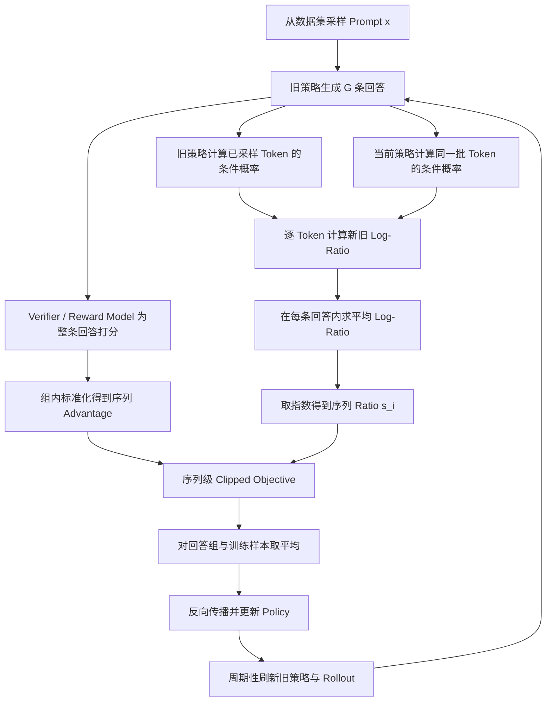

# GSPO：从 Token 级重要性比率到序列级策略优化

> 参考资料：
>
> - 论文：[Group Sequence Policy Optimization](https://arxiv.org/abs/2507.18071)
> - 官方解读：[GSPO: Towards Scalable Reinforcement Learning for Language Models](https://qwenlm.github.io/blog/gspo/)
> - 写作框架参考：[DAPO：从 GRPO 到稳定的长链推理强化学习](https://www.xiaohongshu.com/explore/69e4de63000000001a028d2c)

> [!note]
> GSPO 保留 GRPO 的组采样与组内相对优势估计，但把重要性比率、裁剪和优化单位从 Token 级提升到序列级，使“整条回答获得奖励”与“整条回答接受策略约束”保持一致。它不是把梯度从 Token 上移走：梯度最终仍通过每个 Token 的 Log Probability 回传，只是同一回答内的 Token 共享同一个序列级权重。

## 0. 一句话定位

> **GRPO 用一个序列奖励监督整条回答，却让每个 Token 使用不同的重要性比率；GSPO 把一条回答的 Token 比率汇总为一个长度归一化的序列比率，再对整条回答统一裁剪和更新。**

核心变化可以压缩成一张图：

```text
GRPO
  序列级 Reward / Advantage
          ×
  Token 级 Ratio / Clipping

                 ↓ GSPO

GSPO
  序列级 Reward / Advantage
          ×
  序列级 Ratio / Clipping
```

GSPO 主要想解决两类相互关联的问题：

1. 长序列中 Token 级重要性比率带来的高方差和噪声积累；
2. MoE 模型专家路由变化导致单 Token Log Probability 大幅波动。

## 1. GSPO 的定位

GSPO 全称为 Group Sequence Policy Optimization，由 Qwen 团队提出，并用于 Qwen3 系列模型的强化学习训练。

它继承了 GRPO 的主干：

- 对每个 Prompt 使用旧策略采样一组回答；
- 用同组回答之间的 Reward 差异构造相对 Advantage；
- 不依赖与 Policy 同等规模的 Value Model；
- 通过 Clipped Surrogate Objective 限制一次策略更新的幅度。

它改变的是 Policy Loss 的优化粒度：

| 方法 | Reward / Advantage | Importance Ratio | Clipping | Loss 聚合 |
| --- | --- | --- | --- | --- |
| PPO | 通常为 Token 级 GAE | Token 级 | Token 级 | Token 级 |
| GRPO | 序列 Reward 经组内归一化 | Token 级 | Token 级 | 常见 Token Mean 或 Sequence Mean |
| GSPO | 序列 Reward 经组内归一化 | 长度归一化的序列级 | 序列级 | Sequence Mean + Token Mean |

> [!important]
> GSPO 不是新的 Reward Estimator。它仍然使用 GRPO 的 Group-Relative Advantage；创新集中在 Importance Ratio、Clipping 和梯度权重的粒度。

### 1.1 全文核心符号

后文会反复在“Prompt、回答、Token、概率、目标函数和梯度”几个层次之间切换。先统一符号，后面每次推导只补充当时新增的含义。

| 符号 | 含义 |
| --- | --- |
| $`x`$ | 输入 Prompt；推导单个 Prompt 时通常把它视为已知条件 |
| $`G`$ | 同一个 Prompt 采样的回答数量，也叫 Group Size |
| $`i`$ | 回答编号，取值为 1、2、…、$`G`$ |
| $`y_i`$ | 第 $`i`$ 条完整回答 |
| $`T_i`$ | 第 $`i`$ 条回答的有效 Token 数，不包含 Padding |
| $`t`$ | 回答内部的 Token 位置，取值为 1、2、…、$`T_i`$ |
| $`y_{i,t}`$ | 第 $`i`$ 条回答的第 $`t`$ 个 Token |
| $`y_{i,1:t-1}`$ | 第 $`t`$ 个 Token 之前已经生成的前缀 |
| $`\theta`$ | 正在更新的 Current Policy 参数 |
| $`\theta_{\mathrm{old}}`$ | 生成当前 Rollout Batch 时使用的 Old Policy 参数；在这批更新中固定不变 |
| $`\pi_\theta(y_{i,t}\mid x,y_{i,1:t-1})`$ | Current Policy 在给定 Prompt 和前缀后生成已采样 Token 的条件概率 |
| $`r_i`$ | Verifier 对第 $`i`$ 条完整回答给出的序列级 Reward |
| $`\widehat A_i`$ | 第 $`i`$ 条回答相对同组其他回答的 Advantage |
| $`w_{i,t}`$ | 第 $`i`$ 条回答、第 $`t`$ 个 Token 的新旧策略概率比 |
| $`\rho_i`$ | 未做长度归一化的完整序列概率比，等于所有 $`w_{i,t}`$ 的连乘 |
| $`s_i`$ | GSPO 使用的长度归一化序列 Ratio，等于所有 $`w_{i,t}`$ 的几何平均 |
| $`\varepsilon_{\mathrm{low}},\varepsilon_{\mathrm{high}}`$ | Ratio 允许向下、向上偏离 1 的裁剪范围 |
| $`J(\theta)`$ | 希望最大化的策略目标；越大越好 |
| $`L(\theta)`$ | 训练代码最小化的 Loss，通常取 $`L=-J`$ |
| $`\mathbb E`$ | 对随机采样到的 Prompt 或回答取期望；代码中用 Batch 平均近似 |
| $`\nabla_\theta`$ | 对全部参数 $`\theta`$ 求梯度，结果是“怎样改变参数能最快增大目标”的向量 |
| $`\mathrm{sg}[z]`$ | Stop Gradient：前向数值仍是 $`z`$，反向传播时把它当常数 |
| $`\sum`$ 与 $`\prod`$ | 分别表示求和与连乘 |
| $`\log`$ 与 $`\exp`$ | 分别表示自然对数与指数函数；两者互为逆运算 |
| $`\mathrm{clip}(z,a,b)`$ | 把 $`z`$ 限制在区间 $`[a,b]`$ 内 |
| $`\min(a,b)`$ | 取 $`a`$、$`b`$ 中较小的值 |
| $`\sim`$ | “从某个概率分布中采样” |
| $`\mid`$ | 条件概率中的“在……条件下” |
| $`\propto`$ | “成比例”；表示省略了不影响当前比较的公共系数 |

> [!note]
> 同一个字母的下标表示它属于哪个层次：$`i`$ 区分回答，$`t`$ 区分回答内部的 Token。没有 $`t`$ 下标的 $`r_i`$、$`\widehat A_i`$、$`\rho_i`$ 和 $`s_i`$ 都是整条回答共享的量。

## 2. 从重复使用 Rollout 到 Importance Sampling

这一节先回答一个具体问题：**为什么 PPO、GRPO 和 GSPO 都要比较 Current Policy 与 Old Policy 的概率？**

答案不是“因为公式里规定要有 Ratio”，而是训练系统先制造了一个分布错位：回答由旧策略生成，梯度更新时却希望评价新策略。

### 2.1 Rollout 数据来自 Old Policy

设当前用于生成回答的旧策略为 $`\pi_{\theta_{\mathrm{old}}}`$，正在训练的新策略为 $`\pi_\theta`$。对于输入 $`x`$，Rollout 阶段采样：

```math
y\sim\pi_{\theta_{\mathrm{old}}}(\cdot\mid x)
```

如果生成一批回答后只执行一次极小更新，那么两者近似相同。但大规模 RL 通常会：

1. 使用旧策略生成一个很大的 Rollout Batch；
2. 将 Rollout Batch 切成多个 Mini-Batch；
3. 用这些 Mini-Batch 连续更新当前策略；
4. 训练若干步以后，才重新同步权重并生成下一批 Rollout。

因此，同一批数据在第一次更新时比较新鲜，越到后面的 Mini-Batch 或 Epoch，当前策略 $`\pi_\theta`$ 与生成数据的 $`\pi_{\theta_{\mathrm{old}}}`$ 差异越大：

```text
生成数据时：y ~ π_old
想优化的却是：π_θ 下的期望
```

这就是 Ratio 出现前必须先看见的因果起点。

### 2.2 不做校正时，算到的是哪个期望

暂时把一条回答的训练信号记成 $`F(y)`$。它可以是 Reward、Advantage，或者一个与回答相关的代理目标。

我们真正关心的是当前策略下的期望：

```math
J(\theta)
=
\mathbb E_{y\sim\pi_\theta(\cdot\mid x)}[F(y)]
```

但是手里的回答来自旧策略。如果直接对 Rollout 求平均，估计的是：

```math
\mathbb E_{y\sim\pi_{\theta_{\mathrm{old}}}(\cdot\mid x)}[F(y)]
```

这两个期望一般不相等。原因不是 $`F(y)`$ 发生了变化，而是同一条回答在两个分布下被赋予的概率权重不同。

例如，回答空间暂时只有 $`y_A`$ 和 $`y_B`$：

| 回答 | $`\pi_{\mathrm{old}}`$ | $`\pi_\theta`$ | $`F(y)`$ |
| --- | ---: | ---: | ---: |
| $`y_A`$ | 0.8 | 0.5 | 1 |
| $`y_B`$ | 0.2 | 0.5 | 3 |

旧策略下的期望是：

```math
0.8\times1+0.2\times3=1.4
```

当前策略下的期望却是：

```math
0.5\times1+0.5\times3=2.0
```

如果继续把旧数据中的 $`y_A`$ 当成 0.8 权重、$`y_B`$ 当成 0.2 权重，就无法反映当前策略已经把更多概率放到 $`y_B`$ 上这一事实。

### 2.3 Importance Sampling 怎样换测度

对离散回答空间，当前策略下的期望可以写成求和：

```math
J(\theta)
=
\sum_y\pi_\theta(y\mid x)F(y)
```

在每一项中乘除旧策略概率：

```math
J(\theta)
=
\sum_y
\pi_{\theta_{\mathrm{old}}}(y\mid x)
\frac{\pi_\theta(y\mid x)}
{\pi_{\theta_{\mathrm{old}}}(y\mid x)}
F(y)
```

于是得到：

```math
J(\theta)
=
\mathbb E_{y\sim\pi_{\theta_{\mathrm{old}}}(\cdot\mid x)}
\left[
\rho_\theta(y\mid x)F(y)
\right]
```

其中：

```math
\rho_\theta(y\mid x)
=
\frac{\pi_\theta(y\mid x)}
{\pi_{\theta_{\mathrm{old}}}(y\mid x)}
```

就是 Importance Ratio。

这一步常被称为“换测度”。这里的“测度”不用想得过于抽象：在离散回答空间里，它就是**一个分布给每条回答分配多少概率质量**。$`\pi_{\theta_{\mathrm{old}}}`$ 和 $`\pi_\theta`$ 看的是同一批候选回答，但给它们的权重不同。

因此，换测度并不是改变 $`F(y)`$，也不是重新生成回答，而是把“按照旧分布加权的平均”改写成“仍从旧分布采样、但额外乘一个校正权重的平均”。这个校正权重恰好是目标概率除以采样概率：

```text
旧策略负责：哪些样本更常出现在数据里
Ratio 负责：抵消旧策略的出现频率，再补上当前策略想要的权重
```

于是：

- 如果当前策略比旧策略更容易生成 $`y`$，则 $`\rho_\theta(y\mid x)>1`$，这条样本应当增权；
- 如果当前策略比旧策略更不容易生成 $`y`$，则 $`\rho_\theta(y\mid x)<1`$，这条样本应当降权；
- 当两者相同，$`\rho_\theta(y\mid x)=1`$，旧样本不需要校正。

回到上面的两回答例子：

```math
\rho(y_A)=\frac{0.5}{0.8}=0.625
```

```math
\rho(y_B)=\frac{0.5}{0.2}=2.5
```

用旧策略样本加权：

```math
0.8\times0.625\times1
+
0.2\times2.5\times3
=2.0
```

正好恢复当前策略下的目标期望。

实际训练看不到回答空间中所有可能的 $`y`$，只能拿到 $`N`$ 条 Rollout，因此用 Monte Carlo 平均近似上面的期望：

```math
\widehat J(\theta)
=
\frac{1}{N}
\sum_{n=1}^{N}
\rho_\theta(y^{(n)}\mid x)F(y^{(n)})
```

其中每个 $`y^{(n)}`$ 都由 $`\pi_{\theta_{\mathrm{old}}}`$ 采样。Importance Sampling 恒等式保证的是：在支持集等条件成立、Ratio 计算准确时，这个随机估计量对目标期望是无偏的；它不保证有限 $`N`$ 时每个 Batch 都接近真实期望。

> [!important]
> Importance Sampling 没有把旧样本“变成”新样本。它只是在求平均时重新分配样本权重，从而校正采样分布与目标分布之间的差异。

### 2.4 Importance Sampling 成立需要什么条件

上述变换隐含一个支持集条件：只要当前策略可能生成某个回答，旧策略也必须有机会采到它。否则会出现：

```math
\pi_\theta(y\mid x)>0
```

```math
\pi_{\theta_{\mathrm{old}}}(y\mid x)=0
```

此时 Ratio 分母为 0，而旧数据中永远不会出现这条回答，无法仅靠重新加权恢复它的贡献。

标准 Softmax 通常给词表中的 Token 非零概率，但实际 Rollout 还可能使用 Top-k、Top-p、屏蔽规则或约束解码。这时严格的行为分布应当包含这些 Sampling Transformation；如果训练只使用原始模型概率，Importance Ratio 已经带有近似。

### 2.5 为什么无偏换测度仍可能不稳定

Importance Sampling 的恒等式只说明期望正确，不保证有限样本估计稳定。如果某条回答在旧策略下很罕见、在当前策略下却很常见：

```math
\pi_{\theta_{\mathrm{old}}}(y\mid x)\ll\pi_\theta(y\mid x)
```

就会得到很大的 $`\rho_\theta(y\mid x)`$。少数罕见样本可能支配整个 Batch 的梯度，造成高方差和更新尖峰。

PPO 系方法因此不直接信任任意大小的 Ratio，而是引入：

```math
\mathrm{clip}
\left(
\rho_\theta(y\mid x),
1-\varepsilon_{\mathrm{low}},
1+\varepsilon_{\mathrm{high}}
\right)
```

这里需要看清一个取舍：

- 不裁剪的 Importance Sampling 在条件满足时具有正确的换测度含义，但方差可能很大；
- 裁剪限制极端权重、提高训练稳定性，却有意引入偏差；
- PPO、GRPO、GSPO 优先追求可控的优化动力学，而不是构造完全无偏的离线估计器。

### 2.6 Importance Sampling 公式没有决定优化粒度

一般公式写成：

```math
\mathbb E_{z\sim p_{\mathrm{tar}}}[f(z)]
=
\mathbb E_{z\sim p_{\mathrm{beh}}}
\left[
\frac{p_{\mathrm{tar}}(z)}{p_{\mathrm{beh}}(z)}f(z)
\right]
```

这里最容易被忽略的问题是：**随机变量 $`z`$ 到底是什么？**

- 如果 $`f`$ 评价单个动作，$`z`$ 可以是一个动作；
- 如果 $`f`$ 评价完整轨迹，$`z`$ 应当是完整轨迹；
- 在 Outcome Reward 的 LLM RL 中，Verifier 通常评价整条回答，因此自然的随机变量是完整回答 $`y`$。

这正是下一节必须引入序列概率的原因。Importance Sampling 告诉我们需要：

```math
\frac{\pi_\theta(y\mid x)}
{\pi_{\theta_{\mathrm{old}}}(y\mid x)}
```

但语言模型并不会一次直接输出这个序列概率；它只在每个位置输出 Next-Token 条件概率。接下来要做的不是突然换话题，而是把上式中的 $`\pi_\theta(y\mid x)`$ 展开成模型实际能够计算的量。

## 3. 从完整回答到自回归序列概率

上一节已经确定：对于整条回答获得一个 Reward 的任务，换测度所需的对象是完整回答概率 $`\pi_\theta(y\mid x)`$。本节沿着模型的生成过程，把这个量逐步拆成 Token Log Probability。

### 3.1 一次 Rollout 是序列空间中的一个样本

固定 Prompt $`x`$ 后，语言模型的样本空间不是“词表里的一个 Token”，而是所有可能的完整回答：

```math
y=(y_1,y_2,\ldots,y_T)
```

$`T`$ 可以由 EOS 决定，也可以受到最大生成长度限制。不同回答可能具有不同长度。

如果回答以 EOS 正常结束，EOS 也应视为这条生成路径的一部分；遗漏 EOS 概率，相当于计算“生成此前缀”的概率，而不是“恰好在这里结束的完整回答”的概率。比较新旧策略时，两边必须使用同一个序列边界定义。

自回归生成可以想象成在一棵生成树上行走：

```text
Prompt x
  ├─ y₁=A
  │    ├─ y₂=C
  │    └─ y₂=EOS
  └─ y₁=B
       ├─ y₂=D
       └─ y₂=EOS
```

每个节点的分支概率由当前前缀下的 Next-Token Distribution 给出。一条完整回答就是从根节点走到 EOS 的一条路径。

因此必须区分两个层次：

| 层次 | 随机对象 | 概率含义 |
| --- | --- | --- |
| Token 级 | 给定前缀后的下一 Token $`y_t`$ | 一条边的条件概率 |
| 序列级 | 完整回答 $`y_{1:T}`$ | 一整条路径的联合概率 |

Outcome Verifier 为整条路径给出 $`r(x,y)`$。所以从 Importance Sampling 的角度，一次 Rollout 是序列空间中的一个样本，而不是 $`T`$ 个彼此独立的 Token 样本。

### 3.2 为什么序列概率是条件概率的连乘

考虑两 Token 回答 $`y=(y_1,y_2)`$。概率链式法则给出：

```math
\pi_\theta(y_1,y_2\mid x)
=
\pi_\theta(y_1\mid x)
\pi_\theta(y_2\mid x,y_1)
```

扩展到 $`T`$ 个 Token：

```math
\pi_\theta(y\mid x)
=
\prod_{t=1}^{T}
\pi_\theta(y_t\mid x,y_{1:t-1})
```

这个乘积不是在假设 Token 相互独立。恰恰相反，每一项都显式依赖此前生成的全部 Token：

```math
s_t=(x,y_{1:t-1})
```

使用状态记号，可以简写为：

```math
\pi_\theta(y\mid x)
=
\prod_{t=1}^{T}\pi_\theta(y_t\mid s_t)
```

一个简单例子：

- 模型在 Prompt 后生成 `A` 的概率是 0.6；
- 在已经生成 `A` 后生成 `EOS` 的概率是 0.2。

那么完整回答 `(A, EOS)` 的概率是：

```math
0.6\times0.2=0.12
```

这就是“路径概率等于沿途边概率之积”。

由于许多小概率直接相乘会数值下溢，工程实现转到 Log 空间：

```math
\log\pi_\theta(y\mid x)
=
\sum_{t=1}^{T}
\log\pi_\theta(y_t\mid s_t)
```

所以训练系统保存的 `(batch_size, response_length)` Token Logprob，经过 Mask 后按序列求和，就能恢复每条回答的 Sequence Logprob。

### 3.3 为什么序列 Ratio 是 Token Ratio 的连乘

上一节需要的新旧策略序列概率比是：

```math
\rho_\theta(y\mid x)
=
\frac{\pi_\theta(y\mid x)}
{\pi_{\theta_{\mathrm{old}}}(y\mid x)}
```

分别展开分子和分母：

```math
\rho_\theta(y\mid x)
=
\frac{
\prod_{t=1}^{T}\pi_\theta(y_t\mid s_t)
}{
\prod_{t=1}^{T}\pi_{\theta_{\mathrm{old}}}(y_t\mid s_t)
}
```

同一位置的分子、分母配对：

```math
\rho_\theta(y\mid x)
=
\prod_{t=1}^{T}
\frac{
\pi_\theta(y_t\mid s_t)
}{
\pi_{\theta_{\mathrm{old}}}(y_t\mid s_t)
}
```

定义 Token Ratio：

```math
w_t(\theta)
=
\frac{
\pi_\theta(y_t\mid s_t)
}{
\pi_{\theta_{\mathrm{old}}}(y_t\mid s_t)
}
```

分子和分母必须在**同一条旧策略实际采到的路径、同一个前缀 $`s_t`$、同一个已采样 Token $`y_t`$** 上计算。Current Policy 不需要重新采样另一条回答；它只需要对旧回答做一次 Teacher Forcing，给出这条既定路径上每个 Token 的 Logprob。

就得到：

```math
\rho_\theta(y\mid x)
=
\prod_{t=1}^{T}w_t(\theta)
```

继续使用两 Token 回答 `(A, EOS)`。假设旧策略给出的两个条件概率分别为 0.6 和 0.2，而当前策略在同一前缀上给出 0.5 和 0.4，那么：

```math
\pi_{\mathrm{old}}(A,\mathrm{EOS}\mid x)
=
0.6\times0.2=0.12
```

```math
\pi_\theta(A,\mathrm{EOS}\mid x)
=
0.5\times0.4=0.20
```

序列 Ratio 直接计算为：

```math
\rho
=
\frac{0.20}{0.12}
\approx1.667
```

两个 Token Ratio 分别为 $`0.5/0.6\approx0.833`$ 和 $`0.4/0.2=2`$，连乘后仍然得到：

```math
0.833\times2\approx1.667
```

这不是 GSPO 额外规定的公式，而是“联合概率的比值”在自回归分解下必然得到的结果。

对应的 Token Log-Ratio 为：

```math
\delta_t
=
\log\pi_\theta(y_t\mid s_t)
-
\log\pi_{\theta_{\mathrm{old}}}(y_t\mid s_t)
```

在 Log 空间中，序列 Ratio 的连乘变成求和：

```math
\log\rho_\theta(y\mid x)
=
\sum_{t=1}^{T}\delta_t
```

至此，前两节的链条闭合：

```text
目标：当前策略下的序列 Reward 期望
  ↓ 旧策略生成了训练样本，需要换测度
完整回答 Importance Ratio ρ(y)
  ↓ 自回归概率链式法则
所有 Token Ratio 的连乘
  ↓ 转到 Log 空间
所有 Token Log-Ratio 的求和
```

但这里又产生一个新的问题：原始序列 Ratio 会随长度迅速爆炸或消失。

假设每个 Token Ratio 都只有很小偏移：

```math
w_t=1.001
```

当 $`T=4000`$ 时：

```math
\rho=(1.001)^{4000}\approx54.5
```

反过来，如果：

```math
w_t=0.999
```

则：

```math
\rho=(0.999)^{4000}\approx0.0183
```

单 Token 只有千分之一的平均变化，完整序列 Ratio 却横跨几个数量级。回答长度不同，Ratio 的典型尺度也不同。

这解释了后续两个设计选择为什么会出现：

1. GRPO 避开完整连乘，直接在 Token 级使用 $`w_t`$；
2. GSPO 从序列 Ratio 出发，但对 Log-Ratio 按长度求平均，也就是对 $`\rho`$ 取 $`T`$ 次方根。

第 4 节先补上 Group-Relative Advantage；第 5 节分析 Token 级做法的问题；第 6 节再正式推导 GSPO 的长度归一化序列 Ratio。

## 4. GRPO 的基础目标

### 4.1 Group-Relative Advantage

对于同一个 Prompt $`x`$，旧策略采样 $`G`$ 条回答：

```math
\{y_i\}_{i=1}^{G}
\sim
\pi_{\theta_{\mathrm{old}}}(\cdot\mid x)
```

第 3 节只讨论一条回答，所以使用了 $`y`$、$`\rho_\theta`$ 和 $`w_t`$。现在组内有 $`G`$ 条回答，为每条回答加上下标 $`i`$ 后，相应记号变成 $`y_i`$、$`\rho_i`$ 和 $`w_{i,t}`$；概率含义没有变化。

验证器给出序列级 Reward：

```math
r_i=r(x,y_i)
```

GRPO 和 GSPO 都使用组内标准化 Advantage：

```math
\widehat A_i
=
\frac{
r_i-\mathrm{mean}(r_1,\ldots,r_G)
}{
\mathrm{std}(r_1,\ldots,r_G)+\epsilon_A
}
```

这条公式分成三步：

1. $`\mathrm{mean}(r_1,\ldots,r_G)`$ 计算同一 Prompt 下 $`G`$ 条回答的平均 Reward；
2. $`r_i-\mathrm{mean}(\cdot)`$ 判断第 $`i`$ 条回答比组内平均更好还是更差；
3. 再除以组内标准差 $`\mathrm{std}(\cdot)`$，使不同 Prompt 下 Advantage 的数值尺度更接近。

$`\epsilon_A`$ 是一个很小的正常数，只用于防止所有 Reward 相同时分母为 0。最终 $`\widehat A_i>0`$ 表示回答优于组内平均，$`\widehat A_i<0`$ 表示回答劣于组内平均。

同一回答中的 Token 通常共享同一个 $`\widehat A_i`$：

```math
\widehat A_{i,t}=\widehat A_i
```

它表达的是“这条回答相对同一个问题下的其他回答更好还是更差”，而不是第 $`t`$ 个 Token 单独有多好。

### 4.2 GRPO 的 Token 级目标

忽略额外 KL 正则时，GRPO 的核心目标是：

```math
J_{\mathrm{GRPO}}(\theta)
=
\mathbb E
\left[
\frac{1}{G}
\sum_{i=1}^{G}
\frac{1}{T_i}
\sum_{t=1}^{T_i}
\min
\left(
w_{i,t}(\theta)\widehat A_i,
\mathrm{clip}(w_{i,t}(\theta),1-\varepsilon,1+\varepsilon)\widehat A_i
\right)
\right]
```

从内向外读这条公式：

- 对每个 Token，比较“原始代理项” $`w_{i,t}\widehat A_i`$ 与“裁剪后的代理项” $`\mathrm{clip}(w_{i,t},1-\varepsilon,1+\varepsilon)\widehat A_i`$；
- $`\min`$ 选择更保守的那个值，防止策略通过让 Ratio 过度偏离 1 持续提高目标；
- $`\sum_t/T_i`$ 先在一条回答内部对 Token 求平均；
- $`\sum_i/G`$ 再对同一个 Prompt 的 $`G`$ 条回答求平均；
- 最外层 $`\mathbb E`$ 表示还要对训练中采到的不同 Prompt 和 Rollout Batch 取平均。

$`J_{\mathrm{GRPO}}`$ 是要最大化的目标。训练框架如果采用梯度下降，实际最小化的是 $`L_{\mathrm{GRPO}}=-J_{\mathrm{GRPO}}`$，两种写法描述的是同一更新方向。

这里出现了 GSPO 论文认为不协调的地方：

| 信号 | 粒度 |
| --- | --- |
| Reward $`r_i`$ | 整条回答 |
| Advantage $`\widehat A_i`$ | 整条回答 |
| Ratio $`w_{i,t}`$ | 单个 Token |
| Clipping | 单个 Token |

## 5. GSPO 认为 GRPO 的问题在哪里

### 5.1 一个条件分布通常只有一个 Token 样本

在固定前缀 $`(x,y_{i,1:t-1})`$ 上，Rollout 通常只采到一个 Token $`y_{i,t}`$。GRPO 用这个单样本对应的 Ratio 修正该 Token 的梯度，但没有在同一个前缀上取得大量 next-token 样本来平均 Ratio。

GSPO 论文认为，这使 Token Ratio 很难发挥传统 Importance Sampling 的分布校正作用，反而将单 Token 的概率波动直接注入梯度。

> [!warning]
> 更严谨地说，Importance Sampling 并非原则上不能用于自回归轨迹；轨迹级 IS、Per-Decision IS 都有严格定义。GSPO 批评的是：**共享一个序列 Advantage，却把每个 Token 的单样本条件概率比当作独立权重的 GRPO 目标，不等同于标准的完整轨迹校正。**

### 5.2 从 GRPO 目标到梯度：Token Ratio 怎样影响参数更新

第 4.2 节写的是 GRPO 的目标函数，但只看目标值还不能回答一个关键问题：**回答中的每个 Token 最终以多大力度修改模型参数？**

优化器并不直接拿目标函数的数值更新模型，而是先计算它对参数的梯度。因此，这里引入梯度不是突然换到另一个分析角度，而是在继续追问第 4.2 节的 Loss 会产生什么实际更新。

#### 5.2.1 先看没有触发裁剪的一条回答

暂时忽略 Batch 平均和 Clipping。第 $`i`$ 条回答对应的未裁剪 GRPO 目标是：

```math
J_i^{\mathrm{GRPO}}(\theta)
=
\frac{\widehat A_i}{T_i}
\sum_{t=1}^{T_i}w_{i,t}(\theta)
```

这条公式中的每一部分分别表示：

- $`J_i^{\mathrm{GRPO}}`$：第 $`i`$ 条回答对“要最大化的策略目标”的贡献；
- $`\widehat A_i`$：整条回答相对同组回答更好还是更差；
- $`1/T_i`$：先对这条回答的有效 Token 求平均，避免仅因回答更长就获得更大权重；
- $`w_{i,t}`$：第 $`t`$ 个 Token 在 Current Policy 与 Old Policy 下的概率比。

Token Ratio 的定义是：

```math
w_{i,t}(\theta)
=
\frac{
\pi_\theta(y_{i,t}\mid x,y_{i,1:t-1})
}{
\pi_{\theta_{\mathrm{old}}}(y_{i,t}\mid x,y_{i,1:t-1})
}
```

旧策略在当前 Batch 中固定不变，因此分母对 $`\theta`$ 的梯度为 0。先对 Ratio 直接求导：

```math
\nabla_\theta w_{i,t}(\theta)
=
\frac{1}{
\pi_{\theta_{\mathrm{old}}}(y_{i,t}\mid x,y_{i,1:t-1})
}
\nabla_\theta
\pi_\theta(y_{i,t}\mid x,y_{i,1:t-1})
```

再利用恒等式 $`\nabla_\theta p_\theta=p_\theta\nabla_\theta\log p_\theta`$，可以得到：

```math
\nabla_\theta w_{i,t}(\theta)
=
w_{i,t}(\theta)
\nabla_\theta
\log\pi_\theta(y_{i,t}\mid x,y_{i,1:t-1})
```

这里的 $`\nabla_\theta\log\pi_\theta`$ 常被称为 Score Function。它不是新的概率，而是一个与模型参数同维度的向量，表示“怎样改变参数，能最快提高这个已采样 Token 的 Log Probability”。

#### 5.2.2 代回目标函数以后，每个 Token 怎样影响梯度

对未裁剪目标求梯度：

```math
\nabla_\theta J_i^{\mathrm{GRPO}}(\theta)
=
\frac{\widehat A_i}{T_i}
\sum_{t=1}^{T_i}
w_{i,t}(\theta)
\nabla_\theta
\log\pi_\theta(y_{i,t}\mid x,y_{i,1:t-1})
```

不要把这条公式只看成一串符号。它是在说：整条回答产生的参数更新，是所有 Token 更新方向的加权和。

对第 $`t`$ 个 Token 来说：

```text
Token 的更新贡献
= 整条回答好坏 A_i
× 长度归一化 1/T_i
× 自己的新旧概率比 w_i,t
× 提高自己 Log Probability 的方向
```

其中：

- $`\widehat A_i>0`$ 时，整体方向倾向于提高这条回答中已采样 Token 的概率；
- $`\widehat A_i<0`$ 时，整体方向反转，倾向于降低这些 Token 的概率；
- $`w_{i,t}`$ 决定第 $`t`$ 个 Token 的方向在总梯度中被放大还是缩小；
- $`\nabla_\theta\log\pi_\theta`$ 决定这个 Token 具体推动哪些参数、朝哪个方向变化。

因此，即使同一回答中的所有 Token 共享同一个 $`\widehat A_i`$，它们仍可能因为 $`w_{i,t}`$ 不同而获得不同的更新强度。

#### 5.2.3 为什么长序列更容易暴露这个问题

假设一条正 Advantage 回答中，四个 Token Ratio 分别是：

```math
(0.7,1.0,1.1,1.5)
```

虽然 Verifier 只说“整条回答较好”，GRPO 却会分别用 0.7、1.0、1.1、1.5 缩放四个 Token 的梯度方向。第四个 Token 的更新权重超过第一个 Token 两倍，但这个差异来自新旧策略概率变化，并不等于 Verifier 认为第四个 Token 对正确答案更重要。

序列变长后，更容易出现至少一个异常 Ratio 或越过裁剪边界的 Token。这里也不能简单认为不同 Token 的噪声一定会通过求平均互相抵消，因为：

1. 不同 Token 的 $`\nabla_\theta\log\pi_\theta`$ 是方向不同的向量，不是同一个标量；
2. Token Ratio 的波动不一定独立，也不一定以 1 为中心对称；
3. 一旦某些 Token 触发 Clipping，它们与未裁剪 Token 遵循不同的梯度规则。

所以更准确的说法不是“Token 数越多，梯度方差必然线性增加”，而是：**长序列提供了更多 Ratio 波动和局部裁剪机会，使同一个序列 Advantage 被拆成越来越不一致的 Token 更新。**

### 5.3 Token 裁剪怎样进一步拆散同一条回答

第 5.2 节暂时忽略了 Clipping。现在把它放回来。GRPO 对每个 Token 都单独比较：

```math
w_{i,t}\widehat A_i
```

与：

```math
\mathrm{clip}(w_{i,t},1-\varepsilon,1+\varepsilon)\widehat A_i
```

再由 $`\min`$ 选择更保守的分支。假设 $`\varepsilon=0.2`$，允许的 Token Ratio 区间就是 $`[0.8,1.2]`$。

对于正 Advantage 回答，Ratio 为 1.5 的 Token 已经把概率提高得过多，裁剪分支只按 1.2 计算；当目标落在这个平坦的裁剪分支上时，继续增大该 Token 的 Ratio 不再带来收益。与此同时，同一回答中 Ratio 为 1.0 或 1.1 的 Token 仍可以继续更新。

对于负 Advantage 回答，逻辑方向相反：Ratio 低于 0.8 表示这个 Token 的概率已经降得足够多，裁剪阻止它继续从过度下降中获得目标收益；Ratio 仍在区间内的其他 Token 则继续更新。

因此，一条回答虽然只有一个序列 Advantage，进入梯度时却可能被分成三类 Token：

1. 未越界、继续正常更新的 Token；
2. Ratio 不同、因而更新强度不同的 Token；
3. 已落入裁剪平坦区、当前不再提供对应方向梯度的 Token。

但序列级 Reward 只告诉模型“整条回答相对更好或更差”，并没有提供哪个 Token 应该承担更多 Credit 的信息。单纯依靠 Token Ratio 和独立裁剪形成不同权重，不等于获得了可靠的 Token-Level Credit Assignment。这正是 GSPO 要把 Ratio 与 Clipping 统一到回答级别的直接原因。

## 6. GSPO 的序列级 Importance Ratio

现在可以把前面的矛盾合在一起：

- 第 2、3 节说明，序列 Reward 对应的严格换测度权重是完整序列 Ratio $`\rho_i=\prod_t w_{i,t}`$；
- 第 3.3 节说明，这个连乘会让 Ratio 的尺度随长度指数变化；
- 第 5 节说明，完全退回 Token 级 $`w_{i,t}`$ 又会让同一个序列 Advantage 在 Token 间接受不同权重和不同裁剪决定。

GSPO 的选择是保留“同一条回答只使用一个 Ratio”的序列粒度，同时消除原始连乘对长度的指数敏感性。实现这一折中的操作，就是对序列 Log-Ratio 按有效 Token 数取平均。

### 6.1 长度归一化

GSPO 不直接使用原始序列 Ratio $`\rho_i`$，而是取 $`T_i`$ 次方根：

```math
s_i(\theta)
=
\left(
\frac{
\pi_\theta(y_i\mid x)
}{
\pi_{\theta_{\mathrm{old}}}(y_i\mid x)
}
\right)^{1/T_i}
```

代入 Token Ratio：

```math
s_i(\theta)
=
\left(
\prod_{t=1}^{T_i}w_{i,t}(\theta)
\right)^{1/T_i}
```

所以 $`s_i`$ 是整条回答所有 Token Ratio 的几何平均。

这里：

- $`\pi_\theta(y_i\mid x)`$ 是 Current Policy 生成完整回答 $`y_i`$ 的序列概率；
- $`\pi_{\theta_{\mathrm{old}}}(y_i\mid x)`$ 是 Old Policy 对同一回答的序列概率；
- 两者的比值 $`\rho_i`$ 是原始序列 Ratio；
- 指数 $`1/T_i`$ 把原始序列 Ratio 平均到每个有效 Token 的尺度；
- 得到的 $`s_i`$ 仍然属于整条回答，而不是第 $`t`$ 个 Token。

在 Log 空间计算更清楚：

```math
\log s_i(\theta)
=
\frac{1}{T_i}
\sum_{t=1}^{T_i}
\left[
\log\pi_\theta(y_{i,t}\mid x,y_{i,1:t-1})
-
\log\pi_{\theta_{\mathrm{old}}}(y_{i,t}\mid x,y_{i,1:t-1})
\right]
```

最后：

```math
s_i(\theta)=\exp(\log s_i(\theta))
```

### 6.2 几何平均的直觉

假设一条回答有四个 Token，Token Ratio 分别为：

```math
(1.02,0.98,1.01,0.99)
```

算术平均接近 1，但它没有序列概率比的乘法语义。GSPO 使用几何平均：

```math
s
=
(1.02\times0.98\times1.01\times0.99)^{1/4}
```

它保留“序列概率由 Token 概率相乘得到”的结构，同时避免原始乘积随序列长度指数缩放。

### 6.3 长度归一化改变了什么

长度归一化带来两个效果：

1. 不同回答长度下的 Ratio 更容易落在相近数值区间；
2. Clipping Range 不必随回答长度显著变化。

但也要注意：

> $`s_i=\rho_i^{1/T_i}`$ 不再是原始的严格 Importance Sampling Weight，而是一个长度归一化的序列级代理目标。

因此，GSPO 的优势主要来自优化动力学和训练稳定性，而不是“完全恢复了严格无偏的 Importance Sampling”。

## 7. GSPO 的完整目标

GSPO 使用序列级 Clipped Surrogate Objective：

```math
J_{\mathrm{GSPO}}(\theta)
=
\mathbb E
\left[
\frac{1}{G}
\sum_{i=1}^{G}
\min
\left(
s_i(\theta)\widehat A_i,
\mathrm{clip}(s_i(\theta),1-\varepsilon_{\mathrm{low}},1+\varepsilon_{\mathrm{high}})\widehat A_i
\right)
\right]
```

这条公式与 GRPO 目标的外层结构相似，但内部不再对 Token Ratio 分别取 $`\min`$。逐层看：

- $`s_i\widehat A_i`$ 是第 $`i`$ 条回答未经裁剪的代理收益；
- $`\mathrm{clip}(s_i,1-\varepsilon_{\mathrm{low}},1+\varepsilon_{\mathrm{high}})`$ 把整条回答的 Ratio 限制在允许区间；
- $`\min`$ 选择原始分支和裁剪分支中更保守的值；
- $`1/G\sum_i`$ 对同一 Prompt 的回答求平均；
- $`\mathbb E`$ 再对训练中采样的 Prompt 与回答组取期望。

最重要的变化是：公式内部只有回答下标 $`i`$，没有 Token 下标 $`t`$。这说明 Ratio 与裁剪决策都以完整回答为单位。

训练代码通常最小化相反数：

```math
L_{\mathrm{GSPO}}(\theta)=-J_{\mathrm{GSPO}}(\theta)
```

### 7.1 正 Advantage

当 $`\widehat A_i>0`$ 时，希望提高整条回答的概率。如果：

```math
s_i(\theta)>1+\varepsilon_{\mathrm{high}}
```

说明新策略已经把这条回答的长度归一化概率提高得太多，继续提高不再增加代理目标的收益。

### 7.2 负 Advantage

当 $`\widehat A_i<0`$ 时，希望降低整条回答的概率。如果：

```math
s_i(\theta)<1-\varepsilon_{\mathrm{low}}
```

说明这条回答的概率已经下降得足够多，代理目标阻止策略继续从过度下降中获益。

### 7.3 为什么论文里的 Clip Range 很小

论文实验为 GSPO 使用：

```math
\varepsilon_{\mathrm{low}}=3\times10^{-4}
```

```math
\varepsilon_{\mathrm{high}}=4\times10^{-4}
```

这远小于 PPO/GRPO 中常见的 0.1 或 0.2，因为 GSPO 裁剪的是“平均到每个 Token 后的序列几何平均 Ratio”，它与 Token Ratio 的数值尺度不同。

> [!warning]
> 这个范围来自论文特定模型和训练设置，不应机械迁移到所有模型。只要 Ratio 定义、回答长度分布或新旧策略偏移程度不同，就需要重新观察 $`s_i`$ 分布与 Clip Fraction。

## 8. GSPO 的梯度为什么仍然落在 Token 上

第 7 节的目标已经没有 Token 下标，容易产生一个疑问：模型明明逐 Token 输出概率，序列级目标怎样把梯度传回 Transformer？这一节只回答这个问题。

先忽略 Clipping，并固定一条没有触发裁剪的回答。它的目标为：

```math
J_i(\theta)=s_i(\theta)\widehat A_i
```

求梯度：

```math
\nabla_\theta J_i(\theta)
=
s_i(\theta)\widehat A_i
\nabla_\theta\log s_i(\theta)
```

这里使用了恒等式 $`\nabla_\theta s_i=s_i\nabla_\theta\log s_i`$。$`\widehat A_i`$ 来自已经完成的 Rollout 与 Reward 计算，在当前 Policy 更新中当作常数，因此不对它求导。

而：

```math
\log s_i(\theta)
=
\frac{1}{T_i}
\sum_{t=1}^{T_i}
\left[
\log\pi_\theta(y_{i,t}\mid x,y_{i,1:t-1})
-
\log\pi_{\theta_{\mathrm{old}}}(y_{i,t}\mid x,y_{i,1:t-1})
\right]
```

旧策略不依赖 $`\theta`$，所以：

```math
\nabla_\theta\log s_i(\theta)
=
\frac{1}{T_i}
\sum_{t=1}^{T_i}
\nabla_\theta
\log\pi_\theta(y_{i,t}\mid x,y_{i,1:t-1})
```

这一步表示：Old Policy 的 Log Probability 在求导时消失，Current Policy 的序列 Log Probability 则按照自回归分解，变成所有 Token Log Probability 梯度的平均。

代回得到：

```math
\nabla_\theta J_i(\theta)
=
s_i(\theta)\widehat A_i
\frac{1}{T_i}
\sum_{t=1}^{T_i}
\nabla_\theta
\log\pi_\theta(y_{i,t}\mid x,y_{i,1:t-1})
```

这说明：

- 序列级权重是 $`s_i\widehat A_i`$；
- 每个 Token 都通过自己的 $`\nabla\log\pi_\theta`$ 参与更新；
- 同一回答内的 Token 不再乘不同的 Token Ratio。

换句话说，“序列级”描述的是**如何计算并共享梯度前面的标量权重**，不是说模型突然拥有了一个不经过 Token 的序列输出头。

GRPO 则近似为：

```math
\nabla_\theta J_i^{\mathrm{GRPO}}
\propto
\widehat A_i
\frac{1}{T_i}
\sum_{t=1}^{T_i}
w_{i,t}(\theta)
\nabla_\theta
\log\pi_\theta(y_{i,t}\mid x,y_{i,1:t-1})
```

两者最核心的差别是：

```text
GRPO：每个 Token 的梯度 × 自己的 w_i,t
GSPO：每个 Token 的梯度 × 同一个 s_i
```

## 9. 为什么 GSPO 对 MoE 更稳定

到这里已经完整定义了 GSPO，接下来再看它为什么特别适合 MoE。MoE 不是推出 GSPO 公式的前提，而是一个会显著放大 Token Ratio 波动的模型结构。

### 9.1 MoE 为什么会放大单 Token Log Probability 波动

MoE 模型在每一层通常包含一个 Router 和多个 Expert。对于同一个 Token，Router 只选择少数 Expert 参与计算：

```text
Token Hidden State
        ↓
      Router
        ↓
选择少数 Expert → 合并 Expert 输出 → 计算下一个 Token 概率
```

策略参数更新以后，即使输入 Prompt、前缀和目标 Token 完全相同，Router 的打分也可能发生变化，使 Current Policy 与 Old Policy 选择不同的 Expert。由于后续计算经过了不同子网络，该 Token 的概率可能产生比 Dense 模型更明显的跳变。

论文在一个 48 层 Qwen3-30B-A3B-Base 模型上观察到：对同一个 Rollout 样本执行更新后，新旧策略激活的 Expert 约有 10% 不同。这里真正影响策略优化的因果链是：

```text
Router 选择变化
→ Token 经过不同 Expert
→ Token Log Probability 变化
→ Token Ratio w_i,t 波动
→ GRPO 中该 Token 的梯度权重和裁剪状态变化
```

### 9.2 GRPO 与 GSPO 怎样处理同一组波动

GRPO 为每个 Token 单独使用：

```math
w_{i,t}
=
\frac{\pi_\theta(y_{i,t}\mid x,y_{i,1:t-1})}
{\pi_{\theta_{\mathrm{old}}}(y_{i,t}\mid x,y_{i,1:t-1})}
```

如果某个 Token 因路由变化得到异常 $`w_{i,t}`$，这个异常值会直接缩放该 Token 的梯度，还可能独立触发 Clipping。

GSPO 先计算整条回答的平均 Log-Ratio：

```math
\log s_i
=
\frac{1}{T_i}
\sum_{t=1}^{T_i}\log w_{i,t}
```

然后整条回答共享 $`s_i`$。如果路由变化只让少量 Token 的 Log-Ratio 出现正负波动，序列平均会降低单个异常 Token 对最终权重的控制力；裁剪判断也从每个 Token 一次变成每条回答一次。

这就是 GSPO 对 MoE 更稳定的算法原因：**它没有消除 Router 波动，而是改变了波动进入 Policy Gradient 的聚合方式。**

> [!warning]
> 序列平均只能缓和局部、方向不完全一致的波动。如果大量 Token 的 Log Probability 都发生同方向系统性偏移，$`s_i`$ 仍然会明显偏离 1，不能把 GSPO 理解成自动修复 MoE 路由不一致。

论文实验中，GSPO 在不使用 Routing Replay 的情况下也能稳定训练 MoE。Routing Replay 会强制 Current Policy 重用 Old Policy 的 Expert 路由；GSPO 的结果说明，通过序列级聚合降低局部 Ratio 敏感性，也可以成为另一条稳定化路径。

## 10. GSPO-token：需要 Token Advantage 时怎么办

标准 GSPO 假设同一回答中所有 Token 共用 $`\widehat A_i`$。在多轮 Agent、过程奖励或局部工具调用场景中，可能希望使用 $`\widehat A_{i,t}`$。

论文给出 GSPO-token：

```math
s_{i,t}(\theta)
=
\mathrm{sg}[s_i(\theta)]
\frac{
\pi_\theta(y_{i,t}\mid x,y_{i,1:t-1})
}{
\mathrm{sg}[\pi_\theta(y_{i,t}\mid x,y_{i,1:t-1})]
}
```

$`\mathrm{sg}`$ 表示 Stop Gradient。

这里新增的 $`s_{i,t}`$ 是分配给第 $`i`$ 条回答中第 $`t`$ 个 Token 的代理权重；$`\widehat A_{i,t}`$ 则允许不同 Token 使用不同 Advantage。Stop Gradient 用来人为指定哪些因子只参与前向数值、哪些因子承担反向梯度。

第二个分数的前向数值恒为 1，因此：

```math
s_{i,t}(\theta)=s_i(\theta)
```

但反向传播时，梯度只通过分子中的当前 Token Log Probability 流动。这样可以做到：

- 前向时，所有 Token 使用相同的序列 Ratio；
- 反向时，每个 Token 可以乘自己的 $`\widehat A_{i,t}`$。

当：

```math
\widehat A_{i,t}=\widehat A_i
```

GSPO-token 与标准 GSPO 在目标数值、裁剪条件和理论梯度上等价。

## 11. 一次完整训练链路



这条链路只强调算法中的随机变量和变换关系：旧策略负责采样，Verifier 产生序列 Reward，组内比较产生 Advantage，新旧概率产生序列 Ratio，最后由裁剪目标决定参数更新。具体张量布局和训练框架不属于本文范围。

## 12. 实验结果应该怎样读

论文从 Qwen3-30B-A3B-Base 的 Cold-Start Checkpoint 开始训练，并在以下任务评估：

- AIME 2024；
- LiveCodeBench；
- CodeForces。

论文对比中：

- Rollout Batch 被划分为 4 个 Mini-Batch 更新；
- GRPO 配合 Routing Replay；
- GSPO 使用 $`3\times10^{-4}`$ 与 $`4\times10^{-4}`$ 的左右 Clip Range；
- GRPO 使用 0.2 与 0.27 的左右 Clip Range。

作者报告 GSPO 在相同训练成本下取得更稳定的训练曲线、更高的训练效率和更好的 Benchmark 表现。

一个反直觉现象是：GSPO 被裁剪的 Token 比例比 GRPO 高约两个数量级，但训练效率仍然更高。论文把它解释为：GRPO 虽然保留了更多 Token 梯度，这些梯度却更嘈杂；GSPO 使用更少但更一致的序列信号。

> [!warning]
> 这些结果证明了 GSPO 在论文特定模型和任务上的有效性，但不能推出它在所有 Dense 模型、所有 Reward 设计和所有训练规模上都必然优于 GRPO。特别是论文的核心稳定性收益与大型 MoE、长序列训练高度相关。

## 13. GSPO 没有解决什么

### 13.1 没有解决零方差组

如果同一个 Prompt 的回答全部正确或全部错误：

```math
\mathrm{std}(r_1,\ldots,r_G)\approx0
```

组内 Advantage 接近 0，仍然缺少有效梯度。GSPO 没有像 DAPO Dynamic Sampling 那样专门过滤零方差组。

### 13.2 没有真正完成 Token-Level Credit Assignment

标准 GSPO 让整条回答共享一个 Reward、Advantage 和 Ratio。它提高了一致性，但不知道：

- 哪一步推理真正带来正确答案；
- 哪个 Token 是错误转折点；
- 哪次工具调用应当获得局部奖励。

需要过程奖励或 Token Advantage 时，应考虑 GSPO-token 或更细粒度的优化单位。

### 13.3 整条序列一起裁剪会损失样本

如果序列 Ratio 越界，整条回答中的 Token 都会受到裁剪。它避免了 Token 级噪声，却可能因为局部异常而失去整条序列的学习信号。

Qwen 后续提出 SAPO 时，也把硬裁剪导致的学习信号丢失视为 GSPO/GRPO 的共同限制之一。

### 13.4 长度归一化可能引入长度偏好

$`1/T_i`$ 次方使不同长度回答的 Ratio 更可比，但也改变了原始轨迹概率比。回答长度分布发生变化时，需要同时观察：

- Reward 与长度的相关性；
- 不同长度 Bucket 的 Sequence Ratio；
- 不同长度 Bucket 的 Clip Fraction；
- 是否出现 Response Length Collapse。

### 13.5 不解决 Reward Hacking

GSPO 只改变 Policy Update。它不会自动修复：

- 错误或可被利用的 Verifier；
- Reward Model 偏差；
- 数据污染；
- 格式漏洞；
- 训练集与评估集泄漏。

## 14. GSPO、PPO、GRPO、DAPO 的关系

| 方法 | 最值得记住的变化 | 主要解决的问题 |
| --- | --- | --- |
| PPO | Value / GAE + Token Ratio + Clipping | 通用近端策略更新 |
| GRPO | 用组内相对 Reward 代替 Value Model | 降低 Critic 的显存与训练成本 |
| DAPO | 在 GRPO 上加入 Clip-Higher、Dynamic Sampling、Token-Level Loss、Overlong Shaping | 长链 RL 的探索、有效样本与 Reward Noise |
| GSPO | 将 Importance Ratio 与 Clipping 提升到序列级 | 长序列与 MoE 中的 Token Ratio 波动 |

不要把 DAPO 与 GSPO 当作完全互斥的同层概念：

- DAPO 更像完整训练 Recipe，覆盖采样、Reward、数据筛选和 Loss Reduction；
- GSPO 更集中地修改 Policy Loss 中 Ratio 与 Clipping 的定义。

实际系统可以吸收两者的部分思想，例如同时处理零方差组、Overlong Reward，并选择序列级 Policy Loss。但组合后目标已经不再等同于任何单篇论文的原始设置，需要重新验证。

## 15. 什么时候更值得使用 GSPO

更适合：

- Reward 本身是整条回答级别；
- 长 CoT 或长代码生成；
- 大型 MoE Policy；
- GRPO 出现 Ratio 长尾、梯度尖峰或不可逆训练崩溃。

未必优先：

- Dense 小模型和短回答任务中，GRPO 已经稳定；
- 有可靠 Token / Step Reward，需要细粒度 Credit Assignment；
- Group Reward 经常零方差，主要瓶颈在有效样本而不是 Ratio；
- Reward 或数据质量本身尚未稳定；
- 训练预算不足以重新校准极小 Clip Range 和长度归一化 Ratio。

推荐决策顺序：

```text
Reward 是否是序列级？
  ├─ 否：优先考虑 Token / Step Advantage 目标
  └─ 是
      ↓
GRPO 是否存在长序列或 MoE Ratio 不稳定？
  ├─ 否：先保留更简单的 GRPO 基线
  └─ 是
      ↓
切换 GSPO，并重新校准：
Clip Range、Sequence Ratio 与回答长度分布
```

## 16. 常见误解

### 16.1 “GSPO 不做 Token 梯度”

错误。Transformer 的输出仍然是逐 Token Log Probability，梯度仍然逐 Token 回传。GSPO 只是让同一回答的 Token 共享序列级权重。

### 16.2 “GSPO 就是把 Token Ratio 相乘”

不完整。直接相乘得到原始序列 Ratio，长序列数值极不稳定。GSPO 使用的是长度归一化几何平均：

```math
s_i=(\prod_t w_{i,t})^{1/T_i}
```

### 16.3 “Group Sequence 指多个回答合并成一个序列”

错误：

- Group：同一个 Prompt 采样多条回答，用于相对 Advantage；
- Sequence：每一条回答是 Ratio 与 Clipping 的优化单位。

### 16.4 “GSPO 是严格 On-Policy”

不完全准确。它属于 PPO 风格的近似 On-Policy 方法：Rollout 来自 $`\pi_{\theta_{\mathrm{old}}}`$，Mini-Batch 更新中的策略是 $`\pi_\theta`$，二者之间存在受控的有限偏移。

### 16.5 “GSPO 一定比 GRPO 好”

错误。GSPO 用更粗的优化单位换取稳定性。它可能牺牲局部 Credit Assignment 和样本利用率，收益最明显的场景是长序列和大型 MoE。

## 17. 面试回答模板

> GSPO 是 Qwen 提出的 Group Sequence Policy Optimization。它保留 GRPO 的组采样和组内相对 Advantage，但解决了序列级 Reward 与 Token-Level Importance Ratio 粒度不一致的问题。
>
> GRPO 对回答中的每个 Token 分别计算新旧策略概率比并分别裁剪；GSPO 先把整条回答的 Token Log-Ratio 求平均，再取指数，得到长度归一化的序列 Ratio，随后整条回答只做一次裁剪。同一回答中的所有 Token 共用这个 Ratio 和序列 Advantage，但梯度仍通过每个 Token 的 Log Probability 回传。
>
> 这种设计减少了长序列中 Token Ratio 的高方差噪声，也降低了 MoE 专家路由变化造成的局部概率波动对单个 Token 更新的控制力。代价是 Credit Assignment 更粗，整条序列一起裁剪也可能降低样本利用率。因此 GSPO 更适合序列级 Reward、长 CoT 和大型 MoE，而不是无条件替代 GRPO。

## 18. 复习时最应该记住的七点

1. GSPO 保留 GRPO 的 Group-Relative Advantage，不需要 Value Model。
2. GRPO 是“序列 Advantage + Token Ratio”，GSPO 是“序列 Advantage + 序列 Ratio”。
3. GSPO Ratio 是 Token Ratio 的几何平均，而不是未经归一化的连乘。
4. 长度归一化控制数值尺度，但也使它不再是原始严格序列 IS Weight。
5. GSPO 的梯度仍然逐 Token 回传，只是同一回答中的 Token 共享权重。
6. 它对长序列和 MoE Routing 引起的局部 Ratio 波动更鲁棒。
7. 它没有解决零方差组、Reward Hacking 和真正的 Token-Level Credit Assignment。

## 相关知识

- [[On-Policy Distillation：从学生自生成错误中学习]]
- PPO：Clipped Surrogate Objective
- GRPO：Group-Relative Advantage
- DAPO：长链推理强化学习训练 Recipe
- RLVR：Reinforcement Learning with Verifiable Rewards
- Importance Sampling 与 Off-Policy Correction

## 参考资料

1. Zheng et al., [Group Sequence Policy Optimization](https://arxiv.org/abs/2507.18071), 2025.
2. Qwen Team, [GSPO: Towards Scalable Reinforcement Learning for Language Models](https://qwenlm.github.io/blog/gspo/), 2025.
3. Qwen Team, [SAPO: Soft Adaptive Policy Optimization](https://qwen.ai/blog?from=research.latest-advancements-list&id=sapo).
