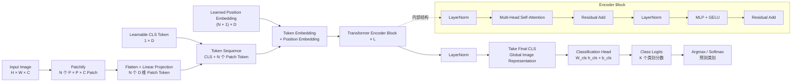

# 01-ViT：把图像变成 Token 的视觉 Transformer

> 主要参考：
> - [An Image is Worth 16×16 Words: Transformers for Image Recognition at Scale](https://arxiv.org/abs/2010.11929)
> - [ViT 论文 HTML 版](https://arxiv.org/html/2010.11929v2)
> - [Google Research 官方实现](https://github.com/google-research/vision_transformer)
> - [Attention Is All You Need](https://arxiv.org/abs/1706.03762)

> [!note]
> Vision Transformer（ViT）的核心不是重新发明 Transformer，而是将二维图像切成 Patch，再把 Patch 投影为一维 Token 序列，交给几乎原封不动的 Transformer Encoder。它证明了：当预训练数据和模型规模足够大时，较弱的视觉归纳偏置可以由大规模学习弥补。ViT 也因此成为 CLIP、LLaVA、Qwen-VL 等现代 VLM 的视觉基础。

## 0. 一句话理解 ViT

```text
图片
→ 切成不重叠 Patch
→ 每个 Patch 投影为视觉 Token
→ 加入 CLS Token 和位置编码
→ 标准 Transformer Encoder
→ 取最终 CLS 表示做图像分类
```

ViT 解决的第一个问题是：

> Transformer 接收的是 Token 序列，二维图片怎样变成 Token 序列？

它给出的答案就是 Patchify 和 Patch Embedding。

## 1. 论文想解决什么问题

ViT 出现之前，Transformer 已经成为 NLP 的主流架构，但图像领域仍然主要由 CNN 支配。当时的视觉 Attention 方法通常会：

- 在 CNN 中加入 Attention。
- 只用局部、稀疏或轴向 Attention。
- 先用 CNN 提取特征，再交给 Transformer。

这些方法或者仍然依赖卷积，或者需要复杂的专用 Attention 实现。ViT 作者提出了一个更直接的问题：

> 能否尽量不修改标准 Transformer，直接用它处理图像？

将 Patch 交给 Attention 并非 ViT 首次尝试；论文的核心贡献是使用中等大小的 Patch、几乎原样的 Transformer 和大规模预训练，系统证明纯 Transformer 能与最强 CNN 竞争。论文最重要的结论是：

1. 中等规模数据上，ViT 常常不如同规模 ResNet。
2. 原因是 ViT 缺少 CNN 内置的局部性和平移等变性等归纳偏置。
3. 当预训练数据扩大到 ImageNet-21k 或 JFT-300M 级别时，ViT 能够追平或超越当时的 CNN。
4. 标准 Transformer 的简单性、扩展性和现有硬件实现，是这条路线的重要优势。

## 2. ViT 结构图



> [!important]
> 原始 ViT 只包含 Transformer Encoder，不包含用于自回归生成的 Decoder。它读取整张图片的 Patch，让所有 Token 双向交互，然后输出视觉表示。

## 3. 一张图片的完整张量流

设输入图片为 $`x\in\mathbb{R}^{H\times W\times C}`$，Patch 边长为 $`P`$。不重叠 Patch 的数量为：

```math
N=\frac{HW}{P^2}
```

切分后的 Patch 序列可以写成：

```math
x_p\in\mathbb{R}^{N\times(P^2C)}
```

以 ViT-B/16 的常见设置为例：

| 阶段 | 形状 | 说明 |
| --- | --- | --- |
| 原始图片 | $`224\times224\times3`$ | RGB 图片 |
| 单个 Patch | $`16\times16\times3`$ | 不重叠切分 |
| Patch 网格 | $`14\times14`$ | $`224/16=14`$ |
| Patch 数量 | $`196`$ | $`14\times14=196`$ |
| 展平后的单 Patch | $`768`$ | $`16\times16\times3=768`$ |
| Patch Embedding | $`196\times D`$ | 线性投影到模型隐藏维度 |
| 加入 CLS 后 | $`197\times D`$ | 序列最前增加一个 Token |
| 加入位置编码后 | $`197\times D`$ | 形状不变 |
| Encoder 输出 | $`197\times D`$ | 每个 Token 都变成上下文表示 |
| 最终 CLS | $`D`$ | 当前图片的全局任务表示 |
| 分类 Logits | $`K`$ | $`K`$ 个下游类别的分数 |

### 3.1 最终 CLS 到底怎样完成分类

这里最容易混淆的是“初始 CLS”和“最终 CLS”：

```text
初始 CLS
= 一份所有图片共用的可学习参数
= 此时还没有当前图片的信息

最终 CLS
= 初始 CLS 与当前图片的 Patch 一起经过 L 层 Encoder 后
  位于序列第 0 号位置的输出向量
= 已经通过 Self-Attention 融合了当前图片中与任务相关的信息
```

假设最后一层 Encoder 的输出为 $`z_L\in\mathbb{R}^{(N+1)\times D}`$，ViT 先取第 0 个位置，也就是最终 CLS：

```math
h_{\mathrm{cls}}=\mathrm{LN}(z_L^0)
```

然后把它送进一个分类头。若共有 $`K`$ 个类别，最简单的分类头就是一个线性层：

```math
\mathrm{logits}=W_{\mathrm{cls}}h_{\mathrm{cls}}+b_{\mathrm{cls}}
```

其中 $`W_{\mathrm{cls}}\in\mathbb{R}^{K\times D}`$，因此输出是 $`K`$ 个分数。例如猫、狗、汽车三个类别可能得到：

```text
最终 CLS: [D 维图片表示]
        ↓ 分类头
logits: [猫: 2.7, 狗: 0.4, 汽车: -1.2]
        ↓ 取最大值
预测结果: 猫
```

训练时，用真实类别和 logits 计算交叉熵损失。因为分类头只能看到最终 CLS，损失的梯度会沿着下面的路径反向传播：

```text
真实标签
→ 分类损失
→ 分类头
→ 最终 CLS
→ CLS 在各层中的 Self-Attention
→ Patch Token、Patch Embedding 和整个 Encoder
```

这就是 CLS 能逐渐学会汇总图片信息的直接原因：**模型若想把类别预测正确，就必须让最终 CLS 包含足以区分类别的信息。** 推理时仍执行相同的前向过程，只是不计算损失、不更新参数，直接根据 logits 得到预测类别。

> [!important]
> CLS 不是一个预先写好“负责总结”的特殊算子。它之所以成为全局分类表示，是因为它能通过 Self-Attention 读取所有 Patch，并且分类头被设计成只读取它；结构提供了信息通道，分类损失提供了学习压力。

## 4. Patch Embedding：把图像变成 Token

### 4.1 展平和线性投影

每个 Patch 先展平为 $`P^2C`$ 维向量，再乘上可训练投影矩阵 $`E`$：

```math
e_i=x_p^iE
```

其中：

```math
E\in\mathbb{R}^{(P^2C)\times D}
```

$`D`$ 是 Transformer 始终使用的隐藏维度。Patch 展平后是像素向量，线性投影后才是能够送入 Transformer 的视觉 Token。

### 4.2 为什么可以用 Conv2d 实现

实际代码常用一个卷积同时完成“切 Patch + 线性投影”：

```python
import torch
from torch import nn


patch_embed = nn.Conv2d(
    in_channels=3,
    out_channels=768,
    kernel_size=16,
    stride=16,
)

images = torch.randn(8, 3, 224, 224)
features = patch_embed(images)             # [8, 768, 14, 14]
tokens = features.flatten(2).transpose(1, 2)  # [8, 196, 768]
```

当 $`\mathrm{kernel\_size}=\mathrm{stride}=P`$ 时，每次卷积恰好读取一个不重叠 Patch；每个输出通道对应线性投影的一个输出维度。

## 5. CLS Token：为什么能表示整张图片

### 5.1 CLS 不是图片内容

ViT 在整个 Patch 序列前只加入一个可学习 CLS Token：

```text
[CLS], patch_1, patch_2, ..., patch_N
```

初始 CLS 是一个随机初始化的模型参数，对每张图片都使用同一个初始向量。它一开始并不包含任何图片信息。

### 5.2 Self-Attention 让 CLS 读取 Patch

在某个 Attention Head 中，CLS 产生 Query，Patch Token 产生 Key 和 Value：

```math
q_{\mathrm{cls}}=h_{\mathrm{cls}}W_Q
```

```math
k_i=h_iW_K
```

```math
v_i=h_iW_V
```

CLS 对所有 Token 的读取可以简化理解为：

```math
h_{\mathrm{cls}}'
=
h_{\mathrm{cls}}
+
\sum_{i=0}^{N}\alpha_i v_i
```

其中 $`\alpha_i`$ 来自 $`q_{\mathrm{cls}}`$ 与每个 Key 的相似度。因此，CLS 在结构上就有能力读取所有 Patch 的信息。

### 5.3 分类损失迫使 CLS 学会汇总

原始 ViT 只把最后一层 CLS 交给分类头：

```text
分类损失
→ 分类头
→ 最终 CLS
→ CLS 的 Attention
→ 相关 Patch Token
```

如果 CLS 没有读取到与类别有关的视觉特征，分类就会出错。反向传播会同时更新 CLS、Q/K/V 投影、Patch Embedding 和前面的 Encoder Block，逐渐学会“应该从哪些 Patch 中提取什么信息”。

> [!warning]
> 最终 CLS 不是对整张图片的无损压缩。它更准确的含义是：完成当前训练目标所需的全局任务表示。猫狗分类会促使它保留形状、纹理和物体部件等信息，但不要求它保留每个像素的精确值。

### 5.4 训练和推理都需要 CLS

推理时不会删除 CLS，只是不再更新它的参数：

```text
同一个初始 CLS + 图片 A 的 Patch
→ 图片 A 特有的最终 CLS

同一个初始 CLS + 图片 B 的 Patch
→ 图片 B 特有的最终 CLS
```

因此，初始 CLS 是训练后固定的模型参数，最终 CLS 则是当前图片动态计算出的表示。后续一些 ViT 变体会用所有 Patch Token 的平均池化代替 CLS，但原始 ViT 采用 CLS 以沿用 BERT 的分类范式。

## 6. 可学习位置编码

### 6.1 位置编码是模型参数，不是每张图片的参数

原始 ViT 为 CLS 和每个 Patch 位置学习一个绝对位置向量：

```math
E_{\mathrm{pos}}\in\mathbb{R}^{(N+1)\times D}
```

初始输入为：

```math
z_0
=
[x_{\mathrm{cls}};x_p^1E;x_p^2E;\ldots;x_p^NE]
+E_{\mathrm{pos}}
```

不同图片复用同一组位置参数：

```text
图片 A 的左上角 Patch + 左上角位置向量
图片 B 的左上角 Patch + 同一个左上角位置向量
```

“可学习”只表示这些位置向量在模型训练时由梯度更新。推理新图片时，它们和 Linear 权重一样已经固定，不需要重新训练。

### 6.2 为什么原始 ViT 的一维位置编码也能工作

Patch 依照固定顺序展平为序列，例如从左到右、从上到下。因此，每个一维序列位置都始终对应二维网格中的同一个位置。论文发现，手工加入更复杂的二维编码没有带来明显收益；训练后的一维参数本身能学出行、列和空间距离结构。

### 6.3 高分辨率微调时的二维插值

设模型以 $`224\times224`$ 图片和 $`16\times16`$ Patch 预训练，Patch 位置编码对应 $`14\times14`$ 网格。如果微调改为 $`384\times384`$，Patch 网格变为 $`24\times24`$。

处理流程是：

```text
位置编码 [1, 197, D]
→ 分离 CLS 位置编码 [1, 1, D]
→ Patch 位置编码 [1, 196, D]
→ 恢复二维网格 [1, D, 14, 14]
→ 二维插值 [1, D, 24, 24]
→ 展平 [1, 576, D]
→ 拼回未插值的 CLS 位置编码
→ 新位置编码 [1, 577, D]
```

CLS 不对应某个二维图像坐标，所以它的位置向量不参与插值。论文只规定了二维插值，工程实现中常见 bicubic 等方式。这个过程是对每个隐藏维度所形成的二维平滑坐标场进行缩放，不是为新图片重新学习位置参数。

> [!tip]
> 完整的 Transformer 位置编码演进、RoPE 工程实现和长上下文扩展，参见[位置编码学习路线](../大模型架构/位置编码/README.md)。

## 7. Transformer Encoder 内部做了什么

### 7.1 两个 Pre-Norm 子层

原始 ViT 的每个 Encoder Block 包含两个子层：

```math
z_l'
=
\mathrm{MSA}\left(\mathrm{LN}(z_{l-1})\right)+z_{l-1}
```

```math
z_l
=
\mathrm{MLP}\left(\mathrm{LN}(z_l')\right)+z_l'
```

MLP 包含两个线性层和 GELU 激活：

```text
D → D_mlp → GELU → D
```

例如 ViT-Base 中常见为：

```text
768 → 3072 → 768
```

### 7.2 为什么它是 Encoder

ViT 对所有 Token 使用无 Causal Mask 的 Self-Attention：

```text
CLS     ↔ 所有 Patch
patch_1 ↔ 所有 Patch
patch_2 ↔ 所有 Patch
...
```

所有 Patch 从第一层开始就具有全局感受野。它的目标是对已知输入建立上下文表示，而不是按顺序预测下一个 Patch，所以它属于 Encoder。

“一开始输入完整图片”只是表面现象。更根本的判断标准是：

| 维度 | ViT Encoder | 自回归 Decoder |
| --- | --- | --- |
| Token 可见范围 | 双向全局可见 | 只能看当前位置及之前 |
| Causal Mask | 没有 | 有 |
| 目标 | 得到输入表示 | 预测下一个 Token |
| 原始输出 | 图像表示和分类 | 生成 Token 概率 |

## 8. ViT 的视觉归纳偏置

CNN 把一些图像结构直接写进网络：

- **局部性**：卷积核优先处理邻近像素。
- **二维邻域**：网络天然知道上下左右关系。
- **平移等变性**：同一组卷积核在整张图片上共享。

ViT 显式使用二维结构的地方很少：

1. 输入时按二维网格切 Patch。
2. 改变分辨率时对位置编码做二维插值。

进入 Encoder 后，Attention 是全局的，局部性、行列结构和物体空间关系主要由数据学出。这解释了原始 ViT 为什么在数据较少时容易不如 CNN，也解释了它为什么更依赖大规模预训练。

## 9. 预训练、微调和分类

### 9.1 原论文的预训练方式

原始 ViT 论文主要使用有监督图像分类预训练，而不是后来 MAE 那样的遮挡重建，也不是 CLIP 那样的图文对比学习。

数据和目标是：

```text
图片 + 类别标签
→ ViT
→ 类别 Logits
→ Cross-Entropy Loss
```

论文使用不同规模的预训练数据说明了一个重要趋势：

```text
较小数据：ResNet 的归纳偏置更有优势
较大数据：ViT 的扩展能力逐渐显现
```

### 9.2 下游微调

迁移到新分类任务时，删除原预训练分类头，再接一个 $`D\times K`$ 的新分类头，其中 $`K`$ 是下游类别数。原论文的典型路线是：

```text
大规模数据低分辨率预训练
→ 对位置编码做二维插值
→ 更高分辨率下游微调
→ 使用最终 CLS 分类
```

## 10. ViT 与现代 VLM 的关系

ViT 为 VLM 提供的不是文本生成能力，而是一组可以与语言模型对齐的视觉 Token：

```text
图片
→ ViT / 视觉 Encoder
→ Patch Features
→ Projector / Q-Former / Cross-Attention
→ LLM
→ 文本回答
```

与原始图像分类不同，VLM 往往不能只使用最终 CLS。图像问答、OCR、Grounding 和视频理解需要局部、空间和时序细节，因此通常会保留多个 Patch Token，再压缩或投影到 LLM 隐藏空间。

ViT 之后的学习问题也因此自然变成：

1. 如何用 CLIP 把视觉表示和文本表示对齐？
2. 如何用 Projector、Q-Former 或 Cross-Attention 把视觉 Token 接入 LLM？
3. 如何在保留细节的同时减少视觉 Token 数？
4. 如何处理动态分辨率、任意宽高比和视频时间维度？

## 11. 常见易混点

| 误解 | 准确理解 |
| --- | --- |
| ViT 发明了 Transformer | ViT 的核心贡献是用简洁的 Patch 输入和大规模预训练验证标准 Transformer 视觉路线 |
| Patch 展平后直接进 Encoder | Patch 展平后还要经过线性投影，才得到 $`D`$ 维 Token |
| 每个 Patch 前都加一个 CLS | 整个序列只在最前面加一个 CLS |
| CLS 保存整张图片的全部像素 | CLS 是为当前目标学出的有损全局表示 |
| 推理阶段不再需要 CLS | 原始 ViT 训练和推理都使用 CLS |
| 可学习位置编码需要每张新图重训 | 它是整个模型在训练数据上一次学得的共享参数 |
| ViT 是 Encoder 只因为输入图片完整 | 更根本的原因是双向 Attention、无 Causal Mask，目标是编码而非自回归生成 |

## 12. 最小伪代码

```python
def vit_forward(images):
    # [B, C, H, W] -> [B, N, D]
    patch_tokens = patch_embedding(images)

    # 每张图片都复用同一个可学习初始 CLS
    cls = cls_token.expand(images.shape[0], -1, -1)

    # [B, N + 1, D]
    tokens = concat([cls, patch_tokens], dim=1)
    tokens = tokens + position_embedding

    # 无 Causal Mask 的 Transformer Encoder
    hidden_states = encoder(tokens)

    # 最终 CLS 已根据当前图片动态聚合 Patch 信息
    image_representation = layer_norm(hidden_states[:, 0])
    logits = classification_head(image_representation)
    return logits
```

## 13. 阅读论文时应能回答的问题

1. ViT-B/16 中的 `B` 和 `16` 分别表示什么？
2. $`224\times224`$ 图片为什么产生 196 个 Patch Token？
3. Patch Embedding 为什么可以使用 Conv2d 实现？
4. CLS 为什么在训练后能成为图片的任务表示？
5. 为什么可学习位置编码不需要在推理新图片时重新训练？
6. 高分辨率微调时，为什么只插值 Patch 位置编码而不插值 CLS？
7. ViT 为什么是 Encoder，它和自回归 Decoder 的 Attention Mask 有什么不同？
8. 为什么原始 ViT 比 CNN 更依赖大规模预训练？
9. 在 VLM 中，为什么通常要保留多个 Patch Token，而不只使用 CLS？

## 14. 核心总结

```text
ViT
= Patch Embedding
+ CLS Token
+ Learned Absolute Position Embedding
+ Standard Transformer Encoder
+ Task Head
```

必须记住的四点：

1. **Patchify 只是切分，Patch Embedding 还包含线性投影。**
2. **CLS 通过 Self-Attention 读取 Patch，并在分类损失的压力下学会聚合任务相关的全局信息。**
3. **位置编码是训练后共享的模型参数，新图片推理不需要重新学习。**
4. **ViT 是无 Causal Mask 的双向 Encoder；它负责把完整图片编码为上下文化的视觉表示。**
