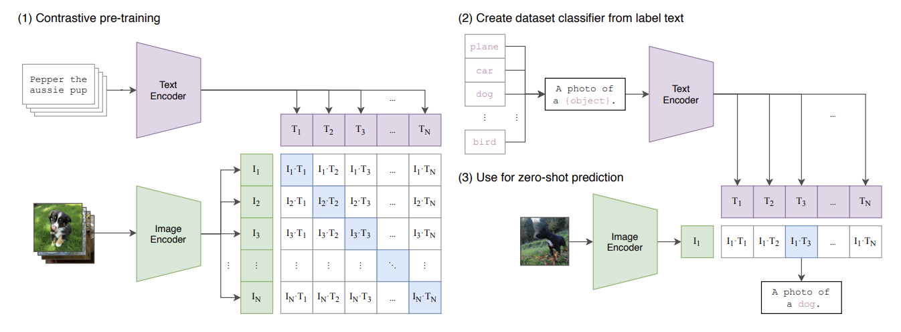

# 02-CLIP：用对比学习对齐图片与文本

> 主要参考：
> - [Learning Transferable Visual Models From Natural Language Supervision](https://arxiv.org/abs/2103.00020)
> - [CLIP 论文 PDF](https://arxiv.org/pdf/2103.00020)
> - [OpenAI 官方介绍](https://openai.com/index/clip/)
> - [OpenAI CLIP 官方实现](https://github.com/openai/CLIP)

> [!note]
> ViT 解决“怎样把图片编码成视觉表示”，CLIP 继续解决“怎样让视觉表示与文本表示能够直接比较”。它分别编码图片和文本，再用对称图文对比损失把两个模态对齐到同一个语义空间。训练后，类别名称可以通过 Text Encoder 动态变成分类器，因此模型无需目标数据集的标注样本和微调，也能进行 Zero-shot 分类。

## 0. 一句话理解 CLIP

```text
N 对图片和文本
→ 分别经过 Image Encoder 与 Text Encoder
→ 线性投影到相同的 D 维空间
→ 对每个向量做 L2 归一化
→ 计算 N × N 图文相似度矩阵
→ 图片找文本 + 文本找图片
→ 两个交叉熵损失取平均
```

CLIP 的核心目标是：

> 正确配对的图片和文本向量应该靠近，错误配对的图片和文本向量应该远离。

它学习的是图文语义对齐，不是看图生成文本。

## 1. CLIP 想解决什么问题

传统图像分类模型通常具有固定分类头：

```text
图片
→ Image Encoder
→ Linear Classifier
→ 固定类别 Logits
```

如果分类头只包含猫、狗和汽车三个类别，增加飞机类别通常需要新的标注数据并重新训练分类头。这种监督方式存在三个限制：

1. 类别集合在训练后基本固定。
2. 每个新任务都需要专门的标注数据。
3. 模型容易学习数据集标签，而不是更通用的自然语言语义。

CLIP 将监督信号从固定类别编号换成互联网上天然存在的图文配对：

```text
图片 + 自然语言描述
→ 学习图片与文字之间的匹配关系
```

原论文使用约 4 亿对互联网图文数据，从头训练 Image Encoder 和 Text Encoder。训练完成后，模型可以通过自然语言描述新的下游任务，而不需要为每个数据集训练新的固定分类头。

> [!important]
> CLIP 的 Zero-shot 不表示预训练时绝对没见过“狗”“汽车”等概念。它表示模型没有使用目标数据集的标注训练样本进行专门训练或微调。

## 2. 论文总览图



> 图源：CLIP 原论文 Figure 1。

这张图可以分成三个阶段：

| 阶段 | 作用 | 是否更新参数 |
| --- | --- | --- |
| `(1) Contrastive pre-training` | 用图文对训练共享语义空间 | 是 |
| `(2) Create dataset classifier from label text` | 把候选类别写成 Prompt，并编码为文本类别向量 | 否 |
| `(3) Use for zero-shot prediction` | 将新图片与所有类别文本比较，选择最相似类别 | 否 |

其中 `(1)` 是训练，`(2)` 和 `(3)` 是下游 Zero-shot 推理。

## 3. CLIP 的对比预训练

本节把一次完整训练按照真实数据流组织起来：

```text
图文双塔编码
→ 线性投影到共同空间
→ Batch 内逐向量 L2 归一化
→ 构造 N × N 图文相似度矩阵
→ 计算 Image-to-Text 与 Text-to-Image 交叉熵
→ 两个损失取平均
→ 反向传播并更新全部可学习参数
```

### 3.1 双塔架构

CLIP 是双塔模型：

```text
图片 → Image Encoder → 图像特征 → 图像线性投影 → 图像向量
                                                        ↘
                                                          相似度
                                                        ↗
文本 → Text Encoder  → 文本特征 → 文本线性投影 → 文本向量
```

两个 Encoder 的参数不共享，但它们的输出最终会被投影到相同的 $`D`$ 维空间。

#### 3.1.1 Image Encoder

原始 CLIP 实验了两类视觉编码器：

- 修改后的 ResNet。
- Vision Transformer，也就是 ViT。

使用 ViT 时，数据流为：

```text
图片
→ Patch Embedding
→ Class Token + 位置编码
→ Transformer
→ 取第 0 个 Class Token
→ LayerNorm
→ 视觉线性投影
```

设第 $`i`$ 张图片为 $`I_i`$，Image Encoder 为 $`f_\theta`$：

```math
h_i^I=f_\theta(I_i)
```

其中 $`h_i^I`$ 是图像侧的单模态全局特征。

#### 3.1.2 Text Encoder

原始 CLIP 的 Text Encoder 是一个使用 Causal Attention Mask 的 Transformer。它不是 BERT 风格的完全双向 Encoder：当前位置只能读取自己和前面的文本 Token。

文本数据流为：

```text
文本
→ BPE Tokenization
→ 加入 [SOS] 与 [EOS]
→ Text Transformer
→ 取最后一层 [EOS] 位置表示
→ LayerNorm
→ 文本线性投影
```

设与图片 $`I_i`$ 配对的文本为 $`T_i`$，Text Encoder 为 $`g_\phi`$：

```math
h_i^T=g_\phi(T_i)
```

其中 $`h_i^T`$ 是文本侧的单模态全局特征。

#### 3.1.3 Encoder 后是线性投影，不是额外 MLP

图像特征和文本特征的原始维度可能不同，因此分别使用一个可学习线性矩阵：

```math
\widetilde{v}_i=W_Ih_i^I
```

```math
\widetilde{t}_i=W_Th_i^T
```

投影后：

```math
\widetilde{v}_i\in\mathbb{R}^{D}
```

```math
\widetilde{t}_i\in\mathbb{R}^{D}
```

原始 CLIP 在这里使用线性投影。ViT 和 Text Transformer 内部都有 MLP Block，但不能因此把 Encoder 后的投影层说成额外 MLP。

### 3.2 一个 Batch 的完整张量流

假设一个 Batch 中有 $`N`$ 对图文数据：

```text
(I₁, T₁)
(I₂, T₂)
...
(Iₙ, Tₙ)
```

其中 $`(I_i,T_i)`$ 是正确配对。编码和投影后的形状为：

| 阶段 | 图片侧形状 | 文本侧形状 |
| --- | --- | --- |
| Encoder 输出 | $`N\times D_I`$ | $`N\times D_T`$ |
| 线性投影后 | $`N\times D`$ | $`N\times D`$ |
| L2 归一化后 | $`N\times D`$ | $`N\times D`$ |
| 两侧矩阵相乘 | $`N\times N`$ | 图文相似度矩阵 |

一个 Batch 会自然产生：

- $`N`$ 个对角线正样本。
- $`N^2-N`$ 个非对角线负样本。

不需要另外为每张图片人工采样负文本，因为 Batch 中其他图片的文本就充当负样本。

### 3.3 L2 归一化与余弦相似度

投影后的图像和文本向量分别做 L2 归一化：

```math
v_i=\frac{\widetilde{v}_i}{\left\lVert\widetilde{v}_i\right\rVert_2}
```

```math
t_i=\frac{\widetilde{t}_i}{\left\lVert\widetilde{t}_i\right\rVert_2}
```

因此：

```math
\left\lVert v_i\right\rVert_2=1
```

```math
\left\lVert t_i\right\rVert_2=1
```

归一化后的点积等于余弦相似度：

```math
v_i^{\mathsf{T}}t_j=\cos(v_i,t_j)
```

归一化避免模型仅通过放大向量长度来提高点积，使比较主要反映两个向量的语义方向是否一致。

> [!warning]
> 这里是 L2 Normalization，不是 LayerNorm。L2 Normalization 把每个向量的长度缩放为 1；LayerNorm 则按照特征的均值和方差进行标准化。

### 3.4 图文相似度矩阵

将归一化后的图像向量堆叠为：

```math
V\in\mathbb{R}^{N\times D}
```

将归一化后的文本向量堆叠为：

```math
T\in\mathbb{R}^{N\times D}
```

图文相似度矩阵为：

```math
S=\frac{VT^{\mathsf{T}}}{\tau}
```

其中：

```math
S\in\mathbb{R}^{N\times N}
```

单个元素为：

```math
s_{ij}=\frac{v_i^{\mathsf{T}}t_j}{\tau}
```

$`s_{ij}`$ 表示第 $`i`$ 张图片与第 $`j`$ 段文本的匹配分数。

对于三对图文数据：

|  | 文本 0 | 文本 1 | 文本 2 |
| --- | ---: | ---: | ---: |
| 图片 0 | $`s_{00}`$：正样本 | $`s_{01}`$：负样本 | $`s_{02}`$：负样本 |
| 图片 1 | $`s_{10}`$：负样本 | $`s_{11}`$：正样本 | $`s_{12}`$：负样本 |
| 图片 2 | $`s_{20}`$：负样本 | $`s_{21}`$：负样本 | $`s_{22}`$：正样本 |

正确图文对位于对角线，但并不是只有对角线参与损失。每一行和每一列的全部元素都会进入 Softmax 分母，并获得梯度。

### 3.5 对称图文对比损失

CLIP 将相似度矩阵解释成两个方向的分类问题：

1. Image-to-Text：给定图片，在 Batch 的所有文本中找到配对文本。
2. Text-to-Image：给定文本，在 Batch 的所有图片中找到配对图片。

两个方向分别计算交叉熵，最后取平均。

#### 3.5.1 Image-to-Text：按行分类

固定第 $`i`$ 张图片，对第 $`i`$ 行做 Softmax：

```math
p_{i\rightarrow j}
=
\frac{\exp(s_{ij})}
{\sum_{k=0}^{N-1}\exp(s_{ik})}
```

正确文本是 $`T_i`$，因此标签为 $`j=i`$。Image-to-Text 损失为：

```math
L_{I\rightarrow T}
=
-\frac{1}{N}
\sum_{i=0}^{N-1}
\log
\left(
\frac{\exp(s_{ii})}
{\sum_{j=0}^{N-1}\exp(s_{ij})}
\right)
```

它等价于 $`N`$ 个分类问题：

```text
图片 0 → 应选择文本 0
图片 1 → 应选择文本 1
...
图片 i → 应选择文本 i
```

#### 3.5.2 Text-to-Image：按列分类

固定第 $`i`$ 段文本，对相似度矩阵第 $`i`$ 列做 Softmax：

```math
p_{i\rightarrow j}^{T\rightarrow I}
=
\frac{\exp(s_{ji})}
{\sum_{k=0}^{N-1}\exp(s_{ki})}
```

正确图片是 $`I_i`$。Text-to-Image 损失为：

```math
L_{T\rightarrow I}
=
-\frac{1}{N}
\sum_{i=0}^{N-1}
\log
\left(
\frac{\exp(s_{ii})}
{\sum_{j=0}^{N-1}\exp(s_{ji})}
\right)
```

代码中通常直接对转置矩阵按行做交叉熵：

```python
loss_text = cross_entropy(similarity_matrix.T, labels)
```

#### 3.5.3 两个方向取平均

最终 CLIP 损失为：

```math
L_{\mathrm{CLIP}}
=
\frac{1}{2}
\left(
L_{I\rightarrow T}
+
L_{T\rightarrow I}
\right)
```

需要注意，它不是“先按行 Softmax，再对结果按列 Softmax”，而是从同一个原始相似度矩阵分别构造两个独立的交叉熵任务：

```text
                     → 按行交叉熵：图片选择文本
原始相似度矩阵 S
                     → 按列交叉熵：文本选择图片
```

### 3.6 交叉熵怎样推动图文向量移动

对于 Image-to-Text 方向，定义标签矩阵 $`y_{ij}`$：对角线为 1，其他位置为 0。交叉熵对相似度的梯度为：

```math
\frac{\partial L_{I\rightarrow T}}{\partial s_{ij}}
=
\frac{1}{N}
\left(p_{ij}-y_{ij}\right)
```

对正确位置 $`i=j`$：

```math
\frac{\partial L}{\partial s_{ii}}
=
\frac{1}{N}\left(p_{ii}-1\right)
```

这个值通常小于 0，因此梯度下降会提高正确图文对的相似度。

对错误位置 $`i\ne j`$：

```math
\frac{\partial L}{\partial s_{ij}}
=
\frac{1}{N}p_{ij}
```

这个值大于 0，因此梯度下降会降低错误图文对的相似度。

又因为：

```math
s_{ij}=\frac{v_i^{\mathsf{T}}t_j}{\tau}
```

所以：

```math
\frac{\partial s_{ij}}{\partial v_i}=\frac{t_j}{\tau}
```

```math
\frac{\partial s_{ij}}{\partial t_j}=\frac{v_i}{\tau}
```

最终效果可以理解为：

```text
正确图文对：向量方向被拉近
错误图文对：向量方向被推远
```

> [!important]
> 对角线只负责指出正确类别。非对角线元素同样出现在 Softmax 分母中，并且都会获得梯度。

### 3.7 Temperature 与 Logit Scale

相似度公式中的 $`\tau`$ 是 Temperature：

```math
s_{ij}=\frac{v_i^{\mathsf{T}}t_j}{\tau}
```

原始 CLIP 代码采用可学习 Logit Scale $`a`$，写成：

```math
s_{ij}=\exp(a)v_i^{\mathsf{T}}t_j
```

两种写法等价，因为：

```math
\exp(a)=\frac{1}{\tau}
```

- $`\tau`$ 较小，或者 $`\exp(a)`$ 较大：Softmax 更尖锐。
- $`\tau`$ 较大，或者 $`\exp(a)`$ 较小：Softmax 更平缓。

这个参数与两个 Encoder、两个投影矩阵一起参与反向传播和优化。

### 3.8 参数如何更新

一次训练迭代包含：

```text
前向传播
→ 计算最终标量损失
→ 反向传播
→ 优化器更新
```

梯度传播路径为：

```text
L_CLIP
→ 两个交叉熵
→ N × N 相似度矩阵
→ Temperature / Logit Scale
→ L2 归一化
→ 图像与文本投影矩阵
→ Image Encoder 与 Text Encoder
```

需要训练的主要参数包括：

| 参数 | 作用 |
| --- | --- |
| $`\theta`$ | Image Encoder 参数 |
| $`\phi`$ | Text Encoder 参数 |
| $`W_I`$ | 图像投影矩阵 |
| $`W_T`$ | 文本投影矩阵 |
| $`a`$ | 可学习 Logit Scale |

以最简单的梯度下降表示：

```math
\theta\leftarrow\theta-\eta\frac{\partial L}{\partial\theta}
```

```math
\phi\leftarrow\phi-\eta\frac{\partial L}{\partial\phi}
```

$`\eta`$ 是学习率。实际训练使用 Adam 一类优化器，但核心仍然是根据最终对比损失同时更新两个模态的完整计算链路。

### 3.9 最小训练伪代码

```python
def clip_loss(images, texts):
    # [N, D_image]
    image_features = image_encoder(images)

    # [N, D_text]
    text_features = text_encoder(texts)

    # 原始 CLIP 这里是线性投影，不是额外 MLP
    image_embeddings = image_features @ image_projection
    text_embeddings = text_features @ text_projection

    # 对每个样本的 D 维向量做 L2 归一化
    image_embeddings = l2_normalize(image_embeddings, dim=-1)
    text_embeddings = l2_normalize(text_embeddings, dim=-1)

    # [N, D] @ [D, N] -> [N, N]
    logit_scale = temperature_parameter.exp()
    logits_per_image = (
        logit_scale * image_embeddings @ text_embeddings.T
    )
    logits_per_text = logits_per_image.T

    # 正确图文对在相似度矩阵对角线上
    labels = arange(images.shape[0])

    loss_image = cross_entropy(logits_per_image, labels)
    loss_text = cross_entropy(logits_per_text, labels)
    return (loss_image + loss_text) / 2
```

训练循环为：

```python
optimizer.zero_grad()
loss = clip_loss(images, texts)
loss.backward()
optimizer.step()
```

Cross-Entropy 内部已经包含 LogSoftmax，一般不需要在传入损失函数前手动执行 Softmax。

## 4. Zero-shot 分类

Zero-shot 分类不是让 CLIP 自动生成一个类别名称，而是提前给出候选类别，让模型选择最匹配的文本。

### 4.1 用类别文本动态构造分类器

假设候选类别是：

```text
plane
car
dog
bird
```

先填入 Prompt 模板：

```text
a photo of a plane
a photo of a car
a photo of a dog
a photo of a bird
```

Text Encoder 将它们编码为归一化类别向量：

```math
t_{\mathrm{plane}},
t_{\mathrm{car}},
t_{\mathrm{dog}},
t_{\mathrm{bird}}
```

将 $`K`$ 个类别向量堆叠起来：

```math
T_{\mathrm{class}}\in\mathbb{R}^{K\times D}
```

这个矩阵在功能上相当于传统线性分类器的权重，但它不是用目标任务标注图片训练出来的，而是由类别文本动态生成的。

### 4.2 编码新图片并选择类别

新图片经过 Image Encoder、投影和归一化得到 $`v`$：

```math
v\in\mathbb{R}^{D}
```

计算它与所有类别文本的相似度：

```math
s=\frac{vT_{\mathrm{class}}^{\mathsf{T}}}{\tau}
```

其中：

```math
s\in\mathbb{R}^{K}
```

类别概率为：

```math
p_k=\frac{\exp(s_k)}{\sum_{j=1}^{K}\exp(s_j)}
```

预测类别是：

```math
\widehat{y}=\mathrm{argmax}_{k}\ s_k
```

图中 `(3)` 的蓝色位置是图片向量 $`I_1`$ 与 `a photo of a dog` 对应文本向量 $`T_3`$ 的相似度。它最高，所以模型从候选类别中选择 `dog`。

> [!warning]
> 图中最后的 `A photo of a dog.` 是从候选 Prompt 中选中的文本，不是 CLIP 现场生成的图片描述。

### 4.3 为什么叫 Zero-shot

Zero-shot 表示：

```text
没有目标数据集的标注训练图片
+ 没有针对目标任务执行微调
+ 只提供类别名称与 Prompt
```

它不表示：

```text
不提供候选类别
预训练时绝对没见过相关概念
模型可以生成任意新的类别名称
```

对于一次分类任务，候选类别是固定的；但换任务时可以直接替换 Prompt，无需重新训练 CLIP：

```text
任务 A：cat、dog、car
任务 B：apple、banana、orange
任务 C：happy、sad、angry
```

### 4.4 Prompt Ensembling

单个模板可能带来语言偏差，因此可以为同一类别使用多个 Prompt：

```text
a photo of a dog
a blurry photo of a dog
a close-up photo of a dog
a photo of the dog
```

分别编码后，将同一类别的多个文本向量平均并重新归一化：

```math
\overline{t}_k
=
\mathrm{Normalize}
\left(
\frac{1}{M}
\sum_{m=1}^{M}t_k^{(m)}
\right)
```

这叫 Prompt Ensembling，可以降低模型对某一个模板措辞的敏感性。

### 4.5 预训练与 Zero-shot 推理的区别

| 对比维度 | 对比预训练 | Zero-shot 推理 |
| --- | --- | --- |
| 图片输入 | $`N`$ 张训练图片 | 一张或一批待分类图片 |
| 文本输入 | 与图片天然配对的描述 | 人工构造的候选类别 Prompt |
| 相似度形状 | $`N\times N`$ | $`B\times K`$ |
| 是否计算交叉熵 | 是 | 否 |
| 是否反向传播 | 是 | 否 |
| 是否更新参数 | 是 | 否 |
| 输出 | 训练损失 | 候选类别概率或排序 |

预训练阶段学习“图片与自然语言怎样对应”；Zero-shot 阶段复用这种能力，将类别文本当作动态分类器。

## 5. CLIP 的能力边界

CLIP 擅长：

- 图文检索。
- Zero-shot 图片分类。
- 通用视觉语义表示。
- 作为生成模型或 VLM 的视觉/文本语义组件。

CLIP 本身不擅长：

- 看图生成长文本。
- 多轮视觉问答。
- 精确计数和复杂空间关系推理。
- 保留所有局部视觉细节。

原因之一是原始 CLIP 通常把整张图片压缩为一个全局向量进行对比学习。这个向量适合全局语义匹配，却可能丢失 OCR、Grounding 和精细空间推理所需的信息。

另一个训练问题是 False Negative：Batch 中两个非配对样本可能具有相同或相近语义，例如两张狗图片配上两段狗描述。标准 CLIP 仍将非对角线位置当作负样本，这并不总是符合真实语义。

## 6. CLIP 与现代 VLM 的关系

CLIP 的视觉侧最终通常输出单个全局向量：

```text
图片
→ Image Encoder
→ 全局图像向量
→ 与全局文本向量比较
```

现代生成式 VLM 更需要多个局部视觉 Token：

```text
图片
→ ViT
→ 多个 Patch Token
→ Projector / Q-Former
→ LLM
→ 自回归生成文本
```

学习路线因此是：

```text
ViT
解决图片怎样变成视觉 Token
        ↓
CLIP
解决图片与文本怎样进行语义对齐
        ↓
LLaVA / Qwen-VL 等生成式 VLM
解决视觉 Token 怎样接入 LLM 并生成答案
```

## 7. 常见易混点

| 误解 | 准确理解 |
| --- | --- |
| CLIP 看图生成文本 | CLIP 主要编码并比较图文向量，本身不是生成模型 |
| Image Encoder 只能使用 ViT | 原始 CLIP 同时实验了 ResNet 和 ViT |
| Text Encoder 是普通双向 Transformer | 原始 CLIP 使用带 Causal Mask 的 Text Transformer |
| Encoder 后还有一个 MLP | 原始 CLIP 使用可学习线性投影矩阵 |
| L2 Normalization 就是 LayerNorm | 两者的归一化对象和计算方式不同 |
| 只对相似度矩阵对角线计算损失 | 对角线提供正确标签，整行整列都参与 Softmax 和梯度计算 |
| 行 Softmax 后再做列 Softmax | 两个方向从原始矩阵分别计算独立交叉熵 |
| Zero-shot 不需要候选类别 | Zero-shot 分类仍需要候选类别 Prompt |
| Zero-shot 表示预训练从未见过概念 | 它表示不使用目标任务的标注样本进行训练或微调 |
| 最后的类别文本是 CLIP 生成的 | 它是从预先提供的候选 Prompt 中选择出来的 |

## 8. 阅读论文后应能回答的问题

1. CLIP 为什么要使用两个独立 Encoder？
2. Encoder 输出为什么还要经过线性投影？
3. 为什么 L2 归一化后点积等于余弦相似度？
4. 一个包含 $`N`$ 对图文数据的 Batch 为什么得到 $`N\times N`$ 相似度矩阵？
5. 对角线元素和非对角线元素分别表示什么？
6. 为什么对角线是标签，但所有矩阵元素都会获得梯度？
7. Image-to-Text 与 Text-to-Image 损失分别解决什么分类问题？
8. 为什么两个方向的损失要取平均？
9. Temperature 如何影响 Softmax 分布？
10. Zero-shot 分类为什么仍然需要候选类别 Prompt？
11. 为什么类别文本向量可以看成动态分类器权重？
12. CLIP 与能够生成文本的现代 VLM 有什么区别？

## 9. 核心总结

CLIP 的训练主链路：

```text
Image Encoder + Text Encoder
→ 两个线性投影
→ L2 归一化
→ N × N 图文相似度矩阵
→ Image-to-Text 交叉熵
+ Text-to-Image 交叉熵
→ 两个方向取平均
→ 反向传播更新完整模型
```

必须记住的五点：

1. **CLIP 是图文双塔对齐模型，不是图文生成模型。**
2. **原始 CLIP 在 Encoder 后使用线性投影，并对每个图文向量做 L2 归一化。**
3. **对角线提供正确配对标签，但整张相似度矩阵都会参与双向交叉熵。**
4. **最终损失是 Image-to-Text 与 Text-to-Image 两个交叉熵的平均。**
5. **Zero-shot 分类不需要目标任务标注图片和微调，但仍需要候选类别 Prompt。**
