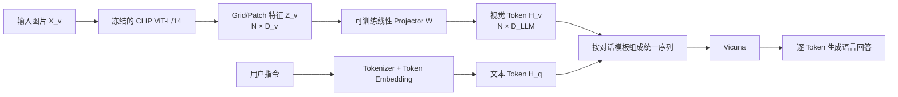
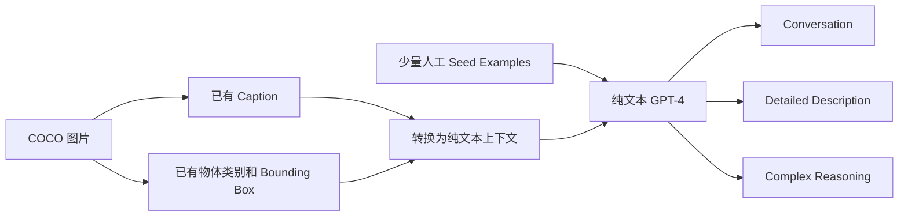
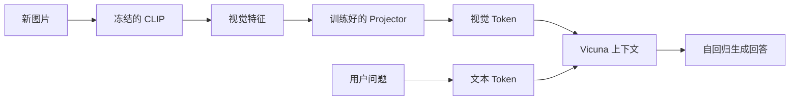

# 03-LLaVA：把视觉 Token 接入大语言模型

> 主要参考：
> - [Visual Instruction Tuning](https://arxiv.org/abs/2304.08485)
> - [LLaVA 论文 PDF](https://arxiv.org/pdf/2304.08485)
> - [LLaVA 官方代码仓库](https://github.com/haotian-liu/LLaVA)
> - [Vicuna](https://lmsys.org/blog/2023-03-30-vicuna/)

> [!note]
> ViT 解决“怎样把图片变成视觉 Token”，CLIP 解决“怎样让图片和文本处于可比较的语义空间”，LLaVA 则继续解决“怎样把视觉 Token 接入大语言模型，让模型围绕图片进行对话”。原始 LLaVA 的做法非常直接：用 CLIP ViT-L/14 编码图片，用一个线性 Projector 对齐特征维度和表示空间，再把视觉 Token 与文本 Token 一起送进 Vicuna。

## 0. 一句话理解 LLaVA

```text
图片
→ CLIP ViT-L/14
→ 一串 Patch/Grid 视觉特征
→ 线性 Projector
→ 一串与词向量同维的视觉 Token
→ 与用户指令的文本 Token 拼成一个序列
→ Vicuna 自回归生成回答
```

LLaVA 的核心不是重新设计一个复杂的视觉语言模型，而是用一个轻量连接器，把两个已经训练好的模块接起来：

- CLIP 负责提取视觉语义。
- Vicuna 负责理解指令和生成语言。
- Projector 负责将两侧的表示连接起来。
- 两阶段训练先接通视觉接口，再学习多模态对话。

> [!important]
> 本文讨论的是原始 LLaVA 论文中的方案。原始论文使用单个线性层作为 Projector；后来的一些 LLaVA 版本常改用两层 MLP，不能把后续实现直接当成原始论文结构。

## 1. LLaVA 想解决什么问题

CLIP 已经能判断图片和文本是否匹配，但它本身不是生成模型：

```text
图片 → Image Encoder → 图片向量 ─┐
                                ├→ 相似度
文本 → Text Encoder  → 文本向量 ─┘
```

这种结构适合检索和 Zero-shot 分类，却不能像聊天模型一样逐 Token 生成开放式答案。另一方面，Vicuna 能理解语言指令、延续多轮对话和生成长文本，却没有直接读取图片的接口。

LLaVA 因而要解决两个问题：

1. 怎样把 CLIP 的视觉特征转换成 Vicuna 能接收的输入？
2. 怎样让 Vicuna 不只会续写文字，还会根据图片遵循指令、回答问题和进行推理？

第一个问题由 Projector 和特征对齐预训练解决，第二个问题由视觉指令微调解决。

## 2. 总体架构



三个主要模块的职责如下：

| 模块 | 原始 LLaVA 选择 | 作用 | 输出 |
| --- | --- | --- | --- |
| Vision Encoder | CLIP ViT-L/14 | 将图片编码为具有语义和空间对应关系的 Patch/Grid 特征 | 一串视觉特征 |
| Projector | 线性投影矩阵 | 将 CLIP 特征映射到 LLM 词向量空间 | 一串视觉 Token Embedding |
| LLM | Vicuna | 融合图片与问题，并自回归生成回答 | 自然语言 Token |

### 2.1 Vicuna 是什么

Vicuna 是基于 LLaMA 微调得到的对话模型。它沿用 LLaMA 的 Decoder-only Transformer 结构，并利用 ShareGPT 收集的用户对话进行指令微调，因此比基础 LLaMA 更擅长多轮对话和遵循指令。

在 LLaVA 中，可以把三者的关系理解为：

```text
LLaMA：基础语言模型
   ↓ 对话数据微调
Vicuna：具备对话能力的语言模型
   ↓ 接入 CLIP 视觉特征并进行视觉指令微调
LLaVA：具备看图对话能力的多模态模型
```

## 3. 图片怎样变成视觉 Token

给定输入图片 $`X_v`$，冻结的 CLIP Vision Encoder 产生视觉特征：

```math
Z_v=g(X_v)
```

假设图片被编码为 $`N`$ 个 Grid/Patch 特征，每个特征维度为 $`D_v`$：

```math
Z_v\in\mathbb{R}^{N\times D_v}
```

原始 LLaVA 使用可训练投影矩阵 $`W`$，将每个视觉特征映射到 Vicuna 的词向量维度 $`D_{\mathrm{LLM}}`$：

```math
H_v=Z_vW
```

```math
H_v\in\mathbb{R}^{N\times D_{\mathrm{LLM}}}
```

论文将 $`H_v`$ 称为一串 Visual Tokens。它们与文本 Token Embedding 具有相同维度，因此可以放入同一个 Transformer 序列。

> [!warning]
> Projector 输出的不是可读文字，也不是 `person: [x1, y1, x2, y2]` 这样的检测结果。它输出的是连续的高维向量。向量可能隐式包含物体、位置和场景关系，但没有被直接解码成类别名称与精确坐标。

### 3.1 为什么是一串视觉 Token，而不是一个图片向量

CLIP ViT 将图片划分成 Patch 网格。不同位置的 Patch Token 大致对应图片中的不同区域：

```text
图片网格                    对应视觉特征
┌────┬────┬────┐
│ P1 │ P2 │ P3 │          z1, z2, z3,
├────┼────┼────┤    →     z4, z5, z6,
│ P4 │ P5 │ P6 │          z7, z8, z9
├────┼────┼────┤
│ P7 │ P8 │ P9 │
└────┴────┴────┘
```

ViT 的位置编码和 Patch 网格让这些 Token 保留一定空间信息。经过 Projector 后，序列长度和 Token 顺序仍然保留，因此 Vicuna 可以根据问题关注不同视觉区域。

不过，这种空间表示是隐式的、Patch 级的，不等价于目标检测器提供的精确 Bounding Box。原始 LLaVA 因而更擅长图片描述和视觉问答，而不是精确坐标回归、像素级分割或密集目标检测。

### 3.2 Projector 不只是转换维度

假设 CLIP 特征为 1024 维，Vicuna 隐藏状态为 4096 维，Projector 首先要完成：

```text
1024 维 CLIP 特征
        ↓
线性 Projector
        ↓
4096 维视觉 Token
```

但“维度一样”不代表“语义已经对齐”。Projector 的参数还必须通过训练学会：怎样把 CLIP 的视觉表示映射成 Vicuna 能有效利用的表示。这正是第一阶段训练存在的原因。

## 4. 视觉指令数据怎样构造

普通图文对通常只有一张图片和一句 Caption：

```text
图片：一群人正在往 SUV 中装行李
Caption：Some people with luggage near a van.
```

这种数据可以教会模型描述图片，却不够支持多轮对话、详细描述和复杂推理。人工为大量图片编写高质量多轮问答又非常昂贵，因此 LLaVA 使用纯文本 GPT-4 辅助生成视觉指令数据。

### 4.1 GPT-4 没有直接看到图片

论文使用的 GPT-4/ChatGPT 在数据生成阶段只接收文本。为了让它获得图片内容，研究者把图片表示成两类符号化文本信息：

1. Caption：从不同角度描述整张图片。
2. Bounding Box：提供物体类别及其空间位置。

示意输入如下：

```yaml
图片描述:
  - 一群人正在停车场向 SUV 中装行李

物体信息:
  person: [x1, y1, x2, y2]
  backpack: [x1, y1, x2, y2]
  suitcase: [x1, y1, x2, y2]
```

这些 Caption、类别和 Bounding Box 主要来自 COCO 已有的人工标注。LLaVA 团队没有重新逐张标注全部数据，只人工设计了少量示例，把它们作为 In-context Learning 的 Seed Examples，引导 GPT-4 生成更多问答。

完整的数据生成链路是：



> [!important]
> Caption 和 Bounding Box 是提供给“出题者 GPT-4”的辅助信息，不是之后训练 LLaVA 时的模型输入。真正训练 LLaVA 时仍然只输入原始图片和文本问题，GPT-4 生成的回答作为监督目标。

### 4.2 三类视觉指令数据

论文最终收集了约 158K 条语言—图像指令样本：

| 类型 | 数量 | 主要能力 | 示例 |
| --- | ---: | --- | --- |
| Conversation | 约 58K | 多轮问答、物体、动作、位置和关系 | “图中有什么？”“他们在做什么？” |
| Detailed Description | 约 23K | 全面、细致地描述场景 | “请详细描述这张图片。” |
| Complex Reasoning | 约 77K | 基于视觉事实进行逻辑推理 | “这些人可能面临什么困难？” |

这里要区分两种人工参与：

- COCO 中的 Caption、类别和 Bounding Box，本身是已有人工标注。
- LLaVA 数据构造过程中，只人工设计少量 Seed Examples；大量新问答由 GPT-4 生成。

## 5. 两阶段训练

这一大节把训练过程放在同一条主链路中：先解释为什么需要分阶段，再分别说明两个阶段更新哪些参数，最后追踪一条样本怎样完成前向传播、计算损失和反向更新。

### 5.1 为什么需要分成两个阶段

初始状态下，CLIP 和 Vicuna 分别已经会“看图”和“说话”，但随机初始化的 Projector 还不会翻译两侧的表示：

```text
CLIP 的视觉特征空间
          ↓
随机初始化的 Projector
          ↓
Vicuna 无法有效理解的向量
```

如果直接用复杂问答同时训练 Projector 和 Vicuna，模型需要一次完成视觉对齐、指令遵循和语言生成，优化难度更大。LLaVA 因此把问题拆成两个阶段：

```text
阶段一：先让图片特征能够被语言模型使用
阶段二：再让模型学会围绕图片对话和推理
```

### 5.2 阶段一：特征对齐预训练

第一阶段使用从 CC3M 筛选出的 595K 图文对。每条 Caption 被改造成单轮指令样本：

```text
Human: <image>
       请简要描述这张图片。

Assistant: 原始 Caption
```

训练状态如下：

| 模块 | 是否更新 |
| --- | --- |
| CLIP Vision Encoder | 冻结 |
| Projector | 更新 |
| Vicuna | 冻结 |

此时可训练参数只有投影矩阵：

```math
\theta=W
```

因为 Vicuna 保持不动，Projector 必须主动把 CLIP 特征映射到 Vicuna 能利用的表示空间。论文把这一过程形容为：为冻结的 LLM 训练一个兼容的 Visual Tokenizer。

### 5.3 阶段二：视觉指令微调

完成基础对齐后，模型再使用约 158K 条视觉指令数据学习多轮对话、详细描述和复杂推理。

训练状态变成：

| 模块 | 是否更新 |
| --- | --- |
| CLIP Vision Encoder | 仍然冻结 |
| Projector | 继续更新 |
| Vicuna | 更新 |

此时可训练参数为：

```math
\theta=\left\{W,\phi\right\}
```

其中 $`W`$ 是 Projector 参数，$`\phi`$ 是 Vicuna 参数。第二阶段让 Projector 继续适应复杂任务，同时让 Vicuna 学会从视觉 Token 中读取证据并遵循用户指令。

> [!warning]
> 论文将第二阶段称为 End-to-end Fine-tuning，但 CLIP Vision Encoder 仍然冻结。这里的“端到端”主要表示从视觉 Projector 到语言模型输出端联合优化，并不表示整个视觉编码器也参与更新。

### 5.4 两阶段的分工

| 阶段 | 核心问题 | 数据 | 训练参数 |
| --- | --- | --- | --- |
| 特征对齐 | CLIP 特征怎样变成 Vicuna 能使用的表示 | CC3M 595K 图文对 | 只更新 Projector |
| 指令微调 | 模型怎样根据图片回答、对话和推理 | LLaVA-Instruct 158K | 更新 Projector 与 Vicuna |

可以把它类比成学习一门外语：

> 第一阶段先学会“视觉语言到 Vicuna 表示”的基础翻译，第二阶段再用这门语言进行问答、对话和推理。

### 5.5 一条训练样本怎样流过模型

假设训练样本为：

```text
Human: <image>
       图中的人在做什么？

Assistant: 这个人正在骑自行车。
```

一次前向传播可以拆成以下步骤：

```text
1. 原始图片经过 CLIP，得到一串 Patch/Grid 特征 Z_v
2. Projector 把 Z_v 转换成视觉 Token H_v
3. 问题经过 Tokenizer 和 Embedding，得到文本 Token H_q
4. 视觉 Token、问题 Token 和回答 Token 按对话模板组成统一序列
5. Vicuna 使用 Causal Self-Attention 逐 Token 预测 Assistant 回答
6. 预测结果与目标回答计算交叉熵损失
7. 梯度更新当前阶段允许训练的参数
```

#### 5.5.1 视觉 Token 与文本 Token 怎样进入 Vicuna

多轮对话可以组织为：

```text
System Message <STOP>
Human: [视觉 Token] 第一轮问题 <STOP>
Assistant: 第一轮回答 <STOP>
Human: 第二轮问题 <STOP>
Assistant: 第二轮回答 <STOP>
...
```

论文在第一轮中随机选择“问题在图片前”或“图片在问题前”，后续轮次不再重复插入图片。尽管图片只在第一轮出现，它仍然位于整个上下文中，后续回答可以通过 Causal Self-Attention 读取前面的视觉 Token。

#### 5.5.2 自回归训练目标

给定图片 $`X_v`$、指令 $`X_{\mathrm{instruct}}`$ 和目标回答序列 $`X_a`$，LLaVA 仍然使用语言模型原有的自回归目标：

```math
p(X_a\mid X_v,X_{\mathrm{instruct}})
=
\prod_{i=1}^{L}
p_{\theta}(x_i\mid X_v,X_{\mathrm{instruct},1:i-1},X_{a,1:i-1})
```

对应的负对数似然损失为：

```math
\mathcal{L}
=
-\sum_{i=1}^{L}
\log p_{\theta}(x_i\mid X_v,X_{\mathrm{instruct},1:i-1},X_{a,1:i-1})
```

实际训练只让 Assistant 回答和停止标记参与语言建模损失：

```text
System Message       → 不计算损失
Human 问题           → 不计算损失
视觉 Token           → 不计算语言预测损失
Assistant 回答       → 计算交叉熵损失
Assistant 停止标记   → 计算交叉熵损失
```

这样，模型学习的目标就是：在给定图片、问题和历史对话的条件下，生成正确的 Assistant 回答，并在合适的位置停止。

#### 5.5.3 参数怎样更新

如果标准答案是“正在骑自行车”，模型却预测为“正在开汽车”，错误会通过回答部分的损失反向传播：

```text
目标答案与预测答案
        ↓
交叉熵损失
        ↓
Vicuna
        ↓
Projector
        ↓
CLIP 保持冻结
```

第一阶段梯度只更新 Projector；第二阶段梯度同时更新 Projector 和 Vicuna。CLIP 在两个阶段都只负责前向提取视觉特征。

## 6. 训练集标注与实际推理是否存在差异

最容易产生的误解是：

```text
训练时：图片 + 问题 + 物体类别 + Bounding Box
推理时：图片 + 问题
```

但真实流程不是这样。物体类别和 Bounding Box 只用于离线生成训练问答：

```text
数据构造阶段
COCO Caption + Bounding Box
        ↓
纯文本 GPT-4
        ↓
生成问题与参考答案
```

LLaVA 自身在训练和推理时的输入保持一致：

```text
训练：原始图片 + 文本问题 → LLaVA → 与参考答案计算损失
推理：原始图片 + 文本问题 → LLaVA → 直接生成回答
```

因此，LLaVA 并没有在训练时依赖推理阶段拿不到的 Bounding Box，不存在这方面的输入分布缺口。Bounding Box 的作用只是帮助 GPT-4 更可靠地编写训练题目和答案。

不过，训练问答本身仍可能受到符号化信息的限制：Caption 可能遗漏细节，Bounding Box 只描述被标注的物体，GPT-4 还可能根据不完整上下文产生推测。这会影响训练数据质量，但与“把 Bounding Box 输入 LLaVA”是两个不同问题。

## 7. 推理过程

模型训练完成后，推理不需要 Caption、类别标签或 Bounding Box：



推理阶段不会计算损失，也不会更新参数。模型根据已有参数和当前上下文，反复预测下一个 Token，直到生成停止标记或达到长度限制。

## 8. LLaVA 为什么能有效，又有什么局限

LLaVA 能够有效工作的原因主要有：

1. CLIP 已通过大规模图文对比学习获得较强视觉语义。
2. Vicuna 已具备语言生成、对话和指令遵循能力。
3. 第一阶段先降低了跨模态接口的学习难度。
4. 第二阶段使用多样视觉指令数据，直接优化看图回答能力。
5. Patch/Grid Token 让 LLM 能读取多个视觉区域，而不只依赖一个全局图片向量。

但原始方案也有明显边界：

- CLIP 主要为全局图文对齐训练，不是专门的目标检测器。
- 简单线性 Projector 的跨模态交互能力有限。
- 固定分辨率和 Patch 划分会限制小物体与高分辨率文字识别。
- 隐式空间表示不保证精确计数、坐标输出和细粒度定位。
- 生成式 LLM 可能利用语言先验补全不存在的内容，产生视觉幻觉。
- GPT-4 合成数据的错误和偏差可能被学生模型继承。

因此，LLaVA 更准确的定位是：

> 它证明了“预训练视觉编码器 + 轻量 Projector + 指令微调 LLM”是一条简单而有效的多模态路线，但它并没有解决精确视觉感知和可靠视觉 grounding 的全部问题。

## 9. 易混点集中澄清

| 常见说法 | 是否准确 | 更准确的理解 |
| --- | --- | --- |
| CLIP 只输出一个图片向量 | 不准确 | LLaVA 使用一串 Grid/Patch 视觉特征 |
| Projector 输出物体类别和坐标 | 错误 | Projector 输出连续高维视觉 Token |
| 原始 LLaVA 使用 MLP Projector | 错误 | 原始论文使用一个线性投影层，后续版本常使用 MLP |
| Bounding Box 是 LLaVA 的训练输入 | 错误 | 它只用于帮助纯文本 GPT-4 生成训练问答 |
| 训练时有 Bounding Box，推理时没有 | 错误 | LLaVA 训练和推理都只接收图片与文本上下文 |
| 第二阶段会训练 CLIP | 错误 | 原始论文两个阶段都冻结 CLIP |
| Vicuna 是视觉模型 | 错误 | Vicuna 是基于 LLaMA 微调的纯语言对话模型 |
| LLaVA 是 Encoder-Decoder 架构 | 容易误导 | 视觉侧是 ViT Encoder，语言侧是 Decoder-only Vicuna |
| 视觉 Token 就是特殊文字 Token ID | 不准确 | 它们是直接插入 LLM 输入序列的连续 Embedding |

## 10. 从 ViT、CLIP 到 LLaVA

三篇论文可以串成一条清晰的技术演进路线：

```text
ViT
图片怎样变成 Transformer 可以处理的 Token？
        ↓
CLIP
怎样通过对比学习让图片和文本共享语义空间？
        ↓
LLaVA
怎样把视觉 Token 接入 LLM，并通过视觉指令微调实现看图对话？
```

对应到组件关系：

| 已学内容 | 在 LLaVA 中的作用 |
| --- | --- |
| ViT 的 Patch Embedding 与 Transformer Encoder | 构成 CLIP Vision Encoder 的视觉骨干 |
| CLIP 的图文对比学习 | 为 Vision Encoder 提供预训练视觉语义 |
| LLaMA/Vicuna 的 Decoder-only 自回归模型 | 融合视觉与指令并生成回答 |
| Visual Instruction Tuning | 让语言模型学会根据视觉证据遵循指令 |

## 11. 总结

LLaVA 的主链路可以压缩为：

```text
原始图片
→ 冻结的 CLIP ViT-L/14
→ 一串视觉特征
→ 可训练线性 Projector
→ 一串与 Vicuna 词向量同维的视觉 Token
→ 与用户指令组成统一序列
→ Vicuna 自回归生成回答
```

它的训练逻辑则可以压缩为：

```text
数据构造：COCO 标注 → 纯文本 GPT-4 → 158K 视觉指令问答

阶段一：595K 图文对，只训练 Projector，完成视觉—语言特征对齐

阶段二：158K 视觉指令数据，训练 Projector + Vicuna，学习对话与推理
```

最终需要记住的四点是：

1. LLaVA 接入的是一串连续视觉 Token，不是结构化物体检测结果。
2. Projector 同时承担维度转换和跨模态表示对齐。
3. 两阶段训练分别解决“看得懂视觉特征”和“会根据图片回答问题”。
4. Caption 与 Bounding Box 只帮助 GPT-4 生成训练数据，不是 LLaVA 训练或推理时的输入。
