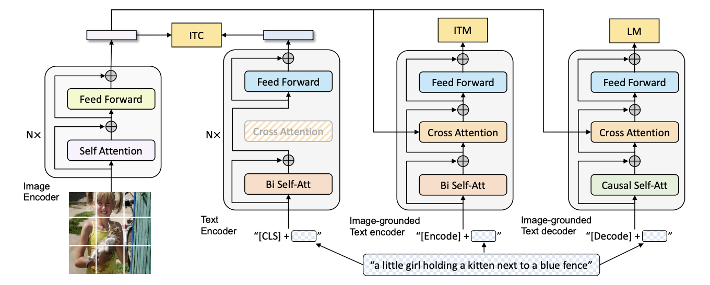
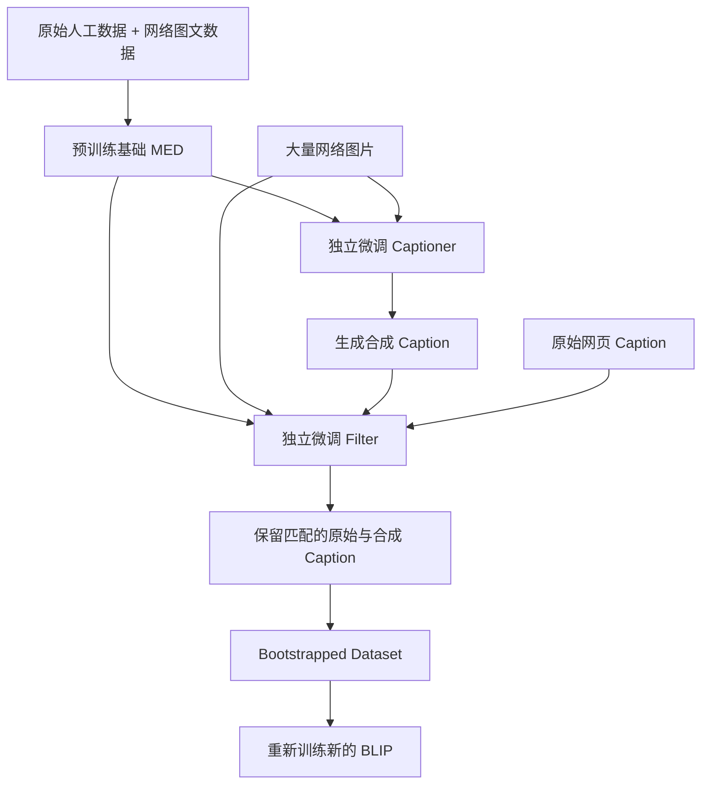

# 04-BLIP：统一图文理解、生成与数据自举

> 主要参考：
> - [BLIP: Bootstrapping Language-Image Pre-training for Unified Vision-Language Understanding and Generation](https://arxiv.org/abs/2201.12086)
> - [BLIP 论文 PDF](https://arxiv.org/pdf/2201.12086)
> - [BLIP 官方代码仓库](https://github.com/salesforce/BLIP)
> - [Salesforce LAVIS](https://github.com/salesforce/LAVIS)

> [!note]
> CLIP 主要解决图文全局对齐，却不能直接根据图片生成文字。BLIP 同时从模型与数据两个方向推进：用 MED 在一个框架中统一图文对齐、细粒度匹配和文本生成；用 CapFilt 为网络图片生成新 Caption，并过滤错误图文对。前者解决“模型怎样兼顾理解与生成”，后者解决“怎样从大规模噪声数据中获得更好的监督”。

## 0. 一句话理解 BLIP

```text
模型侧 MED：
同一批图文对
├→ ITC：分别编码，学习全局图文对齐
├→ ITM：深度融合，判断图文是否真正匹配
└→ LM：以图片为条件，自回归生成 Caption

数据侧 CapFilt：
基础 MED
├→ Captioner：为网络图片生成合成 Caption
└→ Filter：过滤不匹配的原始与合成 Caption
        ↓
得到清洗、扩充后的图文数据
        ↓
重新训练一个新的 BLIP
```

BLIP 的两个核心贡献可以压缩成：

| 贡献 | 解决的问题 |
| --- | --- |
| MED：Multimodal Mixture of Encoder-Decoder | 一个模型怎样同时完成理解与生成任务 |
| CapFilt：Captioning and Filtering | 怎样改善大规模网络图文数据的质量与多样性 |

## 1. BLIP 想解决什么问题

在 BLIP 之前，视觉语言模型通常偏向两类架构。

Encoder-based 模型以 CLIP 为代表：

```text
图片 → Image Encoder → 图片向量 ─┐
                                ├→ 相似度
文本 → Text Encoder  → 文本向量 ─┘
```

它们适合检索、分类和匹配，却不容易直接迁移到图片描述等生成任务。

Encoder-Decoder 模型则擅长：

```text
图片 → Encoder → Decoder → 生成 Caption
```

但这类结构不一定适合大规模图文检索，因为每个候选图文对都进行深度融合会非常昂贵。

除了模型结构，训练数据也有问题。网络 Alt-text 可能只是文件名、网页操作提示，甚至与图片无关：

```text
图片：一只狗在草地上奔跑
网页文本：IMG_2020_final.jpg
```

因此 BLIP 同时提出两个问题：

1. 能否用一套参数兼顾图文理解和文本生成？
2. 能否让模型自己生成并筛选 Caption，改善网络图文数据？

## 2. MED 总体结构



> 图源：BLIP 原论文 Figure 2。

MED 中的 Mixture 不是 MoE，也没有 Router 或专家路由。它表示同一套模型通过不同输入方式和 Attention 结构，以三种功能模式工作：

1. Unimodal Encoder；
2. Image-grounded Text Encoder；
3. Image-grounded Text Decoder。

它们对应三个联合训练目标：

| 模式 | 目标 | 图文是否交互 | Self-Attention | 核心能力 |
| --- | --- | --- | --- | --- |
| Unimodal Encoder | ITC | 否，分别编码 | 文本侧双向 | 全局图文对齐 |
| Image-grounded Text Encoder | ITM | 是，Cross-Attention | 双向 | 细粒度图文匹配 |
| Image-grounded Text Decoder | LM | 是，Cross-Attention | 因果 | 根据图片生成文字 |

### 2.1 共同的 Image Encoder

图片首先经过 ViT：

```text
图片
→ Patch Embedding
→ Vision Transformer
→ 一串视觉 Token
```

设图片为 $`I`$，Image Encoder 为 $`f_{\mathrm{vision}}`$：

```math
H_I=f_{\mathrm{vision}}(I)
```

若共有 $`N_I`$ 个视觉 Token，隐藏维度为 $`D`$：

```math
H_I\in\mathbb{R}^{N_I\times D}
```

同一份视觉表示会根据当前任务，以不同方式参与 ITC、ITM 和 LM。

### 2.2 文本 Encoder 与 Decoder 如何共享参数

MED 不是三个完全独立的网络。论文让 Text Encoder 与 Text Decoder 共享大部分参数，但保留不同的 Self-Attention：

```text
Text Encoder 专用：双向 Self-Attention

共享：Cross-Attention + Feed Forward 等参数

Text Decoder 专用：因果 Self-Attention
```

原因是两者需要不同的信息可见范围：

- Encoder 为理解完整文本，需要同时读取前后文。
- Decoder 为自回归生成，预测当前位置时不能偷看未来 Token。

这种共享使图文对齐、融合和生成三种训练信号能够影响同一套跨模态参数。

## 3. 三个目标如何联合训练

BLIP 对同一批图文数据执行三条任务支路：

```text
同一批图片与文本
        │
        ├→ 图文分别编码 → ITC
        │
        ├→ 文本读取图片 → ITM
        │
        └→ 图片条件生成 → LM
```

总目标可以概括为：

```math
\mathcal{L}
=
\mathcal{L}_{\mathrm{ITC}}
+
\mathcal{L}_{\mathrm{ITM}}
+
\mathcal{L}_{\mathrm{LM}}
```

下面沿着“粗粒度对齐 → 细粒度匹配 → 语言生成”的顺序理解三项任务。

### 3.1 ITC：全局图文对齐

Image-Text Contrastive Learning 与 CLIP 最接近。在这个模式下：

```text
图片只看图片
文本只看文本
两边独立编码后再比较全局表示
```

一个 Batch 中有 $`B`$ 对图文：

```text
(I₁,T₁), (I₂,T₂), ..., (I_B,T_B)
```

编码并归一化后得到图片向量 $`v_i`$ 和文本向量 $`t_j`$，相似度为：

```math
s_{ij}=\frac{v_i^{\mathsf{T}}t_j}{\tau}
```

正确图文对位于相似度矩阵对角线。模型分别进行 Image-to-Text 和 Text-to-Image 分类，让正确配对分数升高、错误配对分数降低。

ITC 学到的是：

> 这张图片与这段文字在整体语义上是否相关？

它适合快速检索，但由于图文 Token 没有深度交互，未必能可靠判断细微的属性与关系差异。

### 3.2 ITM：细粒度图文匹配

Image-Text Matching 让文本通过 Cross-Attention 读取视觉 Token：

```text
文本 Token → Query
图片 Token → Key、Value
              ↓
       Cross-Attention
              ↓
        图文融合表示
              ↓
      Match / Not Match
```

简化表示为：

```math
H_{T\leftarrow I}
=
\mathrm{Attention}(Q_T,K_I,V_I)
```

模型以特殊的 `[Encode]` Token 汇总图文融合信息，再完成二分类：

```text
正样本：猫追狗的图片 + “A cat is chasing a dog.”
负样本：猫追狗的图片 + “A dog is chasing a cat.”
```

二分类损失可以写为：

```math
\mathcal{L}_{\mathrm{ITM}}
=
-y\log p-(1-y)\log(1-p)
```

BLIP 使用 Hard Negative Mining，优先选择语义相近但实际不匹配的负样本。它们比“猫的图片配飞机描述”更能迫使模型学习物体、属性、动作和关系。

因此，ITC 与 ITM 的区别可以记成：

```text
ITC：粗排——整体语义是否相关？
ITM：精排——具体事实是否一致？
```

### 3.3 LM：根据图片生成 Caption

Language Modeling 模式使用 Image-grounded Text Decoder：

```text
图片 → Image Encoder → 视觉 Token
                          ↓ Cross-Attention
[Decode] → Text Decoder → 逐 Token 生成 Caption
```

它与 ITM 的 Cross-Attention 方向相同：文本 Query 读取图片 Key 和 Value。关键差别在于文本 Self-Attention 从双向改成因果形式。

给定 Caption：

```text
A little girl holding a kitten.
```

模型预测 `kitten` 时只能看到图片以及：

```text
A little girl holding a
```

不能提前看到 `kitten` 或后面的 Token。若 Caption 为 $`T=(w_1,\ldots,w_L)`$：

```math
p(T\mid I)
=
\prod_{i=1}^{L}
p(w_i\mid I,w_{1:i-1})
```

对应损失为：

```math
\mathcal{L}_{\mathrm{LM}}
=
-\sum_{i=1}^{L}
\log p(w_i\mid I,w_{1:i-1})
```

LM 迫使模型不仅判断图文关系，还要从视觉信息中恢复足以生成自然语言的内容。

### 3.4 三个目标为什么缺一不可

| 目标 | 优势 | 单独使用的不足 |
| --- | --- | --- |
| ITC | 可独立编码，适合大规模检索 | 缺少 Token 级细粒度交互 |
| ITM | 能判断属性、动作与关系是否一致 | 每个图文对都要融合，检索成本高 |
| LM | 直接学习从图片到语言的生成 | 不直接优化高效检索与匹配排序 |

三者联合后形成递进关系：

```text
ITC 先对齐全局语义
        ↓
ITM 再学习细粒度图文融合
        ↓
LM 要求模型真正根据图片说出内容
```

## 4. CapFilt：用模型改善训练数据

MED 解决模型结构问题，CapFilt 解决网络图文数据的噪声问题。其名称来自两个模块：

```text
Cap：Captioner
Filt：Filter
```

完整流程为：



### 4.1 Captioner：生成新的图片描述

基础 MED 完成预训练后，论文把 Image-grounded Text Decoder 微调成 Captioner：

```text
网络图片
→ Captioner
→ “A dog running through a grassy field.”
```

合成 Caption 不依赖原始网页文本，它从图片本身重新描述内容，从而：

- 为原本无关或过短的网页文本提供替代描述。
- 为同一图片补充不同角度的语言监督。
- 增加 Caption 的多样性。

论文发现 Nucleus Sampling 虽然比 Beam Search 产生更多噪声，却能生成更加多样的 Caption；配合后续 Filter 后，这种多样性对下游任务更有价值。

### 4.2 Filter：检查图文是否一致

论文把 Image-grounded Text Encoder 单独微调成 Filter。它执行类似 ITM 的判断：

```text
图片 + 原始网页 Caption → 匹配？→ 保留或删除

图片 + 合成 Caption     → 匹配？→ 保留或删除
```

Filter 主要判断 Caption 与图片的语义一致性，而不是笼统评价文笔是否优美。最终数据可能同时保留：

- 与图片匹配的原始 Caption；
- 与图片匹配的合成 Caption。

这样既能过滤错误监督，又能扩充每张图片的语言描述。

### 4.3 Captioner 和 Filter 为什么要独立

如果同一个模型既生成 Caption，又判断自己的 Caption 是否正确，容易产生 Confirmation Bias：

```text
模型生成错误描述
        ↓
同一模型认可自己的错误
        ↓
错误样本进入新数据集
```

因此论文从同一个基础 MED 初始化两份模型，再分别微调：

```text
基础 MED
├→ 独立 Captioner
└→ 独立 Filter
```

它们在 CapFilt 阶段不共享参数，使 Filter 能相对独立地检查 Captioner 的结果。

### 4.4 为什么要重新训练新模型

CapFilt 得到 Bootstrapped Dataset 后，论文使用它重新预训练一个新的 BLIP，而不是只在旧模型上继续训练：

```text
旧模型改善数据
        ↓
改进的数据训练新模型
```

论文的消融结果显示，单纯延长旧模型在噪声数据上的训练不能带来相同提升；在旧模型基础上继续训练自举数据，也不如训练新模型。

这就是 BLIP 中 Bootstrapping 的完整含义：

> 基础模型生成并筛选更好的训练数据，再由这些数据培养新的模型。

## 5. 一轮完整预训练的数据流

将 MED 与 CapFilt 连起来，可以得到 BLIP 的完整方法：

```text
第一轮：训练基础模型
原始图文对
→ ITC + ITM + LM
→ 基础 MED

第二轮：构造新数据
基础 MED
→ Captioner + Filter
→ 生成并筛选 Caption
→ Bootstrapped Dataset

第三轮：重新训练
Bootstrapped Dataset
→ ITC + ITM + LM
→ 新的 BLIP
```

需要区分两个层面的“联合”：

- ITC、ITM、LM 是 MED 预训练中的联合目标。
- Captioner 与 Filter 是数据构造阶段的两个独立模型，不在同一次前向传播中联合训练。

## 6. 下游任务怎样使用 MED

MED 统一的是预训练底座，而不是所有下游任务的输入、输出和推理接口。预训练完成后，不同任务仍要选择相应组件、重新组织数据流，并使用任务数据分别 Fine-tune：

| 下游任务 | 组件组合 | 微调目标 | 推理输出 |
| --- | --- | --- | --- |
| Image-Text Retrieval | Image/Text Encoder + Image-grounded Text Encoder | ITC + ITM | 图文排序分数 |
| Image Captioning | Image Encoder + Image-grounded Text Decoder | LM | Caption |
| VQA | Image Encoder + Question Encoder + Answer Decoder | 加权答案 LM | 候选答案或生成答案 |
| NLVR² | Image Encoder + 双图 Cross-Attention Text Encoder | 二分类损失 | True / False |
| Visual Dialog | 图片、Caption 与对话 Encoder | ITM 排序损失 | 候选回答排序 |

> [!important]
> “Unified Vision-Language Understanding and Generation”主要表示 ITC、ITM、LM 能在一套共享参数的 MED 中联合预训练，并能为多类任务提供初始化。它不表示一个预训练 Checkpoint 无需任务微调，只靠改变 Prompt 就能稳定完成所有任务。

### 6.1 Image-Text Retrieval：ITC 召回，ITM 重排

图文检索需要从大量候选中找出匹配项。若让每个图文组合都执行 Cross-Attention，成本会随候选数量快速增长，因此 BLIP 使用两阶段检索：

```text
第一步：ITC 粗排
图片与文本分别编码
→ 预先计算全局向量
→ 通过点积快速召回 Top-k 候选

第二步：ITM 精排
只对 Top-k 候选执行图文 Cross-Attention
→ 计算细粒度匹配分数
→ 重新排序
```

微调时继续联合优化 ITC 和 ITM：

```math
\mathcal{L}_{\mathrm{retrieval}}
=
\mathcal{L}_{\mathrm{ITC}}
+
\mathcal{L}_{\mathrm{ITM}}
```

论文在 COCO 上取 $`k=256`$，在 Flickr30K 上取 $`k=128`$。ITC 保证大规模召回效率，ITM 则对物体、属性、动作和关系进行更精确的核对。

### 6.2 Image Captioning：使用预训练 Decoder 继续做 LM

图片描述与预训练 LM 支路最接近：

```text
图片
→ Image Encoder
→ 视觉 Token
→ Image-grounded Text Decoder
→ 自回归生成 Caption
```

模型从 BLIP 预训练权重初始化，再使用 COCO Caption 数据和语言建模损失微调：

```math
\mathcal{L}_{\mathrm{caption}}
=
-\sum_{i=1}^{L}
\log p(w_i\mid I,w_{1:i-1})
```

论文在 Caption 前加入文本 Prompt `a picture of`，让 Decoder 接着生成图片内容。推理时使用 Beam Search，Beam Size 为 3，最大生成长度为 20。

这项任务不需要新增全新的文本生成器，主要是让预训练 Image-grounded Text Decoder 适应 COCO Caption 的数据分布和描述风格。

### 6.3 VQA：重新组合 Question Encoder 与 Answer Decoder

VQA 输入图片和问题，输出答案。BLIP 不把它当成固定类别分类，而是重新排列预训练组件，将答案建模为文本序列：

```text
图片
→ Image Encoder
→ 图片 Token
                  ┐
问题               ↓ Cross-Attention
→ Question Encoder
→ 图片—问题融合表示
                  ↓ Cross-Attention
→ Answer Decoder
→ 答案 Token
```

三个模块都由 BLIP 已有组件初始化：

| VQA 模块 | 预训练来源 |
| --- | --- |
| Image Encoder | BLIP 的 ViT Image Encoder |
| Question Encoder | Image-grounded Text Encoder |
| Answer Decoder | Image-grounded Text Decoder |

因此 Answer Decoder 不是随机增加并从零训练的新模型。变化主要在数据流：预训练 LM 中 Decoder 直接读取图片；VQA 中 Question Encoder 先融合图片和问题，Answer Decoder 再读取这份融合表示。

#### 6.3.1 图片与问题怎样融合

图片经过 ViT 得到视觉 Token $`H_I`$。问题前加入 `[Encode]` Token，再进入 Question Encoder：

```text
问题 Token
→ 双向 Self-Attention 理解完整问题
→ 作为 Query，通过 Cross-Attention 读取图片 Token
→ 得到图片—问题融合表示 H_IQ
```

```math
H_{IQ}=f_{\mathrm{question}}(Q,H_I)
```

例如问题是“What is the cat wearing?”，问题语义会引导融合表示保留与猫及其穿戴物有关的视觉内容。

#### 6.3.2 为什么一条问题有多个答案

VQAv2 为同一个问题收集多个人工回答，它们可能不完全一致：

```text
sunglasses：7 次
glasses：2 次
dark glasses：1 次
```

BLIP 合并相同答案，并用出现频率作为权重：

```math
w_{bj}
=
\frac{\text{答案 }A_{bj}\text{ 的出现次数}}
{\text{问题 }b\text{ 的答案总数}}
```

上例会得到：

```text
sunglasses   → 0.7
glasses      → 0.2
dark glasses → 0.1
```

Question Encoder 对一张图片和一个问题只计算一次，再按不同人工答案数量复制融合表示，让 Answer Decoder 分别计算各答案的序列损失。

#### 6.3.3 Answer Decoder 如何训练

Answer Decoder 使用 Teacher Forcing。例如目标答案是 `dark glasses`：

```text
输入：[BOS]              → 预测 dark
输入：[BOS] dark         → 预测 glasses
输入：[BOS] dark glasses → 预测 [EOS]
```

对第 $`b`$ 条问题的第 $`j`$ 个答案：

```math
P(A_{bj}\mid I_b,Q_b)
=
\prod_{i=1}^{L_{bj}}
P(a_{bji}\mid I_b,Q_b,a_{bj,1:i-1})
```

所有答案按人工频率加权：

```math
\mathcal{L}_{\mathrm{VQA}}
=
-\frac{1}{B}
\sum_{b=1}^{B}
\sum_{j=1}^{n_b}
w_{bj}
\log P(A_{bj}\mid I_b,Q_b)
```

这样模型可以接受多个合理表达，同时更重视人工标注中出现频率高的答案。

#### 6.3.4 哪些参数参与微调

官方实现默认把整个 VQA 模型的参数交给 AdamW，因此梯度会更新：

```text
VQA Loss
   ↓
Answer Decoder
   ↓
Question Encoder
   ↓
Image Encoder
```

这与 BLIP-2 的冻结策略不同。BLIP-1 的 VQA Fine-tuning 是从预训练权重出发进行任务级端到端微调，而不是只训练一个新答案 Head。

论文的主要 VQA 配置为：

| 配置 | 数值 |
| --- | ---: |
| 数据 | VQAv2 Train + Val，并加入 Visual Genome QA |
| 图片分辨率 | $`480\times480`$ |
| 初始学习率 | $`2\times10^{-5}`$ |
| 全局 Batch Size | 256 |
| Epoch | 10 |
| 优化器 | AdamW |
| Weight Decay | 0.05 |

#### 6.3.5 论文中的 VQA 推理不是完全开放生成

官方代码支持 Beam Search 自由生成，但论文报告 VQAv2 结果时，主要让 Decoder 在 3,128 个候选答案中排序：

```math
A^*
=
\arg\max_{A\in\mathcal{C}}
P(A\mid I,Q)
```

其中 $`\mathcal{C}`$ 是候选答案集合。为减少计算，实际分两步：

```text
3,128 个候选答案
→ 根据第一个答案 Token 的概率粗排
→ 保留 Top-128
→ 计算每个候选的完整序列 Log Probability
→ 选择分数最高的答案
```

因此，BLIP 将 VQA 建模为生成任务，但论文的最终推理仍借助固定候选答案集合。这也是它不如现代指令 VLM 通用的一处表现。

### 6.4 NLVR²：让文本同时读取两张图片

NLVR² 输入两张图片和一句文本，判断文本是否正确描述这对图片：

```text
图片 1 ─┐
        ├→ Image-grounded Text Encoder → MLP → True / False
图片 2 ─┘
文本  ────────────────────────────────↑
```

BLIP 在每个 Image-grounded Text Encoder Block 中配置两套 Cross-Attention，分别读取两张图片。论文前 6 层对两路 Cross-Attention 输出做平均，后 6 层将其拼接后再线性投影。最终取 `[Encode]` 表示，接一个 MLP 二分类器。

这说明 BLIP 的下游迁移不只是更换损失，有时还需要修改 Cross-Attention 的连接方式。

### 6.5 Visual Dialog：对候选回答进行排序

Visual Dialog 不仅依赖当前问题，还要考虑图片、图片 Caption 和历史对话。论文采用判别式设置：

```text
图片 + Caption
        ↓
对话历史 + 当前问题 + 候选回答
        ↓
Image-grounded Dialog Encoder
        ↓
判断候选回答 True / False
        ↓
对所有候选回答排序
```

这里继续使用类似 ITM 的匹配目标，而不是让 Decoder 完全自由地生成答案。

### 6.6 为什么说 BLIP-1 仍然不够通用

经过 MED 预训练，同一套权重可以为多种任务提供良好初始化，但任务之间仍存在显著差异：

| 需要适配的部分 | 示例 |
| --- | --- |
| 模块组合 | VQA 需要 Question Encoder + Answer Decoder |
| Cross-Attention 连接 | NLVR² 要分别读取两张图片 |
| 训练目标 | Retrieval 用 ITC/ITM，Caption 用 LM，NLVR² 用二分类 |
| 数据格式 | VQA 有多个人工答案与权重，Visual Dialog 有历史对话 |
| 推理算法 | Retrieval 重排、VQA 候选排序、Caption Beam Search |

所以 BLIP-1 的范式是：

```text
统一视觉语言预训练底座
+ 每个下游任务单独设计 Fine-tuning 与推理流程
```

而不是后来指令 VLM 更接近的：

```text
图片 + 任意自然语言指令
→ 同一个生成接口
→ 直接输出答案
```

## 7. BLIP 与 CLIP 的关系

| 能力 | CLIP | BLIP |
| --- | --- | --- |
| 图文独立编码与对比学习 | 有 | 有，ITC |
| 图文 Token 深度交互 | 无 | 有，ITM |
| 根据图片生成文本 | 无 | 有，LM |
| 清洗和扩充网络 Caption | 无 | 有，CapFilt |
| 使用大语言模型 | 无 | 无 |

BLIP 继承了 CLIP 的全局对比学习思想，但没有停在共享语义空间：

```text
CLIP：对齐

BLIP：对齐 + 融合 + 生成 + 数据自举
```

不过 BLIP-1 仍然不是后来常见的“视觉编码器 + 大语言模型”架构。它使用的是自身的文本 Encoder/Decoder 组件，下一篇 BLIP-2 才会引入冻结 LLM。

## 8. 易混点集中澄清

| 常见理解 | 是否准确 | 更准确的说法 |
| --- | --- | --- |
| Image Encoder 后接了三个完全独立模型 | 不准确 | MED 的三种模式共享大量参数，只在信息流和部分 Self-Attention 上不同 |
| ITC 与 ITM 都只是判断图文是否相关 | 过于粗略 | ITC 做独立编码后的全局对齐；ITM 做深度融合后的细粒度二分类 |
| Filter 评价 Caption 的语言写作质量 | 不准确 | Filter 主要判断 Caption 是否与图片内容匹配 |
| Captioner 和 Filter 始终共享参数 | 错误 | 它们从基础 MED 初始化后分别微调，CapFilt 阶段彼此独立 |
| 清洗数据后继续训练原 BLIP 即可 | 不准确 | 论文使用 Bootstrapped Dataset 重新训练一个新模型 |
| MED 是 Mixture of Experts | 错误 | MED 是三种 Encoder/Decoder 功能模式的混合，没有 MoE Router |
| BLIP 已经使用 LLM | 错误 | BLIP-1 使用自身文本模块；BLIP-2 才连接冻结 LLM |

## 9. 与 BLIP-2 的衔接

BLIP-2 继承了 BLIP-1 的三种学习思想：

```text
BLIP-1 ITC → BLIP-2 ITC
BLIP-1 ITM → BLIP-2 ITM
BLIP-1 LM  → BLIP-2 ITG
```

但训练对象发生了根本变化：

```text
BLIP-1：
训练自身的 Image Encoder 与文本 Encoder/Decoder

BLIP-2：
冻结现成 Image Encoder 与现成 LLM
只训练中间的 Q-Former 和连接层
```

因此，理解 BLIP-1 后，阅读 BLIP-2 的关键问题变成：

> 怎样把 ITC、ITM、生成任务迁移到一组 Learnable Query 上，让它们从冻结视觉模型中提取信息，并把信息交给冻结 LLM？

## 10. 总结

BLIP 的主方法可以压缩为：

```text
模型侧 MED：
ITC 学全局对齐
+ ITM 学细粒度融合
+ LM 学图片条件文本生成

数据侧 CapFilt：
Captioner 生成多样 Caption
+ Filter 删除图文不匹配 Caption
→ 用自举数据重新训练新的 BLIP
```

最终需要记住四点：

1. MED 用三种工作模式统一理解与生成，不是三个完全独立的模型。
2. ITC、ITM、LM 分别解决全局对齐、细粒度匹配与条件生成。
3. Captioner 负责生成，Filter 负责检查图文一致性，两者在 CapFilt 阶段彼此独立。
4. BLIP 的 Bootstrapping 是“旧模型改善数据，再用新数据训练新模型”。
