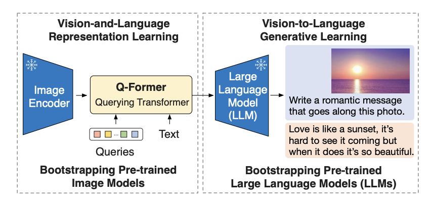
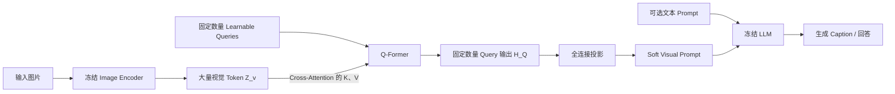
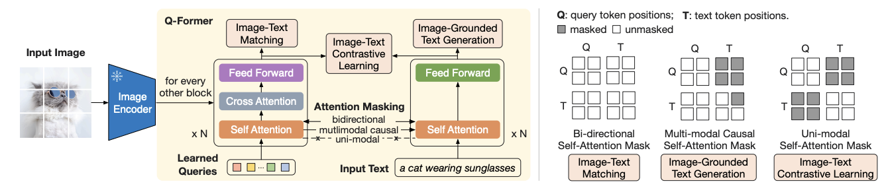
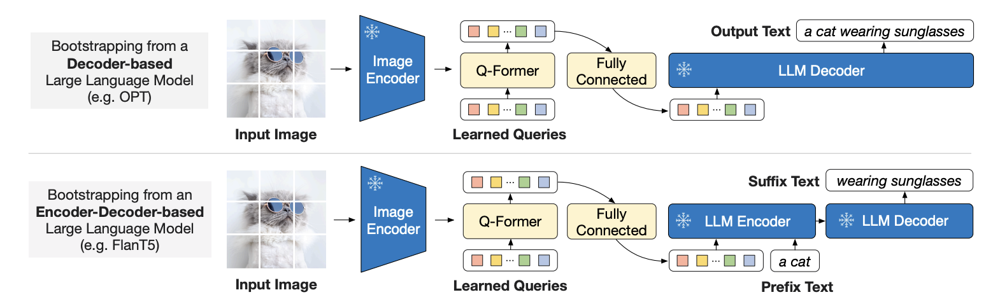

# 05-BLIP-2：用 Q-Former 连接冻结视觉模型与冻结 LLM

> 主要参考：
> - [BLIP-2: Bootstrapping Language-Image Pre-training with Frozen Image Encoders and Large Language Models](https://arxiv.org/abs/2301.12597)
> - [BLIP-2 论文 PDF](https://arxiv.org/pdf/2301.12597)
> - [Salesforce LAVIS 官方实现](https://github.com/salesforce/LAVIS)
> - [LAVIS 中的 BLIP-2 模型代码](https://github.com/salesforce/LAVIS/tree/main/lavis/models/blip2_models)

> [!note]
> BLIP-1 训练自己的视觉和文本模块，BLIP-2 则尝试复用两个已经很强的单模态模型：冻结的 Image Encoder 与冻结的 LLM。它在两者之间加入轻量 Q-Former，用固定数量的 Learnable Query 从大量视觉 Token 中查询与语言相关的信息，再把这些信息投影成 LLM 可以利用的 Soft Visual Prompt。

## 0. 一句话理解 BLIP-2

```text
图片
→ 冻结 Image Encoder
→ 大量视觉 Token
→ Learnable Query + Q-Former 查询、筛选和压缩
→ 固定数量 Query 输出
→ 线性投影为 Soft Visual Prompt
→ 冻结 LLM
→ 自回归生成文本
```

它采用两阶段预训练：

```text
阶段一：视觉—语言表示学习
ITC + ITM + ITG
→ 教 Q-Former 从图片中提取什么

阶段二：视觉到语言生成学习
Q-Former + 线性投影 + 冻结 LLM
→ 教 Q-Former 怎样把视觉信息说成 LLM 能理解的“语言”
```



> 图源：BLIP-2 原论文 Figure 1。左侧的第一阶段训练 Q-Former 的视觉—语言表示能力；右侧的第二阶段再将其接入冻结 LLM，学习视觉条件文本生成。

## 1. BLIP-2 想解决什么问题

现代视觉模型和语言模型不断扩大。如果从头端到端训练整个视觉语言模型：

```text
Image Encoder + 跨模态模块 + Language Model
                       ↓
                  全部更新参数
```

计算成本很高，还可能破坏单模态预训练已经学到的能力，也就是 Catastrophic Forgetting。

BLIP-2 提出另一种思路：

```text
冻结强 Image Encoder
+ 冻结强 LLM
+ 只训练中间连接器
```

冻结视觉模型可以保留高质量视觉表示，冻结 LLM 可以保留语言生成、知识与 Zero-shot Transfer 能力。但这也使跨模态对齐更困难：LLM 在语言预训练中从未见过图片，而且它的参数不能主动适应新的视觉输入。

因此，中间连接器必须独立解决：

1. 从大量视觉 Token 中提取哪些信息？
2. 如何把视觉表示转换为冻结 LLM 能够解释的输入？

BLIP-2 的答案就是 Q-Former 与两阶段预训练。

## 2. 总体架构

BLIP-2 的完整主链路如下：



| 模块 | 是否冻结 | 作用 |
| --- | --- | --- |
| Image Encoder | 是 | 提供高质量视觉 Token |
| Learnable Queries | 否 | 提供固定数量的视觉信息查询槽位 |
| Q-Former | 否 | 从视觉 Token 中提取、压缩与语言相关的信息 |
| 全连接投影 | 否 | 映射到 LLM 的词向量维度 |
| LLM | 是 | 根据视觉 Prompt 和文本 Prompt 生成语言 |

> [!important]
> BLIP-2 论文中的 Image Encoder 与 LLM 在预训练阶段保持冻结。真正承担跨模态学习压力的是 Q-Former、Learnable Query 和连接到 LLM 的投影层。

## 3. Q-Former 的内部结构



> 图源：BLIP-2 原论文 Figure 2。

Q-Former 可以理解成两个共享 Self-Attention 的 Transformer 子模块：

1. Image Transformer：接收 Learnable Query，并通过 Cross-Attention 读取冻结 Image Encoder 的视觉 Token。
2. Text Transformer：接收文本 Token，可以作为文本 Encoder 或文本 Decoder 工作。

其主干由 BERT-base 初始化：

- 12 层 Transformer；
- 隐藏维度 768；
- 约 188M 参数；
- 原论文使用 32 个 Learnable Query；
- 每隔一个 Transformer Block 插入一层 Cross-Attention。

Cross-Attention 层是新加入并随机初始化的，其余可复用参数从 BERT 初始化。

### 3.1 Learnable Query 是什么

原论文定义 32 个可学习向量：

```math
Q=\left\{q_1,q_2,\ldots,q_{32}\right\}
```

它们不是：

- 文本单词或 Token ID；
- 图片 Patch；
- 固定空间位置；
- 人工定义的物体类别；
- 用户输入的问题。

它们只是全局共享、可由梯度更新的模型参数。所有图片都使用同一组初始 Query，但不同图片提供不同的 Key 和 Value，所以最终 Query 输出会随图片变化。

```text
同一组初始 Query + 图片 A 的视觉 Token → 图片 A 的 Query 表示

同一组初始 Query + 图片 B 的视觉 Token → 图片 B 的 Query 表示
```

### 3.2 Query 怎样读取图片

Image Encoder 先产生视觉 Token：

```math
Z_v=g(I)
```

```math
Z_v\in\mathbb{R}^{N_v\times D_v}
```

在 Cross-Attention 中：

- Query 来自 Learnable Query 的隐藏状态；
- Key、Value 来自冻结 Image Encoder 的视觉 Token。

```math
Q_a=H_QW_Q
```

```math
K_v=Z_vW_K
```

```math
V_v=Z_vW_V
```

```math
H_Q'
=
\mathrm{softmax}
\left(
\frac{Q_aK_v^{\mathsf{T}}}{\sqrt{d}}
\right)V_v
```

如果 Image Encoder 输出几百个视觉 Token，32 个 Query 经过 Cross-Attention 后仍只输出 32 个表示：

```text
N_v 个视觉 Token
        ↓
32 个 Query 主动查询
        ↓
32 个 Query 输出
```

因此，Q-Former 既是跨模态连接器，也是固定大小的信息瓶颈。

### 3.3 为什么 Query 要先经过 Self-Attention

32 个 Query 不是彼此隔离的 32 个探针，而是一组需要协同提取信息的视觉槽位。在 Q-Former Block 中，Query 先通过 Self-Attention 交换状态，再由部分 Block 中的 Cross-Attention 读取图片 Token：

```text
32 个 Learnable Query
→ Self-Attention：Query 之间交流和协调
→ Cross-Attention：从图片 Token 中读取信息
→ 后续 Self-Attention：交换各自已读取的图像信息
→ 后续 Cross-Attention：带着上下文继续查询图片
```

Self-Attention 对 Query 状态的更新可以概括为：

```math
\widetilde{H}_Q
=
\mathrm{softmax}
\left(
\frac{H_QW_Q(H_QW_K)^{\mathsf{T}}}{\sqrt{d}}
\right)
H_QW_V
```

它主要解决三个问题：

1. **协调关注内容**：一个 Query 可以根据其他 Query 的状态调整自己的查询，减少大量 Query 重复关注同一区域。
2. **组合局部信息**：不同 Query 可能分别读到“猫”“眼镜”和“戴着”，Self-Attention 让它们进一步形成“猫戴着眼镜”这种关系表示。
3. **支持多轮查询**：经过一次 Cross-Attention 后，Query 已经携带与当前图片有关的信息。下一层 Self-Attention 先汇总这些信息，再进行下一轮视觉查询。

第一次 Cross-Attention 之前，Self-Attention 交流的只是 32 个可学习参数的初始状态；从第一次 Cross-Attention 之后开始，后续 Self-Attention 交流的就是已经被图片条件化的 Query 表示。因此可以把两种注意力的分工记成：

> Cross-Attention 负责“看图片”，Self-Attention 负责“交流看到了什么，并决定接下来怎样查询”。

### 3.4 Query 会固定负责某个物体吗

不能机械理解为：

```text
Query 1 永远负责人
Query 2 永远负责汽车
Query 3 永远负责背景
```

论文没有给每个 Query 指定固定职责。每个 Query 只是一个可学习的信息槽位，它在具体图片中关注什么，由视觉内容、其他 Query、文本和训练目标共同决定。

结构提供了读取视觉 Token 的通道；ITC、ITM 和 ITG 的损失则迫使这些 Query 逐渐提取对语言任务有用的信息。

### 3.5 文本是不是也被压缩成一个向量

这取决于训练任务，不能统一理解为“文本总会经过注意力得到一个向量”：

| 任务 | 文本如何表示 | 如何与图片交互 |
| --- | --- | --- |
| ITC | 取文本 `[CLS]` 输出作为全局向量 | 与 32 个 Query 输出分别计算相似度，再取最大值 |
| ITM | 保留文本 Token 序列 | Query 与 Text 通过双向 Self-Attention 深度融合 |
| ITG | 保留文本 Token 序列 | Text 读取 Query，并按因果顺序逐 Token 生成 |

所以，图片侧始终用 32 个 Query 形成固定长度的视觉表示；文本侧则根据 ITC、ITM 或 ITG 的需要，使用一个全局向量或完整 Token 序列。

## 4. 第一阶段：视觉—语言表示学习

第一阶段暂时不连接 LLM：

```text
图片 → 冻结 Image Encoder → Q-Former ← 文本
                              ↓
                       ITC + ITM + ITG
```

其目的不是让 LLM 生成答案，而是先让 Q-Former 学会提取与文本相关的视觉表示。

三项任务继承自 BLIP-1，但训练主体已经变成 Query 与 Q-Former：

| BLIP-1 | BLIP-2 | 主要作用 |
| --- | --- | --- |
| ITC | ITC | 图文全局对齐 |
| ITM | ITM | 细粒度图文匹配 |
| LM | ITG | 以图片为依据生成文本 |

### 4.1 ITC：Query 与文本保持隔离

Image-Text Contrastive Learning 要求图片与文本分别编码，最后才能公平地比较表示。因此使用 Unimodal Self-Attention Mask：

```text
Query 可以读取 Query
Text 可以读取 Text
Query 与 Text 互相不可见
```

图像侧得到 32 个 Query 输出：

```math
H_Q=\left\{h_1^Q,h_2^Q,\ldots,h_{32}^Q\right\}
```

文本侧使用 `[CLS]` 得到全局文本表示 $`t`$。每个 Query 都与文本计算相似度：

```math
s_k=(h_k^Q)^{\mathsf{T}}t
```

论文取全部 Query 中最大的相似度作为图文相似度：

```math
s(I,T)=\max_k s_k
```

直觉是：32 个 Query 提供多个视觉信息槽位，只要其中某个 Query 提取到了与当前文本最相关的内容，这对图文就可以得到较高分数。

随后仍像 CLIP 一样进行双向图文对比，让正确图文对靠近、错误图文对远离。

**例如**，对于猫图片和“A cat wearing sunglasses.”，32 个 Query 分别与该文本的 `[CLS]` 向量计算相似度，其中最高分作为这对图文的分数。在 Batch 内，该分数应高于猫图片与其他文本的分数，否则 ITC 交叉熵就会产生惩罚。

### 4.2 ITM：Query 与文本双向交互

Image-Text Matching 使用 Bi-directional Self-Attention Mask：

```text
Query 可以读取 Query 与 Text
Text 可以读取 Query 与 Text
```

Cross-Attention 已经把图片信息注入 Query，Query 再与文本 Token 通过共享 Self-Attention 深度交互：

```text
视觉 Token
   ↓ Cross-Attention
Query 表示 ↔ 文本 Token
   ↓ 双向 Self-Attention
融合后的 Query 表示
   ↓
Match / Not Match
```

每个 Query 的输出经过二分类头，论文对所有 Query 的匹配 Logit 取平均，得到最终图文匹配分数。训练中还使用 Hard Negative Mining，使模型区分语义接近但事实不一致的图文对。

**例如**，猫图片会与正文本“A cat wearing sunglasses.”和困难负文本“A cat wearing a hat.”分别组成一对输入。对每一对，整段文本与 32 个 Query 先双向交互；32 个 Query 各自产生匹配 Logit，取平均后只得到一次图文 Match / Not Match 判断。因此这不是“一段文本与 32 个 Query 做 32 个独立标注任务”。

### 4.3 ITG：视觉单向流向文本

Image-Grounded Text Generation 使用 Multimodal Causal Self-Attention Mask，信息流为：

```text
Query 可以读取所有 Query
Query 不能读取 Text

Text 可以读取所有 Query
Text 只能读取自己和之前的 Text
```

因此信息只能沿着下面的方向传播：

```text
图片 → Query → 文本生成
```

而不能从目标 Caption 反向泄漏给 Query。若文本为 $`T=(w_1,\ldots,w_L)`$：

```math
p(T\mid I)
=
\prod_{i=1}^{L}
p(w_i\mid H_Q,w_{1:i-1})
```

ITG 迫使 Query 输出保留足以支持文本生成的视觉内容。

**例如**，目标文本是“A cat wearing sunglasses.”。Query 只能读取图片，不能看到目标文本；文本侧则可以读取 32 个 Query，并根据图片信息与已有前缀依次预测 `A`、`cat`、`wearing` 和 `sunglasses`。各位置的下一 Token 交叉熵会更新 Q-Former 和 Learnable Query。

### 4.4 为什么三个任务需要不同 Mask

| 任务 | Query 能看 Text | Text 能看 Query | Text 能看未来文本 | 目的 |
| --- | ---: | ---: | ---: | --- |
| ITC | 否 | 否 | 是 | 图文分别编码后做对比 |
| ITM | 是 | 是 | 是 | 图文充分交互后判断匹配 |
| ITG | 否 | 是 | 否 | 视觉作为条件，自回归生成文本 |

可以记成：

```text
ITC：隔离后比较

ITM：双向交流后判断

ITG：视觉单向流向文本
```

同一套 Q-Former 参数配合不同 Attention Mask，就能承担三种训练目标。这是 BLIP-2 第一阶段的核心设计。

## 5. 第二阶段：视觉到语言生成学习

第一阶段结束后，Q-Former 已经知道“从图片中提取什么”。第二阶段把它接到冻结 LLM，继续学习“怎样把提取的信息变成 LLM 能解释的输入”。

```text
图片
→ 冻结 Image Encoder
→ Q-Former
→ 32 个 Query 输出
→ 全连接投影
→ Soft Visual Prompt
→ 冻结 LLM
→ 生成文本
```



> 图源：BLIP-2 原论文 Figure 3。上半部是 Decoder-only OPT，视觉 Prompt 直接作为生成序列的前缀；下半部是 Encoder-Decoder Flan-T5，视觉 Prompt 与文本前缀进入 Encoder，Decoder 负责生成后续文本。

### 5.1 为什么还要一个全连接层

Q-Former 隐藏维度为 $`D_Q`$，LLM 词向量维度为 $`D_{\mathrm{LLM}}`$。投影矩阵 $`W`$ 将 Query 输出映射到 LLM 维度：

```math
H_v=H_QW
```

```math
H_v\in\mathbb{R}^{32\times D_{\mathrm{LLM}}}
```

这一层首先解决维度差异；结合第二阶段的生成损失，它还参与把 Q-Former 表示对齐到冻结 LLM 能利用的输入空间。

### 5.2 Soft Visual Prompt 是什么

普通文本进入 LLM 的过程是：

```text
文本
→ Token ID
→ Embedding Lookup
→ 文本 Embedding
```

视觉 Prompt 则没有词表 ID：

```text
图片
→ Q-Former
→ 线性投影
→ 直接得到连续 Embedding
```

这些连续 Embedding 被放在文本 Prompt 前面：

```text
[Visual 1] [Visual 2] ... [Visual 32]
[Text 1]   [Text 2]   ...
```

它们在输入形状上与词向量兼容，却不对应任何真实单词，因此称为 Soft Visual Prompt。

### 5.3 Decoder-only LLM：OPT

连接 OPT 等 Decoder-only LLM 时，视觉 Prompt 作为序列前缀：

```text
视觉 Prompt + 文本 Prompt + 目标文本
```

LLM 使用 Causal Self-Attention，根据视觉前缀和已有文本逐 Token 预测 Caption。LLM 自身保持冻结，梯度只更新 Q-Former、Query 和投影层。

### 5.4 Encoder-Decoder LLM：Flan-T5

连接 Flan-T5 时，输入与输出分属 Encoder 和 Decoder：

```text
Flan-T5 Encoder：视觉 Prompt + 文本 Prompt

Flan-T5 Decoder：自回归生成目标文本
```

两种 LLM 架构不同，但 Q-Former 的作用相同：把图片转换成冻结语言模型可以作为条件使用的连续前缀表示。

### 5.5 第二阶段的生成目标

给定图片 $`I`$ 和目标文本 $`T=(w_1,\ldots,w_L)`$，训练目标仍是条件语言建模：

```math
\mathcal{L}_{\mathrm{V2L}}
=
-\sum_{i=1}^{L}
\log p(w_i\mid H_v,w_{1:i-1})
```

因为 LLM 冻结，若生成错误，梯度不能通过更新 LLM 来适应视觉输入，只能迫使前面的模块产生更适合 LLM 的视觉 Prompt：

```text
生成损失
   ↓
冻结 LLM：参与反向传播，但参数不更新
   ↓
全连接投影：更新
   ↓
Q-Former 与 Learnable Query：更新
   ↓
Image Encoder：冻结
```

## 6. 两阶段为什么不能合并成一个简单生成任务

若一开始就只连接冻结 LLM，使用 Image-to-Text Generation Loss，Q-Former 同时要解决：

- 从视觉 Token 中寻找有用内容；
- 学习图文全局对齐；
- 学习细粒度物体与关系；
- 适配冻结 LLM 的输入空间；
- 支持语言生成。

第一阶段的 ITC、ITM 和 ITG 先提供更直接、结构化的监督：

```text
ITC：哪些视觉内容与整段文本相关？

ITM：视觉事实与文本细节是否一致？

ITG：保留的信息是否足以恢复 Caption？
```

第二阶段再将这些已经具有语言相关性的表示适配到冻结 LLM。论文消融显示，缺少第一阶段表示学习会明显降低 Zero-shot VQA 等性能，说明单独的生成损失不足以稳定地跨越模态差异。

两阶段的分工可以总结为：

| 阶段 | 核心问题 | 是否连接 LLM | 训练目标 |
| --- | --- | ---: | --- |
| 视觉—语言表示学习 | Q-Former 应从图片提取什么 | 否 | ITC + ITM + ITG |
| 视觉到语言生成学习 | 怎样让冻结 LLM 理解这些表示 | 是 | 条件语言生成 |

## 7. 推理时发生什么

预训练完成后，推理不再计算 ITC、ITM 或 ITG 三项损失。以图片问答为例：

```text
图片
→ 冻结 Image Encoder
→ Q-Former 的 Query 提取视觉信息
→ 线性层得到 Soft Visual Prompt

用户问题
→ 文本 Token Embedding

Soft Visual Prompt + 问题 Embedding
→ 冻结 LLM
→ 自回归生成答案
```

若进行下游 VQA 微调，问题还可以作为 Q-Former 的条件，使 Query 针对当前问题提取更相关的视觉内容。不过 BLIP-2 的基础预训练核心仍是使用固定 Learnable Query 构造视觉信息瓶颈。

## 8. BLIP-1、BLIP-2 与 LLaVA 对比

| 对比项 | BLIP-1 | BLIP-2 | 原始 LLaVA |
| --- | --- | --- | --- |
| 视觉模型 | 参与自身预训练 | 冻结 | 冻结 |
| 语言端 | 自身 Text Encoder/Decoder | 冻结 OPT 或 Flan-T5 | Vicuna |
| 连接器 | MED 内部 Cross-Attention | Q-Former + 线性层 | 线性 Projector |
| 是否压缩视觉 Token | 不是核心目标 | 32 个 Query 形成固定瓶颈 | 基本保留 Grid/Patch Token |
| 表示学习目标 | ITC + ITM + LM | ITC + ITM + ITG | Caption 对齐 |
| 第二阶段是否更新 LLM | 不适用 | 不更新 | 更新 Vicuna |
| 数据侧重点 | CapFilt 数据自举 | 复用冻结单模态模型 | GPT-4 合成视觉指令数据 |

三个模型分别回答了不同问题：

```text
BLIP-1：
一个视觉语言模型怎样同时对齐、融合和生成？

BLIP-2：
怎样用轻量连接器复用冻结视觉模型和冻结 LLM？

LLaVA：
怎样用简单 Projector 和视觉指令微调获得强看图对话能力？
```

### 8.1 BLIP-2 与 LLaVA 的关键取舍

```text
BLIP-2：
连接器更复杂
LLM 尽量不动
训练参数少

LLaVA：
连接器非常简单
第二阶段微调 LLM
让语言模型主动适应视觉输入
```

因此，不能简单断言 Q-Former 必然比线性 Projector 更好。两者把跨模态适应压力放在了不同位置：BLIP-2 把更多压力放在连接器上，LLaVA 则允许 LLM 一起适应。

## 9. 易混点集中澄清

| 常见理解 | 是否准确 | 更准确的说法 |
| --- | --- | --- |
| Query 就是用户的问题 | 错误 | Query 是固定数量的可学习参数，不是自然语言问题 |
| 每个 Query 固定对应一个物体类别 | 错误 | Query 是动态提取信息的槽位，没有人工指定固定语义 |
| Q-Former 只负责把维度变小 | 错误 | 它通过 Cross-Attention 查询、压缩并对齐与语言相关的视觉信息 |
| 32 个 Query 是 32 个图片 Patch | 错误 | Query 读取全部视觉 Token，输出不与固定 Patch 一一对应 |
| 三种 Attention Mask 是三个不同模型 | 错误 | 同一个 Q-Former 通过不同 Mask 控制 Query 与 Text 的信息流 |
| ITC 中 Query 与 Text 可以交流 | 错误 | 两者必须隔离，最后才能做对比学习 |
| ITG 中 Query 可以偷看目标文本 | 错误 | Query 不能读取 Text，Text 单向读取 Query 并因果读取历史文本 |
| Soft Visual Prompt 是一串可读单词 | 错误 | 它是一串没有词表 ID 的连续 Embedding |
| BLIP-2 第二阶段会更新 LLM | 错误 | 预训练时 LLM 保持冻结 |
| BLIP-2 能生成图片 | 错误 | 它的 Generative Learning 指根据图片生成文本 |

## 10. 与 Qwen-VL 的衔接

BLIP-2 建立了后续 VLM 中非常重要的连接器思路：

```text
大量视觉 Token
→ 少量可学习 Query 主动查询
→ 固定数量视觉表示
→ LLM
```

Qwen-VL 采用 Cross-Attention Resampler 将视觉特征压缩为固定长度表示。它与 Q-Former 不完全相同，但共享一个核心动机：

> 不把视觉编码器产生的所有细节原样塞进 LLM，而是用可学习的查询机制提取固定数量、与语言任务相关的视觉 Token。

因此，从 BLIP-2 进入 Qwen-VL 时，重点可以比较：

- Query 数量与视觉 Token 压缩方式；
- 连接器是独立 Q-Former 还是更轻量 Resampler；
- 视觉编码器、连接器与 LLM 分别在哪个训练阶段更新；
- 模型如何加入视觉定位与多语言生成能力。

## 11. 总结

BLIP-2 的主链路可以压缩为：

```text
冻结 Image Encoder
→ 大量视觉 Token
→ 32 个 Learnable Query
→ Q-Former Cross-Attention
→ 32 个视觉表示
→ 线性投影
→ Soft Visual Prompt
→ 冻结 LLM
→ 生成文本
```

两阶段训练分别解决：

```text
第一阶段：
ITC + ITM + ITG
→ Q-Former 应该从图片中提取什么？

第二阶段：
视觉到语言生成
→ 怎样让冻结 LLM 理解提取出来的视觉信息？
```

最终需要记住六点：

1. Learnable Query 是模型参数，不是文本问题或固定物体检测槽位。
2. Self-Attention 让 Query 协调关注内容、交换已读取的视觉信息，Cross-Attention 则让 Query 从大量视觉 Token 中主动提取信息。
3. 文本侧不总是压缩成单一向量：ITC 使用 `[CLS]` 全局表示，ITM 和 ITG 则保留文本 Token 序列。
4. 第一阶段通过 ITC、ITM 和 ITG 训练 Q-Former 的图文对齐、匹配和生成能力。
5. 第二阶段将 Q-Former 输出投影成 Soft Visual Prompt，让冻结 LLM 根据图片生成文本。
6. BLIP-2 把跨模态适应压力放在连接器上，因此预训练时 Image Encoder 和 LLM 都可以保持冻结。
