# 01-流水线并行技术：以 GPipe 为例

> [!note]
> 流水线并行先把模型按层切成多个 stage，再让多个 micro-batch 错峰通过这些 stage，以减少设备空转；GPipe 还结合 activation checkpointing（激活检查点/重物化），用额外重计算换取更低的激活显存。

## 阅读说明

- 本文从朴素模型并行的瓶颈出发，依次解释 micro-batch 调度、pipeline bubble、activation checkpointing、显存估算与实验结果，可以独立阅读。
- 讲解保留 GPipe 的核心知识主线，同时压缩重复铺陈，并对易混概念和公式量纲作出必要校正。

## 一句话主线

朴素模型并行解决了“单卡放不下模型”，却引入两个新问题：

1. 不同 GPU 串行等待，产生大量 pipeline bubble。
2. backward 需要 forward 的中间激活，每张 GPU 仍有较大的激活显存压力。

GPipe 使用两项关键设计分别处理这两个问题：

| 问题 | GPipe 的办法 | 本质 |
| --- | --- | --- |
| GPU 空转 | 把 mini-batch 切成多个 micro-batch | 用错峰调度填充流水线 |
| 激活显存过大 | re-materialization / activation checkpointing | 用重计算换显存 |

---

## 1. 分布式训练的两个目标

增加 GPU 数量通常希望获得两类收益：

- **模型容量扩展**：GPU 数量增加时，可以训练更大的模型。
- **训练速度扩展**：GPU 数量增加时，单位时间处理的数据量也增加。

理想情况下，两者都希望接近线性扩展。但实际系统受到两个主要瓶颈约束：

- **显存限制**：GPU 不只保存模型参数，还要保存 backward 所需的激活值。
- **通信限制**：stage 之间传输激活值和梯度需要带宽与时间。

因此，大模型并行训练不是简单地“多放几张卡”，而是同时处理计算切分、显存、通信和调度问题。

## 2. 朴素模型并行

### 2.1 按层切分模型

当一个模型无法装入单张 GPU 时，最直接的方法是把连续的 Layer 分到不同 GPU：

```text
训练数据 X
    │
    ▼
GPU0：Layer 1 → Layer 2
    │  发送边界激活
    ▼
GPU1：Layer 3 → Layer 4
```

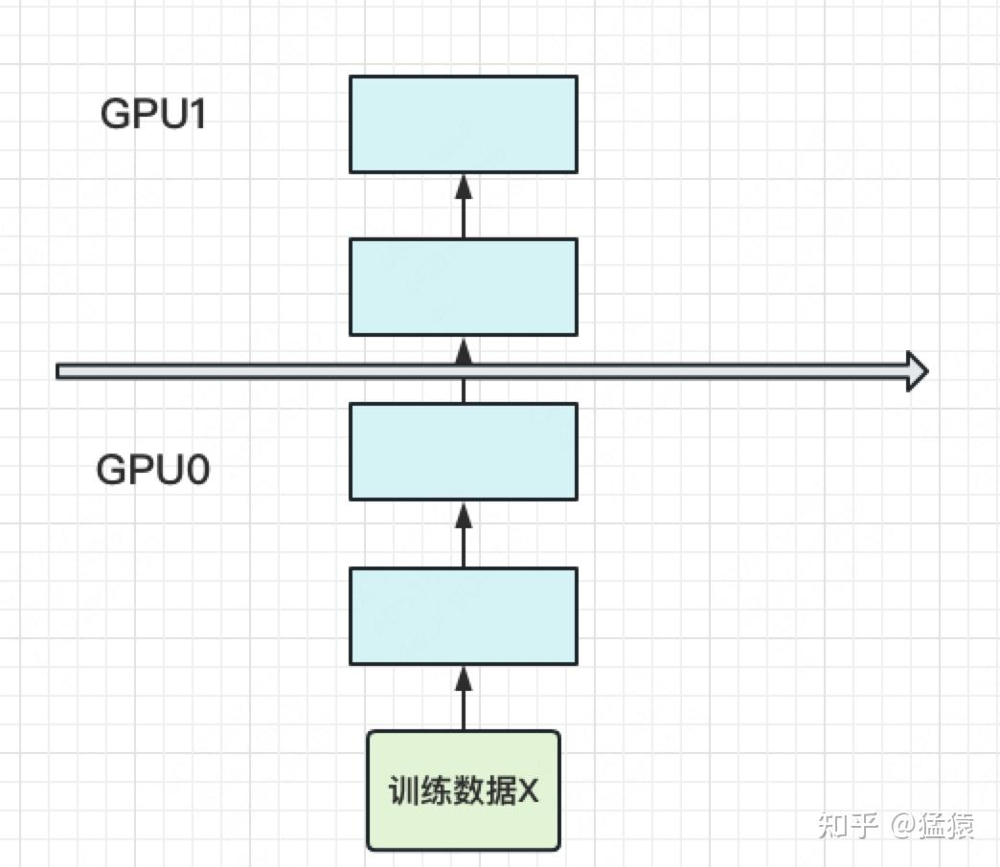

这里真正分配给 GPU 的是模型层，而不是某个固定的 micro-batch。后面引入 micro-batch 后，每个 micro-batch 都会依次经过全部 stage。

### 2.2 朴素调度为什么空转

如果一次只处理一个 batch，那么 GPU0 做完 forward 后，GPU1 才能开始；backward 又从最后一个 stage 依次返回：

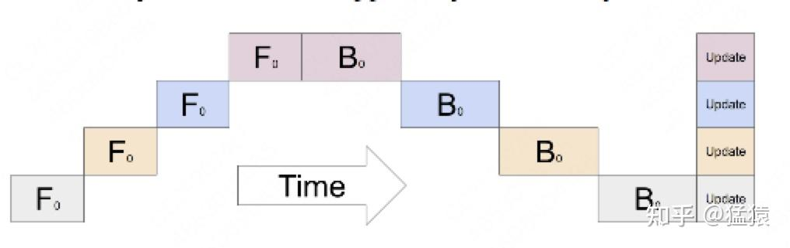

灰色区域表示 GPU 没有执行有效计算的时间，也就是 pipeline bubble：

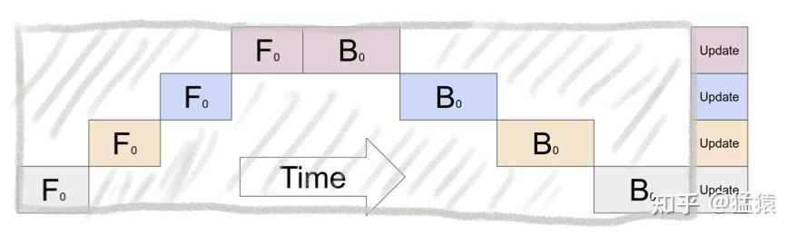

设：

- $K$：流水线 stage 数，简化时也等同于 GPU 数。
- $t_f$：一个 stage 的 forward 时间。
- $t_b$：一个 stage 的 backward 时间。
- $t_{fb}=t_f+t_b$。

朴素调度中， bubble 占比为：

$$
\frac{K-1}{K}
$$

当 $K$ 增大时，这个比例趋近于 1。直观上，stage 越多，单个 batch 串行穿过整条流水线时，等待的设备就越多。

### 2.3 中间激活为什么占显存

forward 可以抽象成：

```text
x → Layer 1 → z₁ → Layer 2 → z₂ → Layer 3 → z₃ → Loss
```

backward 并不是只靠最终的 Loss 就能计算全部梯度。例如线性层：

$$
z=Wx,
\qquad
\frac{\partial \mathcal L}{\partial W}
=
\frac{\partial \mathcal L}{\partial z}x^T
$$

计算 $W$ 的梯度仍然需要 forward 时的输入 $x$。ReLU、Attention、MLP、LayerNorm 等算子的 backward 也需要各自的输入、输出、mask 或统计量。因此 forward 中产生的激活不能立刻全部释放。

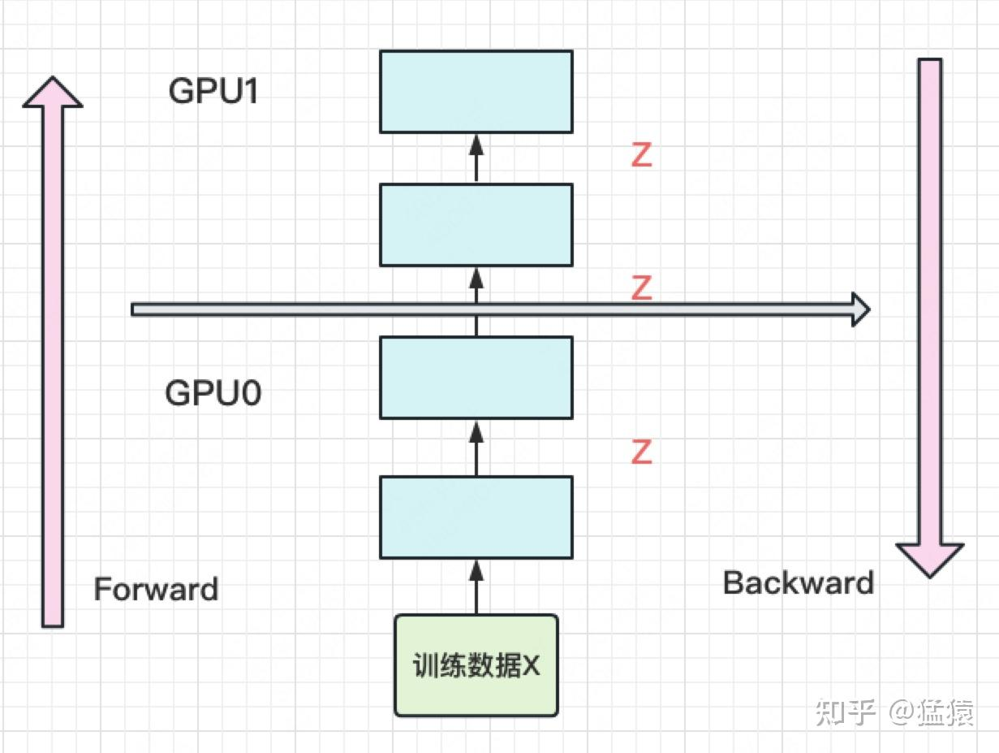

假设：

- mini-batch 大小为 $N$。
- 模型有 $L$ 层。
- 每层激活宽度为 $d$。
- 模型均匀分到 $K$ 张卡，每卡有 $L/K$ 层。

忽略常数和具体算子的额外张量，每张卡的内部激活量可粗略写成：

$$
O\left(N\times\frac{L}{K}\times d\right)
$$

对于 Transformer，如果 $N$ 只是 batch size，还应显式计入序列长度 $S$：

$$
O\left(N S\times\frac{L}{K}\times d\right)
$$

真实 Transformer 还可能保存 Q/K/V、Attention 中间量、MLP 激活、Dropout mask 和 LayerNorm 统计量，所以该公式只是理解量级的简化模型。

---

## 3. GPipe：用 micro-batch 填充流水线

### 3.1 mini-batch 与 micro-batch

设一次参数更新对应的 mini-batch 大小为 $N$，把它切成 $M$ 份，则每个 micro-batch 大小为：

$$
\frac{N}{M}
$$

例如：

```text
mini-batch：64 个样本
micro-batch 数量 M：8
每个 micro-batch：8 个样本
```

每个 micro-batch 都会经过所有 stage：

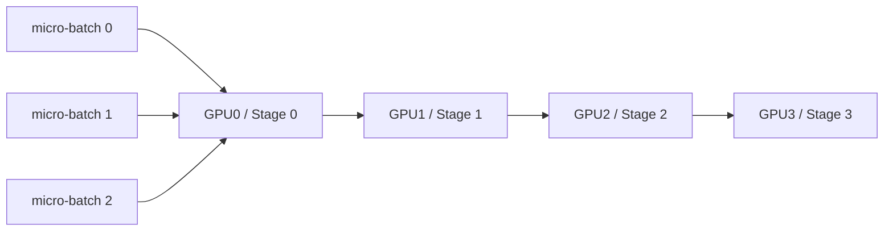

不是“GPU0 专门处理 MB0、GPU1 专门处理 MB1”，而是不同 micro-batch 在不同时间占据不同 stage。

### 3.2 错峰执行

简化的 forward 调度如下：

| 时间 | GPU0 | GPU1 | GPU2 | GPU3 |
| --- | --- | --- | --- | --- |
| $T_1$ | MB0 | 空闲 | 空闲 | 空闲 |
| $T_2$ | MB1 | MB0 | 空闲 | 空闲 |
| $T_3$ | MB2 | MB1 | MB0 | 空闲 |
| $T_4$ | MB3 | MB2 | MB1 | MB0 |

在 $T_4$，四张 GPU 同时工作，但处理的是不同 micro-batch 的不同模型层。

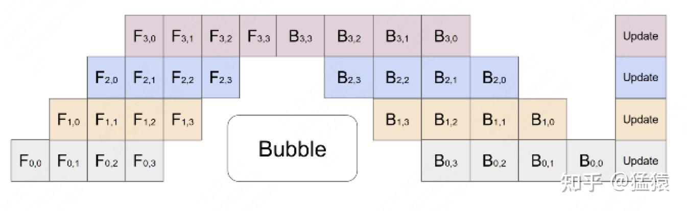

切分成 $M$ 个 micro-batch 后，在各 stage 计算时间相近、暂不考虑通信开销的简化模型中，bubble 占比为：

$$
O\left(\frac{K-1}{K+M-1}\right)
$$

当 $M$ 增大时，启动和排空阶段的 bubble 会被更多有效计算摊薄。GPipe 的实验观察到，当 $M\ge 4K$ 时，bubble 开销已经接近可以忽略；这是特定实验条件下的经验结论，不是对所有模型和硬件都成立的保证，实际配置仍要结合算子效率和通信开销调优。

> [!warning]
> micro-batch 不是越小越好。切得过小可能降低矩阵乘法效率、增加调度和通信开销。工程上需要在 bubble、算子效率、显存和通信之间取平衡。

### 3.3 谁负责分配 micro-batch

使用成熟的 pipeline parallel 框架时，通常由框架完成：

- 切分 mini-batch。
- 按调度策略把 micro-batch 送入各个 stage。
- 在 stage 间发送激活与梯度。
- 累积 micro-batch 梯度。
- 在完成一个全局 batch 后统一更新参数。

用户主要配置 micro-batch size、global batch size、pipeline parallel size，以及模型层如何切成各个 stage。真正困难的“分配”通常是平衡每个 stage 的计算时间，而不是手工指定某个 micro-batch 属于哪张卡。

---

## 4. GPipe：用 activation checkpointing 降低激活显存

### 4.1 术语

这一技术常见的相关术语包括：

- **Activation checkpointing**：激活检查点。
- **Recomputation / re-materialization**：重计算 / 重物化。

核心思想是：forward 不长期保存 checkpoint 之间的全部内部激活，backward 到达该区域时，从 checkpoint 重新执行一次局部 forward。

### 4.2 一个三层 stage 的例子

```text
z₀ → Layer 1 → z₁ → Layer 2 → z₂ → Layer 3 → z₃
```

不使用 checkpoint 时，原始 forward 后需要让 $z_1,z_2$ 一直存活，直到对应 Layer 完成 backward。

使用 checkpoint 时，可以长期保存 stage 入口 $z_0$；轮到这个 micro-batch backward 时：

1. 从 $z_0$ 重新执行 Layer 1～3。
2. 临时重新生成并保存 $z_1,z_2$。
3. 立即执行 Layer 3、2、1 的 backward。
4. 中间激活使用完后释放。

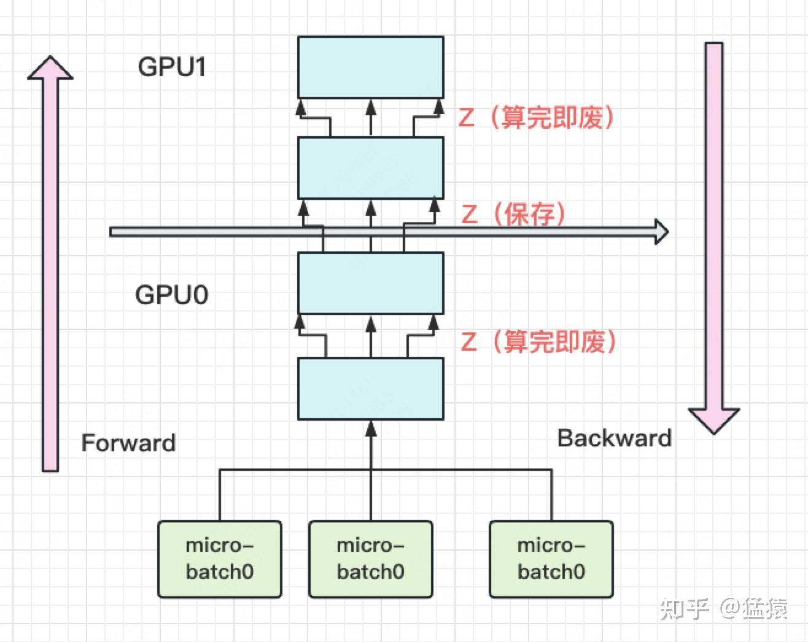

Checkpoint 并不是让内部激活永远不存在，而是缩短它们的生命周期，并减少同时存活的 micro-batch 内部激活套数。

```text
不使用 checkpoint：
  长期保存 MB0～MB(M-1) 的所有内部激活

使用 checkpoint：
  长期保存 MB0～MB(M-1) 的 stage 入口 checkpoint
  + 临时保存当前正在 backward 的一个 micro-batch 的内部激活
```

Pipeline parallelism 与 activation checkpointing 是两个可以组合的维度：前者决定模型如何跨设备执行，后者决定 stage 内部哪些激活长期保留。下面的接口示例展示了 checkpointing 可以作为 pipeline stage 的配置项；具体参数名会随框架版本变化。

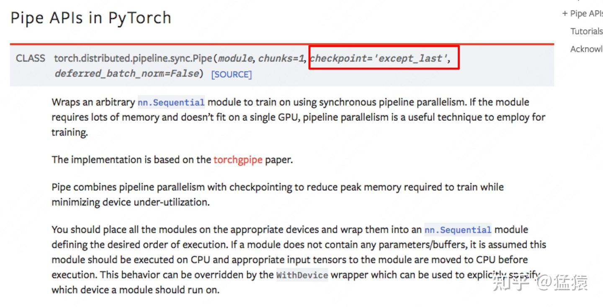

### 4.3 为什么重计算不会指数增长

标准 checkpoint 不会为每一层都从 stage 入口单独重算一次。它会：

```text
从 checkpoint 出发，把当前 segment 完整重算一次
→ 临时保留该 segment 的必要激活
→ 立即完成整个 segment 的 backward
```

因此，一个 checkpointed segment 的 forward 通常只是额外执行一次，计算量仍随层数线性增长。若粗略设 forward 成本为 $F$、backward 成本为 $2F$：

```text
普通训练：      F + 2F = 3F
加入重计算：F + F + 2F = 4F
```

实际开销取决于 checkpoint 粒度、算子和通信，但不存在按 Layer 指数展开的计算树。

### 4.4 峰值激活空间：怎样正确估算

开启 activation checkpointing 后，每张 GPU 的峰值激活主要由两部分组成：

1. 所有 micro-batch 的 stage 入口 checkpoint。
2. 当前一个 micro-batch 在 backward 重计算时产生的 stage 内部激活。

设 mini-batch 包含 $N$ 个样本，被切为 $M$ 个 micro-batch；stage 边界激活宽度为 $d_b$，stage 内部每层激活的简化宽度为 $d$。两部分分别为：

$$
\begin{aligned}
\text{入口 checkpoint}
&=
M\times\frac{N}{M}\times d_b
=Nd_b,\\
\text{当前 micro-batch 内部激活}
&\approx
\frac{N}{M}\times\frac{L}{K}\times d.
\end{aligned}
$$

因此：

$$
O\left(
Nd_b+
\frac{N}{M}\times\frac{L}{K}\times d
\right)
$$

如果近似认为 $d_b=d$，可以写成：

$$
O\left[
Nd\left(1+\frac{L}{MK}\right)
\right]
$$

对于 batch size 为 $N$、序列长度为 $S$ 的 Transformer，更接近：

$$
O\left(
NSd_b+
\frac{NS}{M}\times\frac{L}{K}\times d
\right)
$$

若换算为字节，还要乘以每个元素的字节数，并考虑 Attention、MLP、LayerNorm 等算子的额外保存量。

> [!warning]
> 如果 $N$ 表示样本数量，入口 checkpoint 不能只写成 $N$，因为它还包含特征维度；应写成 $Nd_b$。只有把 $N$ 直接定义为“整个 mini-batch 的入口激活元素总数”时，才可以省略 $d_b$。

---

## 5. micro-batch 对 Batch Normalization 的影响

Batch Normalization 依赖 batch 统计量。把 mini-batch 切成较小的 micro-batch 后，每次 forward 使用的是 micro-batch 内部的均值和方差，可能改变统计行为。

GPipe 的处理方式是：训练时使用各 micro-batch 的充分统计量完成归一化，同时把所有 micro-batch 的充分统计量累积为整个 mini-batch 的移动统计量，供推理阶段使用。Layer Normalization 不依赖 batch 维度的总体统计，因此不受同类问题影响。

## 6. 实验结论

### 6.1 GPU 数量与可训练模型大小

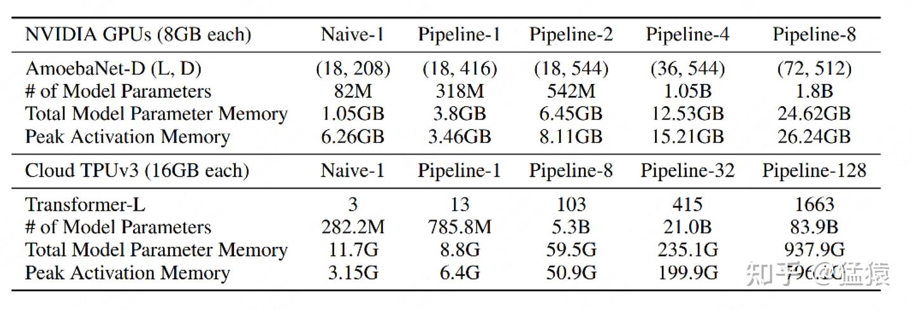

实验结果可以归纳为三点：

- 激活显存是不可忽略的大项，不能只计算模型参数显存。
- Transformer 的层结构更规则，比较容易均匀切成多个 stage，因此扩展效果更接近线性。
- AmoebaNet 的 stage 不容易均衡，某个 GPU 可能成为“木桶短板”，限制整体扩展。

### 6.2 GPU 数量与训练速度

关闭高速互联、固定 $M=32$ 时，增加 GPU 仍能获得加速，但通常达不到严格线性：

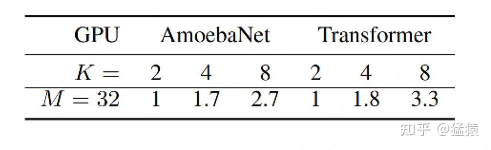

打开高速互联并比较不同 $M$ 时：

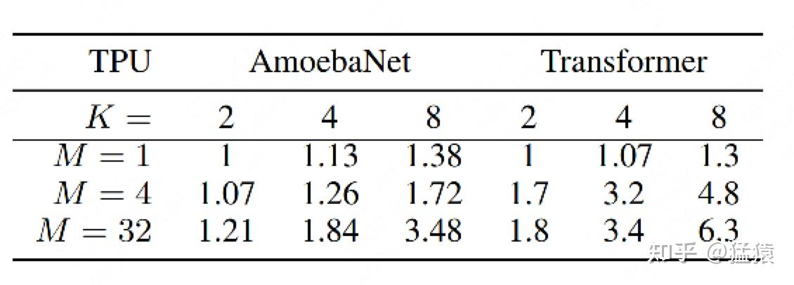

- $M=1$ 时，流水线接近朴素模型并行，bubble 很大。
- 增加 $M$ 后，GPU 利用率明显改善。
- 结构更均匀的 Transformer 比 AmoebaNet 获得了更好的扩展效率。

### 6.3 单 GPU 时间分布

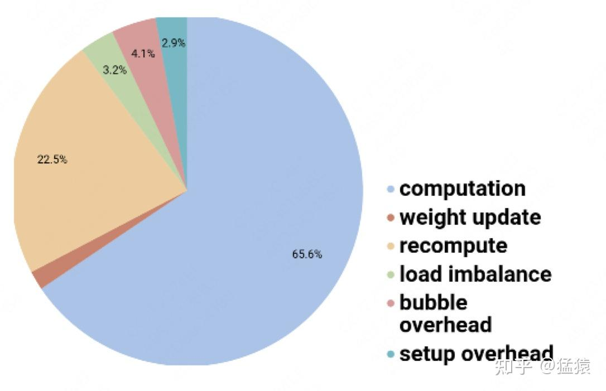

图中约 65.6% 时间用于主要计算，约 22.5% 用于重计算；其余开销来自权重更新、负载不均、bubble 和 setup。这个结果直观展示了 activation checkpointing 的代价：显存下降，但需要额外计算。

---

## 7. 机制总表

| 机制 | 作用对象 | 解决什么问题 | 主要代价 |
| --- | --- | --- | --- |
| 按层切分 | 模型 Layer | 单卡装不下模型 | stage 间通信、负载不均 |
| Micro-batch | 一次参数更新的数据 | 减少 pipeline bubble | 调度复杂度、过小时算子效率下降 |
| Activation checkpointing | forward 激活 | 降低长期驻留的激活显存 | backward 前需要重算 forward |
| Stage balancing | 每张卡的 Layer 组合 | 避免最慢 stage 限制吞吐 | 需要估算每层计算量和显存 |

## 8. 相关概念

- 数据并行（DP / DDP）
- 张量并行（Tensor Parallelism）
- 梯度累积（Gradient Accumulation）
- Activation Checkpointing
- Pipeline bubble
- GPipe 与 PipeDream
- 1F1B 等其他流水线调度
- 3D Parallelism（DP + TP + PP）

---

## 9. 常见问题与易错点

### Q1：“中间结果”到底是什么？

中间结果主要指 forward 产生、backward 还要使用的激活值。例如：

```text
x → Layer 1 → z₁ → Layer 2 → z₂ → Layer 3 → z₃
```

计算 Layer 2 的参数梯度时，通常还需要 Layer 2 forward 时的输入 $z_1$。所以 $z_1,z_2$ 不能在原始 forward 后立即全部释放。Transformer 中实际需要保存的不只一个 $z$，还可能包括 Q/K/V、Attention 相关中间量、MLP 激活、mask 和归一化统计量。

### Q2：micro-batch 和 activation checkpointing 是一回事吗？

不是。它们可以组合使用，但解决的问题不同：

- micro-batch 主要用于填充流水线、降低 bubble。
- activation checkpointing 主要用于减少激活显存。

普通单卡训练里的 micro-batch 常和梯度累积一起使用，主要目的可能是降低单次计算的峰值显存；GPipe 则更强调多个 stage 的并发调度。

### Q3：不开 checkpoint 时，每张卡保存哪些激活？开启后是否只保存一层？

不开 checkpoint 时，每张卡保存自己负责的 Layer 所需的 forward 激活，而不是整个模型前面所有 Layer 的激活。

开启 checkpoint 后也不一定只保存“一层”。一般是保存选定的 checkpoint 或 segment 边界，backward 时重新计算边界之间的 Layer。Checkpoint 粒度越粗，省显存越多、重计算越多；粒度越细则相反。

### Q4：micro-batch 需要自己手工分到每张卡吗？

通常不需要。分配给 GPU 的是模型 stage；每个 micro-batch 会依次流过所有 stage。框架负责 micro-batch 的切分、发送、接收、梯度累积和调度。用户主要决定 micro-batch size、pipeline size 和 Layer 如何切分。

### Q5：backward 重计算时，不还是要存 $z_1,z_2$ 吗？会不会指数增长？

会临时保存，但只为当前正在 backward 的 micro-batch 和当前 checkpoint segment 保存。它们生成后立即用于 backward，随后释放，不再从最早的 forward 一直跨越多个 micro-batch 长期驻留。

标准 checkpoint 会把一个 segment 完整重算一次，再对该 segment backward，不会为每一层反复递归展开，所以通常是增加一次局部 forward，时间复杂度仍是线性量级，不会指数增长。

### Q6：峰值激活公式中的第一项为什么来自全部 micro-batch？

第一项统计所有 micro-batch 的 stage 入口 checkpoint 总量。每个入口对应 $N/M$ 个样本，共有 $M$ 个：

$$
M\times\frac{N}{M}=N
$$

但这只统计了样本数，没有统计每个样本的激活宽度，所以还不能直接作为激活元素数量或显存大小。

### Q7：除了入口激活，还要保存另外一个中间激活吗？

更准确地说，不是只多保存“一个”中间激活，而是在 backward 重计算时临时保存当前 segment 所需的所有内部激活。公式第二项：

$$
\frac{N}{M}\times\frac{L}{K}\times d
$$

就是对“当前一个 micro-batch 的当前 stage 内部激活”的简化估计。

### Q8：入口激活项是否应该写成 $N\times d$？

对。如果 $N$ 是 mini-batch 的样本数量，且 stage 入口激活宽度也是 $d$，量纲一致的写法至少应为：

$$
O\left(
Nd+
\frac{N}{M}\times\frac{L}{K}\times d
\right)
$$

更一般地，如果边界宽度是 $d_b$，则应写成：

$$
O\left(
Nd_b+
\frac{N}{M}\times\frac{L}{K}\times d
\right)
$$

Transformer 还应把序列长度 $S$ 计入激活形状。

## 参考资料

1. [猛猿：图解大模型训练之：流水线并行（Pipeline Parallelism），以 GPipe 为例](https://zhuanlan.zhihu.com/p/613196255)
2. [GPipe: Efficient Training of Giant Neural Networks using Pipeline Parallelism](https://arxiv.org/abs/1811.06965)
