# 02-数据并行技术--DP与DDP

> [!note]
> 数据并行在每个设备上保留一份完整模型，把训练数据切成不同分片并行计算局部梯度，再同步梯度，使所有模型副本完成相同的参数更新。集中式参数服务器和去中心化 AllReduce 的核心区别，不是总共要搬多少梯度，而是通信压力落在谁身上、能否均匀利用网络。

## 阅读说明

- 本文从数据并行的数学含义出发，依次解释集中式同步、参数服务器、异步更新、DDP、Ring-AllReduce 及其通信量，可以独立阅读。
- 全文沿着 DP → DDP → Ring-AllReduce 的主线展开，从训练语义、执行流程和通信代价三个层面建立完整认识。

## 一句话主线

假设有 $N$ 张 GPU，数据并行的一次同步训练可以概括为：

```text
复制完整模型
→ 切分 global batch
→ 各 GPU 独立 forward / backward
→ 同步局部梯度
→ 各 GPU 执行相同的 optimizer.step()
→ 所有模型副本继续保持一致
```

集中式 DP 把梯度交给中心节点聚合，容易形成热点；DDP 通常通过集合通信让各 rank 共同完成梯度同步，其中 Ring-AllReduce 是最经典的带宽均衡算法之一。

---

## 1. 数据并行到底并行了什么

### 1.1 模型复制，数据切分

设模型参数为 $W$，global batch 为 $X$。在 $N$ 张 GPU 上训练时：

- 每张 GPU 都保存完整的 $W$。
- $X$ 沿 batch 维切成 $X_0,X_1,\ldots,X_{N-1}$。
- 第 $i$ 张 GPU 使用 $X_i$ 独立完成 forward 和 backward，得到局部梯度 $g_i$。

当各数据分片大小相等，且每个局部 loss 都按样本取平均时，全局平均梯度为：

```math
g=\frac{1}{N}\sum_{i=0}^{N-1}g_i
```

每张 GPU 随后都执行相同的更新：

```math
W\leftarrow W-\eta g
```

只要初始参数、聚合梯度和优化器状态一致，更新后的模型副本就仍然一致。

> [!warning]
> 如果各 rank 的样本数不同，不能直接对局部平均梯度做等权平均，而应按各分片样本数加权。数据并行是否与单卡大 batch 数学等价，取决于 loss 的 reduction、梯度缩放和有效 global batch 是否一致。

### 1.2 数据并行与模型并行的区别

| 对比项 | 数据并行 | 模型并行 |
| --- | --- | --- |
| 模型 | 每张卡一份完整副本 | 模型本身被切到多张卡 |
| 数据 | 不同卡处理不同分片 | 同一数据依次或协同经过模型分片 |
| 主要通信 | 梯度、参数或优化器状态 | 激活、梯度及模型分片相关张量 |
| 主要限制 | 模型必须能放进单卡，通信量随模型增大 | 模型切分、负载均衡和跨卡依赖复杂 |

---

## 2. 集中式同步数据并行

### 2.1 完整执行链路

一种直观实现是设置中心聚合节点：

1. 把 global batch 切给不同 Worker。
2. 每个 Worker 使用完整模型计算局部梯度。
3. Worker 把局部梯度 push 给中心节点。
4. 中心节点求和或求平均。
5. 聚合结果被 pull 回所有 Worker。
6. 各 Worker 更新出相同的参数。

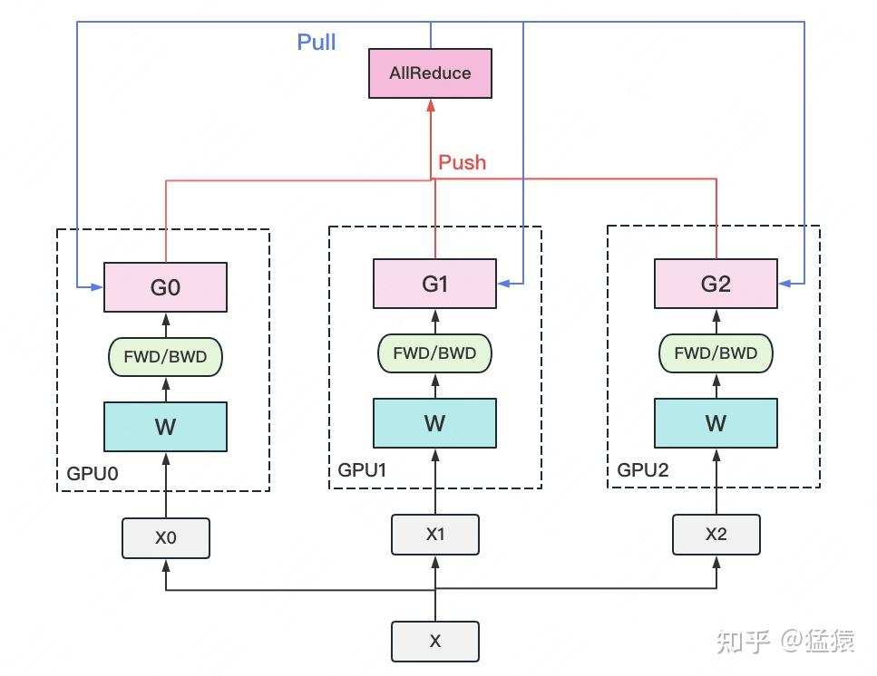

图中的 `AllReduce` 方框实际表示一个中心化聚合位置。严格来说，AllReduce 是一种集合通信语义，不必存在中心节点；为了避免混淆，本文把这种结构称为“集中式梯度聚合”。

### 2.2 参数服务器

参数服务器（Parameter Server）是实现集中式或分片式数据并行的一类系统架构：

- **Worker**：读取数据、执行 forward/backward、产生梯度。
- **Server**：维护参数、聚合梯度或执行优化器更新。

一个 Worker 或 Server 进程可以管理一张或多张 GPU；Server 也可以被切成多个 shard，并不天然等于“只有一张 GPU 的单点服务器”。

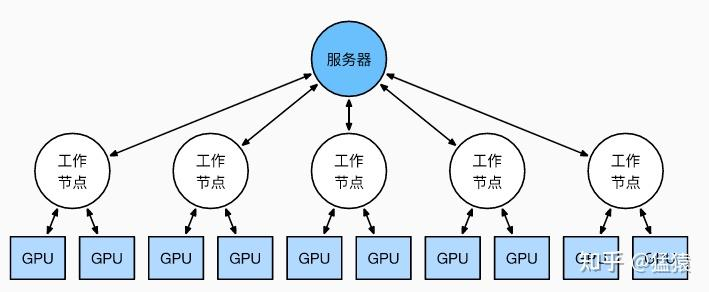

### 2.3 真正的瓶颈在哪里

中心节点的梯度加法通常不是主要矛盾，更常见的瓶颈是：

- **中心通信带宽**：所有 Worker 都向同一位置发送和接收大小约为模型梯度规模的张量。
- **同步屏障**：同步训练必须等待最慢的 Worker，较快 Worker 会空闲。
- **尾部延迟**：某个 Worker 的计算、网络或数据读取变慢，会拖慢整次迭代。
- **单点压力**：中心节点的网卡、显存和内存带宽更容易成为热点。

因此，“Server 算力不足”不是最准确的表述；更准确的是“Server 承担了不均衡的集中式通信和状态维护压力”。

---

## 3. 异步梯度更新

### 3.1 为什么引入异步

同步参数服务器要求 Worker 等待本轮聚合完成。异步方式允许 Worker 提交梯度后继续处理新数据，从而把通信等待时间转化为额外计算。

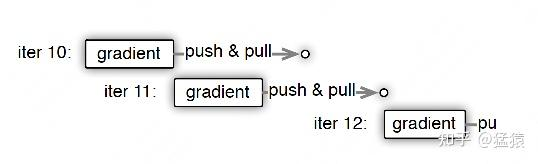

### 3.2 梯度陈旧性

异步 Worker 计算梯度时使用的可能不是 Server 当前参数。设 Server 已更新到 $W_t$，某个 Worker 提交的梯度却是在旧参数 $W_{t-\tau}$ 上计算的：

```math
g\left(W_{t-\tau}\right)
```

$\tau$ 称为 staleness（陈旧度或延迟步数）。常见策略包括：

- **同步**：$\tau=0$，每轮都等待。
- **完全异步**：不限制 $\tau$，吞吐高但梯度可能非常陈旧。
- **有界异步**：规定最大陈旧度，兼顾吞吐和优化稳定性。

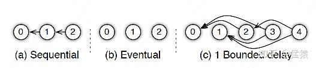

### 3.3 异步不等于扩大 batch

扩大同步 batch 是在同一个参数点 $W_t$ 上计算更多样本的梯度，再统一更新；异步训练则可能把在不同历史参数点上计算的梯度陆续应用到当前参数。两者的优化过程不同。

需要区分两种速度：

| 指标 | 异步更新的可能影响 |
| --- | --- |
| 系统吞吐量 | Worker 少等待，通常提高 |
| 单步优化质量 | 陈旧梯度可能使下降方向变差 |
| 达到目标精度所需 step | 可能增加，严重时可能不稳定 |
| 最终 wall-clock 收敛时间 | 取决于吞吐收益能否抵消统计效率下降 |

因此，异步训练优化的是硬件利用率和系统吞吐，但不保证更快达到相同精度。

---

## 4. DDP：去中心化的同步梯度聚合

### 4.1 DDP 的主数据流

分布式数据并行通常采用一张 GPU 对应一个进程（rank）：

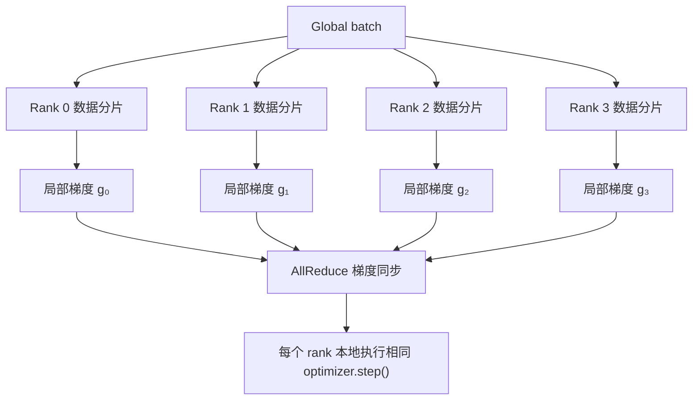

DDP 的关键不是“多机”三个字，而是多个独立进程维护模型副本，并通过进程组同步梯度。它既能用于单机多卡，也能用于多机多卡。

### 4.2 PyTorch DDP 的几个边界

- DDP 同步的是模型副本之间的梯度，不会自动替用户切分输入数据；通常使用 `DistributedSampler` 保证不同 rank 读取不同样本。
- 参数不会在每一步更新后重新广播。每个 rank 拿到相同梯度后，本地执行相同优化器更新。
- 实现上通常把多个参数梯度拼成 gradient bucket；bucket 准备好后立即发起 AllReduce，从而让通信与剩余 backward 计算重叠。
- Ring-AllReduce 是 AllReduce 的一种实现方式。具体运行时也可能根据消息大小、拓扑和通信库选择 tree 等其他算法。

---

## 5. Ring-AllReduce

### 5.1 目标：每个 rank 都得到完整聚合梯度

设有 $N=4$ 个 rank，每个 rank 的局部梯度张量被逻辑切成四块：

```text
Rank 0：a₀ b₀ c₀ d₀
Rank 1：a₁ b₁ c₁ d₁
Rank 2：a₂ b₂ c₂ d₂
Rank 3：a₃ b₃ c₃ d₃
```

AllReduce 完成后，每个 rank 都应拥有：

```text
a₀+a₁+a₂+a₃
b₀+b₁+b₂+b₃
c₀+c₁+c₂+c₃
d₀+d₁+d₂+d₃
```

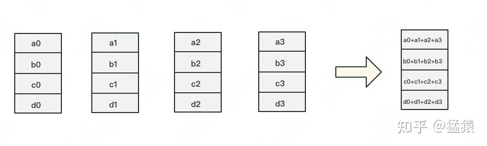

> [!warning]
> 这里切分的是待聚合的梯度张量或 gradient bucket，不是训练数据。训练数据早在各 rank 计算局部梯度之前就已经完成分片。

### 5.2 环形拓扑

把 $N$ 个 rank 排成逻辑环，每个 rank 只向下一个邻居发送，并从上一个邻居接收：

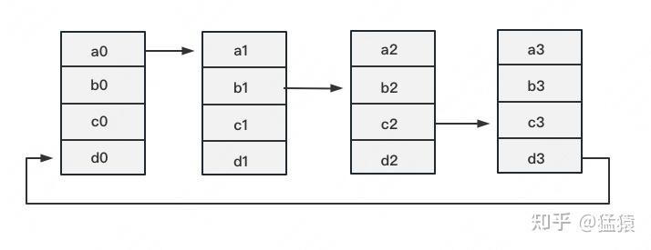

一次 Ring-AllReduce 分为两个阶段：

1. **Reduce-Scatter**：一边传递一边累加，最终每个 rank 持有一个完整归约后的 chunk。
2. **All-Gather**：传播这些完成归约的 chunk，最终每个 rank 拥有完整结果。

### 5.3 Reduce-Scatter

每个通信 round 中，每个 rank 发送一个 chunk，同时接收并累加另一个 chunk。经过 $N-1$ 个 round，每个 chunk 都正好遍历需要参与求和的 rank。

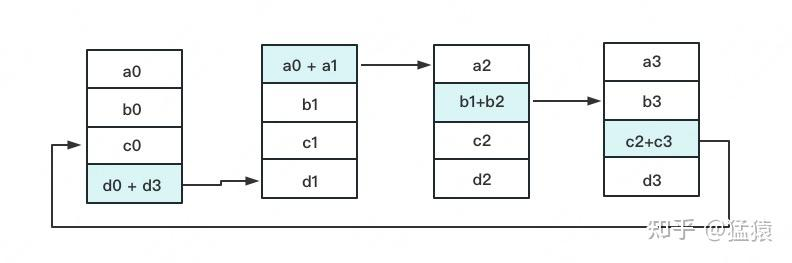

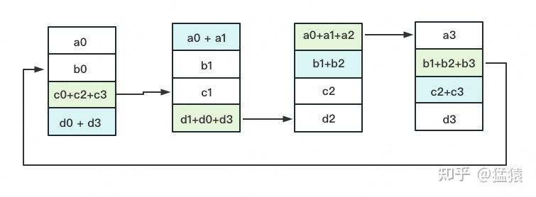

四个 rank 经过三轮后，每个 rank 各自持有一个已经完整求和的 chunk：

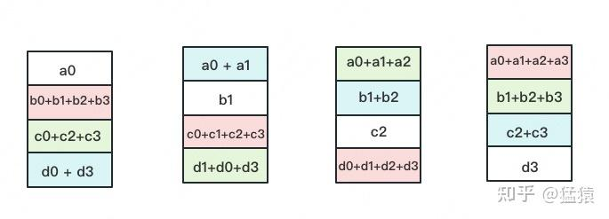

Reduce-Scatter 结束时，全局归约已经完成，但结果仍然分散在不同 rank 上。

### 5.4 All-Gather

All-Gather 继续沿环传递已经完成求和的 chunk，此阶段只复制，不再做加法。

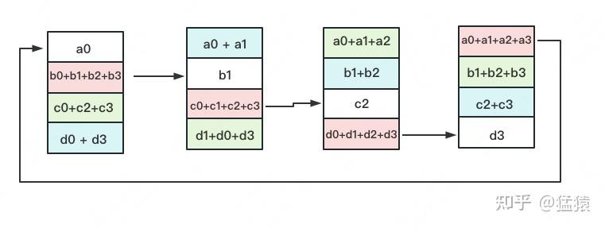

同样经过 $N-1$ 个 round 后，每个 rank 都收集到所有已归约 chunk：

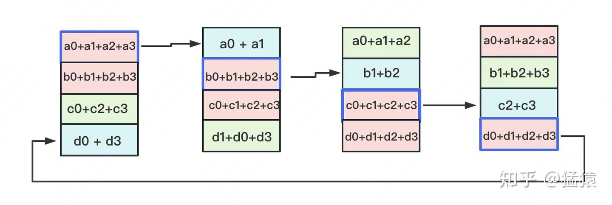

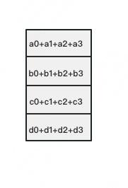

---

## 6. Ring-AllReduce 通信量

### 6.1 单卡完整 AllReduce 的发送量

设：

- $\Phi$：完整梯度张量或所有 gradient bucket 的总字节数。
- $N$：参与 AllReduce 的 rank 数。
- 每个 chunk 的大小为 $\Phi/N$。

Reduce-Scatter 有 $N-1$ 个 round，每个 round 每张卡发送一个 chunk：

```math
V_{\mathrm{RS,send}}
=(N-1)\frac{\Phi}{N}
```

All-Gather 同样有 $N-1$ 个 round：

```math
V_{\mathrm{AG,send}}
=(N-1)\frac{\Phi}{N}
```

因此，一张 GPU 完整执行一次 Ring-AllReduce 的总发送量为：

```math
V_{\mathrm{send}}
=2(N-1)\frac{\Phi}{N}
```

当 $N$ 很大时，它趋近于 $2\Phi$。

### 6.2 发送量、接收量和全局流量

Ring 是对称的，单卡接收量与发送量相同：

```math
V_{\mathrm{recv}}
=2(N-1)\frac{\Phi}{N}
```

如果把同一张卡的发送与接收相加，则网卡处理的双向数据量为：

```math
V_{\mathrm{send+recv}}
=4(N-1)\frac{\Phi}{N}
```

如果只统计所有 GPU 的发送量，全系统精确值为：

```math
V_{\mathrm{global,send}}
=N\times 2(N-1)\frac{\Phi}{N}
=2(N-1)\Phi
```

它在大 $N$ 下才可以近似写成 $2N\Phi$。讨论“通信量”时必须先声明口径，否则同一过程可能相差一倍甚至更多。

### 6.3 四卡数值例子

设 $N=4$，完整梯度大小为 $\Phi=400\ \mathrm{MB}$，则每个 chunk 为 $100\ \mathrm{MB}$。

```text
Reduce-Scatter：3 轮 × 100 MB = 300 MB
All-Gather：    3 轮 × 100 MB = 300 MB
```

单卡完整 AllReduce 的发送量为：

```math
2\times\frac{3}{4}\times400
=600\ \mathrm{MB}
```

同一张卡还会接收 $600\ \mathrm{MB}$；若统计收发总量，则为 $1200\ \mathrm{MB}$。

---

## 7. 集中式通信与 Ring-AllReduce 的比较

假设 Worker 数为 $N$，梯度大小为 $\Phi$。在最简单的单 Server 模型中，每个 Worker 向 Server 发送一份梯度，再接收一份聚合结果：

| 架构 | 全局发送量 | 压力分布 |
| --- | ---: | --- |
| 单 Server | 约 $2N\Phi$ | Server 集中接收 $N\Phi$、发送 $N\Phi$ |
| Ring-AllReduce | 精确为 $2(N-1)\Phi$ | 均匀分散到所有 rank |

两者的数据量是同一数量级，Ring-AllReduce 的关键优势是没有中心通信热点，所有 rank 可以同时利用链路。

参数服务器也可以通过多 Server 和参数分片降低热点：

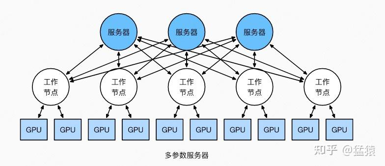

所以不能简单得出“参数服务器一定落后”的结论。系统选择还取决于同步语义、参数稀疏性、容错需求、网络拓扑和训练框架。

---

## 8. DP、DDP 与 ZeRO 的关系

| 名称 | 更准确的定位 |
| --- | --- |
| 数据并行 | 模型复制、数据分片、梯度同步的一类并行范式 |
| 参数服务器 | 参数和梯度如何放置、聚合与更新的一类系统架构 |
| PyTorch `DataParallel` | 单进程多 GPU 的具体 API，梯度归集到主设备 |
| PyTorch DDP | 多进程同步数据并行实现，可用于单机或多机 |
| Ring-AllReduce | 实现 AllReduce 集合通信的一种算法 |
| ZeRO | 在数据并行语义下对优化器状态、梯度和参数去冗余分片的内存优化体系 |

ZeRO 不是简单把模型按算子切开的张量并行。它仍然保持数据并行的训练语义，但让不同 rank 不再长期保存全部模型状态；具体分片阶段将在下一篇单独展开。

---

## 9. 机制总表

| 机制 | 解决的问题 | 主要代价或风险 |
| --- | --- | --- |
| 集中式同步 | 实现简单、更新语义清晰 | 中心带宽热点、同步等待 |
| 异步参数服务器 | Worker 不必等待聚合完成 | 梯度陈旧、收敛行为改变 |
| 有界异步 | 控制最大陈旧度 | 仍需管理延迟和调度 |
| DDP | 多进程同步数据并行 | 每张卡仍保存完整模型状态 |
| Ring-AllReduce | 均衡大张量 AllReduce 的带宽压力 | 需要 $2(N-1)$ 个通信 round，延迟敏感 |
| Gradient bucket | 合并小梯度并重叠通信与 backward | bucket 划分影响峰值显存与 overlap |

---

## 10. QA

### Q1：DP 是否就是每张 GPU 保存完整模型，再把梯度交给 Server 聚合？

这是集中式同步数据并行的一种典型实现，但不是数据并行的唯一形式。数据并行的稳定定义是“模型复制、数据分片、梯度同步”；梯度既可以由 Server 聚合，也可以通过 AllReduce 去中心化聚合。

### Q2：集中式 DP 的瓶颈是 Server 算力不足吗？

更准确地说，是 Server 的通信带宽、内存带宽和集中状态维护形成热点。梯度求和本身通常不复杂，但 Server 必须接收所有 Worker 的梯度并下发结果，而且同步训练还要等待最慢 Worker。

### Q3：异步更新本质上是不是增大了 batch？

不是。扩大同步 batch 时，所有梯度都在同一个参数点上计算；异步更新会把基于旧参数计算的陈旧梯度应用到当前参数。异步可以提高吞吐，但可能需要更多 step 才达到相同精度，不能保证 wall-clock 收敛一定更快。

### Q4：Ring-AllReduce 中被切分的“数据”是什么？

在 DDP 语境下，被切分的是待同步的梯度张量或 gradient bucket，不是训练样本。训练样本在 forward 之前已经按 rank 分片。

### Q5：$2(N-1)\Phi/N$ 只是一个通信 round 吗？

不是。它已经累加了 Reduce-Scatter 的 $N-1$ 轮和 All-Gather 的 $N-1$ 轮，是单卡完成一次完整 Ring-AllReduce 的总发送量。

在标准同步 DDP 中，如果每次 `optimizer.step()` 前同步一次全部梯度，它通常也就是一次参数更新对应的单卡梯度发送量。工程实现虽然会把梯度拆成多个 bucket 分别执行 AllReduce，但所有 bucket 的大小之和仍约为 $\Phi$。

如果使用梯度累积，并在前几个 micro-batch 上关闭同步、只在最后一次 backward 时同步，那么每次参数更新的通信量基本不变，但摊到每个 micro-batch 的通信量会下降。

### Q6：为什么有时看到的 Ring-AllReduce 通信量会再乘 2？

因为统计口径不同。$2(N-1)\Phi/N$ 只统计单卡发送量；单卡接收量与它相同。如果把发送和接收都算作网卡处理流量，就会得到 $4(N-1)\Phi/N$。

### Q7：DDP 每一步都要广播新参数吗？

通常不需要。各 rank 从相同参数开始，AllReduce 后获得相同梯度，再用相同优化器状态独立更新，因此参数自然保持一致。初始化参数和部分 buffer 可能需要广播，但这与每一步重新广播全部参数不是一回事。

### Q8：DP 和 DDP 的总通信量相近，为什么 DDP 通常更快？

这里的“DP”特指梯度集中到主卡或 Parameter Server、再把聚合结果发回各 Worker 的集中式实现；严格来说，DDP 本身也是数据并行的一种实现。

设有 $N$ 张 GPU，完整梯度大小为 $\Phi$，暂时只统计梯度聚合及结果分发：

| 实现 | 全局总发送量 | 单节点最大收发总量 |
| --- | ---: | ---: |
| 集中式 DP | 约 $2(N-1)\Phi$ | 中心节点约 $2(N-1)\Phi$ |
| Ring-AllReduce DDP | $2(N-1)\Phi$ | 每个 rank 为 $4(N-1)\Phi/N$ |

两者在全系统中传输的总字节数几乎相同。区别在于，集中式 DP 的流量都要经过中心节点；DDP 则把流量均匀分散到所有 rank，使多条链路可以同时工作。因此，**总通信量相近，不代表通信时间相近**。

若每条有效链路带宽为 $B$，忽略计算、协议开销和拓扑差异，在带宽占主导的理想情况下：

```math
T_{\mathrm{central}}
\gtrsim
\frac{2(N-1)\Phi}{B}
```

而 Ring-AllReduce 的带宽项约为：

```math
T_{\mathrm{ring}}
\approx
\frac{2(N-1)\Phi}{NB}
```

Ring 还需要经历 $2(N-1)$ 个通信 round，所以更完整的性能模型还要加入每轮启动延迟 $\alpha$：

```math
T_{\mathrm{ring}}
\approx
2(N-1)\alpha
+
\frac{2(N-1)\Phi}{NB}
```

因此，Ring-AllReduce 更适合梯度这类大张量：此时带宽项占主导，分散通信热点的收益明显；对于很小的张量，通信轮数带来的延迟可能反而更重要。

DDP 相比集中式 DP 的主要优势可以归纳为：

1. **消除中心热点**：每个 rank 承担近似相同的通信量，扩卡时不会把全部压力堆到主卡或 Server。
2. **并行利用链路**：多个 rank 可以同时收发，更容易利用 PCIe、NVLink、InfiniBand 等互联带宽。
3. **通信与计算重叠**：gradient bucket 一旦就绪即可开始 AllReduce，同时继续计算更前面层的梯度。
4. **多进程隔离更好**：PyTorch DDP 通常一张 GPU 对应一个进程，减少单进程调度和 Python GIL 带来的限制。
5. **扩展到多机更自然**：同一套 rank/process group 模型可以从单机多卡延伸到多机多卡。

需要注意：上述公式是用于理解瓶颈位置的简化模型。真实通信时间还取决于通信库选择的算法、网络拓扑、链路是否全双工、bucket 大小、计算通信 overlap，以及是否跨节点。

## 参考资料

1. [猛猿：图解大模型训练之：数据并行上篇（DP、DDP 与 ZeRO）](https://zhuanlan.zhihu.com/p/617133971)
2. [PyTorch DistributedDataParallel](https://docs.pytorch.org/docs/stable/generated/torch.nn.parallel.DistributedDataParallel.html)
3. [PyTorch DDP Communication Hooks](https://docs.pytorch.org/docs/stable/ddp_comm_hooks.html)
4. [Scaling Distributed Machine Learning with the Parameter Server](https://web.eecs.umich.edu/~mosharaf/Readings/Parameter-Server.pdf)
