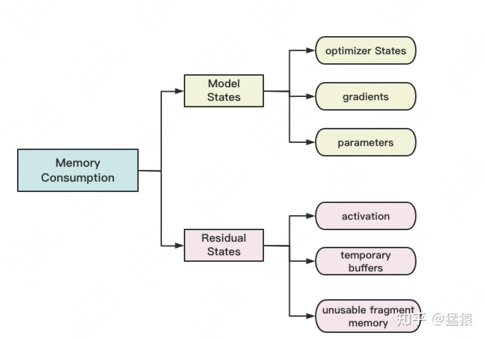
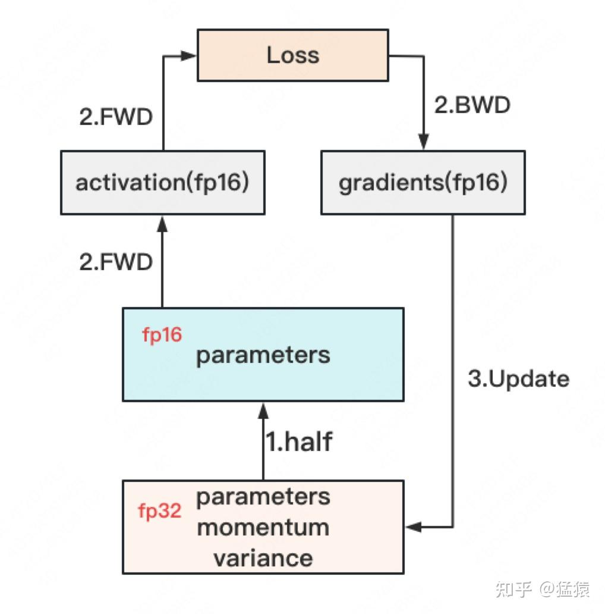
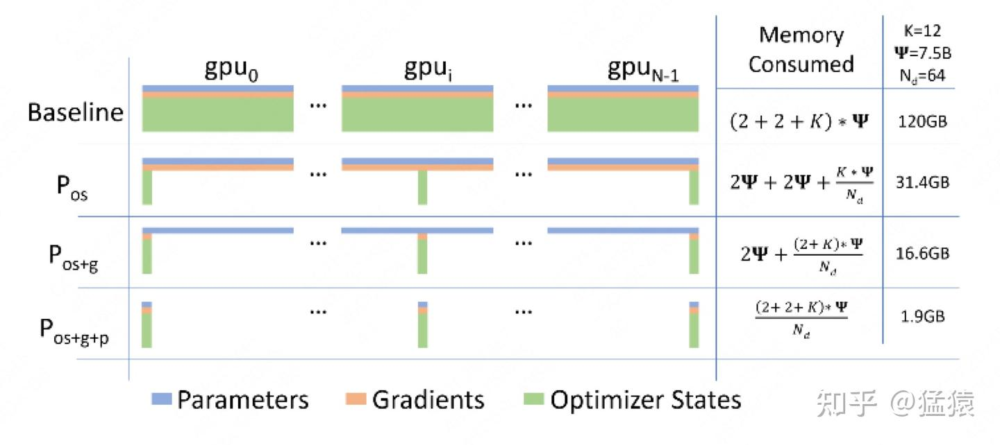
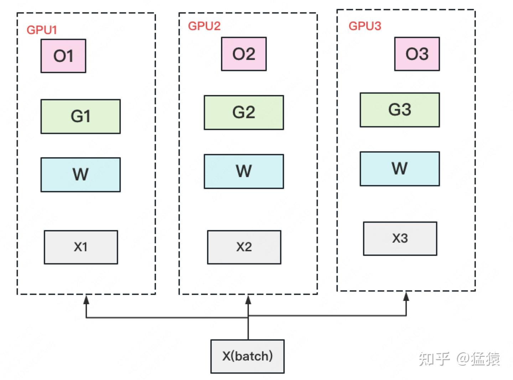
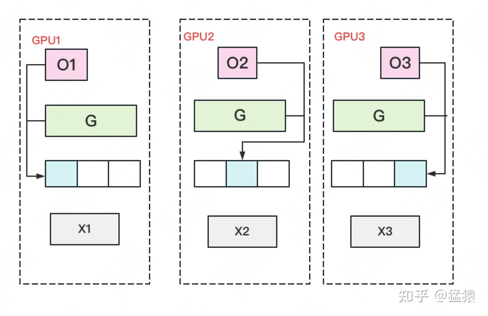
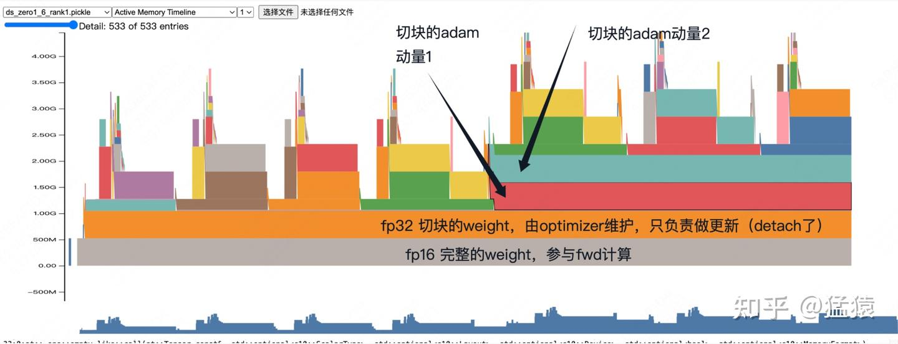
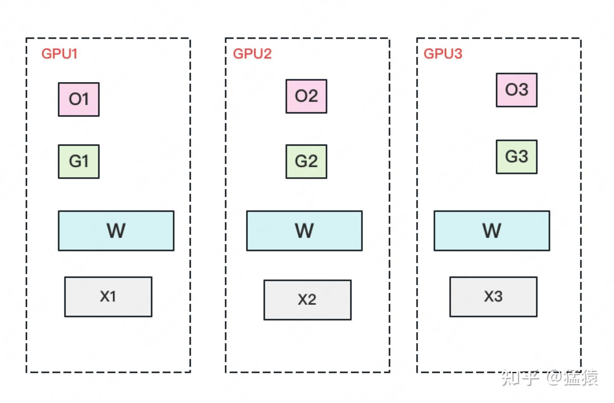
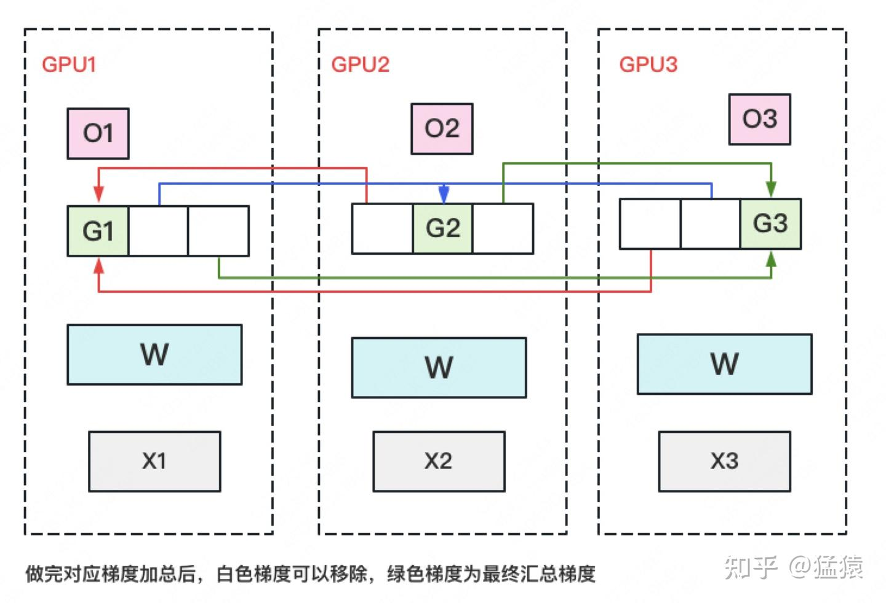
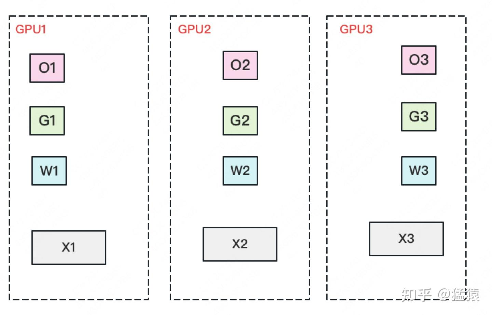
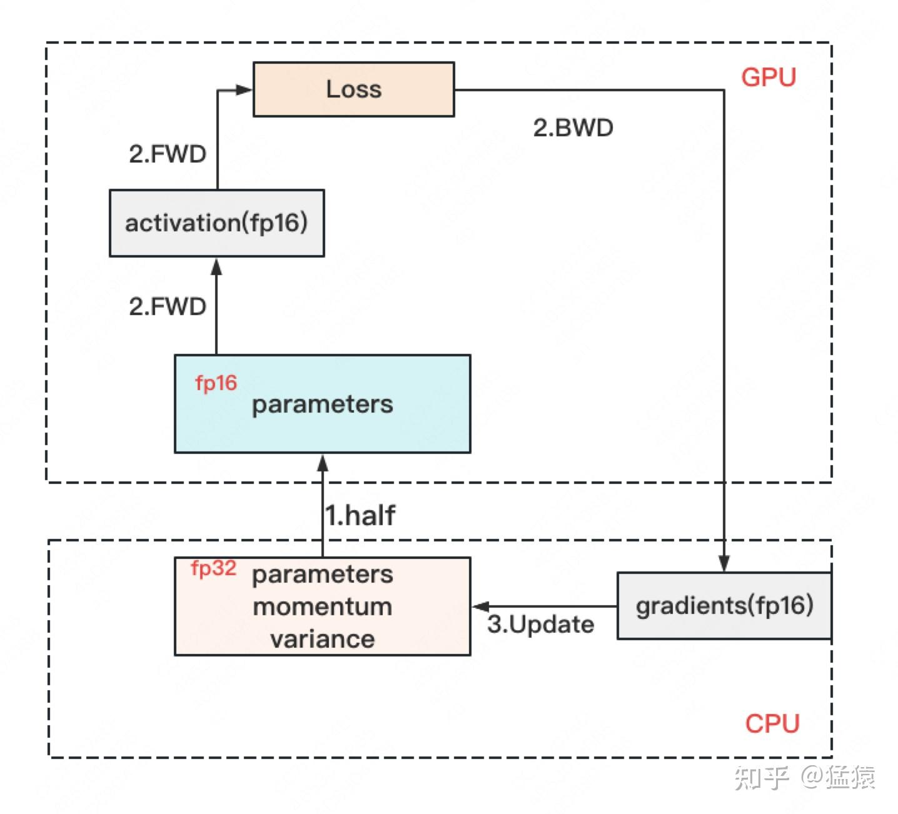

# 03-ZeRO零冗余优化技术：从状态分片到残余显存管理

> [!note]
> 普通数据并行在每张 GPU 上复制完整模型状态，ZeRO 则按“优化器状态 → 梯度 → 参数”的顺序逐级消除冗余。它仍然保持数据并行的计算语义，只在状态不需要完整存在时将其分片，需要计算时再通过集合通信恢复必要内容。

## 阅读说明

- 本文从训练显存的组成出发，依次解释混合精度存储、ZeRO Stage 1/2/3、通信量、ZeRO-R、ZeRO-Offload 及其与 DP、DDP 的关系，可以独立阅读。
- 显存公式采用常见的 DeepSpeed FP16 + Adam 简化口径，仅统计参数、梯度和优化器相关状态；激活、通信 bucket、临时 workspace 与显存碎片单独讨论。
- 文中把 ZeRO 的三个等级称为 Stage 1/2/3，而不是 v1/v2/v3，因为它们是可逐级叠加的状态分片阶段。

## 一句话主线

```text
普通 DDP：参数、梯度、优化器状态全部复制
    ↓
ZeRO-1：分片优化器状态
    ↓
ZeRO-2：再分片梯度
    ↓
ZeRO-3：再分片参数
    ↓
ZeRO-R：继续优化激活、临时 buffer 和显存碎片
```

ZeRO 的核心原则可以概括为：

> 长期只保存自己负责的状态分片；需要完整内容时临时通信，用完立即释放。

---

## 1. 训练显存到底由什么组成

训练显存可以分成两类：模型状态和残余状态。



### 1.1 Model States

Model States 是完成参数更新必须存在的状态：

| 状态 | 作用 |
| --- | --- |
| Parameters | forward、backward 和参数更新使用的权重 |
| Gradients | loss 对参数的导数 |
| Optimizer states | Adam 的 FP32 主参数、一阶动量和二阶动量等状态 |

ZeRO-DP 的 Stage 1/2/3 主要优化这部分。

### 1.2 Residual States

Residual States 是训练过程中额外产生的显存：

| 状态 | 说明 |
| --- | --- |
| Activations | backward 所需的前向中间结果 |
| Temporary buffers | 集合通信、梯度融合和算子执行使用的临时空间 |
| Fragmented memory | 总空闲量足够，但缺少连续空间造成的不可用显存 |

ZeRO-R 主要优化这部分。

因此，完整峰值显存应理解为：

$$
M_{\mathrm{peak}}
=
M_{\mathrm{model\ states}}
+
M_{\mathrm{activations}}
+
M_{\mathrm{buffers}}
+
M_{\mathrm{fragmentation}}
$$

ZeRO-1/2/3 降低模型状态冗余，但不代表激活和临时空间会自动消失。

---

## 2. 混合精度训练的显存记账

### 2.1 一套权重为什么会出现两种精度

大模型训练通常希望：

- forward/backward 使用 FP16 或 BF16，提高吞吐并降低工作张量显存。
- 参数更新使用 FP32，避免小更新量因为低精度舍入而消失。

在 DeepSpeed 常见的 FP16 + Adam 语境中，会长期维护一份低精度工作参数和一份 FP32 主参数分片：



一次更新可以概括为：

```text
FP16 参数执行 forward / backward
→ 得到低精度梯度
→ 梯度 unscale、检查溢出并转换到更新精度
→ Adam 更新 FP32 master 参数、m 和 v
→ 将更新后的 master 参数 cast 回 FP16 工作参数
```

### 2.2 Adam 到底保存什么

设模型共有 $P$ 个参数。采用常见简化口径：

| 状态 | 精度 | 每参数字节数 | 总显存 |
| --- | --- | ---: | ---: |
| 工作参数 $W_{16}$ | FP16 | 2 | $2P$ |
| 梯度 $G_{16}$ | FP16 | 2 | $2P$ |
| 主参数 $W_{32}$ | FP32 | 4 | $4P$ |
| Adam 一阶动量 $m$ | FP32 | 4 | $4P$ |
| Adam 二阶动量 $v$ | FP32 | 4 | $4P$ |
| 合计 |  | 16 | $16P$ |

Adam 的核心状态是 $m$ 和 $v$；FP32 master 参数是混合精度更新额外维护的高精度权重。ZeRO 的显存分析通常把三者合称为 optimizer states：

$$
M_{\mathrm{optimizer}}
=
4P_{W_{32}}
+4P_m
+4P_v
=12P
$$

所以普通 DDP 的模型状态显存约为：

$$
M_{\mathrm{DDP}}
=2P+2P+12P
=16P
$$

> [!warning]
> 原生 PyTorch `autocast` 通常让模型参数本身保持 FP32，只在算子执行时选择低精度，并不一定长期保存独立的 FP16 参数副本。上面的 $2P+2P+12P$ 是 ZeRO 论文和 DeepSpeed FP16 训练中常用的分析口径，不应机械套用到所有 AMP 实现。

---

## 3. ZeRO 三阶段总览

设数据并行规模为 $N$，忽略 activation、临时 buffer 和实现额外空间：

| 方案 | FP16 参数 | FP16 梯度 | 优化器相关状态 | 单卡模型状态显存 |
| --- | ---: | ---: | ---: | ---: |
| DDP | $2P$ | $2P$ | $12P$ | $16P$ |
| ZeRO-1 | $2P$ | $2P$ | $12P/N$ | $4P+12P/N$ |
| ZeRO-2 | $2P$ | $2P/N$ | $12P/N$ | $2P+14P/N$ |
| ZeRO-3 | $2P/N$ | $2P/N$ | $12P/N$ | $16P/N$ |



这里的公式描述长期模型状态。真实峰值还要考虑：

- backward 期间正在形成的梯度 bucket。
- Reduce-Scatter / All-Gather 的收发缓冲区。
- ZeRO-3 当前层临时聚合出的完整参数。
- Activation 与 Activation Checkpointing 的重计算空间。
- 优化器更新阶段可能出现的 FP32 梯度或 fused workspace。

---

## 4. ZeRO Stage 1：分片优化器状态

### 4.1 每张 GPU 保存什么

ZeRO-1 保留完整 FP16 参数和完整梯度，只把以下状态平均切到 $N$ 个 rank：

```text
FP32 master 参数
Adam 一阶动量 m
Adam 二阶动量 v
```



以 4 张 GPU 为例：

```text
GPU 0：完整 W16 + 完整 G + 第 0 片 W32/m/v
GPU 1：完整 W16 + 完整 G + 第 1 片 W32/m/v
GPU 2：完整 W16 + 完整 G + 第 2 片 W32/m/v
GPU 3：完整 W16 + 完整 G + 第 3 片 W32/m/v
```

单卡显存为：

$$
M_{\mathrm{ZeRO1}}
=
4P+\frac{12P}{N}
$$

当 $N=4$：

$$
M_{\mathrm{ZeRO1}}
=4P+\frac{12P}{4}
=7P
$$

相比 DDP 的 $16P$，只切最大的一类状态就已经获得明显收益。

### 4.2 一次参数更新如何完成

每个 rank 只更新自己负责的参数分片：

```text
各 rank 对不同数据做完整 forward / backward
→ 同步本轮梯度
→ rank i 使用自己的梯度分片和 optimizer states 更新 W32[i]
→ 将 W32[i] cast 到 W16[i]
→ All-Gather 所有更新后的 W16 分片
→ 每个 rank 重新拥有一致的完整 W16
```



这里不是直接用低精度梯度修改 FP16 参数，而是更新高精度 master 参数，再把结果复制到对应 FP16 参数分片。



### 4.3 ZeRO-1 的通信量为什么有两种答案

设一个完整 FP16 参数或梯度张量大小为 $\Phi=2P$ bytes。对大规模 ring 近似：

- Reduce-Scatter 约发送 $\Phi$。
- All-Gather 约发送 $\Phi$。
- 完整 AllReduce 约发送 $2\Phi$。

严格按照“ZeRO-1 最终仍持有完整聚合梯度”的阶段定义：

```text
梯度 AllReduce：约 2Φ
更新参数 All-Gather：约 Φ
合计：约 3Φ
```

工程上不必先让所有 rank 都得到完整聚合梯度。只要把各梯度分片 Reduce-Scatter 给对应的 optimizer owner，再 All-Gather 更新后的参数即可：

```text
梯度 Reduce-Scatter：约 Φ
更新参数 All-Gather：约 Φ
合计：约 2Φ
```

因此，$3\Phi$ 是严格分类口径，$2\Phi$ 是更高效的实现路径。讨论通信量时应同时说明算法路径，而不能只写一个脱离实现的数字。

---

## 5. ZeRO Stage 2：再分片梯度

### 5.1 长期只保留对应梯度分片

ZeRO-2 在 ZeRO-1 基础上进一步消除梯度冗余：

```text
GPU 0：完整 W16 + G[0] + optimizer states[0]
GPU 1：完整 W16 + G[1] + optimizer states[1]
GPU 2：完整 W16 + G[2] + optimizer states[2]
GPU 3：完整 W16 + G[3] + optimizer states[3]
```



单卡长期模型状态显存为：

$$
M_{\mathrm{ZeRO2}}
=
2P+\frac{2P}{N}+\frac{12P}{N}
=
2P+\frac{14P}{N}
$$

### 5.2 Reduce-Scatter 如何把梯度交给 owner

每个 rank 处理不同数据，因此都会计算完整模型的局部梯度贡献。设梯度 bucket 被切成 $N$ 个 chunk：

$$
g_0^{(r)},g_1^{(r)},\ldots,g_{N-1}^{(r)}
$$

上标 $r$ 表示由 rank $r$ 的数据得到，下标表示参数分片。Reduce-Scatter 的目标是让 rank $j$ 最终得到：

$$
G_j
=
\sum_{r=0}^{N-1}g_j^{(r)}
$$



以 4 张 GPU 为例，Ring Reduce-Scatter 需要：

$$
N-1=3
$$

轮通信，而不是 4 轮。每轮接收一个 chunk 或部分和，立即与本地对应 chunk 相加，再在后续轮次继续转发。

### 5.3 梯度分片不等于只计算自己的梯度

GPU 0 即使最终只负责 $G_0$，也要为完整模型计算本地梯度：

```text
g₀⁽⁰⁾ g₁⁽⁰⁾ g₂⁽⁰⁾ g₃⁽⁰⁾
```

在当前 bucket 的 Reduce-Scatter 开始时，这些局部贡献都必须存在。随后它们逐个被注入归约流程：

```text
尚未使用的本地 chunk：继续保留
已经发送或累加进部分和的 chunk：空间可以释放或复用
其他 rank 的梯度：只短暂接收一个 chunk/部分和，不保存完整副本
```

因此，$2P/N$ 描述 Reduce-Scatter 后长期保留的梯度分片，不代表 backward 和通信期间的梯度峰值始终只有 $2P/N$。

实际实现使用 gradient bucket 控制峰值：

```text
计算大小为 B 的梯度 bucket
→ 当前 rank 暂存自己的完整 B
→ 对 B 执行 Reduce-Scatter
→ 最终只留下 B/N
→ 复用 buffer 处理下一个 bucket
```

如果完全不分 bucket，等整个模型的梯度全部生成后再通信，那么每张 GPU 在 Reduce-Scatter 开始时确实需要一份完整本地梯度。

### 5.4 一次更新的数据流

```text
完整 W16 执行 forward / backward
→ 梯度 bucket 逐步完成
→ Reduce-Scatter 将 G[j] 交给 rank j
→ rank j 用 G[j]、W32[j]、m[j]、v[j] 完成更新
→ cast 得到新的 W16[j]
→ All-Gather 所有 W16 分片
→ 每个 rank 继续持有完整且一致的 W16
```

ZeRO-2 的 Reduce-Scatter 与参数 All-Gather 合计通信量约为 $2\Phi$，与普通 Ring-AllReduce 的量级相同，但它消除了梯度的长期复制。

---

## 6. ZeRO Stage 3：再分片参数

### 6.1 每张卡长期只保存完整状态的 $1/N$

ZeRO-3 将低精度参数也分片：

```text
GPU 0：W16[0] + G[0] + W32[0]/m[0]/v[0]
GPU 1：W16[1] + G[1] + W32[1]/m[1]/v[1]
GPU 2：W16[2] + G[2] + W32[2]/m[2]/v[2]
GPU 3：W16[3] + G[3] + W32[3]/m[3]/v[3]
```



理论长期模型状态显存为：

$$
M_{\mathrm{ZeRO3}}
=
\frac{2P+2P+12P}{N}
=
\frac{16P}{N}
$$

### 6.2 没有完整参数，如何 forward 和 backward

ZeRO-3 通常按 layer 或 module 粒度临时聚合参数：

```text
Forward 某层前：All-Gather 当前层参数
→ 每个 rank 用完整当前层参数处理自己的数据
→ 当前层 forward 完成
→ 释放不属于本 rank 的参数

Backward 到该层前：再次 All-Gather 当前层参数
→ 计算激活梯度和参数梯度
→ Reduce-Scatter 参数梯度
→ 释放完整参数和非本 rank 梯度
```

最后，每个 rank 只更新自己的参数分片，不需要再恢复完整 FP32 optimizer states。

### 6.3 ZeRO-3 的峰值并不等于 $16P/N$

$16P/N$ 是长期模型状态。计算某层时还需要：

$$
M_{\mathrm{peak}}
\approx
\frac{16P}{N}
+M_{\mathrm{largest\ gathered\ layer}}
+M_{\mathrm{activation}}
+M_{\mathrm{buffers}}
$$

ZeRO-3 不会在每张卡上一次性重建整个模型的全部状态，最大的 $12P$ optimizer states 始终保持分片；临时重建的主要是当前层或当前 bucket 的低精度参数。

### 6.4 ZeRO-3 为什么仍属于数据并行

张量并行在一次算子计算中只使用本 rank 的权重分片，不同 rank 共同完成同一份输入的计算。

ZeRO-3 则在计算某层前恢复该层所需参数，每个 rank 仍使用完整层参数处理不同的数据分片：

```text
Tensor Parallel：同一份数据 + 不同权重分片 + 协同完成算子
ZeRO-3：不同数据分片 + 计算时完整层参数 + 状态分片存储
```

所以 ZeRO-3 是“存储形式像模型分片，计算语义仍是数据并行”。

---

## 7. 三阶段通信量

设 $\Phi$ 是完整低精度参数或梯度的字节数，$N$ 是数据并行规模。Ring 集合通信的精确单卡发送量为：

$$
V_{\mathrm{RS}}
=
\frac{N-1}{N}\Phi
$$

$$
V_{\mathrm{AG}}
=
\frac{N-1}{N}\Phi
$$

$$
V_{\mathrm{AR}}
=
2\frac{N-1}{N}\Phi
$$

在 $N$ 较大时，可近似记作 $\Phi$、$\Phi$ 和 $2\Phi$。

| 方案 | 主要集合通信 | 大规模近似单卡发送量 |
| --- | --- | ---: |
| DDP | 梯度 AllReduce | $2\Phi$ |
| ZeRO-1 严格定义 | 梯度 AllReduce + 参数 All-Gather | $3\Phi$ |
| ZeRO-1 高效实现 | 梯度 Reduce-Scatter + 参数 All-Gather | $2\Phi$ |
| ZeRO-2 | 梯度 Reduce-Scatter + 参数 All-Gather | $2\Phi$ |
| ZeRO-3 | forward 参数 All-Gather + backward 参数 All-Gather + 梯度 Reduce-Scatter | $3\Phi$ |

通信字节数不能直接等同于通信时间。真实时间还取决于：

- collective 启动延迟。
- 节点内 NVLink/PCIe 与跨节点网络带宽。
- bucket 大小。
- 参数预取和释放时机。
- 通信与 backward 能否重叠。
- 是否发生 CPU 或 NVMe offload。

ZeRO 首先是显存扩展技术，不保证在模型本来就能放下时比 DDP 更快。

---

## 8. ZeRO-R：模型状态之外的显存优化

ZeRO-R 中的 `R` 表示 Residual Memory。它不是第四个 Stage，而是三类补充优化：

```text
Pₐ：Partitioned Activation Checkpointing
C_B：Constant-Size Buffers
M_D：Memory Defragmentation
```

### 8.1 Partitioned Activation Checkpointing

普通 Activation Checkpointing 通过只保留少量边界激活、backward 时重算 forward 来减少显存。ZeRO-R 进一步处理模型并行组内重复保存的 checkpoint 激活。

假设 4 个张量并行 rank 共同处理同一 micro-batch，并重复保存同一个 checkpoint 激活 $A$：

```text
普通保存：
TP rank 0：完整 A
TP rank 1：完整 A
TP rank 2：完整 A
TP rank 3：完整 A

分片保存：
TP rank 0：A[0]
TP rank 1：A[1]
TP rank 2：A[2]
TP rank 3：A[3]
```

backward 重计算需要完整激活时：

```text
All-Gather A[0:4]
→ 临时恢复完整 A
→ 重算 checkpoint 区域
→ 用完释放完整 A
```

长期每卡激活存储由 $A$ 降到 $A/4$，代价是额外 Activation All-Gather。还可以把激活分片 offload 到 CPU，进一步减少 GPU 常驻显存，但增加 CPU-GPU 传输。

> [!warning]
> 纯 DDP 中每张 GPU 处理不同数据，激活 $A^{(0)},A^{(1)},\ldots$ 并不相同，不能把它们当作重复副本直接分片。ZeRO-R 的这项优化需要模型并行组中确实存在相同激活复制；具体张量布局将在 Megatron Tensor/Sequence Parallel 中继续展开。

### 8.2 Constant-Size Buffers

临时 buffer 并不是全部做状态分片，而是设置固定上限并循环复用。若张量大小 $S$ 大于 buffer 上限 $B$：

```text
第 1 块 B → 通信
第 2 块 B → 复用同一 buffer
第 3 块 B → 继续复用
```

这样可以：

- 避免临时空间随模型规模无限增长。
- 把碎小张量积累成合适 bucket，提高带宽利用率。
- 让通信显存峰值更容易估算。

但 buffer 太小会增加通信轮数和启动延迟，太大又会抬高峰值显存，因此需要在吞吐与显存之间调节。

### 8.3 Memory Defragmentation

训练中同时存在不同生命周期的对象：

```text
长期对象：activation checkpoints、参数梯度、模型状态
短期对象：重计算激活、激活梯度、通信临时张量
```

交错申请和释放可能形成：

```text
[长期][空闲][长期][空闲][长期]
```

即使总空闲显存足够，也可能没有一个足够大的连续区域。解决方式包括预先分配连续 buffer、将相似生命周期对象集中管理，并复用固定空间。

显存整理不一定减少有效张量的字节总和，它主要减少“有空闲却无法完成大块申请”的假性 OOM，并降低 allocator 搜索连续空间的开销。

---

## 9. ZeRO-Offload 与 ZeRO-Infinity

ZeRO-Offload 将计算密度较低、显存占用较大的更新状态移到 CPU：

```text
GPU：低精度参数、forward/backward、activation
CPU：FP32 master 参数、Adam m/v、对应梯度与 optimizer update
```



它用 CPU 内存容量换取 GPU 显存，但受 PCIe/NVLink、CPU 内存带宽和 CPU optimizer 吞吐限制。ZeRO-Infinity 再把可用存储层级扩展到 NVMe，使可训练模型规模继续扩大，同时也引入更复杂的预取、调度和 I/O 隐藏问题。

Offload 不是免费显存：

```text
GPU 显存下降
↔ CPU/NVMe 容量与传输增加
↔ 训练吞吐可能下降
```

---

## 10. DP、DDP 与 ZeRO 的优缺点

严格来说，DDP 和 ZeRO 都属于数据并行。下面的 `DP` 特指 PyTorch `DataParallel` 或类似的单进程集中式实现。

| 对比项 | 集中式 DP | DDP | ZeRO |
| --- | --- | --- | --- |
| 进程结构 | 单进程控制多 GPU | 通常一 GPU 一进程 | 建立在分布式 rank/process group 上 |
| 梯度同步 | 集中到主卡/Server | AllReduce | Reduce-Scatter 等分片通信 |
| 通信热点 | 主节点明显 | 相对均衡 | 相对均衡，但 collectives 更多、更细 |
| 参数存储 | 通常完整或主卡集中 | 每卡完整 | Stage 3 分片 |
| 梯度存储 | 主卡/各副本实现相关 | 每卡完整 | Stage 2 起分片 |
| 优化器状态 | 主卡/Server 压力大 | 每卡完整复制 | Stage 1 起分片 |
| 多机扩展 | 较弱 | 原生支持 | 原生支持但更依赖网络 |
| 使用复杂度 | 最低 | 中等 | 最高 |
| 主要目标 | 简单多卡 | 提高吞吐和扩展性 | 降低单卡模型状态显存 |

### 10.1 DDP 相比集中式 DP

优点：

- 消除中心通信热点。
- 多进程隔离更好。
- gradient bucket 可以与 backward 重叠。
- 更容易扩展到多机。

缺点：

- 需要管理 rank、进程组、sampler 和 collective 错误。
- 同步训练仍然受最慢 rank 限制。
- 每张卡仍复制完整模型状态。

### 10.2 ZeRO 相比 DDP

优点：

- 将所有 GPU 的聚合显存用于模型状态存储。
- 能训练完整参数或 optimizer states 单卡放不下的模型。
- 可以把省下的显存用于更大模型、micro-batch 或上下文长度。
- 可进一步结合 CPU/NVMe offload。

缺点：

- 参数和梯度生命周期更复杂。
- ZeRO-3 需要频繁 All-Gather 参数，对延迟和带宽敏感。
- checkpoint 保存、状态访问和调试更复杂。
- 小模型或低带宽环境下可能比 DDP 慢。
- 仍需 Activation Checkpointing、Sequence Parallelism 等机制解决激活瓶颈。

### 10.3 选择原则

| 场景 | 优先选择 |
| --- | --- |
| 模型能放入单卡，主要追求吞吐 | DDP |
| Adam 状态造成 OOM | ZeRO-1 |
| 梯度和 optimizer states 造成 OOM | ZeRO-2 |
| 完整低精度参数单卡放不下 | ZeRO-3 |
| ZeRO-3 后仍被 activation 卡住 | Activation Checkpointing / Sequence Parallelism |
| GPU 显存严重不足但 CPU 内存充足 | ZeRO-Offload |

---

## 11. QA

### Q1：PyTorch 不指定 activation checkpoint 时，默认保存什么？

不存在某个“默认激活值”。在启用 autograd 的正常训练中，每个算子自动保存其 backward 真正需要的输入、输出、mask 或统计量，这些 saved tensors 会一直保留到对应 backward 使用完成。它不是机械保存所有算子的全部输出，但总体上会保留计算梯度所需的中间张量。

使用 activation checkpoint 后，checkpoint 区域内部的大部分中间激活不再长期保留，只保存区域边界输入等必要内容，backward 时重新执行 forward 得到临时激活。

### Q2：ZeRO-1 是否只把一个 $4P$ 的 optimizer state 拆开？

不是。常见 FP16 + Adam 口径中，被分片的是：

$$
4P_{W_{32}}+4P_m+4P_v=12P
$$

FP32 master 参数、Adam 一阶动量和二阶动量共同构成 optimizer 相关状态。ZeRO-1 仍完整保存 $2P$ 的 FP16 参数和 $2P$ 的梯度，所以单卡为 $4P+12P/N$。

### Q3：混合精度 Adam 的 master 参数具体如何存储？

概念上，低精度参数负责计算，FP32 master 参数是 optimizer 更新目标：

```text
W16：forward / backward 使用
W32：Adam 实际更新
optimizer.state[W32]：step、exp_avg、exp_avg_sq
```

更新完成后执行 $W_{16}\leftarrow\operatorname{cast}(W_{32})$。但在原生 PyTorch `autocast` 中，模型参数通常本来就是 FP32，不一定额外存在一份长期 FP16 参数；是否存在独立 master copy 取决于混合精度实现。

### Q4：ZeRO-2 的 Reduce-Scatter 会缓存其他 GPU 的完整梯度吗？

不会。每个 rank 只短暂接收一个 chunk 或已经累加过的部分和，立即与本地对应 chunk 归约。它不会保存其他 $N-1$ 个 rank 的完整梯度副本。

但是 Reduce-Scatter 开始时，每个 rank 必须拥有当前 bucket 的完整本地梯度贡献，因为这些 chunk 尚未逐个加入归约过程。

### Q5：GPU 0 最终只负责 $G_0$，为什么还要计算并暂存其他梯度？

“负责 $G_0$”表示负责最终保存和更新第 0 个参数分片，不表示只计算第 0 个梯度。GPU 0 使用完整模型处理自己的数据，必须先计算：

$$
g_0^{(0)},g_1^{(0)},\ldots,g_{N-1}^{(0)}
$$

在 4-GPU Ring Reduce-Scatter 中只需 3 轮。未被注入归约流程的本地 chunk 必须继续保留；某个 chunk 已经发送或累加进部分和后，对应 buffer 才能释放或复用。因此 GPU 0 会暂存当前完整 bucket，但不一定暂存完整模型的全部梯度。

### Q6：优化器状态才是显存大头，通信时为什么不会重新出现巨大峰值？

FP16 + Adam 中 optimizer 相关状态约占模型状态的 $12P/16P=75\%$，而这些状态在 ZeRO 中始终保持分片，不需要 All-Gather 成完整副本。通信时临时聚合的主要是参数 layer/bucket 或梯度 bucket，因此模型状态不会重新涨回普通 DDP 的 $16P$。

但总峰值仍可能被长序列 activation、通信 buffer、最大聚合层和临时 FP32 更新 workspace 主导，不能只凭 optimizer states 判断一定不会 OOM。

### Q7：ZeRO-R 是把 activation 和 buffer 都分片吗？

不是同一种处理方式：

- 模型并行组内重复的 activation checkpoint 可以分片保存。
- 临时 buffer 通常设置固定上限、分块复用，而不是简单按 GPU 永久分片。
- 显存碎片通过连续预分配和生命周期管理处理。

### Q8：纯 DDP 中每张 GPU 都有自己的 checkpoint，怎么跨 GPU 分片？

纯 DDP 的不同 rank 处理不同数据，激活彼此不同，不能把它们当作重复副本分片。ZeRO-R 的 activation partitioning 主要针对 Tensor/Model Parallel 组中为同一 micro-batch 重复保存的相同 checkpoint 激活。

在 DP + TP 组合中，分片只发生在各自 TP 组内部；不同 DP 副本的激活不会混在一起。这部分在 Megatron Tensor Parallel 和 Sequence Parallel 中会更直观。

### Q9：状态分片是不是一定会增加通信？

通常会增加通信阶段、启动次数或对通信时序的要求，但总字节数不一定每个阶段都增加。ZeRO-1 的高效实现和 ZeRO-2 都可以保持与 DDP 相近的约 $2\Phi$ 单卡发送量；ZeRO-3 因 forward/backward 参数 All-Gather 增加到约 $3\Phi$。更小的 bucket 还会增加 collective 启动次数。

因此，ZeRO 的权衡不是简单的“更多字节”，而是显存、带宽、延迟、通信计算 overlap 和实现复杂度之间的综合交换。

### Q10：DP、DDP 和 ZeRO 最本质的区别是什么？

集中式 DP 用主卡或 Server 聚合，简单但容易形成热点；DDP 用多进程集合通信均衡梯度同步，扩展性更好，但完整模型状态仍然复制；ZeRO 建立在 DDP 语义上，通过分片 optimizer states、gradients 和 parameters 降低单卡显存，代价是更复杂、更频繁且更依赖时序的通信。


## 参考资料

1. [猛猿：图解大模型训练之：数据并行下篇（DeepSpeed ZeRO，零冗余优化）](https://zhuanlan.zhihu.com/p/618865052)
2. [ZeRO: Memory Optimizations Toward Training Trillion Parameter Models](https://arxiv.org/abs/1910.02054)
3. [DeepSpeed ZeRO Tutorial](https://www.deepspeed.ai/tutorials/zero/)
4. [DeepSpeed Memory Requirements](https://deepspeed.readthedocs.io/en/latest/memory.html)
5. [PyTorch Automatic Mixed Precision](https://docs.pytorch.org/docs/stable/amp.html)
