# 04-张量模型并行--Megatron-LM

> [!note]
> 张量并行不把完整 Transformer layer 交给某一张 GPU，而是在一层内部切分权重矩阵，让多张 GPU 共同完成同一次矩阵乘法。Megatron-LM 的关键设计不是单独的“按行切”或“按列切”，而是把两种切法首尾连接，使最宽的中间激活始终保持分片，只在模块边界进行必要的集合通信。

## 阅读说明

这份笔记从普通线性层开始，逐步推导：

1. 权重按列、按行切分时，forward 和 backward 分别发生什么。
2. Megatron 如何把两种切法组合进 MLP 和 Self-Attention。
3. Embedding、输出 Vocabulary Projection 和 Cross Entropy 如何沿词表切分。
4. TP 如何与 PP、DP、ZeRO 或 Distributed Optimizer 组合。

全文默认采用矩阵右乘形式：

$$
Y=XW
$$

不同实现可能把权重存成转置形式，因此“行并行”“列并行”的代码命名要结合实际权重布局判断。这里始终以公式中的 $W$ 为准。

## 一句话主线

```text
列并行：完整输入 × 权重列分片 → 输出特征分片
行并行：输入特征分片 × 权重行分片 → 完整输出的部分和

Megatron MLP：
列并行 → 本地非线性函数 → 行并行 → All-Reduce
```

---

## 1. 张量并行解决什么问题

流水线并行把不同 layers 放到不同 pipeline stages，它能降低每个 stage 常驻的层数，但如果单个 Transformer layer 本身就很大，仍可能无法装入单卡。

张量并行把同一个 layer 的参数张量切到多张 GPU：

```text
GPU 0：Layer L 的参数分片 0
GPU 1：Layer L 的参数分片 1
GPU 2：Layer L 的参数分片 2
GPU 3：Layer L 的参数分片 3
```

这些 GPU 处理同一个 micro-batch，共同完成同一层的 forward 和 backward。

- PP 切的是 layer 归属。
- TP 切的是 layer 内部的 tensor 和计算。
- DP 切的是输入数据，并复制一套模型计算结构。

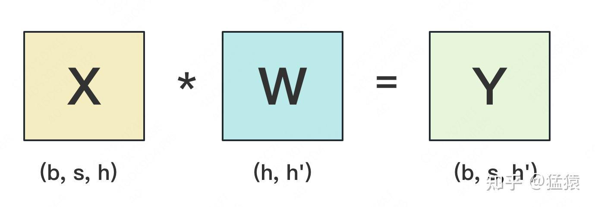

---

## 2. 符号与普通线性层

| 符号 | 含义 |
| --- | --- |
| $b$ | batch size |
| $s$ | sequence length |
| $h$ | 输入 hidden size |
| $h'$ | 输出 hidden size，MLP 中通常约为 $4h$ |
| $V$ | vocabulary size |
| $n$ | tensor parallel size |

输入和权重形状为：

$$
X\in\mathbb{R}^{b\times s\times h},
\qquad
W\in\mathbb{R}^{h\times h'}
$$

输出为：

$$
Y=XW
\in\mathbb{R}^{b\times s\times h'}
$$

为了简化推导，把前两个维度合并为 $T=b\times s$。不切分时，已知上游梯度 $dY$：

$$
dW=X^\mathsf{T}dY
$$

$$
dX=dYW^\mathsf{T}
$$

张量并行不会改变这两个公式，只是把其中的项分配到不同 GPU，再通过拼接或求和恢复数学上相同的结果。

---

## 3. 按列切分：输出特征自然分片

### 3.1 Forward

沿 $W$ 的输出维度 $h'$ 切分：

$$
W=
\left[
W_0,W_1,\ldots,W_{n-1}
\right]
$$

其中：

$$
W_i\in\mathbb{R}^{h\times h'/n}
$$

每个 rank 都拿到完整输入 $X$，本地计算：

$$
Y_i=XW_i
\in\mathbb{R}^{b\times s\times h'/n}
$$

完整输出是沿最后一维拼接：

$$
Y=
\left[
Y_0,Y_1,\ldots,Y_{n-1}
\right]
$$

如果下一个算子能够直接消费分片 $Y_i$，就不需要立即 All-Gather 完整 $Y$。

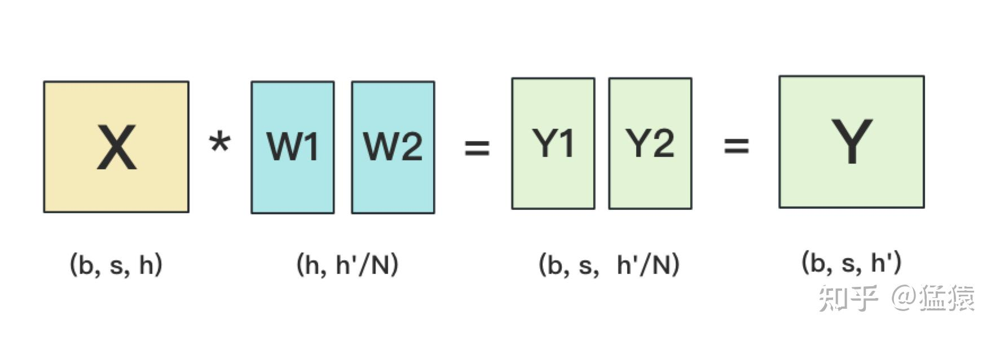

### 3.2 Backward

上游梯度也沿输出维度分片：

$$
dY=
\left[
dY_0,dY_1,\ldots,dY_{n-1}
\right]
$$

每个 rank 的权重梯度为：

$$
dW_i=X^\mathsf{T}dY_i
$$

这些 $dW_i$ 对应不同权重列，不需要相加。但是每个输出分片都依赖完整输入 $X$，rank $i$ 只能算出：

$$
dX_i=dY_iW_i^\mathsf{T}
$$

完整输入梯度为：

$$
dX=\sum_{i=0}^{n-1}dX_i
$$

因此列并行线性层在 backward 回到复制输入时，需要对 $dX_i$ 做 All-Reduce。

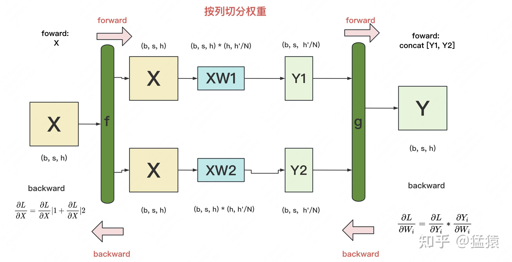

```text
列切：
forward 的 Y 是不同列，拼接关系
backward 的 dX 是不同贡献，求和关系
```

---

## 4. 按行切分：输出是多个部分和

### 4.1 Forward

沿 $W$ 的输入维度 $h$ 切分：

$$
W=
\begin{bmatrix}
W_0\\
W_1\\
\vdots\\
W_{n-1}
\end{bmatrix}
$$

其中：

$$
W_i\in\mathbb{R}^{h/n\times h'}
$$

输入也沿 hidden 维对应切分：

$$
X=
\left[
X_0,X_1,\ldots,X_{n-1}
\right],
\qquad
X_i\in\mathbb{R}^{b\times s\times h/n}
$$

每个 rank 计算：

$$
Z_i=X_iW_i
\in\mathbb{R}^{b\times s\times h'}
$$

每个 $Z_i$ 的形状都与完整输出相同，但数值上只是部分和：

$$
Y=\sum_{i=0}^{n-1}Z_i
$$

因此基础行并行层在 forward 需要 All-Reduce。

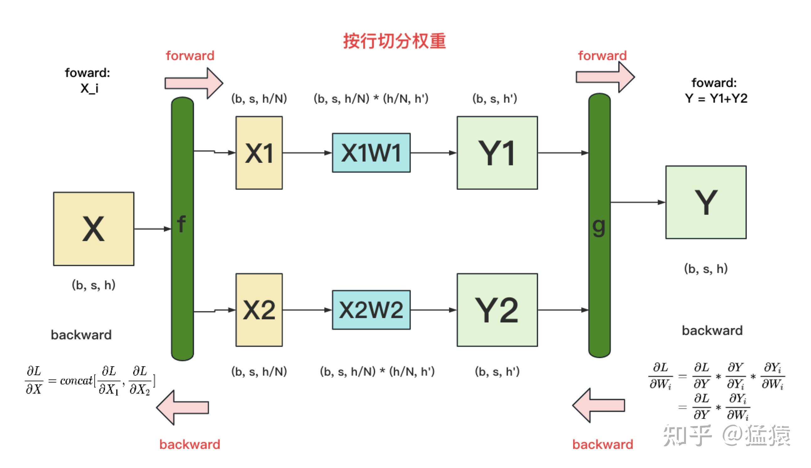

### 4.2 Backward

每个 rank 独立计算：

$$
dW_i=X_i^\mathsf{T}dY
$$

$$
dX_i=dYW_i^\mathsf{T}
$$

$dX_i$ 对应输入 hidden 维的不同分片：

$$
dX=
\left[
dX_0,dX_1,\ldots,dX_{n-1}
\right]
$$

这里是拼接关系，不是求和关系，所以行并行层的这一段 backward 不需要额外 All-Reduce。

```text
行切：
forward 的 Y 是不同部分和，需要求和
backward 的 dX 是不同 hidden 分片，拼接关系
```

---

## 5. Megatron MLP：列并行接行并行

### 5.1 普通 MLP

忽略 bias，Transformer MLP 可以写成：

$$
H=\operatorname{GELU}(XA)
$$

$$
Z=HB
$$

其中：

$$
A\in\mathbb{R}^{h\times h'},
\qquad
B\in\mathbb{R}^{h'\times h},
\qquad
h'\approx4h
$$

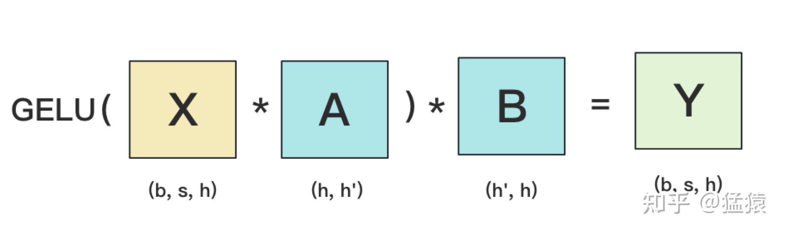

### 5.2 第一层列并行

把 $A$ 按列切分：

$$
A=
\left[
A_0,A_1,\ldots,A_{n-1}
\right]
$$

每个 rank 计算：

$$
H_i=\operatorname{GELU}(XA_i)
$$

形状变化为：

$$
(b,s,h)
\longrightarrow
\left(b,s,\frac{h'}{n}\right)
$$

GELU 是逐元素函数，各 rank 可以直接对本地分片执行，无需恢复完整 $H$。

### 5.3 第二层行并行

把 $B$ 按行切分：

$$
B=
\begin{bmatrix}
B_0\\
B_1\\
\vdots\\
B_{n-1}
\end{bmatrix},
\qquad
B_i\in\mathbb{R}^{h'/n\times h}
$$

第一层的输出分片 $H_i$ 恰好对应第二层的输入分片。每个 rank 直接计算：

$$
Z_i=H_iB_i
\in\mathbb{R}^{b\times s\times h}
$$

完整输出为：

$$
Z=\sum_{i=0}^{n-1}Z_i
$$

因此最后执行一次 All-Reduce，所有 TP ranks 得到相同的完整 $Z$。

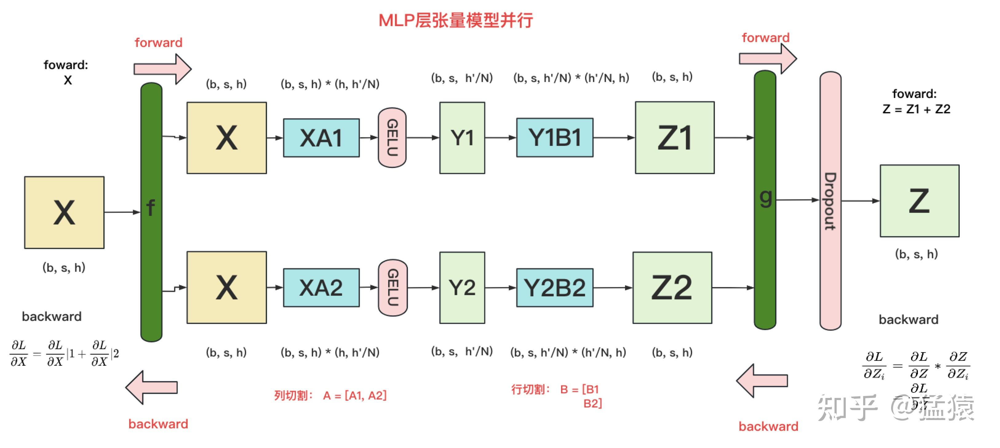

### 5.4 完整形状数据流

每个 rank 上：

$$
\boxed{
(b,s,h)
\longrightarrow
\left(b,s,\frac{h'}{n}\right)
\longrightarrow
(b,s,h)
}
$$

最后一个 $(b,s,h)$ 在 All-Reduce 前只是局部部分和 $Z_i$，归约后才是完整 MLP 输出。

### 5.5 为什么中间不做 All-Gather

如果在 GELU 后恢复：

$$
H=
\left[
H_0,\ldots,H_{n-1}
\right]
$$

每张 GPU 都会重新持有形状 $(b,s,h')$ 的宽激活，既增加通信，也抹掉激活分片的显存收益。列并行 $A$ 接行并行 $B$，就是为了让 $A$ 的输出分片直接成为 $B$ 的输入分片。

### 5.6 Backward

已知完整上游梯度 $dZ$：

1. 行并行 $B$ 在每个 rank 计算 $dH_i=dZB_i^\mathsf{T}$。
2. 本地通过 GELU backward。
3. 列并行 $A$ 计算 $dA_i$ 和输入梯度贡献 $dX_i$。
4. 对 $dX_i$ 做 All-Reduce：

$$
dX=\sum_idX_i
$$

所以一个 MLP 中，forward 在行并行输出处有一次 All-Reduce，backward 在列并行输入梯度处有一次 All-Reduce。

---

## 6. Self-Attention 的张量并行

### 6.1 按完整 heads 切分

设注意力头数为 $a$，每个 head 维度为 $d_h$：

$$
h=a\times d_h
$$

不同 heads 可以独立计算：

$$
Q_j=XW_j^Q,
\qquad
K_j=XW_j^K,
\qquad
V_j=XW_j^V
$$

$$
O_j=
\operatorname{Softmax}
\left(
\frac{Q_jK_j^\mathsf{T}}{\sqrt{d_h}}
\right)V_j
$$

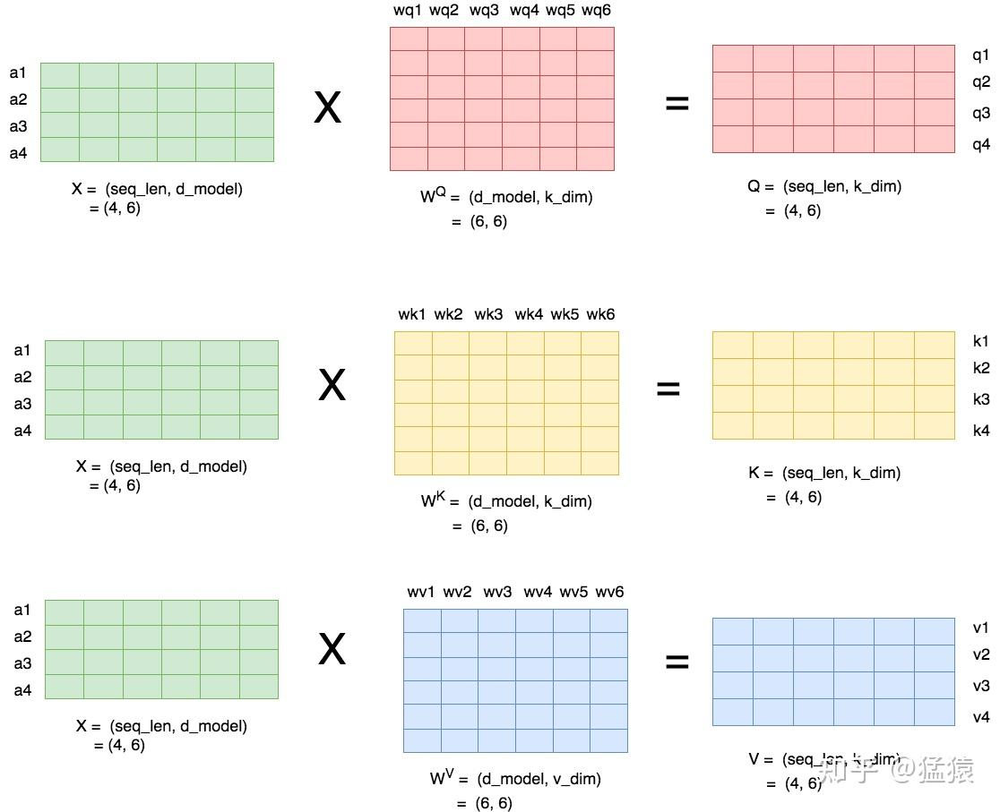

Q、K、V 投影矩阵沿输出维度切分，每个 TP rank 获得一组完整 heads。每个 head 的 $Q_j$、$K_j$、$V_j$ 必须位于同一 rank，这样本地能够完整计算 Attention。

标准 Multi-Head Attention 不会让 head $i$ 的 $Q_i$ 与 head $j$ 的 $K_j$ 相乘，因此不存在必须补齐的跨 rank “交叉 head”项。

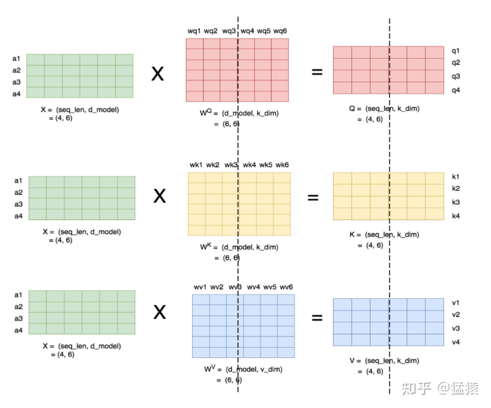

### 6.2 输出投影行并行

各 rank 得到一部分 head 输出：

$$
O=
\left[
O_0,O_1,\ldots,O_{n-1}
\right]
$$

输出投影矩阵按输入维度行切：

$$
W^O=
\begin{bmatrix}
W_0^O\\
W_1^O\\
\vdots\\
W_{n-1}^O
\end{bmatrix}
$$

每个 rank 计算：

$$
Y_i=O_iW_i^O
$$

最终通过 All-Reduce 得到：

$$
Y=\sum_iY_i
$$

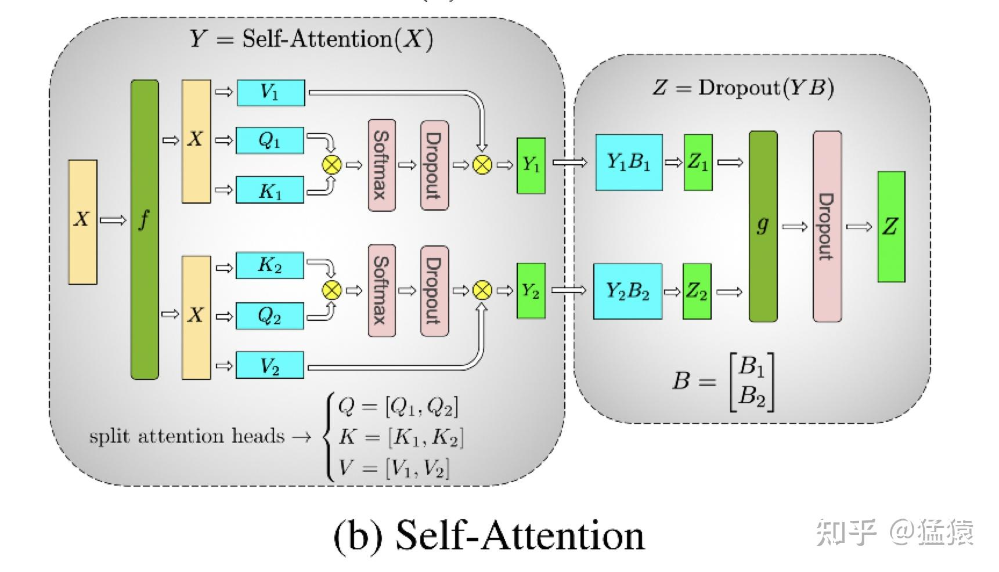

它与 MLP 的模式一致：

```text
QKV 投影：列并行
→ 本地完成自己 heads 的 Attention
→ 输出投影：行并行
→ forward All-Reduce
```

backward 回到复制输入时还需要一次 All-Reduce。

---

## 7. Embedding 与输出词表投影

### 7.1 输入 Embedding

Embedding 权重为：

$$
E\in\mathbb{R}^{V\times h}
$$

沿词表维度切分：

$$
E_i\in\mathbb{R}^{V/n\times h}
$$

对输入 token $x$：

- 属于本地词表范围时，查出对应 embedding。
- 不属于时，输出全零向量。
- 对所有 ranks 的局部结果执行 All-Reduce SUM。

一个 token 只属于一个词表分片，因此求和后就是完整 embedding：

$$
H\in\mathbb{R}^{b\times s\times h}
$$

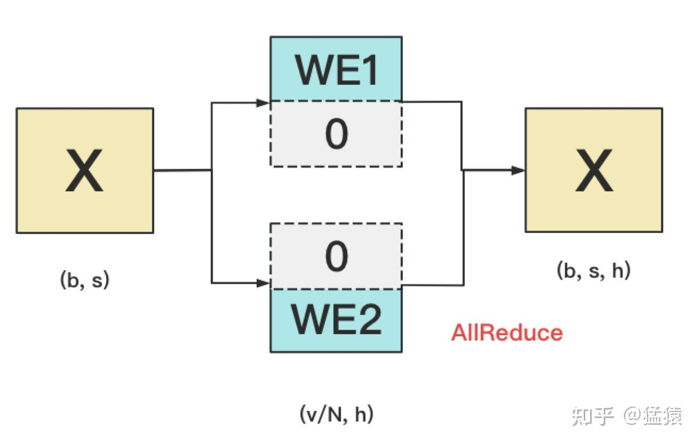

### 7.2 输出 Vocabulary Projection

输出权重：

$$
W_{\mathrm{vocab}}
\in\mathbb{R}^{V\times h}
$$

普通 logits 为：

$$
O=HW_{\mathrm{vocab}}^\mathsf{T}
\in\mathbb{R}^{b\times s\times V}
$$

沿词表维度切分权重后，每个 rank 只产生：

$$
O_i=HW_i^\mathsf{T}
\in\mathbb{R}^{b\times s\times V/n}
$$

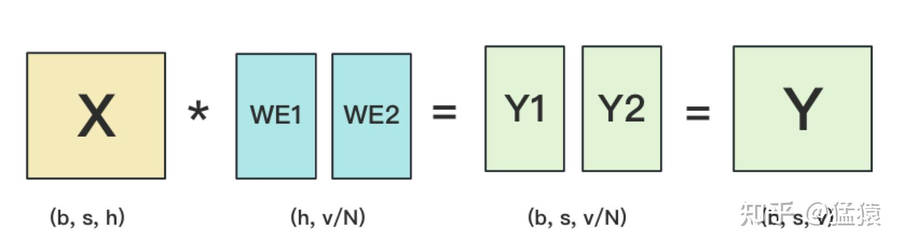

如果立即 All-Gather，每张 GPU 都会重建巨大 logits $(b,s,V)$。Vocabulary Parallel Cross Entropy 用分布式统计量避免这一步。

---

## 8. Vocabulary Parallel Cross Entropy

### 8.1 普通 Cross Entropy

对于某个 token，正确 token id 为 $y$：

$$
L
=
-\log
\frac{\exp(o_y)}
{\sum_{j=0}^{V-1}\exp(o_j)}
$$

为了数值稳定，令：

$$
m=\max_j o_j
$$

则：

$$
L
=
\log
\left(
\sum_{j=0}^{V-1}\exp(o_j-m)
\right)
+m-o_y
$$

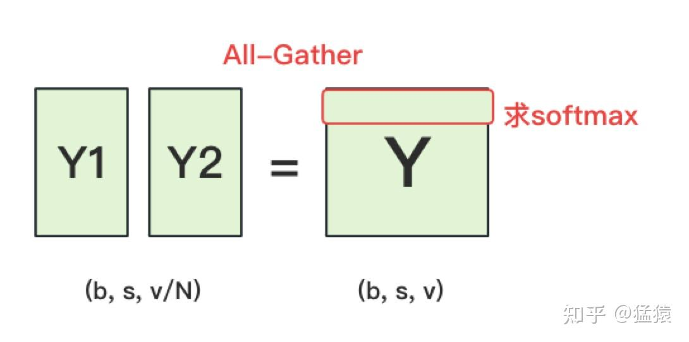

Cross Entropy 真正需要的是全词表最大值、稳定指数和以及正确类别 logit。

### 8.2 全局最大值

每个 rank 在自己的词表分片计算：

$$
m_i
=
\max_{j\in\mathcal{V}_i}o_j
\in\mathbb{R}^{b\times s}
$$

执行 All-Reduce MAX：

$$
m=\max_i m_i
$$

### 8.3 全局指数和

每个 rank 计算：

$$
q_i
=
\sum_{j\in\mathcal{V}_i}
\exp(o_j-m)
\in\mathbb{R}^{b\times s}
$$

执行 All-Reduce SUM：

$$
q=\sum_iq_i
=
\sum_{j=0}^{V-1}\exp(o_j-m)
$$

### 8.4 正确类别 logit

每个 rank 判断标签 $y$ 是否属于自己的词表范围：

$$
t_i=
\begin{cases}
o_y,&y\in\mathcal{V}_i\\
0,&y\notin\mathcal{V}_i
\end{cases}
$$

执行 All-Reduce SUM：

$$
t=\sum_it_i=o_y
$$

### 8.5 得到 loss

每个 rank 都能计算：

$$
L=\log q+m-t
\in\mathbb{R}^{b\times s}
$$

再对有效 token 求和或求平均，得到标量 loss。

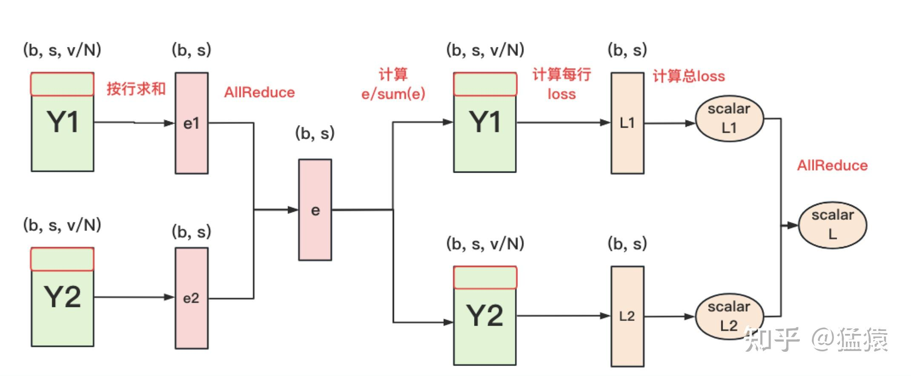

> [!warning]
> 图中用“局部指数和归约”概括主要思路。稳定实现还必须归约全局最大值，并取得正确类别 logit；最终跨 rank 的损失聚合也应根据损失定义使用 Reduce 或 All-Reduce，而不是理解成拼接标量的 All-Gather。

### 8.6 形状变化

普通单卡：

$$
(b,s,h)
\longrightarrow
(b,s,V)
\longrightarrow
(b,s)
\longrightarrow
()
$$

词表并行时，每个 rank：

$$
\boxed{
(b,s,h)
\longrightarrow
\left(b,s,\frac{V}{n}\right)
\longrightarrow
(b,s)
\longrightarrow
()
}
$$

### 8.7 Backward

每个 rank 计算自己的 softmax 概率分片：

$$
p_i
=
\frac{\exp(O_i-m)}{q}
$$

正确类别所在 rank 在对应位置减去 1：

$$
dO_i=p_i-\operatorname{onehot}_i(y)
$$

输出词表投影对隐藏状态的梯度贡献为：

$$
dH_i=dO_iW_i
$$

完整梯度需要求和：

$$
dH=\sum_idH_i
$$

这次 All-Reduce 属于词表并行输出线性层的 backward。

---

## 9. 通信量为什么会出现 $4\Phi$

设形状 $(b,s,h)$ 的激活或梯度张量字节数为：

$$
\Phi=bsh\times\text{bytes-per-element}
$$

一次 Ring All-Reduce 的单 rank 精确发送量为：

$$
V_{\mathrm{AR}}
=
2\frac{n-1}{n}\Phi
$$

一个 MLP 完整 forward + backward 有两次 All-Reduce：

| 阶段 | 原因 |
| --- | --- |
| forward | 行并行输出 $Z_i$ 是部分和 |
| backward | 列并行产生的 $dX_i$ 是输入梯度贡献 |

所以：

$$
V_{\mathrm{MLP}}
=
4\frac{n-1}{n}\Phi
$$

当 $n$ 较大时近似为 $4\Phi$；当 $n=2$ 时精确值为 $2\Phi$。

Attention 模块也通常有一次 forward All-Reduce 和一次 backward All-Reduce。因此经典 Transformer layer 的 Attention 与 MLP 合计四次 All-Reduce；实际字节数还会受到 sequence parallel、通信融合、数据类型和张量布局影响。

---

## 10. TP 与 DP 如何组合

一个 TP 组中的 ranks 共同处理同一批数据。不同 TP 组构成数据并行副本，处理不同数据。

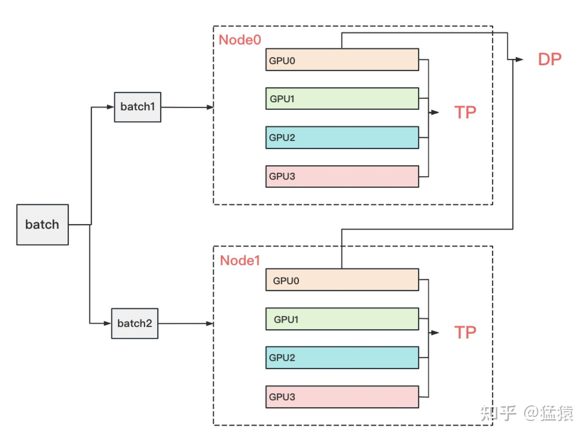

假设：

$$
TP=4,
\qquad
DP=2
$$

总 GPU 数为 $4\times2=8$：

```text
DP replica 0：GPU 0～3，共同处理 batch 0
DP replica 1：GPU 4～7，共同处理 batch 1
```

DP 同步的是对应 TP 分片的梯度：

```text
replica 0 的 TP shard 0
与
replica 1 的 TP shard 0
组成一个 DP group
```

TP 通信常位于层内关键路径，不完成当前集合通信就无法继续下一算子；DP 梯度通信则可以按 bucket 与更早层的 backward 计算重叠。因此 TP 通常更依赖低延迟、高带宽互联。

---

## 11. TP、PP、DP 与 ZeRO 的组合

假设：

$$
TP=2,
\qquad
PP=2,
\qquad
DP=2
$$

总 GPU 数为 $2\times2\times2=8$。

参数归属按以下顺序理解：

```text
PP：参数属于哪个 pipeline stage
TP：该 stage 内的参数属于哪个 tensor shard
DP：复制相同的 PP + TP shard
ZeRO：在 DP group 内继续切 optimizer states、gradients 或 parameters
```

### 11.1 PP 会自然划分模型状态

一个 pipeline stage 只拥有自己负责的 layers，因此只保存这些 layers 的：

- 参数和梯度。
- FP32 master parameters。
- Adam 一阶、二阶动量。
- forward/backward 所需激活。

这不是额外执行了一次 optimizer state 分片算法，而是其他 stages 的参数从未归属于本 stage。

### 11.2 Megatron 与 ZeRO-3

Megatron TP/PP 可以与 ZeRO-3 组合：

```text
PP 决定 layer
→ TP 决定 layer 内计算分片
→ ZeRO-3 在 DP group 内继续分片该 TP shard
```

计算某层时，DP group 先 All-Gather 当前计算所需的 TP 参数分片，TP group 再执行分布式矩阵乘法，backward 后在 DP group 内 Reduce-Scatter 梯度。

完整 ZeRO-3 会增加参数聚合和调度复杂度。很多 Megatron 训练会采用：

$$
TP+PP+DP+\text{Distributed Optimizer}
$$

Distributed Optimizer 在 DP 维度切分 FP32 master parameters 和 Adam states，并配合梯度 Reduce-Scatter、参数 All-Gather，取得优化器显存收益，而不一定让低精度计算参数始终保持 ZeRO-3 式分片。

---

## 12. 收益、代价与适用位置

| 方面 | 收益 | 代价 |
| --- | --- | --- |
| 参数显存 | 单层大矩阵按 TP 大小分片 | 某些输入/输出仍会复制或聚合 |
| 计算 | 大型 GEMM 分布到多张 GPU | GEMM 过小后单卡效率下降 |
| 激活 | MLP 最宽中间激活保持分片 | 模块边界需要集合通信 |
| 扩展 | 单层超出单卡时仍可训练 | TP 通信位于层内关键路径 |
| 组合 | 可与 PP、DP、ZeRO 组合 | process groups 和调度更复杂 |

实践中通常优先把 TP 组放在 NVLink、NVSwitch 等高速互联范围内，再通过 PP 或 DP 扩展到更多节点。

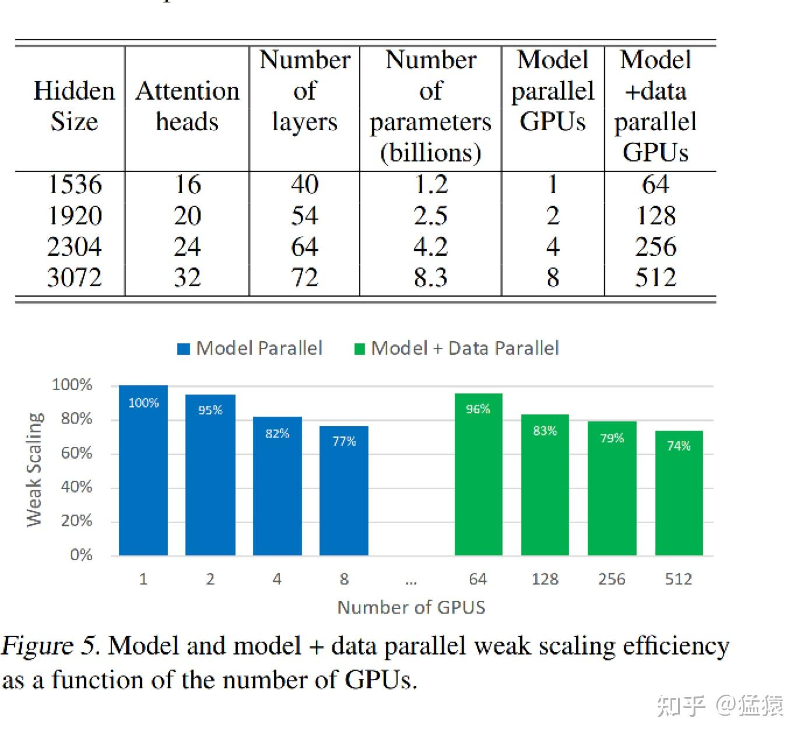

---

## 13. 机制总表

| 模块 | 第一部分 | 中间状态 | 第二部分 | 主要通信 |
| --- | --- | --- | --- | --- |
| MLP | $A$ 列并行 | $h'/n$ 激活分片 | $B$ 行并行 | forward、backward 各一次 All-Reduce |
| Attention | QKV 列并行 | 完整 heads 分片 | 输出投影行并行 | forward、backward 各一次 All-Reduce |
| Input Embedding | vocabulary 分片 | 本地命中或零向量 | 求和恢复 embedding | All-Reduce SUM |
| Output Projection | vocabulary 分片 | 本地 logits $V/n$ | 直接进入并行 CE | 不 All-Gather 完整 logits |
| Cross Entropy | 本地 max/sum/target | $(b,s)$ 统计量 | 全局 loss | MAX/SUM collectives |

---

## 14. QA

### Q1：按列切和按行切的反向传播，与不切分有什么不同？

数学上没有不同。不切分时单卡直接计算 $dW=X^\mathsf{T}dY$ 和 $dX=dYW^\mathsf{T}$。切分后：

- 列切的 $dW_i$ 是不同权重列；$dX_i$ 是对同一完整输入的不同贡献，需要求和。
- 行切的 $dW_i$ 是不同权重行；$dX_i$ 是输入 hidden 维的不同分片，逻辑上拼接。

### Q2：MLP 是不是列切算完后，顺势进行一次行切运算？

是，但权重不是运行时临时再切。第一层权重 $A$ 预先按列保存，第二层权重 $B$ 预先按行保存。$A$ 的本地输出 $H_i$ 直接成为 $B_i$ 的本地输入，中间不恢复完整 $H$。

### Q3：为什么最后不是 All-Gather，而是 All-Reduce？

$H_i$ 是完整中间激活的不同特征分片，恢复 $H$ 才需要 All-Gather。但第二层的 $Z_i=H_iB_i$ 已经具有完整输出形状，只是数值上的部分和：

$$
Z=\sum_iZ_i
$$

所以必须 All-Reduce。

### Q4：MLP 的形状是不是 $(b,s,h)\rightarrow(b,s,h'/n)\rightarrow(b,s,h)$？

是。最后的 $(b,s,h)$ 在 All-Reduce 前只是 $Z_i$，归约后才是完整 $Z$。

### Q5：不是只有 MLP 最后一次 All-Reduce 吗，通信量为什么写成 $4\Phi$？

“最后一次”只描述 forward。backward 回到列并行输入时还要对 $dX_i$ 做一次 All-Reduce。两次 Ring All-Reduce 的精确单 rank 发送量为：

$$
4\frac{n-1}{n}\Phi
$$

$4\Phi$ 是 $n$ 较大时的近似。

### Q6：Cross Entropy 为什么能不恢复完整 vocabulary logits？

它只需要全词表最大值、指数和以及正确类别 logit。这些量都能由每个 rank 的局部统计量通过 MAX 或 SUM collective 得到，因此只需保存 $(b,s,V/n)$ 的本地 logits。

### Q7：Megatron 是否意味着不同 GPU 不再按 layer 切分？

纯 TP 中，每个 rank 保存相关 layers 的 tensor 分片。但现代训练通常叠加 PP：PP 让不同 stages 负责不同 layers，TP 再在每个 stage 内切每一层的 tensor。一张 GPU 常保存的是“一部分 layers 中，每层的一部分 tensor”。

### Q8：Megatron 与 ZeRO-3 可以组合吗？

可以。TP/PP 负责计算切分，ZeRO-3 在 DP group 内继续分片参数、梯度和优化器状态。但逐层参数 All-Gather 会增加通信和调度复杂度，因此很多 Megatron 训练更常采用 TP + PP + DP + Distributed Optimizer。

### Q9：PP 划分 layers 时，会连同梯度和优化器状态一起划分吗？

会。某个 stage 只拥有分配给自己的 layers，所以也只产生这些 layers 的梯度，并只维护这些参数的 FP32 master parameters、Adam $m/v$ 等状态。之后还可以在同一 PP+TP shard 的 DP group 内继续使用 ZeRO 或 Distributed Optimizer。

---

## 参考资料

1. [图解大模型训练之：张量模型并行（TP），Megatron-LM](https://zhuanlan.zhihu.com/p/622212228)
2. [Megatron-LM: Training Multi-Billion Parameter Language Models Using Model Parallelism](https://arxiv.org/abs/1909.08053)
3. [NVIDIA Megatron-LM](https://github.com/NVIDIA/Megatron-LM)
