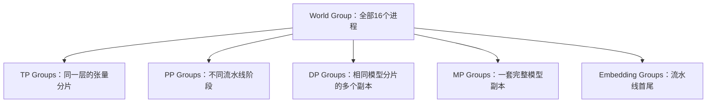
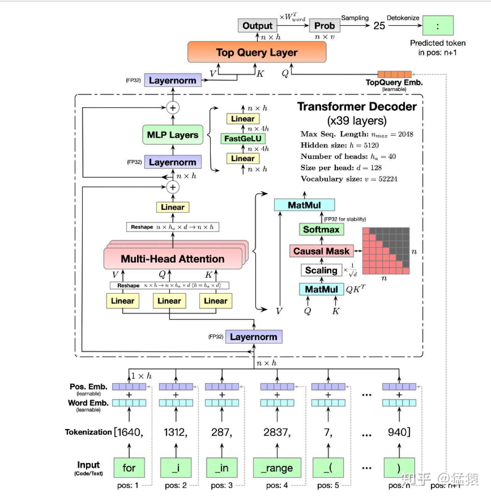
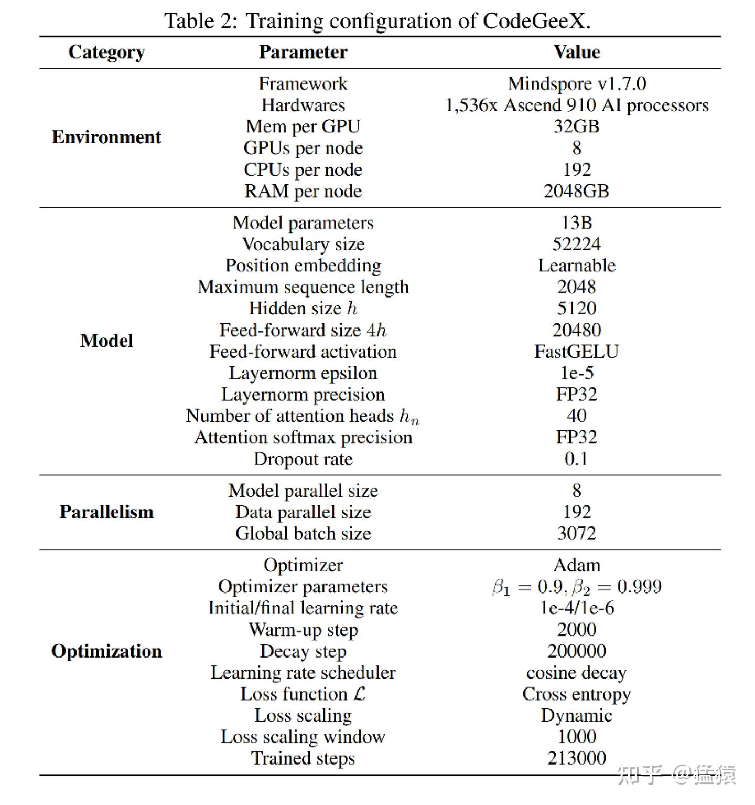
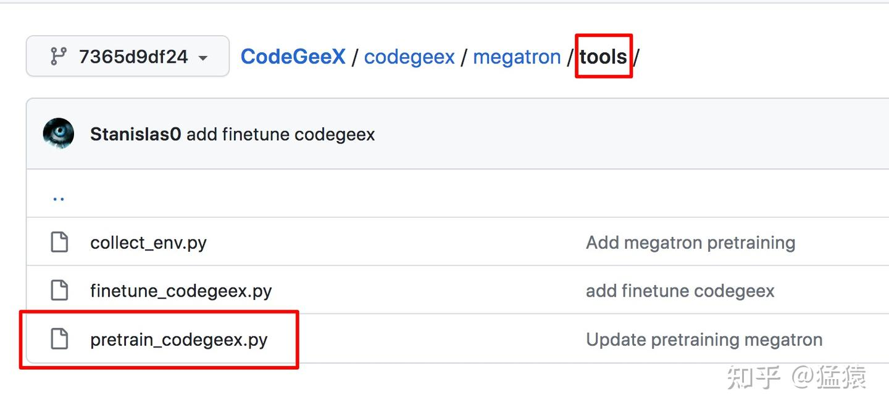
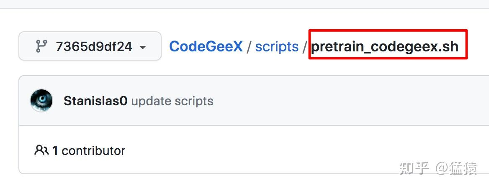
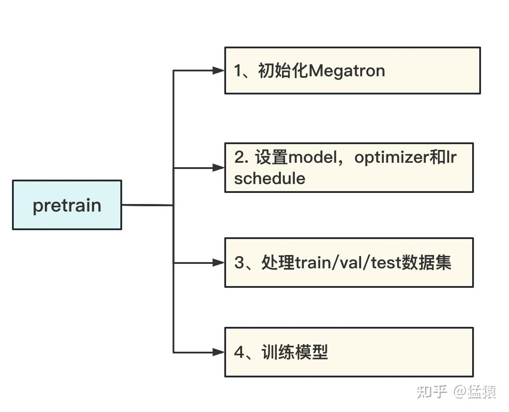
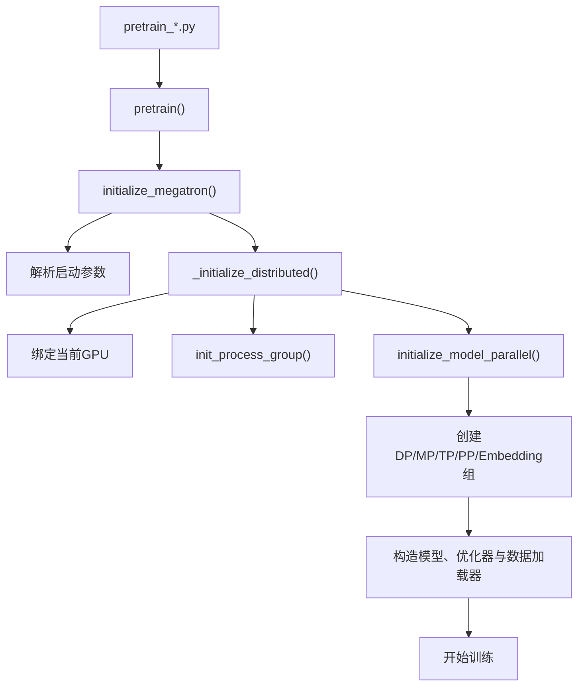
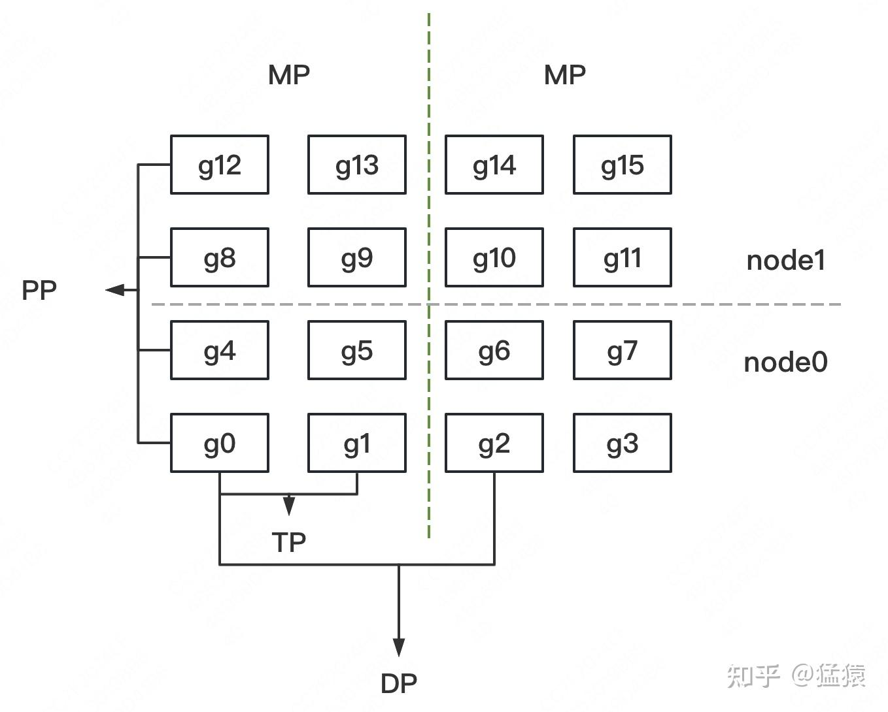
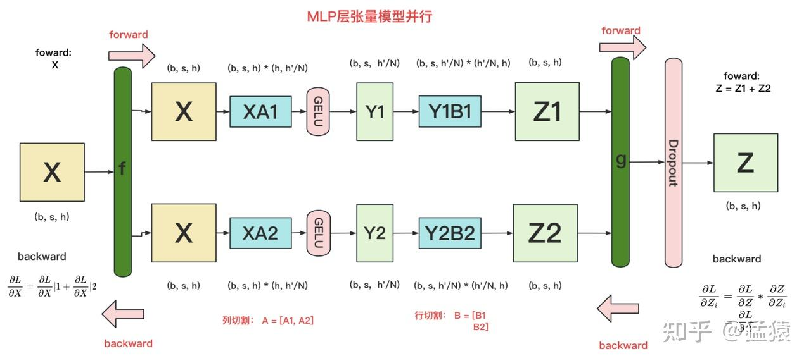

# 05-Megatron源码解读1--分布式环境初始化

> [!note]
> Megatron 的分布式初始化还没有真正切模型或开始训练。它先把所有进程组织成 World Group，再分别建立 TP、PP、DP、MP 和 Embedding 子组。后续的张量并行层、流水线调度器和数据并行梯度同步，都会使用这些预先建立的“通信通讯录”。

## 阅读说明

这份笔记围绕一条主线展开：

```text
训练入口
  → 初始化全局分布式环境
  → 给进程绑定 GPU
  → 根据 TP 和 PP 推导 DP
  → 创建各类通信子组
  → 后续代码按组切模型、传激活、同步梯度
```

核心示例固定为：

$$
\text{world size}=16,
\qquad
TP=2,
\qquad
PP=4,
\qquad
DP=2
$$

这样每一段循环都能展开成具体 rank，而不是停留在抽象公式上。

本文代码路径对应较早期 Megatron-LM：

```text
megatron/initialize.py
megatron/mpu/initialize.py
```

当前 Megatron Core 已经把并行状态初始化扩展并迁移到：

```text
megatron/core/parallel_state.py
```

现代版本还包含 Context Parallel、Expert Parallel 等更多维度，但 TP、PP、DP 三个基础坐标的理解方式没有改变。

---

## 1. 初始化究竟解决什么问题

假设有 16 张 GPU。操作系统和 PyTorch 最初只知道：

```text
这里有16个进程，每个进程拥有一个全局rank。
```

但训练代码还不知道：

- 哪些进程共同计算同一个 layer。
- 哪些进程负责同一条 pipeline 的不同 stages。
- 哪些进程保存相同的参数分片，需要同步梯度。
- 哪些进程合起来构成一份完整模型。
- 哪些流水线首尾进程需要同步共享 Embedding。

初始化过程就是为这些关系建立明确的 process groups。



process group 本身不会切模型，它只规定通信范围。例如：

```python
torch.distributed.all_reduce(
    tensor,
    group=get_tensor_model_parallel_group(),
)
```

这里的 `group` 决定 All-Reduce 只发生在当前 TP 组中，而不是让 16 个进程全部参加。

---

## 2. 从训练入口到并行分组

### 2.1 CodeGeeX 示例的训练配置

这条源码链路以 CodeGeeX 的预训练工程为例。它采用 GPT 类 Transformer，并使用：

```text
Megatron 张量并行
+
DeepSpeed ZeRO-2
```

CodeGeeX 的模型结构和矩阵形状如下。这里不要求先读懂每一处细节；本篇只需要记住，它是一套 GPT 类 Transformer，后续必须由多张 GPU 协同训练。



训练配置图把模型规模、精度、优化器与并行规模集中列在了一起：



对应的大规模训练配置为：

```text
TP size = 8
PP size = 1
DP size = 192
GPU总数 = 8 × 1 × 192 = 1536
```

因此它没有把模型切成多个物理 pipeline stages，而是在每个模型副本内用 8 张 GPU 做 TP，再复制 192 套数据并行副本。ZeRO-2 继续在 DP group 中分片优化器状态和梯度。

工程中的两个重要入口是：

```text
预训练Python入口：megatron/tools/pretrain_codegeex.py
分布式启动脚本：pretrain_codegeex.sh
```





启动脚本负责提供两类参数：

- 模型参数：层数、hidden size、attention heads、batch size 等。
- 分布式参数：world size、TP size、PP size、rank、master 地址等。

`pretrain_codegeex.py` 中的 `pretrain()` 可以拆成四个阶段：

```text
1. 初始化Megatron与分布式环境
2. 构造模型、优化器和学习率调度器
3. 构造并切分train/valid/test数据集
4. 进入训练循环
```



这四步存在严格依赖关系：初始化先产出并行通信组；模型、优化器和数据集再读取这些组完成切分；最后训练循环才能按 TP、PP、DP 的职责执行通信与计算。

本篇聚焦第一阶段。后面的模型构造代码会读取本篇创建好的并行 groups，才真正决定每个 rank 持有哪些 layers 和 tensor shards。

### 2.2 初始化调用链

预训练代码的主链路可以压缩为：



其中最关键的两层初始化是：

### 2.3 `_initialize_distributed()` 的代码总览

先只看模块边界，不进入任何一段循环。旧版 Megatron 的核心初始化可以压缩成下面这份骨架：

```python
def _initialize_distributed():
    args = get_args()

    # 模块一：确定当前进程使用哪张 GPU
    device_count = torch.cuda.device_count()
    device = args.rank % device_count
    torch.cuda.set_device(device)

    # 模块二：让全部进程加入默认 World Group
    if not torch.distributed.is_initialized():
        torch.distributed.init_process_group(
            backend=args.distributed_backend,
            world_size=args.world_size,
            rank=args.rank,
            init_method=args.distributed_init_method,
        )

    # 模块三：在 World Group 内创建 TP、PP、DP 等子组
    if not mpu.model_parallel_is_initialized():
        mpu.initialize_model_parallel(
            args.tensor_model_parallel_size,
            args.pipeline_model_parallel_size,
            args.virtual_pipeline_model_parallel_size,
        )

    # 可选模块：启用 DeepSpeed 的激活分片等 ZeRO-R 能力
    if args.deepspeed and args.deepspeed_activation_checkpointing:
        setup_deepspeed_random_and_activation_checkpointing(args)
```

整段代码先拆成四个模块：

| 模块 | 输入 | 产出 | 后续用途 |
| --- | --- | --- | --- |
| 进程绑定 GPU | `rank`、单机 GPU 数 | 当前 CUDA device | 保证一个进程只驱动目标 GPU |
| World Group | 地址、端口、`world_size`、`rank` | 默认全局进程组 | 让所有进程互相发现 |
| 并行子组 | TP size、PP size、推导出的 DP size | TP/PP/DP/MP/Embedding group | 限定各种 collective 和点对点通信范围 |
| ZeRO-R 配置 | DeepSpeed 参数 | 激活检查点与激活分片配置 | 降低 residual memory |

下面依次展开这些模块。这样阅读 `range()` 循环时，始终知道它正在为哪一种通信建立“通讯录”。

### 2.4 全局初始化

不同节点上的进程首先要通过一个共同 rendezvous 地址相互发现。常见配置来自：

```text
MASTER_ADDR：rank 0所在节点的地址
MASTER_PORT：用于初始化通信的端口
WORLD_SIZE：全部进程数量
RANK：当前进程的global rank
LOCAL_RANK：当前节点内的进程/GPU编号
```

旧版代码将地址拼成：

```python
master_ip = os.getenv("MASTER_ADDR", "localhost")
master_port = os.getenv("MASTER_PORT", "6000")
init_method = "tcp://" + master_ip + ":" + master_port
```

随后调用：

```python
torch.distributed.init_process_group(
    backend=args.distributed_backend,
    world_size=args.world_size,
    rank=args.rank,
    init_method=init_method,
)
```

它建立包含全部进程的默认 World Group。

只有所有进程都成功加入 World Group，后面才可以安全地创建通信子组。

### 2.5 并行子组初始化

```python
mpu.initialize_model_parallel(
    args.tensor_model_parallel_size,
    args.pipeline_model_parallel_size,
    args.virtual_pipeline_model_parallel_size,
)
```

它在 World Group 内继续创建各种子组。

因此两者关系是：

```text
init_process_group()：大家先进入同一个总群
initialize_model_parallel()：再创建不同用途的子群
```

---

## 3. 进程如何绑定 GPU

分布式训练通常采用：

```text
一个进程对应一张GPU
```

旧版初始化代码的核心逻辑是：

```python
device_count = torch.cuda.device_count()
device = args.rank % device_count
torch.cuda.set_device(device)
```

假设每个节点有 8 张 GPU：

| Global rank | 所在节点 | 节点内 GPU 编号 |
| ---: | --- | ---: |
| 0 | node 0 | 0 |
| 1 | node 0 | 1 |
| ... | ... | ... |
| 7 | node 0 | 7 |
| 8 | node 1 | 0 |
| 9 | node 1 | 1 |
| ... | ... | ... |
| 15 | node 1 | 7 |

这里必须区分三种 rank。

### 3.1 Global rank

进程在整个 World Group 中的编号：

```text
0～15
```

### 3.2 节点内 local rank

进程在当前节点中的编号，通常也对应节点内 GPU 编号：

```text
global rank 9
local rank  1
```

### 3.3 Subgroup rank

进程在某个通信子组中的编号。

例如 TP 组为：

```text
[g6,g7]
```

那么：

```text
g6的TP group rank = 0
g7的TP group rank = 1
```

所以：

```python
torch.distributed.get_rank(
    group=get_tensor_model_parallel_group()
)
```

返回的是 TP subgroup rank，不是节点内 `local_rank`。

---

## 4. 用三维坐标理解所有分组

先定义三个坐标：

$$
(p,d,t)
$$

其中：

- $p$：Pipeline Parallel 坐标。
- $d$：Data Parallel 坐标。
- $t$：Tensor Parallel 坐标。

本例采用的 rank 排列方式为：

$$
\text{rank}=p(DT)+dT+t
$$

也就是说：

```text
t变化最快，d其次，p最慢。
```

16 张 GPU 的布局为：



把图中的位置改写成 rank 表格，就是：

```text
                    DP副本0        DP副本1

PP阶段0             [g0, g1]       [g2, g3]
PP阶段1             [g4, g5]       [g6, g7]
PP阶段2             [g8, g9]       [g10,g11]
PP阶段3             [g12,g13]      [g14,g15]
                     └─TP─┘          └─TP─┘
```

不同分组就是固定部分坐标、改变另一个坐标：

| 分组 | 固定坐标 | 改变坐标 | 含义 |
| --- | --- | --- | --- |
| TP | $(p,d)$ | $t$ | 同一层的不同张量分片 |
| PP | $(d,t)$ | $p$ | 同一流水线的不同 stages |
| DP | $(p,t)$ | $d$ | 同一模型分片的不同数据副本 |
| MP | $d$ | $(p,t)$ | 一套完整模型副本包含的全部模型分片 |

这四行是整段初始化代码的数学本质。

---

## 5. 推导 DP 大小与各类组数

初始化函数接收：

```python
initialize_model_parallel(
    tensor_model_parallel_size_=2,
    pipeline_model_parallel_size_=4,
    virtual_pipeline_model_parallel_size_=None,
)
```

为什么没有显式传入 DP size？因为：

$$
\text{world size}
=TP\times PP\times DP
$$

所以：

$$
DP=\frac{\text{world size}}{TP\times PP}
$$

代码首先检查能否整除：

```python
ensure_divisibility(
    world_size,
    tensor_model_parallel_size * pipeline_model_parallel_size,
)
```

再推导：

```python
data_parallel_size = world_size // (
    tensor_model_parallel_size
    * pipeline_model_parallel_size
)
```

代入本例：

$$
DP=\frac{16}{2\times4}=2
$$

### 5.1 计算 TP 组数

```python
num_tensor_model_parallel_groups = (
    world_size // tensor_model_parallel_size
)
```

$$
\text{TP组数}=\frac{16}{2}=8
$$

### 5.2 计算 PP 组数

```python
num_pipeline_model_parallel_groups = (
    world_size // pipeline_model_parallel_size
)
```

$$
\text{PP组数}=\frac{16}{4}=4
$$

这里的变量表示“PP 组的数量”，不是“PP stages 的数量”。

由于：

$$
\text{PP组数}=DP\times TP=2\times2=4
$$

它也恰好等于一个 PP stage 内的进程数量，后面会被用作跨 stage 的 rank 步长。

### 5.3 计算 DP 组数

```python
num_data_parallel_groups = (
    world_size // data_parallel_size
)
```

$$
\text{DP组数}=\frac{16}{2}=8
$$

最终得到：

| 组 | 每组大小 | 组数 |
| --- | ---: | ---: |
| TP | 2 | 8 |
| PP | 4 | 4 |
| DP | 2 | 8 |
| MP | $TP\times PP=8$ | 2 |

---

## 6. Virtual Pipeline Parallel 初始化

```python
if virtual_pipeline_model_parallel_size_ is not None:
    global _VIRTUAL_PIPELINE_MODEL_PARALLEL_RANK
    global _VIRTUAL_PIPELINE_MODEL_PARALLEL_WORLD_SIZE

    _VIRTUAL_PIPELINE_MODEL_PARALLEL_RANK = 0
    _VIRTUAL_PIPELINE_MODEL_PARALLEL_WORLD_SIZE = (
        virtual_pipeline_model_parallel_size_
    )
```

普通 PP 中，每个物理 pipeline rank 通常负责一段连续 layers：

```text
P0：Layer 0～5
P1：Layer 6～11
P2：Layer 12～17
P3：Layer 18～23
```

Virtual PP 会让同一个物理 rank 持有多个 model chunks。例如：

```text
P0：Chunk 0 + Chunk 4
P1：Chunk 1 + Chunk 5
P2：Chunk 2 + Chunk 6
P3：Chunk 3 + Chunk 7
```

调度器让不同 chunks 交错执行，从而缩小 pipeline bubble。

- `_VIRTUAL_PIPELINE_MODEL_PARALLEL_WORLD_SIZE`：每个物理 pipeline rank 上的虚拟阶段数量。
- `_VIRTUAL_PIPELINE_MODEL_PARALLEL_RANK`：当前正在使用哪个虚拟 model chunk，初始化为 0。

Virtual PP 不会增加物理 GPU 或创建一套新的物理进程。它改变的是：

```text
每个物理PP rank持有哪些模型块，以及调度顺序。
```

第一次理解基础初始化时可以令它为 `None`。

---

## 7. 创建 Data Parallel Groups

完整代码骨架：

```python
global _DATA_PARALLEL_GROUP
assert _DATA_PARALLEL_GROUP is None

all_data_parallel_group_ranks = []

for i in range(pipeline_model_parallel_size):
    start_rank = i * num_pipeline_model_parallel_groups
    end_rank = (i + 1) * num_pipeline_model_parallel_groups

    for j in range(tensor_model_parallel_size):
        ranks = range(
            start_rank + j,
            end_rank,
            tensor_model_parallel_size,
        )

        all_data_parallel_group_ranks.append(list(ranks))
        group = torch.distributed.new_group(ranks)

        if rank in ranks:
            _DATA_PARALLEL_GROUP = group
```

### 7.1 外层循环：定位 PP stage

外层 `for i in range(pipeline_model_parallel_size)` 令 `i=0,1,2,3`，分别定位四个 pipeline stages。每次循环使用 `start_rank = i * num_pipeline_model_parallel_groups` 和 `end_rank = (i + 1) * num_pipeline_model_parallel_groups` 取得当前 stage 的连续 rank 区间。

由于 `num_pipeline_model_parallel_groups=4`：

| $i$ | `start_rank` | `end_rank` | 当前 stage 的 ranks |
| ---: | ---: | ---: | --- |
| 0 | 0 | 4 | g0～g3 |
| 1 | 4 | 8 | g4～g7 |
| 2 | 8 | 12 | g8～g11 |
| 3 | 12 | 16 | g12～g15 |

### 7.2 内层循环：固定 TP 分片位置

内层 `for j in range(tensor_model_parallel_size)` 固定 TP 分片位置：`j=0` 表示 TP shard 0，`j=1` 表示 TP shard 1。以 PP stage 0 为例，此时 rank 区间是 `[0,4)`；`range(0,4,2)` 生成 `[g0,g2]`，`range(1,4,2)` 生成 `[g1,g3]`。

最终生成：

```text
PP阶段0：[g0,g2]  [g1,g3]
PP阶段1：[g4,g6]  [g5,g7]
PP阶段2：[g8,g10] [g9,g11]
PP阶段3：[g12,g14] [g13,g15]
```

这些组的 PP 位置相同、TP 分片位置相同，只有 DP 副本不同，因此同组 rank 持有语义相同的参数分片，可以同步梯度。

### 7.3 两个变量保存的内容不同

`all_data_parallel_group_ranks.append(list(ranks))` 保存所有 DP 组的成员列表：

```python
[
    [0, 2],
    [1, 3],
    [4, 6],
    [5, 7],
    [8, 10],
    [9, 11],
    [12, 14],
    [13, 15],
]
```

而 `if rank in ranks: _DATA_PARALLEL_GROUP = group` 只保存当前进程所属的一个 group 句柄。例如在 g6 进程中，`_DATA_PARALLEL_GROUP` 指向 `[g4,g6]`，它不是全部 DP 组的列表。

---

## 8. 创建 Model Parallel Groups

```python
global _MODEL_PARALLEL_GROUP
assert _MODEL_PARALLEL_GROUP is None

for i in range(data_parallel_size):
    ranks = [
        data_parallel_group_ranks[i]
        for data_parallel_group_ranks
        in all_data_parallel_group_ranks
    ]

    group = torch.distributed.new_group(ranks)

    if rank in ranks:
        _MODEL_PARALLEL_GROUP = group
```

前一步得到：

```text
[0,  2]
[1,  3]
[4,  6]
[5,  7]
[8, 10]
[9, 11]
[12,14]
[13,15]
```

当 `i=0` 时，从每个 DP 组取第 0 个成员：

```text
[0,1,4,5,8,9,12,13]
```

当 `i=1` 时，从每个 DP 组取第 1 个成员：

```text
[2,3,6,7,10,11,14,15]
```

这相当于对 DP 组成员矩阵按列取值：

```text
DP groups                  MP groups

[0,  2]                    [0,1,4,5,8,9,12,13]
[1,  3]        转置视角     [2,3,6,7,10,11,14,15]
[4,  6]          →
[5,  7]
[8, 10]
[9, 11]
[12,14]
[13,15]
```

MP 不是新的第四种模型切分算法。它表示：

```text
哪些TP和PP rank合起来构成一套完整模型副本。
```

因此：

$$
MP_{\text{size}}=TP_{\text{size}}\times PP_{\text{size}}
$$

本例中每个 MP group 有 8 张 GPU，共有 2 个模型副本。

第二个 MP group 必须是：

```text
[g2,g3,g6,g7,g10,g11,g14,g15]
```

不能把 g11 写成 g8，否则 g8 会同时进入两个模型副本，而 g11 无处归属。

---

## 9. 创建 Tensor Parallel Groups

```python
global _TENSOR_MODEL_PARALLEL_GROUP
assert _TENSOR_MODEL_PARALLEL_GROUP is None

for i in range(num_tensor_model_parallel_groups):
    ranks = range(
        i * tensor_model_parallel_size,
        (i + 1) * tensor_model_parallel_size,
    )

    group = torch.distributed.new_group(ranks)

    if rank in ranks:
        _TENSOR_MODEL_PARALLEL_GROUP = group
```

由于 TP 坐标 $t$ 是变化最快的维度，同一个 TP 组的 global ranks 连续排列：

```text
i=0 → [g0,g1]
i=1 → [g2,g3]
i=2 → [g4,g5]
i=3 → [g6,g7]
i=4 → [g8,g9]
i=5 → [g10,g11]
i=6 → [g12,g13]
i=7 → [g14,g15]
```

同一个 TP 组中的 rank：

- 属于同一个 DP 模型副本。
- 位于同一个 PP stage。
- 持有该 stage 中相同 layers 的不同 tensor shards。
- 处理相同 micro-batch。

例如 g6 最终保存：

```text
_TENSOR_MODEL_PARALLEL_GROUP → [g6,g7]
```

后续 Row Parallel、Column Parallel、Vocabulary Parallel 等模块都会查询这个 group。

---

## 10. 创建 Pipeline Parallel Groups

```python
global _PIPELINE_MODEL_PARALLEL_GROUP
global _PIPELINE_GLOBAL_RANKS
assert _PIPELINE_MODEL_PARALLEL_GROUP is None

for i in range(num_pipeline_model_parallel_groups):
    ranks = range(
        i,
        world_size,
        num_pipeline_model_parallel_groups,
    )

    group = torch.distributed.new_group(ranks)

    if rank in ranks:
        _PIPELINE_MODEL_PARALLEL_GROUP = group
        _PIPELINE_GLOBAL_RANKS = ranks
```

本例中：

```text
num_pipeline_model_parallel_groups = 4
```

所以：

```text
i=0 → range(0,16,4) → [g0,g4,g8,g12]
i=1 → range(1,16,4) → [g1,g5,g9,g13]
i=2 → range(2,16,4) → [g2,g6,g10,g14]
i=3 → range(3,16,4) → [g3,g7,g11,g15]
```

为什么步长为 4？因为一个 PP stage 内共有：

$$
DP\times TP=2\times2=4
$$

个 rank。

从相同的 $(d,t)$ 位置移动到下一个 PP stage，需要跨过 4 个 global ranks：

```text
g2 → g6 → g10 → g14
```

`_PIPELINE_GLOBAL_RANKS` 保存当前 PP 组的具体 global ranks，方便调度器查询：

- 当前 stage 的前驱 rank。
- 当前 stage 的后继 rank。
- 流水线首端 rank。
- 流水线末端 rank。

例如 g6：

```text
PP group = [g2,g6,g10,g14]
PP group rank = 1
前驱 = g2
后继 = g10
```

---

## 11. 创建 Embedding Groups

PP 组创建后，继续取每条流水线的首尾：

```python
if len(ranks) > 1:
    embedding_ranks = [ranks[0], ranks[-1]]
else:
    embedding_ranks = ranks

group = torch.distributed.new_group(embedding_ranks)

if rank in embedding_ranks:
    _EMBEDDING_GROUP = group
```

本例得到：

```text
[g0,g12]
[g1,g13]
[g2,g14]
[g3,g15]
```

GPT 模型经常使用权重绑定：

$$
W_{\text{input embedding}}
=
W_{\text{output vocabulary projection}}
$$

但在 PP 中：

```text
输入Embedding：第一个pipeline stage
输出Projection：最后一个pipeline stage
```

它们在物理上位于不同 GPU，却表示同一份逻辑权重，因此需要同步对应梯度或参数。

Embedding group 只连接每条 pipeline 中 TP 位置相同的首尾 rank：

```text
TP分片0：g0 ↔ g12
TP分片1：g1 ↔ g13
```

如果 `PP_size=1`，输入和输出位于同一物理 stage，Embedding group 退化成单 rank group。

---

## 12. 为什么所有进程都执行全部 `new_group()`

代码中每个进程都会进入所有循环：

```python
group = torch.distributed.new_group(ranks)
```

然后才判断：

```python
if rank in ranks:
    _XXX_GROUP = group
```

原因是所有进程必须以一致顺序创建通信组，才能让分布式后端对各个 group 的身份达成一致。

但一个进程不会把所有 group 都保存为自己的工作组。它只保存自己所属的 group handle。

以 g6 为例，初始化结果为：

| 类型 | g6 所属 group | g6 的 subgroup rank |
| --- | --- | ---: |
| TP | `[g6,g7]` | 0 |
| PP | `[g2,g6,g10,g14]` | 1 |
| DP | `[g4,g6]` | 1 |
| MP | `[g2,g3,g6,g7,g10,g11,g14,g15]` | 2 |
| Embedding | 不属于流水线首尾 | — |

对应职责：

```text
TP：和g7共同计算当前stage中的layers
PP：从g2接收激活，把输出发送给g10
DP：和g4同步语义相同参数分片的梯度
MP：属于第二套完整模型副本
```

---

## 13. 查询函数如何被后续模块使用

以 TP 为例：

```python
def get_tensor_model_parallel_group():
    assert _TENSOR_MODEL_PARALLEL_GROUP is not None
    return _TENSOR_MODEL_PARALLEL_GROUP
```

返回当前进程所属的 TP group handle。

```python
def get_tensor_model_parallel_rank():
    if _MPU_TENSOR_MODEL_PARALLEL_RANK is not None:
        return _MPU_TENSOR_MODEL_PARALLEL_RANK

    return torch.distributed.get_rank(
        group=get_tensor_model_parallel_group()
    )
```

返回当前进程在 TP group 中的 subgroup rank。

例如：

```text
TP group = [g6,g7]

g6：global rank=6，TP group rank=0
g7：global rank=7，TP group rank=1
```

后续模型代码可以据此决定：

- 当前进程持有权重的第几个分片。
- Vocabulary 的本地起止范围。
- 当前 rank 是否需要执行某个通信操作。
- collective operation 应该使用哪个 process group。

DP 和 PP 也有对应查询函数。这样模型层不需要重新推导全局 rank 布局，只需要查询初始化阶段保存的并行状态。

---

## 14. ZeRO-R：消除 TP 维度上的冗余激活

先回到 TP MLP 的数据流。列并行会产生不同的局部分片，行并行再把各卡局部结果聚合成完整输出。图中绿色通信算子之后，各个 TP rank 会持有相同形状、相同数值的完整激活，这正是 residual memory 的冗余来源之一。



ZeRO-1、ZeRO-2、ZeRO-3 主要沿 DP 维度优化模型状态：

| 阶段 | 分片内容 |
| --- | --- |
| ZeRO-1 | 优化器状态 |
| ZeRO-2 | 优化器状态、梯度 |
| ZeRO-3 | 优化器状态、梯度、参数 |

ZeRO-R 关注的是残余显存，也就是 activation、临时 buffer、内存碎片等非模型状态。它不是 ZeRO-1/2/3 之后的“Stage 4”，而是一组针对残余显存的优化手段。

在普通 DP 组中，不同 rank 处理不同输入：

```text
DP rank 0：输入batch A
DP rank 1：输入batch B
```

它们产生的激活不同，不能把两个 rank 的激活当作冗余副本直接分片。

但在 TP 组中，多张 GPU 共同处理同一输入。某些 TP 模块经过 All-Reduce 等聚合后，每个 rank 都得到相同的完整激活：

```text
TP rank 0 ─┐
           ├─ All-Reduce → 每个rank都得到相同X
TP rank 1 ─┘
```

如果每张卡都长期保存完整 $X$，就存在冗余：

```text
GPU0：保存完整X
GPU1：保存完整X
```

Activation partitioning 可以改成：

```text
GPU0：只保存X的分片0
GPU1：只保存X的分片1
```

反向传播真正需要完整激活时，再进行聚合恢复。

因此更准确的表述是：

> ZeRO-R 可以沿 TP 组分片保存那些在 TP 聚合点之后形成的冗余激活；它并不意味着所有 TP 中间变量都能无条件分片。

这会带来额外通信，所以是否启用取决于：

- 激活是否已成为显存瓶颈。
- TP 组内互联带宽是否足够高。
- 重计算、分片存储与通信恢复之间的成本权衡。

---

## 15. 并行组与网络拓扑

不同并行方式的通信特征不同：

- TP 通信频繁，常在每个 Transformer layer 中发生 collective。
- DP 主要同步梯度或参数分片，可以按 bucket 与反向计算重叠。
- PP 主要在相邻 stages 间点对点传递激活和激活梯度。

因此常见拓扑原则是：

```text
优先把高频、低延迟敏感的TP放在高速互联域内；
再根据节点数量安排DP和PP的跨节点关系。
```

不能把“TP 通信量一定大于 DP，DP 一定大于 PP”当作所有模型和配置下的严格定律。实际成本还受到以下因素影响：

- hidden size 与 sequence length。
- TP、PP、DP degree。
- micro-batch 数量。
- 梯度 bucket 与通信计算 overlap。
- NVLink、NVSwitch、InfiniBand 等硬件拓扑。

初始化只负责建立逻辑 process groups。如何把 global ranks 映射到具体节点和链路，是启动配置与集群拓扑共同决定的。

---

## 16. 完整初始化伪代码

把全部细节压缩后，主流程是：

```python
def initialize_distributed_training():
    # 1. 一个进程绑定一张GPU
    bind_current_process_to_gpu()

    # 2. 建立包含全部进程的World Group
    torch.distributed.init_process_group(...)

    # 3. 读取TP、PP并推导DP
    tp = args.tensor_model_parallel_size
    pp = args.pipeline_model_parallel_size
    dp = world_size // (tp * pp)

    # 4. 创建不同通信子组
    create_data_parallel_groups()
    create_model_parallel_groups()
    create_tensor_parallel_groups()
    create_pipeline_parallel_groups()
    create_embedding_groups()

    # 5. 可选：配置Virtual PP和ZeRO-R
    setup_virtual_pipeline_if_enabled()
    setup_activation_partitioning_if_enabled()
```

之后，模型和训练代码按需查询：

```python
get_tensor_model_parallel_group()
get_pipeline_model_parallel_group()
get_data_parallel_group()
get_embedding_group()
```

初始化最终产出的不是模型张量，而是一组并行状态与通信 group handles。

---

## 17. QA：代码阅读易错点

### 17.1 `num_pipeline_model_parallel_groups` 不是 PP size

```text
pipeline_model_parallel_size：每个PP组有多少个stage/rank
num_pipeline_model_parallel_groups：一共有多少条PP通信链
```

本例分别是：

```text
PP size = 4
PP group count = 4
```

数值恰好相同只是巧合。在其他配置中完全可能不同。

### 17.2 `_DATA_PARALLEL_GROUP` 不保存所有 DP 组

每个进程只保存自己所属的一个 DP group handle。所有 DP rank 列表临时保存在 `all_data_parallel_group_ranks` 中。

### 17.3 MP 不是额外切一次模型

模型真正的空间切分来自 TP 和 PP。MP 只是把同一 DP 副本内的 TP、PP ranks 圈成完整模型范围。

### 17.4 普通 DP 不分片参数

普通 DP/DDP 在对应 rank 上复制相同参数分片，并同步梯度。只有加入 ZeRO 后，优化器状态、梯度或参数才会继续沿 DP 维度分片。

### 17.5 subgroup rank 不是节点内 local rank

`get_tensor_model_parallel_rank()` 返回 TP group 中的编号，不是当前节点上的 GPU 编号。

### 17.6 创建组不等于执行通信

`new_group()` 只是建立通信上下文。真正的 All-Reduce、Send/Recv、All-Gather 等发生在模型 forward、backward 和优化器更新过程中。

---

## 18. QA：阅读过程中的问题

### Q1：MP 在做什么？

MP 表示由 TP 与 PP ranks 共同组成的一套完整模型副本：

$$
MP=TP\times PP
$$

它不是独立的第四种模型切分算法，也通常没有一种每层固定执行的“MP collective”。实际计算通信仍由 TP group 和 PP group 完成。

### Q2：是不是理解初始化时只重点关注 PP 和 TP 就够了？

理解模型如何被切开时，PP 和 TP 是重点：

```text
PP切不同layers
TP切同一个layer内部的tensor
```

但理解完整训练系统时，DP 不能忽略，因为它决定：

- 同时训练多少份不同数据。
- 哪些相同参数分片需要同步梯度。
- ZeRO 在哪个维度上分片模型状态。

### Q3：DP 是否体现在同一个 PP stage 内两组 TP 之间？

可以这样观察，但必须加上“位置对应”的限制。

例如 PP stage 0 中：

```text
DP副本0的TP组：[g0,g1]
DP副本1的TP组：[g2,g3]
```

真正的 DP groups 是逐个 TP 分片位置连接：

```text
[g0,g2]
[g1,g3]
```

不是把 `[g0,g1]` 和 `[g2,g3]` 整体作为一次 collective group。

### Q4：普通 DP 会不会对参数和梯度进行分片？

普通 DP/DDP 不会。g0 和 g2 持有相同参数分片，各自计算梯度后进行同步。

- ZeRO-1 分片优化器状态。
- ZeRO-2 继续分片梯度。
- ZeRO-3 继续分片参数。

### Q5：为什么 DP 分组代码要先按 PP stage，再按 TP 分片循环？

因为 DP group 必须固定 $(p,t)$，只改变 $d$：

$$
DP\text{组}:固定(p,t)，改变d
$$

外层 `i` 固定 PP stage，内层 `j` 固定 TP shard，`range(..., step=TP)` 才能遍历不同 DP replicas。

### Q6：为什么 PP 组使用 `range(i, world_size, num_pipeline_model_parallel_groups)`？

因为 rank 布局中一个 PP stage 占据 $DP\times TP$ 个连续 ranks，而：

$$
\text{num pipeline groups}=DP\times TP
$$

保持 $(d,t)$ 不变、移动到下一个 $p$，global rank 就要增加这个步长。

### Q7：每个进程会不会保存所有创建出来的 groups？

不会。所有进程以一致顺序参与创建全部 groups，但通过：

```python
if rank in ranks:
    _XXX_GROUP = group
```

只把自己所属的 group handle 保存到对应全局变量。

### Q8：ZeRO-R 是不是因为 TP All-Gather 后每张卡有相同激活，所以可以分片？

核心理解正确，但通信操作不一定专门是 All-Gather。TP 中经过 All-Reduce、All-Gather 或其他逻辑聚合后，只要多个 TP ranks 持有相同的完整激活，就存在冗余存储机会。

ZeRO-R 可以把这类冗余激活分片保存，需要时再恢复。它不是把所有局部 TP 中间结果都分片。

### Q9：Embedding group 为什么不是整个 PP group？

共享输入 Embedding 和输出 Projection 的是流水线首尾，而且还要保持 TP 分片位置一致。中间 stages 不持有这份共享权重，因此只需要首尾组成专用 group。

### Q10：现代 Megatron 中还会只有这些 groups 吗？

不会。现代大模型训练还可能引入：

- Context Parallel group。
- Expert Parallel group。
- Tensor+Data、Tensor+Context 等组合 group。
- Distributed Optimizer 相关 group。

但基础方法仍然相同：先定义多维并行坐标，再固定部分坐标、改变其余坐标来生成 process groups。

---

## 19. 总结

Megatron 初始化可以概括成五句话：

1. 一个训练进程绑定一张 GPU，并获得 global rank。
2. `init_process_group()` 建立包含所有进程的 World Group。
3. 根据 $world\_size=TP\times PP\times DP$ 推导 DP。
4. `new_group(ranks)` 创建 TP、PP、DP、MP 和 Embedding 通信子组。
5. 后续模块查询这些 group handles，完成真正的模型切分与训练通信。

最重要的分组规律是：TP 固定 $(p,d)$ 改变 $t$；PP 固定 $(d,t)$ 改变 $p$；DP 固定 $(p,t)$ 改变 $d$；MP 固定 $d$，遍历 $(p,t)$。

只要能够从任意 rank 写出它的 $(p,d,t)$ 坐标，这段初始化代码就不再是一组难记的 `range()`，而只是对三维坐标的不同切片。

## 参考资料

1. [Megatron-LM 官方仓库](https://github.com/NVIDIA/Megatron-LM)
2. [当前 Megatron Core 并行状态实现：parallel_state.py](https://github.com/NVIDIA/Megatron-LM/blob/main/megatron/core/parallel_state.py)
3. [PyTorch Distributed：init_process_group](https://pytorch.org/docs/stable/distributed.html#torch.distributed.init_process_group)
4. [PyTorch Distributed：new_group](https://pytorch.org/docs/stable/distributed.html#torch.distributed.new_group)
5. [DeepSpeed Megatron-LM 教程](https://www.deepspeed.ai/tutorials/megatron/)
6. [学习来源：图解大模型系列之 Megatron 源码解读 1](https://zhuanlan.zhihu.com/p/629121480)
