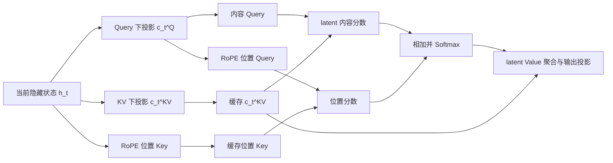

# MLA ：KV 压缩、矩阵吸收和 RoPE 解耦

> 参考出处：[小红书笔记《MLA ：KV 压缩、矩阵吸收和 RoPE 解耦》](https://www.xiaohongshu.com/explore/69d91c1a00000000220001ea?xsec_token=ABaTIUi8_exjo21KlQ_RqABA_qRC3FhLSl0EyBaVQ64yw=&xsec_source=pc_user)
>
> 技术核对：[DeepSeek-V2 原论文](https://arxiv.org/abs/2405.04434)、[DeepSeek-V2 官方仓库](https://github.com/deepseek-ai/DeepSeek-V2)

> [!note]
> MLA（Multi-Head Latent Attention）是 DeepSeek-V2 提出的注意力变体。它不再为历史 token 缓存每个 Attention head 的完整 Key 和 Value，而是缓存联合压缩后的低维 latent，并在计算时通过上投影恢复或通过矩阵吸收直接在 latent 空间完成等价计算。为了避免 RoPE 阻断矩阵吸收，MLA 又把每个 head 拆成内容分支和位置分支：内容分支保留低秩压缩与矩阵吸收，较小的位置分支单独应用 RoPE。

## MLA 要解决什么问题

自回归生成第 $`t`$ 个 token 时，当前 Query 需要与前 $`t`$ 个 token 的 Key、Value 做 Attention。历史 K/V 会被保存在 KV Cache 中，避免每一步都从头计算。

标准 MHA 的每个 head 都有独立 K/V。序列越长、层数越多，KV Cache 占用的显存和读取带宽越大；在逐 token 解码阶段，搬运这些缓存往往比矩阵计算更容易成为瓶颈。

MQA、GQA 和 MLA 都会压缩 KV Cache，但路线不同：

| 方案 | 压缩策略 | 每个 token、每层的缓存维度（示意） | 核心取舍 |
| --- | --- | --- | --- |
| MHA | 不压缩 | $`2n_h d_h`$ | 每头独立 K/V，表达能力强，缓存最大 |
| MQA | 所有 Query head 共用一组 K/V | $`2d_h`$ | 缓存小，但共享程度最高 |
| GQA | 每组 Query head 共用一组 K/V | $`2n_g d_h`$ | 在 MHA 与 MQA 之间折中 |
| MLA | 将 K/V 联合压缩成低维 latent | $`d_c+d_R`$ | 保留多头上投影，计算路径更复杂 |

其中，$`n_h`$ 是 Query head 数，$`n_g`$ 是 GQA 的 KV head 数，$`d_h`$ 是 head 维度，$`d_c`$ 是 KV latent 维度，$`d_R`$ 是解耦 RoPE 的位置维度。

> **关键区别：**MQA/GQA 主要减少 K/V 的“份数”；MLA 主要降低每个 token 需要缓存的“表示维度”。

## 核心机制：低维 latent 压缩

### 标准 Attention

对第 $`t`$ 个 token 的隐藏状态 $`h_t\in\mathbb{R}^d`$，标准 Attention 通过线性投影得到：

```math
q_t=W_Qh_t,
\qquad
k_t=W_Kh_t,
\qquad
v_t=W_Vh_t
```

推理时需要为所有历史 token 保存 $`k_t`$ 和 $`v_t`$。

### 联合压缩 K/V

MLA 先用下投影把隐藏状态压缩为低维 KV latent：

```math
c_t^{KV}=W_{DKV}h_t
```

其中 $`d_c\ll n_h d_h`$。概念上，每个 head 的内容 Key 和 Value 可以通过各自的上投影得到：

```math
k_{t,i}^{C}=W_{UK,i}c_t^{KV}
```

```math
v_{t,i}^{C}=W_{UV,i}c_t^{KV}
```

把上下投影合起来看，相当于给原始 K/V 投影加了一个低秩瓶颈：

```math
k_{t,i}^{C}=W_{UK,i}W_{DKV}h_t
```

```math
v_{t,i}^{C}=W_{UV,i}W_{DKV}h_t
```

这里的“恢复”不是原始 K/V 的精确逆变换，而是可学习的上投影。只要恢复出的表示足以完成 Attention，模型就不需要重建未经压缩的原始向量。

### Query 也经过低秩通道

Query 可以采用相似的低秩参数化：

```math
c_t^Q=W_{DQ}h_t
```

```math
q_{t,i}^{C}=W_{UQ,i}c_t^Q
```

Query 只服务于当前计算，不需要跨时间缓存。因此，压缩 Q 的主要作用不是节省 KV Cache，而是形成统一的低秩参数化结构，并配合后续的矩阵吸收与 RoPE 解耦。

## 矩阵吸收：不显式恢复完整 K/V

如果每次解码都先把 latent 上投影为所有 head 的完整 K/V，虽然缓存变小了，却增加了恢复和读写中间张量的成本。MLA 利用矩阵乘法结合律，把固定的上投影预先合并到别的投影中。

### Key 侧吸收

第 $`i`$ 个 head 的内容分数为：

```math
\left(q_{t,i}^{C}\right)^T k_{j,i}^{C}
=
\left(c_t^Q\right)^T
W_{UQ,i}^T W_{UK,i}
c_j^{KV}
```

预先定义与位置无关的矩阵：

```math
M_i=W_{UQ,i}^T W_{UK,i}
```

推理时便可直接在两个 latent 之间计算：

```math
\left(q_{t,i}^{C}\right)^T k_{j,i}^{C}
=
\left(c_t^Q\right)^T M_i c_j^{KV}
```

因此，内容 Key 不必作为高维中间结果写回显存。

### Value 侧吸收

Attention 输出原本会先对恢复出的 Value 做加权求和，再通过输出投影 $`W_O`$。由于 $`v_{j,i}^{C}=W_{UV,i}c_j^{KV}`$，固定的 $`W_{UV,i}`$ 也可以和对应的输出投影块合并。这样，Value 路径同样可以围绕 latent 完成等价计算，而不必长期保存或显式物化完整 Value。

> [!important]
> “缓存 latent”回答的是**存什么**；“矩阵吸收”回答的是**怎样直接用它计算**。只有前者会减少容量，二者配合才会同时降低 KV Cache 和高维中间张量的读写压力。

## 为什么普通 RoPE 会破坏矩阵吸收

矩阵吸收成立的前提是，$`W_{UQ,i}^T`$ 与 $`W_{UK,i}`$ 都是与 token 位置无关的固定矩阵，可以提前相乘。

如果直接对恢复后的完整 Query 和 Key 应用 RoPE，位置 $`t`$、$`j`$ 的旋转会进入二者之间：

```math
\left(q_{t,i}^{C}\right)^T R_t^T R_j k_{j,i}^{C}
```

代入上下投影后，$`R_t^T R_j`$ 会夹在 Query 与 Key 的上投影之间。旋转矩阵随相对位置变化，无法再预先吸收到一个固定的 $`M_i`$ 中。也就是说，RoPE 与上投影发生了位置相关耦合，内容路径的矩阵吸收被阻断。

## Decoupled RoPE：把内容和位置分成两条支路

MLA 不试图消除 RoPE，而是把会破坏矩阵吸收的位置耦合隔离到一个较小的专用子空间。

第 $`i`$ 个 head 的 Query 和 Key 分别拼接为：

```math
q_{t,i}=\left[q_{t,i}^{C};q_{t,i}^{R}\right]
```

```math
k_{j,i}=\left[k_{j,i}^{C};k_j^{R}\right]
```

其中：

- 内容分支 $`q^C,k^C`$ 不使用 RoPE，继续承担语义匹配和矩阵吸收；
- 位置分支 $`q^R,k^R`$ 使用 RoPE，保留相对位置信息；
- 位置 Key $`k_j^R`$ 可在不同 head 之间共享，因此其缓存维度较小。

位置分支可写为：

```math
q_{t,i}^{R}=\mathrm{RoPE}\left(W_{QR,i}c_t^Q,t\right)
```

```math
k_j^{R}=\mathrm{RoPE}\left(W_{KR}h_j,j\right)
```

由于内容与位置是拼接在不同子空间中的，点积自然分解为两项：

```math
q_{t,i}^T k_{j,i}
=
\left(q_{t,i}^{C}\right)^T k_{j,i}^{C}
+
\left(q_{t,i}^{R}\right)^T k_j^{R}
```

不会出现内容—位置交叉项。于是：

- 内容项仍可通过 $`\left(c_t^Q\right)^TM_ic_j^{KV}`$ 在 latent 空间计算；
- 位置项独立使用 RoPE，并保持对相对位置 $`t-j`$ 的敏感性；
- 最终 Attention score 仍同时包含内容信息和位置信息。

> **一句话总结：**RoPE 解耦不是让“内容与位置无关”，而是把位置相关旋转从主内容恢复链路中结构性隔离出来，使内容分支继续支持矩阵吸收。

## 实际 KV Cache 缓存什么

只说“MLA 缓存 $`c_j^{KV}`$”并不完整。使用解耦 RoPE 时，每个历史 token、每层通常需要缓存：

1. 联合压缩后的 KV latent $`c_j^{KV}`$；
2. 较小的共享位置 Key $`k_j^R`$。

因此缓存维度可概括为：

```math
d_{\mathrm{cache}}^{MLA}=d_c+d_R
```

若数据类型每个元素占 $`b`$ 字节，层数为 $`L`$、序列长度为 $`T`$、batch size 为 $`B`$，则仅从元素数量估算：

```math
\mathrm{KVCache}_{MLA}
\approx
B L T \left(d_c+d_R\right)b
```

这解释了 MLA 为何特别适合长上下文和大 batch 解码：缓存随序列长度仍然线性增长，但每个 token 的增长系数显著减小。

## 推理数据流



在概念推导中，可以把 MLA 理解为“先恢复 K/V 再做 Attention”；在优化后的推理实现中，更准确的理解是“利用吸收后的矩阵直接计算，尽量不显式物化完整 K/V”。两条路径在代数上等价，但硬件访存和中间张量规模不同。

## 优点与代价

| 维度 | 优点 | 代价或限制 |
| --- | --- | --- |
| KV Cache | 每个 token 只保存 KV latent 与小型位置 Key | 缓存不会消失，仍随 batch、层数和长度线性增长 |
| 显存带宽 | 解码时读取的数据量显著下降 | 需要额外投影和更复杂的算子调度 |
| 表达能力 | 相比简单共享 K/V，仍保留每头独立的上投影结构 | 低秩瓶颈和内容/位置加法分解会带来结构约束 |
| RoPE | 位置分支保留相对位置信息 | 需要维护解耦分支和额外的位置缓存 |
| 工程实现 | 适合长上下文、高并发推理 | 内核融合、矩阵布局和推理框架支持比 GQA 更复杂 |

### MLA 不等于必然按压缩率加速

KV Cache 变小通常会减轻显存容量和带宽压力，但速度收益还取决于：

- 当前阶段是 prefill 还是逐 token decode；
- batch size、上下文长度和硬件的算存比；
- 上下投影是否真正被吸收或融合；
- 推理框架是否有针对 MLA 的高效 kernel；
- 量化、并行策略和缓存布局是否与 MLA 配套。

因此，“缓存缩小 10 倍”不能直接推导出“端到端速度提升 10 倍”。

## 相关概念

- [位置编码--从绝对位置到RoPE](../../大模型基础/结构/位置编码--从绝对位置到RoPE.md)
- MHA、MQA 与 GQA
- KV Cache
- 低秩分解与矩阵乘法结合律
- 显存带宽与算术强度
- Prefill 与 Decode
- FlashAttention 与 PagedAttention

> [!warning]
> - MLA 的主要缓存收益来自 KV 联合压缩；Query 压缩本身不会减少历史 KV Cache。
> - “恢复 K/V”是便于理解的概念路径，优化实现可以通过矩阵吸收避免显式恢复高维 K/V。
> - 解耦 RoPE 不是取消内容与位置的联系，而是将二者放进不同子空间，最后在 Attention score 中相加。
> - 实际缓存不只有 KV latent，还包括解耦后的位置 Key；做容量估算时不能漏掉 $`d_R`$。
> - MLA、MQA、GQA 是不同压缩路线，不能仅按 KV Cache 大小判断模型质量或真实吞吐。
