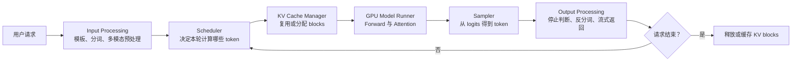
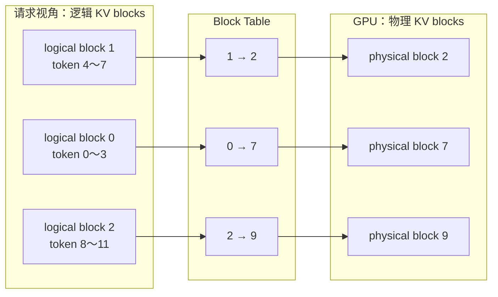
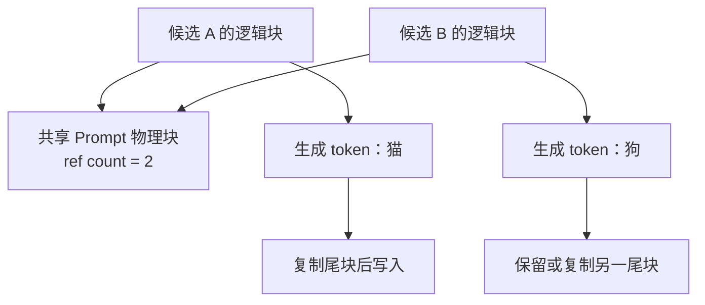
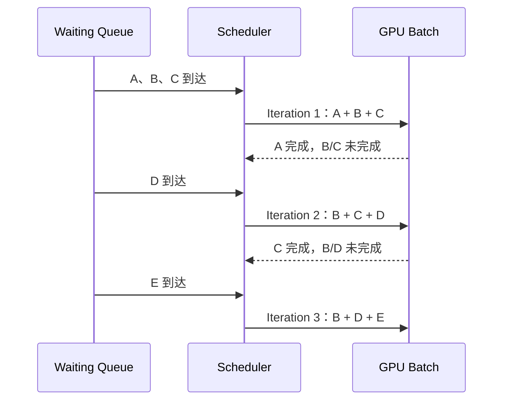
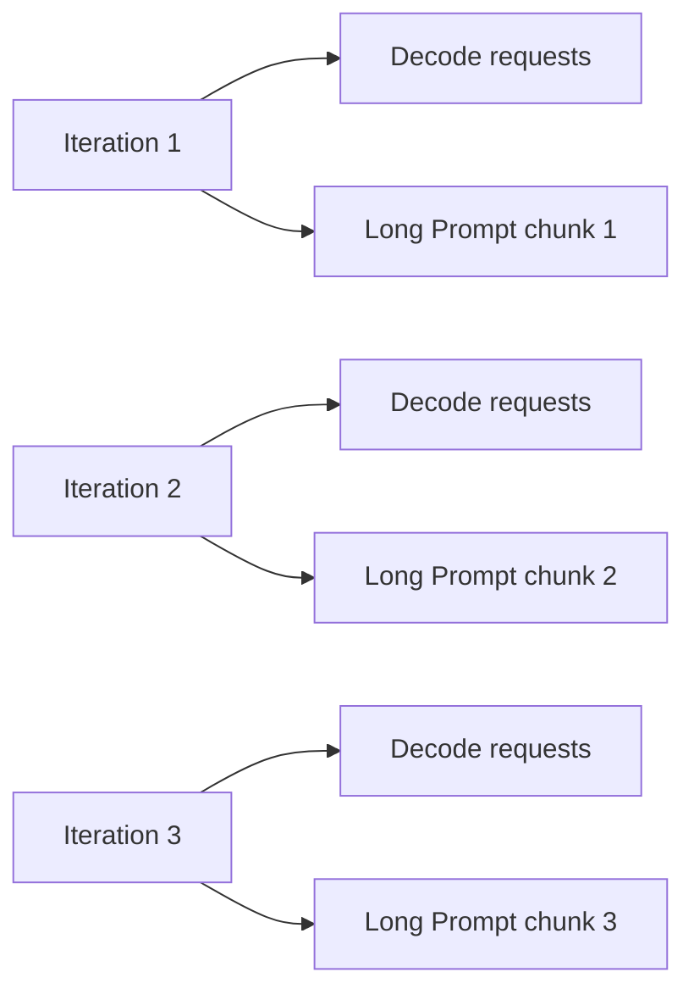
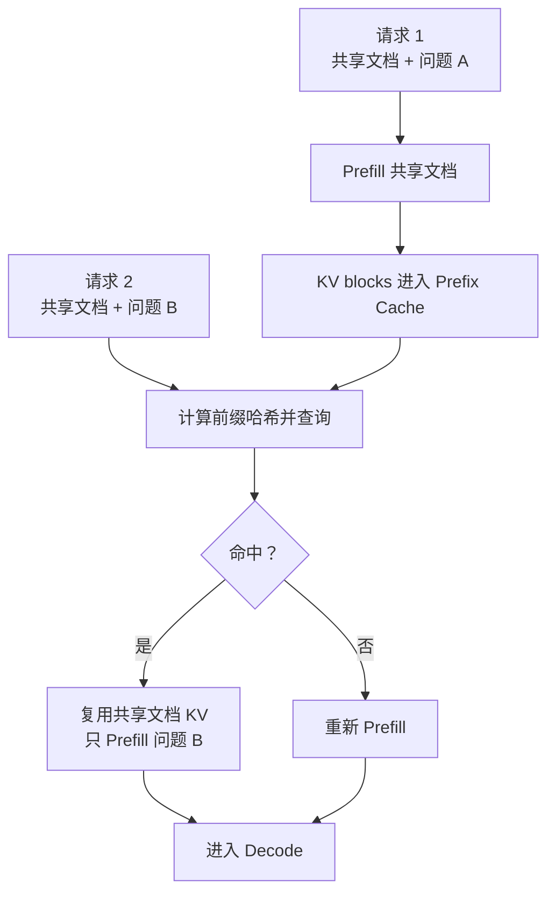
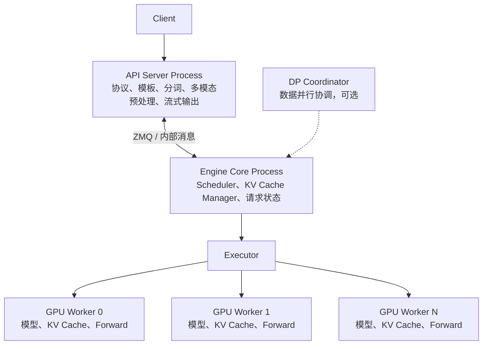
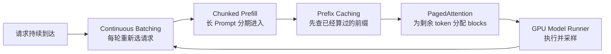

# 01-vLLM原理概念

> 主要参考：
>
> - [猛猿：图解大模型计算加速系列之：vLLM 核心技术 PagedAttention 原理](https://zhuanlan.zhihu.com/p/691038809)
> - [VLLM 学习笔记](https://github.com/jiaran-king/Re-Zero---Starting-LLM-/blob/main/02-%E6%A6%82%E5%BF%B5%E7%AC%94%E8%AE%B0/vllm/VLLM%E5%AD%A6%E4%B9%A0%E7%AC%94%E8%AE%B0.md)
> - [vLLM V1 官方说明](https://docs.vllm.ai/en/latest/getting_started/v1_user_guide.html)
> - [vLLM V1 Architecture Overview](https://docs.vllm.ai/en/latest/design/arch_overview.html)
>
> 本文重新组织和改绘了知识结构，不复刻来源文章的文字和图片。所有流程图均为根据原理重新绘制的示意图。

> [!note]
> vLLM 不是一种新的模型结构，而是一个面向大模型推理和在线服务的运行时。它通过 **PagedAttention、Continuous Batching、Chunked Prefill、Prefix Caching、优化 Kernel 和分布式执行**，在有限显存上同时服务更多请求，并改善吞吐、首 token 延迟和逐 token 延迟。

> [!warning]
> 早期文章通常基于 vLLM V0，常见对象包括 `SequenceGroup`、`BlockSpaceManagerV1` 和 `CachedBlockAllocator`。现代 vLLM 默认使用重新设计的 V1 Engine，核心对象变为 `Request`、`EngineCore`、`SchedulerOutput`、`KVCacheManager`、`BlockPool` 和 `GPUModelRunner`。两代实现的类名和调用链不同，但 PagedAttention、动态调度与按需管理 KV Cache 的基本思想仍然成立。

## 0. 先用一条主线理解 vLLM

如果只记一句话，可以记成：

```text
vLLM = 请求调度 + KV Cache 管理 + 高效模型执行 + 服务接口
```

一次请求的主链路是：



这条链路中，vLLM 主要解决四类问题：

| 问题 | 直接原因 | vLLM 的主要办法 |
| --- | --- | --- |
| KV Cache 浪费显存 | 输出长度未知，却提前预留连续大空间 | PagedAttention 按 block 动态分配 |
| 固定 Batch 等待严重 | 不同请求生成长度不同 | Continuous Batching 每轮重组 Batch |
| 长 Prompt 阻塞 Decode | Prefill 一次占用大量 token budget | Chunked Prefill 拆分长 Prefill |
| 相同前缀被重复计算 | System Prompt、RAG 文档反复出现 | Prefix Caching 复用已计算 KV blocks |

理解 vLLM 时，不要把这些技术混为一谈：

- PagedAttention 主要解决 **KV Cache 怎么存、怎么找**。
- Continuous Batching 主要解决 **多个请求怎么动态进入和离开 Batch**。
- Chunked Prefill 主要解决 **长 Prompt 如何分期计算**。
- Prefix Caching 主要解决 **已经算过的相同前缀如何复用**。
- Model Runner 和优化 Kernel 主要解决 **选中的工作如何在 GPU 上高效执行**。

---

## 1. 问题起点：大模型推理为什么难

### 1.1 Prefill：一次读入 Prompt

给定一个 Prompt：

```text
“请根据下面这份长文档总结 vLLM 的原理……”
```

模型首先一次性处理全部 Prompt token，计算各层隐藏状态，并把每一层 Attention 的 K/V 写入 KV Cache。这个阶段称为 Prefill。

Prefill 的特点是：

- 一次处理的 token 多；
- 矩阵乘法规模大，并行度较高；
- 通常更偏计算密集；
- 直接影响 TTFT（Time To First Token，首 token 延迟）。

### 1.2 Decode：逐 token 生成

Prefill 结束后，模型进入自回归 Decode：

```text
第 1 步：生成“vLLM”
第 2 步：生成“是”
第 3 步：生成“一种”
……
```

每一步通常只为每个请求生成一个新 token，并把新 token 对应的 K/V 追加到 KV Cache。

Decode 的特点是：

- 每个请求每一步的 token 数很少；
- 每一步都要读取历史 KV Cache；
- GPU 需要反复执行小批次 Forward；
- 通常更依赖显存带宽和调度效率；
- 直接影响 ITL（Inter-Token Latency）和 TPOT（Time Per Output Token）。

### 1.3 为什么需要 KV Cache

#### 问题

生成第 $`t`$ 个 token 时，如果没有缓存，模型就要重新计算前面 $`1`$ 到 $`t-1`$ 个 token 在所有层的 K/V。历史越长，重复计算越严重。

#### 解决办法

将已经算出的历史 K/V 保存在显存中。下一步只为新 token 计算新的 Q/K/V：

```math
Q_t=x_tW_Q,\qquad K_t=x_tW_K,\qquad V_t=x_tW_V
```

然后让当前 Query 读取缓存中的历史 K/V：

```math
\mathrm{Attn}\left(Q_t,[K_1,\ldots,K_t],[V_1,\ldots,V_t]\right)
```

#### 简单例子

假设 Prompt 有 1000 个 token，模型准备生成第 10 个输出 token：

- 没有 KV Cache：再次计算 Prompt 和前 9 个输出 token 的历史 K/V；
- 使用 KV Cache：只计算最新 token 的 Q/K/V，再读取已有历史 K/V。

> [!important]
> KV Cache 避免的是“重复计算历史 K/V”，并没有消除当前 Query 对全部历史 K/V 的 Attention。上下文越长，Decode 仍需读取越多缓存。

### 1.4 KV Cache 为什么又成了新瓶颈

KV Cache 大小可以粗略写成：

```math
M_{KV}
=
2\times L\times B\times T\times H_{KV}\times D\times S
```

其中：

| 符号 | 含义 |
| --- | --- |
| $`2`$ | K 和 V 两份缓存 |
| $`L`$ | Transformer 层数 |
| $`B`$ | 活跃序列数量 |
| $`T`$ | 每条序列的上下文长度 |
| $`H_{KV}`$ | KV Head 数量 |
| $`D`$ | 每个 Head 的维度 |
| $`S`$ | 每个元素的字节数 |

请求越多、上下文越长，KV Cache 越大。在线服务还有一个麻烦：在请求结束前，系统不知道它最终会生成多少 token。

这就引出了 PagedAttention。

---

## 2. PagedAttention：让 KV Cache 像分页内存一样按需增长

### 2.1 传统连续分配的问题

#### 问题

一种简单做法是：请求进入时，按照最大序列长度为它预留一整块连续 KV Cache。

例如：

```text
max sequence length = 2048 tokens
request A 实际使用 = 300 tokens
request B 实际使用 = 1800 tokens
request C 实际使用 = 500 tokens
```

如果每个请求都预留 2048 个位置，那么 A 和 C 会留下大量永远用不到的槽位。

连续分配会产生三类浪费：

| 浪费 | 含义 |
| --- | --- |
| 预留浪费 | 为未来可能生成的 token 提前保留空间 |
| 内部碎片 | 已分配区域内部存在没有使用的槽位 |
| 外部碎片 | 空闲显存总量足够，但没有足够大的连续区域 |

#### 简单例子

显存还有 12 个空槽，但它们被分散成 `4 + 3 + 5` 三段。新请求需要一段连续的 8 个槽位：

- 总空闲空间：12，理论上足够；
- 最大连续空间：5，实际上无法分配。

问题不在于“显存真的没有了”，而在于分配单位太大、连续性要求太强。

### 2.2 解决办法：固定大小的 Block

PagedAttention 借鉴虚拟内存分页思想：

1. 把 KV Cache 显存切成固定大小的物理块；
2. 每条请求从逻辑上仍然看到连续 token；
3. 逻辑块可以映射到任意空闲物理块；
4. 需要更多空间时再增加物理块；
5. 请求结束后归还物理块。



逻辑上连续，不代表物理上连续。

### 2.3 Block Table 解决了什么

Block Table 记录：

```text
某个请求的第 i 个逻辑块
    → GPU KV Cache 中的哪个物理块
```

Attention Kernel 读取历史 K/V 时：

```text
token 逻辑位置
    → 逻辑块编号 + 块内偏移
    → Block Table
    → 物理块编号 + 块内偏移
    → 实际 K/V 地址
```

#### 简单例子

假设 block size 为 4，要读取逻辑 token 位置 6：

```text
逻辑块编号 = 6 // 4 = 1
块内偏移   = 6 % 4  = 2
block_table[1] = physical block 2
```

所以应读取物理块 2 内偏移 2 的 K/V。

### 2.4 按需追加 Block

#### 问题

请求的输出长度无法提前知道。如果一开始分配全部可能空间，会造成浪费。

#### 解决办法

只在当前逻辑块即将装满时申请新物理块。

#### 简单例子

block size 为 4，Prompt 有 6 个 token：

```text
logical block 0：4 个 token，已满
logical block 1：2 个 token，还有 2 个空位
```

接下来生成两个 token时，继续写 block 1；再生成一个 token 时，才申请 block 2。

### 2.5 共享与 Copy-on-Write

Parallel Sampling 或 Beam Search 中，多条候选序列往往共享相同 Prompt。

#### 问题

如果为每条候选完整复制 Prompt 的 KV Cache，重复显存开销很大。

#### 解决办法

多条逻辑序列先引用同一组物理块，并维护引用计数。当候选序列开始写入不同内容时，再复制它即将修改的块，这就是 Copy-on-Write。



> [!important]
> PagedAttention 的收益不只是减少碎片。它把 KV Cache 变成可分配、可共享、可回收的 Block，为 Continuous Batching 和 Prefix Caching 提供了可管理的内存基础。

---

## 3. Continuous Batching：每一轮都重新组织工作集合

### 3.1 Static Batching 的问题

#### 问题

传统 Static Batching 会收集固定的一批请求，等整批全部完成后，才接收下一批。

假设：

```text
请求 A：生成 20 tokens
请求 B：生成 200 tokens
请求 C：生成 80 tokens
```

A 很早完成，但如果 Batch 固定，它占据的位置可能要一直等到 B 完成才能被新请求使用。

```text
时间 →
A：████ 完成后空闲……………………
B：████████████████████████████████
C：████████████ 完成后空闲…………
```

这会带来：

- GPU 利用率下降；
- 短请求被长请求拖住；
- 尾延迟上升；
- 总吞吐下降。

### 3.2 解决办法：Iteration-Level Scheduling

Continuous Batching 的核心是：**每个 Engine Iteration 都重新决定本轮工作集合。**



#### 简单例子

假设 GPU 每轮最多容纳 3 个活跃请求：

| Iteration | 本轮请求 | 本轮结束后的变化 |
| --- | --- | --- |
| 1 | A、B、C | A 完成 |
| 2 | B、C、D | C 完成，D 是新加入的 |
| 3 | B、D、E | E 是新加入的 |

Batch 不再是“从开始到结束不变的一组请求”，而是“本轮 GPU 要执行的一组工作”。

### 3.3 Scheduler 要同时看多份预算

Continuous Batching 不是简单把队列拼起来。Scheduler 至少要检查：

| 预算 | 解决的问题 |
| --- | --- |
| Token Budget | 本轮 Forward 最多处理多少 token |
| Sequence Budget | 本轮最多包含多少活跃请求 |
| KV Cache Budget | 是否有足够物理块保存新增 token |
| Encoder Budget | 多模态模型本轮能处理多少 Encoder 输入 |

常见配置包括：

- `max_num_batched_tokens`：一个 Iteration 的 token 总预算；
- `max_num_seqs`：一个 Iteration 的请求数量上限；
- `gpu_memory_utilization`：可供模型和 KV Cache 使用的显存比例相关配置。

### 3.4 PagedAttention 与 Continuous Batching 的关系

这两者经常一起出现，但职责不同：

```text
Continuous Batching：决定谁在本轮运行
PagedAttention：为这些请求提供和回收 KV blocks
```

如果没有灵活的 KV Cache 管理，新请求即使被 Scheduler 选中，也可能找不到合适的连续显存；如果没有 Continuous Batching，PagedAttention 节省出的显存也无法充分转化为动态请求吞吐。

---

## 4. Chunked Prefill：不让一个长 Prompt 独占整轮计算

### 4.1 长 Prefill 为什么会阻塞 Decode

#### 问题

假设系统中已有 20 个请求正在 Decode，此时来了一个 16000-token 的长 Prompt。如果完整 Prefill 一次性进入某轮 Forward，它可能占据大量计算时间，让正在流式输出的请求长时间收不到下一个 token。

用户会感受到：

- 长 Prompt 自己的 TTFT 很高；
- 其他请求的 ITL 突然恶化；
- 在线聊天出现明显卡顿。

### 4.2 解决办法：把 Prefill 拆成多个 Chunk

```text
16000-token Prompt
    → chunk 1：4096 tokens
    → chunk 2：4096 tokens
    → chunk 3：4096 tokens
    → chunk 4：3712 tokens
```

每轮只处理其中一部分，并把剩余 token budget 留给 Decode 请求。



### 4.3 简单例子

本轮 token budget 为 8192：

```text
20 个 Decode 请求：20 tokens
剩余预算：8172 tokens
```

Scheduler 可以先安排 Decode，再从长 Prompt 中安排不超过剩余预算的 Prefill token。下轮继续处理未完成的 Prompt。

### 4.4 它解决了什么，又牺牲了什么

| 配置倾向 | 好处 | 代价 |
| --- | --- | --- |
| 较小的 Prefill Chunk | Decode 更容易及时运行，ITL 更好 | 长 Prompt 需要更多轮，TTFT 可能变差 |
| 较大的 Prefill Chunk | 长 Prompt 更快完成 Prefill，TTFT 可能更好 | Decode 更容易被大计算拖慢 |

> [!important]
> Chunked Prefill 是调度优化，不是把 Prefill 的总计算量凭空消除。它主要改变计算在时间上的排列方式。

---

## 5. Prefix Caching：相同前缀只计算一次

### 5.1 哪些场景会重复前缀

常见例子：

```text
System Prompt + 用户问题 A
System Prompt + 用户问题 B

长 RAG 文档 + 问题 A
长 RAG 文档 + 问题 B

同一个 Prompt + 生成 8 条候选回答
```

### 5.2 问题

如果每个请求都重新 Prefill 相同的长前缀，会重复：

- 计算相同前缀的隐藏状态和 K/V；
- 写入相同的 KV Cache；
- 消耗 TTFT 和 GPU 计算资源。

### 5.3 解决办法：按前缀内容查询缓存块

现代 vLLM 的 Automatic Prefix Caching 可以概括为：

1. 将 Prompt token 按缓存匹配粒度计算链式哈希；
2. 在 Block Pool 的缓存索引中查询；
3. 命中的前缀视为已经完成计算；
4. 只为未命中的后缀分配 KV blocks 并执行 Prefill；
5. 新完成的可缓存部分再登记到缓存索引；
6. 空间紧张时驱逐较久未使用的缓存块。



### 5.4 简单例子

```text
共享 System Prompt：2000 tokens
用户问题 A：30 tokens
用户问题 B：40 tokens
```

第一次请求需要 Prefill 2030 个 token。若第二次请求完整命中 2000-token 前缀，它只需要 Prefill问题 B 的 40 个 token，而不是再次计算 2040 个 token。

### 5.5 引用计数、空闲队列与缓存有效性

一个缓存块可能处于以下状态：

| 状态 | 含义 |
| --- | --- |
| `ref count > 0` | 正在被一个或多个请求使用 |
| `ref count = 0` 且仍在缓存索引中 | 当前没人使用，但内容仍可命中 |
| 被驱逐 | 内容不再有效，可以改作其他 KV block |

所以“空闲”不等于“内容立刻清空”。缓存块可以先进入空闲队列，等真正需要空间时再被驱逐和复用。

### 5.6 最新实现中的匹配粒度

经典心智模型通常把“完整物理块”当作 Prefix Cache 的匹配单位。现代实现还允许通过 `prefix_match_unit` 将哈希匹配粒度设置得比物理块更细，从而在物理块内部的合法边界命中前缀。

因此，更准确的说法是：

> Prefix Cache 的哈希匹配边界与物理 KV Block 大小通常相关，但在新实现中不必永远完全相同。

### 5.7 Prefix Caching 的边界

Prefix Caching 不是所有场景都有收益：

- 前缀短或几乎不重复时，命中收益小；
- 缓存空间太小、频繁驱逐时，命中率低；
- 模型权重、LoRA、Prompt Adapter 或多模态输入不一致时，不能盲目复用；
- 它主要减少重复 Prefill，不会直接消除后续 Decode 成本。

---

## 6. Preemption：KV Cache 不够时如何避免系统僵住

### 6.1 问题

Continuous Batching 会尽量让更多请求活跃，但所有请求的 KV Cache 都会随输出增长。某一时刻可能出现：

```text
所有可用 KV blocks 已分配
但当前请求都还没有结束
```

如果什么都不做，系统无法为下一批 token 分配空间。

### 6.2 解决办法

Scheduler 可以：

- 暂缓接纳 waiting 请求；
- 抢占部分 running 请求；
- 释放被抢占请求的 KV blocks；
- 等资源恢复后重新计算其上下文；
- 某些架构或配置也可以把 KV Cache Offload 到其他存储层。

### 6.3 简单例子

A 比 B 更早到达，显存只够一个请求继续增长：

```text
A：已生成 500 tokens，即将继续
B：已生成 100 tokens，后到达
```

Scheduler 可以优先保障 A，抢占 B 并释放 B 的块。A 完成后，B 再重新 Prefill 或从可恢复状态继续。

> [!warning]
> Swap、Recompute、Offload 的具体支持和默认策略会随 vLLM 版本及硬件后端变化。理解概念时应抓住不变量：抢占是在延迟、公平性、重复计算和有限 KV Cache 之间做取舍。

---

## 7. 现代 vLLM V1：统一的 Token-Level Scheduler

### 7.1 为什么不能只说“Prefill 队列”和“Decode 队列”

经典讲法会说：“这一轮做 Prefill，下一轮做 Decode。”但现代 Scheduler 还要同时支持：

- Chunked Prefill；
- Prefix Cache 命中；
- Speculative Decoding；
- 多模态 Encoder 输入；
- Structured Output；
- KV Cache Connector。

如果每增加一种功能就增加一种特殊阶段，控制流会越来越复杂。

### 7.2 解决办法：跟踪 token 计算进度

对每个请求，可以关注：

```text
num_computed_tokens：已经完成模型计算的 token 数
num_tokens_with_spec：当前应追赶到的 token 数，包含可能的 draft tokens
```

本轮待计算 token 可以抽象为：

```math
n_{new}=n_{target}-n_{computed}
```

Scheduler 再受到全局 token budget、KV Cache 空间、请求优先级等约束，决定实际调度多少 token。

最终输出可以理解成：

```text
request A → 本轮计算 1 token
request B → 本轮计算 1024 tokens
request C → 本轮验证 4 speculative tokens
```

### 7.3 一个混合 Batch 的例子

```text
请求 A：正在 Decode，本轮需要 1 token
请求 B：长 Prompt 尚未 Prefill 完，本轮安排 2048 tokens
请求 C：Prefix Cache 命中 4096 tokens，只计算 64-token suffix
请求 D：Speculative Decode，本轮验证 4 tokens
```

它们在业务语义上属于不同阶段，但 Scheduler 可以统一成“每个请求本轮处理多少 token”。

> [!important]
> Continuous Batching 是“每轮动态重组请求”；V1 Token-Level Scheduling 则进一步统一了“每个请求在本轮具体处理多少 token”。

---

## 8. V1 多进程架构：谁负责什么

现代 vLLM V1 将不同职责拆到多个进程：



| 模块 | 主要职责 | 是否主链路 |
| --- | --- | --- |
| API Server | HTTP/API、Chat Template、输入处理、流式返回 | 是 |
| Engine Core | 调度、KV Cache 逻辑管理、请求状态更新 | 是 |
| Executor | 把执行任务分发给一个或多个 Worker | 是 |
| GPU Worker | 加载模型、管理 GPU 内存、执行 Forward | 是 |
| GPU Model Runner | 准备批次、Attention Metadata、采样 | 是 |
| DP Coordinator | 多个数据并行 Engine Core 的协调 | 按配置启用 |

### 8.1 Engine Core 的核心循环

当前核心循环可以抽象成：

```python
def step():
    scheduler_output = scheduler.schedule()
    model_output = model_executor.execute_model(scheduler_output)
    engine_outputs = scheduler.update_from_output(
        scheduler_output,
        model_output,
    )
    return engine_outputs
```

这三步分别回答：

1. **Schedule**：谁运行、运行多少 token、用哪些 KV blocks？
2. **Execute**：GPU 如何完成 Forward、Attention 和 Sampling？
3. **Update**：新 token 是什么、请求是否完成、状态如何更新？

### 8.2 V0 与 V1 不要混淆

| 经典 V0 文章中的概念 | 现代 V1 中更接近的概念 |
| --- | --- |
| `SequenceGroup` / `Sequence` | `Request` |
| `BlockSpaceManagerV1` | `KVCacheManager` |
| `CachedBlockAllocator` | `BlockPool` 与缓存索引 |
| `SchedulerOutputs` | `SchedulerOutput` |
| 单体式 `LLMEngine.step()` 心智模型 | Frontend/Client + 独立 `EngineCore.step()` |
| Prefill/Decode 分支式调度 | 统一 Token-Level Scheduling |

> [!warning]
> 旧代码里的 `BlockSpaceManagerV1` 不是“vLLM V1 Engine”。前者只是旧引擎中的第一版 Block Manager，后者是 2025 年开始默认化的新核心架构。

---

## 9. GPU 执行层：Block Table 最终怎么被用起来

Scheduler 只负责决定“做什么”，真正计算发生在 Worker/Model Runner。

```text
SchedulerOutput
    → 更新 GPU 侧请求状态
    → 形成 InputBatch
    → 准备 input ids / positions
    → 准备 block tables / slot mappings
    → 构建 Attention Metadata
    → model.forward()
    → compute_logits()
    → Sampler
    → ModelRunnerOutput
```

### 9.1 Block Table 与 Slot Mapping

两者容易混淆：

| 数据 | 作用 |
| --- | --- |
| Block Table | 历史逻辑块映射到哪些物理 KV blocks，主要用于读取历史 K/V |
| Slot Mapping | 当前新 token 的 K/V 应写入哪个物理槽位 |

#### 简单例子

请求已有 6 个 token，block size 为 4：

```text
历史读取：
  logical block 0 → physical block 7
  logical block 1 → physical block 2

新 token 写入：
  token 6 应写到 physical block 2 的 offset 2
```

Attention Backend 根据这些元数据完成不连续 KV Cache 的读写。

### 9.2 Sampler

模型 Forward 得到 logits 后，Sampler 根据配置生成 token：

- Greedy；
- Temperature；
- Top-k / Top-p；
- Min-p；
- Presence/Frequency/Repetition Penalty；
- Logprobs；
- Structured Output 约束；
- Speculative Decoding 的接受与拒绝。

所以 vLLM 不只是一个 Attention Kernel。完整性能来自控制面与计算面的配合：

```text
控制面：Scheduler + KV Cache Manager
计算面：Model Runner + Attention Backend + Sampler
```

---

## 10. 四项核心机制如何配合

| 机制 | 面对的问题 | 解决办法 | 主要收益 |
| --- | --- | --- | --- |
| PagedAttention | KV Cache 连续预留和碎片 | Block 化、逻辑到物理映射 | 显存利用率、并发容量 |
| Continuous Batching | 固定 Batch 等待最慢请求 | 每轮移除完成请求、接纳新请求 | 吞吐、GPU 利用率 |
| Chunked Prefill | 长 Prompt 阻塞 Decode | 长 Prefill 分块并与 Decode 混排 | ITL、公平性 |
| Prefix Caching | 相同前缀反复 Prefill | 哈希查找并复用已计算 KV | TTFT、Prefill 计算量 |

可以用一条组合链路理解：



---

## 11. 一个请求从进入到完成的完整例子

假设系统已经在服务其他请求，此时用户提交：

```text
共享 System Prompt：1000 tokens
RAG 文档：6000 tokens
用户问题：50 tokens
期望输出：最多 200 tokens
```

### 步骤 1：API Server 处理输入

- 应用 Chat Template；
- Tokenize 文本；
- 生成内部请求；
- 将请求交给 Engine Core。

### 步骤 2：查询 Prefix Cache

假设共享 System Prompt 的 1000 tokens 已缓存：

```text
总输入：7050 tokens
缓存命中：1000 tokens
实际还需 Prefill：6050 tokens
```

### 步骤 3：Scheduler 做 Chunked Prefill

假设每轮留给该请求的 Prefill 预算约 2048 tokens：

```text
Iteration 1：Prefill 2048
Iteration 2：Prefill 2048
Iteration 3：Prefill 1954
```

每轮仍可以穿插已有请求的 Decode。

### 步骤 4：PagedAttention 分配 KV blocks

每个 Chunk 执行前：

- 查询现有 Block Table；
- 为新增 token 申请足够物理块；
- 将物理块 ID 交给 Model Runner；
- Forward 时把新 K/V 写入对应槽位。

### 步骤 5：进入 Decode

每轮通常为该请求生成一个 token：

```text
读取历史 KV → Forward → Logits → Sampler → 新 token
```

新 token 的 K/V 继续追加到最后一个块；块满后再申请新块。

### 步骤 6：Continuous Batching 持续重组

在该请求生成 200 个 token 的过程中：

- 其他请求可能完成并离开；
- 新请求可能加入；
- Scheduler 每轮重新形成 Batch；
- 如果 KV Cache 紧张，该请求也可能被抢占。

### 步骤 7：完成与释放

遇到 EOS、Stop 条件或达到长度限制后：

- 返回最终 Finish Reason；
- 释放不再使用的 KV blocks；
- 符合条件的前缀块可以继续留在 Prefix Cache；
- API Server 完成流式响应。

---

## 12. 性能指标：优化目标不只有吞吐

| 指标 | 含义 | 主要受什么影响 |
| --- | --- | --- |
| TTFT | 请求到首 token 的时间 | 排队、输入处理、Prefill、Prefix Cache |
| ITL | 相邻输出 token 的间隔 | Decode 调度、Batch 大小、长 Prefill 干扰 |
| TPOT | 平均每个输出 token 的时间 | Decode Forward、显存带宽、通信 |
| E2E Latency | 请求从进入到结束的总时间 | 排队、Prefill、Decode 长度、抢占 |
| Input Throughput | 每秒处理的输入 token | Prefill Kernel、Chunked Prefill 策略 |
| Output Throughput | 每秒生成的输出 token | Decode Batch、Attention、Sampler |
| Goodput | 满足延迟 SLO 的有效吞吐 | 尾延迟、排队、公平性、资源配置 |

### 12.1 为什么不能只看 Tokens/s

#### 问题

把 Batch 做得非常大，可能提高总吞吐，但单个用户要等更久才能收到 token。

#### 简单例子

配置 A：

```text
吞吐：10000 tokens/s
P99 ITL：500 ms
```

配置 B：

```text
吞吐：8500 tokens/s
P99 ITL：80 ms
```

聊天服务可能更喜欢 B；离线批量生成可能更喜欢 A。

### 12.2 常见参数的取舍

| 参数 | 增大后可能的收益 | 增大后可能的代价 |
| --- | --- | --- |
| `max_num_batched_tokens` | 更大的计算批次和吞吐，长 Prefill 更快 | ITL 可能恶化，Activation/编译形状压力增大 |
| `max_num_seqs` | 同时服务更多请求 | KV Cache、调度和输出处理压力增加 |
| `gpu_memory_utilization` | KV Cache 容量可能增加 | 给其他 CUDA 内存和运行时保留空间减少 |
| `max_model_len` | 支持更长上下文 | Profiling、准入和最坏资源需求更高；不代表每请求立即静态分配全部 KV |
| `tensor_parallel_size` | 模型可跨卡放置，单步算力增加 | All-Reduce 等通信开销增加 |

> [!important]
> PagedAttention 是按需分配 KV blocks。`max_model_len` 很大不等于每个请求一进入就占满该长度的 KV Cache，但它会影响可支持长度、Profiling、请求准入和最坏容量估算。

---

## 13. vLLM 没有解决什么

### 13.1 PagedAttention 不会减少模型权重

模型参数放不下时，仍需：

- 权重量化；
- Tensor/Pipeline Parallel；
- CPU/NVMe Offload；
- 更小模型或蒸馏模型。

### 13.2 KV Cache 不会让 Attention 变成常数成本

Decode 的当前 Query 仍需访问历史 K/V。上下文越长，读取量通常越大。

### 13.3 Continuous Batching 不保证每个请求延迟最低

它提高总体资源利用率，但在高负载下仍需处理：

- 排队；
- 请求公平性；
- 优先级；
- 长短请求干扰；
- 抢占和尾延迟。

### 13.4 Prefix Caching 不等于语义缓存

Prefix Cache 复用的是模型内部 KV 状态，要求输入前缀在缓存键意义下匹配；它不会因为“两段文字意思相近”就自动命中。

### 13.5 vLLM 不是训练框架

它主要负责 Inference/Serving。在 RLHF、PPO、GRPO 等系统中，vLLM 常作为 Rollout Engine；Backward 和 Optimizer Step 仍由训练后端完成。

---

## 14. 常见误区

### 误区 1：PagedAttention 是一种新的 Attention 公式

不是。它主要改变 KV Cache 的内存组织和访问方式，核心 Attention 数学并未因此变成另一套算法。

### 误区 2：Continuous Batching 就是普通 Dynamic Batching

普通 Dynamic Batching 常指在请求入口收集一小段时间后组成 Batch；Continuous Batching 更强调在生成的每个 Iteration 重新接纳、移除和调度请求。

### 误区 3：Chunked Prefill 减少了 Prefill 总 FLOPs

没有。它主要将总工作拆到多个时间片，改善调度公平性和 Decode ITL。

### 误区 4：Prefix Cache 命中会让 Decode 也不再计算

Prefix Cache 主要跳过重复前缀的 Prefill。后续新 token 仍需正常 Decode。

### 误区 5：显存占用高就是内存泄漏

vLLM 通常会在初始化时根据可用显存建立 KV Cache Pool，因此启动后显存占用高可能是预期行为。判断泄漏要结合 KV Cache 使用率、请求结束后的块状态和持续增长趋势。

### 误区 6：旧文章中的 `BlockSpaceManagerV1` 就是现代 V1

不是。两者只是名称相似，所属架构不同。

---

## 15. 推荐阅读顺序

### 第一轮：只建立心智模型

1. Prefill、Decode、KV Cache；
2. PagedAttention；
3. Continuous Batching；
4. Chunked Prefill；
5. Prefix Caching；
6. V1 多进程架构。

### 第二轮：追一条现代源码主链路

```text
LLM / AsyncLLM
    → EngineCoreClient
    → EngineCore.step()
    → Scheduler.schedule()
    → KVCacheManager.allocate_slots()
    → Executor.execute_model()
    → GPUModelRunner
    → Sampler
    → Scheduler.update_from_output()
```

优先源码锚点：

- [`vllm/v1/engine/core.py`](https://github.com/vllm-project/vllm/blob/main/vllm/v1/engine/core.py)
- [`vllm/v1/core/sched/scheduler.py`](https://github.com/vllm-project/vllm/blob/main/vllm/v1/core/sched/scheduler.py)
- [`vllm/v1/core/kv_cache_manager.py`](https://github.com/vllm-project/vllm/blob/main/vllm/v1/core/kv_cache_manager.py)
- [`vllm/v1/core/block_pool.py`](https://github.com/vllm-project/vllm/blob/main/vllm/v1/core/block_pool.py)
- [`vllm/v1/worker/gpu/model_runner.py`](https://github.com/vllm-project/vllm/blob/main/vllm/v1/worker/gpu/model_runner.py)
- [`vllm/v1/worker/gpu/sample/sampler.py`](https://github.com/vllm-project/vllm/blob/main/vllm/v1/worker/gpu/sample/sampler.py)

### 第三轮：学习高级特性

- Speculative Decoding；
- Quantization 与 KV Cache Quantization；
- LoRA / Multi-LoRA；
- Multimodal Encoder Cache；
- Disaggregated Prefill/Decode 与 KV Connector；
- TP、PP、DP、EP 与多节点部署；
- CUDA Graph、`torch.compile` 与 Attention Backend。

---

## 16. 总结

vLLM 的核心不是某一个孤立技巧，而是一套互相配合的推理运行时设计：

```text
KV Cache
    解决历史 K/V 的重复计算

PagedAttention
    把 KV Cache 变成可按需分配、共享和回收的 blocks

Continuous Batching
    每轮动态移除完成请求并接纳新请求

Chunked Prefill
    把长 Prompt 拆开，避免长期阻塞 Decode

Prefix Caching
    复用相同前缀已经计算好的 KV 状态

V1 Token-Level Scheduler
    用统一 token 进度模型组合以上机制

GPU Model Runner 与优化 Kernel
    把调度结果真正转化为高效 GPU 执行
```

最终，vLLM 要解决的是：

> 在请求长度不同、到达时间不同、输出长度未知、KV Cache 不断增长的条件下，如何让有限 GPU 显存始终承载尽可能多的有效推理工作，同时在吞吐、TTFT、ITL 和公平性之间取得平衡。

## 参考资料

- [vLLM: Easy, Fast, and Cheap LLM Serving with PagedAttention](https://arxiv.org/abs/2309.06180)
- [猛猿：vLLM 核心技术 PagedAttention 原理](https://zhuanlan.zhihu.com/p/691038809)
- [VLLM 学习笔记](https://github.com/jiaran-king/Re-Zero---Starting-LLM-/blob/main/02-%E6%A6%82%E5%BF%B5%E7%AC%94%E8%AE%B0/vllm/VLLM%E5%AD%A6%E4%B9%A0%E7%AC%94%E8%AE%B0.md)
- [vLLM V1 User Guide](https://docs.vllm.ai/en/latest/getting_started/v1_user_guide.html)
- [vLLM Architecture Overview](https://docs.vllm.ai/en/latest/design/arch_overview.html)
- [vLLM Optimization and Tuning](https://docs.vllm.ai/en/latest/configuration/optimization/)
- [vLLM Automatic Prefix Caching](https://docs.vllm.ai/en/latest/design/prefix_caching/)
- [vLLM Scheduler API](https://docs.vllm.ai/en/latest/api/vllm/v1/core/sched/scheduler/)
- [vLLM KVCacheManager API](https://docs.vllm.ai/en/latest/api/vllm/v1/core/kv_cache_manager/)
- [vLLM BlockPool API](https://docs.vllm.ai/en/latest/api/vllm/v1/core/block_pool/)
