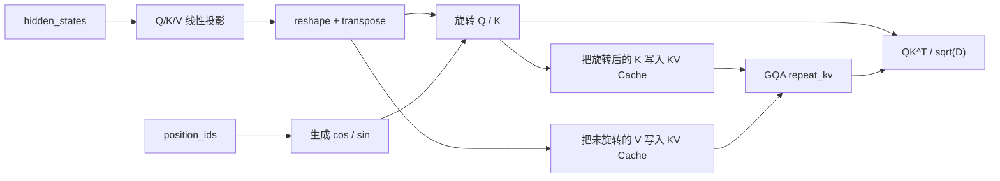

# RoPE的工程实现原理

> 主要参考：
> - [RoFormer：RoPE 原论文](https://arxiv.org/abs/2104.09864)
> - [Hugging Face Transformers：Llama 实现](https://github.com/huggingface/transformers/blob/65d834fb48624221339830499602fa9428df0583/src/transformers/models/llama/modeling_llama.py)
> - [Hugging Face Transformers：RoPE utilities](https://github.com/huggingface/transformers/blob/65d834fb48624221339830499602fa9428df0583/src/transformers/modeling_rope_utils.py)
>
> Hugging Face 源码核对版本：commit `65d834fb48624221339830499602fa9428df0583`，核对日期 2026-07-22。

> [!note]
> RoPE 在工程上不是构造一个完整旋转矩阵再与 Q/K 相乘，而是先根据位置生成 cos/sin，再用逐元素乘法和一次维度重排完成等价旋转。标准 Llama 路径是：投影并整理 Q/K 的多头形状，旋转当前 Q/K，把已经旋转的 K 写入 KV Cache，最后计算 Attention。Value 不做 RoPE。

## RoPE 在 Attention 的什么位置

一层标准 Llama Attention 的逻辑顺序可以概括为：



RoPE 位于 **Q/K 投影之后、QK 点积之前**。对于带 KV Cache 的推理，Key 应先按自己的绝对位置旋转，再写入缓存。

## 真实张量形状

设：

- batch size 为 $`B`$；
- 当前输入 token 数为 $`T`$；
- Query head 数为 $`H_q`$；
- KV head 数为 $`H_{kv}`$；
- 每个 head 的维度为 $`D`$。

典型张量形状如下：

| 张量 | 形状 | 含义 |
| --- | --- | --- |
| `hidden_states` | `[B, T, d_model]` | Attention 层输入 |
| `query_states` | `[B, H_q, T, D]` | 多头 Query |
| `key_states` | `[B, H_kv, T, D]` | 多头或分组 Key |
| `value_states` | `[B, H_kv, T, D]` | Value，不应用 RoPE |
| `position_ids` | `[B, T]` | 当前 token 的位置编号 |
| `inv_freq` | `[D / 2]` | 每个二维子空间的逆频率 |
| `cos`、`sin` | `[B, T, D]` | 每个位置、每个通道的旋转系数 |

cos/sin 不包含 head 维。实际使用时将它们扩展为 `[B, 1, T, D]`，依靠广播同时作用于所有 Query head 和 KV head。

## 第一步：生成逆频率

默认 RoPE 为每个二维子空间设置一个角频率：

```math
\omega_i=\theta^{-2i/D}
```

其中 $`i=0,1,\ldots,D/2-1`$，Llama 中常把基数 $`\theta`$ 记作 `rope_theta`。

对应的 PyTorch 实现为：

```python
import torch


def build_inv_freq(
    head_dim: int,
    base: float = 10000.0,
    device: torch.device | None = None,
) -> torch.Tensor:
    if head_dim % 2 != 0:
        raise ValueError("head_dim must be even")

    channel_ids = torch.arange(
        0,
        head_dim,
        2,
        dtype=torch.float32,
        device=device,
    )
    return 1.0 / (base ** (channel_ids / head_dim))
```

若 $`D=128`$，则 `inv_freq` 只有 64 个元素。它通常注册成模型 buffer，而不是训练参数，也不是 KV Cache。

## 第二步：由位置生成 cos/sin

位置 $`p`$ 在第 $`i`$ 个二维子空间中的旋转角为：

```math
\phi_i(p)=p\omega_i
```

工程中可以用广播乘法生成所有位置与频率的组合：

```python
def build_rope_cache(
    position_ids: torch.Tensor,  # [B, T]
    inv_freq: torch.Tensor,     # [D / 2]
    output_dtype: torch.dtype,
) -> tuple[torch.Tensor, torch.Tensor]:
    # freqs: [B, T, D / 2]
    freqs = (
        position_ids.to(torch.float32).unsqueeze(-1)
        * inv_freq.to(torch.float32).view(1, 1, -1)
    )

    # Hugging Face Llama 的 split-half 布局需要复制两次频率。
    # angles: [B, T, D]
    angles = torch.cat((freqs, freqs), dim=-1)

    cos = angles.cos().to(output_dtype)
    sin = angles.sin().to(output_dtype)
    return cos, sin
```

当前 Hugging Face Llama 实现的逻辑相同，但它使用 batch matrix multiplication 形成频率，并在关闭 autocast 的上下文中以 float32 计算相位和三角函数，最后再转回输入 dtype。

> [!important]
> 这里经常被统称为“RoPE cache”，但要区分三件东西：`inv_freq` 是模型 buffer；cos/sin 可以预计算或按当前 `position_ids` 动态生成；KV Cache 保存的是旋转后的历史 Key 和未旋转的 Value。三者不是同一个缓存。

## 第三步：rotate_half

Hugging Face Llama 使用 split-half 布局。它把最后一维分成前后两半：

```math
x=[x_1;x_2]
```

然后构造：

```math
\mathrm{rotate\_half}(x)=[-x_2;x_1]
```

代码只有三行：

```python
def rotate_half(x: torch.Tensor) -> torch.Tensor:
    x1 = x[..., : x.shape[-1] // 2]
    x2 = x[..., x.shape[-1] // 2 :]
    return torch.cat((-x2, x1), dim=-1)
```

最终旋转写成：

```math
x'=x\cos\phi+\mathrm{rotate\_half}(x)\sin\phi
```

展开两个配对分量，就是二维旋转：

```math
x'_1=x_1\cos\phi-x_2\sin\phi
```

```math
x'_2=x_2\cos\phi+x_1\sin\phi
```

### split-half 与 interleaved-pair

RoPE 常见两种维度布局：

| 布局 | 配对方式 | 旋转示意 |
| --- | --- | --- |
| split-half | 第 $`i`$ 维与第 $`i+D/2`$ 维配对 | `[x1, x2] → [-x2, x1]` |
| interleaved-pair | 相邻的第 $`2i`$、$`2i+1`$ 维配对 | `[..., a, b, ...] → [..., -b, a, ...]` |

两者在数学上只差一个固定的维度排列，但不能在已有 checkpoint 上随意互换。Q/K 投影权重在训练时已经适应了具体布局；只换 `rotate_half` 而不同时变换权重，会改变模型行为。

## 第四步：把旋转应用到 Q/K

```python
def apply_rotary_pos_emb(
    q: torch.Tensor,    # [B, H_q,  T, D]
    k: torch.Tensor,    # [B, H_kv, T, D]
    cos: torch.Tensor,  # [B, T, D]
    sin: torch.Tensor,  # [B, T, D]
) -> tuple[torch.Tensor, torch.Tensor]:
    # 在 head 轴插入长度为 1 的维度：
    # [B, T, D] -> [B, 1, T, D]
    cos = cos.unsqueeze(1)
    sin = sin.unsqueeze(1)

    q_embed = q * cos + rotate_half(q) * sin
    k_embed = k * cos + rotate_half(k) * sin
    return q_embed, k_embed
```

这里 Q 和 K 的 head 数可以不同。cos/sin 的 head 轴为 1，所以它既能广播到 $`H_q`$，也能广播到 $`H_{kv}`$。

完整的最小调用如下：

```python
B, T = 2, 16
H_q, H_kv, D = 32, 8, 128

q = torch.randn(B, H_q, T, D)
k = torch.randn(B, H_kv, T, D)

position_ids = torch.arange(T, device=q.device).unsqueeze(0).expand(B, -1)
inv_freq = build_inv_freq(D, device=q.device)
cos, sin = build_rope_cache(position_ids, inv_freq, q.dtype)
q_rot, k_rot = apply_rotary_pos_emb(q, k, cos, sin)

assert q_rot.shape == q.shape
assert k_rot.shape == k.shape
```

## Hugging Face Llama 的真实调用链

截至所核对的 Transformers 提交，Llama 的实现可以分成模型级和 Attention 层级两部分。

### 模型级：生成位置编号和 cos/sin

当调用方没有显式传入 `position_ids` 时，当前实现使用已有 Cache 长度作为偏移：

```python
past_seen_tokens = (
    past_key_values.get_seq_length()
    if past_key_values is not None
    else 0
)
position_ids = (
    torch.arange(inputs_embeds.shape[1], device=inputs_embeds.device)
    + past_seen_tokens
)
position_ids = position_ids.unsqueeze(0)
```

然后模型只生成一次位置系数，并把同一组 `position_embeddings=(cos, sin)` 传给各层：

```python
position_embeddings = self.rotary_emb(
    hidden_states,
    position_ids=position_ids,
)
```

### Attention 层：先旋转，再更新 Cache

当前 Llama Attention 的关键顺序是：

```python
query_states = self.q_proj(hidden_states).view(...).transpose(1, 2)
key_states = self.k_proj(hidden_states).view(...).transpose(1, 2)
value_states = self.v_proj(hidden_states).view(...).transpose(1, 2)

cos, sin = position_embeddings
query_states, key_states = apply_rotary_pos_emb(
    query_states,
    key_states,
    cos,
    sin,
)

if past_key_values is not None:
    key_states, value_states = past_key_values.update(
        key_states,
        value_states,
        self.layer_idx,
    )
```

这段顺序说明：

1. 当前 Query 和 Key 先使用自己的 `position_ids` 旋转；
2. Cache 写入的是已经旋转的 Key；
3. Value 没有经过 RoPE；
4. 后续 decode 直接复用历史 Key，不再重复旋转。

### GQA 的 repeat_kv 在哪里

当前 eager Attention backend 在真正计算分数前执行：

```python
key_states = repeat_kv(key_states, module.num_key_value_groups)
value_states = repeat_kv(value_states, module.num_key_value_groups)
attn_weights = torch.matmul(
    query,
    key_states.transpose(2, 3),
) * scaling
```

因此标准逻辑是：

```text
旋转 H_kv 个 Key head
→ 缓存 H_kv 个 Key head
→ Attention 计算前扩展到 H_q 个 head
```

如果先 `repeat_kv` 再写入 Cache，就会重复保存相同 K/V，抵消 GQA 的缓存收益。

## Prefill 与逐 token Decode

### Prefill

假设 prompt 长度为 5，第一次前向的 `position_ids` 通常是：

```text
[0, 1, 2, 3, 4]
```

模型一次生成五个位置的 cos/sin，旋转五个 Query 和 Key，并把五个旋转后的 Key 写入 KV Cache。

### Decode

生成第一个新 token 时，Cache 已有 5 个位置，因此新 token 使用：

```text
[5]
```

它只需要：

1. 生成位置 5 的 cos/sin；
2. 旋转当前 Query 和当前 Key；
3. 把位置 5 的 Key 追加到 Cache；
4. 用当前 Query 与缓存中的位置 0～5 Key 做点积。

下一步位置变成 6，以此类推。

> [!warning]
> Decode 时不能因为当前输入只有一个 token，就把它的位置重新写成 0。RoPE 使用的是序列中的位置语义，不是当前小张量内部的下标。

### position_ids 与 cache_position

二者概念上分别回答：

- `position_ids`：这个 token 应该使用哪个 RoPE 相位？
- `cache_position`：这个 token 应写入 Cache 的哪个槽位？

在连续、无特殊映射的解码中，两者通常数值一致，但职责不同。旧版 Transformers 和 Static Cache 路径经常显式传递 `cache_position`；本笔记核对的当前 Llama `main` 调用链已不再显式传入它，而是由 `DynamicCache.update` 管理追加位置。工程代码应以所使用的 Transformers 版本为准。

## 为什么点积只体现相对位置

若位置 $`p`$ 的 Query 和位置 $`s`$ 的 Key 分别旋转为 $`R(p)q`$ 与 $`R(s)k`$，则：

```math
\left(R(p)q\right)^T R(s)k
=
q^T R(s-p)k
```

所以同时把两个绝对位置平移相同距离，不会改变二者点积：

```math
\left(R(p+a)q\right)^T R(s+a)k
=
\left(R(p)q\right)^T R(s)k
```

工程实现虽然只有逐元素乘法和维度拼接，最终仍满足同一个旋转恒等式。

## Partial RoPE 与 MLA

### Partial RoPE

有些模型只对 head 维度中的一部分应用 RoPE：

```python
q_rope, q_pass = q[..., :rotary_dim], q[..., rotary_dim:]
k_rope, k_pass = k[..., :rotary_dim], k[..., rotary_dim:]

q_rope, k_rope = apply_rotary_pos_emb(q_rope, k_rope, cos, sin)

q = torch.cat((q_rope, q_pass), dim=-1)
k = torch.cat((k_rope, k_pass), dim=-1)
```

此时 `inv_freq` 和 cos/sin 的最后一维应对应 `rotary_dim`，而不是完整 `head_dim`。

### MLA 的解耦 RoPE

MLA 不是把完整内容 Key 送入标准 RoPE。它把内容分支和位置分支拆开：

```text
内容 Q/K：不使用 RoPE，保留 latent 计算与矩阵吸收
位置 Q/K：在较小的专用维度中使用 RoPE
```

因此，标准 Llama 的 `apply_rotary_pos_emb(q, k, cos, sin)` 不能不加区分地套到 MLA 的完整 Q/K 上。MLA 只旋转解耦出来的位置子空间。

## 四个最小验证

下面的断言可以用于检查自己的 RoPE 实现。

### 1. 形状不变

```python
assert q_rot.shape == q.shape
assert k_rot.shape == k.shape
```

### 2. 旋转前后范数不变

```python
torch.testing.assert_close(
    q_rot.norm(dim=-1),
    q.norm(dim=-1),
)
```

如果这个断言失败，通常是 cos/sin 的复制方式与 `rotate_half` 的配对布局不一致。

### 3. 相同相对距离得到相同点积

```python
def rotate_at(x: torch.Tensor, position: int) -> torch.Tensor:
    ids = torch.tensor([[position]], device=x.device)
    cos, sin = build_rope_cache(ids, inv_freq, x.dtype)
    cos = cos.unsqueeze(1)
    sin = sin.unsqueeze(1)
    return x * cos + rotate_half(x) * sin

q_vector = torch.randn(1, 1, 1, D)
k_vector = torch.randn(1, 1, 1, D)

q_at_2 = rotate_at(q_vector, position=2)
k_at_5 = rotate_at(k_vector, position=5)
q_at_9 = rotate_at(q_vector, position=9)
k_at_12 = rotate_at(k_vector, position=12)

torch.testing.assert_close(
    (q_at_2 * k_at_5).sum(),
    (q_at_9 * k_at_12).sum(),
)
```

两组位置的相对距离都是 3。

### 4. Prefill 与增量 Decode 一致

对同一组 Q/K：

1. 一次性用位置 `0..T-1` 旋转，得到 `k_full`；
2. 每次只旋转一个位置并依次追加，得到 `k_decode`；
3. 检查二者以及最后一个 Query 的分数是否一致。

```python
torch.testing.assert_close(k_decode, k_full)
torch.testing.assert_close(
    q_decode[:, :, -1:] @ k_decode.transpose(-1, -2),
    q_full[:, :, -1:] @ k_full.transpose(-1, -2),
)
```

这个测试能直接发现 Decode 位置从 0 重启、历史 Key 被重复旋转等问题。

## 常见工程错误

| 错误 | 表现 | 原因 |
| --- | --- | --- |
| split-half 与相邻配对混用 | shape 正常，但模型质量明显异常 | 旋转布局与 checkpoint 不一致 |
| cos/sin 在错误轴 `unsqueeze` | 广播报错或位置系数作用到错误维度 | Q/K 内存布局判断错误 |
| Decode 的位置从 0 重启 | 短 prompt 似乎可用，长生成迅速退化 | 把局部张量下标当成绝对位置 |
| 对 Cache 中历史 Key 再旋转 | 每生成一步历史分数都改变 | 缓存的 Key 已经带有原位置旋转 |
| 用低精度直接计算超长位置相位 | 长上下文出现数值误差 | 大位置乘高低频后相位精度不足 |
| 先 `repeat_kv` 再缓存 | KV Cache 被无意义放大 | GQA 的共享 Key/Value 被重复存储 |
| Partial RoPE 维度不一致 | 拼接失败或频率错位 | cos/sin 按完整 head_dim 生成 |

## 需要记住的工程结论

1. RoPE 旋转 Q 和 K，不旋转 Value。
2. 完整旋转矩阵不会真的被构造；实际使用 cos/sin、逐元素乘法和 `rotate_half`。
3. cos/sin 在 head 轴广播，所以 GQA 的 Q head 数与 KV head 数可以不同。
4. 标准增量推理缓存已经旋转的 Key，新 token 只旋转一次。
5. GQA 通常先缓存少量 KV heads，再在 Attention backend 中 `repeat_kv`。
6. `position_ids`、cos/sin 生成和 Cache 写入方式会随框架版本变化，但相位必须匹配 token 的真实位置。
7. MLA 的 RoPE 只作用于独立位置分支，不能照搬标准 Llama 的全 Key 旋转路径。

## 相关概念

- [位置编码--从绝对位置到RoPE](位置编码--从绝对位置到RoPE.md)
- [MLA ：KV 压缩、矩阵吸收和 RoPE 解耦](../../大模型推理优化/MLA%20：KV%20压缩、矩阵吸收和%20RoPE%20解耦.md)
- Self-Attention
- KV Cache
- MHA、MQA 与 GQA
- Prefill 与 Decode

> [!warning]
> - 本文展示的是 Llama 风格的 split-half 实现。其他模型可能使用相邻维度配对、复数乘法、融合 kernel 或不同的 Partial RoPE 布局。
> - “数学等价”不表示可以直接替换已有模型的实现；维度排列、权重和 RoPE 配置必须作为一套约定保持一致。
> - Transformers 的接口会演进。阅读具体项目时，应以模型配置、锁定版本和实际 Cache 类为准。
