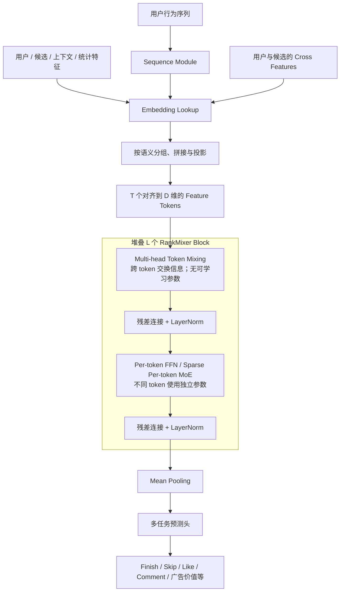
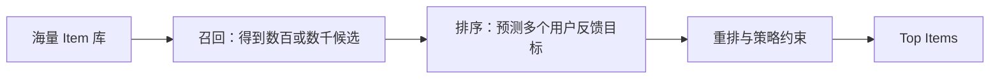
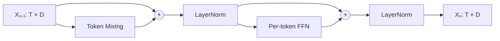
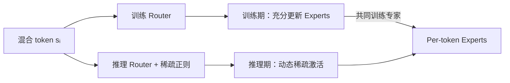
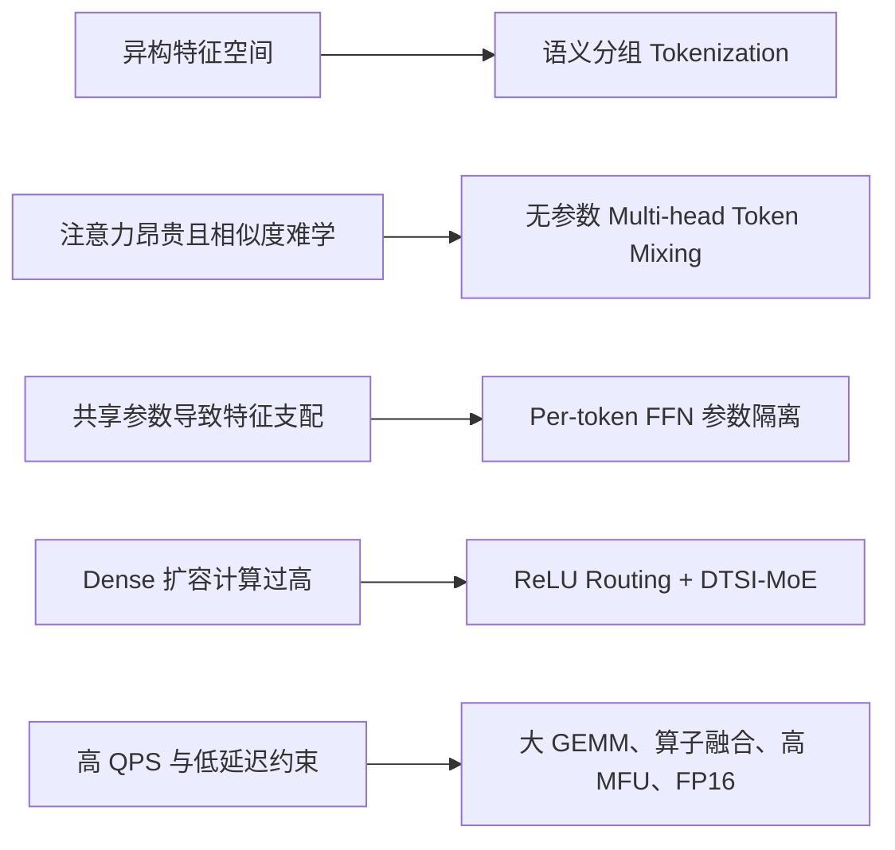

# RankMixer：面向工业推荐的可扩展排序模型

> **主要参考**
>
> - [RankMixer: Scaling Up Ranking Models in Industrial Recommenders（arXiv:2507.15551）](https://arxiv.org/abs/2507.15551)
> - [论文 HTML 版](https://arxiv.org/html/2507.15551) / [论文 PDF](https://arxiv.org/pdf/2507.15551)

> [!NOTE]
> **一句话概括：** RankMixer 把工业排序模型中异构、低 GPU 利用率的手工特征交互模块，替换成“无参数的 Multi-head Token Mixing + 每个 token 独立参数的 Per-token FFN”，以规则的大矩阵计算换取更高 MFU，并沿 token 数、宽度、深度和专家数四个方向稳定扩容。

> [!IMPORTANT]
> **定位边界：** RankMixer 解决的是推荐系统的 **ranking stage（排序阶段）**，并不通过自回归方式生成 item 序列，严格来说不是生成式推荐模型。把它放在“生成式推荐”目录，是因为它回答了推荐大模型的一项基础问题：怎样把异构推荐特征组织成统一 token 表示，并把排序 backbone 扩展到十亿级参数且满足线上时延约束。

---

## 0. 总揽：先看清 RankMixer 在做什么

### 0.1 一张图看完整数据流



### 0.2 核心矛盾与对应设计

| 工业排序中的矛盾 | 常见做法的代价 | RankMixer 的回答 |
| --- | --- | --- |
| 数百个异构特征需要充分交互 | 拼接多种手工交叉模块，算子碎片化 | 统一成 feature tokens，重复堆叠同一种 block |
| Transformer 易并行，但自注意力代价高 | 注意力需要学习异构 token 间的相似度，并构造注意力矩阵 | 用无参数的 reshape / permutation 完成 Token Mixing |
| 高频特征容易压制长尾特征 | 全部特征共享一个 MLP/FFN，参数相互干扰 | 每个 token 配置独立的 Per-token FFN |
| 增大参数往往同时增大 FLOPs 和延迟 | 无法在高 QPS、低延迟服务中落地 | 通过更低 FLOPs/Param、更高 MFU 和半精度推理解耦参数与成本 |
| Dense 模型继续扩大成本过高 | 所有参数对每个样本都激活 | 用 ReLU Routing + DTSI-MoE 稀疏激活专家 |

### 0.3 读完整篇论文只需抓住三句话

1. **交互方式统一化：** 先把异构特征整理成少量语义 token，再通过固定的 Multi-head Token Mixing 让不同 token 交换信息。
2. **容量分配隔离化：** token 混合之后，每个 token 进入自己的 FFN，既保留各特征子空间的专门建模能力，也能用规则的大矩阵扩大参数量。
3. **系统设计硬件化：** 架构指标不只看 AUC，还要共同优化 Params、FLOPs、MFU、吞吐和线上延迟。

---

## 1. 论文要解决什么问题

### 1.1 工业推荐排序面对的输入并不是“同一种 token”

工业推荐一般是级联系统：召回先从海量 item 中筛出候选，排序模型再对每个候选精细打分。RankMixer 关注后者。



对一个“用户—候选 item”样本，排序模型通常要同时消费：

| 特征类型 | 例子 | 主要作用 |
| --- | --- | --- |
| 用户特征 | 用户 ID、年龄、地域、活跃度 | 表达长期画像 |
| 候选特征 | 视频 ID、作者 ID、类目、内容向量 | 表达当前待打分对象 |
| 行为序列 | 点击、播放、点赞、关注序列 | 表达动态兴趣 |
| 上下文特征 | 时间、设备、入口、网络环境 | 表达当前场景 |
| 统计特征 | 历史 CTR、频次、热度 | 注入强先验和业务统计信号 |
| 交叉特征 | 用户与候选的组合、匹配特征 | 显式表达条件关系 |

这些特征的词表规模、频率、语义和 embedding 维度都不相同。语言模型中的词 token 至少共享同一词表和表示空间，而推荐 token 可能分别来自“用户 ID”“视频 ID”“统计值”“序列输出”等完全不同的空间。

### 1.2 CPU 时代遗留的特征交互模块难以 Scale

传统 DLRM 往往在 embedding 之上组合 MLP、FM、DCN、Attention 等多个特征交互模块。它们可能有效，但在现代 GPU 上存在三类系统问题：

- **算子碎片化：** 小矩阵、逐元素操作、索引和不同分支频繁切换，kernel launch 与内存访存占比高。
- **Memory-bound：** 计算量不一定大，但需要频繁搬运中间结果，GPU 的矩阵计算单元吃不满。
- **扩容 ROI 低：** 增加参数时，FLOPs、显存和延迟常同步上涨；线上排序又必须承受高 QPS 和严格延迟预算。

论文给出的旧线上基线 MFU 只有 **4.47%**。这意味着理论算力再强，如果架构不能形成足够大的、连续的矩阵乘法，真实吞吐仍然很低。

### 1.3 直接搬用 Transformer 也不理想

自注意力会先用 query-key 内积计算 token 间的相关性：

```math
A=\mathrm{softmax}\left(\frac{QK^{\mathsf T}}{\sqrt{d}}\right)
```

然后用 $`AV`$ 聚合信息。它在推荐排序中有两个问题：

1. **语义空间不统一。** 用户 ID token 与视频 ID token 的内积不天然等价于有意义的相似度，特别是二者可能来自亿级但不同的 ID 空间。
2. **额外的计算与访存。** 注意力要生成、保存并消费 $`T\times T`$ 权重矩阵，复杂度随 token 数二次增长；对于高 QPS 排序，这部分开销未必换来相应收益。

论文消融中，把 Multi-head Token Mixing 换成 Self-Attention，AUC 反而下降 **0.03%**，参数增加 **16%**，FLOPs 增加 **71.8%**。这说明在其数据和特征组织方式下，“学习 token 两两相似度”并不是最合算的交互机制。

### 1.4 全特征共享参数会引发子空间支配

如果所有特征先被混在一起，再经过同一套 FFN：

- 高频、样本充足的字段更容易主导梯度；
- 低频和长尾字段的信号可能被淹没；
- 一套共享参数要同时拟合互不相同的特征分布，形成容量竞争。

因此，论文不仅要解决“不同 token 怎样交互”，还要解决“交互以后怎样保留不同特征子空间的专门参数”。

### 1.5 最终问题定义

RankMixer 实际上在回答：

> 能否设计一种既适配推荐异构特征、又适配 GPU 的统一特征交互骨干，使模型质量随参数和计算继续提升，同时不突破工业排序的吞吐与延迟预算？

---

## 2. 核心思想一：语义分组的 Feature Tokenization

### 2.1 token 数太多或太少都不好

最直接的 tokenization 是“一个字段对应一个 token”，但工业系统通常有数百个字段。这样做会产生大量窄小计算，每个 token 可分配的宽度和计算很有限，GPU 利用率也不高。

另一个极端是把全部特征拼成一个 token。此时模型退化成普通 DNN：不同特征空间失去边界，高频特征更容易支配表示，也没有显式的 token 间交互过程。

RankMixer 选择中间路线：**使用领域知识把语义相近的字段分组，再把每组 embedding 拼接、切分并投影为固定维度 token。**

### 2.2 从变长 embedding 到规则张量

设拼接后的输入为 $`e_{\mathrm{input}}`$，每段原始宽度为 $`d`$，投影后的统一隐藏维度为 $`D`$，共得到 $`T`$ 个 token：

```math
x_i=\mathrm{Proj}\left(e_{\mathrm{input}}[d(i-1):di]\right),\quad i=1,\ldots,T
```

最终输入张量为：

```math
X_0=[x_1;x_2;\ldots;x_T]\in\mathbb{R}^{T\times D}
```

这一步有两重作用：

- **建模层面：** 一个 token 对应相对连贯的语义子空间，例如用户画像、候选内容或序列兴趣。
- **系统层面：** 后续 block 始终处理规则的 $`T\times D`$ 张量，可以批量执行大矩阵计算。

> [!TIP]
> Tokenization 不是纯粹的数据预处理细节。$`T`$ 决定了子空间粒度、Per-token FFN 的份数以及矩阵形状，是 RankMixer 的一个主要扩展轴。

---

## 3. 核心思想二：Multi-head Token Mixing

### 3.1 它不是注意力，而是无参数的重排

输入 $`X\in\mathbb{R}^{T\times D}`$。对第 $`t`$ 个 token $`x_t`$，沿隐藏维切成 $`H`$ 个 head：

```math
x_t=[x_t^{(1)}\|x_t^{(2)}\|\ldots\|x_t^{(H)}]
```

其中每个 $`x_t^{(h)}\in\mathbb{R}^{D/H}`$。随后不计算相似度，而是把所有输入 token 的第 $`h`$ 个 head 直接拼接成一个新 token：

```math
s^{(h)}=\mathrm{Concat}\left(x_1^{(h)},x_2^{(h)},\ldots,x_T^{(h)}\right)
```

论文设置 $`H=T`$，因此每个新 token 的维度为：

```math
\frac{TD}{H}=D
```

输出仍为 $`T\times D`$，可以与输入做残差连接。

### 3.2 用一个小例子理解“混合”

假设有 4 个 token，每个 token 有 8 维，并设置 4 个 head。每个 head 是 2 维：

```text
输入 token 1 = [1a | 1b | 1c | 1d]
输入 token 2 = [2a | 2b | 2c | 2d]
输入 token 3 = [3a | 3b | 3c | 3d]
输入 token 4 = [4a | 4b | 4c | 4d]

混合 token a = [1a | 2a | 3a | 4a]
混合 token b = [1b | 2b | 3b | 4b]
混合 token c = [1c | 2c | 3c | 4c]
混合 token d = [1d | 2d | 3d | 4d]
```

每个输出 token 都拿到了全部输入 token 的一个子空间，因此后续 FFN 可以直接建模跨特征关系。这个操作本质上是 **split → transpose/permute → concat/reshape**，没有注意力矩阵，也没有额外可学习参数。

### 3.3 为什么如此简单的操作仍然有效

Multi-head Token Mixing 本身只负责 **通信**，Per-token FFN 负责 **非线性变换**。二者交替堆叠后：

1. Mixing 把各语义 token 的局部切片放到一起；
2. PFFN 在新的组合上学习非线性交互；
3. 下一层再次重排，继续传播上一层形成的高阶表示。

因此它不是“没有学习特征交互”，而是把“路由/通信”固定化，把可学习容量集中到更适合 GPU 的 FFN 中。

### 3.4 与 Self-Attention 的对比

| 维度 | Self-Attention | Multi-head Token Mixing |
| --- | --- | --- |
| 跨 token 路由 | 由数据相关的注意力权重决定 | 固定重排，每个 head 收集所有 token 的对应切片 |
| 可学习参数 | Q/K/V/O 投影 | 0 |
| 主要中间量 | $`T\times T`$ 注意力矩阵 | view / transpose / concat 形成的规则张量 |
| token 假设 | token 间内积应具有相似度意义 | 不要求异构 token 位于同一语义空间 |
| 复杂度侧重 | token 两两关系，随 $`T`$ 二次增长 | 主要是内存重排，数据规模约为 $`TD`$ |
| RankMixer 论文结果 | 略低 AUC，FLOPs 更高 | 更高效且效果更好 |

> [!CAUTION]
> 固定 Mixing 的优势来自论文中的工业特征设置，并不意味着注意力在所有推荐任务上都无效。对于长行为序列，先用专门的 Sequence Module 建模时序依赖，仍可能需要 Attention；RankMixer 主要替换的是排序 dense interaction backbone 中的跨特征注意力。

---

## 4. 核心思想三：Per-token FFN

### 4.1 同形计算，不同参数

传统 Transformer 的 FFN 对所有 token 共享同一组参数。RankMixer 则给第 $`t`$ 个 token 配置独立的两层 FFN：

```math
v_t=f_{t,2}\left(\mathrm{GELU}\left(f_{t,1}(s_t)\right)\right)
```

```math
f_{t,i}(x)=xW_{t,i}+b_{t,i}
```

若扩张比例为 $`k`$：

```math
W_{t,1}\in\mathbb{R}^{D\times kD},\qquad W_{t,2}\in\mathbb{R}^{kD\times D}
```

不同 token 的矩阵形状相同，但参数互不共享。实现时可以把这些矩阵组织成批量大 GEMM，避免真的启动大量零碎 kernel。

### 4.2 为什么参数隔离适合推荐特征

Per-token FFN 同时完成两件事：

- **隔离：** 不同特征子空间拥有自己的参数，减少高频字段对低频字段的参数支配。
- **扩容：** token 数增加时，FFN 参数量近似线性增加；由于矩阵形状规则，新增参数仍能以较高效率计算。

Multi-head Token Mixing 已经让每个 $`s_t`$ 含有来自所有输入 token 的信息，所以“独立 FFN”并不意味着 token 彼此隔绝。恰恰相反：每个独立 FFN 都在处理一种不同的跨 token 切片组合。

### 4.3 它与 Transformer FFN、MMoE 的区别

| 架构 | 输入如何分配 | 参数如何分配 | 主要目的 |
| --- | --- | --- | --- |
| Transformer FFN | 不同 token 分别输入 | 所有 token 共享同一 FFN | 对每个 token 做同构变换 |
| MMoE | 多个 expert 看到同一份共享输入 | expert 参数不同，由 gate 组合 | 缓解多任务冲突 |
| RankMixer PFFN | 不同 token 看到不同的混合子空间 | 每个 token 有独立 FFN | 保留异构特征子空间的多样性 |

论文消融把 PFFN 改成 shared FFN 后，AUC 下降 **0.31%**，证明“参数按 token 隔离”不是单纯增加参数，而是架构中重要的归纳偏置。

---

## 5. 一个完整的 RankMixer Block

设第 $`n-1`$ 层输入为 $`X_{n-1}\in\mathbb{R}^{T\times D}`$。先 Mixing，再残差与 LayerNorm：

```math
S_{n-1}=\mathrm{LN}\left(\mathrm{TokenMixing}(X_{n-1})+X_{n-1}\right)
```

随后进入 PFFN，再做残差与 LayerNorm：

```math
X_n=\mathrm{LN}\left(\mathrm{PFFN}(S_{n-1})+S_{n-1}\right)
```

堆叠 $`L`$ 个 block 后，对 $`X_L`$ 做 mean pooling，并送入不同任务头。



从架构视角看，RankMixer 与 Transformer 都是“跨 token 通信模块 + token 内 FFN”的重复堆叠。区别是两处替换：

- Self-Attention → 参数为零的 Multi-head Token Mixing；
- Shared FFN → 参数隔离的 Per-token FFN。

论文消融结果进一步说明完整 block 中各组件的作用：

| RankMixer-100M 改动 | $`\Delta\mathrm{AUC}`$ | 解释 |
| --- | ---: | --- |
| 移除 Multi-head Token Mixing | -0.50% | 各 PFFN 无法获得全局跨 token 信息 |
| PFFN 改为 Shared FFN | -0.31% | 特征子空间失去独立参数 |
| 移除残差连接 | -0.07% | 深层优化与信息保真变差 |
| 移除 LayerNorm | -0.05% | 训练稳定性下降 |

---

## 6. 从 Dense RankMixer 扩展到 Sparse MoE

### 6.1 为什么 PFFN 很自然地可以 MoE 化

Dense RankMixer 中，每个 token 都有一个独立 FFN。进一步扩容时，可以把第 $`i`$ 个 token 的单个 FFN 替换成 $`N_e`$ 个互不共享的 expert，并只激活其中一部分：

```math
v_i=\sum_{j=1}^{N_e}G_{i,j}e_{i,j}(s_i)
```

这样，总参数量可以随 expert 数增长，而单样本计算量只随激活 expert 数增长。

### 6.2 Vanilla Top-k Routing 的两个问题

直接套用固定 Top-k MoE 在 RankMixer 中效果不好：

1. **所有 token 被分配相同的 expert 数。** 高信息 token 可能容量不足，低信息 token 又浪费计算预算。
2. **专家数量爆炸且训练不均衡。** 原本每个 token 就有独立参数，再为每个 token 增加多个 expert，部分 expert 可能长期得不到梯度，形成 dying experts。

### 6.3 ReLU Routing：让激活数量随 token 动态变化

论文不用固定 Top-k，而是对 router 输出应用 ReLU：

```math
G_{i,j}=\mathrm{ReLU}\left(h(s_i)_j\right)
```

负值直接变成 0，正值 expert 被激活。不同 token 可以自然得到不同的非零 gate 数量：信息更丰富的 token 可以激活更多 expert，简单 token 则激活更少。

为了控制平均稀疏度，训练目标加入 $`\ell_1`$ 正则：

```math
\mathcal{L}=\mathcal{L}_{\mathrm{task}}+\lambda\mathcal{L}_{\mathrm{reg}}
```

```math
\mathcal{L}_{\mathrm{reg}}=\sum_{i=1}^{N_t}\sum_{j=1}^{N_e}G_{i,j}
```

系数 $`\lambda`$ 会围绕目标激活预算进行调节，从而在效果与成本之间建立显式约束。

### 6.4 DTSI-MoE：训练稠密，推理稀疏

DTSI 表示 **Dense-Training / Sparse-Inference**。其核心是训练和推理使用两个 router：

- $`h_{\mathrm{train}}`$ 用于训练期，让更多专家获得充分梯度更新；
- $`h_{\mathrm{infer}}`$ 学习满足推理稀疏预算的路由，并承受稀疏正则；
- 两个 router 都在训练期更新，线上只保留 $`h_{\mathrm{infer}}`$。

这把两个冲突目标拆开：训练时优先避免专家饿死，推理时优先减少激活成本。



论文报告，DTSI 与 ReLU Routing 组合后，在只激活 **1/8 experts** 时仍接近 1B Dense 模型的 AUC，同时推理吞吐提升约 **50%**。作者据此把 Sparse RankMixer 视为从 1B 继续走向 10B 级容量的路线。

> [!NOTE]
> 论文最终全流量部署的是 **1.1B Dense RankMixer**；Sparse-MoE 主要通过离线实验验证继续扩容的可行性。不要把“已部署的 1B Dense 模型”和“用于更高 ROI 的 Sparse 方案”混为一谈。

---

## 7. RankMixer 怎样 Scaling

### 7.1 四个正交扩展轴

RankMixer 可以沿四个方向扩容：

| 扩展轴 | 符号 | 增加什么 | 主要影响 |
| --- | --- | --- | --- |
| Token 数 | $`T`$ | 更细的特征子空间与更多独立 PFFN | 表示粒度、参数量、计算量 |
| 隐藏宽度 | $`D`$ | 每个 token 的表示和 FFN 宽度 | 参数近似按 $`D^2`$ 增长，GEMM 更大 |
| Block 深度 | $`L`$ | Mixing 与非线性交互次数 | 高阶交互和串行计算深度 |
| Expert 数 | $`E`$ | Sparse PFFN 的总容量 | 总参数增长，激活计算可受控 |

对全稠密版本，若 PFFN 的扩张比例为 $`k`$，主要参数和单样本前向 FLOPs 近似为：

```math
\mathrm{Params}\approx 2kLTD^2
```

```math
\mathrm{FLOPs}\approx 4kLTD^2
```

Sparse-MoE 还可用激活参数比例 $`s`$ 控制实际计算：

```math
s=\frac{P_{\mathrm{active}}}{P_{\mathrm{total}}}
```

### 7.2 参数量相近时，优先扩大宽度

论文发现，在其工业数据上，通过 $`T`$、$`D`$、$`L`$ 扩容，只要总参数量接近，质量增益也大致接近。但系统效率不同：扩大 $`D`$ 能形成更大的矩阵乘法，通常比增加串行层数获得更高 MFU。

因此论文采用的代表配置是：

| 模型 | $`D`$ | $`T`$ | $`L`$ | Dense Params |
| --- | ---: | ---: | ---: | ---: |
| RankMixer-100M | 768 | 16 | 2 | 107M |
| RankMixer-1B | 1536 | 32 | 2 | 1.1B |

值得注意的是，1B 模型仍然只有 2 层。RankMixer 的“做大”并不等同于像 LLM 一样不断加深，而是优先寻找更适合硬件的宽度、token 数和参数组织方式。

### 7.3 三次解耦把 1B 模型塞进原有延迟预算

论文把线上延迟近似拆成：

```math
\mathrm{Latency}\propto\frac{\mathrm{Params}\times\mathrm{FLOPs/Param}}{\mathrm{MFU}\times\mathrm{Hardware\ FLOPs}}
```

这揭示了“参数增加不一定等比例增加延迟”的三个杠杆：

1. **参数与 FLOPs 解耦：** 用参数隔离和稀疏化增加容量，降低每个参数对应的计算量。
2. **FLOPs 与真实成本解耦：** 用大 GEMM、并行 PFFN 和算子融合把 MFU 从约 4.5% 提高到约 45%。
3. **模型计算与硬件峰值对齐：** 主要计算适合 FP16 矩阵乘法，理论硬件 FLOPs 约提升 2 倍。

线上成本表最能说明这种系统—模型联合设计：

| 指标 | OnlineBase-16M | RankMixer-1B | 变化 |
| --- | ---: | ---: | ---: |
| Dense Params | 15.8M | 1.1B | 70× |
| FLOPs | 107G | 2106G | 20.7× |
| FLOPs/Param | 6.8 G/M | 1.9 G/M | 降低 3.6× |
| MFU | 4.47% | 44.57% | 提高约 10× |
| 推理精度 | FP32 | FP16 | 理论峰值约 2× |
| Latency | 14.5 ms | 14.3 ms | 基本不变 |

> [!IMPORTANT]
> RankMixer 最值得学习的不是某个孤立模块，而是优化目标的改变：工业推荐 Scaling 必须同时优化“效果—参数—FLOPs—MFU—延迟”，不能把离线 AUC 或参数规模当成唯一目标。

---

## 8. 实验结果说明了什么

### 8.1 数据与训练环境

论文离线实验来自抖音推荐日志：

- 超过 300 个数值、ID、交叉和序列特征；
- 涉及十亿级用户 ID 与数亿级视频 ID；
- 每天万亿级记录，实验使用连续两周数据；
- 数百张 GPU 上进行混合分布式训练：稀疏部分异步更新，稠密部分同步更新；
- 稠密参数用 RMSProp，稀疏 embedding 用 Adagrad。

指标包括 Finish/Skip 的 AUC 与 UAUC，以及 Params、FLOPs 和 MFU。论文指出，在该数据规模下 AUC 增加 0.0001 已可被视为可信的显著改进。

### 8.2 同量级模型比较

以下均为相对 DLRM-MLP base 的论文报告值：

| 模型 | Params | FLOPs/Batch | Finish AUC 增益 | Skip AUC 增益 |
| --- | ---: | ---: | ---: | ---: |
| DLRM-MLP-100M | 95M | 185G | +0.15% | +0.15% |
| DHEN | 22M | 158G | +0.18% | +0.36% |
| Wukong | 122M | 442G | +0.29% | +0.49% |
| RankMixer-100M | 107M | 233G | **+0.64%** | **+0.86%** |
| RankMixer-1B | 1.1B | 2.1T | **+0.95%** | **+1.25%** |

这组结果支持两个结论：

- 仅把 DLRM-MLP 放大到约 100M，收益有限，说明“能否 scale”与架构有关；
- RankMixer-100M 相比 Wukong 使用更少 FLOPs，却获得更高 AUC 增益，说明它的参数效率和计算效率同时更好。

### 8.3 Scaling Law 不是只看 Params

论文同时画出 AUC 增益对 Params 和对 FLOPs 的曲线。RankMixer 在两种横轴下都呈现最陡、最稳定的增长趋势。Wukong 的参数曲线也能增长，但 FLOPs 上涨更快；DHEN 的交互结构则较早显露扩展瓶颈。

所以推荐模型中的 Scaling Law 应至少检查两张图：

- **Quality vs Params：** 新增容量有没有被模型利用；
- **Quality vs FLOPs / Latency：** 新增质量是否值得真实训练与服务成本。

### 8.4 线上效果

1.1B Dense RankMixer 替换原有 16M DLRM+DCN dense backbone 后，论文报告：

| 场景 | 关键线上收益 |
| --- | --- |
| 抖音 Feed 全流量 | Active Days +0.2908%，使用时长 +1.0836% |
| 抖音 Feed 互动 | Like +2.3852%，Finish +1.9874%，Comment +0.7886% |
| 广告排序 | AUC +0.73%，ADVV +3.90% |

Feed 结果来自约 8 个月的长期 A/B 观察；低活跃用户的 Active Days 增益达到 +1.7412%，高于中、高活跃用户。论文据此认为 RankMixer 不只提升离线排序指标，也能在不同推荐和广告场景中作为统一 backbone 泛化。

> [!CAUTION]
> 以上是 ByteDance 内部生产数据和作者报告的在线实验，数据集与实现均未公开，无法从论文外部独立复现。数字适合用来理解架构的工业价值，不应直接外推到其他业务。

---

## 9. 如何理解 RankMixer 的价值与局限

### 9.1 真正的贡献是什么

RankMixer 并没有发明更复杂的特征交叉公式，反而主动删除复杂度：

- 用固定重排替代可学习注意力；
- 用统一 block 替代异构手工模块组合；
- 把学习能力集中在独立、规则、可批量执行的 FFN；
- 把 MFU 和线上成本直接纳入架构设计。

它证明了一个很有工业意义的观点：**简单但硬件友好的计算图，可能比理论上更灵活、实际却低效的交互模块更容易获得 Scaling 红利。**

### 9.2 它与生成式推荐的关系

RankMixer 与生成式推荐有共同语言，但任务范式不同：

| 维度 | RankMixer | 典型生成式推荐 |
| --- | --- | --- |
| 目标 | 对候选 item 预测分数或多种行为概率 | 自回归生成下一个 item/token 或完整推荐列表 |
| 输入组织 | 异构字段经语义分组形成 feature tokens | 用户行为和 item 通常编码为序列 token |
| 主干 | Token Mixing + Per-token FFN | Decoder-only Transformer 或序列生成骨干 |
| 交互重点 | 数百个异构特征空间 | 长行为序列和 item 语义空间 |
| 推理输出 | 多任务 score | item token 概率或生成序列 |

二者的连接点是：统一 token 化、可扩展 backbone、稀疏容量以及工业部署效率。RankMixer 可被视为学习推荐大模型之前的一块地基，但不能因为参数达到 1B 就把它直接称作生成模型。

### 9.3 论文仍留下的问题

以下是基于论文结构做出的分析，而不是作者已经验证的结论：

1. **Tokenization 仍依赖领域知识。** 语义分组决定 token 边界和 PFFN 参数分配，自动学习更优分组仍有空间。
2. **固定 Mixing 的表达能力有上限。** 它高效但不能根据具体样本自适应选择 token 路由；更深堆叠能否完全补偿，论文没有给出理论保证。
3. **长序列能力不在主干内解决。** 行为序列先经过外部 Sequence Module，RankMixer 没有统一长序列建模与非序列特征交互。
4. **公开可复现性有限。** 数据、代码、特征分组和大量工程优化没有公开，线上结论依赖 ByteDance 基础设施。
5. **Sparse-MoE 尚未完成十亿级以上全流量验证。** 论文展示了到 10B 的方向，但全流量上线证据仍是 1.1B Dense 模型。

---

## 10. 总结

### 10.1 从问题到答案



### 10.2 最应该记住的六点

1. RankMixer 是 **排序大模型**，不是自回归生成式推荐模型。
2. 输入先按语义分组为 $`T`$ 个统一维度 feature tokens，避免“一字段一 token”过碎或“全部一个 token”过度混合。
3. Multi-head Token Mixing 是无参数的 split/reshape/permute：负责跨 token 通信，不学习注意力权重。
4. Per-token FFN 为不同混合 token 分配独立参数：既避免子空间支配，也让容量扩展集中在 GPU 擅长的大矩阵乘法中。
5. Dense 模型可沿 $`T`$、$`D`$、$`L`$ 扩展；Sparse 版本还可沿专家数 $`E`$ 扩展，并通过 ReLU Routing 与 DTSI 兼顾动态容量、专家训练和推理稀疏度。
6. 工业 Scaling 的关键指标不是参数量本身，而是质量、FLOPs/Param、MFU、吞吐和延迟的联合最优。RankMixer 用约 70× 参数、20.7× FLOPs、10× MFU 和 FP16，把 1.1B 模型维持在约 14 ms 延迟。

### 10.3 面试时可以这样概括

> RankMixer 的核心是把推荐排序中的“跨特征通信”和“特征子空间变换”拆开：通信由无参数的 Multi-head Token Mixing 完成，非线性与容量由每个 token 独立的 FFN 承担。这样既适配异构推荐特征，又把计算规整为 GPU 友好的大 GEMM。再结合宽度优先扩展、Sparse Per-token MoE、路由训练以及 FP16 和算子融合，最终把 dense backbone 从 16M 扩展到 1.1B，而线上延迟基本不变。

### 10.4 自测问题

1. 为什么推荐字段之间的内积相似度不一定像自然语言 token 那样有意义？
2. Multi-head Token Mixing 在 $`H=T`$ 时怎样保持输入输出同为 $`T\times D`$？
3. 为什么 Per-token FFN 虽然参数不共享，却仍然能够建模跨 token 交互？
4. PFFN、Transformer FFN 与 MMoE 的输入和参数共享方式分别是什么？
5. ReLU Routing 相比固定 Top-k 如何为不同 token 分配不同计算预算？
6. DTSI 为什么能同时缓解专家训练不足和推理成本过高？
7. 1B RankMixer 为什么只有两层？扩大宽度为什么可能比堆深度更适合 GPU？
8. 参数量增加 70× 时，RankMixer 依靠哪三个杠杆保持约 14 ms 延迟？
