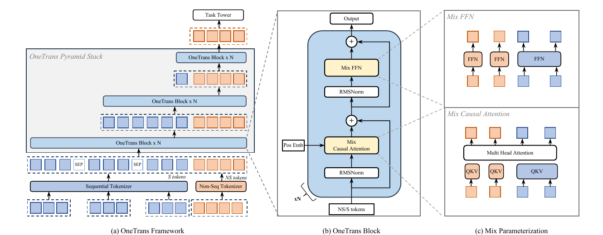
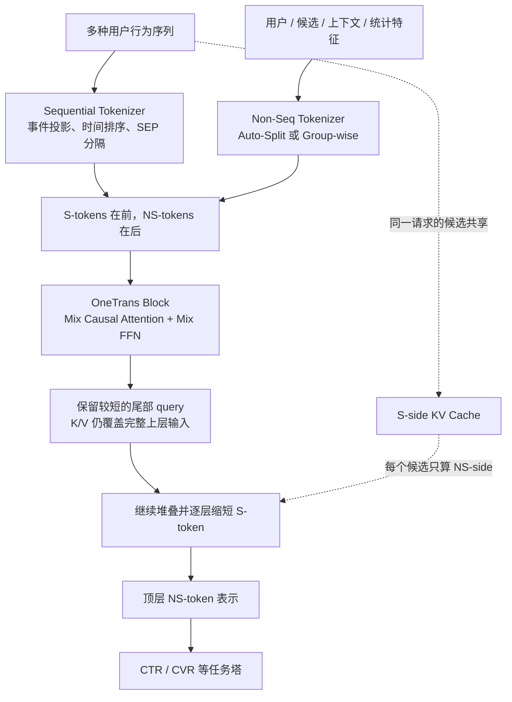
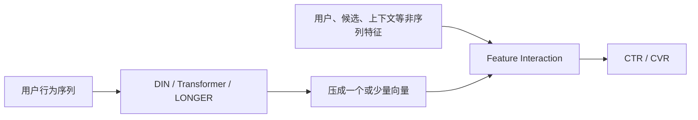

# OneTrans：统一特征交互与序列建模

> **主要参考**
>
> - [OneTrans: Unified Feature Interaction and Sequence Modeling with One Transformer in Industrial Recommender（arXiv:2510.26104）](https://arxiv.org/abs/2510.26104)
> - [论文 HTML 版](https://arxiv.org/html/2510.26104) / [论文 PDF](https://arxiv.org/pdf/2510.26104)
> - 论文标注为 **The Web Conference 2026（WWW 2026）接收**；作者来自字节跳动与南洋理工大学。

> [!NOTE]
> **一句话概括：** OneTrans 把用户行为序列和用户、候选、上下文等非序列特征都变成 token，交给同一个因果 Transformer；序列 token 共享参数，异构的非序列 token 使用各自参数，再用金字塔裁剪和跨请求 KV Cache 把统一建模的成本压到工业排序可接受范围。

> [!IMPORTANT]
> **定位边界：** OneTrans 仍然是候选集上的排序模型，不直接自回归生成 item。它的重要性在于：相较 RankMixer 只负责 feature interaction，OneTrans 开始用一个统一 backbone 同时完成 sequence modeling 与 feature interaction。

---

## 0. 总揽：先看清整篇论文

### 0.1 原论文模型架构图



图中蓝色是 sequential tokens（S-tokens），橙色是 non-sequential tokens（NS-tokens）：

- 左侧：两类 token 拼接后进入多层 OneTrans Pyramid Stack，S-token 随深度逐步裁剪，最后保留 NS-token 供任务塔使用；
- 中间：每个 block 是 Pre-Norm 的 Causal Attention + FFN；
- 右侧：所谓 Mix，不是混合专家，而是**混合参数化**——S-token 共享 QKV/FFN，NS-token 各自拥有 QKV/FFN。

### 0.2 主链路



### 0.3 四个关键设计对应四个问题

| 问题 | OneTrans 的设计 | 作用 |
| --- | --- | --- |
| 序列建模与特征交互彼此割裂 | 统一 token 序列 + 单一 Transformer stack | 在同一计算图内联合优化四类交互 |
| 推荐 token 高度异构 | S-token 共享、NS-token 专属的 mixed parameterization | 同类共享统计强度，异类避免参数干扰 |
| 上千序列 token 逐层全算太贵 | Pyramid Stack 只保留尾部 query | 逐层蒸馏历史，降低 FLOPs 和激活显存 |
| 一个请求要给数百候选打分 | 跨候选、跨请求 KV Cache | 复用用户侧历史，只增量处理新行为 |

### 0.4 阅读时只抓三句话

1. **统一不是简单拼接：** 序列 token 在前、非序列 token 在后，因果 mask 决定了信息从历史流向候选特征。
2. **共享策略由数据语义决定：** 同质行为事件适合共享参数，异质业务字段适合 token-specific 参数。
3. **架构与服务共同设计：** causal mask、pyramid 和 KV cache 是一套联动设计；若换成双向全注意力，缓存路径就不再自然。

---

## 1. 论文要解决什么问题

### 1.1 传统工业排序是 encode-then-interaction

典型排序模型把一次样本拆成两条支路：



这种范式的问题不是两个模块不够强，而是它们**各自变强，却不能作为整体扩展**：

- 序列先被压缩，后续特征交互看不到细粒度历史；
- 候选和上下文只能在压缩阶段之后影响结果，很难反向塑造历史表示；
- 两套结构产生碎片化计算，系统优化与容量规划分别进行；
- RankMixer、Wukong 扩大的是特征交互，LONGER 扩大的是序列建模，缺少一条统一 scaling 轴。

### 1.2 真正需要统一的是四类交互

OneTrans 希望单个 backbone 同时学习：

1. 单条行为序列内部的时序依赖；
2. 点击、加购、购买等多条行为序列之间的关系；
3. 用户、候选、场景、统计字段之间的高阶交互；
4. 历史行为与当前候选、上下文之间的交互。

如果先把序列压成一个向量，第 4 类交互只能作用在已经损失信息的摘要上。OneTrans 的问题意识是：**为什么不让所有信息以 token 形式在同一堆叠中相遇？**

### 1.3 直接套标准 Transformer 仍然不够

推荐输入与语言 token 不同：

- 行为事件之间相对同质，可共享转换规律；
- 用户画像、候选、价格、历史 CTR 等 NS-token 的来源和分布差异很大；
- 行为序列可到 1190 或 1500 个 token，但最后只需输出少量任务表示；
- 同一用户请求中的数百候选共享完全相同的历史序列。

因此论文的目标不是“把特征拼起来跑 Transformer”，而是设计一个同时满足**语义异构、长序列和高 QPS 服务**的 Transformer。

### 1.4 问题形式化

对用户 $`u`$ 与候选 item $`i`$，模型接收非序列特征 $`NS`$ 和多行为序列 $`S`$：

```math
\hat y_{u,i}=f_i(NS,S;\Theta)
```

典型任务包括：

```math
\mathrm{CTR}_{u,i}=P(\mathrm{click}=1\mid NS,S;\Theta)
```

```math
\mathrm{CVR}_{u,i}=P(\mathrm{conv}=1\mid \mathrm{click}=1,NS,S;\Theta)
```

论文要寻找的是一个统一的 $`f_i`$，而不是“一个序列编码器 + 一个交互网络”的拼装。

---

## 2. 核心思想一：把两类特征变成一个序列

### 2.1 非序列特征如何 tokenization

NS 特征包括数值字段与类别字段，先离散化或 one-hot，再 embedding。论文给出两种压缩到 $`L_{NS}`$ 个 token 的方式。

**Group-wise Tokenizer：** 按业务语义人工分成 $`L_{NS}`$ 组，每组独立 MLP：

```math
X_{NS}=[\mathrm{MLP}_1(\mathrm{concat}(g_1));\ldots;\mathrm{MLP}_{L_{NS}}(\mathrm{concat}(g_{L_{NS}}))]
```

它延续了 RankMixer 的语义分组思想，但分组质量依赖人工经验。

**Auto-Split Tokenizer：** 先把全部 NS 特征拼接，只做一次大投影，再切成多个 token：

```math
X_{NS}=\mathrm{split}(\mathrm{MLP}(\mathrm{concat}(NS)),L_{NS})
```

它用一个大 kernel 代替多个小 MLP，减少 kernel launch；论文消融中，Auto-Split 相比 Group-wise 在 CTR AUC/UAUC 与 CVR AUC/UAUC 上均更好。

> [!TIP]
> RankMixer 强调人工语义分组，OneTrans 的结果却显示 Auto-Split 更优。面试时可以把它理解为：语义先验有价值，但在特征很多、投影足够强且系统开销敏感时，让模型自动形成 NS-token 可能更合算。

### 2.2 序列特征如何 tokenization

对第 $`j`$ 类行为序列，每个事件由 item ID 与类目、价格等 side information 拼接，再用该序列共享的 MLP 投到统一维度 $`d`$：

```math
\widetilde S_j=[\mathrm{MLP}_j(e_{j1});\ldots;\mathrm{MLP}_j(e_{jL_j})]
```

多条行为序列有两种合并方式：

- **Timestamp-aware：** 有统一时间戳时，按时间把不同类型事件交错排列，并附加行为类型；
- **Timestamp-agnostic：** 没有可比较时间戳时，按购买 → 加购 → 点击等意图强度拼接，序列间插入可学习 `[SEP]`。

论文结果表明，在时间戳可用时，时间排序优于按行为强度排序；如果采用后者，`[SEP]` 对区分多序列边界有明显帮助。

### 2.3 最终 token 顺序至关重要

OneTrans 固定将 S-token 放前面、NS-token 放后面：

```math
X^{(0)}=[X_S;X_{NS}]\in\mathbb{R}^{(L_S+L_{NS})\times d}
```

这不是排版细节，而是 causal mask 的信息流设计：

- 第 $`t`$ 个 S-token 只能看到自身及更早的行为；
- 每个 NS-token 位于全部历史之后，因此能看到完整的行为历史；
- 较后的 NS-token 还能看到较早的 NS-token，形成字段间交互。

候选相关的 NS-token 因而天然扮演“查询历史”的角色，效果类似 target attention，但没有单独的 DIN 模块。

---

## 3. 核心思想二：Mixed Parameterization

### 3.1 为什么不能全共享，也不能全独立

标准 Transformer 对所有位置共享 QKV 和 FFN。对语言序列，这种归纳偏置合理；对推荐特征则存在矛盾：

- 点击序列中的事件结构相似，全共享可提高统计效率；
- 用户、商品、价格、场景等 NS-token 语义互异，全共享会产生参数竞争；
- 给上千个 S-token 都配独立参数则完全不可扩展。

OneTrans 的折中是：**S-token 共享，NS-token 独立。**

### 3.2 Mix Causal Attention

对 token $`x_i`$，Q/K/V 仍是线性投影：

```math
q_i=W_i^Qx_i,\quad k_i=W_i^Kx_i,\quad v_i=W_i^Vx_i
```

但权重的来源取决于 token 类型：

- 若 $`i\le L_S`$，使用同一套 $`W_S^Q,W_S^K,W_S^V`$；
- 若 $`i>L_S`$，第 $`i`$ 个 NS-token 使用自己的 $`W_{NS,i}^Q,W_{NS,i}^K,W_{NS,i}^V`$。

注意力本身仍是标准 causal MHA。Mixed 的核心只在**参数分配策略**，不是新的 attention score 公式。

### 3.3 Mix FFN

FFN 同样执行按类型分配：

```math
\mathrm{MixFFN}(x_i)=W_i^2\phi(W_i^1x_i)
```

S-token 共用一套 FFN，NS-token 各有一套 FFN。这样既保留 Transformer 的规则计算，也继承 RankMixer “异构 token 使用独立 FFN”的思想。

论文消融把全部 token 改成共享参数后，OneTransS 的 CTR AUC/UAUC 分别下降 0.15%/0.29%，CVR AUC/UAUC 分别下降 0.14%/0.29%。这说明 token-specific 参数不是单纯堆参数，而是在表达异构字段的结构差异。

### 3.4 一个 OneTrans Block

论文采用 RMSNorm 的 Pre-Norm 结构：

```math
Z^{(n)}=\mathrm{MixMHA}(\mathrm{RMSNorm}(X^{(n-1)}))+X^{(n-1)}
```

```math
X^{(n)}=\mathrm{MixFFN}(\mathrm{RMSNorm}(Z^{(n)}))+Z^{(n)}
```

选择 RMSNorm/Pre-Norm 的出发点是：两类 token 的数值范围与统计分布差别大，先归一化更有利于避免训练不稳定和 attention collapse。

---

## 4. 核心思想三：Pyramid Stack

### 4.1 为什么可以逐层丢掉前部 token

在 causal attention 中，后部 token 已经聚合了前部历史。模型越深，信息越向尾部集中。OneTrans 因而不必让全部历史位置在每一层都继续产生 query。

在某层输入长度为 $`L`$ 时，只选择最后 $`L'`$ 个位置产生 query，但 K/V 仍覆盖这一层的完整输入；计算后仅保留这 $`L'`$ 个输出，交给下一层。

```math
Q=\{L-L'+1,\ldots,L\}
```

```math
q_i=W_i^Qx_i,\quad i\in Q
```

于是 attention 成本由完整 self-attention 的近似 $`O(L^2d)`$ 变成该层的 $`O(LL'd)`$，FFN 成本也只随 $`L'`$ 增长。

### 4.2 它不是普通 token pooling

Pyramid 的关键区别是：

- 不是在入口把长序列一次压成一个向量；
- 每层被保留的尾部 query 仍能读取该层全部 K/V；
- 信息经过多层逐步蒸馏，最终集中到 NS-token；
- 顶层 query 数缩到与 NS-token 数相同，直接送入任务塔。

论文配置中，OneTransS 的序列 query 从 1190 线性缩到 12，OneTransL 从 1500 缩到 16。关闭 Pyramid 后训练 FLOPs 从 2.64T 增至 8.08T，却没有带来质量收益；在固定 FLOPs 下，Pyramid 可支持接近 1.75 倍更长的序列。

---

## 5. 核心思想四：跨候选与跨请求 KV Cache

### 5.1 同一请求中的复用

一次召回会返回数百候选。对这些候选：

- S-token 完全相同，因为用户历史相同；
- NS-token 中的候选特征不同。

因此 serving 可拆为两阶段：

1. **S-side，一次请求只算一次：** 对用户历史做 causal forward，保存各层 K/V 与中间结果；
2. **NS-side，每个候选分别计算：** 生成候选相关 NS-token，读取缓存的 S-side K/V，再执行 token-specific FFN。

这把重复的用户序列计算从“候选数 $`C`$ 次”摊薄为一次。

### 5.2 跨请求的增量复用

用户行为历史通常是 append-only。下一次请求到来时，可以沿用上一请求的缓存，只为新增加的 $`\Delta L`$ 个事件计算 K/V：

```math
O(L)\longrightarrow O(\Delta L)
```

候选专属序列无法在候选间共享，论文把这类信号预聚合后作为 NS-token 处理。

### 5.3 为什么 causal attention 是系统选择

论文消融显示 full attention 与 causal attention 的离线效果接近，但 full attention 会破坏标准 KV caching 的自然依赖关系。因此 causal mask 的优势主要不在离线 AUC，而在：

- 保证历史表示不依赖后续候选 token；
- 支持跨候选复用；
- 支持行为历史增量更新；
- 可直接使用 FlashAttention、半精度和重计算等 LLM 基础设施。

---

## 6. 实验结果应该怎样读

### 6.1 与强基线比较

论文在 291 亿曝光、2790 万用户、1020 万 item 的工业数据上评估 CTR 与 CVR。相对 DCNv2 + DIN 基线：

| 模型 | CTR AUC | CTR UAUC | CVR AUC | CVR UAUC | 参数量 | 训练 TFLOPs |
| --- | ---: | ---: | ---: | ---: | ---: | ---: |
| RankMixer + Transformer | +0.57% | +0.90% | +0.52% | +0.75% | 109M | 2.51 |
| OneTransS | +1.13% | +1.77% | +0.90% | +1.66% | 91M | 2.64 |
| OneTransL | +1.53% | +2.79% | +1.14% | +3.23% | 330M | 8.62 |

OneTransS 与 RankMixer + Transformer 的计算量接近，但效果更强，支持“统一建模本身有收益”，而不只是模型更大。

### 6.2 系统优化不是附属项

以未优化 OneTransS 为基线，论文报告：

| 优化 | 训练 Runtime | 训练显存 | 推理 p99 | 推理显存 |
| --- | ---: | ---: | ---: | ---: |
| Pyramid Stack | -28.7% | -42.6% | -8.4% | -6.9% |
| Cross-Request KV Cache | -30.2% | -58.4% | -29.6% | -52.9% |
| FlashAttention | -50.1% | -58.9% | -12.3% | -11.6% |
| Mixed Precision + Recomputation | -32.9% | -49.0% | -69.1% | -30.0% |

这些数字是分别对未优化基线的消融结果，不能相加。它们说明 OneTrans 的卖点是“统一 backbone 后，成熟 LLM infra 可以直接复用”。

### 6.3 Scaling 结论

论文分别扩大序列长度、深度和宽度：

- 增长序列长度收益最大，说明更多行为证据仍是最强 scaling 轴；
- 深度通常比单纯加宽带来更多质量收益，但串行延迟更高；
- OneTrans 与 RankMixer 都呈近似 log-linear 趋势，OneTrans 的斜率更陡；
- 更大的参数量不自动等于更好的线上性价比，宽度和深度仍须配合硬件预算选择。

### 6.4 线上 A/B

控制组为 RankMixer + Transformer，实验组为 OneTransL：

| 场景 | Click/User | Order/User | GMV/User | p99 延迟变化 |
| --- | ---: | ---: | ---: | ---: |
| Feeds | +7.737% | +4.351% | +5.685% | -3.91% |
| Mall | +5.143% | +2.577% | +3.670% | -3.26% |

OneTransL 虽有 330M 参数和 8.62 TFLOPs，但推理 p99 为 13.2ms，略低于 10M 参数 DCNv2 + DIN 的 13.6ms；这正是模型—系统协同设计的核心证据。

---

## 7. 与 RankMixer 的关系

| 维度 | RankMixer | OneTrans |
| --- | --- | --- |
| 主要任务 | 排序阶段的非序列特征交互 | 排序阶段的序列 + 非序列统一建模 |
| token mixing | 无参数 Split—Transpose—Merge | 标准 causal multi-head attention |
| 参数隔离 | 每个 feature token 独立 FFN | S-token 共享，NS-token 独立 QKV/FFN |
| 行为序列 | 通常由外部 sequence module 压缩后输入 | 原始多行为事件直接成为 S-token |
| 长序列效率 | 不负责原始长序列 | Pyramid + KV Cache + FlashAttention |
| scaling 重点 | token、宽度、深度、专家数 | 序列长度、深度、宽度与统一系统优化 |

可以把演进讲成：

> RankMixer 证明推荐排序可以用规则 token backbone 高效扩容；OneTrans 进一步问，既然 feature interaction 已经 token 化，为什么还要让 sequence module 留在 backbone 外面？

---

## 8. 面试时如何讲 OneTrans

### 8.1 60 秒版本

> 传统工业排序把序列先编码成一个向量，再和非序列特征做交互，导致细粒度历史丢失、两个模块不能统一扩展。OneTrans 把行为事件和用户、候选、上下文字段统一成 token，用一个 causal Transformer 同时做序列建模与特征交互。它针对推荐异构性，让行为 token 共享 QKV/FFN、非序列 token 各自拥有参数；再用 Pyramid 逐层裁掉前部 query，用跨候选和跨请求 KV Cache 复用用户侧计算。实验上 OneTransS 在接近 RankMixer + Transformer 的 FLOPs 下明显更强，OneTransL 线上 GMV/User 提升 5.685%，p99 延迟反而下降。

### 8.2 高频追问

**为什么 NS-token 放在最后？**

因为 causal mask 下它能看到完整历史，而历史表示不依赖候选，正好支持 S-side cache。

**为什么不用双向注意力？**

论文中离线效果基本持平，但双向依赖不利于标准 KV cache；工业价值取决于同一请求数百候选的复用。

**Pyramid 会不会丢信息？**

会引入信息瓶颈，但被保留的尾部 query 在裁剪前仍读取全部 K/V；消融显示去掉 Pyramid 没有质量收益，却把训练 FLOPs 从 2.64T 拉到 8.08T。

**Mixed parameterization 与 MoE 有什么区别？**

这里没有动态 router。参数选择由 token 类型确定：S 走共享权重，NS 按固定位置走专属权重，是确定性的结构先验。

**OneTrans 算生成式推荐吗？**

不算严格意义上的 item 自回归生成。它是统一 Transformer 排序 backbone；真正把召回和排序统一成生成任务的是下一篇 OneRec。

---

## 9. 局限与可继续思考的问题

1. **候选仍来自外部召回。** OneTrans 统一了排序内部模块，没有消除级联召回—排序。
2. **固定 token 顺序带来强先验。** NS-token 之间的顺序会改变可见关系，需要稳定的字段组织。
3. **token-specific 参数依赖 schema。** 字段变更、跨场景迁移和冷启动需要额外处理。
4. **缓存提高系统复杂度。** 跨请求 cache 要处理版本、失效、一致性、用户历史更新和显存预算。
5. **效果来自多项联合变化。** 统一建模、mixed 参数、pyramid 与 infra 优化互相耦合，迁移到其他业务时应分层验证。

---

## 10. 总结

OneTrans 的贡献可以压缩成一条因果链：

```text
encode-then-interaction 割裂
→ 序列与非序列统一 token 化
→ causal Transformer 在同一 stack 内联合建模
→ S 共享、NS 专属参数适配推荐异构性
→ Pyramid 聚合长历史
→ KV Cache 复用用户侧计算
→ 统一 scaling 的同时满足线上延迟
```

真正值得记住的不是“又一个 Transformer”，而是三层统一：

- **表示统一：** 行为与字段都成为 token；
- **模型统一：** sequence modeling 与 feature interaction 由同一 block 完成；
- **系统统一：** causal 结构让训练优化、候选复用和跨请求缓存走同一套 LLM infra。

它承接 RankMixer 的 token 化和专属参数思想，又为 OneRec 的端到端生成式推荐铺路：前者统一排序 backbone 内部，后者进一步试图统一召回与排序。
