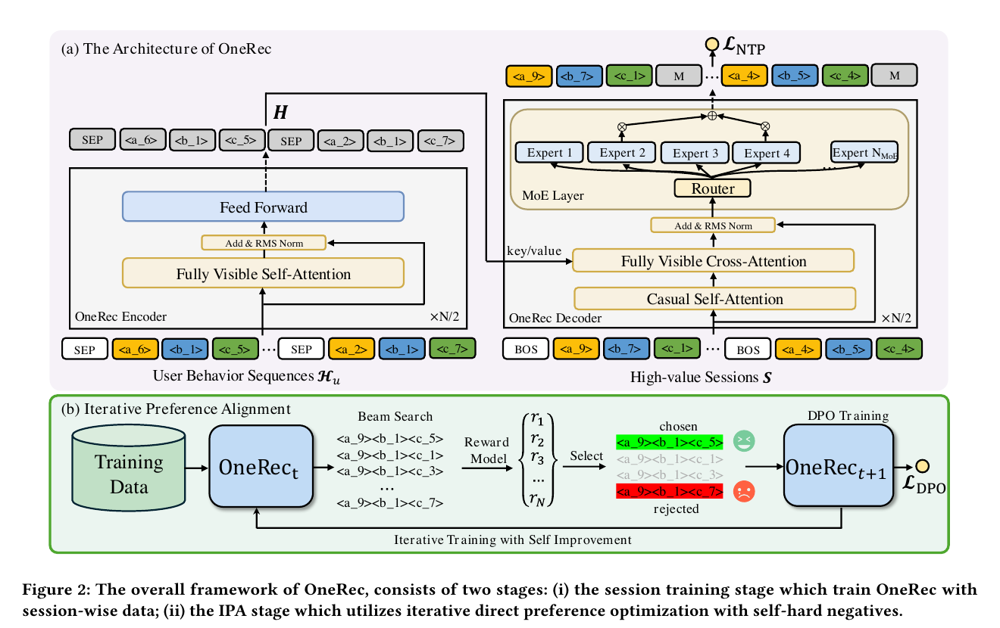
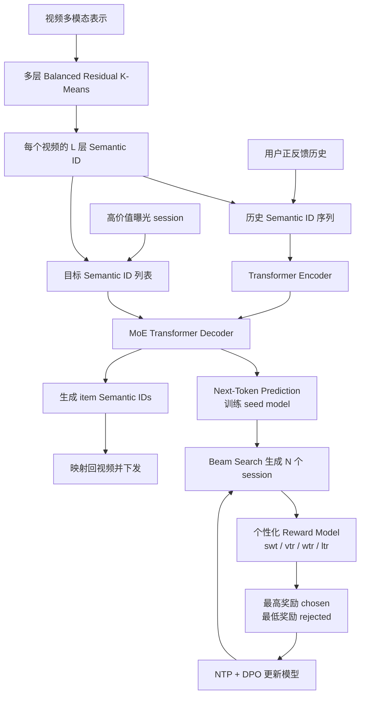
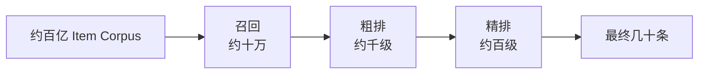
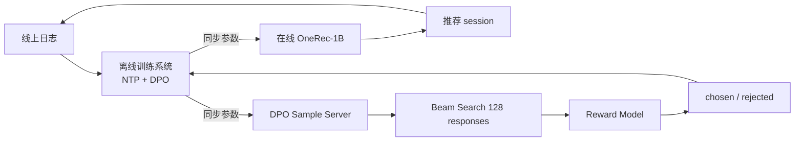

# OneRec：统一召回与排序的生成式推荐

> **主要参考**
>
> - [OneRec: Unifying Retrieve and Rank with Generative Recommender and Preference Alignment（arXiv:2502.18965）](https://arxiv.org/abs/2502.18965)
> - [论文 HTML 版](https://arxiv.org/html/2502.18965) / [论文 PDF](https://arxiv.org/pdf/2502.18965)
> - 作者全部来自快手；本文以原始论文为主，不把后续宣传材料中的扩展口径混入论文结论。

> [!NOTE]
> **一句话概括：** OneRec 把推荐从“召回—粗排—精排”的逐级打分，改写成“给定用户历史，直接自回归生成一整组高价值视频的 Semantic IDs”，再用 MoE 扩大容量、用 session-wise 训练学习列表上下文、用 Reward Model + DPO 构成迭代偏好对齐闭环。

> [!IMPORTANT]
> **与前两篇的边界：** RankMixer 和 OneTrans 都是 ranking model；OneRec 才是严格意义上的生成式推荐——输出不再是候选的分数，而是 item 的离散语义标识序列，目标是用单个生成模型统一 retrieval 与 ranking。

---

## 0. 总揽：OneRec 到底统一了什么

### 0.1 原论文模型架构图



上半部分是 OneRec 主模型：

- Encoder 用全可见 self-attention 编码用户行为 Semantic IDs；
- Decoder 用 causal self-attention 自回归生成高价值 session，并通过 cross-attention 读取用户历史；
- Decoder FFN 替换成 Sparse MoE，以较小激活成本扩大参数量。

下半部分是 IPA：当前模型用 beam search 生成多组候选 session，Reward Model 打分，最高分作为 chosen、最低分作为 rejected，用 DPO 更新下一轮模型。

### 0.2 完整数据与训练闭环



### 0.3 三个核心思想

| 核心问题 | OneRec 的答案 | 关键词 |
| --- | --- | --- |
| 如何不依赖外部候选集直接选择 item | 将视频映射成分层 Semantic ID，自回归生成 code | Generative Retrieval |
| 如何让输出不只是单个“下一个 item” | 一次生成 5 个 item 的高价值 session | Session-wise Generation |
| 稀疏反馈下如何构造偏好数据 | RM 为模型自己的 beam 结果排序，迭代挖 chosen/rejected | IPA + Self-hard Negative |

### 0.4 面试前先记住五个数字

| 配置 | 数值 |
| --- | ---: |
| Semantic ID 层数 | 3 |
| 每层 codebook 大小 | 8192 |
| Decoder MoE | 24 个专家，Top-2 激活 |
| 历史长度 / 目标 session 长度 | 256 / 5 |
| DPO 数据比例 / 每用户 beam 数 | 1% / 128 |

---

## 1. 论文要解决什么问题

### 1.1 级联推荐的逐级上限

传统线上系统通常是：



每一级使用独立目标和模型，后一级只能从前一级保留下来的候选中选择。因此：

- 召回漏掉的优质 item，精排永远无法恢复；
- 不同阶段的训练目标和容量不一致，误差逐级累积；
- 多套模型、特征和索引带来复杂的工程维护；
- 精排虽强，却只在召回模型提供的局部候选空间中优化。

OneRec 希望用一个生成模型直接在全库的离散 item 表示空间中产生最终列表，从结构上取消级联阶段之间的上限。

### 1.2 现有生成式召回还不能替代精排

TIGER 等方法已经把 item 表示为 Semantic ID，并通过 beam search 生成候选。但它们通常仍是 retrieval selector：

- 训练任务多是 point-wise next-item prediction；
- 单个 item 的命中并不等于整组推荐的观看时长、连贯性与多样性好；
- 模型容量与工业精排仍有差距；
- 缺少对业务多目标偏好的直接对齐。

所以 OneRec 不是简单把 TIGER 做大，而是同时改变**输出单元、容量结构和训练目标**。

### 1.3 点式生成无法显式学习列表上下文

逐个预测下一个视频时，每个训练标签是孤立的。线上为了去重、多样性和内容衔接，往往还要加手工策略。

OneRec 将一次请求返回的 5～10 个视频视为 session，并筛选高质量 session 作为训练目标。这样后一个生成 item 会条件于前面已经生成的 item，模型可以学习：

- 列表内内容如何衔接；
- 兴趣如何在一次消费过程中变化；
- 相似性与多样性如何平衡；
- 一个 item 的价值如何受列表上下文影响。

### 1.4 推荐偏好数据比 NLP 更稀疏

在对话模型中，人类可以直接标注回答 A 优于 B。推荐日志只展示了一条线上列表，用户没有同时看过同一请求的多个替代列表，无法直接得到 chosen/rejected pair。

OneRec 因而需要先训练 Reward Model，再让当前生成模型提出多个候选 session，用 RM 自动构造偏好对。这是 IPA 存在的根本原因。

---

## 2. 核心思想一：用平衡 Semantic ID 表示视频

### 2.1 为什么不能直接生成视频 ID

原始视频 ID 是无语义、超大词表的原子符号：

- 新视频和长尾视频难以共享统计；
- 输出 softmax 规模过大；
- 相似视频在 ID 空间没有邻近关系；
- 生成模型很难利用内容的多模态表示。

OneRec 先获得与真实用户—视频行为分布对齐的多模态 embedding $`e_i`$，再把一个视频量化成 $`L`$ 层 code：

```math
v_i\longrightarrow(s_{i1},s_{i2},\ldots,s_{iL})
```

论文最终使用 3 层、每层 8192 个 code。

### 2.2 Residual K-Means

第一层残差为原始 embedding：

```math
r_i^1=e_i
```

第 $`l`$ 层选择距离最近的 centroid：

```math
s_{il}=\arg\min_k\lVert r_i^l-c_k^l\rVert_2^2
```

然后扣除已选 centroid，继续量化残差：

```math
r_i^{l+1}=r_i^l-c_{s_{il}}^l
```

前层 code 表达粗粒度语义，后层逐步补充细节；生成 3 个 token 就能指向一个具体视频。

### 2.3 为什么要 Balanced K-Means

普通 RQ-VAE 或 K-Means 容易出现 hourglass phenomenon：少数 code 被大量 item 占据，其余 code 很少使用。结果是：

- code 分布严重长尾；
- beam search 的有效分支集中在少数路径；
- softmax 类别学习不均衡；
- 不同 item 更容易产生 code collision。

OneRec 在每层强制每个 cluster 分到约 $`|V|/K`$ 个视频。算法逐个 centroid 选择尚未分配集合中最近的固定数量样本，再更新 centroid，直到 assignment 收敛。

> [!IMPORTANT]
> 这是一种容量均衡约束，不代表每个 code 的语义同样好。它牺牲部分纯聚类最优性，换取生成词表的利用率和训练稳定性。

---

## 3. 核心思想二：Encoder-Decoder + Session-wise Generation

### 3.1 输入与输出

输入是用户正反馈历史：有效观看、点赞、关注、分享等视频的 Semantic IDs。不同视频之间插入 `[SEP]`。

输出是一组高价值 session。每个视频 code 前插入 `[BOS]`，模型连续生成多个 item 的多层 code：

```text
[BOS] <a_9> <b_7> <c_1> [BOS] <a_4> <b_5> <c_4> ...
```

这里 `<a_9><b_7><c_1>` 是同一视频在三层 codebook 中的 code。

### 3.2 高价值 session 如何筛选

论文从真实日志中挑选满足强参与信号的 session，例如：

- 用户实际观看的视频数不少于 5；
- session 总观看时长超过阈值；
- 用户发生点赞、收藏或分享等交互。

因此 NTP 阶段不是让模型模仿任意曝光列表，而是模仿已经被行为验证的高质量列表。

### 3.3 模型结构

OneRec 类似 T5：

- **Encoder：** fully-visible self-attention + FFN，双向融合用户历史；
- **Decoder：** causal self-attention，保证自回归生成；
- **Cross-Attention：** Decoder 每步读取 Encoder 的历史表示；
- **MoE FFN：** Decoder 的 FFN 被稀疏专家层替换。

训练使用 next-token prediction：

```math
\mathcal L_{NTP}=-\sum_{i=1}^{m}\sum_{j=1}^{L}\log P(s_i^{j+1}\mid H_u,\bar S_{1:i,j};\Theta)
```

其中 $`H_u`$ 是用户历史，$`\bar S_{1:i,j}`$ 表示当前 code 之前已看到的目标 session token。

### 3.4 为什么是 Encoder-Decoder 而不是纯 Decoder

从架构上看，用户历史是条件，目标 session 是需要生成的响应：

- Encoder 可以对历史做双向建模，不必承担生成的因果约束；
- Decoder 的 causal self-attention 只处理已生成 session；
- cross-attention 将稳定的历史表示作为 K/V，适合缓存；
- 输入与输出角色清晰，方便分别扩容和部署优化。

### 3.5 MoE 如何扩大容量

对 Decoder 某层 token $`h_t^l`$，router 只激活 Top-$`K_{MoE}`$ 个专家：

```math
h_t^{l+1}=h_t^l+\sum_{i=1}^{N_{MoE}}g_{i,t}\mathrm{FFN}_i(h_t^l)
```

未入选专家的 $`g_{i,t}=0`$。论文最终使用 24 个专家、每个 token 激活 2 个；部署时只激活约 13% 参数。它的目标是扩大表达容量而不按总参数量等比例增加单 token 计算。

---

## 4. 核心思想三：Iterative Preference Alignment

### 4.1 Reward Model 学什么

RM 接收用户 $`u`$ 与完整 session $`S`$，输出个性化奖励。它先为 session 中每个 item 构造 target-aware 表示，再通过 self-attention 建模 item 间关系，最后用多个 tower 预测：

| 奖励 | 含义 |
| --- | --- |
| swt | session watch time |
| vtr | view probability |
| wtr | follow probability |
| ltr | like probability |

这比用一个全局流行度分数更合理，因为同一列表对不同用户的价值不同。

### 4.2 self-hard negative 从哪里来

第 $`t`$ 轮模型 $`M_t`$ 对同一用户用 beam search 产生 $`N`$ 个 session：

```math
S_u^n\sim M_t(H_u),\quad n=1,\ldots,N
```

RM 为每个候选打分：

```math
r_u^n=R(u,S_u^n)
```

最高分选为 $`S_u^w`$，最低分选为 $`S_u^l`$。这些 rejected 不是随机负样本，而是当前模型真正可能生成、但业务价值较差的结果，所以称为 self-hard negatives。

### 4.3 DPO 更新

第 $`t+1`$ 轮模型从 $`M_t`$ 初始化，并学习提高 chosen 相对 rejected 的概率。论文的 DPO 目标可理解为：

```math
\mathcal L_{DPO}=-\log\sigma\left(\beta\log\frac{M_{t+1}(S_u^w\mid H_u)}{M_t(S_u^w\mid H_u)}-\beta\log\frac{M_{t+1}(S_u^l\mid H_u)}{M_t(S_u^l\mid H_u)}\right)
```

训练时同时保留 NTP，避免模型只追逐 RM 偏好而忘记真实数据分布：

```math
\mathcal L=\mathcal L_{NTP}+\lambda\mathcal L_{DPO}
```

更新后用新模型再次生成、打分和构对，形成迭代自提升。

### 4.4 为什么只用 1% DPO 数据

beam search + RM 打分非常昂贵。论文发现：

- 1% DPO 数据已经带来主要收益；
- 从 1% 增到 5%，收益很有限；
- 5% 需要约 5 倍采样 GPU；
- 1% 平均可取得观测最大性能的约 95%，只需 5% 配置的 20% 采样资源。

这反映一个常见工业规律：高质量、在线模型分布内的 hard pair，比大量随机偏好样本更值钱。

---

## 5. 在线系统如何闭环

论文把部署分成三个系统：



主要系统配置：

- 在线部署 OneRec-1B；
- 训练采用 XLA 与 bfloat16；
- 推理采用 KV cache 与 FP16 量化；
- beam size 为 128；
- 在线模型和 DPO sample server 都从训练系统同步参数。

这里最重要的不是某个单项优化，而是**数据闭环**：线上日志训练 seed model，当前模型产生自身难例，RM 形成偏好监督，再反哺下一版模型。

---

## 6. 实验结果怎样读

### 6.1 Session-wise 的贡献

OneRec-0.1B 和 OneRec-1B 普遍优于相同规模的 point-wise TIGER，说明收益不只来自模型参数，而来自将列表上下文纳入生成目标。

相较 TIGER-1B，OneRec-1B 的最大 session watch time 从 0.1368 提升到 0.1529，最大 like probability 从 0.0579 提升到 0.0660。

### 6.2 IPA 的贡献

OneRec-1B + IPA 的关键离线结果：

| 指标 | OneRec-1B | OneRec-1B + IPA |
| --- | ---: | ---: |
| max swt | 0.1529 | 0.1933 |
| max vtr | 0.7013 | 0.7646 |
| max wtr | 0.00919 | 0.00992 |
| max ltr | 0.0660 | 0.1203 |

论文还比较了 DPO、IPO、cDPO、rDPO、CPO、simPO、S-DPO，IPA 整体最好。核心差异不是换了一个新损失，而是**迭代从当前模型输出中挖个性化 hard pair**。

### 6.3 Scaling

模型从 0.05B 扩到 0.1B、0.2B、0.5B、1B 时持续受益。论文将其归因于：

- MoE 提供更大条件容量；
- session-wise 任务比单点 next-item 提供更丰富监督；
- 分层 code 让不确定性逐层收缩。

但这组 scaling 结果主要基于 RM 估计的 session 指标，解读时不能等同于所有真实线上指标都单调增长。

### 6.4 快手线上 A/B

论文在主站 1% 流量上与现有多阶段系统比较：

| 模型 | Total Watch Time | Average View Duration |
| --- | ---: | ---: |
| OneRec-0.1B | +0.57% | +4.26% |
| OneRec-1B | +1.21% | +5.01% |
| OneRec-1B + IPA | +1.68% | +6.56% |

模型放大和 IPA 都有增益。论文也诚实指出，对点赞等互动指标的能力仍有限，多目标生成是后续方向。

---

## 7. RankMixer、OneTrans、OneRec 的主线

| 模型 | 统一范围 | 输入 | 输出 | 主要机制 |
| --- | --- | --- | --- | --- |
| RankMixer | 排序内的 feature interaction | 候选级异构特征 token | 候选分数 | 无参数 token mixing + per-token FFN |
| OneTrans | 排序内的 sequence + feature interaction | 行为 token + NS-token | 候选分数 | causal Transformer + mixed 参数 + KV cache |
| OneRec | retrieval + ranking | 用户行为 Semantic IDs | item Semantic ID session | Encoder-Decoder + MoE + IPA |

一句话演进：

```text
RankMixer：怎样把排序 backbone 做大
→ OneTrans：怎样把排序中的序列和特征交互统一做大
→ OneRec：怎样把召回与排序改写成一次生成
```

OneTrans 与 OneRec 都使用 Transformer 和 KV cache，但任务不同：前者仍对候选打分，后者直接决定候选是谁。

---

## 8. 面试时如何讲 OneRec

### 8.1 90 秒版本

> OneRec 想解决级联推荐的上限问题：召回漏掉的 item 后续排序无法恢复，而且各阶段目标不统一。它先把视频的多模态 embedding 用三层 Balanced Residual K-Means 编成 Semantic ID，再用 T5 式 Encoder-Decoder 直接生成 5 个视频组成的高价值 session。Decoder 使用 24 专家 Top-2 MoE，把容量扩到 1B，但推理只激活约 13% 参数。训练先做 session-wise NTP，学习列表内上下文；随后当前模型为每个用户 beam search 128 个 session，个性化 RM 打分，最好和最差组成 chosen/rejected，用 NTP + DPO 迭代更新。在线相对多阶段系统，OneRec-1B + IPA 的总观看时长提升 1.68%，平均单视频观看时长提升 6.56%。

### 8.2 高频追问

**Semantic ID 为什么要平衡？**

防止 codebook 使用率塌缩；均衡分桶使每个 code 获得更接近的训练量，也让 beam tree 的有效分支更均匀。

**生成的 code 一定能映射到真实 item 吗？**

论文正文强调层次 code 与 item 映射，但没有展开 collision、无效 code 路径和动态增量 item 的完整处理。这是工程落地必须继续问的问题。

**为什么生成 session 而不是 Top-K 独立解码？**

因为后续 item 条件于已生成 item，可内生学习连贯性、多样性和兴趣变化，减少独立打分后再靠规则重排。

**RM 会不会被模型 exploit？**

会。IPA 的风险包括 reward hacking、RM 分布外误判和偏好坍塌；保留 NTP、只用 1% DPO 数据和迭代刷新 hard pair 能缓解，但不能从根本上消除。

**OneRec 是否真的完全替代所有业务策略？**

论文证明单模型可在线替代当前多阶段主链路并获得 watch-time 收益，但并未证明广告约束、合规、去重、探索、多目标等所有策略都可以取消。

**为什么这篇快手论文值得 TikTok 面试读？**

它给出了一条完整的生成式推荐落地链：item tokenizer、生成 backbone、list-wise 目标、偏好对齐、beam serving 与反馈闭环。即使公司实现不同，设计问题几乎相同。

---

## 9. 局限与可继续思考的问题

1. **离散索引维护成本。** 视频库持续新增，codebook 更新可能导致 Semantic ID 漂移和模型—索引版本问题。
2. **自回归时延。** 每个 item 需要生成多层 code，session 又包含多个 item，beam 128 的成本不可忽略。
3. **RM 偏差被放大。** 生成模型会主动搜索 RM 的高分区域，离线 RM 的细小偏差可能被策略利用。
4. **碰撞与无效路径。** 分层 code 可能指向多个 item 或不存在的组合，需要约束解码与 tie-breaking。
5. **多目标仍不充分。** 观看时长提升明显，但论文承认 like 等交互指标仍有限。
6. **工业细节披露有限。** 线上延迟、吞吐、候选约束、code 更新频率和安全策略没有完整报告。

---

## 10. 总结

OneRec 的逻辑链是：

```text
级联阶段互设上限
→ 用平衡 Semantic ID 把全库 item 变成可生成词表
→ Encoder-Decoder 直接生成高价值 session
→ MoE 扩大容量但保持稀疏激活
→ RM 从当前模型的 beam 中挖 self-hard preference pair
→ NTP + DPO 迭代对齐业务奖励
→ 训练、采样、服务组成线上闭环
```

最值得记住的三个转变：

- 从**候选打分**转向**标识生成**；
- 从**单 item 监督**转向**session 上下文监督**；
- 从**静态日志拟合**转向**模型自生成难例的迭代偏好学习**。

读完 RankMixer、OneTrans、OneRec 后，推荐大模型的路线就比较清楚了：先找到可扩展的统一 token backbone，再把更多推荐模块纳入同一 backbone，最后把整个候选选择过程改写成条件生成。
