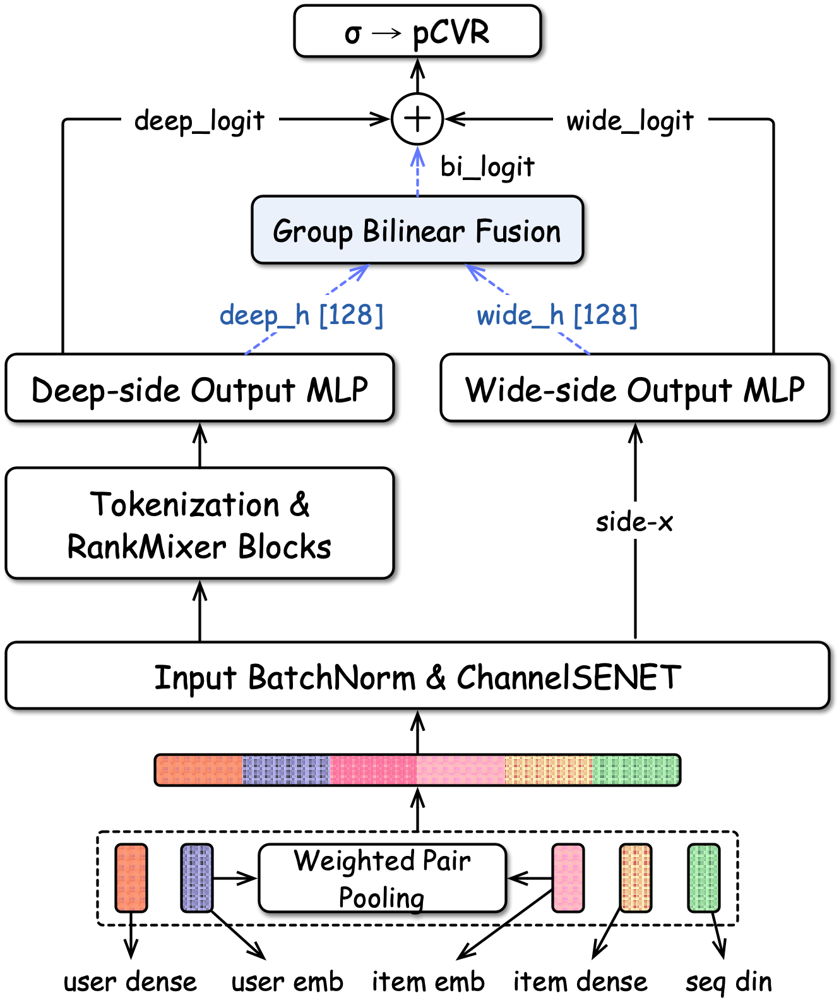
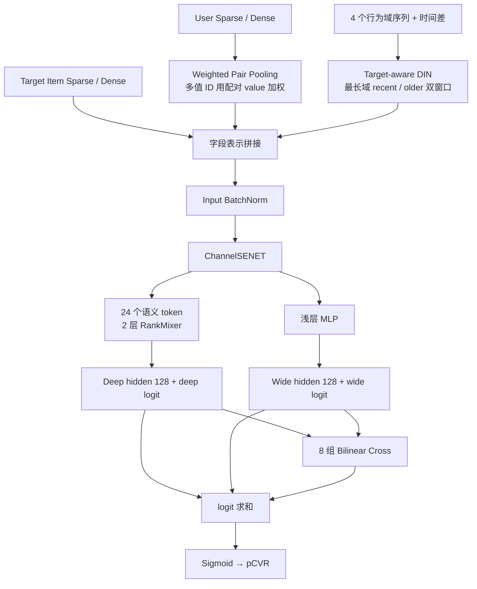
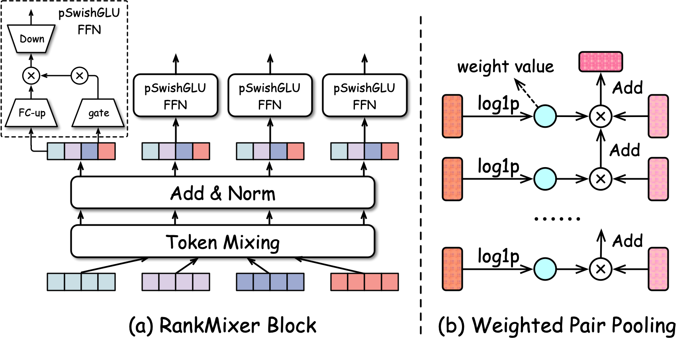
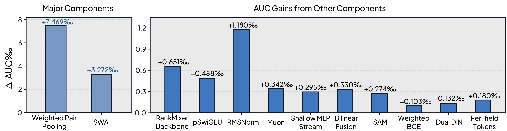
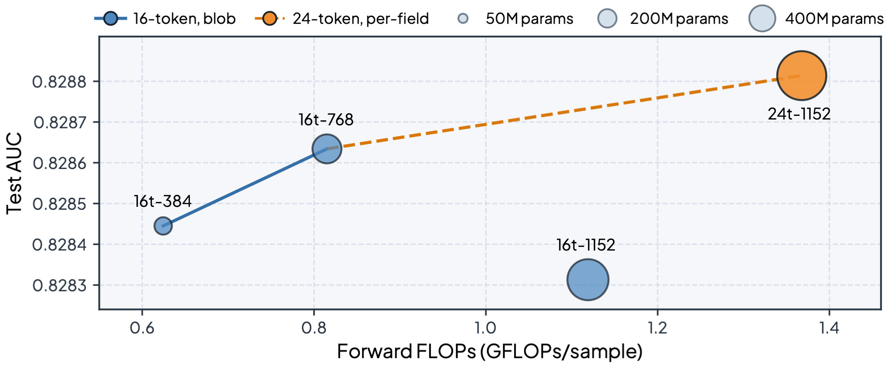

# TAAC 2026：赛题、SeRankMixer 方案与项目讲述

> **主要参考**
>
> - [Field-Aware RankMixer with Dual-Stream Bilinear Fusion for the Tencent UNI-REC Challenge（arXiv:2607.15590）](https://arxiv.org/abs/2607.15590)
> - [TAAC-2026-SeRankMixer 仓库](https://github.com/PixelCookie-zyf/TAAC-2026-SeRankMixer)；本文核对版本：[`a5de8fc`](https://github.com/PixelCookie-zyf/TAAC-2026-SeRankMixer/tree/a5de8fccaade9d1be02e70756a401aab47a410e3)
> - [最终训练配置](https://github.com/PixelCookie-zyf/TAAC-2026-SeRankMixer/blob/a5de8fccaade9d1be02e70756a401aab47a410e3/SeRankMixer/train_scripts/exp-serankmixer-l2-muon-swa-2stream-bilinear-sam-dualdin-d-perfid.sh)

> [!NOTE]
> **一句话概括：** 这是一个面向 TAAC 2026 / Tencent UNI-REC 工业赛道的单模型 pCVR 方案：先用 target-aware DIN 压缩多域行为序列，再对稀疏字段、稠密字段和序列兴趣做细粒度语义 tokenization，以 RankMixer 建模高阶交互，同时保留浅层 Wide&Deep 路径并用分组双线性项融合，最后用 Muon + SWA + SAM + 正样本加权 BCE 完成训练。

> [!IMPORTANT]
> **阅读边界：** 本文把信息分为三层：**赛题与论文事实**、**仓库代码真实实现**、**可继续验证的改进设想**。面试时必须保持同样边界，不要把仓库注释里的先验判断或本文提出的方案讲成官方赛题结论。

---

## 0. 总揽：从输入到 pCVR

### 0.1 仓库给出的完整架构图



### 0.2 一张流程图看完整链路



### 0.3 最终结果与模型配置

| 项目 | 最终配置 |
| --- | --- |
| 单模型官方分数 | 0.828814，最终第 9 名 |
| 相对 baseline | 0.814098 → 0.828814，提升 14.716‰ |
| RankMixer | 24 tokens，宽度 1152，24 heads，2 blocks，扩展比 2 |
| 归一化与池化 | RMSNorm，最终 mean pooling |
| token 组成 | 5 user + 3 target item + 4 sequence + 9 user dense + 3 item dense |
| 序列最大长度 | 256 / 256 / 512 / 1024；最长域使用 dual DIN |
| 深流 / 浅流 MLP | 1024-512-256-128 / 512-128 |
| 融合 | 8-group bilinear residual |
| 参数量 | Dense backbone 约 425.6M，总参数约 601M |
| 推理计算 | 约 1.368 GFLOPs/sample，不计 embedding lookup |

> [!WARNING]
> 仓库 README 把官方分数称为 **weighted-AUC**，论文实验章节称 leaderboard 与本地验证均使用 **ROC-AUC**。本文不替来源消解这个命名差异，统一写“官方分数 / Test AUC 0.828814”；面试若被问评估公式，应以当届官方赛题说明为最终依据。

---

## 1. 赛题内容：先说明预测对象和约束

### 1.1 任务背景

论文称 Tencent UNI-REC Challenge 由 TAAC 2026 与 KDD Cup 2026 联合举办。工业赛道要求联合建模：

- 用户稀疏与稠密字段；
- 目标广告稀疏与稠密字段；
- 多个行为域的用户历史；
- 行为相对当前点击的时间差；
- 点击后的二分类转化标签。

对一个已点击样本，给定用户 $`x_u`$、目标广告 $`x_i`$ 和多个域的行为序列 $`S_m`$，预测：

```math
\hat y=P(y=1\mid x_u,x_i,\{S_m\}_{m\in\mathcal M})=\sigma(z)
```

这里是 **pCVR（post-click conversion rate）**，不是 pCTR。代码也把 `label_type == 2` 转成正类，可在 [`dataset.py`](https://github.com/PixelCookie-zyf/TAAC-2026-SeRankMixer/blob/a5de8fccaade9d1be02e70756a401aab47a410e3/SeRankMixer/dataset.py#L823-L829) 中看到。

### 1.2 数据规模

论文披露的第二轮工业赛道数据：

| 数据 | 规模 |
| --- | ---: |
| 训练集 | 34,822,423 个带标签点击，连续 10 天 |
| 官方测试集 | 12,251,082 个点击，随后 2 天 |
| 正样本率 | 7.8867% |
| 转化延迟的 p99 | 66.823 小时 |

仓库输入是一组 Parquet 文件和 `schema.json`。schema 描述 `user_int`、`item_int`、`user_dense`、`item_dense` 与多个 sequence domain；源码按 row group 做流式读取和 DDP 分片，见 [`dataset.py`](https://github.com/PixelCookie-zyf/TAAC-2026-SeRankMixer/blob/a5de8fccaade9d1be02e70756a401aab47a410e3/SeRankMixer/dataset.py#L210-L330)。

### 1.3 难点不是普通表格二分类

1. **极端异构。** 单值 ID、多值 ID、大块 dense vector、统计值和长行为序列同时存在。
2. **多域兴趣。** 不同序列域的语义和长度不同，直接拼接或统一 pooling 会互相干扰。
3. **目标相关性。** 同一段历史面对不同广告时，相关行为不同，必须 target-aware 聚合。
4. **长序列稀释。** 长达 1024 的历史中，近期兴趣容易压制长期偏好。
5. **类别不平衡。** 正例只有 7.8867%，普通 BCE 容易被负例主导。
6. **容量组织。** 只堆更宽的 MLP/RankMixer 会过拟合，必须让额外容量对应更细的字段结构。

### 1.4 验证协议的一个重要限制

论文使用最后 10% Parquet row groups 做开发集，但这些 row group 并未按时间排序，多数跨越整个训练窗口，所以它接近随机划分，而不是未来时间验证。

> [!CAUTION]
> 对真实广告 pCVR，更稳妥的主验证应是严格时间外推，并等待足够的转化归因窗口。随机式划分可能高估对特征漂移、广告冷启动和延迟反馈的泛化。这个点非常适合在面试中主动指出。

---

## 2. 方案核心一：先把原始特征变成“有意义的字段表示”

### 2.1 Weighted Pair Pooling

部分多值稀疏 ID 与同长度的非负 dense value 成对出现。普通 mean pooling 会把所有有效 ID 等权处理，丢掉 value 表达的强度。

方案先对长尾 value 做 `log1p`，再作为权重计算：

```math
e_f=\frac{\sum_jm_{f,j}w_{f,j}E_f(v_{f,j})}{\sum_jm_{f,j}w_{f,j}+\epsilon}
```

其中 $`m_{f,j}`$ 屏蔽 padding，$`w_{f,j}`$ 是变换后的配对 value。代码实现在 [`FeatureFieldTokenizer.forward`](https://github.com/PixelCookie-zyf/TAAC-2026-SeRankMixer/blob/a5de8fccaade9d1be02e70756a401aab47a410e3/SeRankMixer/model.py#L823-L857)，数据侧保留了 log1p 后、标准化前的非负权重流，见 [`dataset.py`](https://github.com/PixelCookie-zyf/TAAC-2026-SeRankMixer/blob/a5de8fccaade9d1be02e70756a401aab47a410e3/SeRankMixer/dataset.py#L897-L909)。

最终脚本对 fids 62～66 开启这一处理，且使用 weighted mean。

### 2.2 为什么 `log1p` 很关键

原始计数通常长尾。如果直接做 weighted mean，少数超大 value 会几乎独占池化结果；`log1p` 保留单调顺序，同时压缩数量级，使多个有效 ID 都能贡献梯度。

### 2.3 Target-aware DIN

目标广告的多个字段 embedding 先取均值，形成 query $`q`$。每个行为事件的字段 embedding 拼接并投到 $`d=64`$，再加 bucketed time-gap embedding，得到 $`e_j^m`$。

DIN 使用四组交互特征打分：

```math
a_j^m=g_m([q,e_j^m,q-e_j^m,q\odot e_j^m])
```

```math
\alpha_j^m=\mathrm{softmax}_j(a_j^m)
```

```math
h_m=q+W_o^m\sum_j\alpha_j^mW_v^me_j^m
```

源码对应 [`DINCrossAttention`](https://github.com/PixelCookie-zyf/TAAC-2026-SeRankMixer/blob/a5de8fccaade9d1be02e70756a401aab47a410e3/SeRankMixer/model.py#L38-L137)：打分输入确实是 `[q, k, q-k, q*k]`，padding 在 softmax 前被 mask。

### 2.4 最长域的 Dual DIN

最长的 1024 行为序列按 newest-first 分成两半：

- recent half 用一个 DIN；
- older half 用另一个独立 DIN；
- 两个 $`d`$ 维结果直接拼成 $`2d`$，不先压回 $`d`$。

这样旧兴趣不会和近期兴趣在同一个 softmax 中直接竞争。代码主链路见 [`_make_concat_features`](https://github.com/PixelCookie-zyf/TAAC-2026-SeRankMixer/blob/a5de8fccaade9d1be02e70756a401aab47a410e3/SeRankMixer/model.py#L1509-L1565)。

### 2.5 Input BN + ChannelSENET

拼接后的输入包含 embedding、DIN 输出和 dense vector，数值尺度差异很大。模型先做 BatchNorm 对齐尺度，再用 ChannelSENET：

```math
\widetilde x=x\odot\sigma(g_{se}(x))
```

它为每个通道学习门控。注意：这里的 SENET 是对**扁平通道**重标定，后面的 RankMixer 才在 token 维做交互，两者作用维度不同。

---

## 3. 方案核心二：Field-Aware RankMixer

### 3.1 从 blob token 到 per-field token

早期 16-token 方案把 1765 维 user dense 和 770 维 item dense 各自先压成少量 blob token。这样做虽然规整，但字段身份在 token mixing 前已经混掉，后续 backbone 无法显式建模 dense field 之间的交互。

最终方案改成 24 个 token：

| 来源 | token 数 |
| --- | ---: |
| User sparse embeddings | 5 |
| Item sparse embeddings | 3 |
| 4 个行为域 | 4 |
| User dense fields / 小字段组 | 9 |
| Item dense fields / 小字段组 | 3 |
| 合计 | 24 |

每个自然字段或小型相关字段组拥有自己的 Linear 投到 1152 维。源码在 [`RankMixerSemanticTokenizer`](https://github.com/PixelCookie-zyf/TAAC-2026-SeRankMixer/blob/a5de8fccaade9d1be02e70756a401aab47a410e3/SeRankMixer/model.py#L176-L248) 与 [`_expand_dense_groups`](https://github.com/PixelCookie-zyf/TAAC-2026-SeRankMixer/blob/a5de8fccaade9d1be02e70756a401aab47a410e3/SeRankMixer/model.py#L251-L290)。

### 3.2 RankMixer Block



Token Mixing 仍是原 RankMixer 的无参数重排。$`T=H=24`$，每个 1152 维 token 切成 24 个 48 维 head；第 $`h`$ 个输出 token 拼接所有输入 token 的第 $`h`$ 个 head。

```math
\mathrm{Mix}(X)_h=[x_1^{(h)}\Vert x_2^{(h)}\Vert\cdots\Vert x_T^{(h)}]
```

代码强制 `num_heads == num_tokens` 且 `token_dim % num_heads == 0`，见 [`RankMixerTokenMixing`](https://github.com/PixelCookie-zyf/TAAC-2026-SeRankMixer/blob/a5de8fccaade9d1be02e70756a401aab47a410e3/SeRankMixer/model.py#L293-L331)。

Block 采用 post-norm 残差：

```math
S_l=\mathrm{RMSNorm}(\mathrm{Mix}(X_l)+X_l)
```

```math
X_{l+1}=\mathrm{RMSNorm}(\mathrm{PFFN}(S_l)+S_l)
```

### 3.3 Token-specific pSwiGLU

每个 token 拥有独立的 up、gate、down 矩阵：

```math
\mathrm{PFFN}_t(s_t)=\left(\mathrm{SiLU}(s_tW_{gate}^t)\odot(s_tW_{up}^t)\right)W_{down}^t
```

这继承 RankMixer 的“字段异构性应由独立参数承接”，同时用 SwiGLU 门控增强 FFN。源码用 batched `einsum` 一次并行执行全部 token 的 FFN，见 [`RankMixerPSwiGLUFFN`](https://github.com/PixelCookie-zyf/TAAC-2026-SeRankMixer/blob/a5de8fccaade9d1be02e70756a401aab47a410e3/SeRankMixer/model.py#L339-L380)。

### 3.4 为什么 RMSNorm 而不是 LayerNorm

论文解释是 RMSNorm 不做均值中心化，避免改变输入特征原有 offset 信息。消融中它贡献 +1.180‰，是“其他组件”中最大的单项增益。

---

## 4. 方案核心三：Deep + Wide + Bilinear

### 4.1 为什么 RankMixer 外还要一条浅层流

深层 RankMixer 擅长高阶 token 交互，但可能把稳定的一阶、低阶统计信号变得过度复杂。Wide 流从 post-SENET 扁平向量直接走浅 MLP，为模型保留短路径。

两条流分别输出 128 维 hidden 与自身 logit：

```text
Deep: RankMixer → 1024 → 512 → 256 → 128 → deep_logit
Wide: post-SENET → 512 → 128 → wide_logit
```

### 4.2 Group-wise Bilinear Fusion

若只加两个 logit，两条流的 hidden 表示没有直接相互作用。方案把 $`h_d,h_w\in\mathbb R^{128}`$ 各自切成 8 组：

```math
z_{bi}=\sum_{k=1}^{K}(h_k^d)^{\mathsf T}W_kh_k^w
```

```math
z=z_d+z_w+z_{bi}
```

分组把参数量从完整双线性交互降到约 $`1/K`$，也是一种结构正则。$`W_k`$ 全零初始化，所以训练起点与已经验证的 deep + wide logit sum 完全一致；之后非零梯度逐步学出 cross term。代码在 [`GroupBilinearFusion`](https://github.com/PixelCookie-zyf/TAAC-2026-SeRankMixer/blob/a5de8fccaade9d1be02e70756a401aab47a410e3/SeRankMixer/model.py#L887-L938) 与 [`_forward_impl`](https://github.com/PixelCookie-zyf/TAAC-2026-SeRankMixer/blob/a5de8fccaade9d1be02e70756a401aab47a410e3/SeRankMixer/model.py#L1567-L1602)。

> [!TIP]
> “零初始化残差接枝”是很好的工程讲述点：新增模块初始贡献为 0，能在保持原模型函数不变的前提下做单变量实验，减少训练不稳定和归因混淆。

---

## 5. 训练方案：优化器分工与泛化

### 5.1 正样本加权 BCE

最终配置使用 $`\lambda=2`$ 的正例权重：

```math
\mathcal L=-\frac{1}{N}\sum_{n=1}^{N}[\lambda y_n\log\hat y_n+(1-y_n)\log(1-\hat y_n)]
```

它不是为了改变 AUC 公式，而是提高稀疏正例对梯度的贡献。代码走 `binary_cross_entropy_with_logits(..., pos_weight=2.0)`，见 [`trainer.py`](https://github.com/PixelCookie-zyf/TAAC-2026-SeRankMixer/blob/a5de8fccaade9d1be02e70756a401aab47a410e3/SeRankMixer/trainer.py#L1108-L1134)。

### 5.2 三类参数、三种优化器

| 参数 | 优化器 | 原因 |
| --- | --- | --- |
| 稀疏 embedding tables | Adagrad，lr 0.05 | 适合访问频率高度不均的稀疏参数 |
| 二维及更高维矩阵 bank | Muon，lr 5e-4 | 对主要矩阵做正交化方向更新 |
| Norm、bias、标量和预测头 | AdamW，lr 1e-4 | 不适合 Muon 矩阵更新的剩余参数 |

仓库的判定是 `ndim >= 2` 且最后两维都大于 1 的 dense 参数送入 Muon，其余 dense 参数送 AdamW，见 [`trainer.py`](https://github.com/PixelCookie-zyf/TAAC-2026-SeRankMixer/blob/a5de8fccaade9d1be02e70756a401aab47a410e3/SeRankMixer/trainer.py#L333-L379)。

### 5.3 SAM

SAM 先沿梯度方向扰动 dense 参数，在邻域中最坏位置重新 forward/backward，再恢复参数并用第二次梯度更新。它优化的是局部邻域的损失，而不是单点损失，目标是寻找更平坦、泛化更好的极小值。

代价是每个 step 需要两次前后向；代码主路径见 [`_train_step`](https://github.com/PixelCookie-zyf/TAAC-2026-SeRankMixer/blob/a5de8fccaade9d1be02e70756a401aab47a410e3/SeRankMixer/trainer.py#L1192-L1248)。

### 5.4 Constant-LR SWA

从第 2 个 epoch 开始，每 200 step 及 epoch 边界对 dense 权重做等权移动平均。评估 SWA checkpoint 前必须重新统计 BatchNorm；否则平均后的权重搭配旧 BN 统计会造成分布不一致。

仓库会应用 shadow weights、用 50 batches 重算 BN、评估并保存 `.swa` checkpoint，然后恢复训练态权重与 BN，见 [`_run_swa_eval_and_save`](https://github.com/PixelCookie-zyf/TAAC-2026-SeRankMixer/blob/a5de8fccaade9d1be02e70756a401aab47a410e3/SeRankMixer/trainer.py#L1042-L1077)。

### 5.5 最终训练配方

```text
FP32，6 GPUs，batch size 1024/GPU，dropout 0.01
Muon + AdamW + Adagrad，constant LR
SAM rho 0.05
SWA from epoch 2，every 200 steps，50 batches 重算 BN
Weighted BCE，pos_weight 2.0
```

最终 shell script 明确设置 `--no_amp`，所以不能只依据 README 的通用描述说该最佳配置使用混合精度。

---

## 6. 训练与推理代码链路

### 6.1 训练主链路

```mermaid
flowchart LR
    P["Parquet + schema.json"] --> D["PCVRParquetDataset"]
    D --> B["字段 padding / log1p / 时间桶 / DDP row-group 分片"]
    B --> M["PCVRRankMixer"]
    M --> L["Weighted BCE"]
    L --> S["SAM 两次前后向"]
    S --> O["Muon + AdamW + Adagrad"]
    O --> A["SWA dense snapshots"]
    A --> BN["重算 BN"]
    BN --> C["保存 .swa checkpoint + train_config.json"]
```



训练入口从 schema 推导 feature specs 和 pair offsets，构建模型后可选 DDP，最后交给 `PCVRRankingTrainer`，见 [`train.py`](https://github.com/PixelCookie-zyf/TAAC-2026-SeRankMixer/blob/a5de8fccaade9d1be02e70756a401aab47a410e3/SeRankMixer/train.py#L657-L788)。

### 6.2 本地评估与官方指标口径

trainer 收集所有 rank 的 logits 与 labels，在 rank 0 计算 sklearn `roc_auc_score` 和 logloss，见 [`trainer.py`](https://github.com/PixelCookie-zyf/TAAC-2026-SeRankMixer/blob/a5de8fccaade9d1be02e70756a401aab47a410e3/SeRankMixer/trainer.py#L1250-L1338)。

这说明仓库本地 early stopping 依据普通二分类 ROC-AUC。如果官方实际采用带分组或业务权重的 AUC，则本地目标与榜单目标存在 gap，需要额外实现一致指标；这也是上文保留命名差异的原因。

### 6.3 推理主链路

推理从三个环境变量读取 checkpoint、测试数据和输出目录。它优先使用 checkpoint 内的 schema，并从 `train_config.json` 恢复所有结构超参，严格加载权重，sigmoid 后写 `predictions.json`。见 [`infer.py`](https://github.com/PixelCookie-zyf/TAAC-2026-SeRankMixer/blob/a5de8fccaade9d1be02e70756a401aab47a410e3/SeRankMixer/infer.py#L419-L558)。

这条设计避免训练与推理的 token 数、字段分组、序列长度、dense 变换不一致，是比赛复现中很关键但常被忽略的一点。

---

## 7. 消融与 Scaling：怎样解释结果

### 7.1 增量消融



| 组件 | 增量 Test AUC |
| --- | ---: |
| Weighted Pair Pooling | +7.469‰ |
| SWA | +3.272‰ |
| RMSNorm | +1.180‰ |
| RankMixer Backbone | +0.651‰ |
| pSwiGLU | +0.488‰ |
| Muon | +0.342‰ |
| Bilinear Fusion | +0.330‰ |
| Shallow MLP Stream | +0.295‰ |
| SAM | +0.274‰ |
| Per-field Tokens | +0.180‰ |
| Dual DIN | +0.132‰ |
| Weighted BCE | +0.103‰ |

> [!CAUTION]
> 这是**逐项叠加**的增量结果，不是每个组件相对同一 baseline 的独立 Shapley 贡献；顺序变化可能改变边际收益。论文还写明这些配置在官方 Test AUC 上评估，严格研究复现更应以 development set 做选择，官方 test 只做最终一次确认。

最大的洞察不是“复杂 backbone 最重要”，而是：数据语义被 mean pooling 丢失时，再强的模型也学不回来。Weighted Pair Pooling 的收益远高于新增深层模块。

### 7.2 Scaling 不是只加宽



在 16-token blob 表示下：

- 宽度 384 → 768，AUC 上升；
- 768 → 1152，参数和 FLOPs 增加但 AUC 下降。

换成 24-token per-field 后，1152 宽度达到最好分数。正确解释是：

> 模型容量必须被信息结构“喂饱”。当 token 过粗，更多参数只在已混合的信息上拟合噪声；保留字段身份后，更大宽度才有可利用的跨字段信号。

### 7.3 结果归因应保持克制

最终 24-token 配置同时改变了 token 粒度、token 数和可承载的模型宽度。最终脚本注释也明确承认 per-field granularity 与额外 token/容量不可完全分离。因此应说“该组合重新打开了 scaling 轴”，不应声称 +0.180‰ 纯粹来自字段语义且已完全排除容量因素。

---

## 8. 三分钟项目故事

可以按“问题—判断—行动—结果—反思”讲：

> **问题：** 赛题要求对点击后的转化做预测，输入同时有稀疏/稠密字段和四个行为域。起始模型 Test AUC 是 0.814098，主要矛盾是异构信息在进入 backbone 前被错误压缩：多值 ID 等权平均，长序列近期兴趣压制旧兴趣，大块 dense 特征被压成 blob token。
>
> **判断：** 我们没有一开始只堆更大网络，而是先追踪信息在哪一步丢失。最有效的一步是利用成对 dense value 做 log1p weighted pooling，单项提升 7.469‰。序列侧用目标广告查询的多域 DIN，最长域拆 recent/older 两个窗口。特征拼接后经 BN 和 SENET，再按字段形成 24 个 token，而不是 16 个粗 blob。
>
> **模型：** 深流使用两层、宽度 1152 的 RankMixer，无参数 token mixing 配 token-specific pSwiGLU；浅流保留低阶直达路径，两条流的 128 维 hidden 用 8 组 bilinear residual 交互。新增浅流与 bilinear 都做零初始化接枝，保证初始函数不变，便于单变量验证。
>
> **训练：** 稀疏 embedding 用 Adagrad，矩阵用 Muon，其余 dense 参数用 AdamW；再叠加 SAM 和 constant-LR SWA，SWA 评估前重算 BN。正例率不到 8%，所以使用 pos_weight=2 的 BCE。
>
> **结果：** 最终单模型官方分数 0.828814、排名第 9，相对 baseline 提升 14.716‰。最重要的实验结论是：16-token blob 从 768 加宽到 1152 会退化，而保留字段身份的 24-token 表示能让 1152 宽模型重新获益；scaling 不只是加参数，还要同步提高表示粒度。
>
> **反思：** 验证集不是严格时间切分，论文消融还使用了 Test AUC，后续会优先补充时间外推、延迟标签处理和多 seed 置信区间；601M 参数也需要蒸馏或稀疏化才能证明部署性价比。

---

## 9. 十分钟展开顺序

### 9.1 第一段：把任务说准（1 分钟）

- 样本是已点击广告，目标是 pCVR；
- 输入不是单一表格，而是 user/item 多字段 + 四域长序列；
- 训练 3482 万点击、正例率 7.8867%、测试是后续两天；
- 难点是异构特征、长短期兴趣、稀疏正例与时序漂移。

### 9.2 第二段：先讲最值钱的数据理解（2 分钟）

- 多值 ID 有配对 strength value，普通 mean 丢信息；
- `log1p` weighted mean 是最大增益 +7.469‰；
- target-aware DIN 让同一用户历史对不同广告产生不同摘要；
- 最长域分 recent/older，避免一个 softmax 淹没旧兴趣。

### 9.3 第三段：讲架构的归纳偏置（3 分钟）

- BN + SENET 对齐异构数值并做通道门控；
- 24 个 token 保留字段/行为域身份；
- RankMixer 用无参数交互提高硬件效率，用 per-token FFN 保留字段专属容量；
- Wide 流补低阶信号，bilinear 显式建模两条流的隐藏交叉；
- 零初始化 residual graft 让增量实验可控。

### 9.4 第四段：讲训练系统（2 分钟）

- 按参数结构分配 Adagrad / Muon / AdamW；
- SAM 搜索平坦极小值，SWA 平均训练轨迹；
- SWA 后重算 BN 是正确性要求；
- train config 与 schema 随 checkpoint 保存，推理严格回放预处理和结构。

### 9.5 第五段：讲证据与反证（2 分钟）

- 给最终分数与前两大增益；
- 用 16t-1152 退化说明“盲目加宽失败”；
- 用 24t-1152 恢复说明容量组织比容量数字重要；
- 主动说明非时间切分、test 消融和 601M 部署成本三个限制。

---

## 10. 面试追问与回答抓手

### 10.1 为什么 Weighted Pair Pooling 比 backbone 改造收益大？

因为它修复的是不可逆的信息损失。等权平均后，backbone 无法知道哪个 ID 的 strength 更高；模型结构只能处理已有表示，不能恢复被预处理删掉的信号。

### 10.2 为什么不用 Transformer 直接吃 1024 序列？

方案优先追求比赛单模型效果和可控计算。DIN 先做 candidate-aware 压缩，再让 RankMixer 建模字段级交互，计算更轻；代价是丢失细粒度跨序列事件交互。若要继续演进，可参考 OneTrans 用统一 causal backbone + KV cache，但需重新评估延迟和收益。

### 10.3 Dual DIN 为什么按二等分，而不是可学习分段？

二等分简单、稳定、无额外路由成本，适合作为单变量实验；但它是假设近期/长期边界固定。后续可用时间桶门控、多尺度窗口或可学习 boundary 做验证。

### 10.4 Muon、SAM、SWA 会不会太复杂？

三者作用不同：Muon 改变矩阵参数的更新几何，SAM 优化邻域最坏损失，SWA 对训练轨迹做权重平均。复杂度确实上升，所以必须以相同数据、seed、训练 budget 做逐项消融，并把 SAM 的双倍计算计入 ROI。

### 10.5 为什么 shallow stream 还需要 bilinear？

logit sum 只能做加性集成；bilinear 允许“某个深层交互方向 × 某个浅层统计方向”产生条件贡献。分组控制参数量，零初始化保证不会在训练初始破坏已验证的 sum 模型。

### 10.6 24-token 为什么优于 16-token？

不是 token 越多越好，而是 24-token 恰好保留了 dense field identity。16-token blob 在投影前混合多个字段，1152 宽度只能放大已损失的表示；字段化后，token mixing 才能形成真实跨字段交互。

### 10.7 最大的实验设计风险是什么？

验证不是严格时间切分，且论文的增量消融使用官方 Test AUC。两者都可能造成选择偏差。改进方式是锁定时间外推 development、延迟成熟标签、多个随机 seed，并只在方案冻结后提交 test。

### 10.8 与 RankMixer 原论文相比改了什么？

- 输入 token 从较粗投影改成 field/domain-aware 语义 token；
- FFN 使用 token-specific pSwiGLU；
- LayerNorm 改 RMSNorm；
- RankMixer 前加入 target-aware 多域 DIN、BN、SENET；
- 后面加入 deep/wide 双流和 group-wise bilinear；
- 训练使用 Muon、SAM、SWA 与 weighted BCE。

---

## 11. 下一轮实验方案：哪些是“建议”，不是已完成结果

> [!WARNING]
> 本节全部是基于现有方案提出的后续实验，不属于论文或仓库已验证结论。

### 11.1 第一优先级：先修评估

| 实验 | 目的 | 关键控制变量 |
| --- | --- | --- |
| 严格按时间切 train/valid | 测真实未来泛化 | 固定样本数与训练步数 |
| 等待 72h+ 成熟转化标签 | 降低延迟反馈假负例 | 比较成熟/未成熟标签 AUC |
| 3～5 个 seed | 判断万分位提升是否稳定 | 报均值、标准差、置信区间 |
| 实现官方同口径指标 | 消除本地 AUC 与榜单 gap | 固定同一 prediction 文件 |

### 11.2 第二优先级：拆开 per-field 的混杂变量

做一个 $`2\times2`$ 实验矩阵：

| tokenization | 小宽度 | 大宽度 |
| --- | --- | --- |
| 16-token blob | 已有 768 | 已有 1152 |
| per-field token | 补一个参数/FLOPs 尽量匹配版本 | 已有 24t-1152 |

目标是分别估计字段粒度、token 数与宽度的贡献，而不是只看组合最优点。

### 11.3 第三优先级：提升部署性价比

- 从 601M teacher 蒸馏到 16t/24t 的 100M～200M student；
- 对 token-specific FFN 做低秩分解或共享 base + field adapter；
- 用 token pruning / field gating 让低价值字段按样本跳过；
- 量化 embedding 与 dense backbone，分别测 AUC、吞吐、p99 和显存；
- 把 DIN 的序列表示按 user/target 可复用程度拆分，寻找 cache 边界。

### 11.4 第四优先级：更强序列建模

- Dual DIN 从固定二分扩展为多时间尺度窗口；
- 增加跨域交互，让一个域的兴趣影响另一个域的聚合；
- 尝试 OneTrans 式统一 token backbone，但必须加入 pyramid/KV cache 才有工业意义；
- 对新广告和短历史用户单独评估，避免总体 AUC 掩盖冷启动问题。

---

## 12. 可量化的实验记录模板

每次实验至少记录：

| 类别 | 指标 |
| --- | --- |
| 效果 | Overall AUC、时间分桶 AUC、冷启动 AUC、正例 logloss |
| 稳定性 | 多 seed 均值/方差、最优 step、train-valid gap |
| 计算 | 参数量、激活参数、FLOPs/sample、训练 GPU-hours |
| 服务 | batch 1/目标 batch 吞吐、p50/p95/p99、显存、embedding 带宽 |
| 数据 | 正例率、标签成熟度、OOV、各序列长度分布、字段缺失率 |
| 归因 | 唯一变化、对照 checkpoint、配置 diff、是否复用 Test 反馈 |

推荐用这条门槛判断一个万分位改动是否值得保留：

```text
离线均值稳定为正
+ 时间外推不退化
+ 关键人群不退化
+ 训练与服务成本在预算内
+ 可从配置和代码独立复现
```

---

## 13. 总结

SeRankMixer 的完整因果链是：

```text
多值 ID 等权池化丢失强度
→ log1p Weighted Pair Pooling

多域长序列与目标广告相关
→ Target-aware DIN + 最长域双窗口

异构字段尺度与重要性不同
→ Input BN + ChannelSENET

blob token 隐藏字段身份、加宽饱和
→ 24 个 Field-aware Semantic Tokens

需要高阶交互又要规则计算
→ RankMixer + Token-specific pSwiGLU

深模型可能漏掉低阶直达信号
→ Wide MLP + Group-wise Bilinear Residual

正例稀疏、泛化敏感
→ Weighted BCE + Muon + SAM + SWA

最终单模型 0.828814，第 9 名
```

对面试最有价值的不是背组件名称，而是讲出三个判断：

1. **先找不可逆的信息损失，再谈大模型。** 最大收益来自正确使用 pair value，而不是更深的 backbone。
2. **Scaling 要和 token 粒度一起设计。** 粗 token 下加宽会饱和，字段身份保留后容量才重新有效。
3. **可信的故事必须包含反证和限制。** 16t-1152 的失败、非时间验证、test 消融与 601M 成本，能体现你真的理解实验，而不是只复述榜单数字。
