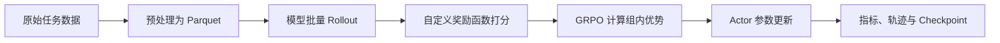

# veRL 最初步使用笔记

## 1. 一句话认识 veRL

veRL 是一个用于大模型强化学习后训练的框架。对最简单的、单轮、规则奖励 GRPO 任务，可以把它理解成下面这条流水线：



因此，“准备数据 + 自定义奖励函数 + 修改配置 + 启动训练”这个理解基本正确。不过在真正启动前，还必须同时确认模型、推理后端、显存、日志与保存路径等运行参数。

> [!IMPORTANT]
> 官方仓库当前没有独立的 `grpo_trainer.yaml` 作为默认入口。GRPO 仍从 `verl.trainer.main_ppo` 启动，基础配置是 `verl/trainer/config/ppo_trainer.yaml`，并通过 `algorithm.adv_estimator=grpo` 选择 GRPO。

## 2. 最小训练闭环需要准备什么

| 环节 | 必须准备的内容 | 主要入口 |
| --- | --- | --- |
| 数据 | 训练集与验证集 Parquet | `data.train_files`、`data.val_files` |
| 模型 | Hugging Face 模型或本地模型目录 | `actor_rollout_ref.model.path` |
| 奖励 | 能给每条模型回答返回分数的函数 | `reward.custom_reward_function.*` |
| 算法 | 选择 GRPO，并设置每题采样数量 | `algorithm.adv_estimator`、`actor_rollout_ref.rollout.n` |
| 训练批次 | 采样批次、更新批次、单卡微批次 | `data.train_batch_size`、Actor batch 参数 |
| 运行资源 | 节点、GPU、推理并行和显存占比 | `trainer.*`、`actor_rollout_ref.rollout.*` |
| 记录与保存 | Logger、验证频率、Checkpoint 路径 | `trainer.logger`、`trainer.save_freq` 等 |

在实际项目中，推荐从官方 `examples/grpo_trainer/` 中复制一个与模型规模、训练后端最接近的启动脚本，再修改其中的 Hydra 覆盖参数。这样仍然使用 `ppo_trainer.yaml`，但不必直接维护一份完整配置副本。

## 3. 数据：离线 Parquet 只描述初始任务

### 3.1 常见字段

官方 `examples/data_preprocess/gsm8k.py` 生成的数据大致如下：

```python
{
    "data_source": "openai/gsm8k",
    "prompt": [
        {"role": "user", "content": "题目与回答要求"}
    ],
    "ability": "math",
    "reward_model": {
        "style": "rule",
        "ground_truth": "参考答案"
    },
    "extra_info": {
        "split": "train",
        "index": 0
    }
}
```

| 字段 | 定位 | 是否总是必需 |
| --- | --- | --- |
| `data_source` | 标识数据来源，也可用于为不同数据选择不同奖励逻辑 | 通常需要 |
| `prompt` | 输入模型的对话消息列表 | 必需 |
| `ability` | 任务能力标签，如 `math`、`code` | 可选元数据 |
| `reward_model` | 奖励所需信息，规则奖励常把标准答案放在 `ground_truth` | 取决于奖励函数 |
| `extra_info` | 样本编号、原始问题、测试用例等附加信息 | 取决于奖励函数和分析需求 |

这里的 `reward_model` 不等于“一定要训练或加载一个奖励模型”。它也是 veRL 数据格式中承载奖励元数据的字段；使用规则奖励时，完全可以只保存标准答案或测试用例。

### 3.2 DataFrame 与 Parquet 的关系

常见数据处理流程是：

1. 读取 JSON、JSONL 或 Hugging Face Dataset。
2. 映射成上面的逐行结构。
3. 用 Pandas DataFrame 或 Dataset 作为中间容器。
4. 写出训练和验证 Parquet。

DataFrame 只是方便加工数据的中间形式；veRL 训练时真正读取的是配置指定的 Parquet 文件。

### 3.3 数据不包含在线 Rollout 轨迹

最初的 Parquet 通常只保存问题、初始 Prompt、标准答案和元数据。模型在训练时生成的回答，乃至多轮工具调用轨迹，都是 Rollout 阶段动态产生的，不需要提前塞入训练 Parquet。

## 4. 奖励函数：把模型输出映射为分数

### 4.1 最小接口

当前 veRL 会根据配置动态加载 Python 文件中的函数。常见写法如下：

```python
def compute_score(
    data_source,
    solution_str,
    ground_truth,
    extra_info=None,
    **kwargs,
):
    predicted = extract_answer(solution_str)
    return 1.0 if predicted == ground_truth else 0.0
```

然后在配置或启动脚本中指向它：

```yaml
reward:
  custom_reward_function:
    path: /absolute/path/to/reward.py
    name: compute_score
```

对应的命令行覆盖形式是：

```bash
reward.custom_reward_function.path=/absolute/path/to/reward.py \
reward.custom_reward_function.name=compute_score
```

> [!NOTE]
> 不同 veRL 版本的配置层级有变化。旧版本可能使用顶层 `custom_reward_function.path`，当前官方版本使用 `reward.custom_reward_function.path`。应以当前仓库的 `ppo_trainer.yaml`、`reward.yaml` 和 `verl/trainer/ppo/reward.py` 为准。

### 4.2 奖励可以检查什么

简单奖励通常组合以下一项或多项：

- 输出格式是否符合协议；
- 最终答案是否和标准答案一致；
- 数学表达式是否等价；
- 代码是否能运行、是否通过测试用例；
- 外部 Judge 模型是否认可回答；
- 工具使用过程是否满足约束。

奖励函数处在训练主路径上。外部服务超时、异常未捕获或执行器不安全，都会直接影响吞吐和训练稳定性。

## 5. 配置文件重点改什么

### 5.1 必须修改

| 配置 | 作用 |
| --- | --- |
| `algorithm.adv_estimator=grpo` | 选择 GRPO |
| `data.train_files`、`data.val_files` | 指定训练、验证 Parquet |
| `actor_rollout_ref.model.path` | 指定待训练模型 |
| `reward.custom_reward_function.path/name` | 加载自定义奖励函数 |
| `actor_rollout_ref.rollout.name` | 选择 Rollout 后端，如 vLLM |
| `trainer.n_gpus_per_node`、`trainer.nnodes` | 声明训练资源 |
| `trainer.project_name`、`trainer.experiment_name` | 区分实验记录与保存目录 |

### 5.2 首次训练重点调节

| 配置 | 主要影响 |
| --- | --- |
| `data.max_prompt_length` | Prompt 显存和可容纳长度 |
| `data.max_response_length` | Rollout 长度、KV Cache 和训练显存 |
| `data.train_batch_size` | 每个训练迭代取出的 Prompt 数量 |
| `actor_rollout_ref.rollout.n` | 每个 Prompt 生成几条回答；GRPO 依靠同组样本比较奖励 |
| `actor_rollout_ref.actor.ppo_mini_batch_size` | 一次策略更新的 Mini-batch 大小 |
| `actor_rollout_ref.actor.ppo_micro_batch_size_per_gpu` | 单卡一次前后向处理的样本数，OOM 时优先减小 |
| `actor_rollout_ref.actor.optim.lr` | Actor 学习率 |
| `actor_rollout_ref.rollout.tensor_model_parallel_size` | 推理模型的张量并行大小 |
| `actor_rollout_ref.rollout.gpu_memory_utilization` | 推理引擎用于 KV Cache 等的显存比例 |
| `actor_rollout_ref.rollout.temperature/top_p` | 采样多样性 |
| `trainer.total_epochs` | 训练轮数 |

批次之间可以先形成下面这个直觉：若 `data.train_batch_size=64`、`rollout.n=5`，一个训练迭代会围绕 64 个 Prompt 产生最多 320 条回答。之后 Actor 的 Mini-batch 和 Micro-batch 再决定这些轨迹如何分块更新，并不改变“64 个问题、每题 5 个候选”的组结构。

### 5.3 记录与保存相关

| 配置 | 作用 |
| --- | --- |
| `trainer.logger` | 输出到 `console`、W&B、TensorBoard 等后端 |
| `trainer.log_val_generations` | 向支持的 Logger 记录若干验证样例 |
| `trainer.rollout_data_dir` | 非空时把训练 Rollout 写到磁盘 |
| `trainer.validation_data_dir` | 非空时保存验证生成结果 |
| `trainer.save_freq` | 按训练 Step 保存 Checkpoint |
| `trainer.test_freq` | 按训练 Step 执行验证 |
| `trainer.default_local_dir` | Checkpoint 根目录 |
| `trainer.resume_mode` | 自动恢复、禁用恢复或从指定路径恢复 |

## 6. 启动训练

最直接的启动形式如下，实际项目通常把这些覆盖项写入 Shell 脚本：

```bash
python3 -m verl.trainer.main_ppo \
  algorithm.adv_estimator=grpo \
  data.train_files=/data/train.parquet \
  data.val_files=/data/test.parquet \
  data.train_batch_size=64 \
  actor_rollout_ref.model.path=/models/Qwen \
  actor_rollout_ref.rollout.name=vllm \
  actor_rollout_ref.rollout.n=5 \
  reward.custom_reward_function.path=/workspace/reward.py \
  reward.custom_reward_function.name=compute_score \
  trainer.n_gpus_per_node=8 \
  trainer.nnodes=1 \
  trainer.project_name=my_grpo \
  trainer.experiment_name=first_run
```

配置写对并不代表任何机器上都能立即“一键成功”。第一次正式训练前至少做三层检查：

1. 奖励函数能用一条手工样本独立运行。
2. Parquet 字段与 `prompt_key`、奖励函数入参一致。
3. 用小 Batch、短 Response、少量 Step 做 Smoke Test，确认 Rollout、打分、反向传播和保存都走通。

## 7. veRL 会记录哪些训练信息

### 7.1 标量指标

不同版本和后端的指标名会变化，但通常包括：

- 奖励：总体分数、各奖励分量、组内奖励分布；
- 数据：Prompt/Response 长度、有效 Token 数、截断情况；
- 策略更新：Actor Loss、Clip Fraction、KL、Entropy、梯度范数；
- GRPO：Advantage、Return、每组有效样本情况；
- 性能：生成、奖励、Log-prob、更新各阶段耗时，吞吐和显存相关统计；
- 验证：验证集平均奖励和按 `data_source` 划分的结果。

### 7.2 生成轨迹

设置 `trainer.rollout_data_dir` 后，训练器可记录每条样本的输入、模型输出、总分，以及奖励函数额外返回的分量。设置 `trainer.validation_data_dir` 后，可保存验证生成结果。

这类轨迹对排查以下问题尤其重要：

- 奖励上涨是否只是学会钻格式漏洞；
- 模型是否频繁被最大长度截断；
- 同一 Prompt 的多条候选是否有足够差异；
- 奖励函数与人类直觉是否一致。

### 7.3 Checkpoint 与恢复状态

Checkpoint 默认写入：

```text
checkpoints/<project_name>/<experiment_name>/global_step_<N>/
```

通常包含 Actor 状态、优化器或分片状态、数据加载器进度，以及用于定位最新 Step 的文件。GRPO 不使用 Critic 时不会产生有效的 Critic 训练状态。能否直接用 Hugging Face 加载，应以所选后端的 Checkpoint 格式和模型合并工具为准。

## 8. 多卡与显存：先区分训练和 Rollout 两层

veRL 的资源编排由 Ray 完成，模型训练和 Rollout 又各自使用不同的分布式策略：

- Actor 使用 FSDP/FSDP2 时，可以切分参数、梯度和优化器状态；其效果接近 ZeRO-3 的 Full Shard 思路，而不只是切优化器状态。
- Rollout 使用 vLLM 等推理引擎时，常由 Tensor Parallel、Data Parallel 和 KV Cache 配置决定显存布局。
- 传统 `hybrid_engine=true` 配置通常让 Actor 与 Rollout 共用同一批 GPU，按阶段切换用途，并不是静态划出“训练卡”和“生成卡”。

当前官方 veRL 已出现 `trainer.v1.trainer_mode=separate_async`、独立 Rollout 节点与 GPU 数等配置，但这属于异步、分离部署能力，需要对应版本和部署方式配套，不是只把 `n_gpus_per_node` 从 4 改成 2 就能完成资源切分。

## 9. 建议的首次实验顺序

1. 先使用官方已有数据和奖励脚本，验证环境安装。
2. 保留官方模型与训练配置，只替换自己的 Parquet。
3. 再接入自定义奖励函数，并把奖励分量记录出来。
4. 用单机、小模型、短序列、小 Batch 跑通数个 Step。
5. 观察轨迹和显存后，再增加 `rollout.n`、长度和 Batch。
6. 最后再考虑多轮工具、独立 Rollout 集群或自定义 Ray Trainer。

## 10. 源码阅读入口

| 优先级 | 官方文件 | 阅读目的 |
| --- | --- | --- |
| P0 | `verl/trainer/main_ppo.py` | 训练程序如何加载配置、模型、Worker 和奖励 |
| P0 | `verl/trainer/config/ppo_trainer.yaml` | 总配置入口与 Trainer 参数 |
| P0 | `examples/grpo_trainer/*.sh` | 一次可运行 GRPO 实验真正覆盖了哪些参数 |
| P0 | `examples/data_preprocess/*.py` | Parquet 的标准构造方式 |
| P0 | `verl/trainer/ppo/reward.py` | 自定义奖励函数如何动态加载 |
| P1 | `verl/trainer/ppo/ray_trainer.py` | Rollout、奖励、优势和更新的主循环 |
| P1 | `verl/trainer/config/data/legacy_data.yaml` | 数据长度、批次和字段配置 |
| P1 | `verl/trainer/config/actor/`、`rollout/` | Actor 更新和推理引擎的详细参数 |

## 11. 最小检查清单

- [ ] Parquet 可以读取，且 `prompt` 是消息列表。
- [ ] 奖励函数对正确、错误和异常输出都有确定结果。
- [ ] `algorithm.adv_estimator=grpo`。
- [ ] `rollout.n` 大于 1，且同组样本能形成奖励差异。
- [ ] 模型路径、数据路径、奖励文件路径均可访问。
- [ ] Prompt 长度、Response 长度和 Micro-batch 不会 OOM。
- [ ] Logger、Checkpoint、Rollout dump 路径已经设置。
- [ ] 先完成短程 Smoke Test，再启动长训练。

## 参考源码

- [veRL `main_ppo.py`](https://github.com/verl-project/verl/blob/2781c1e405fa80871a838bfdf9495b412df19c35/verl/trainer/main_ppo.py)
- [veRL `ppo_trainer.yaml`](https://github.com/verl-project/verl/blob/2781c1e405fa80871a838bfdf9495b412df19c35/verl/trainer/config/ppo_trainer.yaml)
- [veRL GRPO 示例](https://github.com/verl-project/verl/tree/2781c1e405fa80871a838bfdf9495b412df19c35/examples/grpo_trainer)
- [veRL GSM8K 数据预处理](https://github.com/verl-project/verl/blob/2781c1e405fa80871a838bfdf9495b412df19c35/examples/data_preprocess/gsm8k.py)
