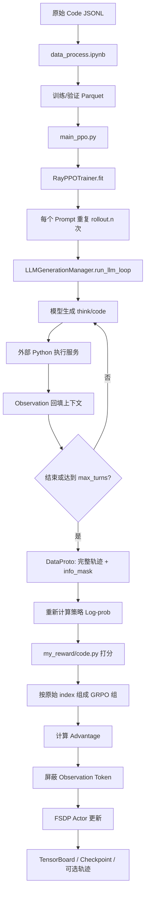
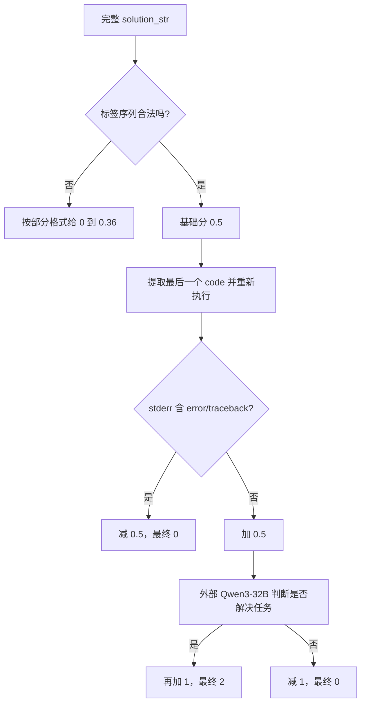

# Agentic RL 实例——code-r1 学习笔记

## 1. 项目定位

code-r1 是一个基于 veRL 改造的 Code Agent 强化学习原型。它让模型在 Rollout 中不只生成一次答案，而是可以反复执行下面的循环：

```text
思考 → 生成 Python 代码 → 环境执行代码 → 读取运行结果 → 继续思考 → 最终回答
```

它属于 Agentic RL，因为策略模型的动作会触发外部代码执行环境，环境返回的 Observation 又会改变后续动作。使它具有 Agent 性质的不是 GRPO 本身，而是插入 veRL Rollout 阶段的多轮“模型—环境”交互循环。

> [!NOTE]
> 本目录保存的 [code-r1 源码](./code-r1/) 来自 `wyf3/llm_related` 提交 `a492338`。该项目基于较早版本的 veRL 修改，不能把它的配置字段直接套到当前官方 veRL。

## 2. 它能训练什么能力

这套实现主要训练模型获得以下能力：

- 按 `<think>`、`<code>`、`<observation>`、`<answer>` 协议组织输出；
- 判断什么时候需要调用 Python 执行环境；
- 生成能运行的 Python 代码；
- 阅读标准输出和错误输出；
- 根据 Observation 修正代码或推理；
- 在若干轮工具交互后给出最终答案。

它适合代码解释器式问答、需要 Python 辅助求解的推理题和可通过执行结果验证的任务。它还不是通用 Agent 平台：工具只有一个硬编码的 Python 执行服务，协议固定，调度同步，最终正确性依赖外部 Judge 模型。

## 3. 相对原始 veRL 改了什么

可以把改动归纳成五个核心点：

| 改动层 | 核心文件 | 作用 |
| --- | --- | --- |
| 数据适配 | [`data/data_process.ipynb`](./code-r1/data/data_process.ipynb) | 把 Code 任务改造成 veRL Parquet，并写入 Agent 输出协议 |
| 实验配置 | [`verl/trainer/config/grpo_trainer.yaml`](./code-r1/verl/trainer/config/grpo_trainer.yaml) | 指定 GRPO、模型、Batch、Rollout、LoRA、奖励和多轮参数 |
| Agent Rollout | [`search_r1/llm_agent/generation.py`](./code-r1/search_r1/llm_agent/generation.py) | 实现模型生成、代码执行、Observation 回填和多轮终止 |
| 轨迹张量辅助 | [`search_r1/llm_agent/tensor_helper.py`](./code-r1/search_r1/llm_agent/tensor_helper.py) | 处理变长轨迹、Padding、Attention Mask 和 Position ID |
| 训练链路接入 | [`verl/trainer/ppo/ray_trainer.py`](./code-r1/verl/trainer/ppo/ray_trainer.py) | 把自定义多轮轨迹接回 veRL 的奖励、GRPO Advantage 和 Actor 更新 |
| 奖励 | [`my_reward/code.py`](./code-r1/my_reward/code.py) | 检查格式、重新执行代码，并让外部 LLM 判断任务是否解决 |

[`verl/trainer/main_ppo.py`](./code-r1/verl/trainer/main_ppo.py) 仍然是启动入口。它没有把 Search-R1 当作某个“Agent 环境参数”加载；真正的接入点是被直接修改过的 `ray_trainer.py`。

## 4. 端到端训练链路



最重要的理解是：Parquet 里没有完整 Agent 轨迹。轨迹在每个训练 Step 的 Rollout 阶段在线生成，先保存在内存中的 `DataProto`，再直接用于奖励和训练。

## 5. 核心文件阅读优先级

### P0：先读，决定任务是否能跑

| 文件 | 重点位置 | 应理解的问题 |
| --- | --- | --- |
| [`data_process.ipynb`](./code-r1/data/data_process.ipynb) | `INSTRUCTIONS`、数据映射和 Parquet 写出 | 模型收到什么任务，奖励能读取什么元数据 |
| [`grpo_trainer.yaml`](./code-r1/verl/trainer/config/grpo_trainer.yaml) | `data`、`actor_rollout_ref`、`custom_reward_function`、`algorithm`、`trainer`、末尾两项 | 路径、显存、采样、更新、日志和多轮循环如何配置 |
| [`generation.py`](./code-r1/search_r1/llm_agent/generation.py) | `run_llm_loop`、`execute_predictions` | Agent 如何循环，什么时候调用代码环境，何时结束 |
| [`ray_trainer.py`](./code-r1/verl/trainer/ppo/ray_trainer.py) | `fit` 中的“改动部分”、`_create_loss_mask` | Agent 轨迹如何进入 veRL 的 GRPO 主循环 |
| [`my_reward/code.py`](./code-r1/my_reward/code.py) | `is_valid_sequence`、`compute_score` | 奖励实际鼓励了什么行为，有哪些漏洞和外部依赖 |

### P1：理解张量与分布式行为时再读

| 文件 | 定位 |
| --- | --- |
| [`tensor_helper.py`](./code-r1/search_r1/llm_agent/tensor_helper.py) | 保证不同长度、不同轮数的轨迹能组成规整 Batch |
| [`main_ppo.py`](./code-r1/verl/trainer/main_ppo.py) | 初始化 Ray、Worker、Reward Manager 和资源池 |
| `verl/workers/fsdp_workers.py` | Actor、Rollout 和 Reference Worker 如何加载与执行 |
| `verl/utils/reward_score/` | veRL 原有规则奖励的组织方式 |

### P2：首轮可以略读

- Search-R1 遗留的搜索命名和未使用分支；
- Critic 配置，因为当前 GRPO 不使用 Critic；
- `reward_model.enable=false` 下的模型式 Reward Model 配置；
- Profiling、Megatron、HDFS、多模态等与当前实验无关的部分；
- veRL 的通用 Ray 通信和底层 Checkpoint 实现。

## 6. 数据处理：把 Code 任务变成 veRL 样本

### 6.1 实际处理过程

[`data_process.ipynb`](./code-r1/data/data_process.ipynb) 做了四件事：

1. 读取 `python-codes-25k.jsonl`。
2. 拼接原始样本中的 `instruction` 和 `input`。
3. 用 `INSTRUCTIONS` 包装问题，明确输出标签协议。
4. 组装 DataFrame，再写成 `code_train.parquet` 和 `code_val.parquet`。

项目当前用前 2000 条作为训练数据、末尾 100 条作为验证数据。这是实验性切分，不是通用的数据集划分策略。

### 6.2 一行数据表达什么

逻辑结构如下：

```python
{
    "data_source": "code",
    "prompt": [
        {
            "role": "user",
            "content": "Agent 协议说明 + 原始 Code 任务"
        }
    ],
    "ability": "text",
    "reward_model": {
        "style": "rule",
        "ground_truth": ""
    },
    "extra_info": {
        "split": "train",
        "index": 0,
        "user_message": "原始任务"
    }
}
```

| 字段 | 在本项目中的用途 |
| --- | --- |
| `data_source` | 标记为 `code`，传给奖励函数 |
| `prompt` | 告诉模型任务和标签协议，是初始 Agent 状态 |
| `ability` | 写成 `text`，只是元数据，不直接决定模型训练能力 |
| `reward_model.ground_truth` | 当前为空，奖励函数也没有使用它 |
| `extra_info.index` | 把同一个 Prompt 的多条 Rollout 归为一个 GRPO 组 |
| `extra_info.user_message` | 交给外部 Judge 判断完整轨迹是否解决原始问题 |

> [!IMPORTANT]
> `ability` 不是“声明模型将获得某种能力”的开关。能力来自数据分布、Rollout 行为空间和奖励信号；`ability` 主要用于分类、采样或统计。

### 6.3 数据中的约束在哪里

Agent 格式不是只由 `Instruction` 约束，而是有三层：

| 层次 | 位置 | 强度 |
| --- | --- | --- |
| Prompt 约束 | Notebook 中的 `INSTRUCTIONS` | 软约束：告诉模型应该怎样输出 |
| Rollout 解析约束 | `generation.py` 的标签解析和截断 | 运行约束：决定何时执行代码、何时结束 |
| 奖励约束 | `my_reward/code.py::is_valid_sequence` | 学习约束：格式不符合时奖励较低 |

三层应当保持一致。只改 Instruction 而不改解析器和奖励，模型可能被要求输出一种格式，但环境根本无法识别。

## 7. `grpo_trainer.yaml`：1100 行配置该看什么

这份文件是旧版 veRL 完整配置的副本，大量字段不是本项目首轮阅读重点。

### 7.1 P0：换机器或换任务必须检查

| 配置区域 | 本项目当前值或含义 | 需要做什么 |
| --- | --- | --- |
| `data.train_files/val_files` | 指向作者机器上的 Parquet | 改为真实绝对路径 |
| `actor_rollout_ref.model.path` | Qwen2.5-3B-Instruct | 改为本地模型路径 |
| `custom_reward_function.path` | 指向作者目录下的 `code.py` | 改为本项目实际奖励文件路径 |
| `algorithm.adv_estimator` | `grpo` | 保持为 GRPO |
| `trainer.n_gpus_per_node/nnodes` | 单机 2 卡 | 按实际资源设置 |
| `trainer.logger` | TensorBoard | 设置实验记录后端与目录 |
| `trainer.default_local_dir` | Checkpoint 根目录 | 确认可写且空间足够 |
| `max_turns` | 5 | 控制最多代码交互轮数 |
| `do_search` | `True` | `True` 才走自定义 Agent Rollout |

`do_search` 是 Search-R1 遗留命名。在这个项目中，它实际表示“是否启用代码执行多轮 Rollout”，不是联网搜索开关。

### 7.2 P1：主要影响显存和吞吐

| 配置 | 当前值 | 作用 |
| --- | --- | --- |
| `data.train_batch_size` | 16 | 每个训练迭代的原始 Prompt 数 |
| `data.val_batch_size` | 8 | 验证 Prompt 数 |
| `data.max_prompt_length` | 1024 | 滚动上下文长度上限之一 |
| `data.max_response_length` | 4096 | 完整响应预算 |
| `data.max_start_length` | 1024 | 保留的初始 Prompt 长度 |
| `data.max_obs_length` | 1000 | 单次 Observation 最大 Token 数 |
| `actor.ppo_mini_batch_size` | 8 | Actor 更新 Mini-batch |
| `actor.ppo_micro_batch_size_per_gpu` | 2 | 单卡前后向微批次 |
| `rollout.n` | 8 | 每个 Prompt 采样 8 条轨迹 |
| `rollout.tensor_model_parallel_size` | 2 | vLLM 推理张量并行 |
| `rollout.gpu_memory_utilization` | 0.3 | vLLM 可使用的显存比例 |
| `model.lora_rank/lora_alpha` | 32/16 | 使用 LoRA 更新 Actor |

当前配置的一个训练迭代是：16 个 Prompt，每个 Prompt 复制 8 份，最多形成 128 条在线轨迹。`ppo_mini_batch_size` 和 `ppo_micro_batch_size_per_gpu` 再决定这 128 条轨迹如何切分更新。

### 7.3 P2：确认能跑后再调

- `actor.optim.lr`：当前为 `1e-6`；
- `rollout.temperature`、`top_p`：控制同题候选的多样性；
- PPO Clip、KL、Entropy 参数：控制更新幅度和探索；
- `trainer.total_epochs`、保存与验证频率；
- FSDP Offload、Gradient Checkpointing 和动态 Batch。

### 7.4 首轮可以不看

- `critic` 整段：GRPO 通过组内相对奖励估计 Advantage，当前不训练 Critic；
- `reward_model` 模型配置：项目设置为不启用，实际走自定义规则奖励；
- `actor_rollout_ref.rollout.multi_turn`：这里仍为关闭，因为项目没有用 veRL 原生多轮接口，而是自己改了 `ray_trainer.py`；
- Nsight Profiling、HDFS、Megatron 等高级能力。

### 7.5 启动方式

`main_ppo.py` 的默认配置名仍是 `ppo_trainer`，因此要显式选择项目新增的配置：

```bash
cd code-r1
python3 -m verl.trainer.main_ppo --config-name=grpo_trainer
```

在运行前必须先修改绝对路径和外部服务地址。源码中没有一份已经封装好这些依赖的完整一键启动脚本。

## 8. `generation.py`：Agent 交互循环

### 8.1 它不是 veRL 默认环境入口

veRL 不会因为目录叫 `search_r1` 就自动加载它。接入发生在 [`ray_trainer.py`](./code-r1/verl/trainer/ppo/ray_trainer.py) 的直接导入：

```python
from search_r1.llm_agent.generation import (
    LLMGenerationManager,
    GenerationConfig,
)
```

然后 `RayPPOTrainer.fit()` 根据顶层 `do_search`，选择标准单轮生成或 `generation_manager.run_llm_loop()`。

### 8.2 输出协议

允许的核心轨迹可以写成：

```text
(THINK → CODE → OBSERVATION)* → THINK → ANSWER
```

也允许模型不调用代码，直接输出 `THINK → ANSWER`。

环境只接受以下标签：

```text
<think>...</think>
<code>...</code>
<observation>...</observation>
<answer>...</answer>
```

模型生成 `</code>` 后，`_postprocess_responses()` 会截断本轮输出。随后环境执行代码并插入真实 `<observation>`，因此模型不能靠在同一次生成中伪造执行结果。

### 8.3 主循环中的状态

`run_llm_loop()` 同时维护四类关键状态：

| 状态 | 含义 |
| --- | --- |
| `rollings` | 当前下一轮要送给模型的上下文 |
| `original_left_side` | 保留的原始 Prompt |
| `original_right_side.responses` | 从第一轮开始积累的完整响应与 Observation |
| `responses_with_info_mask` | 把环境 Observation 位置替换为 Padding 的响应副本 |
| `active_mask` | 哪些轨迹尚未输出最终答案 |

每一轮只对 `active_mask=True` 的样本生成，再通过 Padding 恢复成原始 Batch 大小。已经完成的轨迹不会继续调用模型和代码执行器。

### 8.4 关键函数调用链

```text
run_llm_loop
├── _generate_with_gpu_padding
│   └── actor_rollout_wg.generate_sequences
├── _postprocess_responses
│   └── _batch_tokenize
├── execute_predictions
│   ├── postprocess_predictions
│   ├── extract_code / extract_answer
│   └── batch_search
│       └── exec_code
├── _process_next_obs
├── _update_rolling_state
├── _update_right_side
│   └── _info_masked_concatenate_with_padding
└── _compose_final_output
```

| 函数 | 作用 |
| --- | --- |
| `_generate_with_gpu_padding` | 把活跃样本数补齐到 GPU 数的倍数，生成后再去掉占位样本 |
| `_postprocess_responses` | 解码输出，并在第一个 `</code>` 或 `</answer>` 处停止本轮 |
| `execute_predictions` | 判断模型要执行代码还是结束，并返回 Observation 与 Done |
| `_process_next_obs` | Tokenize 环境返回，截断过长 Observation |
| `_update_rolling_state` | 拼接上下文、重建 Attention Mask 与 Position ID |
| `_update_right_side` | 积累最终训练用的完整响应，同时构造 Observation Mask |
| `_compose_final_output` | 生成 veRL 需要的 Prompt、Response、Mask 等张量 |

### 8.5 需要读到多细

如果目标是迁移这套思路，重点读 `run_llm_loop()`、`execute_predictions()` 和最终输出字段即可。不需要先逐行研究所有 Padding 操作。只有在出现长度错位、Mask 错误、多卡 Batch 不能整除等问题时，才继续深入辅助函数。

## 9. 在线轨迹如何成为训练素材

假设原始 Prompt 是“用代码求 1 到 5 的和”，一次 Rollout 可能形成：

```text
Prompt:
  用代码求 1 到 5 的和。

模型第 1 轮:
  <think>可以直接计算。</think>
  <code>print(sum(range(1, 6)))</code>

环境返回:
  <observation>Code output: 15
  Errors: </observation>

模型第 2 轮:
  <think>运行结果是 15。</think>
  <answer>15</answer>
```

最终不会再写成一行 Parquet，而是成为内存中的 `DataProto`：

```text
prompts   = 初始 Prompt Token
responses = 模型第1轮 + Observation + 模型第2轮
input_ids = prompts + responses
attention_mask = Prompt、模型输出、Observation 都可见
position_ids   = 与完整上下文对应的位置
info_mask      = 模型输出为 1，环境 Observation 为 0
```

这里要区分两种 Mask：

- `attention_mask=1`：模型后续生成时必须看到 Observation；
- `info_mask=0`：更新策略时不把 Observation 当成模型应该预测的 Token。

因此，一条轨迹的学习目标可以简化为：

```text
模型动作     Observation     模型动作
   训练           不训练          训练
```

这一步是 Agent 轨迹进入策略梯度训练的关键。

## 10. `tensor_helper.py`：轨迹的张量排版工具

[`tensor_helper.py`](./code-r1/search_r1/llm_agent/tensor_helper.py) 不决定 Agent 做什么，也不负责任务奖励。它解决的是工程问题：同一个 Batch 中，有的轨迹一轮结束，有的轨迹执行五轮；每轮文本和 Observation 长度也不同，最后仍必须拼成矩形张量。

主要函数定位如下：

| 函数 | 作用 |
| --- | --- |
| `cut_to_effective_len` | 去掉 Batch 中没有实际 Token 的冗余列 |
| `convert_pad_structure` | 在左 Padding 与右 Padding 结构之间转换 |
| `create_attention_mask` | 根据 Pad Token 构造可见位置 |
| `create_position_ids` | 根据 Attention Mask 重建 Position ID |
| `concatenate_with_padding` | 拼接上下文、模型输出和 Observation 后重新对齐 |
| `_example_level_pad` | 把只对活跃轨迹生成的结果放回完整 Batch |

一句话定位：`generation.py` 决定交互内容和控制流，`tensor_helper.py` 保证变长交互在张量层面不乱。

## 11. `ray_trainer.py`：最关键的 veRL 接入点

这份文件比 `generation.py` 更值得优先阅读，因为它决定自定义 Agent 轨迹是否真正进入 GRPO。

### 11.1 初始化 Agent Rollout

`fit()` 从配置读取：

- `max_turns`；
- `max_start_length`；
- `max_prompt_length`；
- `max_response_length`；
- `max_obs_length`；
- 总 GPU 数。

然后构造 `GenerationConfig` 和 `LLMGenerationManager`。

### 11.2 为 GRPO 复制同题样本

```python
gen_batch = gen_batch.repeat(
    repeat_times=self.config.actor_rollout_ref.rollout.n,
    interleave=True,
)
```

若原始 Batch 是 `[A, B]`，`n=3` 后得到 `[A, A, A, B, B, B]`。这样每个问题都有一组候选轨迹，可依据组内奖励差异计算 Advantage。

### 11.3 选择标准生成或 Agent 生成

```text
do_search = False → actor_rollout_wg.generate_sequences
do_search = True  → generation_manager.run_llm_loop
```

Agent 分支得到完整多轮轨迹后，还会调用 `compute_log_prob()` 重新计算整条可训练响应的策略概率，再与原始 Batch 合并。

### 11.4 用 `index` 建立 GRPO 组

标准分支会生成随机 `uid`；Agent 分支则把原始数据的 `index` 复制为 `uid`。同一问题重复的 8 条轨迹具有相同 `uid`，GRPO 才知道它们属于同一比较组。

这也意味着 `extra_info.index` 必须稳定且能区分不同 Prompt。若索引重复或丢失，组内 Advantage 可能被错误计算。

### 11.5 奖励与 Advantage

轨迹合并后，后续大体沿用 veRL 流程：

1. 自定义奖励函数产生 `token_level_scores`。
2. 可选地加入 KL 项，形成 `token_level_rewards`。
3. 按 `uid` 和 `rollout.n` 计算 GRPO Advantage。
4. 进入 Actor 更新。

### 11.6 更新前屏蔽 Observation

`_create_loss_mask()` 把响应区的 `info_mask` 写入 `response_mask`。这样代码执行器返回的文本虽然参与后续推理，却不会产生语言模型损失。

这是 code-r1 对 veRL 训练语义最关键的修改之一：环境状态是上下文，不是策略动作。

## 12. 奖励函数实际在做什么

[`my_reward/code.py`](./code-r1/my_reward/code.py) 的奖励顺序是：



### 12.1 格式检查

`is_valid_sequence()` 是一个标签状态机，要求：

- 标签成对；
- 从 `<think>` 开始；
- `<code>` 后必须接 `<observation>`；
- Observation 后可继续新一轮 `<think>`；
- 最终以 `<answer>` 结束；
- 标签之间不能出现额外文本。

格式非法时不是“减分”，而是按局部特征给 0 到 0.36 的塑形奖励。例如正确开头、正确结尾、成对标签都会获得少量分数。

### 12.2 代码执行检查

格式合法时基础分为 0.5。奖励函数提取最后一个 `<code>` 代码块，通过外部服务再次执行：

- `stderr` 含 `error` 或 `traceback`：减 0.5；
- 否则加 0.5。

这里只检查最后一个代码块，而且只靠错误文本关键词判断，不能证明结果正确。没有代码块时会得到空的 `stderr`，也可能被当作“没有执行错误”。

### 12.3 最终正确性判断

没有检测到执行错误后，奖励函数把下面两项交给外部 Qwen3-32B：

- `extra_info.user_message` 中的原始问题；
- 完整 `solution_str`，也就是思考、代码、Observation 和答案轨迹。

Judge 被要求只回答“是”或“否”：

- 精确返回“是”：加 1；
- 其他输出：减 1。

因此，最终正确性是外部模型对完整执行过程的判断，不是拿提取出的 `<answer>` 与标准答案比较。`ground_truth` 在当前主奖励路径中没有使用，`extract_answer()` 也没有参与 `compute_score()`。

### 12.4 当前奖励范围

| 情况 | 最终分数 |
| --- | --- |
| 格式非法 | 0 到 0.36 |
| 格式合法，但最后代码报错 | 0 |
| 格式合法、无检测到的错误、Judge 否 | 0 |
| 格式合法、无检测到的错误、Judge 是 | 2 |

这意味着有效样本最终几乎是二值奖励 0 或 2，格式非法样本得到少量塑形分。

## 13. 外部依赖与真正启动前的阻塞项

项目源码包含两个不能直接在其他机器复用的外部依赖：

| 依赖 | 使用位置 | 当前问题 |
| --- | --- | --- |
| Python 代码执行 HTTP 服务 | `generation.py`、`my_reward/code.py` | 地址硬编码为内网 IP |
| OpenAI 兼容 Judge 服务 | `my_reward/code.py` | Base URL 与 API Key 是占位/私有配置 |

还需要修改：

- Parquet 绝对路径；
- 模型绝对路径；
- 自定义奖励函数路径；
- TensorBoard/Checkpoint 输出目录；
- vLLM、Ray、PyTorch 与 CUDA 版本；
- 代码执行服务的超时、并发和安全隔离。

所以，这份源码不是克隆后即可一键训练的完整产品。它展示的是接入方法，运行环境仍需要补齐。

## 14. 多卡与资源分配

### 14.1 Actor 分片

配置中 Actor 使用 `strategy: fsdp`，`fsdp_size: -1` 表示在训练 Worker 范围内进行完整分片。参数、梯度和优化器状态都会分片，整体思路接近 ZeRO-3，而不是只切分优化器状态。

### 14.2 Rollout 并行

Rollout 使用 vLLM，并设置 `tensor_model_parallel_size: 2`。它描述的是推理模型如何跨卡，不等同于 Actor 的 FSDP 分片方式。

### 14.3 不能简单配置成 2 卡训练、2 卡 Rollout

[`main_ppo.py`](./code-r1/verl/trainer/main_ppo.py) 把 `Role.ActorRollout` 映射到同一个 `global_pool`，且配置写明 `hybrid_engine: true`。Actor 与 Rollout 复用同一资源池，按阶段切换工作。

因此，在 4 张卡上静态划分“2 张只训练、2 张只 Rollout”，不能只靠改 `n_gpus_per_node` 或 `tensor_model_parallel_size` 完成。需要改资源池映射、拆 Worker、增加跨池权重同步，并让自定义多轮循环调用独立 Rollout 服务。这个 code-r1 版本没有实现这些能力。

## 15. 训练会记录什么

当前配置使用 TensorBoard，标准 veRL 主循环会记录：

- 奖励、Advantage、Return；
- Actor Loss、KL、Entropy、Clip 等策略指标；
- Prompt 和 Response 长度；
- 生成、奖励、Log-prob、Actor 更新等阶段耗时；
- 吞吐；
- code-r1 新增的 `state_tokens/total` 和 `state_tokens/coverage`，用于观察 `info_mask` 覆盖情况。

另外：

- `trainer.rollout_data_dir` 非空时可保存训练 Rollout；
- `trainer.validation_data_dir` 非空时可保存验证生成；
- `trainer.save_freq=15` 时按 Step 保存 Checkpoint；
- `trainer.resume_mode=auto` 时会尝试从最新 Checkpoint 恢复。

若要判断 Agent 是否真的学会使用代码，不能只看总 Reward。至少还应检查完整轨迹、代码执行成功率、平均工具轮数、格式合法率、Judge 同意率，以及 Observation 被 Mask 的比例。

## 16. 这份实现的局限与改进方向

### 16.1 环境可靠性

- HTTP 请求没有显式 Timeout、Retry 和熔断；
- `batch_search()` 实际串行执行代码，吞吐容易受执行服务限制；
- 代码执行 URL 在生成和奖励中重复硬编码；
- 执行任意 Python 必须使用强隔离 Sandbox，不能直接信任模型代码。

### 16.2 奖励可靠性

- 只重新执行最后一个代码块；
- 只检查 `stderr` 关键词，不验证 `stdout` 或测试用例；
- `ground_truth` 为空且未使用；
- 外部 Judge 输出必须精确等于“是”，解析较脆弱；
- Judge 可能被轨迹中的文本影响，且成本、延迟和稳定性都会进入训练主路径。

更稳健的 Code RL 通常优先使用确定性测试用例，把 Judge 作为补充奖励，并分别记录格式、编译、执行、测试和最终答案等奖励分量。

### 16.3 轨迹与长度

- Observation 只按 Token 长度截断，可能丢失关键错误信息；
- 多处长度变量语义相近，修改时要验证最终 `responses` 是否被意外截断；
- `no_think_rl` 分支直接抛出异常，当前不可用；
- Search-R1 遗留的 `search_url`、`topk`、`valid_search_stats` 等命名增加理解成本。

### 16.4 与当前 veRL 的差距

当前官方 veRL 已提供更成熟的原生 Multi-turn、Tool Config、Agent Loop 与异步 Rollout 能力。若重新实现，应该先评估官方接口，尽量把“工具协议、环境实现和奖励”做成插件式组件，而不是继续修改核心 `ray_trainer.py`。

## 17. 推荐阅读路径

### 第一遍：建立闭环

1. 看 Notebook 生成的一行 Parquet。
2. 看 `grpo_trainer.yaml` 的数据、模型、Rollout、奖励和末尾两项。
3. 只读 `generation.py::run_llm_loop()`。
4. 看 `ray_trainer.py::fit()` 中标注“改动部分”的代码。
5. 读完整 `my_reward/code.py::compute_score()`。

目标：能口述“一个 Prompt 如何变成 8 条 Agent 轨迹，再变成一次 GRPO 更新”。

### 第二遍：理解训练语义

1. 跟踪 `uid=index` 如何保持同题分组。
2. 跟踪 `responses`、`attention_mask` 和 `info_mask`。
3. 看完整轨迹何时重新计算 Log-prob。
4. 看奖励产生后如何计算 Advantage。
5. 看 `_create_loss_mask()` 如何排除 Observation。

目标：能解释“环境返回为什么对模型可见，却不能作为模型 Token 训练”。

### 第三遍：准备迁移或重构

1. 深入 `tensor_helper.py` 的 Padding 与长度处理。
2. 检查代码执行服务的协议、并发、超时和 Sandbox。
3. 将奖励拆成独立分量并补充测试用例。
4. 对照当前官方 veRL 的原生 Agent Loop 与 Multi-turn Tool 接口。
5. 再决定保留自定义 Trainer，还是迁移到官方扩展接口。

## 18. 学完后应能回答的问题

- [ ] 为什么说它是 Agentic RL，而不只是普通 GRPO？
- [ ] 离线 Parquet 与在线 Agent 轨迹分别保存什么？
- [ ] `INSTRUCTIONS`、生成解析器和格式奖励分别约束什么？
- [ ] `do_search` 为什么实际表示代码执行 Agent 模式？
- [ ] 同一 Prompt 的 8 条轨迹如何被识别为一个 GRPO 组？
- [ ] 为什么 Observation 的 Attention Mask 是 1，Loss Mask 却是 0？
- [ ] 最终奖励为什么不是直接对比 `ground_truth`？
- [ ] 这份代码为何不能只改配置就实现 2 卡训练、2 卡 Rollout？
- [ ] 若迁移到新任务，哪些文件必须修改，哪些只需理解？

## 19. 核心结论

code-r1 的核心并不是新增了一个叫 `Search-R1` 的 veRL 配置接口，而是完成了四层对接：

1. 用 Parquet 描述初始 Code 任务和奖励元数据；
2. 用 `generation.py` 在 Rollout 中运行多轮模型—代码环境循环；
3. 用修改后的 `ray_trainer.py` 把完整轨迹、分组 ID 和 Observation Mask 接回 GRPO；
4. 用自定义奖励同时约束格式、代码可执行性和任务完成度。

因此，迁移这类项目时真正要掌握的是“数据协议—环境循环—轨迹张量—奖励—策略更新”这条链，而不是照搬 Search-R1 的目录名或 1100 行配置。
