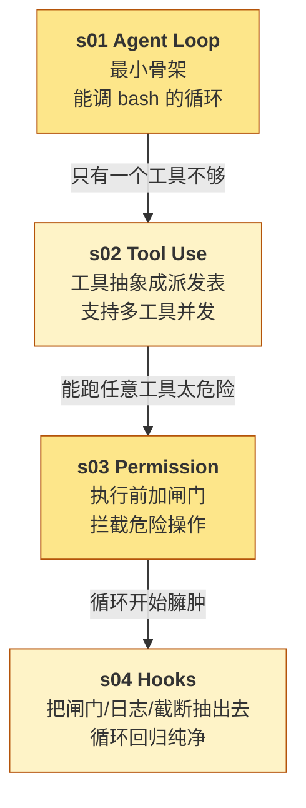
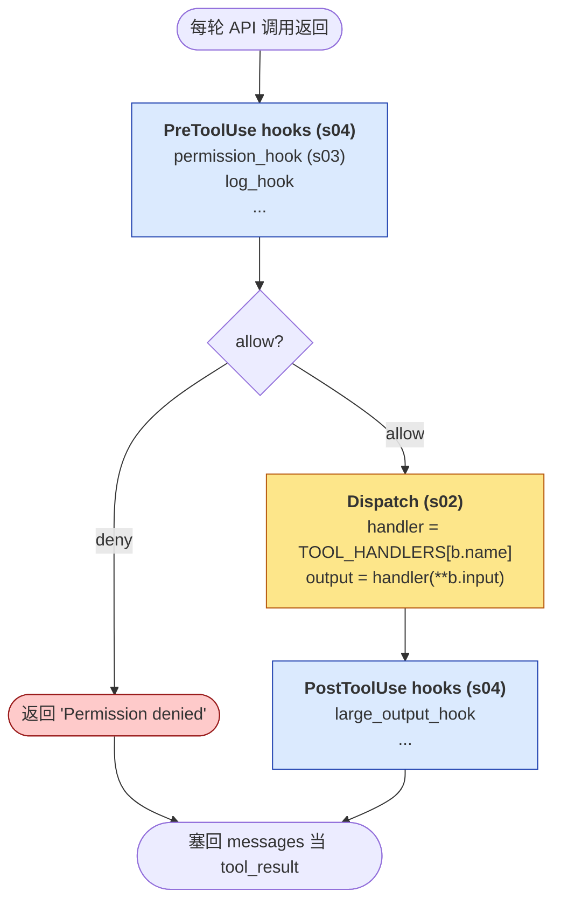

# Phase 1 综合总结 --- 基础机制

> [!note]
> Phase 1 的四课（s01 - s04）合起来，回答一个问题：**"把一个 LLM 变成一个能跑工具的 Agent，最少需要哪些零件？"** 答案是四个：循环（让模型多轮思考）、工具（让模型做事）、权限（防止模型做坏事）、钩子（让前三个可扩展）。这四个零件就是任何 Agent harness 的脊柱，从 s05 到 s20 的所有扩展都长在这套脊柱上。

## 这一组课的整体脉络

Phase 1 不是四个并列的零件，而是**层层递进的四次重构**：



每一课都是在回答**前一课暴露的问题**：

- s01 只有一个工具 → s02 抽象出多工具。
- s02 能跑任意工具 → s03 拦截危险工具。
- s03 把权限写进循环 → 循环开始变臃肿 → s04 把它抽出去。

**到 s04 为止，循环本身基本定型**。Phase 2 及之后的所有扩展（todo / subagent / compact / memory）都不再改循环核心，只往 hook、tools、messages 这些"接口"上挂东西。

## 每一步加了什么、为什么加

### s01 --- Agent Loop

| 维度 | 内容 |
|---|---|
| 加了什么 | 一个 `while stop_reason == "tool_use"` 的循环；append 模型回复和工具结果到 messages |
| 为什么 | LLM 只能输出 token，不能"做事"；循环是让模型反复"思考 → 调工具 → 看结果 → 再思考"的唯一办法 |
| 这是什么机制 | ReAct（Reasoning + Acting）范式的工程实现 |
| Claude Code 怎么做 | 循环骨架和 s01 几乎一致，但额外包了 system prompt / hooks / subagent / compact / memory 等扩展 |

**关键贡献**：定义了"会话"的物理形态 = `messages: list`。后续所有概念（权限、压缩、记忆）都是**对这个 list 的操作**。

### s02 --- Tool Use

| 维度 | 内容 |
|---|---|
| 加了什么 | `TOOLS`（schema 列表给模型看）+ `TOOL_HANDLERS`（名字 → handler 字典给 harness 用）；循环里改成按 block 遍历派发 |
| 为什么 | 只用 bash 不够（不安全、不可靠、不可观测）；一轮可能要并发调多个工具 |
| 这是什么机制 | Dispatch Table / Strategy Pattern |
| Claude Code 怎么做 | 内置 ~15 个语义化工具（Bash / Read / Edit / Glob / Grep / Agent / TaskCreate / WebSearch …），每个工具的 schema 都经过精雕细琢 |

**关键贡献**：确立了"工具 = 名字 + schema + handler"的三件套标准。从此往后，新增一个工具只需三步：写 handler、写 schema、注册到两张表。

### s03 --- Permission

| 维度 | 内容 |
|---|---|
| 加了什么 | 循环里 handler 执行之前插一段 `check_permission(block)`；deny list + rules + ask_user 三种决策 |
| 为什么 | 模型可能 `rm -rf /`；自然语言 prompt 里的规则不靠谱，必须在代码层硬拦 |
| 这是什么机制 | Policy Enforcement Point（PEP）/ 策略执行点 |
| Claude Code 怎么做 | 多级规则源（allow / deny / per-tool rules）、permission mode（default / plan / acceptEdits / bypassPermissions）、"always allow" 记忆；权限整体被搬到 PreToolUse hook |

**关键贡献**：确立了"硬代码层 + 模型层"两道防线。任何"不应该做的事"都必须在代码层拦，不能指望模型自己守规则。

### s04 --- Hooks

| 维度 | 内容 |
|---|---|
| 加了什么 | `HOOKS` 字典按事件分桶；`register_hook` 注册回调；`trigger_hooks` 依次执行，任一返回非 None 就短路 |
| 为什么 | 循环开始变臃肿（派发 + 权限 + 日志 + 截断）；用户需要不改源码就能改行为；模块化才好测试 |
| 这是什么机制 | Lifecycle Hooks / Event-Driven Extension（和 Express middleware、Django signals、Unix signal handler 同类） |
| Claude Code 怎么做 | 更细事件（SessionStart / PreCompact / SubagentStop 等）；hook 用 shell 命令实现，跨进程隔离；matcher 过滤工具名 |

**关键贡献**：把循环里所有"装饰性"逻辑（权限、日志、截断、总结）抽干净，循环只剩骨架。从此往后，**所有非核心逻辑都以 hook 形式存在**。

## 四个零件之间的关系

这四个零件不是孤立的，它们**互相依赖**：



几个关键关系：

- **s02 依赖 s01**：派发表只有放在循环里才有意义。
- **s03 依赖 s02**：权限拦的是"工具调用"，工具必须先存在。
- **s04 吸收 s03**：permission 在 s04 里被重构成 PreToolUse hook。
- **s04 不破坏 s01**：循环本身没改，只是循环体里多了几个 `trigger_hooks(...)` 调用。

**这种"加法但不破坏"的设计**是 Phase 1 最重要的工程经验。后续 Phase 的所有扩展都遵循这个模式：往循环、tools、hooks、messages 这四个接口上挂东西，但不动循环骨架。

## 一个心智模型

把 Agent 想成一个**有自主权的实习生**：

- **s01 Agent Loop**：他需要一个工作节奏——想一下、做一下、看结果、再想一下。不能只做一次就交差。
- **s02 Tool Use**：他需要工具——电脑、终端、文档系统、搜索引擎。工具越多越专精，他越能干。
- **s03 Permission**：他需要工作守则——什么能做、什么不能做、什么要先问。守则在代码层强制执行，不能只靠他自觉。
- **s04 Hooks**：他需要可配置的"工作环境"——有时候公司要审计、有时候他要带耳机、有时候他在 CI 里跑完全自动。

实习生（模型）本身不变，变的是"他周围的环境"（harness）。好的 harness 让普通实习生也能稳定产出，坏的 harness 让明星实习生也发挥不出水平。

## Phase 1 之后能做什么

到 s04 为止，harness 已经能：

- 多轮对话（s01）
- 调用任意多个工具（s02）
- 拦截危险操作（s03）
- 用户自定义扩展（s04）

**这是一个能用的最小 Agent**。你可以拿它跑代码、写脚本、查文档。

但它还**不能**：

- 处理长任务（任务多了就漂）→ Phase 2 s05 TodoWrite
- 隔离探索性上下文（一次调研就爆）→ Phase 2 s06 Subagent
- 跑超过上下文上限的会话（自然爆炸）→ Phase 2 s08 Context Compact
- 跨会话记住用户偏好 → Phase 3 s09 Memory

Phase 2 解决"会话内的上下文治理"。Phase 3 开始解决"跨会话的长期记忆"。

## 实现对照：Phase 1 之后的 agent_loop

```python
HOOKS = {"UserPromptSubmit": [], "PreToolUse": [], "PostToolUse": [], "Stop": []}

def register_hook(event, callback):
    HOOKS[event].append(callback)

def trigger_hooks(event, *args):
    for callback in HOOKS[event]:
        result = callback(*args)
        if result is not None:
            return result  # 短路
    return None

def agent_loop(messages: list):
    while True:
        response = client.messages.create(
            model=MODEL, system=SYSTEM, messages=messages,
            tools=TOOLS, max_tokens=8000,
        )
        messages.append({"role": "assistant", "content": response.content})

        if response.stop_reason != "tool_use":
            force = trigger_hooks("Stop", messages)  # s04: Stop hook
            if force:
                messages.append({"role": "user", "content": force})
                continue
            return

        results = []
        for block in response.content:
            if block.type != "tool_use":
                continue

            # s03/s04: 拦截 → PreToolUse hook（permission 在这里跑）
            blocked = trigger_hooks("PreToolUse", block)
            if blocked:
                results.append({"type": "tool_result",
                                 "tool_use_id": block.id,
                                 "content": str(blocked)})
                continue

            # s02: 派发表
            handler = TOOL_HANDLERS.get(block.name)
            output = handler(**block.input) if handler else f"Unknown: {block.name}"

            trigger_hooks("PostToolUse", block, output)  # s04: 截断、统计

            results.append({"type": "tool_result",
                             "tool_use_id": block.id, "content": output})

        messages.append({"role": "user", "content": results})

# 注册各种 hook（权限、日志、注入、总结）
register_hook("UserPromptSubmit", context_inject_hook)
register_hook("PreToolUse", permission_hook)
register_hook("PreToolUse", log_hook)
register_hook("Stop", summary_hook)
```

**整个 Phase 1 的 agent_loop 就是这个形态**。注意几点：

- 循环骨架（while / append / dispatch）是 s01 - s02 的内容。
- `trigger_hooks` 的几个调用点是 s04 的内容。
- s03 的 permission 已经被吸收成 PreToolUse hook 的一个 callback。
- 整段代码没有任何"硬代码的权限规则、硬代码的日志格式"——全是可替换的 hook。

这就是 Phase 1 想达到的**最终形态**：循环纯净，所有副作用都挂在钩子上。

## Q&A

### Q1: 为什么把 Phase 1 这四课放在一起？它们看起来是不同的东西。

**A**: 因为它们**共同回答了"Agent 最小骨架长什么样"这个问题**，而且**互相依赖、不可拆分**：

- 没 s02，s01 只能调 bash。
- 没 s03，s02 不安全。
- 没 s04，s03 + 各种自定义逻辑会塞满循环。

这四课加起来约 800 行代码，**构成了所有后续 Phase 的地基**。Phase 2 - 6 都是在这个地基上"加房间"，不改地基。

### Q2: 我可以直接从 s04 开始读吗？

**A**: 不建议。s04 里的 hook 系统看起来简单，但它的设计动机（"循环太臃肿"）只有在看过 s01 - s03 之后才能真正理解。

更关键的是，s04 的 hook 注册代码里写着：

```python
register_hook("PreToolUse", permission_hook)
```

如果你不知道 permission_hook 是从 s03 演化来的，你会以为"为什么要先 hook 再 dispatch"是个任意的决定。其实是 s03 的硬约束被 s04 重构后的痕迹。

### Q3: Phase 1 有没有"原本 Claude Code 不这么做"的地方？

**A**: 有几个：

1. **s03 的 deny list 用 Python 硬编码**。Claude Code 用 `settings.json` 配置，运行时读。
2. **s04 的 hook 是 Python 回调**。Claude Code 的 hook 是 shell 命令，跨进程隔离。
3. **s02 的工具集很小**。Claude Code 内置工具多得多，每个 schema 都经过仔细设计。
4. **整个 Phase 1 没有用户偏好、没有项目 CLAUDE.md、没有 system prompt 的动态注入**。这些是 Phase 3 s10 的内容。

这些差异都体现了 Claude Code 的工程化方向：**从"能跑的脚本"到"可配置的产品"**。Phase 1 是脚本形态，Phase 3 之后才慢慢长出产品形态。

### Q4: 我什么时候该重读 Phase 1？

**A**: 三个时机：

1. **学完 Phase 2 - 6 之后**：你会发现所有扩展都长在 Phase 1 的四个接口上。这时候重读，能看清"骨架 vs 装饰"的边界。
2. **自己写一个 Agent 框架之前**：Phase 1 是最小模板，照着实现一遍能避免 90% 的设计错误。
3. **看其他 Agent 框架（LangChain、AutoGen、OpenAI Agents SDK）时**：把它们的功能对应到 Phase 1 的四个零件上，能快速看懂它们的取舍。

### Q5: 如果我只读一课，应该读哪课？

**A**: **s04 Hooks**。

因为 s04 同时解释了：

- s01 的循环（hook 暴露了循环的几个时机）。
- s02 的工具（PreToolUse / PostToolUse 是工具调用的包围扩展点）。
- s03 的权限（被重构成 PreToolUse hook 的一个 callback）。

读懂 s04，等于读懂 Phase 1 的整体架构。但代价是：s04 的设计动机需要 s01 - s03 铺垫，所以不建议真的跳着读。

## 相关概念

- [[01 - Agent Loop]]
- [[02 - Tool Use]]
- [[03 - Permission]]
- [[04 - Hooks]]
- [[Phase 2 - 上下文治理/00 - 综合总结|Phase 2 综合总结]]

> [!warning]
> Phase 1 最容易产生的误解：**以为这四课是"四种 Agent 设计"**。不是。它们是**同一个 Agent 在四次重构后的四个阶段**。每一课都是在前一课的基础上"加而不破"。读懂这个递进关系，比记住每一课的细节更重要。
