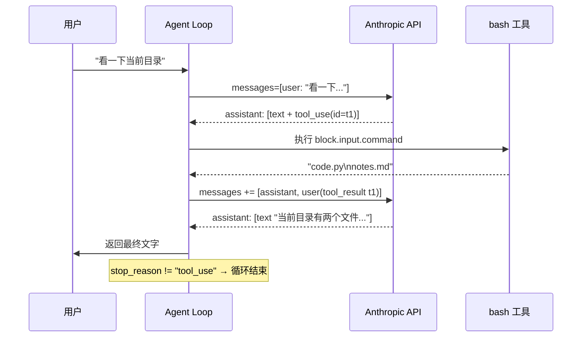

# 01 - Agent Loop

> [!note]
> Agent Loop 是把"一个能生成文字的模型"变成"一个能做事的 Agent"的最小装置。它就一个 `while` 循环：模型说话 → 如果模型说"我要调用工具"，就执行工具、把结果塞回去 → 再让模型说话。直到模型不再要求调用工具为止。

## 它解决什么问题

LLM 本身只能输出 token。它不能跑命令、不能读文件、不能改代码。如果你给它一个问题，它最多"假装"知道答案，但实际上什么都做不了。

要把 LLM 变成 Agent，至少要做两件事：

1. **给它行动能力**：让它能调用外部工具（shell、文件系统、搜索……）。
2. **给它一个反思回路**：让它看到工具执行的结果，再决定下一步。

第二件事就是 Agent Loop 的职责。**第一件事是 s02 的事**，本课先假装只有一个 `bash` 工具，重点放在回路上。

## 这是一个什么机制

这个模式在很多领域都有名字：

- **ReAct**（Reasoning + Acting）：思考 → 行动 → 观察 → 再思考。
- **Tool-augmented LLM loop**：带工具的 LLM 循环。
- **Agentic while-loop**：模型驱动的 while 循环。

核心要素只有三个：

1. **循环条件**：模型在它的回复里有没有显式声明"我要调用工具"？Anthropic API 用 `stop_reason == "tool_use"` 表示这个意图。
2. **工具派发**：从模型回复里取出工具调用块（block），执行它，把输出包装成 `tool_result` 块。
3. **回合交接**：把模型回复和工具结果按 `assistant → user` 的顺序拼回 `messages`，进入下一轮。

### 一个回合的消息长什么样

Anthropic 的 messages 协议里，一条消息的 `content` 可以是字符串，也可以是 **block 列表**。一个完整的工具回合长这样：



对应的 messages 列表（这是数据，不是图）：

```
messages = [
  {role: "user",      content: "看一下当前目录有什么"},
  {role: "assistant", content: [
      {type: "text", text: "好的，我来运行 ls。"},
      {type: "tool_use", id: "t1", name: "bash", input: {command: "ls"}}
  ]},
  {role: "user",      content: [
      {type: "tool_result", tool_use_id: "t1", content: "code.py\nnotes.md"}
  ]},
  {role: "assistant", content: [
      {type: "text", text: "当前目录有两个文件……"}
  ]}
]
```

几个关键点（后面所有课程都建立在这之上）：

- **一条 assistant 消息里可以同时有多个 block**：文字 + 工具调用，甚至多个工具调用。
- **工具结果必须以 `role: "user"` 出现**，但它的 content 是 `tool_result` block 而不是字符串。这是协议要求的"工具结果属于用户方"。
- **`tool_use` 和 `tool_result` 通过 `id` 配对**，不是靠顺序。模型可以在一条消息里并发调用 5 个工具，结果按 id 回填。

## 为什么循环必须由"停止条件"驱动，而不是固定轮数

新手容易写 `for i in range(10)` 的循环。这有两个问题：

1. **不知道什么时候该停**：可能第 3 轮就够了，也可能需要 20 轮。
2. **会被强行截断**：如果固定 10 轮但模型在第 12 轮才得出答案，就被截掉了。

正确做法是**让模型自己决定什么时候停**：当它不再要求调用工具（`stop_reason != "tool_use"`），说明它认为答案已经够了，循环结束。

这也是为什么 s06 子 Agent 会加一个"最多 30 轮"的安全阀——理论上不该需要，实际上模型偶尔会陷入死循环，需要兜底。

## 原本的 Claude Code 怎么做的

Claude Code 的核心就是这个循环。它的额外复杂度都是**在循环外面包东西**：

- **system prompt**：注入工作目录、用户偏好、可用工具清单、当前任务（s10 详讲）。
- **hooks**：在循环的特定时刻（用户提交、工具调用前、工具调用后、停止）插入回调（s04 详讲）。
- **subagent**：循环里可以"开一个嵌套循环"，跑完只把总结拿回来（s06 详讲）。
- **context compact**：循环过程中监测上下文是否快爆，爆了就压缩（s08 详讲）。
- **memory**：循环开始前注入相关记忆，结束后提取新记忆（s09 详讲）。

但**循环本身，从 s01 到 s20，基本没变过**。这是整个 Agent 的脊柱。

## 一个心智模型

可以把 Agent Loop 想象成下棋：

- **模型**：棋手。每一手要么是"思考"（输出文字），要么是"落子"（调用工具）。
- **harness**（你写的代码）：棋盘 + 裁判。负责把棋手的手翻译成实际动作，再把结果反馈给棋手。
- **工具**：棋手能落子的位置。没工具的棋手只能空想。

棋局什么时候结束？由棋手说"我认输"或"我赢了"决定，不是固定下满 200 手。

## 实现对照（s01/code.py）

```python
def agent_loop(messages: list):
    while True:
        response = client.messages.create(
            model=MODEL, system=SYSTEM, messages=messages,
            tools=TOOLS, max_tokens=8000,
        )
        messages.append({"role": "assistant", "content": response.content})

        if response.stop_reason != "tool_use":
            return  # 模型说够了，停。

        results = []
        for block in response.content:
            if block.type == "tool_use":
                output = run_bash(block.input["command"])
                results.append({
                    "type": "tool_result",
                    "tool_use_id": block.id,
                    "content": output,
                })
        messages.append({"role": "user", "content": results})
```

几个值得记住的细节：

- `messages.append(...)` 把模型回复原封不动塞回去。这个 list 是**会话的真相来源**。
- `stop_reason != "tool_use"` 的判断发生在 append 之后，所以最后一轮的文字回答也会留在 history 里。
- `tools=TOOLS` 在每一轮 API 调用里都传，因为 API 是无状态的，它不记得上一轮你说过有哪些工具。

## 相关概念

- [[02 - Tool Use]]：本课只有一个工具，下一课拆 TOOL_HANDLERS 怎么支持多工具。
- [[03 - Permission]]：循环里执行工具之前，需要先过一道闸门。
- [[04 - Hooks]]：循环的四个时机（提交、工具前、工具后、停止）是怎么暴露成扩展点的。

> [!warning]
> 三个最容易踩的坑：
>
> 1. **把工具结果当 assistant 消息塞回去**。协议要求 `tool_result` 必须在 `role: "user"` 下，否则 API 直接报错。
> 2. **用固定轮数循环**。要么截断得太早，要么白跑空轮。
> 3. **忘了 `tool_use_id` 配对**。模型并发调用多个工具时，结果靠 id 回填，顺序错了模型会困惑。
