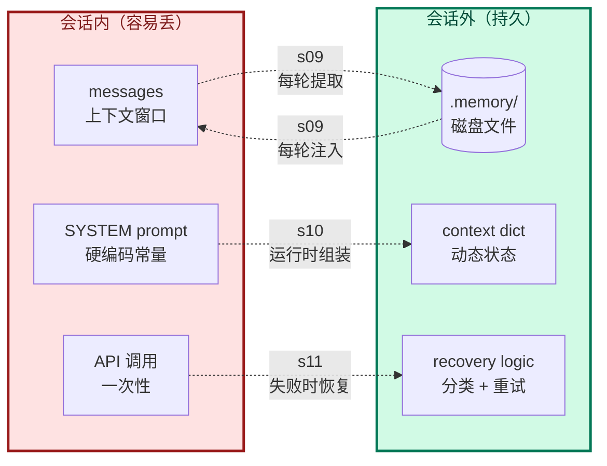

# Phase 3 综合总结 --- 记忆与恢复

> [!note]
> Phase 1 让 Agent 能跑，Phase 2 让它能跑长任务。但跑完一次（成功 or 失败）就结束——所有上下文消失，下次开会话从零开始；API 一报错就崩溃。Phase 3 的三课合起来回答：**"怎么让 Agent 在一次会话之外仍然有连续性？"** 三个答案：把记忆写到磁盘（s09）、让 SYSTEM 反映运行时状态（s10）、出错时自我修复（s11）。共同主题：**外部化**——把会丢的东西搬到会话外。

## 为什么 Phase 3 是"记忆与恢复"

Phase 1 + 2 的 Agent 有两个隐性假设：

1. **会话内记忆 = 上下文窗口**：所有信息都在 messages 里。
2. **API 调用永远成功**：网络、限流、过载都不存在。

这两个假设在演示里成立，在**生产**里都崩：

- 会话结束 → messages 清空 → 用户偏好、项目背景、过往决定全没了。
- API 返回 529 → Agent 直接挂 → 长任务跑一半死掉，无法重启。
- 任务跑到一半换了工作目录、加了新工具 → SYSTEM 还在用启动时的旧值。

Phase 3 解决这三件事：

| 课 | 解决什么 | 机制 |
|---|---|---|
| s09 Memory | 跨会话的知识连续性 | 文件系统持久化 + 双层注入（索引 + 内容） |
| s10 System Prompt | 单会话内的状态连续性 | section 分段 + 按状态组装 + 缓存 |
| s11 Error Recovery | 失败时的任务连续性 | 错误分类 + 恢复路径 + 重试限制 |

三者**机制不同但主题一致**：把"原本在会话内的、容易丢的东西"**外部化**到磁盘、配置、或恢复逻辑里。

## 每一步加了什么、为什么加

### s09 --- Memory

| 维度 | 内容 |
|---|---|
| 加了什么 | `.memory/` 目录 + `MEMORY.md` 索引 + CRUD 函数 + load_memories / extract_memories 镜像 + consolidate_memories |
| 为什么 | s08 压缩有损；新会话从零开始；LLM 没"记忆"只有"读到" |
| 这是什么机制 | Two-Tier Memory with Index（便宜层 + 贵层）；Mirror Pattern（load/extract 对称） |
| Claude Code 怎么做 | 同样的 `.claude/memory/` 结构；MEMORY.md 自动注入 SYSTEM；consolidate 是 "Dream" 功能；明确 "What NOT to save" 边界 |

**关键贡献**：确立了"**索引常驻 SYSTEM、内容按需注入 user turn**"的分层模式。索引稳定让 API prompt cache 命中，内容动态不影响 cache。

**对应到 Claude Code**：骨架几乎一样，多了显式 `/remember` 命令、更严格的"什么不该存"清单、更精细的 consolidate 启发式。

### s10 --- System Prompt

| 维度 | 内容 |
|---|---|
| 加了什么 | `PROMPT_SECTIONS` 字典 + `assemble_system_prompt(context)` + `get_system_prompt(context)`（带缓存）+ `update_context()` + 循环内重算 |
| 为什么 | 硬编码 prompt 三个痛点（换项目难、改一处影响全局、不需要的也占 token）；prompt 应该是"配置"不是"常量" |
| 这是什么机制 | Section-Based Prompt Assembly + Memoized Lookup |
| Claude Code 怎么做 | 20+ section（静态 + 动态）；`SYSTEM_PROMPT_DYNAMIC_BOUNDARY` 分段做 API cache；模式切换（CLAUDE_CODE_SIMPLE / Coordinator / Agent）；三层缓存（lodash memoize / section 注册缓存 / API scope） |

**关键贡献**：把 s09 `build_system()` 内部隐式的 context 状态**显式化**成 dict，从而能缓存、能反复刷新。真正的新能力只有一句话——"循环内重新组装"。

**对应到 Claude Code**：CC 的复杂度主要在"如何让 API cache 命中"——通过 boundary 把 prompt 切成静态段（命中）+ 动态段（不命中）。s10 没做这一层，留作后续。

### s11 --- Error Recovery

| 维度 | 内容 |
|---|---|
| 加了什么 | `RecoveryState` + `with_retry` + `retry_delay` + 三个恢复路径（max_tokens / prompt_too_long / 429-529）+ `is_prompt_too_long_error` |
| 为什么 | API 错误是常态不是 bug；s08 reactive_compact 只覆盖一种；Phase 4 后台任务要求无人值守 |
| 这是什么机制 | Classify-then-Recover；Exponential Backoff with Jitter |
| Claude Code 怎么做 | 13+ reason code；`services/api/withRetry.ts`（822 行）；529 → fallback model + 清空 messages；diminishing returns 检测；流式错误对用户不可见 |

**关键贡献**：把"硬代码重试"和"逻辑错误处理"分层（瞬态 in with_retry，永久 in outer except）；每种恢复都**有限制**避免死循环。

**对应到 Claude Code**：CC 的覆盖面大得多——还有 image error、streaming abort、hook 阻塞、token budget continuation 等。s11 只展开最常见的 5 种，但分层架构可以平滑扩展。

## 三课的统一逻辑：外部化（Externalization）

Phase 3 三课的共同主题是**把会丢的东西搬到会话外**：



每一课都在做一个**"把易失状态搬到持久层"**的动作：

| 课 | 易失的（左） | 持久的（右） | 搬运方向 |
|---|---|---|---|
| s09 | messages 里的用户偏好 | `.memory/*.md` 磁盘文件 | 双向（load + extract） |
| s10 | 硬编码的 SYSTEM 常量 | context dict + 真实状态 | 状态 → prompt |
| s11 | 一次性 API 调用（失败就死） | recovery 逻辑（分类 + 重试） | 失败 → 恢复 |

这种"外部化"思路在工程里到处都是：

- 数据库 vs 内存对象
- 配置文件 vs 硬代码常量
- 重试队列 vs 同步调用

**Phase 3 把这三层都补齐了**，Agent 从"演示原型"变成"可部署服务"。

## 三课的另一个角度：增加会话的"生命周期"

Phase 1 + 2 的 Agent 生命周期：

```
启动 → 跑一轮 → 结束
```

Phase 3 扩展为：

```
启动 → [加载磁盘记忆] → 跑一轮 → [保存磁盘记忆] → 结束
              ↑                ↓
              └──── 跨会话 ────┘
       
单会话内：
  每轮开始 → [按状态组装 SYSTEM] → 调 API
                                     ↓
                              失败？→ [恢复路径] → 重试
                                     ↓
                              成功 → 执行工具 → 下一轮
```

每个 `[...]` 都是 Phase 3 加的"外部化点"。Agent 从"一个 while 循环"变成"一个有持久层、有自检、有自愈的循环"。

## 一个心智模型

把 Agent 想成一个**新员工**：

- **s09 Memory**：给他一个**笔记本**。每次开会记下来用户的偏好、项目的来龙去脉，下次开会前翻一翻。没笔记本，每次开会都从头认识用户。
- **s10 System Prompt**：给他一份**实时更新的工作说明**。今天负责前端就给他前端工具清单，明天调去后端就换。工作说明不是入职时发一份就完事，是动态的。
- **s11 Error Recovery**：给他一个**应急预案手册**。网络断了怎么办、API 限流怎么办、上下文超限怎么办——不用每次都问老板（用户），自己照着做。

新员工（模型）本身不变，变的是他**周围的支撑系统**。Phase 3 的三课就是这三件：笔记本、动态工作说明、应急预案。

## Phase 3 之后能做什么

到 s11 为止，harness 已经能：

- 跨会话保留用户偏好、项目背景（s09）
- 单会话内动态调整 prompt（s10）
- API 出错时自愈（s11）

**这是一个"可部署"的 Agent**。可以装到服务器上 24/7 跑，不需要人盯着。

但它还**不能**：

- 跑超过一次"提问-回答"的长流程任务（任务做完就结束）→ Phase 4 s12 Task System
- 用户不在场时跑（必须有人按回车）→ Phase 4 s13 Background Tasks
- 定时触发（每天 9 点检查某事）→ Phase 4 s14 Cron

Phase 4 解决"任务结构和时间维度"。Phase 5 解决"多个 Agent 协作"。Phase 6 解决"接入外部生态"。

## 实现对照：Phase 3 之后的 agent_loop

```python
def agent_loop(messages, context):
    system = get_system_prompt(context)         # s10: 组装 + 缓存
    state = RecoveryState()                      # s11: 恢复状态
    max_tokens = DEFAULT_MAX_TOKENS

    while True:
        # s11: try/except 包 LLM 调用
        try:
            # s11: with_retry 处理瞬态
            response = with_retry(
                lambda mt=max_tokens, mdl=state.current_model:
                    client.messages.create(
                        model=mdl, system=system, messages=messages,
                        tools=TOOLS, max_tokens=mt),
                state)
        except Exception as e:
            # s11: Path 2 - prompt_too_long
            if is_prompt_too_long_error(e):
                if not state.has_attempted_reactive_compact:
                    messages[:] = reactive_compact(messages)
                    state.has_attempted_reactive_compact = True
                    continue
                return
            return

        # s11: Path 1 - max_tokens
        if response.stop_reason == "max_tokens":
            if not state.has_escalated:
                max_tokens = ESCALATED_MAX_TOKENS
                state.has_escalated = True
                continue
            messages.append({"role": "assistant", "content": response.content})
            if state.recovery_count < MAX_RECOVERY_RETRIES:
                messages.append({"role": "user", "content": CONTINUATION_PROMPT})
                state.recovery_count += 1
                continue
            return

        messages.append({"role": "assistant", "content": response.content})

        if response.stop_reason != "tool_use":
            # s09: 会话结束时提取记忆 + consolidate
            extract_memories(pre_compress)
            consolidate_memories()
            return

        # 执行工具...
        for block in response.content:
            if block.type != "tool_use": continue
            handler = TOOL_HANDLERS.get(block.name)
            output = handler(**block.input) if handler else f"Unknown"
            ...

        # s10: 工具执行后重算状态 + prompt
        context = update_context(context, messages)
        system = get_system_prompt(context)
```

Phase 3 相对 Phase 2 加的部分：

- **s09**：agent_loop 入口前 `load_memories()` + 副本注入；出口处 `extract_memories()` + `consolidate_memories()`。
- **s10**：每轮 `update_context` + `get_system_prompt` 重算。
- **s11**：LLM 调用包 try/except + `with_retry` + `stop_reason == "max_tokens"` 路径。

**循环骨架（while + append + dispatch）依然没动**。Phase 3 的所有扩展都是在循环的不同位置（开头、调用前、调用后、结束）插入新的"外部化点"。

## Q&A

### Q1: Phase 3 三课必须按顺序学吗？

**A**：**强烈建议按顺序**，因为三者层层递进：

- **s09 → s10**：s10 的 context 概念是 s09 `build_system()` 内部状态的显式化。不懂 s09，看不懂 s10 为什么要拆出 context。
- **s10 → s11**：s11 复用 s10 的 prompt 组装。不懂 s10，看不懂 s11 的 `system = get_system_prompt(context)` 在干什么。
- **s09 → s11**：s11 的 `reactive_compact` 是 s08 的兜底。s09 在 s08 基础上加记忆系统。所以 s09 ↔ s11 共享压缩基础设施。

跳着读会卡在"这个变量哪来的"。

### Q2: 为什么 s09 不直接放 Phase 2？它也是上下文治理。

**A**：因为 s09 解决的不是"会话内上下文"，而是"**跨会话上下文**"。

- Phase 2（s05/s06/s08）：处理**单次会话内**的上下文问题（漂移 / 污染 / 爆炸）。
- Phase 3 s09：处理**多次会话之间**的上下文问题（持久化、跨会话还原）。

判断一课归哪个 Phase，**看它解决什么时间尺度的问题**。Phase 2 = 单会话内，Phase 3 = 跨会话。

### Q3: Phase 3 的核心收获应该是什么？

**A**：三个观念转变：

1. **LLM 没记忆，只有"读到"**。所谓"它记住了"其实是"它在这一轮看到了磁盘上的文件"。Memory 系统的本质是被反复读进上下文的磁盘存储。
2. **Prompt 是配置不是常量**。SYSTEM 应该按当前状态动态组装，不是写死。一旦把 prompt 当配置，section 分段、缓存、状态派生都自然出现。
3. **错误是常态不是异常**。API 报错不需要"修复"，需要"分类 + 恢复"。Agent 没有 error recovery 等于没有生产价值。

理解这三点，比记住具体的 `extract_memories` 或 `retry_delay` 重要得多。

### Q4: Phase 3 三课之间有"共用机制"吗？

**A**：有，**Classify → Decide → Act** 模式：

| 课 | Classify | Decide | Act |
|---|---|---|---|
| s09 | 哪些记忆相关？ | 选哪几条注入？ | load_memories 注入 |
| s10 | 当前状态是什么？ | 加载哪些 section？ | assemble_system_prompt 拼接 |
| s11 | 错误是什么类型？ | 走哪条恢复路径？ | escalate / compact / backoff |

每一课都是"**判断当前状态 → 决策 → 行动**"的循环。这是 Agent 设计的通用范式：**模型本身只是行动者，harness 提供判断和决策的脚手架**。

### Q5: 学完 Phase 3，我自己写 Agent 时最先该装哪一块？

**A**：**s11 Error Recovery**。理由：

- **不可替代**：缺 memory 和 system prompt，Agent 能跑只是不好用。缺 error recovery，Agent 跑长任务必死。
- **简单见效**：try/except + 指数退避 100 行内搞定，立刻让 Agent 可靠性翻倍。
- **基础设施**：Phase 4 的后台任务、定时任务都默认 error recovery 在位。

s09 和 s10 可以等 Agent 真的开始用了再加（"用户偏好怎么总是忘" → 装 memory；"换项目就要改 prompt" → 装动态组装）。s11 不能等——它是"地基"。

### Q6: Phase 3 之后还有什么没解决？

**A**：几个明显的：

- **任务持久化**：用户问 "重建数据库索引"，Agent 跑一半 Crash 了。重启后能从断点继续吗？s09 的记忆是"用户偏好"，不是"任务状态"。→ Phase 4 s12 Task System。
- **后台执行**：用户问 "跑这个测试"，关掉电脑回家。Agent 能继续跑吗？→ Phase 4 s13 Background Tasks。
- **多 Agent 协作**：复杂任务一个 Agent 干不完，能分给多个 Agent 吗？→ Phase 5。
- **外部工具接入**：能接入 GitHub、Slack、数据库这些外部系统吗？→ Phase 6 s19 MCP。

Phase 3 解决"会话连续性"。Phase 4 - 6 解决"任务连续性、协作连续性、生态连续性"。

## 相关概念

- [[09 - Memory]]
- [[10 - System Prompt]]
- [[11 - Error Recovery]]
- [[Phase 2 - 上下文治理/00 - 综合总结|Phase 2 综合总结]]

> [!warning]
> Phase 3 最容易产生的两个误解：
>
> 1. **以为三课是三个独立功能**。不是。它们共同回答"如何让 Agent 在单次会话外有连续性"——是一个主题的三个角度（跨会话记忆 / 会话内动态 / 失败时自愈）。
>
> 2. **以为 Memory 等于"向量数据库 + RAG"**。s09 完全没用向量检索——它用 LLM side-query 选相关记忆。Memory 的本质是"被反复读进上下文的磁盘存储"，存储和检索机制可以很多种。CC 实际也没用向量库，用 LLM side-query + filename 匹配。
