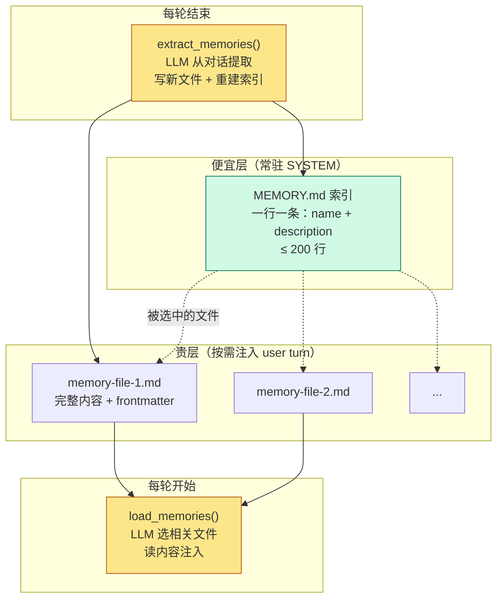

# 09 - Memory

> [!note]
> s08 的压缩是有损的——"用 tab 不用空格"可能被简化成"用户有代码风格偏好"。新会话连摘要都没。Memory 是一层**不参与压缩、跨会话保留**的存储：每条记忆一个 markdown 文件，索引常驻 SYSTEM，内容按需注入到当前 user turn。模型在每轮结束时自动从对话里提取值得长期记的东西。

## 这一步加了什么

- 一个 `.memory/` 目录，每条记忆是一个 `.md` 文件，带 YAML frontmatter（`name` / `description` / `type`）。
- 一个 `MEMORY.md` 索引：一行一条链接，**注入 SYSTEM prompt**，每轮常驻。
- 一组 CRUD 函数：`write_memory_file` / `read_memory_file` / `list_memory_files` / `_rebuild_index`。
- 一对**镜像函数**：
  - `load_memories(messages)`：每轮开始时跑，选出相关记忆注入到 user turn。
  - `extract_memories(messages)`：每轮结束时跑，从对话里提取新记忆写入磁盘。
- 一个**整理函数**：`consolidate_memories`，文件数 ≥ 10 时触发，合并重复、删除过时。

## 为什么需要加

### 1. 压缩是有损的

s08 的 `compact_history` 让 LLM 把历史写成摘要。但 LLM 会"概括"：

- "用 tab 缩进不要用空格" → 被压成 "用户有代码风格偏好"
- "auth 重写是合规驱动" → 被压成 "正在改 auth 模块"

这种概括**对继续当前任务够用**（知道有偏好、有任务），但**对跨会话不够用**（下次开会话时你忘了具体规则）。

### 2. 新会话从零开始

每次启动新会话，messages 是空的。s08 的压缩摘要也只存在于上个会话的内存里。如果你上次告诉 Agent "永远用 tab"，这次它完全不知道。

需要一层**写在磁盘上、不随会话结束消失**的存储。

### 3. 模型不能"记住"——只能"读到"

LLM 本身没记忆。所谓"它记住了"其实是"它在这一轮的上下文里看到了"。所以"跨会话记忆"=**每次开会话时把磁盘上的相关内容读出来注入到上下文**。

这是 Memory 系统的本质：**一个会被反复读进上下文的磁盘存储**。

## 这是一个什么机制

这是 **Two-Tier Memory with Index**（双层记忆 + 索引）模式。和操作系统的存储层级同构：



**关键设计**：索引和内容**分开注入**。

- **索引**进 SYSTEM（每轮都在，可被 API prompt cache 缓存）。
- **内容**进 user turn（按需，不破坏 cache，按 filename/description 匹配当前对话）。

如果把所有记忆内容都塞 SYSTEM，每次任何一条变化都会让整个 SYSTEM cache 失效。分开注入让 cache 命中率最大化。

### 四类记忆

s09 把记忆按"回答什么问题"分类：

| 类型 | 回答 | 示例 |
|---|---|---|
| `user` | 你是谁 | "用 tab 不用空格" |
| `feedback` | 怎么做事 | "别 mock 数据库，跑过假数据的坑" |
| `project` | 正在发生什么 | "auth 重写是合规驱动" |
| `reference` | 东西在哪找 | "pipeline bug 在 Linear INGEST" |

分类不是装饰——后续 `consolidate_memories` 会优先保留 `user` 类（用户偏好高于一切）。

### 镜像模式：load 和 extract

两个函数对称：

| | load_memories | extract_memories |
|---|---|---|
| 何时跑 | 每轮开始 | 每轮结束 |
| 输入 | messages（看最近说了什么） | messages（看刚刚发生了什么） |
| 输出 | 注入字符串 | 写文件 |
| 用 LLM | 选相关记忆（side-query） | 提取值得记的（side-query） |

两者都是**side-query**——主线之外的一次额外 LLM 调用，专门干一件窄事。这是 Agent 设计里的常见模式：主对话推进任务，side-query 做辅助决策（路由、提取、分类）。

## 原本的 Claude Code 怎么做的

Claude Code 的 Memory 系统在公开文档里描述得很清楚，骨架和 s09 一致：

### 1. 同样的 `.claude/memory/` 目录结构

每个记忆一个 markdown 文件，YAML frontmatter 带 `type`（user / feedback / project / reference）、`name`、`description`。**完全相同的四类分类**。

### 2. MEMORY.md 索引常驻

`MEMORY.md` 自动注入 SYSTEM prompt，截断在 200 行以内。索引格式和 s09 几乎一样。

### 3. 自动 vs 显式提取

s09 是**自动提取**——每轮结束都跑 extract_memories。Claude Code 偏向**显式触发**：

- 用户说 "remember X" → 立即写入。
- 用户用 `/remember` 命令 → 进入记忆管理模式。
- 部分情况下也自动提取，但有更严格的启发式（避免噪音）。

这个差异是工程权衡：自动提取省事但容易写入噪音，显式提取干净但需要用户配合。

### 4. Consolidate（"Dream" 功能）

Claude Code 有个叫 **memory consolidation** 的功能——文件积累到一定数量时，触发一次 LLM 整理：

- 合并重复记忆。
- 删除矛盾或过时的。
- 把碎片化的观察合成完整画像。

这就是 s09 的 `consolidate_memories`。门槛值（s09 是 10）和保留数（30）都是经验值。

### 5. What NOT to save

Claude Code 的 SYSTEM prompt 里有明确指令告诉模型**什么不该存**：

- 代码模式、约定、架构（读代码就知道，不用存）。
- Git 历史（git log 是真相）。
- 调试解决方案（fix 在代码里，commit message 有 context）。
- CLAUDE.md 已经写的。
- 临时任务状态。

这一段在 s09 里没强调，但**生产级记忆系统必须明确边界**——否则什么 都往磁盘写，索引很快爆掉。

## 设计要点

### 1. 索引和内容分开注入

如上所述，索引进 SYSTEM，内容进 user turn。让 API prompt cache 命中率最大化。

### 2. side-query 用小 max_tokens

`select_relevant_memories` 用 `max_tokens=200`，`extract_memories` 用 `max_tokens=800`。这些是辅助决策，不需要长输出。

### 3. fallback 兜底

`select_relevant_memories` LLM 调用失败时，fallback 到关键词匹配（取消息里 > 3 字符的词，匹配文件名和描述）。**永远要有兜底**——side-query 不应该让主循环挂掉。

### 4. 提取时检查重复

`extract_memories` 把现有记忆的 name+description 一起发给 LLM，要求"如果已被覆盖就返回 []"。避免同一条偏好被反复写入。

### 5. 限制 consolidate 的输入大小

`consolidate_memories` 把 catalog 截断到 16000 字符再发给 LLM。文件太多时不能全发——既贵又超 token。先 truncate，必要时分批。

## 实现对照（s09/code.py）

记忆写入 + 索引重建：

```python
def write_memory_file(name, mem_type, description, body):
    slug = name.lower().replace(" ", "-").replace("/", "-")
    filepath = MEMORY_DIR / f"{slug}.md"
    filepath.write_text(
        f"---\nname: {name}\ndescription: {description}\ntype: {mem_type}\n---\n\n{body}\n"
    )
    _rebuild_index()
    return filepath

def _rebuild_index():
    lines = []
    for f in sorted(MEMORY_DIR.glob("*.md")):
        if f.name == "MEMORY.md":
            continue
        raw = f.read_text()
        meta, body = _parse_frontmatter(raw)
        name = meta.get("name", f.stem)
        desc = meta.get("description", body.split("\n")[0][:80])
        lines.append(f"- [{name}]({f.name}) — {desc}")
    MEMORY_INDEX.write_text("\n".join(lines) + "\n" if lines else "")
```

load_memories（每轮开始）：

```python
def load_memories(messages: list) -> str:
    selected_files = select_relevant_memories(messages)  # LLM 选相关
    if not selected_files:
        return ""
    parts = ["<relevant_memories>"]
    for filename in selected_files:
        content = read_memory_file(filename)
        if content:
            parts.append(content)
    parts.append("</relevant_memories>")
    return "\n\n".join(parts)
```

agent_loop 里的接入（注意 memory_turn）：

```python
def agent_loop(messages: list):
    memories_content = load_memories(messages)
    memory_turn = len(messages) - 1 if messages and isinstance(messages[-1].get("content"), str) else None
    system = build_system()

    while True:
        ...
        request_messages = messages
        if memories_content and memory_turn is not None and memory_turn < len(messages):
            request_messages = messages.copy()   # ← 副本，不改原 messages
            request_messages[memory_turn] = {
                **messages[memory_turn],
                "content": memories_content + "\n\n" + messages[memory_turn]["content"],
            }
        response = client.messages.create(..., messages=request_messages, ...)
        ...
        if response.stop_reason != "tool_use":
            extract_memories(pre_compress)   # ← 用 pre-compress 快照
            consolidate_memories()
            return
```

几个关键细节：

- `memory_turn` 记录"哪一轮 user 消息被注入了记忆"。因为注入用的是副本（`messages.copy()`），原 messages 保持干净——这样 `extract_memories` 不会把注入的记忆当成"用户说过的"再提取一次（避免提取-注入-再提取的死循环）。
- `pre_compress` 是压缩前的 messages 快照。压缩后细节丢失，提取要用快照才能拿到完整对话。
- `extract_memories` 只在 `stop_reason != "tool_use"` 时跑（即"这一轮真正结束了"，不是中间工具回合）。

## 相关概念

- [[08 - Context Compact]]：Memory 解决"压缩丢失"，Compact 解决"上下文爆"。互补。
- [[10 - System Prompt]]：s10 把 s09 的 `build_system()` 拆成 context + assembly + cache 三段。
- [[05 - TodoWrite]]：todo 是会话内外置记忆，memory 是跨会话外置记忆。同构概念，不同生命周期。

> [!warning]
> 几个容易踩的坑：
>
> 1. **在原 messages 上注入记忆**：extract_memories 会把注入的内容当用户原话再提取，形成死循环。必须用副本。
> 2. **压缩后才提取**：压缩丢了细节，提取要在压缩前的快照上做。
> 3. **没有 consolidate**：文件数无上限增长，索引爆 SYSTEM。
> 4. **什么都存**：代码模式、git 历史这些读代码就知道的事，存了就是噪音。

## Q&A

### Q1: extract_memories 只看最近 10 条消息能提取出用户偏好吗？

**A**：不是"会话级"的提取，是**每轮"用户提问 → Agent 完成"循环都尝试提取一次**。10 条是一个**滑动窗口**：

- 窗口够小（10 条）以保证提取本身不消耗太多 token。
- 窗口够大（10 条）以覆盖"用户提需求 → Agent 跑完"的典型一轮。
- 多次会话 / 多轮触发累计起来，长期偏好自然会被多次提到、被反复写入并 consolidate。

这是**增量提取 + 长期累积**的策略。单次提取可能没价值，但跑多了就有。代价是会反复触发 LLM 调用（贵）。生产实现会做去重、合并、consolidate。

### Q2: memory_turn 这个变量到底有什么用？

**A**：因为**注入记忆会污染原 messages**，必须靠 memory_turn 知道"哪一段是注入的"。

具体场景：

1. 进入 agent_loop，`load_memories(messages)` 拿到相关记忆。
2. 把记忆注入到 user 消息——但用的是 **messages.copy() 的副本**，不是原 messages。
3. Agent 跑完，触发 `extract_memories(messages)`。

问题：如果直接在原 messages 注入，extract_memories 会看到注入的记忆内容，可能把它们当成"用户说过的"再次提取——形成"提取 → 注入 → 再提取"的死循环。

解决：

- **不在原 messages 注入，而是注入到副本**。
- 记录 `memory_turn`：标记"这一轮是注入了记忆的"。
- 提取时跳过 memory_turn，只看原始的用户消息。

所以 memory_turn 存在的本质原因是：**我们选择用副本注入（保原 messages 干净），所以需要外部记录"哪一轮有注入"**。设计选择：用一点外部状态换取原数据的完整性。

### Q3: select_relevant_memories 里的 LLM 调用是怎么选相关记忆的？

**A**：构建一个 catalog（"0: name — description" 一行一条），把最近对话和 catalog 一起发给 LLM，让它返回 JSON 数组（如 `[0, 3]`）表示选第 0 和第 3 条。

```python
catalog = "\n".join(f"{i}: {f['name']} — {f['description']}" for i, f in enumerate(files))
prompt = "...Return ONLY a JSON array of integers...\n\n" + recent + catalog
```

注意 prompt 里的关键约束：

- "Return ONLY a JSON array"：限制输出格式。
- "indices of memories that are **clearly relevant**"：要求高置信度，宁缺勿滥。
- max_tokens=200：限制输出长度（200 token 够装 20 个索引了）。

### Q4: catalog 后面那段 fallback 关键词匹配是在干什么？

**A**：LLM 调用失败时的兜底（`except Exception: pass` 后面的代码）。

```python
keywords = [w.lower() for w in recent.split() if len(w) > 3]
selected = []
for f in files:
    text = (f["name"] + " " + f["description"]).lower()
    if any(kw in text for kw in keywords):
        selected.append(f["filename"])
```

逻辑：取消息里所有 > 3 字符的词当关键词，匹配记忆文件的 name + description。简单粗暴但稳定——即使 API 挂了，相关记忆还是能粗略选出来。

这是**永远要有兜底**原则的体现：side-query 不应该让主循环挂掉。

### Q5: load_memories 和 extract_memories 长得几乎一样，是设计巧合吗？

**A**：不是巧合，是**镜像模式（mirror pattern）**。

它们对称地负责"记忆进上下文"的两个方向：

- load_memories：磁盘 → 上下文（读）。
- extract_memories：上下文 → 磁盘（写）。

两边都用 LLM side-query，都看最近 messages，都有 JSON 提取 + 兜底。这种对称性不是装饰——它让维护成本降低（改一边的逻辑常常意味着另一边也要改，对称结构让你不会忘）。

类似的镜像在 s10 也会出现：`update_context`（读状态）和 `assemble_system_prompt`（用状态）也是对称的。
