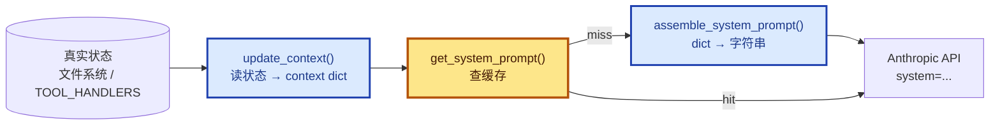

# 10 - System Prompt

> [!note]
> 从 s01 到 s09，SYSTEM prompt 都是一行硬编码字符串。s10 把它拆成"分段 + 按状态组装 + 缓存"。每段独立维护，section 是否加载取决于真实状态（文件存不存在、工具有没有注册），不是消息关键词。这一课最大的观念转变：**prompt 是运行时组装出来的配置，不是写死的常量**。

## 这一步加了什么

- 一个 `PROMPT_SECTIONS` 字典：每段 prompt 独立维护（identity / tools / workspace / memory）。
- 一个 `assemble_system_prompt(context)`：根据 context 决定加载哪些 section，拼成字符串。
- 一个 `get_system_prompt(context)`：**缓存 wrapper**——context 没变就返回上次的字符串。
- 一个 `update_context()`：从真实状态（文件系统、TOOL_HANDLERS）派生 context dict。
- 循环里**每轮工具执行后**重新调用 `get_system_prompt(context)`。

## 为什么需要加

### 1. 硬编码 prompt 的三个痛点

s09 的 SYSTEM 已经是这个样子：

```python
SYSTEM = (
    f"You are a coding agent at {WORKDIR}. "
    "Use tools to solve tasks. Act, don't explain. "
    "Before starting any multi-step task, use todo_write. "
    "Skills are available via list_skills and load_skill. "
    "Relevant memories are injected below when available. "
    # ... 加一个能力就多一段
)
```

三个问题：

- **换项目要重写整个 prompt**：不知道哪些该改、哪些该留。
- **改一处可能影响全局**：加一段工具描述可能跟前面的指令冲突。
- **每次请求都带全部内容**：即使当前对话用不到某些段落也浪费 token。

### 2. prompt 应该是"配置"不是"常量"

SYSTEM prompt 本质上是**对模型的运行时配置**——告诉它当前在哪个工作目录、有哪些工具、有什么记忆。既然是配置，就应该按当前状态动态组装，不是写死。

s10 的转变就是把 SYSTEM 从**程序常量**升级成**配置对象**。

## 这是一个什么机制

这是 **Section-Based Prompt Assembly + Memoized Lookup** 模式。三个独立职责：



### 三个函数各司其职

| 函数 | 输入 | 输出 | 职责 |
|---|---|---|---|
| `update_context` | 真实状态（隐式） | context dict | **读状态**：磁盘 + TOOL_HANDLERS |
| `assemble_system_prompt` | context dict | 字符串 | **拼字符串**：按 context 选 section |
| `get_system_prompt` | context dict | 字符串 | **加缓存**：context 没变就不拼 |

s09 的 `build_system()` 把这三件事揉在一个函数里。s10 拆开。

### 为什么拆？因为要在循环里反复调

s09 只在 agent_loop 入口调一次 `build_system()`，整个循环用同一个 SYSTEM。

s10 想**每轮工具执行后都重新组装**——因为工具可能改变状态（比如 `write_file` 写了 `.memory/MEMORY.md`，下一轮 SYSTEM 就该带上 memory section）。

要在循环里反复调，就两个问题：

1. **性能**：每次都重新拼字符串浪费 CPU。
2. **可比较性**：怎么判断"context 没变"？

`get_system_prompt` 解决这两个：序列化 context 当 cache key，没变就返回旧的。

## 原本的 Claude Code 怎么做的

Claude Code 的 SYSTEM prompt 比这复杂得多，但骨架一样。

### 1. 二十多个 section，分两类

| 类别 | 例子 |
|---|---|
| **静态**（始终加载） | identity、doing_tasks、actions、using_tools、tone_style、output_efficiency |
| **动态**（按状态加载） | session_guidance、memory、env_info、language、output_style、mcp_instructions、token_budget |

`mcp_instructions` 是唯一的**易失性** section——MCP server 可以在轮次间连接和断开。

### 2. `SYSTEM_PROMPT_DYNAMIC_BOUNDARY`

CC 把 prompt 用一个特殊标记分成两段：

```
[静态 section 1]
[静态 section 2]
...
--- SYSTEM_PROMPT_DYNAMIC_BOUNDARY ---
[动态 section 1]
[动态 section 2]
...
```

**静态段**命中 API 的 prompt cache（`cache_control` 标记），动态段不命中。这样动态部分变化不会让静态 cache 失效——节省 token 计费。

s10 的单槽 cache 不涉及这一层——s10 只在 harness 内部避免重复拼字符串，**不**省 API token。代码注释里明确写了：

> "This cache only avoids redundant string assembly within a process. Real Claude Code additionally protects API-level prompt cache..."

### 3. 模式切换

CC 有几种 mode 会切换整个 prompt：

- **CLAUDE_CODE_SIMPLE**：整个 prompt 只有 2 行。
- **Proactive / KAIROS**：用紧凑版替换所有标准 section。
- **Coordinator**：协调器专用 prompt 完全替换。
- **Agent 模式**：subagent 定义的 prompt 替换或追加。

s10 没这个层级，但 section-based 设计让以后加这种切换很容易——只是 `assemble_system_prompt` 里多几个 if。

### 4. 三层缓存

CC 的缓存有三层（s10 只有第一层）：

1. **lodash memoize**：会话内 `getSystemContext` 和 `getUserContext` 缓存。
2. **section 注册缓存**：`STATE.systemPromptSectionCache` 缓存动态 section 结果，`/clear` 或 `/compact` 时清除。
3. **API 级缓存**：`splitSysPromptPrefix` 按 boundary 切成不同 cache scope 的块。

## 设计要点

### 1. 状态加载基于真实状态，不是消息关键词

`update_context` 完全忽略 messages 参数，只读文件系统和 TOOL_HANDLERS。

为什么？消息内容是**模糊**的（"我刚写了 memory 文件" ≠ 文件真的存在），状态是**精确**的（`MEMORY_INDEX.exists()` 是布尔值）。

加载决策走精确路径，行为才可预测、可调试。

### 2. section 之间互相独立

`PROMPT_SECTIONS` 是字典，改 `tools` 不影响 `identity`，加新 section 不动旧的。

这听起来像废话，但是 s09 的 f-string 写法连这点都保证不了——f-string 里的变量互相嵌套，改一处可能引起字符串拼接顺序错乱。

### 3. cache key 用 json.dumps 不用 hash

```python
key = json.dumps(context, sort_keys=True, ensure_ascii=False, default=str)
```

详见 Q&A。简而言之：`hash()` 有进程随机化（同进程稳定但跨进程不同），且对 list/dict 报 `unhashable`。`json.dumps` 是确定性的、可序列化的、跨进程稳定的。

### 4. 循环内重新组装

```python
while True:
    response = client.messages.create(..., system=system, ...)
    # 执行工具...
    context = update_context(context, messages)   # 状态可能变了
    system = get_system_prompt(context)           # 重新组装（命中 cache 就直接返回）
```

工具可能改状态（写文件、注册工具）。下一轮 API 调用前必须重算。

## 实现对照（s10/code.py）

PROMPT_SECTIONS 字典：

```python
PROMPT_SECTIONS = {
    "identity": "You are a coding agent. Act, don't explain.",
    "tools": "Available tools: bash, read_file, write_file.",
    "workspace": f"Working directory: {WORKDIR}",
    "memory": "Relevant memories are injected below when available.",
}
```

按状态拼接：

```python
def assemble_system_prompt(context: dict) -> str:
    sections = []
    sections.append(PROMPT_SECTIONS["identity"])
    sections.append(PROMPT_SECTIONS["tools"])
    sections.append(PROMPT_SECTIONS["workspace"])

    memories = context.get("memories", "")
    if memories:
        sections.append(f"Relevant memories:\n{memories}")

    return "\n\n".join(sections)
```

缓存 wrapper：

```python
_last_context_key = None
_last_prompt = None

def get_system_prompt(context: dict) -> str:
    global _last_context_key, _last_prompt
    key = json.dumps(context, sort_keys=True, ensure_ascii=False, default=str)
    if key == _last_context_key and _last_prompt:
        return _last_prompt
    _last_context_key = key
    _last_prompt = assemble_system_prompt(context)
    return _last_prompt
```

state 派生：

```python
def update_context(context: dict, messages: list) -> dict:
    memories = ""
    if MEMORY_INDEX.exists():
        content = MEMORY_INDEX.read_text().strip()
        if content:
            memories = content
    return {
        "enabled_tools": list(TOOL_HANDLERS.keys()),   # list() 冻结 dict_keys 视图
        "workspace": str(WORKDIR),                       # Path → str 才能 json.dumps
        "memories": memories,
    }
```

agent_loop 接入：

```python
def agent_loop(messages: list, context: dict):
    system = get_system_prompt(context)
    while True:
        response = client.messages.create(..., system=system, ...)
        ...
        # 工具执行后：
        context = update_context(context, messages)
        system = get_system_prompt(context)
```

## 相关概念

- [[09 - Memory]]：s10 的 context 概念其实是 s09 `build_system()` 内部状态的显式化。详见 Q&A。
- [[04 - Hooks]]：UserPromptSubmit hook 是注入运行时上下文的另一个位置。
- [[08 - Context Compact]]：s10 的 prompt 不参与 messages 压缩——它是每轮重新算的。

> [!warning]
> 几个容易踩的坑：
>
> 1. **把动态内容塞静态段**：例如把当前 git 分支放进 identity section，每次变化都让整个 cache 失效。
> 2. **缓存对象引用而非快照**：`context["enabled_tools"] = TOOL_HANDLERS.keys()` 直接放视图，dict 变化时视图也变，cache key 不稳定。
> 3. **期望这个 cache 省 API 钱**：它只省 harness 内部的字符串拼接 CPU。要省 API 钱，得用 `cache_control` 标记（CC 的做法）。

## Q&A

### Q1: 为什么 s10 突然冒出一个 context 概念？s09 里完全没有。

**A**：s09 的 `build_system()` 内部其实**早就有 context**——只是没显式化。

s09 的 `build_system()` 干两件事：

1. 读状态：`read_memory_index()` 看 `.memory/MEMORY.md` 在不在。
2. 拼 SYSTEM：把状态塞进 f-string。

这两个动作的"中间产物"就是 s10 的 context。s09 把它藏在函数局部变量里，跑完就没了。

s10 把它提取成 dict，三个理由：

1. **可以缓存**：dict 能 `json.dumps` 当 cache key，局部变量不行。
2. **可以传给多个函数**：`get_system_prompt` 和 `assemble_system_prompt` 都要读它。
3. **可以反复刷新**：s10 想在循环每轮都重新读状态，需要把"读状态"独立成可调用函数。

**真正的新能力只有一句话**：循环内重新组装 SYSTEM。剩下的（context、assemble、cache）都是为这句话服务的脚手架。

### Q2: 单槽缓存只记录 last_context_key，是不是太弱了？

**A**：你说得对，**单槽缓存确实有局限**——如果 context 在 A、B、A、B 之间交替，命中率 = 0%。

但 Agent 实际跑起来 context 几乎不会交替：

- `enabled_tools` 进程内不变。
- `workspace` 进程内不变。
- `memories` 文件存在时才变。

实际 context 序列是 `[A, A, A, B, B, B, C, C, C]`——单调变化，单槽命中率几乎 100%。

真正会暴露问题的场景：Agent 在循环里**反复创建/删除同一个状态文件**——这种"乒乓"在真实任务里基本不会出现。

**真要批判 s10 的缓存**，更值得批判的不是"单槽"，而是"为什么不给 `cache_control` 标记"——那才是 Anthropic API 的省 token 关键。但那不是 s10 这课的主题（s10 只讲 harness 层组装），所以作者有意省略。

改进版（LRU 多槽）：

```python
from collections import OrderedDict
_PROMPT_CACHE: OrderedDict[str, str] = OrderedDict()
_CACHE_MAX = 8

def get_system_prompt(context):
    key = json.dumps(context, sort_keys=True, ensure_ascii=False, default=str)
    if key in _PROMPT_CACHE:
        _PROMPT_CACHE.move_to_end(key)
        return _PROMPT_CACHE[key]
    prompt = assemble_system_prompt(context)
    _PROMPT_CACHE[key] = prompt
    if len(_PROMPT_CACHE) > _CACHE_MAX:
        _PROMPT_CACHE.popitem(last=False)
    return prompt
```

### Q3: 为什么用 `json.dumps` 不用 `hash()`？

**A**：两个原因：

1. **Python 的 `hash()` 有进程随机化**。每次启动 Python，`hash("abc")` 结果不一样（默认开启的 anti-collision 随机化）。同进程内 stable，但作为 cache key 容易踩坑，且无法跨进程复用。
2. **`hash()` 对 list / dict 报 `unhashable type`**。context 里有 `enabled_tools: list`，直接 `hash(context)` 会崩。

`json.dumps(context, sort_keys=True, ...)` 把 dict 变成**确定性字符串**：

- `sort_keys=True`：key 顺序固定，`{"a":1,"b":2}` 和 `{"b":2,"a":1}` 序列化结果相同。
- `default=str`：兜底非 JSON 类型（如 Path 对象）。
- `ensure_ascii=False`：中文字符原样输出，便于调试。

字符串可以直接 `==` 比较，所以能稳定判断"context 没变"。

### Q4: `update_context(context, messages)` 这两个参数根本没用到，为什么要传？

**A**：你抓到了一个真实的 code smell。两个参数**确实没用**，函数体里完全没引用。最可能的原因：

- **作者本想用最后没用**：原本可能想"根据 messages 推断状态"，最后简化成只读文件。
- **API 对称**：调用点看起来"信息齐全"，即使现在用不到。

但这都是站不住脚的借口。诚实的修复是：

```python
def derive_context() -> dict:    # 不收参数
    ...
```

写代码的原则：**函数签名是契约**。承诺了不兑现，就是签名在撒谎。撒谎的签名比没注释更糟——它主动误导读者。这种"留接口但不实现"的写法在教学代码里偶尔出现，**生产代码里看到就该重构**。

### Q5: 为什么循环里每轮都要重新组装 SYSTEM？

**A**：因为工具可能改状态。

例子：

- 第 1 轮：Agent 用 `write_file` 创建了 `.memory/MEMORY.md`。
- 第 2 轮：现在文件存在了，SYSTEM 应该带上 memory section。

如果不在循环里重算，Agent 整个会话都用启动时的 SYSTEM，无法反映运行时状态变化。

s09 的处理是"等下一轮用户提问时重算"——延迟一个回合。s10 改成立即生效。

### Q6: 这个 cache 真的能省 API prompt cache 吗？

**A**：**不能**。这个 cache 只省 harness 内部的"字符串拼接 CPU"，**不**省 API 计费。

要省 API token，需要用 Anthropic API 的 `cache_control` 标记，让服务端缓存前缀 token。CC 通过 `SYSTEM_PROMPT_DYNAMIC_BOUNDARY` 把 prompt 切成静态段（命中 cache）和动态段（不命中）。

s10 没做这一层——因为 s10 的主题是"运行时组装"，不是"API 优化"。作者在注释里明确说了。
