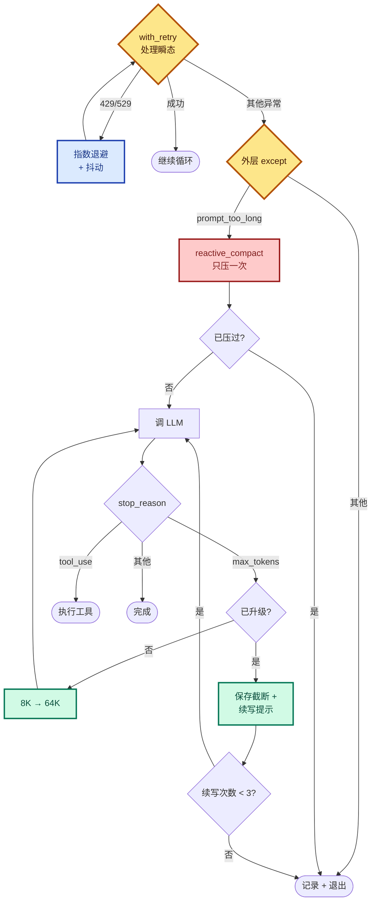

# 11 - Error Recovery

> [!note]
> Agent 跑着跑着 API 返回 529 过载、429 限流、`prompt_too_long`、`max_tokens` 截断——这些都是**常态**，不是 bug。s11 在 LLM 调用外包一层 try/except，按错误类型走不同的恢复路径：截断就升级 token、超限就压缩上下文、限流就指数退避。Agent 从"一碰就熄火"变成"会自我修复"。

## 这一步加了什么

- 一个 `RecoveryState` 类：跟踪本轮里"升级过没有、压缩过没有、529 连续几次、当前用哪个模型"。
- 一个 `with_retry(fn, state)` 包装器：处理瞬态错误（429 / 529），指数退避 + 抖动。
- 一个 `retry_delay(attempt)` 函数：`min(500 × 2^attempt, 32000) + random(0~25%)`。
- 三个恢复路径，根据错误类型走：
  - **Path 1**：`max_tokens` 截断 → 升级 8K → 64K，还不够就续写提示（最多 3 次）。
  - **Path 2**：`prompt_too_long` → 触发 reactive_compact（只压一次，再失败就退出）。
  - **Path 3**：429 / 529 → 指数退避，连续 3 次 529 切换备用模型。
- 一个 `is_prompt_too_long_error(e)` 字符串匹配器：识别各种"上下文太长"错误。

## 为什么需要加

### 1. 生产环境 API 错误是常态

| 错误 | 触发场景 | 频率 |
|---|---|---|
| 429 Rate Limit | 并发太多、配额耗尽 | 高峰期常见 |
| 529 Overloaded | 服务端过载 | 高峰期常见 |
| `max_tokens` | 模型话说一半 token 用完 | 长输出任务 |
| `prompt_too_long` | 上下文压缩后还是太长 | s08 兜底失效时 |
| 网络抖动 / timeout | TCP / DNS 问题 | 偶发 |

这些**不是代码 bug**——是分布式系统和 LLM 服务的物理特性。Agent 不处理就是"一碰就熄火的车"。

### 2. s08 的 reactive_compact 是雏形但不够

s08 已经在 `agent_loop` 里 catch `prompt_too_long` 触发 reactive_compact。但只有这一种恢复，没有：

- 截断怎么办（s08 直接接受截断的输出）。
- 限流怎么办（s08 直接抛异常）。
- 过载怎么办（同上）。

s11 把这些一次性补齐。

### 3. Agent 要能"无人值守"地长跑

Phase 4 之后 Agent 会跑后台任务、定时任务。**没人在场**的时候 API 报错，Agent 必须自己处理。s11 是 Phase 4 的前置条件——没有 error recovery，后台任务必死。

## 这是一个什么机制

这是 **Classify-then-Recover** 模式，分布式系统里到处都是：



### 三个恢复路径的对称性

每条路径都是"**判断错误类型 → 选恢复动作 → 限制次数 → 重试或退出**"。

| 路径 | 错误信号 | 恢复动作 | 次数限制 |
|---|---|---|---|
| 1 | `stop_reason == "max_tokens"` | 升级 token / 续写 | 升级 1 次 + 续写 3 次 |
| 2 | `prompt_too_long` 异常 | reactive_compact | 1 次 |
| 3 | 429 / 529 异常 | 指数退避 / 换模型 | 10 次 |

**为什么都有限制**？因为每种恢复都有边际效用：

- 升级到 64K 还截断 → 再升也没用（API 上限）。
- 压缩一次还超 → 再压也是这个大小（已经是最小了）。
- 退避 10 次还失败 → 服务端真挂了，再等也没用。

无限重试会让 Agent 卡死。**有限重试 + 优雅退出**才是工程做法。

### 指数退避 + 抖动

```python
def retry_delay(attempt, retry_after=None):
    if retry_after:
        return retry_after
    base = min(500 * (2 ** attempt), 32000) / 1000
    jitter = random.uniform(0, base * 0.25)
    return base + jitter
```

- **指数增长**：500ms → 1s → 2s → 4s → ... → 32s（上限）。
- **抖动（jitter）**：加 0~25% 随机。

为什么需要抖动？如果没有抖动，所有同时收到 429 的客户端会在同一时刻重试（比如都等 1 秒），又同时撞限流。**抖动让重试错开**——这是分布式系统的常识（AWS 架构博客有名文 "Exponential Backoff and Jitter"）。

如果服务端返回 `Retry-After` header（"你 30 秒后再来"），优先用那个值，不用自己算。

## 原本的 Claude Code 怎么做的

CC 的 error recovery 比这复杂得多——十几种 reason code，专门有 `services/api/withRetry.ts`（822 行）和 `query.ts`（1729 行）处理。

### 1. 十几种 reason / transition

s11 只展开 5 种最常见的。CC 还有：

| reason | 含义 |
|---|---|
| `collapse_drain_retry` | context collapse 先提交暂存 |
| `model_error` | 模型内部错误 |
| `image_error` | 图片尺寸 / 格式问题 |
| `aborted_streaming` | 流式中止 |
| `aborted_tools` | 工具中止 |
| `stop_hook_blocking` | Stop hook 注入 blocking error 让模型自纠 |
| `token_budget_continuation` | token 用量 < 90% 时继续 |
| `max_turns` | 达到最大轮次 |

每个 reason 都有专门的 transition 逻辑。

### 2. 529 → Fallback Model

CC 的策略：连续 3 次 529（`MAX_529_RETRIES = 3`）→ 自动切换 fallback model（如 Opus → Sonnet）。切换时**清空所有 pending 消息和 tool 结果**，给用户展示 "Switched to {model} due to high demand"。

为什么要清空？因为不同模型的 tool_use 格式可能不兼容，残留的旧格式会让新模型困惑。

### 3. Diminishing Returns 检测

CC 的 token budget continuation 不是无限的。当连续 3 次 continuation 且 token 增量 < 500 时，系统判断"继续也没有实质性产出"，**主动停止 continuation**。

这是工程经验：模型有时候会陷入"每次只产一点点"的循环，硬续下去浪费 token。设阈值主动跳出。

### 4. 流式错误的特殊处理

CC 流式路径中，可恢复的错误（413、max_tokens、media error）在 streaming 期间**被暂扣不展示**——SDK 消费者看不到，只有恢复逻辑能看到。等 streaming 结束后才判断是否需要恢复。

这是为了**用户体验**：不让用户看到一堆错误闪过，只展示最终结果。

### 5. CONTINUATION_PROMPT 原文

CC 的续写提示：

```
Output token limit hit. Resume directly — no apology, no recap of what
you were doing. Pick up mid-thought if that is where the cut happened.
Break remaining work into smaller pieces.
```

注意几个细节：

- "no apology"：模型爱道歉，浪费 token。
- "no recap"：不要复述刚才说了什么。
- "pick up mid-thought"：直接接上断点。
- "break into smaller pieces"：暗示模型把剩余工作切碎，避免再次截断。

## 设计要点

### 1. 分层处理：瞬态 vs 永久

`with_retry` 只处理瞬态（429/529），其他异常**re-raise** 给外层 try/except。外层处理永久性错误（prompt_too_long）。

为什么不一起处理？因为瞬态错误**值得无限重试**（10 次），永久错误**不值得**（压一次就够）。混在一起会让逻辑难懂。

### 2. 升级一次 vs 续写多次

`max_tokens` 截断时分两步：

```python
if not state.has_escalated:
    max_tokens = 64000              # 升级
    state.has_escalated = True
    continue                        # 不动 messages，原请求重发
# 64K 还截断
messages.append({"role": "assistant", "content": response.content})  # 保存截断
messages.append({"role": "user", "content": CONTINUATION_PROMPT})    # 续写提示
```

**升级时不动 messages**——因为没保存截断输出，相当于"假装上次什么都没发生，重新生成"。这样模型可以从头输出完整内容，质量最好。

**续写时必须保存截断输出**——否则模型不知道刚才说到哪。

升级只有一次机会（再升就是 API 上限了），续写最多 3 次（diminishing returns）。

### 3. reactive_compact 只压一次

```python
if not state.has_attempted_reactive_compact:
    messages[:] = reactive_compact(messages)
    state.has_attempted_reactive_compact = True
    continue
return  # 压过了还超，退出
```

为什么只压一次？因为 reactive_compact 是确定性的（保留最后 5 条 + 占位）。第二次压同样的逻辑会得到几乎一样的结果。重复没意义。

### 4. RecoveryState 跨迭代保持状态

```python
class RecoveryState:
    def __init__(self):
        self.has_escalated = False
        self.recovery_count = 0
        self.consecutive_529 = 0
        self.has_attempted_reactive_compact = False
        self.current_model = PRIMARY_MODEL
```

这些字段都需要**跨循环迭代**保持——"升级过没有"不能每轮重置。所以放进一个对象，在 agent_loop 开头创建一次。

`consecutive_529` 在成功时重置为 0：

```python
result = fn()
state.consecutive_529 = 0   # 成功就清零
return result
```

只统计**连续** 529，不是累计。这样避免历史抖动误触发 fallback model。

### 5. 错误识别用字符串匹配

```python
def is_prompt_too_long_error(e):
    msg = str(e).lower()
    return (("prompt" in msg and "long" in msg)
            or "prompt_is_too_long" in msg
            or "context_length_exceeded" in msg
            or "max_context_window" in msg)
```

为什么不直接 catch 特定异常类？因为不同 SDK 版本、不同代理层（如 LiteLLM、OpenRouter）会包装异常，类名不一致。**字符串匹配最稳**——只要错误消息里有"prompt too long"就触发。

代价是脆弱：API 改文案就失效。生产代码要做兼容矩阵。

## 实现对照（s11/code.py）

RecoveryState：

```python
class RecoveryState:
    def __init__(self):
        self.has_escalated = False
        self.recovery_count = 0
        self.consecutive_529 = 0
        self.has_attempted_reactive_compact = False
        self.current_model = PRIMARY_MODEL
```

指数退避：

```python
def retry_delay(attempt, retry_after=None):
    if retry_after:
        return retry_after
    base = min(BASE_DELAY_MS * (2 ** attempt), 32000) / 1000
    jitter = random.uniform(0, base * 0.25)
    return base + jitter
```

瞬态错误处理：

```python
def with_retry(fn, state):
    for attempt in range(MAX_RETRIES):
        try:
            result = fn()
            state.consecutive_529 = 0
            return result
        except Exception as e:
            name = type(e).__name__
            msg = str(e).lower()
            if "ratelimit" in name.lower() or "429" in msg:
                delay = retry_delay(attempt)
                time.sleep(delay)
                continue
            if "overloaded" in name.lower() or "529" in msg:
                state.consecutive_529 += 1
                if state.consecutive_529 >= MAX_CONSECUTIVE_529:
                    if FALLBACK_MODEL:
                        state.current_model = FALLBACK_MODEL
                        state.consecutive_529 = 0
                delay = retry_delay(attempt)
                time.sleep(delay)
                continue
            raise  # 非瞬态，抛给外层
    raise RuntimeError(f"Max retries ({MAX_RETRIES}) exceeded")
```

agent_loop 接入：

```python
def agent_loop(messages, context):
    system = get_system_prompt(context)
    state = RecoveryState()
    max_tokens = DEFAULT_MAX_TOKENS

    while True:
        try:
            response = with_retry(
                lambda mt=max_tokens, mdl=state.current_model:
                    client.messages.create(
                        model=mdl, system=system, messages=messages,
                        tools=TOOLS, max_tokens=mt),
                state)
        except Exception as e:
            if is_prompt_too_long_error(e):
                if not state.has_attempted_reactive_compact:
                    messages[:] = reactive_compact(messages)
                    state.has_attempted_reactive_compact = True
                    continue
                return  # 退无可退
            return  # 其他永久错误

        if response.stop_reason == "max_tokens":
            if not state.has_escalated:
                max_tokens = ESCALATED_MAX_TOKENS
                state.has_escalated = True
                continue  # 不动 messages
            messages.append({"role": "assistant", "content": response.content})
            if state.recovery_count < MAX_RECOVERY_RETRIES:
                messages.append({"role": "user", "content": CONTINUATION_PROMPT})
                state.recovery_count += 1
                continue
            return

        messages.append({"role": "assistant", "content": response.content})
        if response.stop_reason != "tool_use":
            return
        # 执行工具...
```

几个细节：

- lambda 里的 `mt=max_tokens, mdl=state.current_model` 是**默认参数捕获**——避免循环后 lambda 引用闭包变量时拿到最新值（Python 闭包陷阱）。
- `max_tokens` 升级后不再降回去——整个 agent_loop 生命周期内都用 64K。下次新 agent_loop 重新从 8K 开始。
- RecoveryState 是 agent_loop 的局部变量，**不跨会话**。每次新会话重置。

## 相关概念

- [[08 - Context Compact]]：s11 的 reactive_compact 是 s08 的兜底，s11 加了"只压一次"的限制。
- [[09 - Memory]]：Memory 是"主动持久化"，Error Recovery 是"被动应急"。互补。
- [[10 - System Prompt]]：s11 复用 s10 的 prompt 组装，没有改动。

> [!warning]
> 几个容易踩的坑：
>
> 1. **无限重试**：不设上限，Agent 在 API 挂时永远卡住。每种恢复都要有限制。
> 2. **没有抖动**：所有客户端同步重试，造成"重试风暴"。退避必须加 jitter。
> 3. **升级时保存截断输出**：截断内容污染 messages，下一轮模型看到自己半截的话反而困惑。
> 4. **RecoveryState 跨会话**：每个新会话该重置，否则上次会话的"已升级"状态会让本次直接跳到 64K。
> 5. **依赖异常类名匹配**：不同 SDK 包装层类名不一致，字符串匹配更稳但需维护兼容列表。

## Q&A

### Q1: 为什么 `with_retry` 内部不处理 `prompt_too_long`？

**A**：因为瞬态错误和永久错误的处理逻辑**质上不同**：

- 瞬态（429/529）：**值得多次重试**，因为下次可能成功。退避 10 次。
- 永久（`prompt_too_long`）：**重试没用**，请求太长就是太长。要么压缩，要么放弃。压一次。

如果把 prompt_too_long 也塞 with_retry，会出现"重试 10 次同样的超长请求"——纯浪费。所以分层：with_retry 只管瞬态，永久错误 re-raise 给外层做分类处理。

### Q2: `consecutive_529` 为什么成功后清零？

**A**：因为要统计**连续** 529，不是累计。

设想场景：

- 第 1 轮：529（连续 1 次）
- 第 2 轮：成功
- 第 3 轮：529（连续 1 次，累计 2 次）
- 第 4 轮：529（连续 2 次，累计 3 次）

如果用累计，第 4 轮就会触发"连续 3 次"切换模型——但中间有过成功，服务端没那么糟。**清零**让"连续 N 次"的语义真正反映"最近一直失败"。

### Q3: lambda 里 `mt=max_tokens, mdl=state.current_model` 这写法是什么？

**A**：这是 Python 闭包的**默认参数捕获**技巧，避免 late binding 问题。

错误写法：

```python
while True:
    ...
    response = with_retry(
        lambda: client.messages.create(..., max_tokens=max_tokens, model=state.current_model),
        state)
    max_tokens = 64000  # 升级
```

lambda 里的 `max_tokens` 是闭包变量，**等 lambda 真正执行时才查值**。如果在 with_retry 内部重试多次，每次重试拿到的都是最新的 `max_tokens`（可能已被改成 64000），而不是创建 lambda 时的值。

正确写法用默认参数**把当前值固定下来**：

```python
lambda mt=max_tokens, mdl=state.current_model: ...
```

这样 lambda 创建时 `mt` 和 `mdl` 就被绑定到当时的值，循环里 `max_tokens` 变化不影响这个 lambda。下一次循环创建新 lambda 时再用新值。

### Q4: 升级 token 后，下次 agent_loop 会保留 64K 吗？

**A**：**不会**。`max_tokens` 是 agent_loop 的局部变量，每次新会话从头开始。

```python
def agent_loop(messages, context):
    ...
    max_tokens = DEFAULT_MAX_TOKENS   # ← 每次都重置
    state = RecoveryState()           # ← state 也重置
```

这是故意的：

- 单次会话里升级是合理的（任务可能真的需要长输出）。
- 跨会话默认从 8K 开始（避免无脑浪费 token）。
- 下次会话如果还遇到截断，再次升级即可。

### Q5: reactive_compact 在教学版里只保留最后 5 条，真的够吗？

**A**：**不够**，这是教学简化。

教学版：

```python
def reactive_compact(messages):
    tail = messages[-5:]
    return [{"role": "user", "content": "[Reactive compact]..."}] + tail
```

只保留最后 5 条 + 占位符。简单但**信息损失巨大**——前 N 轮的来龙去脉全没了。

CC 的真实实现会调 LLM 生成压缩摘要（s08 的 `summarize_history`），把摘要 + 最近几条放进 messages。s08 已经实现了这个逻辑，s11 教学版为了聚焦 error recovery 用了简化版。

如果要在生产用，应该把 s08 的 `compact_history` 接过来。

### Q6: 为什么 max_tokens 检查在 append 之前？

**A**：因为升级路径**不希望把截断输出存进 messages**。

```python
if response.stop_reason == "max_tokens":
    if not state.has_escalated:
        max_tokens = ESCALATED_MAX_TOKENS
        state.has_escalated = True
        continue  # ← 直接 continue，不 append
    # 升级过了还截断，才保存
    messages.append({"role": "assistant", "content": response.content})
    ...
```

升级时 messages 不变，相当于"假装没发生过截断，重新请求"。这样模型可以从头输出完整内容。

如果先 append 再判断升级，截断的内容就进了 messages，下一轮模型看到自己半截的话反而困惑——"我刚才说到哪了？要不要接下去？" ——它会接下去而不是从头重写。

所以代码顺序是：**先判断 stop_reason → 决定路径 → 路径决定要不要 append**。普通完成才在最后 append。
