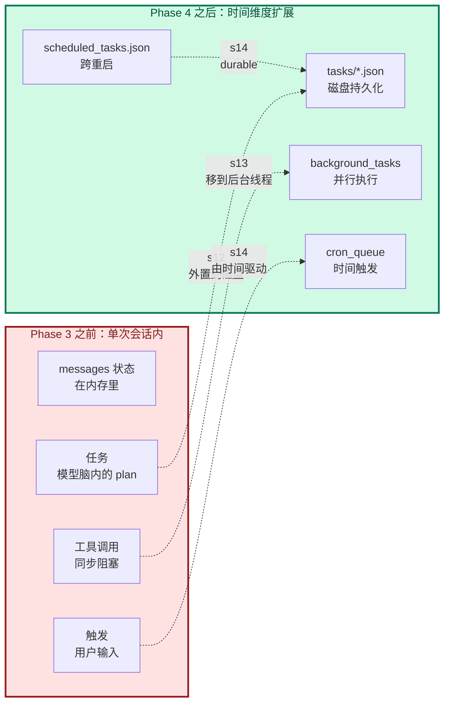
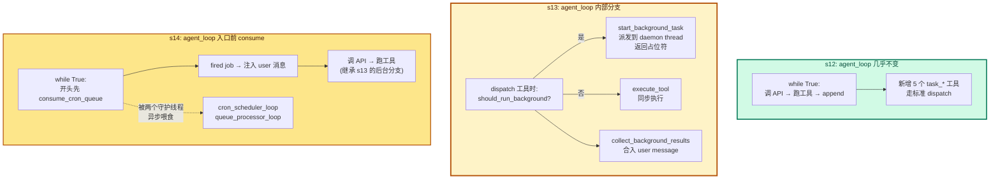
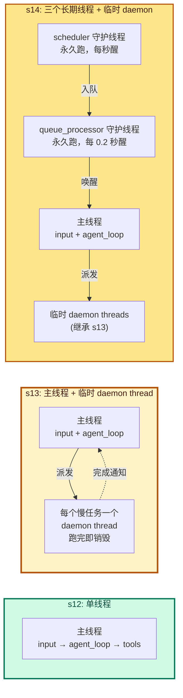

# Phase 4 综合总结 --- 长时间任务

> [!note]
> Phase 1 让 Agent 能跑，Phase 2 让它能跑长任务，Phase 3 让它能跨会话连续。但**所有这些工作都假设"在一次会话内、用户在场、单线程同步执行"**。Phase 4 的三课合起来回答：**"怎么让 Agent 在时间维度上扩展？"** 三个答案：把任务变成持久化的依赖图（s12）、把慢工具移到后台线程（s13）、让时间本身触发任务（s14）。共同主题：**让 Agent 从"一问一答"变成"长时间运行的状态机"**。

## 为什么 Phase 4 是"长时间任务"

Phase 1 - 3 的 Agent 有三个时间维度的限制：

1. **任务粒度小**：一次会话 = 一个连续对话。复杂工作流（如"重构 X 后跑测试，过了再部署"）必须靠用户手动驱动。
2. **执行模型同步**：慢工具（如 `npm install` 跑 5 分钟）阻塞整个 agent loop，期间 Agent 干不了别的。
3. **没有"自己醒来"的能力**：用户不在场时 Agent 完全静止。需要每天 9 点检查部署？做不到。

Phase 4 解决这三件事：

| 课 | 解决什么 | 机制 |
|---|---|---|
| s12 Task System | 任务可持久化、有依赖、可断点续跑 | 文件系统存储 + 状态机 + DAG |
| s13 Background Tasks | 慢工具不阻塞主流程 | 守护线程 + 通知注入 |
| s14 Cron Scheduler | 时间驱动自动触发 | 4 层架构 + 两个守护线程 + durable 持久化 |

三者机制不同，但**共同把 Agent 从"单线程同步循环"扩展为"长时间运行的多线程状态机"**。

## 每一步加了什么、为什么加

### s12 --- Task System

| 维度 | 内容 |
|---|---|
| 加了什么 | `Task` dataclass + `.tasks/` 目录 + 6 个 CRUD/状态函数 + 5 个工具 |
| 为什么 | TodoWrite 是 in-memory；任务需要持久化（重启不丢）；复杂工作流有依赖关系 |
| 这是什么机制 | 状态机（pending → in_progress → completed）+ 依赖图（DAG via blockedBy）+ 文件粒度持久化 |
| Claude Code 怎么做 | 用 TaskCreate/TaskUpdate/TaskGet/TaskList 替代了早期 TodoWrite；同样的依赖图模型；UI 里可视化任务状态 |

**关键贡献**：把"任务"从模型脑内的 plan 变成磁盘上的可观察、可恢复、可依赖的对象。

**对应到 Claude Code**：CC 早期也是 TodoWrite，后来升级成 Task 系列（你可以在你用的这个 Claude Code 工具列表里看到 TaskCreate / TaskUpdate / TaskGet / TaskList / TaskStop）。

### s13 --- Background Tasks

| 维度 | 内容 |
|---|---|
| 加了什么 | `threading.Thread` + `background_tasks` / `background_results` 两个 dict + `background_lock` + `should_run_background` + `is_slow_operation` + `start_background_task` + `collect_background_results` + agent_loop 分支 |
| 为什么 | 慢工具阻塞主流程；用户输入其他工作时 Agent 还在等命令跑完 |
| 这是什么机制 | Producer-Consumer + Daemon Thread + Notification Injection |
| Claude Code 怎么做 | 用 `child_process.spawn`（不是 JS 线程）跑外部命令 + Haiku side-query 生成 `pendingToolUseSummary` 作为进度标签 |

**关键贡献**：把"工具调用"从同步调用变成异步派发，Agent 能继续推理而不等命令。

**对应到 Claude Code**：CC 的"Background Tasks"也是用 OS 子进程实现的（因为 Node.js 单线程，不能开线程跑外部命令）；UI 上你会看到任务条带 spinner 和实时摘要。

### s14 --- Cron Scheduler

| 维度 | 内容 |
|---|---|
| 加了什么 | `CronJob` dataclass + 5 个全局状态（`scheduled_jobs` / `cron_queue` / `cron_lock` / `agent_lock` / `_last_fired`）+ 9 个调度/匹配/校验函数 + 2 个独立守护线程（scheduler + queue_processor）+ durable 文件持久化 + 3 个工具 |
| 为什么 | 时间驱动场景（每日报告、定时检查）；用户不在场也要跑；durable 让重启不丢任务 |
| 这是什么机制 | 4 层架构（Scheduler / Queue / Queue Processor / Agent Loop）+ 双重检查锁定 + DOM/DOW OR 语义 + 持久化恢复 |
| Claude Code 怎么做 | 类似的 4 层架构 + 5 字段 cron + jitter（避免 :00 拥堵）+ `/loop` skill + durable 持久化 |

**关键贡献**：让 Agent 有了**自主唤醒**的能力——不再等用户输入，可以由时间驱动。

**对应到 Claude Code**：CC 把这套做成了 `/loop` 命令 + CronCreate/CronList/CronDelete 工具。你可以在你当前会话的工具列表里看到 CronCreate / CronDelete / CronList。

## 三课的统一逻辑：把"时间维度"搬进 Agent



每一课都是**把原本依赖"用户即时输入 + 单线程同步"的东西搬到另一个维度**：

| 课 | 原本依赖 | 搬到哪 | 新能力 |
|---|---|---|---|
| s12 | 内存里的 TodoWrite | 磁盘 `.tasks/*.json` | 任务跨重启存活、有依赖关系 |
| s13 | 同步工具调用 | 后台守护线程 | 慢工具不阻塞主流程 |
| s14 | 用户即时输入 | 时间触发 + 队列 | Agent 能自主醒来 |

## 三课对 agent_loop 的影响（递进改造）

Phase 4 的三课**对 agent_loop 的改造程度递增**。这是 Phase 4 最值得讲的一条线。



### s12: 对 agent_loop 几乎没影响

只往 `TOOLS` 数组加 5 个新工具名 + 往 `TOOL_HANDLERS` 加 5 个 handler。**dispatch 流程完全没变**。任务系统的所有逻辑（持久化、状态转换、依赖检查）都在 handler 内部完成。

```
agent_loop:
  调 API → tool_use → dispatch → run_create_task/run_claim_task/... → tool_result
```

### s13: agent_loop 多了一个分支

dispatch 处多一个判断：

```
agent_loop:
  调 API → tool_use → 检查 should_run_background?
              ↓ 是                     ↓ 否
              start_background_task    execute_tool
              返回占位符 tool_result    返回真实 tool_result
              ↓
              所有工具结果 + collect_background_results
              → 合并成一条 user message
```

新增的分支：**同步工具和后台工具走不同路径**，最后合并注入。

### s14: agent_loop 入口前多了 consume

每轮循环开头先消费队列：

```
agent_loop:
  while True:
    fired = consume_cron_queue()    # ← s14 新增
    for job in fired:
        messages.append({"role":"user", "content": f"[Scheduled] {job.prompt}"})  # ← 注入

    调 API → tool_use → dispatch (继承 s13 分支)
```

agent_loop 从"用户驱动"变成"**可以被两条路径喂食**"：

- 主线程用户输入（`input()`）→ 直接进入 messages
- 队列处理器投递（cron 触发）→ 通过 `consume_cron_queue` 进入 messages

## 三课的多线程演进

Phase 4 也是 Agent **从单线程走向多线程**的过程。



| 阶段 | 线程数 | 长期线程 | 临时线程 |
|---|---|---|---|
| s12 | 1 | 主线程 | 无 |
| s13 | 1 + N | 主线程 | 每个后台任务一个 daemon |
| s14 | 3 + N | 主线程 + scheduler + queue_processor | s13 的后台 daemon |

**关键观察**：

- s12 → s13 的跨越：**第一次引入并发**。同步调用变成异步派发。
- s13 → s14 的跨越：**第一次有"长期跑的并发"**。守护线程不随任务结束而退出，而是持续轮询。

## 一个心智模型

把 Agent 想成一个**办公室员工**：

- **s12 Task System**：给他一个**任务看板**（白板上贴便签）。每个便签有状态（待办/进行中/完成）、负责人、依赖关系。下班没干完？便签还在，明天继续。
- **s13 Background Tasks**：给他一个**助理**。重活（编译、测试）丢给助理去跑，他继续处理其他事；助理跑完会送个便条过来。
- **s14 Cron Scheduler**：给他一个**闹钟 + 收件箱**。每天 9 点闹钟响，自动往收件箱塞一封"该跑日报告了"的邮件，他看到就处理。

员工本身不变，变的是他**周围的支撑系统**。Phase 4 的三课就是这三件：任务看板、助理、闹钟。

## Phase 4 之后能做什么

到 s14 为止，harness 已经能：

- 把复杂工作流拆成有依赖的任务图（s12）
- 跑慢工具时不阻塞（s13）
- 时间到了自己醒来干活（s14）

**这是一个"能自己跑起来"的 Agent**。装到服务器上，cron 设好，可以 24/7 跑，不需要人盯着输入。

但它还**不能**：

- 把一个大任务分给多个 Agent 并行干 → Phase 5 多智能体
- 接入外部工具生态（GitHub / Slack / 数据库）→ Phase 6 MCP

Phase 5 解决"协作并行"，Phase 6 解决"生态接入"。

## 实现对照：Phase 4 之后的 agent_loop

```python
def agent_loop(messages, context):
    system = get_system_prompt(context)
    while True:
        # s14: 入口前消费 cron 队列
        fired = consume_cron_queue()
        for job in fired:
            messages.append({"role": "user",
                             "content": f"[Scheduled] {job.prompt}"})

        # s11: 错误恢复（这里简化展示，实际还有 try/except）
        response = client.messages.create(
            model=MODEL, system=system, messages=messages,
            tools=TOOLS, max_tokens=8000)

        messages.append({"role": "assistant", "content": response.content})
        if response.stop_reason != "tool_use":
            return

        # s13: dispatch 时判后台 vs 同步
        results = []
        for block in response.content:
            if block.type != "tool_use":
                continue

            # s12 + s13: 同一入口，分支处理
            if should_run_background(block.name, block.input):
                bg_id = start_background_task(block)
                results.append({"type": "tool_result",
                                "tool_use_id": block.id,
                                "content": f"[Background task {bg_id} started]"})
            else:
                output = execute_tool(block)   # 内部走 s12 的 task handlers
                results.append({"type": "tool_result",
                                "tool_use_id": block.id,
                                "content": output})

        # s13: 合并后台通知
        user_content = list(results)
        notifications = collect_background_results()
        if notifications:
            for n in notifications:
                user_content.append({"type": "text", "text": n})
        messages.append({"role": "user", "content": user_content})

        # s10: 重算 context 和 system
        context = update_context(context, messages)
        system = get_system_prompt(context)
```

Phase 4 相对 Phase 3 加的部分：

- **s12**：5 个 task 工具加进 TOOLS / TOOL_HANDLERS（隐式）。
- **s13**：dispatch 分支 + collect 通知注入。
- **s14**：入口前 `consume_cron_queue()` + 注入 user 消息。

**循环骨架（while + append + dispatch）依然没动**。Phase 4 是在循环的不同位置（开头、dispatch 内、user message 组装）插入"时间维度"的扩展点。

## Q&A

### Q1: Phase 4 三课必须按顺序学吗？

**A**：**强烈建议按顺序**，因为三者层层递进：

- **s12 → s13**：s13 的 background task **是 task system 的一种应用**——只不过任务不是模型显式创建的，而是 dispatch 时自动派发的。理解 s12 的状态机，更容易理解 s13 的"派发-通知"模型。
- **s13 → s14**：s14 复用 s13 的 background task 机制（cron 触发的 turn 内部仍然能用后台工具）。理解 s13 的通知注入，s14 的"cron 队列注入"就是同构的。

跳着读会卡在"为什么 s14 突然冒出两个守护线程"。

### Q2: s12 的 task 系统跟 TodoWrite（s05）有什么区别？是不是重复？

**A**：不重复，**作用域不同**。

| 维度 | TodoWrite (s05) | Task System (s12) |
|---|---|---|
| 存储 | messages 里的 tool_result | 磁盘 `.tasks/*.json` |
| 生命周期 | 会话内 | 跨重启 |
| 状态 | 待办/进行中/完成 | 同 + owner + blockedBy |
| 依赖 | 无 | DAG |
| 主要目的 | 防止长任务中模型忘记 plan | 让任务跨会话/跨重启存活 |

TodoWrite 是**给模型看的工作记忆**，Task System 是**给系统用的持久状态**。CC 里 TodoWrite 已经被 Task 系列取代——s12 把这两个合并了。

### Q3: 为什么 s13 用线程而 CC 用进程？

**A**：**语言约束**。

- s13 教学版用 Python，Python 有真正的 `threading.Thread`。对 I/O bound 任务（等命令跑完），GIL 不影响。
- CC 用 Node.js，Node.js 单线程 + 事件循环，没法开线程跑 shell 命令。它通过 `child_process.spawn` 借 OS 的手——开一个新进程跑 npm，OS 调度两个进程并行。

结果一样（外部命令在"后台"跑），实现路径不同。**进程 vs 线程**对 Agent 逻辑透明，只影响 harness 怎么实现。

### Q4: s14 的两个守护线程能不能合并成一个？

**A**：能，但**会损失特性**。

合并后：

```python
def merged_loop():
    while True:
        time.sleep(1)
        # 判时间
        for job in ...:
            if cron_matches(...):
                cron_queue.append(job)
        # 判投递
        if has_cron_queue() and agent_lock.acquire(blocking=False):
            run_agent_turn_locked()
            agent_lock.release()
```

问题：

1. **轮询频率被绑死**：scheduler 想 1 秒醒一次（够细），queue processor 想 0.2 秒醒一次（更敏捷）。合并后选哪个都是妥协。
2. **职责混杂**：判时间 ≠ 唤 agent，是两个独立关切。合并会让代码更难维护。
3. **错误隔离差**：判时间的 bug 影响唤 agent，反之亦然。

s14 选了**两个独立线程 + 一个队列解耦**，每个线程职责单一、轮询频率独立、出错不互相影响。

### Q5: Phase 4 的核心收获应该是什么？

**A**：三个观念转变：

1. **任务 ≠ TodoWrite**。任务是有持久状态的对象（pending/in_progress/completed）、有依赖（blockedBy）、有 owner。TodoWrite 只是模型的工作记忆。
2. **慢工具必须异步**。同步执行 = 用户等待 = 不可用。后台执行 + 通知注入是基础设施。
3. **时间可以是触发源**。Agent 不必等用户。cron 让 Agent 有"自主性"，从被动工具变成主动 worker。

理解这三点，比记住具体的 `start_background_task` 或 `cron_matches` 重要得多。

### Q6: 学完 Phase 4，我自己写 Agent 时该装哪些？

**A**：**s12 Task System 是地基，s13 必装，s14 看场景**。

- **s12 必装**：任何要跑长任务的 Agent 都需要任务系统。否则跨重启、跨会话都丢失。CC 的 TaskCreate/Update/Get/List 就是 s12 的产品化版。
- **s13 必装**：只要工具有可能慢（>30 秒），就必须后台化。否则用户体验崩溃。
- **s14 看场景**：只有需要定时触发（日报告、定时检查、轮询）才需要。如果你的 Agent 只是被动响应用户，可以不装。

Phase 5（多智能体）依赖 s12 的任务系统作为协调中介，所以 s12 是必须的。

## 相关概念

- [[12 - Task System]]
- [[13 - Background Tasks]]
- [[14 - Cron Scheduler]]
- [[Phase 3 - 记忆与恢复/00 - 综合总结|Phase 3 综合总结]]
- [[05 - TodoWrite]]：s12 的前身
- [[10 - System Prompt]]：s12-s14 都复用 s10 的 prompt 组装
- [[11 - Error Recovery]]：s12-s14 的教学版省略了 s11 的完整恢复逻辑，生产实现必须补上

> [!warning]
> Phase 4 最容易产生的两个误解：
>
> 1. **以为三课是三个独立功能**。不是。它们共同回答"如何让 Agent 在时间维度上扩展"——是一个主题的三个角度（任务持久化 / 执行并行化 / 触发自动化）。
>
> 2. **以为 background task 和 cron task 是同一回事**。不是。background task 是**单次**异步执行（派发一个慢工具），cron task 是**周期**触发（时间到了唤 agent）。两者都涉及线程，但 daemon thread 跑完即销毁（s13），而 scheduler 守护线程永久跑（s14）。
