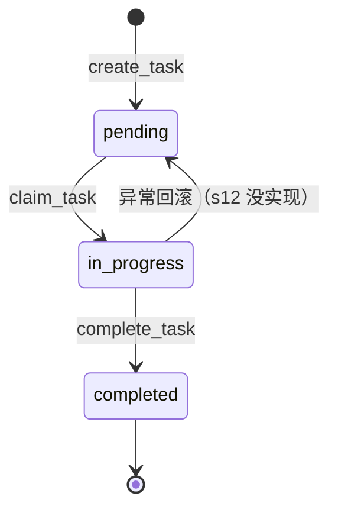
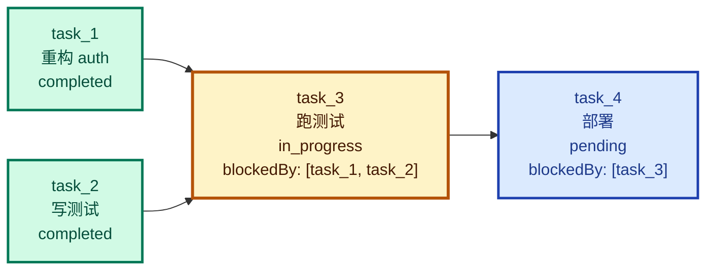
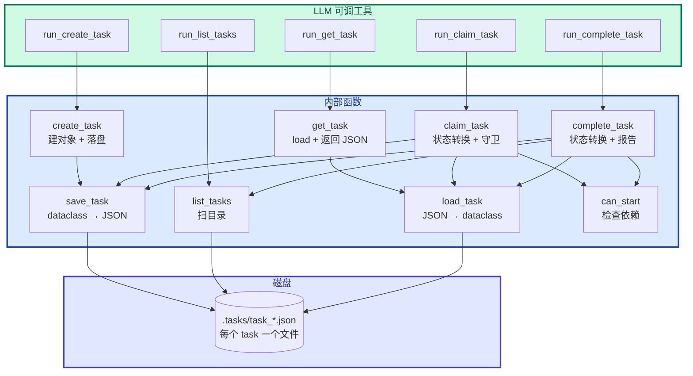

# 12 - Task System

> [!note]
> Phase 1 - 3 的 Agent 把"任务"放在两个地方：模型的脑内（plan）和 TodoWrite（在 messages 里）。两者都是**易失的**——会话结束 / 进程重启就消失，也没法表达"任务 A 完成后才能跑任务 B"这种依赖。s12 把任务外置成**磁盘上的 JSON 文件 + 状态机 + 依赖图**，让任务跨重启存活、跨工具调用可观察、跨 Agent 协作可分配。

## 这一步加了什么

### 1. 数据结构

- `Task` dataclass：6 个字段（id / subject / description / status / owner / blockedBy）。
- `TASKS_DIR = .tasks/`：每个 task 一个 JSON 文件。

### 2. 6 个内部函数（CRUD + 状态转换）

| 函数 | 作用 |
|---|---|
| `_task_path(task_id)` | task_id → 文件路径 |
| `create_task(subject, description, blockedBy)` | 新建并落盘 |
| `save_task(task)` | 序列化 dataclass → JSON 文件 |
| `load_task(task_id)` | 反序列化 JSON → dataclass |
| `list_tasks()` | 扫 `.tasks/` 目录，列出全部 |
| `get_task(task_id)` | 详情查询，返回 JSON 字符串 |

### 3. 3 个状态/依赖函数

| 函数 | 作用 |
|---|---|
| `can_start(task_id)` | 检查所有 blockedBy 是否都 completed |
| `claim_task(task_id, owner)` | pending → in_progress，记 owner |
| `complete_task(task_id)` | in_progress → completed，报告新解锁的下游 task |

### 4. 5 个 LLM 工具（在 TOOLS 和 TOOL_HANDLERS 里）

`create_task` / `list_tasks` / `get_task` / `claim_task` / `complete_task`。

## 为什么需要加

### 1. TodoWrite 是易失的

s05 的 TodoWrite 把任务列表存在 messages 的 tool_result 里。会话结束 = messages 清空 = 任务全丢。下次开会话从头再来。

更糟：s08 的 micro_compact / compact_history 会把旧的 tool_result **压缩掉**——TodoWrite 写下的任务列表可能被裁剪成占位符，模型自己都忘了写过什么。

### 2. 复杂工作流需要"依赖"

例子：

> 用户："帮我重构 auth 模块，跑测试，测试过了再部署。"

这其实是个**有依赖的图**：

```
[重构 auth] → [跑测试] → [部署]
```

如果用 TodoWrite，模型得自己记住"测试要先跑完才能部署"。一旦上下文压缩或会话重启，这个隐式状态就丢了。

需要**显式的依赖关系**：`blockedBy: [task_X]`。task_X 不 completed，task_Y 就 `can_start() = False`。

### 3. 跨重启需要"持久化"

跑长任务（如"重建索引"）跑一半进程崩了。重启后想从断点继续？TodoWrite 给不了——它根本不在磁盘上。

把 task 写成 `.tasks/{task_id}.json`，重启后扫目录就恢复。这就是 s12 的核心动机。

## 这是一个什么机制

### 状态机

每个 task 有 3 个状态，2 个合法转换：



状态转换有**守卫**：

- `claim_task` 必须 `status == "pending"` 且 `can_start() == True`。
- `complete_task` 必须 `status == "in_progress"`。

这些守卫防止模型乱调（比如把已完成的任务再 claim 一次）。

### 依赖图（DAG）

`blockedBy: list[str]` 是 task_id 列表。语义：

- 所有 blockedBy 中的 task 必须 `status == "completed"` 才能 `can_start()`。
- 缺失的依赖（id 找不到文件）= 视为未完成 = 不能 start。



### 文件粒度持久化

每个 task 一个文件，不用数据库：

```
.tasks/
  task_1718888000_1234.json   ← task_1
  task_1718888005_5678.json   ← task_2
  task_1718888010_9012.json   ← task_3
```

文件粒度的好处：

- **原子性**：写一个 task 不会影响其他 task。
- **可观察**：用户可以 `cat .tasks/task_3.json` 直接看。
- **可 diff**：git 友好，task 状态变化在 diff 里清晰。
- **并发安全**：不同 task 文件互不干扰（虽然 s12 没用并发）。

### Pattern：Persistent State Machine with DAG Dependencies

合起来：**状态机 + DAG + 文件持久化**。三个机制叠加，task 系统就有了完整的能力。

## 原本的 Claude Code 怎么做的

CC 早期用 TodoWrite（跟 s05 一样）。后来升级成了 Task 系列：

| CC 工具 | 对应 s12 函数 |
|---|---|
| `TaskCreate` | `create_task` |
| `TaskList` | `list_tasks` |
| `TaskGet` | `get_task` |
| `TaskUpdate` | `claim_task` + `complete_task`（合并了） |
| `TaskStop` | s12 没有的，强制结束进行中的任务 |

CC 跟 s12 的区别：

### 1. owner 用于多 Agent

`s12` 的 Task 有 `owner` 字段，注释写"Agent name (multi-agent scenarios)"。这为 Phase 5 的多智能体协作打基础——多个 Agent 可以并行 claim 不同的 task，互不冲突。

CC 的 Task 同样有 owner，用于主 Agent + sub-agent 协调。

### 2. 状态更丰富

CC 的 Task 状态可能不止 3 个（还包括 deleted、blocked 等）。s12 简化到 pending/in_progress/completed 三状态机。

### 3. UI 可视化

CC 的 task 状态会同步到 UI（spinner、状态图标）。s12 只 print 到 stdout。

## 整体逻辑：函数之间的关系



### 调用关系详解

- **CRUD 函数**（create / save / load / list / get）只做磁盘读写，无业务逻辑。
- **状态/依赖函数**（can_start / claim / complete）调 CRUD + 业务逻辑（状态转换、守卫、依赖检查）。
- **工具函数**（run_*）是 LLM 入口，做参数解包 + 调内部 + 格式化输出。

`complete_task` 最复杂：

1. `load_task` 读出当前状态。
2. 检查 `status == "in_progress"`（守卫）。
3. 改 status 为 completed，`save_task` 落盘。
4. **重新 `list_tasks` 找所有 pending task**。
5. 对每个 pending + 有 blockedBy 的，`can_start` 检查。
6. 报告哪些被解锁（"Unblocked: ..."）。

第 4-6 步是**级联解锁**——完成一个任务可能让多个下游任务可以开始。

## 对 agent_loop 的影响

**几乎没有影响**。这是 s12 最容易理解也最容易被忽视的特点。

### 改动只有两处

```python
# 1. TOOLS 数组加 5 个新工具
TOOLS = [
    {"name": "bash", ...},
    {"name": "read_file", ...},
    {"name": "write_file", ...},
    {"name": "create_task", ...},   # ← 新
    {"name": "list_tasks", ...},    # ← 新
    {"name": "get_task", ...},      # ← 新
    {"name": "claim_task", ...},    # ← 新
    {"name": "complete_task", ...}, # ← 新
]

# 2. TOOL_HANDLERS 字典加 5 个映射
TOOL_HANDLERS = {
    "bash": run_bash, "read_file": run_read, "write_file": run_write,
    "create_task": run_create_task, ...,
}
```

### agent_loop 本身完全没动

```python
def agent_loop(messages, context):
    while True:
        response = client.messages.create(...)
        messages.append({"role": "assistant", "content": response.content})
        if response.stop_reason != "tool_use":
            return

        results = []
        for block in response.content:
            if block.type != "tool_use":
                continue
            handler = TOOL_HANDLERS.get(block.name)   # ← 跟之前一样
            output = handler(**block.input)            # ← task 工具走这里
            results.append({"type": "tool_result",
                            "tool_use_id": block.id, "content": output})
        messages.append({"role": "user", "content": results})
```

task 工具完全走标准 dispatch。模型调 `create_task` 跟调 `bash` 在 agent_loop 看来没区别。

### 这是 s12 的设计精髓

**通过工具抽象把新功能塞进 Agent**，不需要改循环。这种"**开放-封闭**"设计：

- 对扩展开放：加新功能就加新工具。
- 对修改封闭：agent_loop 一行不改。

对比 s13/s14 都改了 agent_loop，s12 是 Phase 4 里**最干净的一课**。

## 多线程并行情况

**s12 完全没有多线程**。

- 主线程一个 while 循环跑 agent_loop。
- 工具同步执行：`handler(**block.input)` 调完才返回。
- `.tasks/*.json` 文件读写没有任何锁。

这意味着：

- 长任务（如 `create_task` 后跑测试）会阻塞整个 agent loop。
- 多个 task 必须串行（不能两个 Agent 同时 claim 同一个 task）。

s13 引入线程后才解决"慢工具阻塞"问题。s12 只解决"任务持久化"问题，不解决"执行并行化"问题。

### 文件粒度持久化的并发优势

虽然 s12 单线程不并发，但**文件粒度持久化设计**为未来并发留好了空间：

- 两个 Agent 同时写不同 task 文件 = 互不影响。
- 不需要数据库级别的锁。
- 这正是 Phase 5 多 Agent 协作的基础。

## 设计要点

### 1. 状态机 + 守卫

```python
def claim_task(task_id, owner="agent"):
    task = load_task(task_id)
    if task.status != "pending":           # 守卫 1
        return f"Task {task_id} is {task.status}, cannot claim"
    if not can_start(task_id):              # 守卫 2
        return f"Blocked by: {deps}"
    ...
```

**守卫 = 状态转换的合法性检查**。防止模型乱调（比如重复 claim、跳过依赖）。

### 2. 级联解锁

`complete_task` 不只改自己的状态，还**主动报告新解锁的下游**：

```python
unblocked = [t.subject for t in list_tasks()
             if t.status == "pending" and t.blockedBy and can_start(t.id)]
msg = f"Completed {task.id}"
if unblocked:
    msg += f"\nUnblocked: {', '.join(unblocked)}"
```

这给模型一个**信号**："你刚完成的这个 task 解锁了 X 和 Y，下一步可以做它们"。模型不需要自己 `list_tasks` 再算依赖。

### 3. 缺失依赖视为 blocked

```python
def can_start(task_id):
    for dep_id in task.blockedBy:
        if not _task_path(dep_id).exists():    # ← 文件不存在
            return False
        ...
```

如果 `blockedBy: ["task_X"]` 但 `task_X` 文件不存在（被删了、ID 写错了），视为 blocked 而不是 error。**Fail-safe**：宁可卡住不要乱跑。

### 4. task_id 用时间戳 + 随机

```python
id=f"task_{int(time.time())}_{random.randint(0, 9999):04d}"
```

时间戳保证**大致有序**，随机数避免同一秒创建冲突。够用且无依赖（不需要 UUID 库）。

### 5. owner 字段为多 Agent 留接口

```python
owner: str | None  # Agent name (multi-agent scenarios)
```

s12 单 Agent 时 owner 永远是 "agent"。但字段已经在那，Phase 5 多 Agent 协作时直接复用。

## 实现对照（s12/code.py）

Task dataclass：

```python
@dataclass
class Task:
    id: str
    subject: str
    description: str
    status: str          # pending | in_progress | completed
    owner: str | None
    blockedBy: list[str]
```

CRUD：

```python
def _task_path(task_id: str) -> Path:
    return TASKS_DIR / f"{task_id}.json"

def save_task(task: Task):
    _task_path(task.id).write_text(json.dumps(asdict(task), indent=2))

def load_task(task_id: str) -> Task:
    return Task(**json.loads(_task_path(task_id).read_text()))

def list_tasks() -> list[Task]:
    return [Task(**json.loads(p.read_text()))
            for p in sorted(TASKS_DIR.glob("task_*.json"))]
```

依赖检查 + 状态转换：

```python
def can_start(task_id: str) -> bool:
    task = load_task(task_id)
    for dep_id in task.blockedBy:
        if not _task_path(dep_id).exists():
            return False
        if load_task(dep_id).status != "completed":
            return False
    return True

def claim_task(task_id: str, owner: str = "agent") -> str:
    task = load_task(task_id)
    if task.status != "pending":
        return f"Task {task_id} is {task.status}, cannot claim"
    if not can_start(task_id):
        deps = [...]
        return f"Blocked by: {deps}"
    task.owner = owner
    task.status = "in_progress"
    save_task(task)
    return f"Claimed {task.id} ({task.subject})"

def complete_task(task_id: str) -> str:
    task = load_task(task_id)
    if task.status != "in_progress":
        return f"Task {task_id} is {task.status}, cannot complete"
    task.status = "completed"
    save_task(task)
    unblocked = [t.subject for t in list_tasks()
                 if t.status == "pending" and t.blockedBy and can_start(t.id)]
    msg = f"Completed {task.id} ({task.subject})"
    if unblocked:
        msg += f"\nUnblocked: {', '.join(unblocked)}"
    return msg
```

工具入口（薄包装）：

```python
def run_create_task(subject, description="", blockedBy=None):
    task = create_task(subject, description, blockedBy)
    deps = f" (blockedBy: {', '.join(blockedBy)})" if blockedBy else ""
    return f"Created {task.id}: {task.subject}{deps}"

def run_list_tasks():
    tasks = list_tasks()
    if not tasks:
        return "No tasks. Use create_task to add some."
    lines = []
    for t in tasks:
        icon = {"pending": "○", "in_progress": "●", "completed": "✓"}.get(t.status, "?")
        ...
    return "\n".join(lines)
```

## 相关概念

- [[05 - TodoWrite]]：s12 的前身，in-memory 版本
- [[13 - Background Tasks]]：s13 让 task 内的慢工具能异步跑
- [[14 - Cron Scheduler]]：s14 让 task 能由时间驱动触发
- [[Phase 2 - 上下文治理/00 - 综合总结]]：TodoWrite 在 Phase 2 引入
- [[09 - Memory]]：同样的"外置到磁盘"模式（memory 也是 .memory/*.md）

> [!warning]
> 几个容易踩的坑：
>
> 1. **以为 task 系统是给模型的 plan**。不是。task 是给系统的持久状态，模型只是通过工具读写它。模型的"plan"是脑内的，task 是磁盘上的。
> 2. **以为 task 系统会自动执行依赖**。不会。`complete_task` 只**报告**解锁，模型仍需自己 `claim_task` 下一个。task 系统是状态记录，不是工作流引擎。
> 3. **task_id 拼写错了**：`blockedBy: ["tasK_123"]` 拼错，`can_start` 永远返回 False（视为缺失）。生产实现可以加 task_id 存在性校验，s12 简化掉了。

## Q&A

### Q1: 为什么需要有 task 系统，给我举个简单的例子

**A**：考虑这个对话：

> 用户："帮我重构 auth 模块，跑测试，测试过了再部署。"

**没有 task 系统**：模型把工作分成几步在脑内 plan（"我要先重构 → 再跑测试 → 再部署"）。但：

1. 用户关闭终端再开 → 模型忘了之前的 plan。
2. 中途上下文压缩（s08）→ 模型可能忘了"测试要过了再部署"这个依赖。
3. 跑测试跑了一半进程崩了 → 重启后不知道之前到哪步。

**有 task 系统**：

```python
t1 = create_task("重构 auth 模块")
t2 = create_task("跑测试", blockedBy=[t1.id])
t3 = create_task("部署", blockedBy=[t2.id])
```

每个步骤是磁盘上的 JSON 文件，重启后扫 `.tasks/` 目录就恢复。

- 重启后：`list_tasks` → 看到 t1 完成、t2 进行中 → 知道要继续跑测试。
- 模型想跳过测试直接部署：`claim_task(t3.id)` → 返回 "Blocked by: [t2.id]" → 阻止。

task 系统给 Agent 一个**外部的工作记忆**，让长流程有结构、可恢复、可依赖。

### Q2: 那么，模型什么时候用 task，什么时候用 TodoWrite 呢

**A**：**作用域不同**：

| 场景 | 用 |
|---|---|
| 临时列出步骤，帮自己理清思路 | TodoWrite（s05） |
| 跨多次工具调用的长任务 | Task System（s12） |
| 任务有依赖关系 | Task System |
| 需要跨会话恢复 | Task System |
| 简单的 3-5 步线性工作 | TodoWrite 够用 |

CC 的演进路径其实给出了答案：**早期 CC 用 TodoWrite，后来升级成 Task 系列（TaskCreate/Update/Get/List）取代了 TodoWrite**。原因：TodoWrite 的限制（in-memory、无依赖）让长任务难以管理。

**实际原则**：

- 任务可能跨会话或复杂 → 用 Task System。
- 任务在本轮内就能干完 → TodoWrite 即可。

CC 现在偏向总是用 Task 系统，因为它的能力是 TodoWrite 的超集。

### Q3: 我看到我用的 Claude Code 工具列表里没有 TodoWrite，是 TaskCreate/Update/Get/List，对吗？

**A**：对。CC 早期是 TodoWrite，现在升级成 Task 系列。你可以在你当前会话里看到的 `TaskCreate`、`TaskUpdate`、`TaskGet`、`TaskList`、`TaskStop` 就是 s12 这个机制的**产品化版**。

差异：

| 维度 | s12 教学版 | CC 产品版 |
|---|---|---|
| 工具数量 | 5 个（create/list/get/claim/complete） | 5 个（Create/Update/Get/List/Stop） |
| 状态 | 3 个（pending/in_progress/completed） | 多个（+ deleted/blocked 等） |
| owner | 单 Agent 用 | 多 Agent 协调用 |
| UI | print 到 stdout | 同步到 IDE 状态栏 |
| 持久化 | `.tasks/*.json` | 类似的文件机制 |

CC 的 TaskUpdate 把 s12 的 claim + complete 合并了（用 status 参数控制）。但核心模型（状态机 + DAG + 持久化）跟 s12 一样。

### Q4: 为什么 task 文件不用 SQLite？那不是更专业吗

**A**：**文件粒度有独特优势**，对 s12 这个场景反而更合适：

| 方案 | 优点 | 缺点 |
|---|---|---|
| JSON 文件（s12） | 可观察（cat 直接看）、git 友好、原子写单个文件、无依赖 | 大量 task 时慢（每次 list 扫目录） |
| SQLite | 索引快、查询强（SQL） | 二进制不可读、git diff 不友好、加依赖 |

s12 场景：

- task 数量小（几十到几百）。
- 查询简单（list / get by id）。
- 用户经常需要直接看 `.tasks/` 目录。
- 多 Agent 协作时文件粒度的并发安全是优势。

SQLite 适合**成千上万条 + 复杂查询**的场景。s12 不需要。

### Q5: complete_task 里那段"找新解锁的下游"会不会很慢

**A**：不会，**task 数量小**。

```python
unblocked = [t.subject for t in list_tasks()
             if t.status == "pending" and t.blockedBy and can_start(t.id)]
```

每次 complete 一次：

- `list_tasks()` 扫 `.tasks/` 目录读所有 JSON（N 个 task = N 次磁盘读）。
- 对每个 pending + 有依赖的，`can_start` 再读它的所有 deps（M 次）。

总复杂度 O(N × M)。N=100、M=5 时 = 500 次小文件读，毫秒级。

如果 N 涨到 10000，会需要索引（按 status 分桶 / 按 blockedBy 反向索引）。s12 简化掉这个，假设 task 数量不会爆炸。

### Q6: 如果两个工具调用同时改同一个 task 怎么办

**A**：s12 **单线程执行**，不会发生。`handler(**block.input)` 是同步的，模型一次只调一个工具（dispatch 是 for 循环）。

但如果未来引入多 Agent（Phase 5），两个 Agent 同时 `complete_task(t1.id)` 会有竞态。需要：

- 文件级锁（`flock`）。
- 或单写者模式（所有 task 操作走一个线程）。
- 或乐观锁（task 加 version 字段，写时检查）。

CC 在多 Agent 场景下用类似的机制保护 task 状态。s12 教学版不涉及这个，简化掉了。
