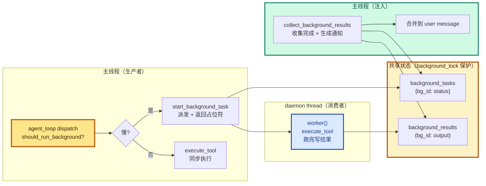
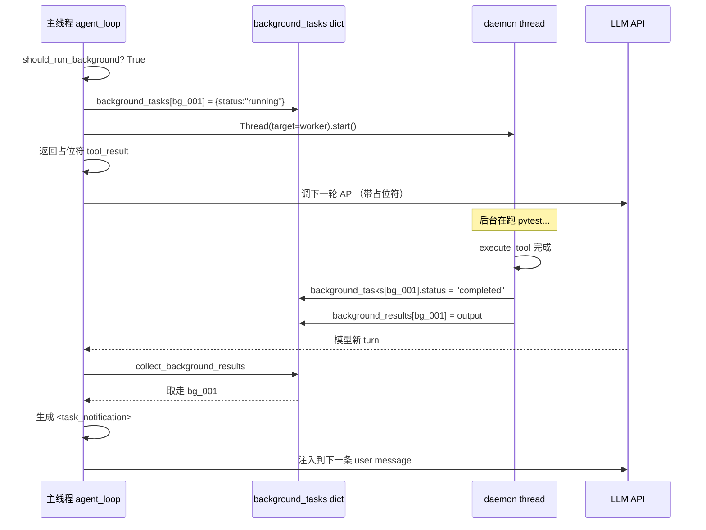
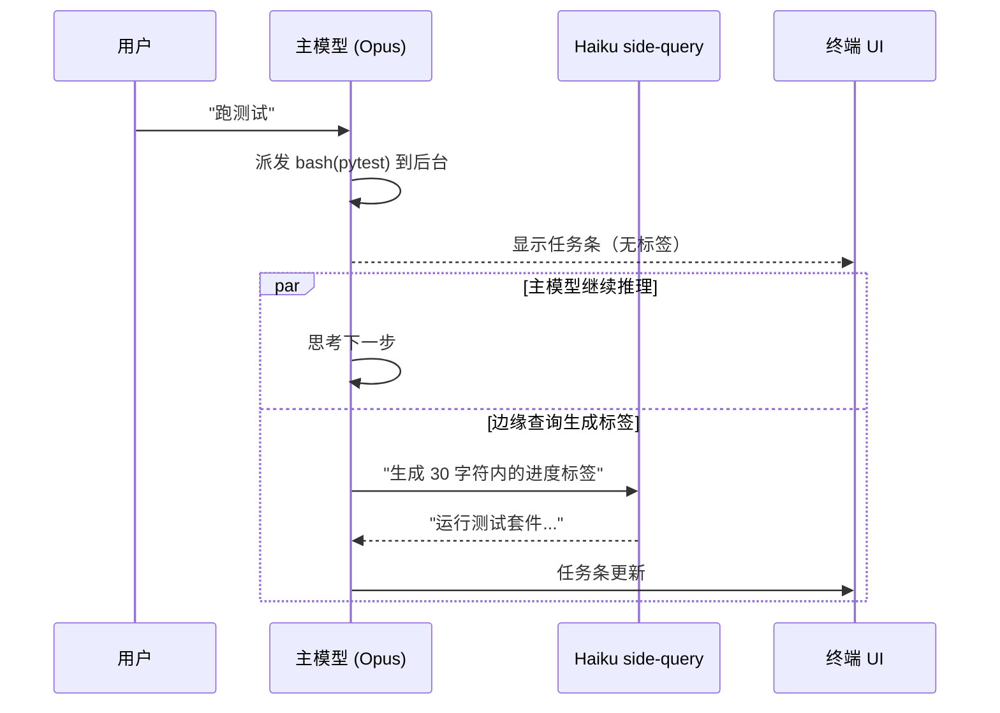
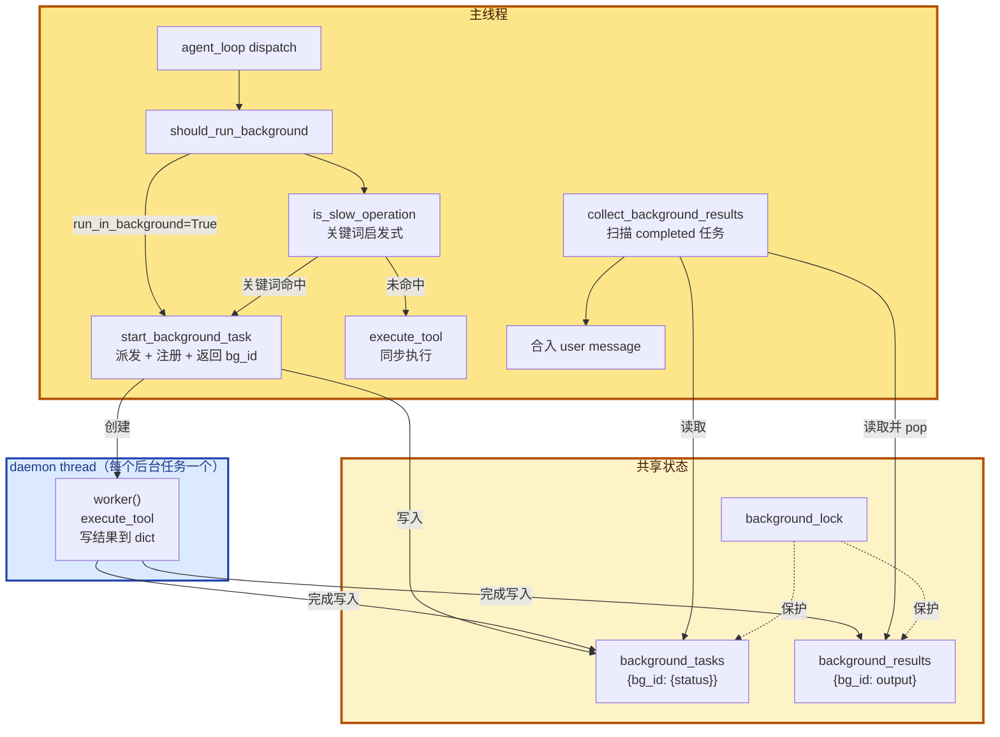

# 13 - Background Tasks

> [!note]
> s12 解决了"任务可持久化"，但工具仍是同步执行——`npm install` 跑 5 分钟，agent loop 卡 5 分钟，期间 Agent 完全静止。s13 把慢工具**移到守护线程**异步跑，主线程立刻拿到一个"已派发"占位符继续推理；后台跑完后，结果以 `<task_notification>` 的形式**异步注入**到下一次 user message 里。这是 Agent 第一次引入并发。

## 这一步加了什么

### 1. 多线程基础设施

- `import threading`
- `background_lock = threading.Lock()`：保护两个共享 dict。

### 2. 两个共享 dict + 一个计数器

```python
_bg_counter = 0
background_tasks: dict[str, dict] = {}   # bg_id → {tool_use_id, command, status}
background_results: dict[str, str] = {}   # bg_id → output
```

### 3. 5 个新函数

| 函数 | 作用 |
|---|---|
| `is_slow_operation(tool_name, tool_input)` | 启发式判断（关键词匹配：install / build / test） |
| `should_run_background(tool_name, tool_input)` | 模型显式请求优先，否则启发式 |
| `execute_tool(block)` | 统一 dispatch（handler 查表） |
| `start_background_task(block)` | 派发到 daemon thread，返回 bg_id |
| `collect_background_results()` | 收集完成的任务，生成通知列表 |

### 4. agent_loop 改动（关键）

dispatch 处加分支：

```python
for block in response.content:
    if block.type != "tool_use":
        continue

    if should_run_background(block.name, block.input):
        bg_id = start_background_task(block)
        results.append({..., "content": f"[Background task {bg_id} started] ..."})
    else:
        output = execute_tool(block)
        results.append({..., "content": output})
```

组装 user message 时合入通知：

```python
user_content = list(results)
notifications = collect_background_results()
if notifications:
    for n in notifications:
        user_content.append({"type": "text", "text": n})
messages.append({"role": "user", "content": user_content})
```

### 5. 工具 schema 改动

`bash` 工具加 `run_in_background: boolean` 参数，让模型显式请求后台执行。

## 为什么需要加

### 1. 慢工具阻塞整个 turn

最直观的痛点：

```
用户："帮我跑一下测试"
模型：调 bash("pytest")
pytest 跑 3 分钟
    ↓ 整整 3 分钟
    ↓ agent loop 卡死
    ↓ 用户在等
    ↓ 不能输入新指令
    ↓ 不能干别的
返回结果 → 才能继续
```

3 分钟对 LLM agent 是灾难。用户体感 = "卡死了"。

### 2. 真实工作流常有多个慢工具

```
"安装依赖 → 跑构建 → 跑测试 → 部署"
```

4 个工具，每个 2-5 分钟，串行就是 10-20 分钟阻塞。用户根本没法用。

### 3. s12 的 task system 解决不了

s12 让 task 跨重启持久化，但**工具执行还是同步的**。即使有 task system：

```
claim_task(t1) → 跑 pytest（同步 3 分钟） → complete_task(t1) → claim_task(t2)...
```

每个 task 内部的工具仍然阻塞。s13 是**填充"任务内的执行模型"**。

## 这是一个什么机制

### Producer-Consumer with Notification Injection



### 时序图：一个后台任务的生命周期



### 三个关键设计点

#### 1. 占位符立即返回

派发后**不等执行**，立刻返回占位符：

```python
{"type": "tool_result",
 "tool_use_id": block.id,
 "content": f"[Background task {bg_id} started] Result will be available when complete."}
```

这满足 Anthropic API 的协议要求——每个 tool_use 必须有对应的 tool_result。占位符让协议合规，但内容是"派发了，等通知"。

#### 2. 通知用独立格式，不复用 tool_result

```python
# 不是这样：
{"type": "tool_result", "tool_use_id": "原始 id", "content": 真实结果}

# 而是这样（独立 text block）：
{"type": "text",
 "text": "<task_notification>\n  <task_id>bg_001</task_id>\n  <status>completed</status>\n  <command>pytest</command>\n  <summary>...</summary>\n</task_notification>"}
```

为什么不复用？因为：

- **时序错位**：tool_result 必须紧跟在 assistant 的 tool_use 之后。但后台任务完成时，agent 可能已经过了好几轮，原始 tool_use 早就被处理了。
- **协议限制**：一个 tool_use_id 只能有一个 tool_result。已经返回了占位符，就不能再返回真实结果用同一个 id。
- **可读性**：`<task_notification>` 是结构化标签，模型容易解析。

#### 3. 共享 dict 用 Lock 保护

```python
background_lock = threading.Lock()

# worker 写入时
with background_lock:
    background_tasks[bg_id]["status"] = "completed"
    background_results[bg_id] = result

# 主线程读取时
with background_lock:
    ready_ids = [bid for bid, task in background_tasks.items()
                 if task["status"] == "completed"]
```

没有锁：worker 写 `status` 时主线程可能正好在读，读到中间状态（status 改了但 results 没写入）。

## 原本的 Claude Code 怎么做的

CC 也是这个模式，但**实现路径不同**——因为 CC 是 Node.js，没法开线程跑外部命令。

### 1. 用 OS 子进程而不是线程

Node.js 单线程 + 事件循环。它通过 `child_process.spawn("npm", ["install"])` 让**操作系统**开一个新进程跑命令。OS 调度两个进程并行：Node.js 主进程继续干活，npm 进程跑安装。

```javascript
// 伪代码
const child = child_process.spawn(cmd, args, { cwd });
child.stdout.on("data", chunk => buffer += chunk);
child.on("exit", code => {
    // 异步通知主循环
});
```

**对 Agent 逻辑透明**——s13 用线程跑 Python 工具，CC 用进程跑 shell 命令，结果一样：外部慢操作在"后台"。

### 2. pendingToolUseSummary：Haiku 边缘查询

CC 在派发后台任务后，会**额外调一次 Haiku（小模型）** 生成一段简短的进度标签：

```
"安装前端依赖中..."   ← ~30 字符，git commit 风格
"运行测试套件..."
```

这个标签显示在 UI 的任务条上。它**和主模型的对话并行**：



**为什么用 Haiku 不用 Opus**：

- 这种小任务用 Opus 是浪费（贵 10 倍以上）。
- Haiku 响应快（几百毫秒）。
- 标签生成不参与决策，只是 UI 反馈。

这就是 **Side-Query Pattern**：主任务用大模型，辅助决策用小模型，并行进行。

### 3. BashOutput / KillShell 工具

CC 暴露给模型 `BashOutput`（查后台任务输出）和 `KillShell`（强制结束）。s13 没有这些工具——后台任务结果只能等通知，不能主动查。

## 整体逻辑：函数之间的关系



### 调用关系详解

#### 派发阶段（主线程）

```python
should_run_background(block.name, block.input)
  ├─→ tool_input.get("run_in_background")? True   ← 模型显式
  └─→ is_slow_operation(tool_name, tool_input)     ← 启发式
        ├─→ 检查 tool_name == "bash"
        └─→ 检查 command 含 install/build/test/...
```

```python
start_background_task(block)
  ├─→ _bg_counter += 1; 生成 bg_id
  ├─→ with background_lock: background_tasks[bg_id] = {...}
  ├─→ threading.Thread(target=worker).start()
  └─→ return bg_id（占位符要带上）
```

#### 执行阶段（daemon thread）

```python
worker()
  ├─→ execute_tool(block)  ← 跑真实 handler
  └─→ with background_lock:
        background_tasks[bg_id]["status"] = "completed"
        background_results[bg_id] = result
```

#### 收集阶段（主线程，每轮 agent_loop 都调）

```python
collect_background_results()
  ├─→ with background_lock: 找所有 status="completed" 的 bg_id
  ├─→ 对每个 completed 的 bg_id：
  │     ├─→ with background_lock: pop task 和 result
  │     └─→ 生成 <task_notification> XML
  └─→ 返回 notifications list
```

## 对 agent_loop 的影响

s13 **第一次改 agent_loop 的内部结构**（s12 几乎没改）。改动有两处：

### 改动 1：dispatch 加分支

```python
for block in response.content:
    if block.type != "tool_use":
        continue

    # s13 新增：判断后台 vs 同步
    if should_run_background(block.name, block.input):
        bg_id = start_background_task(block)
        results.append({"type": "tool_result",
                        "tool_use_id": block.id,
                        "content": f"[Background task {bg_id} started] ..."})
    else:
        output = execute_tool(block)
        results.append({"type": "tool_result",
                        "tool_use_id": block.id,
                        "content": output})
```

**没有这个分支时**：所有工具同步跑，慢工具阻塞。
**有这个分支后**：慢工具派发即返回，agent loop 立刻进入下一轮 API 调用。

### 改动 2：user message 组装加通知合入

```python
# s12:
messages.append({"role": "user", "content": results})

# s13:
user_content = list(results)
notifications = collect_background_results()
if notifications:
    for n in notifications:
        user_content.append({"type": "text", "text": n})
messages.append({"role": "user", "content": user_content})
```

**没有这个合入时**：后台任务结果永远拿不到（占位符已经返回，无机制回填）。
**有这个合入后**：每轮 agent_loop 都查一遍后台任务，完成的通知注入下一条 user message。

### 改动 3：循环骨架依然不变

```python
def agent_loop(messages, context):
    while True:
        response = client.messages.create(...)   # ← 不变
        messages.append({"role": "assistant", ...})  # ← 不变
        if response.stop_reason != "tool_use":
            return                                # ← 不变
        # dispatch + 注入（这里有 s13 改动）
```

**主循环骨架没动**。s13 是在循环内部的"dispatch 步骤"和"user message 组装步骤"插入扩展点。

## 多线程并行情况

s13 引入 Agent 第一次的并发。结构：

```
主线程（永久）：跑 agent_loop
  ↓ 派发
daemon thread（临时）：跑后台任务，跑完即销毁
```

### 关键特征：**N 个临时 daemon thread**

每个后台任务起一个 daemon thread，跑完线程就退出。不是"长期跑的线程池"，是"**一次性 worker**"。

```python
# 每次调 start_background_task 都创建一个新线程
thread = threading.Thread(target=worker, daemon=True)
thread.start()
```

`daemon=True` 意味着：**主线程退出时这些 daemon 自动终止**（不会阻止进程退出）。

### 线程生命周期

```mermaid
%%{init: {'themeVariables': {'fontSize': '16px', 'fontFamily': 'ui-sans-serif, system-ui, -apple-system, "Segoe UI", Roboto, sans-serif'}}}%%
flowchart LR
    Main["主线程<br/>(永久)"]
    B1["bg_001<br/>daemon<br/>(临时)"]
    B2["bg_002<br/>daemon<br/>(临时)"]
    B3["bg_003<br/>daemon<br/>(临时)"]

    Main -->|"start"| B1
    Main -->|"start"| B2
    Main -->|"start"| B3

    B1 -.->|"完成销毁"| Gone1[("-")]
    B2 -.->|"完成销毁"| Gone2[("-")]
    B3 -.->|"运行中..."]| Still[("running")]

    style Main fill:#fde68a,stroke:#b45309,stroke-width:3px,color:#451a03
    style B1 fill:#dbeafe,stroke:#1e40af,stroke-width:2.5px,color:#1e3a8a
    style B2 fill:#dbeafe,stroke:#1e40af,stroke-width:2.5px,color:#1e3a8a
    style B3 fill:#dbeafe,stroke:#1e40af,stroke-width:2.5px,color:#1e3a8a
```

主线程跑 agent_loop 期间，可能同时有 N 个 daemon 在跑后台任务。**N 个后台任务真正并行**（如果它们是 I/O bound，GIL 不影响）。

### 主线程和 daemon 的协作

| 动作 | 主线程 | daemon |
|---|---|---|
| 派发 | 写 `background_tasks[bg_id] = {status:"running"}` | — |
| 创建线程 | `Thread.start()` | — |
| 执行 | — | `execute_tool(block)` |
| 完成 | — | 写 `status="completed"` + `background_results[bg_id]` |
| 收集 | `collect_background_results` 读取并 pop | — |

**主线程和 daemon 之间唯一的通信通道**：`background_tasks` 和 `background_results` 两个 dict，受 `background_lock` 保护。

### 没有死锁风险

s13 只有一把锁（`background_lock`），所有持锁操作都是几行 dict 读写，**没有嵌套锁调用**。所以不可能死锁。

## 设计要点

### 1. 启发式 + 显式并行

```python
def should_run_background(tool_name, tool_input):
    if tool_input.get("run_in_background"):
        return True                                   # 模型显式优先
    return is_slow_operation(tool_name, tool_input)   # 否则启发式
```

两层判断：

- **模型显式**：模型在工具调用里说"我要后台跑"。准确但要求模型有判断力。
- **启发式兜底**：模型忘了说但命令明显慢（install/build/test）。

启发式关键词是经验值：`["install", "build", "test", "deploy", "compile", "docker build", "pip install", "npm install", "cargo build", "pytest", "make"]`。

### 2. 占位符满足 API 协议

Anthropic API 要求每个 tool_use 必须紧跟一个 tool_result。如果只派发不返回，API 会报错。

```python
results.append({"type": "tool_result",
                "tool_use_id": block.id,
                "content": f"[Background task {bg_id} started] ..."})
```

占位符 **content 是字符串**（"已派发，等通知"），但满足协议结构。

### 3. 通知用 XML 标签

```xml
<task_notification>
  <task_id>bg_001</task_id>
  <status>completed</status>
  <command>pytest</command>
  <summary>...</summary>
</task_notification>
```

为什么用 XML？Anthropic 模型对 XML 标签的解析特别强（训练数据里有大量 XML）。比 JSON 字符串更可靠。

### 4. daemon=True 避免挂死

```python
threading.Thread(target=worker, daemon=True)
```

如果 daemon=False（默认），主线程退出时会**等所有线程结束**。后台任务跑 5 分钟，主进程 Ctrl+C 不会立即退出。daemon=True 保证主线程退出时进程立刻死。

### 5. 不复用 tool_use_id 通知

如前所述，**通知走独立 text block，不复用原 tool_use_id**。这避免协议冲突 + 时序错位。

## 实现对照（s13/code.py）

派发函数：

```python
def start_background_task(block) -> str:
    global _bg_counter
    _bg_counter += 1
    bg_id = f"bg_{_bg_counter:04d}"
    cmd = block.input.get("command", block.name)

    def worker():
        result = execute_tool(block)
        with background_lock:
            background_tasks[bg_id]["status"] = "completed"
            background_results[bg_id] = result

    with background_lock:
        background_tasks[bg_id] = {
            "tool_use_id": block.id,
            "command": cmd,
            "status": "running",
        }
    threading.Thread(target=worker, daemon=True).start()
    return bg_id
```

注意几个细节：

- `worker` 是**闭包**——捕获 `bg_id` 和 `block`。每个后台任务的 worker 都有自己的闭包。
- 注册 `background_tasks[bg_id]` 和 `Thread.start()` 是**分开**的两步（先注册再启动）。避免 worker 在注册前就跑完（worker 跑完会写 `background_tasks[bg_id]["status"]`，如果没注册会 KeyError）。

收集函数：

```python
def collect_background_results() -> list[str]:
    with background_lock:
        ready_ids = [bid for bid, task in background_tasks.items()
                     if task["status"] == "completed"]
    notifications = []
    for bg_id in ready_ids:
        with background_lock:
            task = background_tasks.pop(bg_id)
            output = background_results.pop(bg_id, "")
        summary = output[:200] if len(output) > 200 else output
        notifications.append(
            f"<task_notification>\n"
            f"  <task_id>{bg_id}</task_id>\n"
            f"  <status>completed</status>\n"
            f"  <command>{task['command']}</command>\n"
            f"  <summary>{summary}</summary>\n"
            f"</task_notification>")
    return notifications
```

**两段锁**：

- 第一段锁内：找 ready_ids（只读）。
- 锁外：遍历 ready_ids。
- 第二段锁内：pop 出 task 和 result。

为什么不在一把锁内做完？减少锁持有时间——`notifications.append` 和字符串拼接不需要锁。

## 相关概念

- [[12 - Task System]]：s13 复用 task 的概念（task 持久化、background 临时派发）
- [[14 - Cron Scheduler]]：s14 复用 s13 的通知注入模式（cron 也用类似的"异步注入"）
- [[02 - Tool Use]]：s13 改了 dispatch 但保持 tool_use/tool_result 协议
- [[05 - TodoWrite]]：s13 的 background task 是"动态创建的临时 task"

> [!warning]
> 几个容易踩的坑：
>
> 1. **以为占位符 tool_result 是真实结果**。不是。它只是协议占位，真实结果走通知注入。
> 2. **以为通知是同步的**。不是。通知在**下一轮 agent_loop** 才被注入，期间模型可能已经过了 N 轮 API 调用。
> 3. **以为 daemon thread 跑完会自动通知主线程**。不会。主线程通过 `collect_background_results` **主动轮询**——agent_loop 每轮跑完调一次。
> 4. **忘记加锁**：写 `background_tasks[bg_id]` 不加锁，可能跟主线程读冲突。s13 全程 `with background_lock`。
> 5. **daemon thread 跑抛异常**：worker 里的异常**不会被主线程看到**——daemon 自己 swallow 异常死掉，主线程永远拿不到结果。生产实现要在 worker 里 catch 异常并写 error 状态。

## Q&A

### Q1: CC 的 pendingToolUseSummary 是什么？我没看懂

**A**：CC 在派发后台任务后，**额外调一次 Haiku（小模型）生成一段进度标签**，给 UI 用。

具体流程：

1. 主模型（Opus）派发后台任务，比如 `bash("pytest")`。
2. CC **并行**调一次 Haiku，prompt 大致是"用 30 字符内描述这个命令在干什么"。
3. Haiku 返回类似 `"运行测试套件..."`。
4. CC 把这段标签塞到 UI 的任务条上，用户看到 spinner 旁边有说明文字。
5. 主模型那边的对话**不受影响**，继续它的推理。

为什么用 Haiku 不用 Opus？

- 标签生成不参与决策，只是 UI 反馈，用 Opus 是浪费。
- Haiku 响应快（几百毫秒），能在主模型下一次响应前完成。
- Haiku 便宜（~1/10 Opus 价格）。

这就是 **Side-Query Pattern**：主任务用大模型，辅助决策用小模型。CC 很多地方都用这个模式（记忆提取、标签生成、提示词压缩等）。

s13 教学版没这个，只 print 一行静态信息。

### Q2: CC 用线程还是进程？s13 用线程，这两个不一样吧

**A**：不一样。**语言约束**：

- s13 教学版用 **Python `threading.Thread`**——真正的多线程。
- CC 用 **Node.js `child_process.spawn`**——开 OS 子进程。

为什么 CC 不用线程？**Node.js 单线程**——JS 代码只有一个执行流。Node.js 提供 `worker_threads`（2018 年后），但 CC 主要跑**外部 shell 命令**（git/npm/lint），这些**只能**用子进程跑。

```
Node.js 主进程（JS 单线程）
  ↓
  child_process.spawn("npm", ["install"])
  ↓
OS 创建一个新进程跑 npm
  ↓
两个进程并行（OS 调度）
  ↓
Node.js 主进程把 stdout/stderr 重定向，继续干别的
  ↓
npm 进程结束 → OS 通知 Node.js → 触发回调
```

**并行的不是 JS 代码**（JS 还是单线程），**并行的是 OS 层面的两个进程**。

s13 用 Python 线程是因为 Python 能真正多线程跑 Python 代码（虽然有 GIL，但 I/O bound 任务不受限）。如果 s13 是 Node.js 写的，也得用 spawn。

### Q3: 什么是 OS 进程？是 JS 概念吗

**A**：**OS 进程是操作系统概念，不是 JS 特有**。

每个运行的程序都是 OS 的一个进程：

- 浏览器是进程
- 微信是进程
- VS Code 是进程
- Node.js 运行时是进程

进程的核心特征：

- **独立内存空间**：进程 A 不能直接读进程 B 的内存。
- **OS 调度**：OS 决定哪个进程什么时候用 CPU。
- **真正并行**：多核 CPU 上多进程真正同时跑。

**所有语言都能开进程**：

| 语言 | API |
|---|---|
| Python | `subprocess.run(["ls"])` |
| Node.js | `child_process.spawn("ls")` |
| Go | `os/exec.Command("ls")` |
| C | `fork()` + `exec()` |

底层都是调 OS 的同一个服务，只是语法不同。

**线程 vs 进程**：

- 线程：共享内存，便宜，但容易踩 race condition。
- 进程：内存隔离，安全，但通信要走 IPC（管道/socket/文件）。

Node.js 单线程但能跑后台任务，靠的就是 **JS 线程 + OS 子进程**的组合：JS 自己单线程，但通过 spawn 借 OS 的手实现并行。

### Q4: 多线程相比多进程有什么区别？既然可以直接新开一个进程，那么多线程还有什么优势

**A**：核心区别是**内存是否共享**。

| 维度 | 多线程 | 多进程 |
|---|---|---|
| 内存 | **共享** | 各自独立 |
| 创建成本 | 便宜（KB 级） | 贵（MB 级） |
| 上下文切换 | 快 | 慢 |
| 通信 | 直接读写变量（要加锁） | 走管道/socket/文件（IPC） |
| 崩了 | 一个线程崩整个进程挂 | 一个进程挂其他没事 |
| 安全性 | 容易踩 race condition | 隔离干净 |

**多线程的核心优势：共享状态**。

最典型场景——**Web 服务器**：

```
主线程开了 DB 连接池（10 个连接）
  ↓
1000 个请求进来，开 10 个线程处理
  ↓
每个线程都能直接用那个连接池
```

如果多进程：每个子进程各有自己的连接池（10 × 10 = 100 个），DB 直接被打满。

**多进程的核心优势：隔离**。

跑外部命令（git/npm/lint）天然该用进程——脚本崩了不能拖垮主进程，kill -9 子进程主进程没事。

**对 Agent 的意义**：

- s13 用线程：因为 Python 能，且后台任务结果要存到主线程的 dict（共享内存方便）。
- CC 用进程：因为 Node.js 单线程，跑 shell 命令必须 spawn。

两者权衡点不同，但 Agent 逻辑层看到的"后台任务"行为一致。

### Q5: 后台任务跑完了，但 agent_loop 还没进下一轮，怎么办

**A**：**结果会"等"**，存在 `background_results` dict 里，直到下一次 `collect_background_results` 被调用。

具体场景：

```
T0: 派发 bg_001 → daemon thread 跑
T1: agent_loop 进 API 调用（耗时 5 秒）
T2: daemon 跑完 → 写 background_results[bg_001]
T3: API 返回 → agent_loop 处理响应 → dispatch（如果还有 tool_use）
T4: 准备 append user message → collect_background_results 取走 bg_001
T5: 注入通知
```

T2 到 T4 之间，bg_001 的结果**在 dict 里待了 2 秒**。主线程不在乎，因为下一轮自然会取。

最差情况：agent_loop 在等 API，daemon 都跑完了，结果全在 dict 里堆着。等 API 回来，下一轮 collect 全部取走。

这是 **Producer-Consumer 的天然解耦**——生产者（daemon）和消费者（主线程 collect）速度不同，靠队列/字典缓冲。

### Q6: 如果 daemon thread 跑炸了（异常），主线程会知道吗

**A**：**默认不会**。

s13 教学版的 worker：

```python
def worker():
    result = execute_tool(block)   # ← 如果这里抛异常
    with background_lock:
        background_tasks[bg_id]["status"] = "completed"   # ← 这行不会执行
        background_results[bg_id] = result
```

如果 `execute_tool` 抛异常：

- daemon thread 自己死掉（Python daemon 异常不影响主进程）。
- `background_tasks[bg_id]["status"]` 永远是 "running"。
- 主线程的 `collect_background_results` 永远找不到 completed，**永远拿不到结果**。
- 占位符 tool_result 已经返回，但通知永远不来——agent 看到的是"派发了但杳无音信"。

生产实现要包 try/except：

```python
def worker():
    try:
        result = execute_tool(block)
        status = "completed"
    except Exception as e:
        result = f"Error: {e}"
        status = "failed"
    with background_lock:
        background_tasks[bg_id]["status"] = status
        background_results[bg_id] = result
```

s13 教学版省了这个，是教学简化。CC 的实现是有完整错误处理的。
