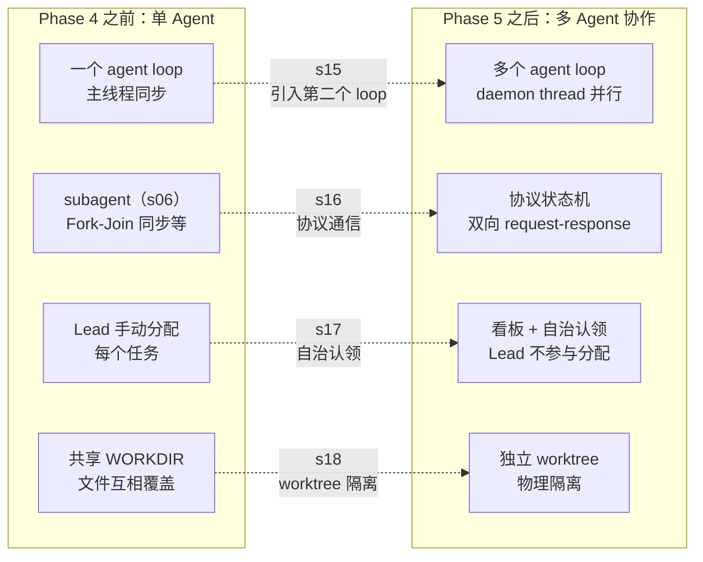
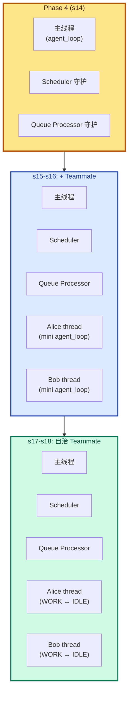
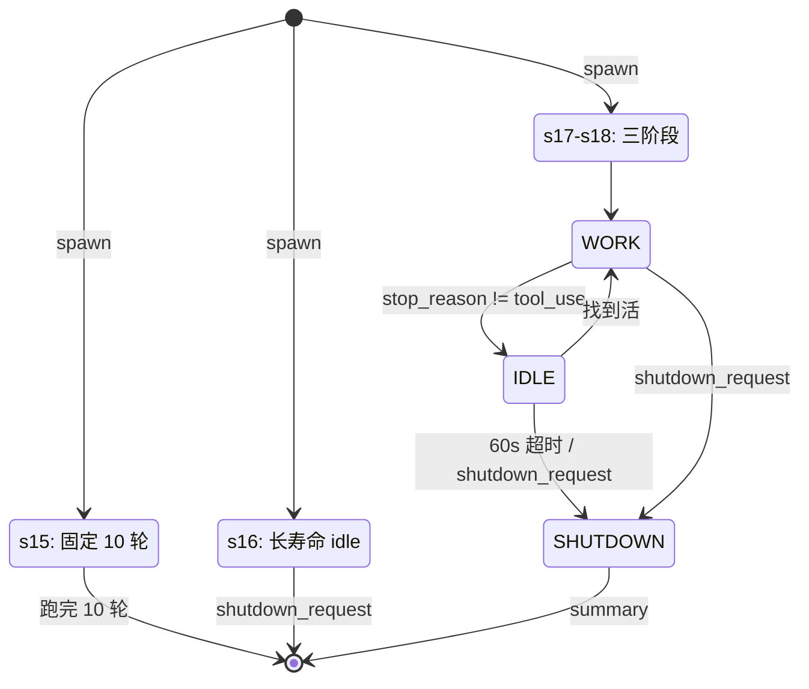

# Phase 5 综合总结 --- 多智能体

> [!note]
> Phase 1 让 Agent 能跑，Phase 2 让它能跑长任务，Phase 3 让它能跨会话连续，Phase 4 让它能跑后台/定时任务。但**所有这些工作都假设"只有一个 Agent"**——主 agent loop 是唯一的执行单元。Phase 5 的四课合起来回答：**"怎么让多个 Agent 真正协作？"** 四个答案：能通信（s15）、有协议（s16）、能自治（s17）、有隔离的工作空间（s18）。共同主题：**把 Agent 从"单线程单执行单元"扩展为"多线程多 Agent 协作系统"**。

## 为什么 Phase 5 是"多智能体"

Phase 1-4 的 Agent 有四个协作维度的限制：

1. **单点执行**：所有工作都在主 agent loop 里串行跑。复杂任务（"同时重构前端和后端"）只能排队，不能并行。
2. **一次性派生**：s06 的 subagent 是 Fork-Join 模式——主 Agent 同步等结果，subagent 跑完就消失。不适合长期协作。
3. **被动等指令**：即便有了 subagent，它也只做主 Agent 派的事。不会自己找活干、不会自己决策。
4. **共享工作空间**：多个 Agent 在同一个目录改文件——互相覆盖、无法回滚、分不清谁的改动。

Phase 5 解决这四件事：

| 课 | 解决什么 | 机制 |
|---|---|---|
| s15 Agent Teams | 长期共存的 Teammate + 异步通信 | Lead-Teammate 架构 + 文件 MessageBus + daemon thread |
| s16 Team Protocols | 结构化双向通信 + 长寿命 Teammate | ProtocolState + request_id 关联 + idle loop |
| s17 Autonomous Agents | Teammate 自己看板自己认领 | scan_unclaimed + idle_poll + 三阶段生命周期 |
| s18 Worktree Isolation | 物理隔离的工作目录 | git worktree + task-worktree 绑定 + wt_ctx 切 cwd |

四者机制不同，但**共同把 Agent 从"单 Agent 单循环"扩展为"多 Agent 并行协作系统"**。

## 每一步加了什么、为什么加

### s15 --- Agent Teams

| 维度 | 内容 |
|---|---|
| 加了什么 | `MessageBus`（文件邮箱）+ `active_teammates` 字典 + 3 个工具（spawn / send / check）+ `spawn_teammate_thread` 内部的 `run()` 闭包（mini agent loop）+ `__main__` 加 drain lead inbox |
| 为什么 | s06 subagent 是 Fork-Join，主 Agent 同步等；不适合长期协作 + 并行执行 + 角色分工 |
| 这是什么机制 | Lead-Teammate 架构 + 文件 MessageBus（drain 语义）+ daemon thread + Actor Model 简化版 |
| Claude Code 怎么做 | 同样有 subagent + teammate 两种模式；用 `proper-lockfile` 保护 mailbox；teammate 用 idle loop 而非固定轮数 |

**关键贡献**：引入**第二个 agent loop**（Teammate 自己的）—— Phase 5 的基石。

### s16 --- Team Protocols

| 维度 | 内容 |
|---|---|
| 加了什么 | `ProtocolState` dataclass + `pending_requests` 全局字典 + `new_request_id` + `match_response` + `consume_lead_inbox` 统一入口 + `handle_inbox_message` 分发器 + 4 个协议工具（Lead 3 个 + Teammate 1 个）+ Teammate 的 idle loop |
| 为什么 | s15 只有普通 message；缺控制信令（shutdown）、缺结构化双向通信（plan approval）、缺确认机制 |
| 这是什么机制 | 协议 = 状态机（pending → approved/rejected）+ 双向消息 + request_id 关联（correlation ID 模式）+ *_request/*_response 命名约定 |
| Claude Code 怎么做 | 更多协议类型（query / progress / error / context_request）；**真正的代码级 gating**（condition variable 阻塞 teammate）；协议持久化；文件锁 |

**关键贡献**：把 Teammate 从"一次性 10 轮"升级为**长寿命 idle loop**——能服务多个任务，直到 Lead shutdown。

### s17 --- Autonomous Agents

| 维度 | 内容 |
|---|---|
| 加了什么 | `scan_unclaimed_tasks` + `idle_poll`（60s 限时轮询）+ claim_task 加 owner 检查 + Teammate 工具集 5→8（+ list_tasks / claim_task / complete_task）+ 外层 `while True` 循环 + 身份重注入 |
| 为什么 | s16 的 Teammate 仍被动等活；Lead 手动分配每个任务不可扩展；任务间有 DAG 依赖 |
| 这是什么机制 | Worker Pool + Task Board（拉模式）+ 三阶段生命周期（WORK ↔ IDLE → SHUTDOWN）+ 60s 超时自动下班 |
| Claude Code 怎么做 | **四个独立机制组合**（idle_notification + 500ms mailbox 轮询 + task watcher fs.watch + tryClaimNextTask）；`proper-lockfile` 任务锁；无固定超时（Lead 主动 shutdown） |

**关键贡献**：把任务分配**从 Lead 下放到 Teammate**——Teammate 自己 scan + claim，Lead 只负责 create + spawn。

### s18 --- Worktree Isolation

| 维度 | 内容 |
|---|---|
| 加了什么 | Task 加 `worktree: str | None` 字段 + `WORKTREES_DIR` + 5 个 worktree 函数（validate / create / bind / remove / keep）+ `run_git` + `log_event` + `events.jsonl` + 3 个 Lead 工具 + `wt_ctx` 字典 + bash/read/write 加 cwd 参数 |
| 为什么 | s15-s17 共享 WORKDIR——多 Teammate 改同一文件互相覆盖；改动混在一起无法 review |
| 这是什么机制 | git worktree（一个 repo 多个 working tree）+ task-worktree 双向绑定 + wt_ctx cwd 切换 + 路径穿越防护 + 安全删除（默认拒绝有改动）+ 审计日志 |
| Claude Code 怎么做 | **两条独立路径**：EnterWorktree（process.chdir 整个进程）+ AgentTool isolation（cwdOverride 包子 agent）；**没有 task-worktree 绑定**（两个独立系统）；`worktree-<slug>` 分支命名；基于 origin/defaultBranch |

**关键贡献**：解决**多 Agent 的并发安全**——每个 Teammate 物理隔离，代码改动不互相覆盖。

## 四课的统一逻辑：把"协作维度"搬进 Agent



四课分别解决协作的四个维度：**通信**（s15）、**协议**（s16）、**自治**（s17）、**隔离**（s18）。每个维度独立扩展，组合起来才是完整的多 Agent 系统。

## 对 agent_loop 的影响

**Phase 5 最值得讲清楚的一条线**：主 `agent_loop` 函数**从 s14 到 s18 一字未改**——所有新功能都通过工具层或 Teammate 端扩展进来。

### 主 `agent_loop`：代码完全不变

```python
# s14 / s15 / s16 / s17 / s18 共用的主 agent_loop
def agent_loop(messages, context):
    while True:
        response = client.messages.create(...)
        messages.append(response)
        if response.stop_reason != "tool_use": return
        results = [execute_tool(block) for block in response.content if block.type == "tool_use"]
        messages.append({"role": "user", "content": results})
```

s15-s18 加的所有 Lead 端工具（spawn_teammate / request_shutdown / create_worktree / ...）只是进了 TOOLS 数组和 TOOL_HANDLERS 表，dispatch 走标准路径。

### 但 `__main__` 加了一步：drain lead inbox

```python
# s14 __main__
agent_loop(history, context)
print(response_text)

# s15-s18 __main__（多了这一步）
agent_loop(history, context)
print(response_text)
inbox = consume_lead_inbox(route_protocol=True)     # ← s15 加的
if inbox:
    history.append({"role": "user", "content": f"[Inbox]\n..."})
```

agent_loop 之外多一步——影响 agent_loop **怎么被喂食**，不影响 agent_loop 内部。

### 真正的扩展：Teammate 的 `run()` 闭包

Phase 5 的真正战场是 **Teammate 的 mini agent loop**，每课都改：

| 课 | run() 闭包的演进 |
|---|---|
| s15 | **首次定义**——独立 messages + 4 个 sub_tools + `for _ in range(10)` 固定 10 轮 |
| s16 | 循环结构改成 `while not shutdown_requested`；inbox 分流（协议 vs 普通）；加 idle wait |
| s17 | 加**外层 `while True`**（WORK ↔ IDLE 交替）；idle_poll 替代 idle wait；身份重注入；工具集扩到 8 个 |
| s18 | 加 `wt_ctx` 字典 + `_wt_cwd` helper；claim 时设 wt_ctx，complete 时清；bash/read/write 传 cwd |

**主 agent_loop 稳定，Team loop 演进**——这是 Phase 5 的核心架构特征。

### 总结：五种扩展 agent_loop 的方式（Phase 4-5）

| 课 | 扩展方式 | 改动位置 |
|---|---|---|
| s12 | 加工具 | TOOLS / TOOL_HANDLERS |
| s13 | dispatch 加分支 | agent_loop 内部 dispatch 处 |
| s14 | 入口前 consume | agent_loop 开头 + 起守护线程 |
| s15 | **复制一份新的 mini loop** | 新 daemon thread + __main__ 加 drain |
| s16 | 改 mini loop 的结构 | Teammate run() 重写（idle loop） |
| s17 | 改 mini loop 的循环 | Teammate run() 加外层 while + idle_poll |
| s18 | 改 mini loop 的 cwd | Teammate run() 加 wt_ctx 字典 |

s15-s18 都在**扩展 Teammate 的 run()**——这是 Phase 5 与 Phase 4 最大的不同。Phase 4 改主 loop，Phase 5 改 Teammate loop。

## 多线程演进：Phase 5 的核心特征

Phase 5 是整个教程里**多线程最复杂的阶段**。从 s14 的 3 个长期线程，演化到 s18 的 N+3 个。

### 线程数演化



**线程数公式**：

| 阶段 | 长期线程数 | 临时线程 |
|---|---|---|
| s14 | 3（主 + scheduler + queue processor） | background worker（按需） |
| s15-s18 | **3 + N**（N = active_teammates 数） | background worker（按需） |

**关键里程碑**：s15 是**第一次有多个完整 agent loop 真正并行**。之前的并发都是"主 loop 跑工具时临时起 worker"，s15 起 Teammate 是**长期并行的独立 agent loop**。

### Teammate 的生命周期演化



四课的 Teammate 越来越像"真正的工人"：

- s15：临时工（干 10 轮走人）
- s16：长期工（一直挂着等指令）
- s17：自治工人（自己找活，60s 没活下班）
- s18：自带工作室的自治工人（独立目录，互不干扰）

### 通信方式演化

| 阶段 | Lead → Teammate | Teammate → Lead | Teammate ↔ Teammate |
|---|---|---|---|
| s15 | send_message（普通） | send_message（普通） | 通过 Lead 中转 |
| s16 | shutdown_request（协议） | plan_approval_request（协议） | 同上 |
| s17 | 同 s16 + 任务看板（间接） | 同 s16 + claim 后开始工作 | 同上（仍无直接通信） |
| s18 | 同 s17 | 同 s17 | 同上（worktree 物理隔离但无通信） |

**Teammate 之间从不直接通信**——所有协调都通过 Lead 或共享状态（任务看板）。这是 Actor Model 的简化版（严格 Actor 是点对点消息）。

## 状态管理全景

Phase 5 引入了**多个共享状态**，每个都有不同的同步策略。

### 共享内存（进程内）

| 状态 | 引入 | 作用 | 同步 |
|---|---|---|---|
| `active_teammates: dict` | s15 | 名字占用表（防同名 spawn） | 无锁（CPython GIL 兜底） |
| `pending_requests: dict` | s16 | 协议状态机（request_id → ProtocolState） | 无锁（教学简化） |
| `background_tasks/results: dict` | s13 | 后台任务状态 | `background_lock`（s13 加的） |

### 共享磁盘（跨进程）

| 状态 | 引入 | 作用 | 同步 |
|---|---|---|---|
| `.mailboxes/*.jsonl` | s15 | 消息邮箱（drain 语义） | 无锁（生产用 proper-lockfile） |
| `.tasks/*.json` | s12（s17 起被多 Agent 共用） | 任务看板 | 无锁（claim 加 owner 检查是部分防护） |
| `.worktrees/*/` | s18 | 独立工作目录 | git 自己的 index lock |
| `.worktrees/events.jsonl` | s18 | worktree 生命周期审计 | append-only，无锁 |

**教学版几乎全无锁**——靠"实际并发概率低"蒙混。生产级多 Agent 系统（如 CC）所有共享状态都要加锁。

### drain 语义：读 = 删

Phase 5 反复出现**drain 模式**：

```python
# MessageBus (s15)
def read_inbox(agent):
    msgs = ...read file...
    inbox.unlink()        # 删文件
    return msgs

# consume_cron_queue (s14)
# 同样的模式：读 = 取走 = 删
```

读 = 删避免"重复处理"——但代价是**没读就丢**（进程崩在 send 和 read 之间，消息已写文件但 read 还没发生，下次 read 仍能拿到——这是 drain 的安全性所在）。

### 双向绑定 vs 单向引用

| 关系 | 实现 | 引入 |
|---|---|---|
| Lead ↔ Teammate | 双向消息（message / response） | s15-s16 |
| Task → Worktree | task.worktree 字段 | s18 |
| Worktree → Task | events.jsonl 里的 task_id（仅日志，非引用） | s18 |
| Task → Task | blockedBy 列表 | s12 |

**只有 Task → Worktree 是真双向**（task 字段 + 事件日志）。Worktree 本身没有"task_id"字段——这是教学简化（CC 也是这样，两个独立系统）。

## 教学版 vs Claude Code 的差异

Phase 5 是教学版和 CC 差异最大的阶段——CC 的多 Agent 系统远比 s15-s18 复杂。

### 关键差异汇总

| 维度 | 教学版（s15-s18） | Claude Code |
|---|---|---|
| 文件锁 | 无 | `proper-lockfile` 全程保护 |
| Teammate 寿命 | s15 固定 10 轮 / s16-s18 长寿命但 60s 超时 | 完全长寿命，Lead 主动 shutdown |
| 协议类型 | 2 种（shutdown / plan_approval） | 6+ 种（query / progress / error / context_request / idle_notification ...） |
| 协议执行 | 君子协定（LLM 听话） | 代码级 gating（condition variable 阻塞） |
| 协议持久化 | 内存字典（崩了全丢） | 磁盘 + 恢复机制 |
| 自治机制 | 一个 idle_poll 函数 | 4 个独立机制组合（idle_notification + mailbox 轮询 + task watcher + tryClaimNextTask） |
| 任务发现延迟 | 5s（轮询） | ~1s（事件驱动 + 轮询兜底） |
| Worktree 切换 | wt_ctx 字典传 cwd 参数 | EnterWorktree 用 process.chdir 整个进程；AgentTool 用 cwdOverride |
| Task-Worktree 绑定 | 显式（task.worktree 字段） | **无绑定**（两个独立系统，Agent 自己关联） |
| 跨进程/机器 | 同进程 daemon thread | 子进程 + MCP 远程 agent |

### 设计哲学差异

**教学版**：用最少的机制演示概念。一个 idle_poll 演示"自治"；一个 wt_ctx 字典演示"隔离"。

**CC**：每个机制独立化、可组合、可扩展。fs.watch、condition variable、proper-lockfile、PersistedWorktreeSession 都是工业级组件。

**核心共同点**：**架构骨架一致**——Lead-Teammate + MessageBus + ProtocolState + Task Board + Worktree Isolation。教学版是骨架的最小实现，CC 是骨架的完整产品化。

## 设计哲学：四个原则贯穿 Phase 5

### 1. 主 agent_loop 不动，扩展在 Teammate 端

所有 Phase 5 的新功能都不改主 `agent_loop`——通过加工具 / 加 Teammate loop 扩展进来。这让 Phase 5 的代码可增量演进：s15 → s16 → s17 → s18 每步都只动 Teammate 端。

### 2. 文件即状态

`tasks/`、`mailboxes/`、`worktrees/events.jsonl`——所有协调状态都在磁盘上。好处：

- 跨线程 / 跨进程可见
- 持久化（进程崩了不丢）
- 可观察（用户能直接 cat 看）

代价：磁盘 I/O + 文件锁。

### 3. 异步派发，立刻返回

```python
threading.Thread(target=run, daemon=True).start()
return f"Teammate '{name}' spawned"   # 立刻返回
```

Lead 调 spawn / send_message / create_worktree 都立刻拿到返回值，不等执行完。这让 Lead 能**派发多个任务并行**，而不是串行等。

### 4. 安全默认 + 显式破坏

- `remove_worktree` 默认拒绝有改动 → 要 `discard_changes=True`
- `validate_worktree_name` 严格白名单 → 路径穿越攻击无效
- `match_response` 四重校验 → 错误响应静默忽略
- `claim_task` 加 owner 检查 → 顺序竞争能挡

每个"危险操作"都默认安全，需要显式 opt-in 才能破坏。

## Phase 5 之后

至此 Agent 已经能：

- ✅ 跑起来（Phase 1）
- ✅ 处理长任务不爆上下文（Phase 2）
- ✅ 跨会话连续（Phase 3）
- ✅ 跑后台/定时任务（Phase 4）
- ✅ **多 Agent 协作**（Phase 5）

剩下的问题：**怎么接入外部世界？** Phase 6（s07 + s19 + s20）回答这个——Skill Loading（已有）+ MCP Plugin + 综合。Agent 自己有工具还不够，要能让用户带自己的工具进来（公司内部 API、自建系统、第三方服务）。

## Q&A

### Q1: 为什么 s15 不直接做"完整的多 Agent 系统"，要分四课

**A**：因为多 Agent 协作有**四个独立维度**，混在一起教不清楚。

| 维度 | 课 | 核心问题 |
|---|---|---|
| 通信 | s15 | Teammate 怎么跟 Lead 说话？ |
| 协议 | s16 | 怎么有结构化的双向对话？ |
| 自治 | s17 | Teammate 怎么自己找活干？ |
| 隔离 | s18 | 多 Teammate 怎么不互相破坏？ |

每课**只解决一个维度**，前一课的成果作为后一课的基础。s17 的 idle_poll 依赖 s16 的 idle loop；s18 的 wt_ctx 依赖 s17 的 claim_task。

如果一次性全做，会变成 1000 行的代码 + 一堆纠缠的概念。分四课是**教学合理拆分**。

### Q2: Phase 5 的主 agent_loop 真的完全没动吗

**A**：**函数代码确实没动**——`agent_loop` 从 s14 到 s18 一字不改。

但**它周围的环境变了**：

1. `__main__` 多了 drain lead inbox（s15 起）
2. TOOLS 和 TOOL_HANDLERS 表越来越大（s15 加 3 个、s16 加 4 个、s17 不加、s18 加 3 个）
3. `execute_tool` 的 handler 字典越来越长

主 agent_loop 函数本身稳定，是 Phase 5 的核心架构胜利——**循环骨架稳定，扩展在边缘**。

### Q3: Teammate 是线程还是进程

**A**：**教学版是线程**（`threading.Thread(target=run, daemon=True)`）。**CC 是进程**（Node.js 里用 `child_process.spawn` 起子进程跑 teammate）。

差别：

| 维度 | 线程（教学版） | 进程（CC） |
|---|---|---|
| 通信 | 共享内存 + 文件 | 文件 + IPC |
| 隔离 | 弱（一个崩影响其他） | 强（一个崩不影响） |
| 资源 | 低（共享内存） | 高（独立内存） |
| 启动 | 快（毫秒） | 慢（启动 Node.js 几百 ms） |
| 跨机器 | 不行 | 行（MCP 远程 agent） |

教学版选线程是因为 Python `threading` 简单，且 Phase 5 主要演示**协作逻辑**而非**进程隔离**。CC 选进程是因为 Node.js 单线程 + 跨机器需求。

### Q4: Phase 5 解决了所有并发问题吗

**A**：**没有**。Phase 5 解决了**代码文件覆盖**（s18 worktree），但**协调状态竞争**仍存在。

| 问题 | Phase 5 解决？ | 怎么彻底解决 |
|---|---|---|
| Teammate 改同一源文件 | ✅ s18 worktree 隔离 | - |
| Teammate 同时认领同一 task | ❌ 教学版 owner 检查只能防顺序竞争 | 文件锁（CC 的 proper-lockfile） |
| Teammate 同时写 mailbox | ❌ 可能丢消息 | 文件锁 |
| Teammate 同时扫 task board | ❌ 性能问题 + 重复 scan | 事件驱动（fs.watch）+ 缓存 |
| pending_requests 并发改 status | ❌ TOCTOU | 加协议锁 + condition variable |
| API 速率限制 | ❌ N 个 Teammate 同时调 | 共享速率限制器 + 错峰 |

教学版靠"实际并发概率低" + "教学场景下 N≤3" 蒙混。生产级多 Agent 系统要把上面每一项都解决。

### Q5: 如果只能学一课，选哪个

**A**：**s15 Agent Teams**。

理由：

- s15 是 Phase 5 的**基石**——引入"第二个 agent loop"这个核心架构概念
- s16-s18 都建立在 s15 之上（s16 改 s15 的循环，s17 加外层 while，s18 加 wt_ctx）
- s15 的 MessageBus + daemon thread 是**所有多 Agent 系统的基础模式**
- 学完 s15 你已经能写出最简单的多 Agent 系统

s16 协议、s17 自治、s18 隔离都是"锦上添花"——重要的锦上添花，但**没有 s15 的基础就无从谈起**。

### Q6: Phase 5 跟 s06 subagent 是什么关系

**A**：**两种不同的多 Agent 模式**，CC 同时支持。

| 模式 | 课 | 启动方式 | 通信 | 生命周期 |
|---|---|---|---|---|
| Subagent | s06 | 主 Agent 同步等结果 | 返回值（一次性） | 跑完就消失 |
| Teammate | s15-s18 | 异步派发，立刻返回 | MessageBus（多次往返） | 长寿命（直到 shutdown / timeout） |

**简单记忆**：
- Subagent = Fork-Join（fork 出去 → 等 → join 回来）
- Teammate = Actor Model（独立 actor + 异步消息）

**什么时候用哪个**：
- 一次性委托（如"用 explore agent 找文件"）→ Subagent
- 长期协作（如"alice 负责前端、bob 负责后端，并行干"）→ Teammate

Phase 5 全是 Teammate 模式的演进。Subagent 在 Phase 2 的 s06 已经定型，后续没大改。

### Q7: 学完 Phase 5 应该记住什么

**A**：**三件事**。

**1. 多 Agent 协作的四个维度**：通信、协议、自治、隔离。任何多 Agent 系统都要回答这四个问题。

**2. 主 loop 稳定 + 边缘扩展**：Phase 5 没动主 agent_loop——所有新功能都通过工具或 Teammate loop 进来。这是良好架构的标志。

**3. 共享状态 + drain 语义**：多 Agent 协作的本质是**状态管理**。共享磁盘（mailboxes / tasks / worktrees）+ drain 语义（读 = 删）是最常见的模式。

剩下的（具体函数名、参数列表、Python 闭包细节）——用的时候查代码就行。脑子里有这三个框架，看 CC 源码就不会迷路。
