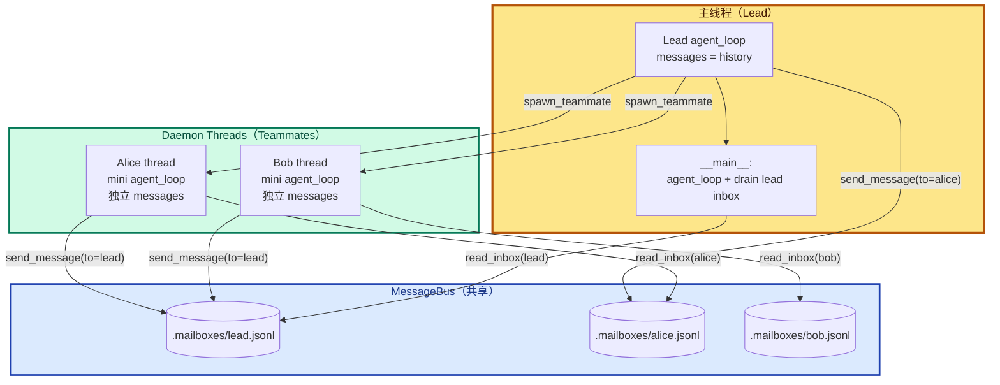
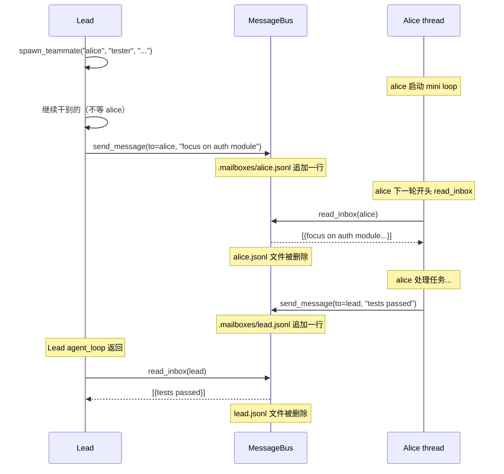
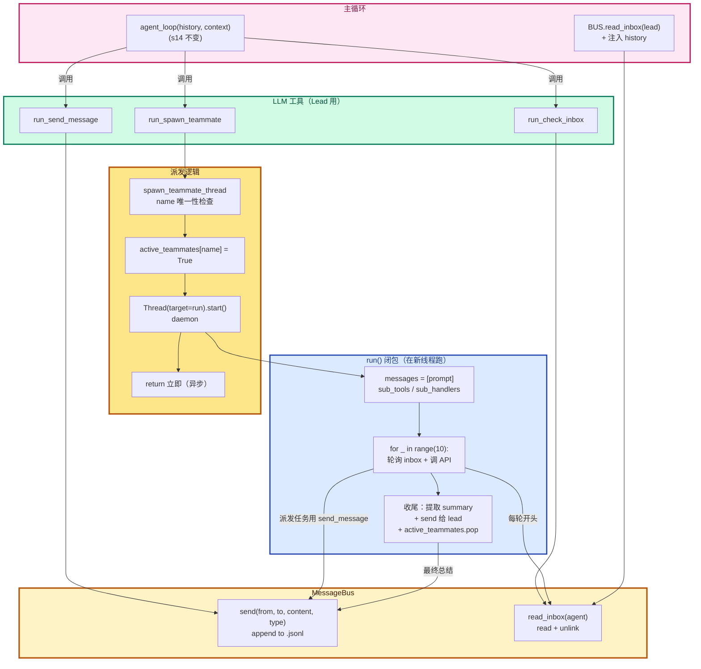
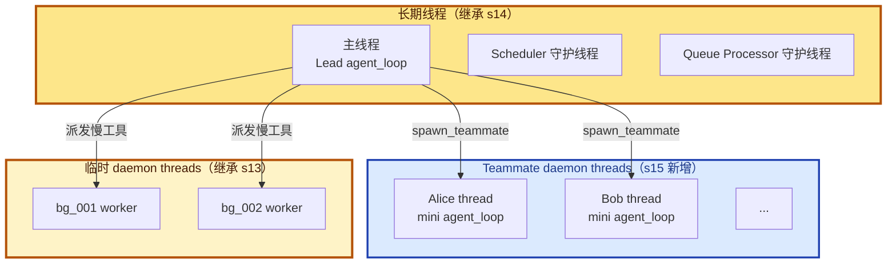

# 15 - Agent Teams

> [!note]
> s06 的 subagent 是"一次性 fork"——主 Agent 派一个子任务，等结果合并回来，subagent 跑完就消失。s15 引入第二种多 Agent 模式：**长期共存的 Teammate**。Lead Agent 可以 `spawn_teammate` 派一个有名字、有角色、自己跑循环的小弟，小弟通过 **MessageBus**（磁盘文件邮箱）跟 Lead 通信。两者**并行**跑：Lead 继续干别的，Teammate 在另一线程做自己的活，做完把结果发回 Lead 的 inbox，下一轮 Lead `check_inbox` 拿到。这是 Agent 第一次拥有**多个真正并行的 agent loop**。

## 这一步加了什么

### 1. 数据结构

- `MAILBOX_DIR = .mailboxes/`：每个 agent 一个 `.jsonl` 邮箱文件。
- `MessageBus` 类：`send(from, to, content, type)` + `read_inbox(agent)`。
- `active_teammates: dict[str, bool]`：当前在跑的 teammate 名字占用表。

### 2. 三个新工具

| 工具 | 调用者 | 作用 |
|---|---|---|
| `spawn_teammate(name, role, prompt)` | Lead | 起一个 daemon thread 跑 teammate |
| `send_message(to, content)` | Lead / Teammate | 通过 MessageBus 发消息 |
| `check_inbox()` | Lead | drain 自己的 inbox |

### 3. Teammate 自己的 mini agent loop

`spawn_teammate_thread` 内部定义了一个 `run()` 闭包——**简化版的 agent_loop**，在 daemon thread 里跑：

- 独立的 `messages` 列表（跟 Lead 的隔离）。
- 更少的工具（bash / read_file / write_file / send_message）。
- 最多跑 10 轮（教学版限制）。
- 每轮开头 drain 自己的 inbox（接收 Lead 发来的指令）。

### 4. Lead 的 `__main__` 多了一步

```python
agent_loop(history, context)
# ... 打印 ...

# s15 新增：drain lead inbox
inbox = BUS.read_inbox("lead")
if inbox:
    history.append({"role": "user",
                    "content": f"[Inbox]\n{inbox_text}"})
```

每次 agent_loop 返回后，主动 drain Lead inbox，把 Teammate 发来的消息注入 history。

## 为什么需要加

### 1. Subagent（s06）解决不了"长期协作"

s06 的 subagent 是 **Fork-Join** 模式：

```
Lead: 我要做大任务 X
  ↓ fork
Subagent: 跑小任务 Y（独立 messages）
  ↓ join
Lead: 拿到 Y 的结果，继续做 X
```

**主 Agent 等结果**才能继续。这种模式适合"一次性委托"，不适合：

- Lead 想同时管多个小弟。
- 小弟跑很久，Lead 不想等。
- 小弟之间也要通信（不是只回报 Lead）。

### 2. 需要并行执行

例子：

> 用户："同时跑前端测试和后端测试，都过了就部署。"

串行：跑前端（3 分钟）→ 跑后端（5 分钟）→ 部署 = 8 分钟。
并行：派两个 teammate 各跑一个，5 分钟搞定。

### 3. 需要角色分工

复杂任务有不同的专业领域：

- 一个 teammate 负责前端（React / CSS）。
- 一个负责后端（API / DB）。
- 一个负责测试。

每个 teammate 有自己的 system prompt 和工具集。Lead 是协调者。

s15 的 MessageBus + 长期 teammate 解决这三件事。

## 这是一个什么机制

### Lead-Teammate Architecture + File-Based Message Bus



### 消息流：单向、异步、文件持久



### 三个关键设计点

#### 1. Teammate 是"长期共存"的，不是一次性 fork

跟 s06 subagent 区别：

| 维度 | Subagent (s06) | Teammate (s15) |
|---|---|---|
| 启动方式 | 主 Agent 同步等结果 | 异步派发，立刻返回 |
| 通信 | 返回值（一次性） | MessageBus（多次往返） |
| 生命周期 | 跑完就消失 | 跑 10 轮才结束（教学版）；生产实现是 idle loop |
| messages | fork 一份副本，结束丢弃 | 独立一份，全程自己维护 |

#### 2. 邮箱文件 = drain 语义

`read_inbox` 读 = 删文件：

```python
def read_inbox(self, agent):
    inbox = MAILBOX_DIR / f"{agent}.jsonl"
    if not inbox.exists():
        return []
    msgs = [json.loads(line) for line in inbox.read_text().splitlines()
            if line.strip()]
    inbox.unlink()   # consume: read + delete
    return msgs
```

跟 s14 的 `consume_cron_queue` 同构——读 = 取走 = 删除。下次再读就是空的。

#### 3. 异步：Lead 派发后不等

```python
threading.Thread(target=run, daemon=True).start()
return f"Teammate '{name}' spawned as {role}"
```

`return` 立刻执行，Lead 继续干别的。Teammate 慢慢跑，跑完发消息到 Lead inbox。Lead 下一轮 turn 结束才 drain inbox 拿到结果。

这是 **Actor Model** 的简化版：每个 agent 是独立 actor，靠消息通信，不共享内存。

## 原本的 Claude Code 怟么做的

CC 的多 Agent 系统比 s15 复杂得多。

### 1. Subagent vs Teammate 都有

CC 同时支持两种模式：

- **Subagent（Task 工具）**：s06 的产品化版，一次性 fork-join。比如 "用 explore agent 找文件"。
- **Teammate（更接近 s15）**：长期共存的小弟，跟 s15 类似但更复杂。

### 2. 真正的文件锁

s15 教学版的 `MessageBus` 没文件锁，注释写：

```python
class MessageBus:
    """File-based message bus. Each agent has a .jsonl inbox.
    Read is destructive: read_text + unlink (consumes messages).
    Teaching version: no file locking; real CC uses proper-lockfile."""
```

CC 用 `proper-lockfile`（npm 包）做文件级锁，保证多 Agent 并发读写同一邮箱时不会出竞态。

### 3. Idle Loop 而非固定 10 轮

s15 教学版：

```python
for _ in range(10):    # ← 写死的 10 轮
    inbox = BUS.read_inbox(name)
    ...
```

Teammate 跑完 10 轮就结束。**这是教学简化**。

CC 的 teammate 用 **idle loop**：

```
while not shutdown_request:
    inbox = read_inbox()
    if inbox:
        # 处理消息
    else:
        # 等待（阻塞或 sleep）
```

Teammate **持续跑**，直到收到 `shutdown_request` 消息才退出。这让 teammate 能服务多个任务（Lead 可以反复发消息）。

### 4. 更丰富的消息类型

s15 只有两种 type：`message` 和 `result`。CC 有：

- `message`：普通消息。
- `result`：任务结果。
- `shutdown_request`：请求退出。
- `error`：错误报告。
- `progress`：进度更新。
- `query`：向其他 agent 提问。

### 5. MCP 集成

CC 的多 Agent 能跨进程通信（通过 MCP）。s15 只在同一进程内通过文件通信。

## 整体逻辑：函数之间的关系



### 调用关系详解

#### 派发阶段（Lead 主线程）

```
LLM 调 spawn_teammate 工具
  ↓
run_spawn_teammate(name, role, prompt)
  ↓
spawn_teammate_thread(name, role, prompt)
  ├─→ if name in active_teammates: return "already exists"
  ├─→ 定义 run() 闭包
  ├─→ active_teammates[name] = True
  ├─→ Thread(target=run, daemon=True).start()   ← 异步
  └─→ return "Teammate spawned as ..."          ← 立刻返回给 LLM
```

#### Teammate 执行阶段（daemon thread）

```
run() 闭包：
  messages = [prompt]
  for _ in range(10):
      inbox = BUS.read_inbox(name)        ← drain 自己邮箱
      if inbox:
          messages.append({inbox 内容})
      response = client.messages.create(...) ← 调 API
      messages.append({role:assistant, ...})
      if stop_reason != "tool_use": break
      dispatch 工具（bash/read/write/send_message）
      messages.append({role:user, tool_results})

  收尾：
      提取最后一段 assistant text 作为 summary
      BUS.send(name, "lead", summary, type="result")
      active_teammates.pop(name)            ← 释放 name
```

#### Lead 读取阶段（__main__）

```
while True:
    query = input()
    history.append({user, query})
    agent_loop(history, context)            ← 标准 loop（继承 s14）
    # 打印 assistant 文本

    # s15 新增
    inbox = BUS.read_inbox("lead")
    if inbox:
        history.append({user, "[Inbox] ..."})
```

## 对 agent_loop 的影响

这是 Phase 5 最值得讲清楚的一条线。

### 主 `agent_loop` 函数代码：**没动**

s15 的 `agent_loop` 跟 s14 完全一致——consume cron queue → 调 API → dispatch 工具 → 注入 background notifications。3 个新工具（`spawn_teammate` / `send_message` / `check_inbox`）只是进了 `TOOLS` 数组和 `execute_tool` 的 handler 表，dispatch 完全走标准路径。

**这一点跟 s12 一样**——通过工具抽象把新功能塞进 Agent，不改循环。

### 但 `__main__` 多了一步：drain lead inbox

```python
# s14 的 __main__:
agent_loop(history, context)
# 打印最新 assistant 文本

# s15 的 __main__:
agent_loop(history, context)
# 打印最新 assistant 文本
inbox = BUS.read_inbox("lead")     # ← 新增
if inbox:
    history.append({"role": "user",
                    "content": f"[Inbox]\n{inbox_text}"})
```

**agent_loop 之外**多了一步。这影响的是 **agent_loop 怎么被喂食**——下一轮调 agent_loop 时 messages 里多了 inbox 内容。

### 真正的扩展：引入第二个 agent loop

s15 的关键不是改了主 agent_loop，而是**引入了第二套 agent loop**——teammate 自己跑的那个 `run()` 函数。

```python
def run():                          # ← teammate 的 mini agent loop
    messages = [{"role": "user", "content": prompt}]
    sub_tools = [...]
    sub_handlers = {...}

    for _ in range(10):             # ← 最多 10 轮（教学简化）
        inbox = BUS.read_inbox(name)
        ...
        response = client.messages.create(...)
        messages.append({"role": "assistant", "content": response.content})
        if response.stop_reason != "tool_use":
            break
        # dispatch 工具
        ...

    # 收尾
    ...
```

**这是简化版的 agent_loop**，在 daemon thread 里跑。s15 不是"改了主 agent_loop"，而是**复制了一份简化的 agent_loop 给 teammate 用**。

### 总结：三种扩展方式

Phase 4-5 的每课代表一种扩展 agent_loop 的方式：

| 课 | 扩展方式 | 改动位置 |
|---|---|---|
| s12 | 加工具 | TOOLS / TOOL_HANDLERS |
| s13 | dispatch 加分支 | agent_loop 内部 dispatch 处 |
| s14 | 入口前 consume | agent_loop 开头 + 起守护线程 |
| s15 | **复制一份新的 mini loop** | 新 daemon thread + __main__ 加 drain |

s15 是**最激进的扩展**——直接造一个并行的 agent。

## 多线程并行情况

s15 在 s14 的三个长期线程基础上，**多了若干个 teammate daemon thread**。



### 关键特征：**第一次有多个真正的 agent loop 并行**

之前所有的"并发"都不是真正的 agent loop 并行：

- s13 background tasks：跑的是**单个工具**（如 bash），不是完整 agent loop。
- s14 scheduler / queue processor：跑的是**判时间 / 唤醒逻辑**，不是 agent loop。

s15 第一次让**多个完整的 agent loop 真正并行**——每个 teammate 跑自己的 while 循环，调自己的 API，维护自己的 messages。

### 通信方式：磁盘文件，不共享内存

Lead 和 Teammate **不共享 messages**——它们靠 MessageBus 的文件通信。这是关键设计：

- **隔离**：Lead 的上下文不会被 teammate 的 messages 污染（对比 s06 subagent 也用隔离 messages，但同步等结果）。
- **持久**：邮箱文件在磁盘，进程崩了消息不丢。
- **无锁**：通过 drain 语义（读 = 删）避免复杂同步。

但教学版没文件锁，生产实现要用 `proper-lockfile`。

### 并发风险：API 速率限制

N 个 teammate 同时调 API，**速率限制共享**。如果有 3 个 teammate 各跑 10 轮，30 次 API 调用在很短时间内发生——容易触发 429。

生产实现要做：

- 每个 teammate 独立的速率限制器。
- 错开启动时间（jitter）。
- 共享一个 API 调用队列串行化。

s15 教学版省略这些，假设不会触发限流。

## 设计要点

### 1. Drain 语义：读 = 删

```python
def read_inbox(self, agent):
    ...
    inbox.unlink()   # consume
    return msgs
```

跟 s14 的 `consume_cron_queue` 同构。读一次清空，避免下次重复处理。

### 2. Teammate 自己维护 messages

```python
def run():
    messages = [{"role": "user", "content": prompt}]
    ...
    for _ in range(10):
        ...
        messages.append(...)
```

每个 teammate 有**独立的 messages 列表**。不污染 Lead 的 history，也不被 Lead 污染。

### 3. 名字唯一性

```python
if name in active_teammates:
    return f"Teammate '{name}' already exists"
```

同名 teammate 不能重复 spawn。跑完后 `active_teammates.pop(name)` 释放名字。

### 4. 异步派发，立刻返回

```python
threading.Thread(target=run, daemon=True).start()
return f"Teammate '{name}' spawned as {role}"
```

Lead 调 `spawn_teammate` 立刻拿到返回值，不等 teammate 跑完。这让 Lead 能继续干别的——包括 spawn 更多 teammate 或处理其他事。

### 5. 限制 10 轮（教学简化）

```python
for _ in range(10):
    ...
```

避免 teammate 无限循环烧 token。生产实现用 idle loop + shutdown_request 消息。

### 6. 自动提取 summary

```python
summary = "Done."
for msg in reversed(messages):
    if msg["role"] == "assistant" and isinstance(msg["content"], list):
        for b in msg["content"]:
            if getattr(b, "type", None) == "text":
                summary = b.text
                break
        else:
            continue
        break
BUS.send(name, "lead", summary, "result")
```

teammate 跑完后从历史里**挖最后一段 assistant 文本**作为总结发给 Lead。`for...else` 是 Python 不常见但精确的语法——内层没 break 才走 else，用于"当前 message 没 text 块就继续看上一条"。

## 实现对照（s15/code.py）

### MessageBus

```python
class MessageBus:
    """File-based message bus. Each agent has a .jsonl inbox.
    Read is destructive: read_text + unlink (consumes messages)."""

    def send(self, from_agent, to_agent, content, msg_type="message"):
        msg = {"from": from_agent, "to": to_agent,
               "content": content, "type": msg_type,
               "ts": time.time()}
        inbox = MAILBOX_DIR / f"{to_agent}.jsonl"
        with open(inbox, "a") as f:
            f.write(json.dumps(msg) + "\n")

    def read_inbox(self, agent):
        inbox = MAILBOX_DIR / f"{agent}.jsonl"
        if not inbox.exists():
            return []
        msgs = [json.loads(line) for line in inbox.read_text().splitlines()
                if line.strip()]
        inbox.unlink()  # consume: read + delete
        return msgs
```

### spawn_teammate_thread

```python
def spawn_teammate_thread(name, role, prompt):
    if name in active_teammates:
        return f"Teammate '{name}' already exists"

    system = (f"You are '{name}', a {role}. "
              f"Use tools to complete tasks. "
              f"Send results via send_message to 'lead'.")

    def run():
        messages = [{"role": "user", "content": prompt}]
        sub_tools = [bash, read_file, write_file, send_message]
        sub_handlers = {bash, read_file, write_file,
                        send_message: lambda to, content: BUS.send(name, to, content)}

        for _ in range(10):
            inbox = BUS.read_inbox(name)
            if inbox:
                messages.append({"role": "user",
                                 "content": f"<inbox>{json.dumps(inbox)}</inbox>"})
            try:
                response = client.messages.create(
                    model=MODEL, system=system, messages=messages[-20:],
                    tools=sub_tools, max_tokens=8000)
            except Exception:
                break
            messages.append({"role": "assistant", "content": response.content})
            if response.stop_reason != "tool_use":
                break
            results = []
            for block in response.content:
                if block.type == "tool_use":
                    handler = sub_handlers.get(block.name)
                    output = handler(**block.input) if handler else "Unknown"
                    results.append({"type": "tool_result",
                                    "tool_use_id": block.id,
                                    "content": str(output)})
            messages.append({"role": "user", "content": results})

        # 收尾：自动 summary
        summary = "Done."
        for msg in reversed(messages):
            if msg["role"] == "assistant" and isinstance(msg["content"], list):
                for b in msg["content"]:
                    if getattr(b, "type", None) == "text":
                        summary = b.text
                        break
                else:
                    continue
                break
        BUS.send(name, "lead", summary, "result")
        active_teammates.pop(name, None)

    active_teammates[name] = True
    threading.Thread(target=run, daemon=True).start()
    return f"Teammate '{name}' spawned as {role}"
```

几个关键细节：

- `messages[-20:]` 只取最近 20 条给 API——简化版的上下文压缩（s08 的 1/8 实现）。
- `try: ... except: break` 包 API 调用，错误就退出（s11 error recovery 的极简版）。
- `sub_handlers` 用 lambda 包装 send_message，让 teammate 调用时自动用自己的 name 作为 from。

## 相关概念

- [[06 - Subagent]]：s15 的 teammate 跟 s06 subagent 都是"派生 agent"，但模式不同（一次性 fork-join vs 长期共存）
- [[14 - Cron Scheduler]]：s15 复用 s14 的多线程基础设施（daemon thread）
- [[13 - Background Tasks]]：s15 的 teammate 也是 daemon thread，但跑的是完整 agent loop（不是单个工具）
- [[12 - Task System]]：多 Agent 协作时 task system 是协调中介（s15 没展开，留给 s16-s18）
- [[02 - Tool Use]]：spawn_teammate / send_message / check_inbox 走标准 dispatch

> [!warning]
> 几个容易踩的坑：
>
> 1. **以为 teammate 共享 Lead 的 messages**。不共享。teammate 有自己独立的 messages，只靠 MessageBus 文件通信。
> 2. **以为 inbox 自动清理**。只在被 read 时清理。没人读就永远堆积。
> 3. **以为 teammate 会一直跑**。s15 教学版最多 10 轮就退出，要持续跑用生产实现的 idle loop。
> 4. **没有文件锁**：两个 thread 同时 read 同一个 inbox 会有竞态（一个读了另一个 unlink 报错）。生产要用 `proper-lockfile`。
> 5. **API 速率限制**：N 个 teammate 同时调 API 容易触发限流。生产要做错峰或共享速率限制器。
> 6. **`active_teammates` 不释放**：如果 teammate 异常退出（没跑到收尾的 `pop`），名字永远占用，下次 spawn 同名会失败。生产实现要加超时清理或心跳机制。

## Q&A

### Q1: s15 的 inbox 会进行清理吗

**A**：会，而且**读 = 删**。

看 `MessageBus.read_inbox`：

```python
def read_inbox(self, agent):
    inbox = MAILBOX_DIR / f"{agent}.jsonl"
    if not inbox.exists():
        return []
    msgs = [json.loads(line) for line in inbox.read_text().splitlines()
            if line.strip()]
    inbox.unlink()  # consume: read + delete   ← 关键
    return msgs
```

inbox 是 `.mailboxes/{agent}.jsonl` 文件，每次 send 就 append 一行，每次 read 就**整个文件读出来 + `unlink()` 删掉文件**。这是 **drain（消费）语义**——读 = 取走 = 删除。

三个清理点：

1. **teammate 每轮开头自己读**：`for _ in range(10): inbox = BUS.read_inbox(name)`。
2. **Lead 调 `check_inbox` 工具**：模型主动 drain lead inbox。
3. **主循环 agent_loop 返回后**：`__main__` 里 `inbox = BUS.read_inbox("lead")`。

如果**没人读**，inbox 文件**永远不被删**，消息堆积。

跟 s14 的 `consume_cron_queue` 是同构模式。

### Q2: 这部分代码（spawn_teammate_thread 的收尾 + 启动）讲解一下

```python
# Send final summary to Lead
summary = "Done."
for msg in reversed(messages):
    if msg["role"] == "assistant" and isinstance(msg["content"], list):
        for b in msg["content"]:
            if getattr(b, "type", None) == "text":
                summary = b.text
                break
        else:
            continue
        break
BUS.send(name, "lead", summary, "result")
active_teammates.pop(name, None)
print(f"  [teammate] {name} finished")

active_teammates[name] = True
threading.Thread(target=run, daemon=True).start()
print(f"  [teammate] {name} spawned as {role}")
return f"Teammate '{name}' spawned as {role}"
```

**A**：分两部分——**内层（`run()` 闭包结尾）** 和 **外层（`spawn_teammate_thread` 结尾）**。

#### 内层：teammate 的收尾三件套

**动作 1：从 messages 挖最后一段 assistant 文本当总结**

```python
summary = "Done."                        # 默认值
for msg in reversed(messages):           # 倒序遍历（最新优先）
    if msg["role"] == "assistant" and isinstance(msg["content"], list):
        for b in msg["content"]:
            if getattr(b, "type", None) == "text":
                summary = b.text
                break                    # 找到 text 块，跳出内层
        else:
            continue                     # 内层没找到 text，继续外层
        break                            # 内层 break 了，跳出外层
```

倒序是因为 teammate 最后一轮说的话才是"最终总结"。`for...else` 是 Python 不常见但精确的语法——内层循环没遇到 break 才走 else，用于"当前 message 没 text 块就继续看上一条"。

默认 "Done." 是兜底（messages 空或最后没 text block 时用）。

**动作 2：把总结发给 lead**

```python
BUS.send(name, "lead", summary, "result")
```

通过 MessageBus 发送，`type="result"` 标记是最终结果。

**动作 3：清理 active_teammates**

```python
active_teammates.pop(name, None)
```

`active_teammates` 是 dict，记录当前在跑的 teammate。`pop(name, None)` 删掉自己——**让 name 可以被复用**。如果不 pop，下次 spawn 同名 teammate 会被 `if name in active_teammates` 拒绝。

#### 外层：启动线程

```python
active_teammates[name] = True                      # 1. 登记 name 占用
threading.Thread(target=run, daemon=True).start()  # 2. 起 daemon 线程
print(f"  [teammate] {name} spawned as {role}")    # 3. 日志
return f"Teammate '{name}' spawned as {role}"      # 4. 返回给 LLM
```

`return` 立刻执行，**不等 teammate 跑完**——异步派发。

#### 闭包变量捕获

`run` 函数是闭包，捕获了外层的 `name`、`role`、`prompt`。每个 teammate 的 `run` 都有自己的一份闭包，同名变量互不干扰。

### Q3: s15 对 agent_loop 没什么影响对吗

**A**：**部分对**。

**主 `agent_loop` 函数代码：确实没动**——跟 s14 完全一致。3 个新工具只是进了 TOOLS 数组和 handler 表，dispatch 走标准路径。这一点跟 s12 加 task 工具一样。

**但 s15 仍然在三个地方动了：**

1. **`__main__` 多了一步**：每次 agent_loop 返回后 drain lead inbox，把 teammate 消息注入 history。这影响 agent_loop 怎么被喂食，但不在 agent_loop 内部。

2. **引入第二个 agent loop**：teammate 自己跑的 `run()` 函数是简化版的 agent_loop，在 daemon thread 里跑。这是 s15 的核心贡献——**复制了一份简化的 agent_loop 给 teammate**。

3. **多线程并行 agent loop**：第一次让多个完整 agent loop 真正并行（之前的 background task 只跑单个工具，scheduler/queue_processor 不跑 agent loop）。

所以更准确的说法是：**主 agent_loop 函数不变，但 s15 引入了"多 agent loop 并行"的架构**——这是 Phase 5 的起点。

### Q4: Teammate 和 Subagent（s06）有什么区别

**A**：两者都是"派生 agent"，但模式不同。

| 维度 | Subagent (s06) | Teammate (s15) |
|---|---|---|
| 启动方式 | 主 Agent 同步等结果 | 异步派发，立刻返回 |
| 通信 | 返回值（一次性） | MessageBus（多次往返） |
| 生命周期 | 跑完就消失 | 跑 10 轮才结束（教学）；生产是 idle loop |
| messages | fork 一份副本，结束丢弃 | 独立一份，全程自己维护 |
| 适合场景 | 一次性委托（如"用 explore agent 找文件"） | 长期协作（多角色分工） |
| 并行度 | 主 Agent 等 subagent 跑完才继续 | 主 Agent 派发后立刻干别的 |

**简单记忆**：

- Subagent = "Fork-Join"（fork 出去 → 等 → join 回来）。
- Teammate = "Actor Model"（独立 actor + 异步消息通信）。

CC 两种都支持。

### Q5: 为什么 MessageBus 用文件而不是用内存队列

**A**：三个理由。

**1. 跨进程**：未来 teammate 可能跑在不同进程（甚至不同机器）。文件系统是跨进程的通用接口。内存队列只能同进程。

**2. 持久性**：进程崩了文件还在，重启后能恢复。内存队列进程死就丢。

**3. 可观察**：用户可以 `cat .mailboxes/alice.jsonl` 直接看 teammate 收到了什么。调试方便。

代价：

- 文件 I/O 比内存慢。
- 需要文件锁保证并发安全（s15 教学版省了）。

CC 选择文件是因为它要支持**跨进程的多 Agent 架构**（包括 MCP 远程 agent）。

### Q6: 如果 teammate 永远不调 send_message，Lead 怎么知道它跑完了

**A**：s15 有**兜底**——teammate 跑完 10 轮（或 break）后，**自动**提取 summary 发给 Lead：

```python
# 收尾
summary = "Done."
for msg in reversed(messages):
    ...提取最后一段 assistant text...
BUS.send(name, "lead", summary, "result")   # ← 强制发送
```

即使 teammate 一句 send_message 都没调，收尾也会自动发个 "Done." 或最后一段 text 给 Lead。

所以 Lead 一定能等到一条 result 消息——除非 teammate **线程异常退出**（run() 抛未捕获异常），那就永远没消息。生产实现要在 run 外面包 try/except 兜底发送错误信息。

### Q7: 如果两个 teammate 同时给 Lead 发消息会怎样

**A**：**文件追加是原子的**（POSIX 保证 `O_APPEND` 模式的 write 对小数据原子），所以两个 teammate 同时 `send_message(to=lead, ...)` 不会损坏文件——两行各自完整写入。

但**读的时候有问题**：

- 两个 teammate 同时 send → lead.jsonl 有两行。
- Lead `read_inbox("lead")` → 一次性读两行 + unlink。
- 这没问题。

真正的问题：

- Teammate A 在 send，Lead 在 read。
- Lead 读到一半（只读了 A 之前的），A 的 append 进来。
- Lead unlink 文件。
- 现在 A 刚 append 的内容**永远丢了**。

这就是 s15 教学版**没文件锁**的竞态。生产实现用 `proper-lockfile` 保证 read 和 send 互斥。

教学版能跑是因为实际场景下 teammate 同时 send 的概率低，且 Lead drain 的频率不高。生产场景必须修。
