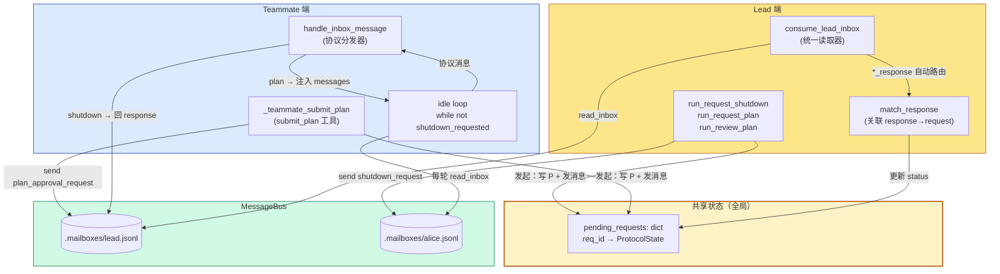
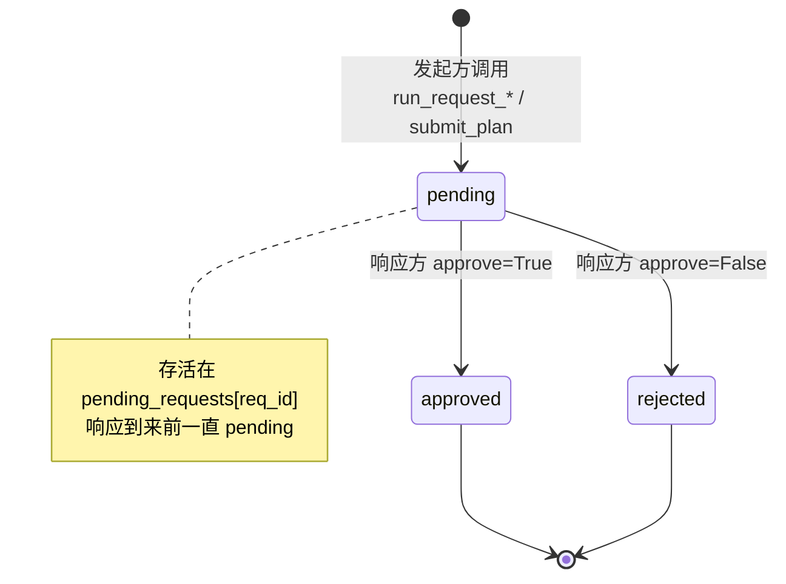
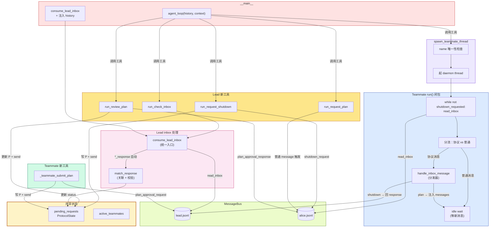
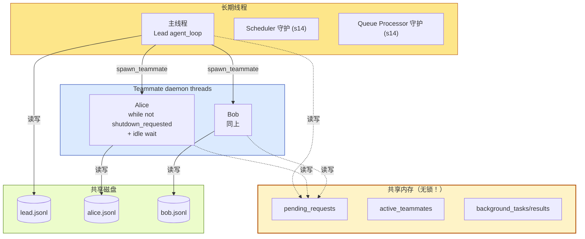

# 16 - Team Protocols

> [!note]
> s15 的 Teammate 只能"干活 + 发总结"——Lead 跟 Teammate 之间除了普通 message 没别的语言。s16 加了一层**协议（Protocol）**：把"请求—响应"这种结构化对话提到一等公民。每个协议请求有一个 `request_id`，状态机 `pending → approved/rejected`，方向可双向（Lead 发起 shutdown / Teammate 发起 plan_approval）。同时 Teammate 的生命周期从 s15 的固定 10 轮升级成 **idle loop**——干完活不退，挂在那等新指令或 shutdown_request，这才真正接近生产级的长寿命 agent。

## 这一步加了什么

### 1. 一个共享状态：`pending_requests`

```python
@dataclass
class ProtocolState:
    request_id: str
    type: str       # "shutdown" | "plan_approval"
    sender: str
    target: str
    status: str     # pending | approved | rejected
    payload: str    # plan text or shutdown reason
    created_at: float

pending_requests: dict[str, ProtocolState] = {}
```

**这是 Lead 和 Teammate 之间"挂号单"的存根**——谁发起一个协议请求，就在这里记一条。`request_id` 是后续把 response 关联回 request 的唯一钥匙。

### 2. 一个 ID 生成器

```python
def new_request_id() -> str:
    return f"req_{random.randint(0, 999999):06d}"
```

形如 `req_482910`。简单粗暴用随机数——教学版没去重检查，生产实现要用 UUID 或单调计数器。

### 3. Lead 的三个新工具

| 工具 | 作用 | 发起方向 |
|---|---|---|
| `request_shutdown(teammate)` | 让 Teammate 优雅退出 | Lead → Teammate |
| `request_plan(teammate, task)` | 让 Teammate 提交一个计划 | Lead → Teammate（先发普通 message 触发） |
| `review_plan(request_id, approve, feedback)` | 审批 Teammate 提交的计划 | Lead → Teammate |

### 4. Teammate 的一个新工具

| 工具 | 作用 | 发起方向 |
|---|---|---|
| `submit_plan(plan)` | 把计划发给 Lead 审批 | Teammate → Lead |

### 5. 一个 Lead 端的统一收件箱读取器：`consume_lead_inbox`

```python
def consume_lead_inbox(route_protocol: bool = True) -> list[dict]:
    msgs = BUS.read_inbox("lead")
    if not msgs:
        return []
    if route_protocol:
        for msg in msgs:
            meta = msg.get("metadata", {})
            req_id = meta.get("request_id", "")
            msg_type = msg.get("type", "")
            if req_id and msg_type.endswith("_response"):
                approve = meta.get("approve", False)
                match_response(msg_type, req_id, approve)
    return msgs
```

这是 s15 之后的一个**重要修复**：s15 里 Lead 读取 inbox 有两个入口（`check_inbox` 工具 + `__main__` 末尾），如果 protocol 响应被错误入口吃掉，就再也没机会 match_response。s16 把两个入口都改用 `consume_lead_inbox`，保证**协议响应一定会被路由**。

### 6. 一个 Teammate 端的协议分发器：`handle_inbox_message`

```python
def handle_inbox_message(name, msg, messages) -> bool:
    """Returns True if teammate should stop."""
    msg_type = msg.get("type", "message")
    # shutdown_request → 自动回 response + 返回 True（停止）
    # plan_approval_response → 注入 messages（继续）
    # 其他 → 不处理（fall through）
```

Teammate 每收到 inbox 消息，先过这个分发器。协议消息（shutdown_request / plan_approval_response）走结构化路径，普通消息才进入 messages 给 LLM 看。

### 7. Teammate 的 idle loop

s15：

```python
for _ in range(10):     # 写死 10 轮
    inbox = BUS.read_inbox(name)
    ...
```

s16：

```python
shutdown_requested = False
while not shutdown_requested:   # 持续跑到被 shutdown
    inbox = BUS.read_inbox(name)
    ...
    if response.stop_reason != "tool_use":
        # Idle: 等新消息而不是退出
        while not shutdown_requested:
            time.sleep(1)
            inbox = BUS.read_inbox(name)
            if not inbox:
                continue
            ...
```

**这是 Phase 5 第二个关键升级**——Teammate 从"一次性 10 轮"变成"长寿命进程"，能服务多个任务，直到 Lead 明确让它 shutdown。

## 为什么需要加

### 1. s15 缺"控制信令"

s15 只有一种消息类型——普通 message。Lead 想让 Teammate"现在停下来"或"这个计划先别动手等我审批"，**只能用自然语言说**："please stop" / "wait for my approval"。问题是：

- LLM 可能不照办（自然语言不是协议）。
- 没法确认对方真的停了。
- 没法把"批准/拒绝"关联到具体哪一次请求。

s16 把这些控制流提到代码层：**协议 = 代码识别 + 状态机 + 强制行为**。

### 2. 需要双向通信

s15 的通信模式偏单向：Lead 派活 → Teammate 干 → Teammate 发结果。但真实协作中**Teammate 也需要向 Lead 请求**：

- "我这个计划你批吗？"（plan_approval）
- "我需要更多上下文"（query，s16 没实现但留了扩展位）
- "我卡住了，求助"

s16 的协议是**双向**的——Teammate 也能通过 `submit_plan` 发起一个请求，Lead 必须响应。

### 3. 需要长寿命 Teammate

s15 的 10 轮限制是教学简化。真实场景：

```
Lead: spawn alice (tester)
alice: 测试 A（5 轮）→ done → idle
Lead: send alice "now test B"
alice: 测试 B（3 轮）→ done → idle
Lead: request_shutdown(alice)
alice: shutdown_response → exit
```

alice 服务了多个任务，期间一直挂着。这就是 idle loop 的价值。

### 4. 需要结构化确认（ack/nack）

s15 的 Lead 不知道 Teammate 是否真收到消息。s16 的 shutdown 协议保证：

```
Lead: send shutdown_request (req_id=R1)
Teammate: 收到 → 自动回 shutdown_response (req_id=R1, approve=True)
Lead: match_response(R1) → pending_requests[R1].status = "approved"
```

Lead 看 `pending_requests[R1].status` 就知道 Teammate 真的关了。

## 这是一个什么机制

### 协议 = 状态机 + 双向消息 + ID 关联



### 关键概念：协议方向是对称的，但发起方不同

| 协议 | 谁发起 | 谁响应 | 用途 |
|---|---|---|---|
| `shutdown` | Lead | Teammate | Lead 命令 Teammate 停下 |
| `plan_approval` | Teammate | Lead | Teammate 把计划交给 Lead 审批 |

两条协议的**状态机一样**（pending → approved/rejected），**消息格式对称**（`*_request` / `*_response`），但**方向相反**。

### 状态机



### request_id 是关键

`request_id` 是把"请求"和"响应"两条消息关联起来的**唯一钥匙**。没有它，协议退化为"无状态消息"——Lead 收到一个 shutdown_response 不知道对应哪个 shutdown_request。

s16 的 metadata 里带 request_id：

```python
BUS.send("lead", teammate, "...", "shutdown_request",
         {"request_id": req_id})
# Teammate 回：
BUS.send(name, "lead", "...", "shutdown_response",
         {"request_id": req_id, "approve": True})
```

Lead 收到 response 后用 `match_response(msg_type, req_id, approve)` 关联：

```python
state = pending_requests.get(request_id)
if state.type == "shutdown" and response_type != "shutdown_response":
    return  # type mismatch, ignore
state.status = "approved" if approve else "rejected"
```

跟 Web 编程里的 **correlation ID** 同构——微服务、消息队列、async job 都用这个模式。

## 原本的 Claude Code 怎么做的

CC 的多 Agent 协议比 s16 复杂得多。

### 1. 更多协议类型

s16 只实现两种（shutdown / plan_approval）。CC 至少有：

- `shutdown_request` / `shutdown_response`
- `plan_approval_request` / `plan_approval_response`
- `query` / `query_response`：Teammate 向 Lead 提问
- `progress_report`：Teammate 周期性汇报进度
- `idle_notification`：Teammate 进入 idle 时通知 Lead
- `error_report`：Teammate 上报错误
- `context_request`：Teammate 请求更多上下文

每种协议有独立的状态机和路由规则。

### 2. 真正的代码级 gating

s16 的注释里诚实地写：

```python
def _teammate_submit_plan(from_name, plan):
    """Note: This is a protocol-level request, not a code-level gate.
    After submitting, the teammate's thread continues running — it can
    still call bash/write/etc. Real enforcement relies on the model
    waiting for the approval response before acting."""
```

**s16 的 plan_approval 是"君子协定"**——Teammate 提交后，代码不阻止它继续干活，只是 prompt 引导它等批准。LLM 不听话就照干不误。

CC 真正做的是**代码级 gating**：Teammate 调 `submit_plan` 后，**线程阻塞**在 condition variable 上，直到 Lead 的 `review_plan` 触发唤醒。批准前 Teammate 的工具调用全部被卡住——这才是强制的。

### 3. 超时和重试

s16 没有——如果 Lead 发了 shutdown_request 但 Teammate 没回，`pending_requests[req_id]` 永远 pending。

CC 给每个协议加超时：

```
if state.created_at + TIMEOUT < now:
    state.status = "timeout"
    # 重试或上报
```

### 4. 协议持久化

s16 的 `pending_requests` 是纯内存，进程崩了全丢。CC 把它存到磁盘（类似 s12 的 task 系统），重启后能恢复未完成的协议。

### 5. 文件锁

跟 s15 一样的问题，CC 用 `proper-lockfile` 保护 mailbox 并发读写。s16 教学版省了。

## 整体逻辑：函数之间的关系



### 调用关系详解

#### Lead 发起的 shutdown 协议（完整流）

```
Lead LLM 调 request_shutdown(teammate="alice")
  ↓
run_request_shutdown("alice")
  ├─ req_id = new_request_id()              ← 生成 ID
  ├─ pending_requests[req_id] = ProtocolState(type="shutdown", ...)
  ├─ BUS.send("lead", "alice", "...", "shutdown_request", {request_id: req_id})
  └─ return "Shutdown request sent (req: R1)"
                ← Lead 工具立刻返回，不等 alice 回应

  ─── 异步，在 alice 的 daemon thread ───

alice 的 idle loop:
  inbox = BUS.read_inbox("alice")
  for msg in inbox:
      if msg.type == "shutdown_request":   ← 协议消息
          should_stop = handle_inbox_message(name, msg, messages)
          ↓
          handle_inbox_message:
              BUS.send("alice", "lead", "Shutting down",
                       "shutdown_response", {request_id: req_id, approve: True})
              return True                    ← 让 idle loop 停
  if should_stop:
      shutdown_requested = True
      break                                  ← 退出 idle loop

  ─── alice 跑收尾 ───

  summary = ... (挖最后一段 assistant text)
  BUS.send("alice", "lead", summary, "result")
  active_teammates.pop("alice")

  ─── 回到 Lead 端，下一次 agent_loop 或 check_inbox ───

consume_lead_inbox(route_protocol=True)
  msgs = BUS.read_inbox("lead")              ← 拿到 shutdown_response
  for msg in msgs:
      if msg.type endswith "_response":
          match_response("shutdown_response", req_id, approve=True)
            ↓
            state = pending_requests[req_id]
            校验 state.type == "shutdown"
            state.status = "approved"        ← 状态机推进
  return msgs                                ← 同时返回给 caller 注入 history
```

#### Teammate 发起的 plan_approval 协议（完整流）

```
alice LLM 调 submit_plan(plan="Step 1: ... Step 2: ...")
  ↓
_teammate_submit_plan("alice", plan)
  ├─ req_id = new_request_id()
  ├─ pending_requests[req_id] = ProtocolState(type="plan_approval", sender="alice", ...)
  ├─ BUS.send("alice", "lead", plan, "plan_approval_request", {request_id: req_id})
  └─ return "Plan submitted (req_id). Waiting for approval..."
                ← 返回给 alice 的 LLM，引导它等

  ─── alice 的 LLM 拿到 "Waiting for approval" 提示 ───
  ─── 假设 LLM 听话，下一轮 stop_reason != "tool_use" ───
  ─── alice 进入 idle wait ───

  while not shutdown_requested:
      time.sleep(1)
      inbox = BUS.read_inbox("alice")
      if not inbox:
          continue
      for msg in inbox:
          if msg.type == "plan_approval_response":     ← 协议消息
              should_stop = handle_inbox_message(...)
              ↓
              handle_inbox_message:
                  approve = meta.get("approve", False)
                  if approve:
                      messages.append({"role":"user",
                          "content":"[Plan approved] Proceed..."})
                  else:
                      messages.append({"role":"user",
                          "content":"[Plan rejected] Feedback: ..."})
                  return False              ← 不停，继续干活
      if non_protocol:
          break                              ← 回到 LLM turn，带着新 messages

  ─── Lead 端 ───

Lead LLM 看到 inbox 里有 plan_approval_request
Lead LLM 调 review_plan(request_id=req_id, approve=True)
  ↓
run_review_plan(req_id, approve=True, feedback="")
  ├─ state = pending_requests.get(req_id)
  ├─ state.status = "approved"               ← Lead 端状态机也推进
  ├─ BUS.send("lead", "alice", "Approved", "plan_approval_response",
  │          {request_id: req_id, approve: True})
  └─ return "Plan approved (req_id)"
```

#### idle loop 是 Teammate 的核心控制结构

s15 的 run()：

```python
for _ in range(10):
    inbox = read_inbox()
    response = client.messages.create(...)
    if response.stop_reason != "tool_use":
        break                  ← 直接退出
    dispatch tools
```

s16 的 run()：

```python
shutdown_requested = False
while not shutdown_requested:
    inbox = read_inbox()
    分流 inbox → 协议消息走 handle_inbox_message，普通消息进 messages
    response = client.messages.create(...)
    if response.stop_reason != "tool_use":
        # ↓ 这一段是 s16 新增的核心
        while not shutdown_requested:
            time.sleep(1)
            inbox = read_inbox()
            if not inbox: continue
            分流 inbox
            if 收到 shutdown_request: break 主循环
            if 收到普通消息: break idle，回 LLM turn
    dispatch tools
```

**两层 while 嵌套**：外层是"主循环"（有 LLM turn），内层是"等消息"（不调 LLM）。idle 状态下 Teammate **不烧 token**，纯靠 `time.sleep(1) + read_inbox` 轮询。

## 对 agent_loop 的影响

### 主 `agent_loop` 函数：**完全没动**

s16 的 `agent_loop` 跟 s15 一字不差——consume cron queue（继承 s14）→ 调 API → dispatch 工具 → 合并 background notifications。4 个新工具（`request_shutdown` / `request_plan` / `review_plan` / `submit_plan`，最后一个在 Teammate 的 sub_tools 里）只是进了 TOOLS 数组和 handler 表。

**这是 Phase 5 一贯的模式**：s15 / s16 都通过工具抽象把新功能塞进 Agent，不动主循环。

### `__main__`：`consume_lead_inbox` 替代直接 `BUS.read_inbox`

s15：

```python
inbox = BUS.read_inbox("lead")
if inbox:
    history.append({"role": "user", "content": f"[Inbox]\n{inbox_text}"})
```

s16：

```python
inbox_msgs = consume_lead_inbox(route_protocol=True)
if inbox_msgs:
    inbox_text = "\n".join(f"From {m['from']}: {m['content'][:200]}"
                           for m in inbox_msgs)
    history.append({"role": "user", "content": f"[Inbox]\n{inbox_text}"})
```

**功能相同，但多了一步协议路由**：消息进 history 之前，先让 `match_response` 把 `*_response` 消息的状态机推进掉。否则 Lead 永远不会知道协议完成了。

### `check_inbox` 工具：也走 `consume_lead_inbox`

s15：

```python
def run_check_inbox():
    msgs = BUS.read_inbox("lead")
    ...
```

s16：

```python
def run_check_inbox():
    msgs = consume_lead_inbox(route_protocol=True)
    ...
```

**这是 s16 的一个重要 bug fix**——s15 有两个入口读 lead inbox（工具 + main loop），如果 LLM 用 `check_inbox` 工具读了一次，下次 main loop 再读就空了。s16 把两个入口都统一到 `consume_lead_inbox`，保证协议路由一定被执行。

### 真正的扩展：Teammate 的 `run()` 闭包

s16 对 Teammate 的 `run()` 做了**结构性改造**：

| 维度 | s15 | s16 |
|---|---|---|
| 循环结构 | `for _ in range(10)` | `while not shutdown_requested` |
| stop_reason != tool_use 时 | break，跑收尾 | 进 idle loop 等新消息 |
| inbox 处理 | 全部塞进 messages | 分流：协议走 handle_inbox_message，普通进 messages |
| 工具集 | bash / read / write / send_message | + `submit_plan` |
| 退出条件 | 跑完 10 轮 / API 错误 / 自然停 | shutdown_request 协议 / API 错误 |

这是 s16 真正的"动刀"位置——**不是主 agent_loop，而是 Teammate 的 mini agent_loop**。

### 总结：三种扩展方式（更新版）

| 课 | 扩展方式 | 改动位置 |
|---|---|---|
| s12 | 加工具 | TOOLS / TOOL_HANDLERS |
| s13 | dispatch 加分支 | agent_loop 内部 dispatch 处 |
| s14 | 入口前 consume | agent_loop 开头 + 起守护线程 |
| s15 | 复制一份新的 mini loop | 新 daemon thread + __main__ 加 drain |
| s16 | **改 mini loop 的结构 + 加共享状态** | Teammate run() 重写 + consume_lead_inbox 统一 |

s16 是 Phase 5 的"深化课"——不引入新的并行 agent，而是把已有 Teammate 升级成长寿命 + 可协议通信的真正"协作者"。

## 多线程并行情况

s16 跟 s15 的线程结构**完全一样**：主线程 + scheduler 守护线程 + queue processor 守护线程 + 若干 Teammate daemon thread + 临时 background worker。



### 关键变化：Teammate 变成长寿命

s15 的 Teammate 跑完 10 轮就退。s16 的 Teammate **挂在 idle loop 里持续占着一个线程**。这带来两个新风险：

#### 1. `pending_requests` 是共享状态但没有锁

```python
pending_requests: dict[str, ProtocolState] = {}
```

- Lead 线程写：`pending_requests[req_id] = ProtocolState(...)`
- Lead 线程读：`state = pending_requests.get(req_id)`
- Lead 线程改：`state.status = "approved"`
- Teammate 线程写：`pending_requests[req_id] = ProtocolState(...)`（submit_plan 时）

CPython 的 GIL 保证单条 dict 操作原子，但**"读 + 改"两步不原子**：

```
Lead 线程: state = pending_requests.get(req_id)  # 拿到 status="pending"
                                                # 此时被切走
Teammate 线程: state.status = "approved"         # 改了
Lead 线程: if state.status != "pending": ...     # 又看到了 approved
```

实际场景下不会立刻出 bug（因为 status 改了就改了，幂等），但**多个并发协议可能错乱**——比如 Lead 同时对两个 Teammate 发 shutdown，`match_response` 用错 req_id 就会改错 state。

教学版省了锁，生产实现要加 `protocol_lock = threading.Lock()`。

#### 2. 没有超时清理

Teammate 卡死（比如 API 持续失败 break 出去但没发 shutdown_response），Lead 那边的 `pending_requests[req_id]` 永远 pending。长时间跑会**堆积死协议**。

生产实现要加：

```python
# 定期扫
for req_id, state in list(pending_requests.items()):
    if state.created_at + 3600 < time.time():
        state.status = "timeout"
```

#### 3. idle loop 的轮询开销

```python
while not shutdown_requested:
    time.sleep(1)
    inbox = BUS.read_inbox(name)   # 每秒一次磁盘 I/O
```

每个 Teammate 每秒做一次磁盘读。N 个 Teammate = N 次/秒。生产实现要用 `inotify`（文件变化通知）或 condition variable 替代轮询。

## 设计要点

### 1. `*_request` / `*_response` 的命名约定

```python
if req_id and msg_type.endswith("_response"):
    match_response(...)
```

用后缀区分方向——`_response` 一定是对某个 `_request` 的回应。这让 `consume_lead_inbox` 的自动路由很简单：只看后缀。新增协议类型时只要遵循命名约定，路由逻辑不用改。

### 2. 双重校验：ID + 类型

```python
def match_response(response_type, request_id, approve):
    state = pending_requests.get(request_id)
    if not state:
        return  # 未知 req_id，忽略
    if state.type == "shutdown" and response_type != "shutdown_response":
        return  # 类型不匹配，忽略
    if state.type == "plan_approval" and response_type != "plan_approval_response":
        return
    if state.status != "pending":
        return  # 已经处理过，忽略（幂等）
    state.status = "approved" if approve else "rejected"
```

四道关卡——ID 存在 / 类型匹配 / 状态 pending / 实际改值。每一步出错都安静忽略而不是抛异常。这是**防御式编程**——网络/线程环境下的协议必须容错。

### 3. 消息分割：协议 vs 普通

Teammate 的 inbox 处理：

```python
non_protocol = []
for msg in inbox:
    if msg.get("type") in ("shutdown_request", "plan_approval_response"):
        should_stop = handle_inbox_message(name, msg, messages)
        if should_stop:
            break
    else:
        non_protocol.append(msg)
if non_protocol:
    messages.append({"role": "user",
        "content": "<inbox>" + json.dumps(non_protocol) + "</inbox>"})
```

**协议消息**走结构化路径（代码识别 + 自动响应），**普通消息**塞进 messages 给 LLM。这样 LLM 的上下文里只有任务相关内容，控制信令不会污染。

### 4. 君子协定 vs 代码级 gating

s16 的诚实注释：

```python
def _teammate_submit_plan(from_name, plan):
    """Note: This is a protocol-level request, not a code-level gate.
    After submitting, the teammate's thread continues running — it can
    still call bash/write/etc. Real enforcement relies on the model
    waiting for the approval response before acting."""
```

`submit_plan` 后 Teammate 的线程**不阻塞**——代码不强制等批准。LLM 听话就等，不听话就乱干。

代码级 gating 要做：

```python
def _teammate_submit_plan(from_name, plan):
    req_id = new_request_id()
    pending_requests[req_id] = ProtocolState(...)
    BUS.send(...)

    # 阻塞等批准（伪代码）
    while pending_requests[req_id].status == "pending":
        protocol_cond.wait()

    return "approved" if pending_requests[req_id].status == "approved" else "rejected"
```

但这会让 Teammate 的工具调用卡住，复杂度上升。教学版选了"君子协定"——靠 prompt 引导。

### 5. idle loop 而非 sleep forever

```python
while not shutdown_requested:
    time.sleep(1)
    inbox = BUS.read_inbox(name)
    if not inbox:
        continue
    ...
    if non_protocol:
        break  # 回到 LLM turn
```

idle 时**轮询而非阻塞**。简单但低效（每秒一次磁盘 I/O）。生产实现用 `threading.Condition` 或 `select` on file descriptor——但要配合文件锁，复杂度大。

教学版用 `time.sleep(1) + read_inbox` 已经够清楚。

### 6. 状态机用 enum 或常量更好

s16 直接用字符串：

```python
state.status = "approved"  # 字符串
```

容易拼错（`"aprove"` / `"Approved"`）。生产实现用：

```python
from enum import Enum
class Status(Enum):
    PENDING = "pending"
    APPROVED = "approved"
    REJECTED = "rejected"
```

教学版省了。

## 实现对照（s16/code.py）

### ProtocolState + 全局字典

```python
@dataclass
class ProtocolState:
    request_id: str
    type: str       # "shutdown" | "plan_approval"
    sender: str
    target: str
    status: str     # pending | approved | rejected
    payload: str    # plan text or shutdown reason
    created_at: float = field(default_factory=time.time)

pending_requests: dict[str, ProtocolState] = {}

def new_request_id() -> str:
    return f"req_{random.randint(0, 999999):06d}"
```

### match_response（Lead 端关联 + 校验）

```python
def match_response(response_type, request_id, approve):
    state = pending_requests.get(request_id)
    if not state:
        return
    if state.type == "shutdown" and response_type != "shutdown_response":
        return
    if state.type == "plan_approval" and response_type != "plan_approval_response":
        return
    if state.status != "pending":
        return
    state.status = "approved" if approve else "rejected"
```

### consume_lead_inbox（统一入口 + 自动路由）

```python
def consume_lead_inbox(route_protocol: bool = True) -> list[dict]:
    msgs = BUS.read_inbox("lead")
    if not msgs:
        return []
    if route_protocol:
        for msg in msgs:
            meta = msg.get("metadata", {})
            req_id = meta.get("request_id", "")
            msg_type = msg.get("type", "")
            if req_id and msg_type.endswith("_response"):
                approve = meta.get("approve", False)
                match_response(msg_type, req_id, approve)
    return msgs
```

### handle_inbox_message（Teammate 端分发器）

```python
def handle_inbox_message(name, msg, messages) -> bool:
    msg_type = msg.get("type", "message")
    meta = msg.get("metadata", {})
    req_id = meta.get("request_id", "")

    if msg_type == "shutdown_request":
        BUS.send(name, "lead", "Shutting down gracefully.",
                 "shutdown_response",
                 {"request_id": req_id, "approve": True})
        return True  # 停止信号

    if msg_type == "plan_approval_response":
        approve = meta.get("approve", False)
        if approve:
            messages.append({"role": "user",
                "content": "[Plan approved] Proceed with the task."})
        else:
            messages.append({"role": "user",
                "content": f"[Plan rejected] Feedback: {msg['content']}"})

    return False  # 继续
```

### idle loop（s16 核心结构）

```python
shutdown_requested = False
while not shutdown_requested:
    inbox = BUS.read_inbox(name)
    should_stop = False
    non_protocol = []
    for msg in inbox:
        if msg.get("type") in ("shutdown_request", "plan_approval_response"):
            should_stop = handle_inbox_message(name, msg, messages)
            if should_stop:
                break
        else:
            non_protocol.append(msg)
    if should_stop:
        shutdown_requested = True
        break
    if non_protocol:
        messages.append({"role": "user",
            "content": "<inbox>" + json.dumps(non_protocol) + "</inbox>"})

    # LLM turn
    try:
        response = client.messages.create(...)
    except Exception:
        break
    messages.append({"role": "assistant", "content": response.content})

    if response.stop_reason != "tool_use":
        # idle: 等新消息而非退出
        while not shutdown_requested:
            time.sleep(1)
            inbox = BUS.read_inbox(name)
            if not inbox:
                continue
            for msg in inbox:
                if msg.get("type") in ("shutdown_request", "plan_approval_response"):
                    should_stop = handle_inbox_message(name, msg, messages)
                    if should_stop:
                        shutdown_requested = True
                        break
                else:
                    non_protocol.append(msg)
            if shutdown_requested:
                break
            if non_protocol:
                messages.append({"role": "user",
                    "content": "<inbox>" + json.dumps(non_protocol) + "</inbox>"})
                break  # 回 LLM turn

    # dispatch tools
    results = []
    for block in response.content:
        if block.type == "tool_use":
            handler = sub_handlers.get(block.name)
            output = handler(**block.input) if handler else "Unknown"
            results.append({"type": "tool_result",
                            "tool_use_id": block.id, "content": str(output)})
    messages.append({"role": "user", "content": results})

# 收尾（同 s15）
summary = "Done."
for msg in reversed(messages):
    ...
BUS.send(name, "lead", summary, "result")
active_teammates.pop(name, None)
```

### 三个 Lead 协议工具

```python
def run_request_shutdown(teammate):
    req_id = new_request_id()
    pending_requests[req_id] = ProtocolState(
        request_id=req_id, type="shutdown",
        sender="lead", target=teammate,
        status="pending", payload="")
    BUS.send("lead", teammate, "Please shut down gracefully.",
             "shutdown_request", {"request_id": req_id})
    return f"Shutdown request sent to {teammate} (req: {req_id})"

def run_request_plan(teammate, task):
    BUS.send("lead", teammate, f"Please submit a plan for: {task}", "message")
    return f"Asked {teammate} to submit a plan"

def run_review_plan(request_id, approve, feedback=""):
    state = pending_requests.get(request_id)
    if not state:
        return f"Request {request_id} not found"
    if state.status != "pending":
        return f"Request {request_id} already {state.status}"
    state.status = "approved" if approve else "rejected"
    BUS.send("lead", state.sender,
             feedback or ("Approved" if approve else "Rejected"),
             "plan_approval_response",
             {"request_id": request_id, "approve": approve})
    return f"Plan {'approved' if approve else 'rejected'} ({request_id})"
```

注意 `run_request_plan` **不发协议消息，只发普通 message**——它只是触发 Teammate 去调用 `submit_plan`。真正的协议是 Teammate 自己发起的 plan_approval。

### Teammate 的 submit_plan handler

```python
def _teammate_submit_plan(from_name, plan):
    req_id = new_request_id()
    pending_requests[req_id] = ProtocolState(
        request_id=req_id, type="plan_approval",
        sender=from_name, target="lead",
        status="pending", payload=plan)
    BUS.send(from_name, "lead", plan,
             "plan_approval_request", {"request_id": req_id})
    return f"Plan submitted ({req_id}). Waiting for approval..."
```

跟 `run_request_shutdown` 同构——生成 ID + 写字典 + 发消息。差别只在 type 字段和方向。

## 相关概念

- [[15 - Agent Teams]]：s16 在 s15 的 Teammate 基础上加协议层
- [[14 - Cron Scheduler]]：s14 的双重检查锁定模式，s16 的协议状态机也用了类似思路（match_response 的多重校验）
- [[13 - Background Tasks]]：协议的异步等待跟 background task 的 await 同构
- [[12 - Task System]]：Task 的状态机（pending→in_progress→completed）跟 ProtocolState 的状态机同构
- [[04 - Hooks]]：Hooks 是同步的双向扩展点，s16 的协议是异步的双向扩展点
- [[02 - Tool Use]]：4 个新协议工具都走标准 dispatch

> [!warning]
> 几个容易踩的坑：
>
> 1. **以为协议强制执行**：s16 的 `submit_plan` 是君子协定——Teammate 提交后线程不阻塞，LLM 不听话就乱干。要真强制得加 condition variable。
> 2. **以为协议消息进 LLM 上下文**：不进。`handle_inbox_message` 拦截协议消息，LLM 只看到 `[Plan approved] Proceed...` 这样的翻译后文本。
> 3. **以为 `pending_requests` 线程安全**：教学版没锁，实际 Lead 和 Teammate 都会读写。生产要加 `protocol_lock`。
> 4. **以为协议有超时**：没有。Lead 发了 shutdown_request Teammate 不回，state 永远 pending。生产要加 timeout 清理。
> 5. **以为 idle loop 高效**：每秒一次磁盘 I/O 轮询。N 个 Teammate = N 次/秒。生产要用 `inotify` 或 condition variable。
> 6. **`run_request_plan` 不是协议发起**：它只发普通 message，触发 Teammate 自己调 `submit_plan`。真正发起 plan_approval 协议的是 Teammate。
> 7. **`active_teammates` 不释放**：Teammate 异常退出（没跑到收尾 `pop`），名字永远占用。要加心跳或超时清理。

## Q&A

### Q1: s16 新增的协议消息，是全面取代了普通消息吗

**A**：**不是**，两种消息并存，各有用途。

**普通 message**（type="message"）：任务相关的内容，进 LLM 上下文。比如 Lead 跟 Teammate 讨论怎么实现一个功能。

**协议消息**（type="shutdown_request" / "plan_approval_request" 等）：控制信令，**不直接进 LLM 上下文**。代码识别后走结构化路径。

Teammate 的 inbox 处理就是分流：

```python
for msg in inbox:
    if msg.get("type") in ("shutdown_request", "plan_approval_response"):
        # 协议消息走 handle_inbox_message
        should_stop = handle_inbox_message(...)
    else:
        # 普通消息塞 messages
        non_protocol.append(msg)
```

**原则**：能用协议的结构化信令（shutdown、approval）就用协议；任务讨论用普通 message。

如果一切都要走协议，那 LLM 就没法自然对话了——比如 Lead 想问"你这个 bug 看到了吗？"，这种就该用普通 message。

### Q2: `consume_lead_inbox` 是在干什么

**A**：Lead inbox 的**统一读取器**，干两件事：

1. **读消息**：`msgs = BUS.read_inbox("lead")`（drain 语义，读 = 删）
2. **自动路由协议响应**：对每条 `*_response` 消息调 `match_response`，把状态机推进掉

```python
def consume_lead_inbox(route_protocol=True):
    msgs = BUS.read_inbox("lead")
    if not msgs:
        return []
    if route_protocol:
        for msg in msgs:
            meta = msg.get("metadata", {})
            req_id = meta.get("request_id", "")
            msg_type = msg.get("type", "")
            if req_id and msg_type.endswith("_response"):
                approve = meta.get("approve", False)
                match_response(msg_type, req_id, approve)
    return msgs
```

**为什么需要统一入口**：s15 有两个地方读 lead inbox——`check_inbox` 工具和 `__main__` 末尾。如果协议响应被错误的入口吃掉（比如 LLM 调了 `check_inbox`），就再也没机会 match_response。s16 把两个入口都改成调 `consume_lead_inbox`，保证协议路由**一定被执行**。

简单说：**它是个保证协议不丢的护栏**。

### Q3: shutdown 和 plan_approval 各自的流程

**A**：方向相反，结构对称。

#### shutdown：Lead → Teammate（命令式）

```
Lead: 我命令你停下
  ↓ request_shutdown("alice")
  pending_requests[R1] = ProtocolState(type="shutdown", ...)
  BUS.send("lead", "alice", "shutdown_request", {request_id: R1})

alice: 收到 → 自动同意 → 回复
  ↓ handle_inbox_message
  BUS.send("alice", "lead", "shutdown_response", {request_id: R1, approve: True})
  return True（让 idle loop 停）

alice 跑收尾，退出线程

Lead 下次 drain inbox:
  consume_lead_inbox → match_response(R1, approve=True)
  pending_requests[R1].status = "approved"
```

**特点**：Lead 单方面命令，Teammate **自动同意**（没选择权）。命令到达 = 必须执行。

#### plan_approval：Teammate → Lead（请求式）

```
alice: 我有个计划，等你批准
  ↓ submit_plan("Step 1: ...")
  _teammate_submit_plan:
    pending_requests[R2] = ProtocolState(type="plan_approval", sender="alice", ...)
    BUS.send("alice", "lead", "plan_approval_request", {request_id: R2})
    return "Waiting for approval..."

alice 进入 idle 等批准（君子协定）

Lead 看到 inbox 里的 plan，调 review_plan:
  ↓ run_review_plan(R2, approve=True, feedback="")
  state.status = "approved"
  BUS.send("lead", "alice", "plan_approval_response", {request_id: R2, approve: True})

alice idle loop 收到 → handle_inbox_message:
  messages.append("[Plan approved] Proceed with the task.")
  → 回到 LLM turn 继续干活
```

**特点**：Teammate 发起，Lead **有批准/拒绝的选择权**。请求到达 = 等决定。

**对比表**：

| 维度 | shutdown | plan_approval |
|---|---|---|
| 发起方 | Lead | Teammate |
| 响应方 | Teammate | Lead |
| 响应有选择 | 无（自动同意） | 有（approve / reject） |
| 用途 | 终止 Teammate | 决策门禁 |
| 状态推进在谁那边 | Lead（match_response） | 两边都推（run_review_plan + match_response） |

### Q4: ProtocolState 定义完后看不到后续应用

**A**：好问题——ProtocolState 是**存进 `pending_requests` 字典**的，后续访问通过字典查找。

```python
# 发起方
pending_requests[req_id] = ProtocolState(...)    # 创建
state = pending_requests.get(req_id)              # 读取
state.status = "approved"                         # 修改（引用语义）
```

**关键**：dataclass 是可变的，`pending_requests[req_id]` 存的是**引用**。所以 `state = pending_requests.get(req_id); state.status = "approved"` 直接改了字典里的那个对象——不需要写回。

三个访问点：

1. **发起时写**：
   ```python
   # run_request_shutdown
   pending_requests[req_id] = ProtocolState(type="shutdown", ...)

   # _teammate_submit_plan
   pending_requests[req_id] = ProtocolState(type="plan_approval", ...)
   ```

2. **响应时改 status**：
   ```python
   # match_response（Lead 端，响应 shutdown）
   state = pending_requests.get(request_id)
   state.status = "approved" if approve else "rejected"

   # run_review_plan（Lead 端，响应 plan_approval）
   state = pending_requests.get(request_id)
   state.status = "approved" if approve else "rejected"
   ```

3. **业务代码检查状态**：
   ```python
   # run_review_plan 入口校验
   if state.status != "pending":
       return f"Request already {state.status}"
   ```

ProtocolState 本身是**被字典管理的数据**，没有方法——所有逻辑都在外部函数里（match_response / run_review_plan）。这是 Python 里 dataclass + 全局字典的典型用法——**dataclass 当数据库表，字典当索引，外部函数当 DAO**。

### Q5: `spawn_teammate_thread` 相比 s15 有什么变化

**A**：**函数签名和外部接口没变**（仍然是 `spawn_teammate_thread(name, role, prompt)`），但 `run()` 闭包内部**结构性重写**。

#### 变化 1：循环结构

s15：

```python
for _ in range(10):
    inbox = BUS.read_inbox(name)
    ...
```

s16：

```python
shutdown_requested = False
while not shutdown_requested:
    inbox = BUS.read_inbox(name)
    ...
```

从"固定 10 轮"变成"持续到被 shutdown"。

#### 变化 2：inbox 处理

s15（无分割）：

```python
inbox = BUS.read_inbox(name)
if inbox:
    messages.append({"role": "user",
        "content": f"<inbox>{json.dumps(inbox)}</inbox>"})
```

s16（分流协议 vs 普通）：

```python
inbox = BUS.read_inbox(name)
non_protocol = []
for msg in inbox:
    if msg.get("type") in ("shutdown_request", "plan_approval_response"):
        should_stop = handle_inbox_message(name, msg, messages)
        if should_stop: break
    else:
        non_protocol.append(msg)
if non_protocol:
    messages.append({"role": "user",
        "content": "<inbox>" + json.dumps(non_protocol) + "</inbox>"})
```

#### 变化 3：stop_reason 处理

s15：

```python
if response.stop_reason != "tool_use":
    break    # 直接退出，跑收尾
```

s16：

```python
if response.stop_reason != "tool_use":
    # 进 idle loop：等新消息而非退出
    while not shutdown_requested:
        time.sleep(1)
        inbox = BUS.read_inbox(name)
        if not inbox: continue
        # 分流...
        if non_protocol: break  # 回到 LLM turn
```

#### 变化 4：工具集

s15：`bash / read_file / write_file / send_message`（4 个）

s16：上面 4 个 + `submit_plan`（5 个）。sub_handlers 多一行：

```python
"submit_plan": lambda plan: _teammate_submit_plan(name, plan),
```

#### 变化 5：system prompt 提醒协议

s15：

```python
system = (f"You are '{name}', a {role}. "
          f"Use tools to complete tasks. "
          f"Send results via send_message to 'lead'.")
```

s16：

```python
system = (f"You are '{name}', a {role}. "
          f"Use tools to complete tasks. "
          f"Check inbox for protocol messages (shutdown_request, etc).")
```

提示 LLM 注意协议消息（虽然代码已经拦截处理了，但提示让 LLM 行为更可控）。

#### 不变的部分

- **name 唯一性检查**：`if name in active_teammates: return "already exists"`
- **daemon thread 启动**：`threading.Thread(target=run, daemon=True).start()`
- **异步返回**：立刻 `return`，不等 run() 跑完
- **收尾三件套**：提取 summary + send 给 lead + pop active_teammates
- **messages 隔离**：teammate 自己独立的 messages 列表

### Q6: 简单梳理 s16 新增函数的调用关系

**A**：见上面"整体逻辑"那张图。文字版总结：

**共享状态**：`pending_requests` 字典 + `ProtocolState` 数据类 + `new_request_id()` 生成 ID。

**Lead 发起 shutdown**：
```
run_request_shutdown
  → 写 pending_requests
  → send shutdown_request 到 teammate inbox

teammate 的 handle_inbox_message
  → send shutdown_response 回 lead inbox

Lead 的 consume_lead_inbox
  → match_response
  → 更新 pending_requests[req_id].status
```

**Teammate 发起 plan_approval**：
```
_teammate_submit_plan
  → 写 pending_requests
  → send plan_approval_request 到 lead inbox

Lead 的 run_review_plan（业务调用）
  → 更新 pending_requests[req_id].status
  → send plan_approval_response 到 teammate inbox

teammate 的 handle_inbox_message
  → 注入 messages "[Plan approved/rejected]"
```

**一句话**：**字典是共享工单，两个发起函数（`run_request_shutdown` 和 `_teammate_submit_plan`）对称写单，两个消费函数（`consume_lead_inbox` 和 `handle_inbox_message`）不对称读单**——Lead 的消费方自动路由 `*_response`，Teammate 的消费方手动分发所有协议消息。

### Q7: idle loop 里两个 `while` 嵌套，看着绕

**A**：拆开看就清楚。

**外层 while**（主循环）：有 LLM turn，烧 token。一轮 = 一次"读 inbox → 调 API → dispatch 工具"。

**内层 while**（idle 等待）：**不调 LLM**，纯靠 `time.sleep(1) + read_inbox` 轮询。

```python
while not shutdown_requested:              # 外层
    inbox = read_inbox()
    ...
    response = client.messages.create(...)  # 烧 token
    if response.stop_reason != "tool_use":
        while not shutdown_requested:       # 内层（idle）
            time.sleep(1)
            inbox = read_inbox()
            if not inbox: continue
            # 处理消息
            if non_protocol:
                break                        # 回外层，下一轮 LLM turn
    # dispatch tools
    ...
```

**什么时候进内层**：LLM 这一轮没调工具（stop_reason != tool_use），意味着它觉得"活干完了"或"在等什么"。

**怎么出内层**：三种情况——

1. 收到 shutdown_request → `shutdown_requested = True`，break 内层 → 外层条件 false → 退出。
2. 收到 plan_approval_response → 注入 messages → break 内层 → 回外层 → 带着新 messages 调 LLM。
3. 收到普通 message → 注入 messages → break 内层 → 同上。

**为什么不让外层直接处理**：因为外层每轮都调 API 烧 token。idle 状态下 Teammate **无事可做**，调 API 是浪费。内层 while 让它"睡着"等消息，**只在有事时才唤醒 LLM**。

这就是"长寿命 Teammate"的核心成本控制——不干活就不烧钱。

### Q8: `handle_inbox_message` 为什么是个闭包

**A**：定义在 `spawn_teammate_thread` 内部，捕获了外层的 `messages` 列表引用。

```python
def spawn_teammate_thread(name, role, prompt):
    ...
    def handle_inbox_message(name, msg, messages) -> bool:
        # 处理 plan_approval_response 时要改 messages
        messages.append({"role": "user",
            "content": "[Plan approved] Proceed..."})
        ...
    def run():
        messages = [{"role": "user", "content": prompt}]
        ...
```

**注意**：`handle_inbox_message` 的 `messages` 是**参数**，不是闭包变量——调用时传的是 `run()` 里的 `messages`。每次 idle loop 调用：

```python
should_stop = handle_inbox_message(name, msg, messages)
```

为什么这么写而不是直接用闭包变量？因为 `messages` 是在 `run()` 里定义的，`handle_inbox_message` 定义在外层（spawn_teammate_thread），**外层函数访问不到内层函数的局部变量**——只能反过来通过参数传进来。

所以这是个**嵌套定义但通过参数传递**的混合模式——闭包捕获了 `name` 和外层环境，但 `messages` 通过参数传。

简单记：**`handle_inbox_message` 是 spawn_teammate_thread 的私有助手**，外部不直接调。
