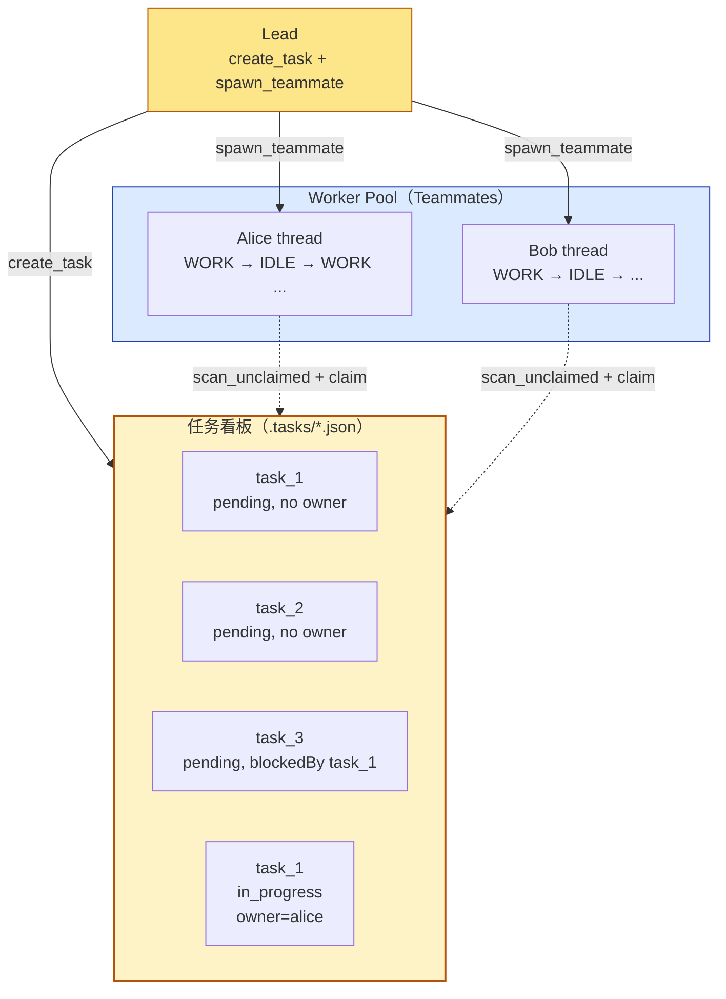
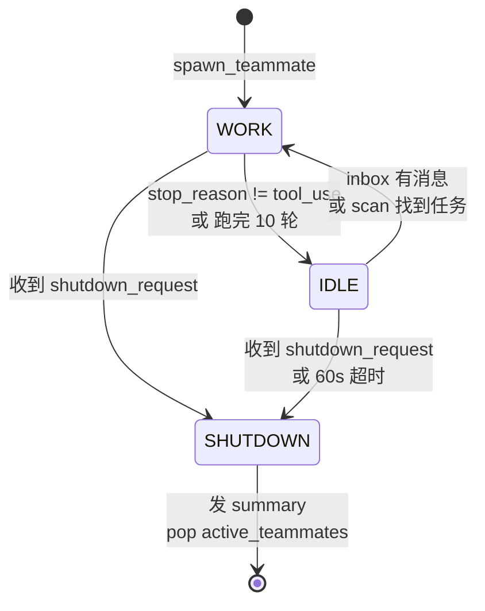
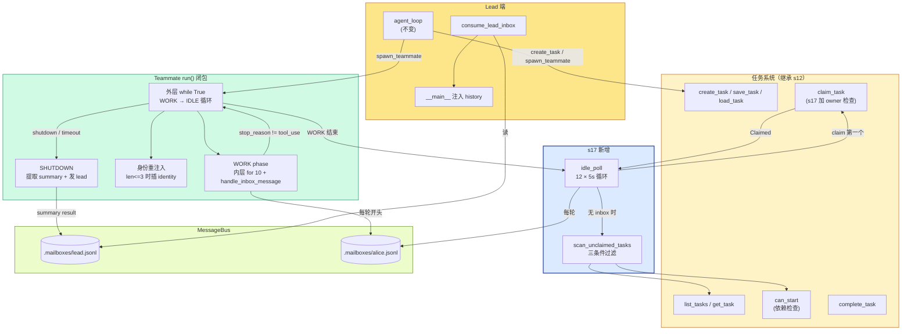
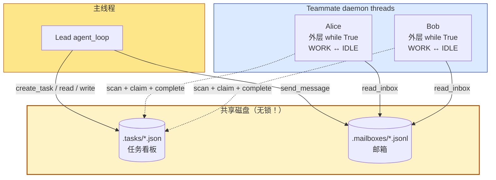

# 17 - Autonomous Agents

> [!note]
> s16 的 Teammate 已经是长寿命了——但**只能被动等活**：Lead 不发消息就永远挂在 idle。s17 给 Teammate 装上"自己看板自己认领"的能力——空闲时主动扫任务看板，发现 pending 且无人认领的任务就 claim，做完再找下一个，60 秒等不到新活才下班。Teammate 从"被动等指令"升级为"主动找活干"的自治 agent。Lead 只需要 `create_task` + `spawn_teammate`，剩下的事 Teammate 自己组织。

## 这一步加了什么

### 1. 两个新核心函数

```python
IDLE_POLL_INTERVAL = 5   # seconds
IDLE_TIMEOUT = 60         # seconds

def scan_unclaimed_tasks() -> list[dict]:
    """找 pending + 无 owner + 依赖已完成的任务"""
    unclaimed = []
    for f in sorted(TASKS_DIR.glob("task_*.json")):
        task = json.loads(f.read_text())
        if (task.get("status") == "pending"
                and not task.get("owner")
                and can_start(task["id"])):
            unclaimed.append(task)
    return unclaimed

def idle_poll(agent_name, messages, name, role) -> str:
    """Poll 60s. Return 'work' | 'shutdown' | 'timeout'."""
    for _ in range(IDLE_TIMEOUT // IDLE_POLL_INTERVAL):
        time.sleep(IDLE_POLL_INTERVAL)
        inbox = BUS.read_inbox(agent_name)
        if inbox:
            # shutdown_request → 回复 + 返回
            # 普通消息 → 注入 messages + 返回 "work"
        unclaimed = scan_unclaimed_tasks()
        if unclaimed:
            claim_task(unclaimed[0]["id"], agent_name)
            return "work"
    return "timeout"
```

### 2. claim_task 加 owner 检查（防并发覆盖）

```python
def claim_task(task_id, owner="agent") -> str:
    task = load_task(task_id)
    if task.status != "pending":
        return f"Task {task_id} is {task.status}, cannot claim"
    if task.owner:                              # ← s17 新增
        return f"Task {task_id} already owned by {task.owner}"
    if not can_start(task_id):
        return f"Cannot start — ..."
    task.owner = owner
    task.status = "in_progress"
    save_task(task)
    return f"Claimed {task.id} ({task.subject})"
```

s12 的 claim_task 只检查 status——两个 Teammate 同时调用，第二个会覆盖第一个的 owner。s17 加了 owner 检查，至少能拒绝"已经被认领"的任务（虽然仍有 TOCTOU 窗口）。

### 3. Teammate 生命周期：两阶段 → 三阶段

| 阶段 | s16 | s17 |
|---|---|---|
| WORK | 调 LLM + 工具循环 | 同 s16 |
| IDLE | 永远挂等消息（`while not shutdown_requested: sleep(1)`） | **60 秒轮询**，inbox 优先 + 任务板其次 |
| SHUTDOWN | shutdown_request 触发 | shutdown_request **或** 60s 超时触发 |

```python
# s16 的 idle：纯等待
while not shutdown_requested:
    time.sleep(1)
    inbox = BUS.read_inbox(name)
    if not inbox: continue
    ...

# s17 的 idle：主动找活
idle_result = idle_poll(name, messages, name, role)
if idle_result == "shutdown": break
if idle_result == "timeout": break
```

### 4. 外层 while True：WORK ↔ IDLE 交替

s17 的 run() 闭包多了一层外循环：

```python
while True:                                    # ← 外层（s17 新增）
    if len(messages) <= 3:                     # 身份重注入
        messages.insert(0, identity_msg)

    # WORK phase
    should_shutdown = False
    for _ in range(10):                        # ← 内层（s16 已有）
        ...LLM turn + tool dispatch...
        if response.stop_reason != "tool_use":
            break

    if should_shutdown: break

    # IDLE phase
    idle_result = idle_poll(...)                # ← s17 新增
    if idle_result in ("shutdown", "timeout"):
        break
```

**关键**：s16 是"WORK 一次 → IDLE 永远挂"，s17 是"WORK → IDLE → WORK → IDLE → ..."，每次 IDLE 找到新活就回 WORK 继续干。

### 5. 身份重注入（防压缩后失忆）

```python
if len(messages) <= 3:
    messages.insert(0, {"role": "user",
        "content": f"<identity>You are '{name}', role: {role}. "
                   f"Continue your work.</identity>"})
```

进入新的 WORK 阶段时检查 messages 长度——过短说明刚被压缩（s08 autoCompact），重新注入身份信息。真实 CC 的 context compaction 会保留 system prompt，教学版需要手动处理。

### 6. Teammate 工具集：5 → 8

s16：bash / read_file / write_file / send_message / submit_plan

s17 新增 3 个：
- `list_tasks`：看看板上有什么
- `claim_task`：主动认领
- `complete_task`：做完标记完成

这让 Teammate **自己**完成"看板 → 认领 → 完成"的闭环，不依赖 Lead 帮它认领。

## 为什么需要加

### 1. s16 的 Teammate 不能扩展

s16 的 Lead 必须手动分配每个任务：

```
Lead: send_message(alice, "做任务 A")
Lead: send_message(bob, "做任务 B")
Lead: send_message(alice, "做完 A 后做 C")
Lead: send_message(bob, "做完 B 后做 D")
...
```

**10 个未认领任务 = Lead 要 assign 10 次**。Lead 自己也是个 LLM，分配决策烧 token、容易出错、阻塞 Teammate 启动。

### 2. 任务之间有依赖（DAG）

```
A (无依赖) → C (blockedBy A)
B (无依赖) → D (blockedBy B)
            → E (blockedBy C, D)
```

Lead 要跟踪每个任务的状态、判断依赖是否解锁、决定下一个派给谁——**这是项目管理工作**，不该让 Lead LLM 做。

s17 把这个决策**下沉到 Teammate**：每个 Teammate 自己 `scan_unclaimed_tasks`，看到能干的（`can_start` 为真）就认领。

### 3. 需要并行效率

例子（README 的演示场景）：

```
Lead: create 3 tasks
Lead: spawn alice, spawn bob

alice 第 1 次 idle: 看到 task_1 → claim → WORK
bob  第 1 次 idle: 看到 task_2 → claim → WORK（同时）
alice 干完 task_1 → idle → 看到 task_3 → claim → WORK
bob  干完 task_2 → idle → 没活 → 60s timeout → SHUTDOWN
alice 干完 task_3 → idle → 没活 → 60s timeout → SHUTDOWN
```

两个 Teammate **并行**吃光了看板上的任务，Lead 完全不参与分配。

### 4. 需要"会下班的"Teammate

s16 的 Teammate 跑起来就**永远挂着**，除非 Lead 发 shutdown_request。如果 Lead 忘了发，Teammate 永远占着线程 + 每秒一次磁盘 I/O 轮询。

s17 加了 60s 超时——没活就自己退，资源自动释放。

## 这是一个什么机制

### "Worker Pool + Task Board" 模式



这跟分布式系统里的 **Worker Pool 模式**同构：

- **生产者**（Lead）：往看板丢任务。
- **消费者**（Teammates）：从看板取任务。
- **协调机制**：文件系统（共享状态）+ scan 函数（拉模式）。

CC 内部、Kubernetes 的 Job queue、Celery 的 task queue、Go 的 worker pool——都是这个模式。

### 三阶段状态机



跟 s16 对比：s16 的 IDLE 是"死循环等"，s17 的 IDLE 是"有限时找活"。

### idle_poll 的优先级：inbox > task board

```python
def idle_poll(agent_name, messages, name, role):
    for _ in range(60 // 5):                # 12 次
        time.sleep(5)
        inbox = BUS.read_inbox(agent_name)
        if inbox:
            # ① 协议消息（shutdown_request 等）
            # ② 普通消息 → 注入 messages，return "work"
            ...
            return ...

        # ③ 任务板
        unclaimed = scan_unclaimed_tasks()
        if unclaimed:
            claim_task(unclaimed[0]["id"], agent_name)
            return "work"

    return "timeout"
```

**为什么 inbox 优先**：inbox 里可能有 shutdown_request——这是**最高优先级**，不能被新任务"压住"。如果先看任务板，可能刚 claim 完任务就回 WORK，shutdown_request 还躺在 inbox 里。

inbox 优先保证**控制信令不被任务饿死**。

### auto-claim 的三个守卫

```python
def scan_unclaimed_tasks():
    for f in sorted(TASKS_DIR.glob("task_*.json")):
        task = json.loads(f.read_text())
        if (task.get("status") == "pending"           # ① 必须未开始
                and not task.get("owner")              # ② 必须无主
                and can_start(task["id"])):            # ③ 依赖必须完成
            unclaimed.append(task)
    return unclaimed
```

三个条件缺一不可。`can_start`（来自 s12）检查 `blockedBy` 列表里所有任务都 completed。

## 原本的 Claude Code 怎么做的

### 核心差异：1 个函数 vs 4 个机制

s17 教学版用**一个 `idle_poll()`** 干所有事——既轮询 inbox，又扫任务板，又处理 shutdown。

CC 拆成**4 个独立机制**，各干各的，组合起来达到同样效果但更灵敏、更省 CPU：

```
教学版:    idle_poll() = 一个函数包打全部

CC:        idle_notification  +  mailbox 轮询  +  task watcher  +  tryClaimNextTask
            （通知 Lead）       （看消息）       （看任务）         （认领）
```

### 四个机制分别做什么

#### 机制 1：idle_notification（通知 Lead）

CC 的 Teammate 完成一轮工作后，**主动发条消息给 Lead**："我闲了"（`inProcessRunner.ts:569-589`）。

```
alice 干完 task_1
  ↓
alice → BUS.send("lead", idle_notification)
  ↓
Lead LLM 看到："alice 闲了，要不要派新活？"
```

**用处**：让 Lead 知道谁可用。Lead 可以决定"派新任务 / 请求关机 / 不理"。

**为什么需要**：Lead 不能直接看到每个 Teammate 的状态——它只看自己的 inbox。Teammate 主动汇报，Lead 才能协调。

s17 的 idle_poll 是 **Teammate 自己决定**（拉模式），CC 是 **通知 Lead 决定**（推模式 + Lead 拉模式）。

#### 机制 2：mailbox 轮询（500ms）

CC 的 `waitForNextPromptOrShutdown()`（`inProcessRunner.ts:689-868`）是个 **500ms 轮询循环**——比 s17 的 5s 快 10 倍。检查三类来源：

- pending user messages
- mailbox 文件
- task list

shutdown_request 被优先处理（L768-804）——**协议消息不被普通消息饿死**。

**为什么 500ms 而不是事件驱动**：mailbox 是文件，跨进程文件事件通知（inotify / fs.watch）在不同 OS 行为不一致。**轮询是最可靠的兜底**。s17 用 5s 是为了演示清晰（少打日志）。

#### 机制 3：task watcher（事件驱动）

CC 用 `useTaskListWatcher`（`hooks/useTaskListWatcher.ts:34-189`）——基于 `fs.watch()` **监听 `.claude/tasks/` 目录变化**，**1 秒 debounce** 防抖，新任务创建或依赖解锁时立即触发检查。

```
Lead create_task("写测试") → 写 task_X.json
  ↓
fs.watch 触发事件 → task watcher 醒来
  ↓
task watcher: "有新任务！通知 Teammate 检查"
```

**对比教学版**：s17 的 `scan_unclaimed_tasks` 是**轮询**——5s 才发现一次。CC 是**事件**——任务一加就立即发现。

**类比**：
- s17 = 每 5 秒看一次公告板
- CC = 公告板有新内容就有人敲你门

**这是 s17 完全没实现的部分**——s17 是纯轮询，CC 是事件驱动 + 轮询兜底。事件驱动优势：低延迟、低 CPU；劣势：`fs.watch` 在不同 OS 行为不一致，需要 fallback。

#### 机制 4：tryClaimNextTask（主动认领）

CC 的 500ms 轮询循环内部也会调 `tryClaimNextTask()`（`inProcessRunner.ts:853-860`）——等待期间**主动从 task list 领取任务**。

```
while not shutdown:
    sleep(0.5)
    inbox = read_inbox()
    if inbox: 处理
    tryClaimNextTask()   # ← 顺便看一眼任务板
```

**为什么需要**：task watcher 是被动的——它通知"有新任务了"，但谁来认领？如果只靠 watcher 触发，多个 Teammate 同时醒来抢同一个任务。**轮询里加 tryClaim 是兜底**——保证每个 Teammate 都有机会主动认领。

所以 CC 是 **被动通知 + 主动认领** 双保险。

### 四个机制怎么配合（具体场景）

**场景**：Lead 加了 task_X，alice 和 bob 都闲着。

```
时刻 T0      Lead create_task("task_X") → 写 .claude/tasks/task_X.json

时刻 T0+10ms task watcher 的 fs.watch 触发（事件驱动，最快）
             debounce 1 秒（避免连续写触发多次）

时刻 T0+1s   debounce 结束，task watcher 检查任务列表
             发现 task_X 是新的 + 可认领 → 广播"任务板变化"信号

时刻 T0+1.5s alice 的 500ms 轮询醒来
             ├─ inbox 空
             └─ tryClaimNextTask() → scan → 发现 task_X → claim 成功！
             → 进入 WORK 阶段做 task_X

时刻 T0+2s   bob 的 500ms 轮询醒来
             ├─ inbox 空
             └─ tryClaimNextTask() → task_X 已是 alice 的 → 找不到可认领
             → 继续等待

时刻 T0+?    alice 干完 → 发 idle_notification 给 Lead
             Lead 收到："alice 又闲了"
```

**关键点**：

1. **task watcher** 负责快速感知任务变化（事件驱动，~1 秒延迟）
2. **mailbox 轮询** 负责看消息 + 调 tryClaimNextTask（500ms 节奏）
3. **tryClaimNextTask** 是真正的认领动作（在轮询循环里跑）
4. **idle_notification** 在 alice 真的闲了时通知 Lead（让 Lead 决策）

### 为什么拆 4 个而不是 1 个

| 维度 | 教学版（1 个函数） | CC（4 个机制） |
|---|---|---|
| 任务发现延迟 | 5s（最坏） | ~1s（task watcher 事件） |
| CPU 占用 | 5s 一次磁盘扫 | 500ms 一次轻量 inbox 读 + 事件驱动扫 |
| 多 Teammate 协调 | 靠 owner 检查（不安全） | 靠文件锁（安全） |
| Lead 感知 | 不主动通知 | idle_notification 主动通知 |
| 实现复杂度 | 一个函数 ~30 行 | 四个模块，数百行 |

**核心权衡**：教学版牺牲性能换简单（你看得懂），CC 用复杂度换性能和安全。

### 文件锁保证原子认领

CC 的 `claimTask()`（`utils/tasks.ts:541-612`）用 `proper-lockfile` 在锁内完成**读-检查-改-写**：

```typescript
async function claimTask(taskId, owner) {
  await lockfile.lock(taskPath)        // proper-lockfile
  try {
    const task = JSON.parse(read(taskPath))
    if (task.owner) throw "already owned"
    if (task.status === "completed") throw "completed"
    if (!depsCompleted(task)) throw "blocked"
    task.owner = owner
    task.status = "in_progress"
    write(taskPath, JSON.stringify(task))
  } finally {
    await lockfile.unlock(taskPath)
  }
}
```

杜绝 TOCTOU（Time of Check to Time of Use）竞态。

s17 教学版没锁——两个 Teammate 同时 scan 到同一个 task，第一个 claim 成功，第二个 `task.owner` 检查能拒绝（**部分防护**），但**两个同时跑到 save_task 之前的窗口**仍然存在。生产必须用文件锁。

CC 还有 `claimTaskWithBusyCheck()`（`utils/tasks.ts:614-692`）——task-list 级别锁，把"检查 owner 在不在 busy 状态"和"claim"做成原子操作，避免 TOCTOU。

### 6. 无固定超时

CC 的 Teammate **没有 60s 自动超时**——一直挂着等 Lead 决定。Lead 看 UI 上谁闲了，主动发 shutdown_request。

s17 的 60s 超时是**教学简化**，避免测试时挂一堆僵尸 Teammate。生产场景下"Lead 主动管理"更可控。

## 整体逻辑：函数之间的关系



### 调用关系详解

#### Teammate 的完整生命周期（s17 核心）

```
spawn_teammate("alice", "backend", "你是后端")
  ↓
spawn_teammate_thread:
  ├─ if name in active_teammates: return "already exists"
  ├─ active_teammates["alice"] = True
  ├─ Thread(target=run, daemon=True).start()       ← 异步起线程
  └─ return "spawned"

  ─── alice 的 daemon thread ───

run() 闭包:
  messages = [{"role":"user", "content": prompt}]

  while True:                                       ← 外层（WORK ↔ IDLE）
    # ① 身份重注入（防压缩后失忆）
    if len(messages) <= 3:
        messages.insert(0, identity_msg)

    # ② WORK phase
    should_shutdown = False
    for _ in range(10):
        inbox = BUS.read_inbox("alice")
        for msg in inbox:
            stopped = handle_inbox_message(...)
            if stopped: should_shutdown = True; break
        if should_shutdown: break

        response = client.messages.create(...)
        messages.append(response)
        if response.stop_reason != "tool_use":
            break                                   ← WORK 结束，去 IDLE
        dispatch tools（bash/read/write/list_tasks/claim_task/complete_task/...）

    if should_shutdown: break                       ← 去 SHUTDOWN

    # ③ IDLE phase
    idle_result = idle_poll("alice", messages, "alice", "backend")
    if idle_result == "shutdown": break
    if idle_result == "timeout": break

  # ④ SHUTDOWN
  summary = ... 挖最后一段 assistant text
  BUS.send("alice", "lead", summary, "result")
  active_teammates.pop("alice")
```

#### idle_poll 的内部循环

```
idle_poll("alice", messages, "alice", "backend"):
  for _ in range(12):                               ← 60s / 5s = 12 次
      time.sleep(5)
      inbox = BUS.read_inbox("alice")

      if inbox:
          for msg in inbox:
              if msg.type == "shutdown_request":
                  BUS.send("alice", "lead", "Shutting down",
                           "shutdown_response", {request_id, approve: True})
                  return "shutdown"
          # 普通 message（Lead 发的指令）
          messages.append({"role":"user",
              "content": f"<inbox>{json.dumps(inbox)}</inbox>"})
          return "work"                             ← 有消息回 WORK

      unclaimed = scan_unclaimed_tasks()
      if unclaimed:
          task = unclaimed[0]
          result = claim_task(task["id"], "alice")
          if "Claimed" in result:
              messages.append({"role":"user",
                  "content": f"<auto-claimed>...</auto-claimed>"})
              return "work"                         ← 领到任务回 WORK
          # claim 失败（被别人抢了）→ 继续循环

  return "timeout"                                  ← 60s 没活，下班
```

#### scan_unclaimed_tasks + claim_task 协作

```
scan_unclaimed_tasks:
  for f in sorted(TASKS_DIR.glob("task_*.json")):
      task = json.loads(f.read_text())
      if (task["status"] == "pending"
          and not task["owner"]
          and can_start(task["id"])):
          unclaimed.append(task)
  return unclaimed

claim_task(task_id, owner="alice"):
  task = load_task(task_id)
  if task.status != "pending": return "is {status}"
  if task.owner: return "already owned by {owner}"  ← 关键检查
  if not can_start(task_id): return "Cannot start"
  task.owner = "alice"
  task.status = "in_progress"
  save_task(task)
  return "Claimed ..."
```

**TOCTOU 窗口**：scan 看到 task 是可认领的 → claim 之前，另一个 Teammate 已经 claim 了。第二个 Teammate 调 claim_task 时，`task.owner` 检查能拒绝它——**这是部分防护**。但**两个 Teammate 同时进 claim_task 函数**（都过了 owner 检查、都没 save_task）的窗口仍然存在，最终一个覆盖另一个。生产用文件锁。

## 对 agent_loop 的影响

### 主 `agent_loop` 函数：**完全没动**

s17 的 `agent_loop` 跟 s16 / s15 / s14 一脉相承——while 循环 + 调 API + dispatch 工具。s17 的所有改动都在 **Teammate 的 run() 闭包**和**任务系统**里。

这是 Phase 5 一贯的模式：**主 agent_loop 是稳定的，所有扩展都发生在 Teammate 端或工具层**。

### `__main__`：跟 s16 一致

```python
agent_loop(history, context)
# 打印 assistant 文本
inbox = consume_lead_inbox(route_protocol=True)
if inbox:
    history.append({"role": "user", "content": f"[Inbox]\n..."})
```

没变化。Lead 端的协议路由 + inbox 注入逻辑在 s16 已经定型。

### 真正的扩展：Teammate 的 run() 闭包结构变化

| 维度 | s16 | s17 |
|---|---|---|
| 循环结构 | 单层 `while not shutdown_requested` | **双层**：外层 `while True` + 内层 `for 10` |
| WORK → IDLE 触发 | stop_reason != tool_use → 进 idle wait | stop_reason != tool_use → 调 idle_poll |
| IDLE 行为 | 死循环 `sleep(1) + read_inbox` | 60s 限时轮询，找活回 WORK |
| IDLE 内部任务认领 | 不做 | `scan_unclaimed_tasks + claim_task` |
| 退出条件 | shutdown_request | shutdown_request / 60s timeout |
| 身份保持 | 仅 system prompt | messages 过短自动重注入 |
| 工具集 | 5 个 | 8 个（+ list_tasks / claim_task / complete_task） |

### 三阶段 vs s16 的两阶段

```
s16:    WORK → IDLE（永远） → SHUTDOWN
s17:    WORK → IDLE → WORK → IDLE → ... → SHUTDOWN
                ↑                ↑
            找到活回 WORK    60s 没活或收到 shutdown
```

**关键变化**：s16 的 IDLE 是终态（除非 shutdown），s17 的 IDLE 是**中间态**——找到活就回 WORK 继续干。这让 Teammate 真正变成"多任务工人"而非"一次性 Worker"。

### 总结：Phase 5 的扩展脉络

| 课 | Teammate 能力 | 扩展位置 |
|---|---|---|
| s15 | 长期共存 + 异步消息 | 引入 daemon thread + MessageBus |
| s16 | 协议通信 + idle loop | run() 加协议分发 + 内嵌 idle wait |
| s17 | **自治（自己看板自己认领）** | run() 加外层 while + idle_poll |

s17 是 Phase 5 的"集大成"——Teammate 既有长期共存（s15）、又有协议通信（s16）、还能主动找活（s17）。下一课 s18 解决"多 Teammate 同目录工作互相覆盖文件"的问题。

## 多线程并行情况

s17 跟 s16 的线程结构**完全一样**——主线程 + scheduler（如果继承 s14）+ queue processor + 若干 Teammate daemon thread。



### 关键变化：任务看板成热点

s16 之前，任务看板（`.tasks/`）只有 Lead 在读写。s17 起，**每个 Teammate 都在频繁 scan + claim + complete**——N 个 Teammate = N 次/5 秒的磁盘扫描。

#### 并发风险 1：认领竞争

```
时间 T0: alice scan → 看到 task_1 可认领
时间 T0: bob   scan → 看到 task_1 可认领（同时！）
时间 T1: alice claim_task(task_1) → owner=alice, status=in_progress, save
时间 T1: bob   claim_task(task_1) → load_task → 看到 owner=alice → return "already owned"
```

**owner 检查能挡住顺序到达的情况**（如上）。但如果 alice 和 bob **同时**进 claim_task：

```
T0: alice load_task(task_1) → owner=None
T0: bob   load_task(task_1) → owner=None（alice 还没 save）
T1: alice 检查 if task.owner → None，通过
T1: bob   检查 if task.owner → None，通过
T2: alice task.owner="alice"; save_task
T2: bob   task.owner="bob"; save_task   ← 覆盖！
```

**结果**：task 的 owner 最终是 bob，但 alice 以为自己拥有它，**两个 Teammate 都在做同一个 task**。

这就是经典的 **TOCTOU（Time of Check to Time of Use）** 竞态。教学版靠"实际并发概率低"蒙混过关，生产必须用文件锁（CC 的 `proper-lockfile`）。

#### 并发风险 2：scan 看到陈旧数据

alice 刚 complete_task(task_1)（status=completed），bob 的 scan 已经在 read 文件之前打开了句柄——可能读到旧的 pending 状态。**POSIX 文件读写通常没这个问题**（原子 rename），但教学版的 `f.write_text` 不是原子写。

生产实现要写 `.tmp` 文件 + rename（atomic on POSIX）。

#### 并发风险 3：scan 性能

```python
for f in sorted(TASKS_DIR.glob("task_*.json")):
    task = json.loads(f.read_text())
    ...
    can_start(task["id"])  # ← 内部又 load_task 每个 blockedBy
```

`scan_unclaimed_tasks` 对每个 task 调 `can_start`，`can_start` 又对每个 blockedBy 调 `load_task`——**O(N×M)** 的磁盘读。100 个 task、每个 5 个依赖 = 500 次磁盘读。

N 个 Teammate 每 5s 扫一次 = **100×500/5 = 10000 次/秒** 的磁盘读。生产要做缓存 + 事件驱动（`fs.watch`）。

### 跟 s16 对比：线程行为不变，磁盘压力增加

- **线程数**：s16 和 s17 一样（Teammate daemon thread 数 = active_teammates 大小）
- **磁盘 I/O**：s17 显著增加（scan_unclaimed_tasks 每 5s 跑一次 × N 个 Teammate）
- **API 调用**：s17 可能更少（IDLE 阶段不调 API，比 s16 的"每秒轮询 inbox 但 idle 不调 API"略好——但找活回 WORK 后又会调）

## 设计要点

### 1. 60s 超时：避免僵尸 Teammate

```python
IDLE_TIMEOUT = 60

for _ in range(IDLE_TIMEOUT // IDLE_POLL_INTERVAL):
    ...
return "timeout"
```

没活干自己退，不占线程。s16 没这个，容易留僵尸。

**为什么是 60 秒**：足够长（Lead 有时间派新活）+ 足够短（不会挂太久）。教学值，生产看场景——长任务系统可能用 10 分钟，交互式可能 30 秒。

### 2. inbox 优先于任务板

```python
inbox = BUS.read_inbox(agent_name)
if inbox:
    ...
    return "work"  # 或 "shutdown"

unclaimed = scan_unclaimed_tasks()
if unclaimed:
    ...
```

**协议消息 > 普通消息 > 任务**。shutdown_request 一定要先处理，否则 Teammate 会被新任务压住，永远关不掉。

### 3. auto-claim 的返回值检查

```python
result = claim_task(task["id"], agent_name)
if "Claimed" in result:        # ← 字符串匹配
    messages.append(...)
    return "work"
print(f"claim failed: {result}")
# 失败继续循环
```

claim 可能失败（被别人抢了 / 状态变了）。**失败不退出，继续轮询**——下一轮可能找到别的任务。

**字符串匹配不优雅**——生产实现要返回枚举或结构体（`ClaimResult.SUCCESS / ALREADY_OWNED / BLOCKED`）。

### 4. 身份重注入：简单粗暴的压缩检测

```python
if len(messages) <= 3:
    messages.insert(0, identity_msg)
```

`<= 3` 是个 magic number——意味着 messages 几乎被压缩光了（正常状态至少有 prompt + 几轮对话）。注入 identity 让 LLM 知道"你是谁、在干什么"。

**为什么不在 system prompt 里**：system prompt 在压缩后保留，但教学版可能把它一起压了。注入 messages 是双保险。

CC 的真实做法是 context compaction 保留 system prompt（`autoCompact` 算法不碰 system），不需要手动注入。

### 5. 外层 while True 没有显式退出条件

```python
while True:
    ...
    if should_shutdown: break
    idle_result = idle_poll(...)
    if idle_result in ("shutdown", "timeout"): break
```

退出靠两个 break。**容易漏掉某个分支导致死循环**——比如 idle_poll 返回未预期的值（教学版不会，但生产代码里可能）。

更安全的写法：

```python
running = True
while running:
    ...
    if should_shutdown: running = False
    else:
        result = idle_poll(...)
        if result in ("shutdown", "timeout"): running = False
```

显式状态变量比 `while True + break` 更可读。

### 6.OWNER 检查只是部分防护

```python
if task.owner:
    return f"Task {task_id} already owned by {task.owner}"
```

挡住"顺序到达"的竞争，挡不住"同时进入函数"的竞争。**教学版的诚实**——README 明说"教学版没有文件锁，并发认领可能出现竞争"。

生产必须用文件锁（CC 的 `proper-lockfile`）。

## 实现对照（s17/code.py）

### scan_unclaimed_tasks

```python
IDLE_POLL_INTERVAL = 5
IDLE_TIMEOUT = 60

def scan_unclaimed_tasks() -> list[dict]:
    unclaimed = []
    for f in sorted(TASKS_DIR.glob("task_*.json")):
        task = json.loads(f.read_text())
        if (task.get("status") == "pending"
                and not task.get("owner")
                and can_start(task["id"])):
            unclaimed.append(task)
    return unclaimed
```

`sorted` 保证 Teammate 之间看任务的顺序一致——大家都会先认领 task_001 而不是各挑各的（虽然仍可能竞争同一个）。

### idle_poll

```python
def idle_poll(agent_name, messages, name, role) -> str:
    for _ in range(IDLE_TIMEOUT // IDLE_POLL_INTERVAL):
        time.sleep(IDLE_POLL_INTERVAL)

        inbox = BUS.read_inbox(agent_name)
        if inbox:
            for msg in inbox:
                if msg.get("type") == "shutdown_request":
                    req_id = msg.get("metadata", {}).get("request_id", "")
                    BUS.send(name, "lead", "Shutting down gracefully.",
                             "shutdown_response",
                             {"request_id": req_id, "approve": True})
                    return "shutdown"
            messages.append({"role": "user",
                "content": "<inbox>" + json.dumps(inbox) + "</inbox>"})
            return "work"

        unclaimed = scan_unclaimed_tasks()
        if unclaimed:
            task = unclaimed[0]
            result = claim_task(task["id"], agent_name)
            if "Claimed" in result:
                messages.append({"role": "user",
                    "content": f"<auto-claimed>Task {task['id']}: "
                               f"{task['subject']}</auto-claimed>"})
                return "work"

    return "timeout"
```

注意普通消息**没分协议/非协议**——直接 json.dumps 整个 inbox 注入。比 s16 的分流简单，但意味着 plan_approval_request 等也会原样进 LLM 上下文。

### claim_task 加 owner 检查

```python
def claim_task(task_id, owner="agent") -> str:
    task = load_task(task_id)
    if task.status != "pending":
        return f"Task {task_id} is {task.status}, cannot claim"
    if task.owner:                                    # ← s17 新增
        return f"Task {task_id} already owned by {task.owner}"
    if not can_start(task_id):
        deps = [d for d in task.blockedBy
                if _task_path(d).exists() and load_task(d).status != "completed"]
        missing = [d for d in task.blockedBy if not _task_path(d).exists()]
        parts = []
        if deps: parts.append(f"blocked by: {deps}")
        if missing: parts.append(f"missing deps: {missing}")
        return "Cannot start — " + ", ".join(parts)
    task.owner = owner
    task.status = "in_progress"
    save_task(task)
    return f"Claimed {task.id} ({task.subject})"
```

注意 `deps` 计算有个小 bug——`_task_path(d).exists() and load_task(d).status != "completed"`：如果 dep 不存在，`and` 短路，不会算进 deps；但**会被算进 missing**。这是教学版的小细节，不影响功能。

### run() 闭包的外层结构

```python
def run():
    messages = [{"role": "user", "content": prompt}]
    sub_tools = [...]  # 8 个工具
    sub_handlers = {...}

    while True:                                       # ← 外层
        if len(messages) <= 3:                        # 身份重注入
            messages.insert(0, {"role": "user",
                "content": f"<identity>You are '{name}', role: {role}. "
                           f"Continue your work.</identity>"})

        should_shutdown = False
        for _ in range(10):                           # WORK phase
            inbox = BUS.read_inbox(name)
            for msg in inbox:
                stopped = handle_inbox_message(name, msg, messages)
                if stopped:
                    should_shutdown = True
                    break
            if should_shutdown: break
            if inbox and not should_shutdown:
                non_protocol = [m for m in inbox if m.get("type") == "message"]
                if non_protocol:
                    messages.append({"role": "user",
                        "content": f"<inbox>{json.dumps(non_protocol)}</inbox>"})

            try:
                response = client.messages.create(...)
            except Exception:
                break
            messages.append({"role": "assistant", "content": response.content})
            if response.stop_reason != "tool_use":
                break                                 # WORK 结束
            results = []
            for block in response.content:
                if block.type == "tool_use":
                    handler = sub_handlers.get(block.name)
                    output = handler(**block.input) if handler else "Unknown"
                    results.append({"type": "tool_result",
                                    "tool_use_id": block.id,
                                    "content": str(output)})
            messages.append({"role": "user", "content": results})

        if should_shutdown: break

        idle_result = idle_poll(name, messages, name, role)
        if idle_result == "shutdown": break
        if idle_result == "timeout": break

    # SHUTDOWN 收尾
    summary = "Done."
    for msg in reversed(messages):
        if msg["role"] == "assistant" and isinstance(msg["content"], list):
            for b in msg["content"]:
                if getattr(b, "type", None) == "text":
                    summary = b.text
                    break
            else:
                continue
            break
    BUS.send(name, "lead", summary, "result")
    active_teammates.pop(name, None)
```

### Teammate 工具集扩展

```python
# s17 新增的三个工具
{"name": "list_tasks",
 "description": "List all tasks on the board.",
 "input_schema": {"type": "object", "properties": {}, "required": []}},
{"name": "claim_task",
 "description": "Claim a pending task.",
 "input_schema": {"type": "object",
                  "properties": {"task_id": {"type": "string"}},
                  "required": ["task_id"]}},
{"name": "complete_task",
 "description": "Mark an in-progress task as completed.",
 "input_schema": {"type": "object",
                  "properties": {"task_id": {"type": "string"}},
                  "required": ["task_id"]}},
```

sub_handlers 对应：

```python
"list_tasks": _run_list_tasks,
"claim_task": _run_claim_task,         # 自动用 teammate name 作为 owner
"complete_task": _run_complete_task,
```

`_run_claim_task` 是个闭包，把外层 `name` 绑定为 owner——Teammate 调用时不需要传 owner 参数。

## 相关概念

- [[16 - Team Protocols]]：s17 在 s16 的协议基础上加自治能力
- [[15 - Agent Teams]]：s17 复用 s15 的 MessageBus + daemon thread 基础设施
- [[12 - Task System]]：s17 让 Teammate 直接读写任务看板，task 系统成为协调中介
- [[14 - Cron Scheduler]]：s14 的双重检查锁定模式，s17 的 claim_task 是简化版（只有 check，没有 lock）
- [[08 - Context Compact]]：s17 的身份重注入是 autoCompact 的下游补救
- [[13 - Background Tasks]]：Teammate 本身就是长寿命的 background worker

> [!warning]
> 几个容易踩的坑：
>
> 1. **以为 claim_task 是原子的**：不是。owner 检查只能挡顺序竞争，挡不住并发竞争。生产要用文件锁。
> 2. **scan_unclaimed_tasks 的性能**：O(N×M) 磁盘读，N 个 Teammate 每 5s 跑一次——任务多时磁盘压力很大。生产要缓存 + 事件驱动。
> 3. **60s 超时是教学值**：生产场景下任务可能有依赖链，60s 不够等前置完成。要根据业务调整。
> 4. **身份重注入的 `<= 3` 是 magic number**：依赖具体压缩行为。压缩算法变了就失效。
> 5. **idle_poll 不分协议/普通消息**：所有 inbox 消息（包括 plan_approval_request）都被 json.dumps 注入 messages。LLM 会看到协议消息原文，可能误判。
> 6. **claim 失败时静默重试**：claim_task 返回非 "Claimed" 字符串时，idle_poll 只是打日志继续循环。Teammate 可能反复扫到同一个被认领的任务，浪费 5s × 12 次。
> 7. **scan 的 sorted 不能防竞争**：只是保证所有 Teammate 看任务顺序一致——大家都会先抢 task_001。要真正防竞争得用锁。
> 8. **`active_teammates` 在超时退出时 pop**：如果 idle_poll 异常退出（没走完整 try），名字永远占用。生产要加 finally。

## Q&A

### Q1: s17 的 idle_poll 跟 s16 的 idle wait 有什么本质区别

**A**：**主动找活 vs 被动等活**。

s16 的 idle wait：

```python
while not shutdown_requested:
    time.sleep(1)
    inbox = BUS.read_inbox(name)
    if not inbox: continue
    ...
```

只看 inbox。inbox 空就一直 sleep——**永远不主动找活**。Lead 不发消息就永远挂着。

s17 的 idle_poll：

```python
for _ in range(60 // 5):
    time.sleep(5)
    inbox = BUS.read_inbox(agent_name)
    if inbox: ...
    unclaimed = scan_unclaimed_tasks()        # ← 关键差别
    if unclaimed:
        claim_task(unclaimed[0]["id"], agent_name)
        return "work"
return "timeout"
```

**除了看 inbox，还看任务看板**。没消息但任务板上有活就自己认领。

类比：s16 是"等电话"——你不打过来我不动。s17 是"看公告板"——没人找我我就自己看有没有事做。

第二个差别：**s17 有超时**（60s 没活就下班），s16 没有（永远挂）。

### Q2: 为什么 inbox 优先于任务板

**A**：因为**协议消息的优先级高于任务**。

最常见的场景：Lead 想让 Teammate 关掉。

```
T0: Lead 在看板上加了 task_X
T0: Lead 决定让 alice 下班 → 发 shutdown_request
T1: alice idle_poll → 同时看到 task_X 和 shutdown_request
```

如果 task_X 先处理，alice 会 claim → 回 WORK → 干活 → 完成后才进下一轮 idle → 才看到 shutdown_request。**关机被任务延迟**。

inbox 优先保证 shutdown_request 立即响应：

```python
inbox = BUS.read_inbox(agent_name)
if inbox:
    for msg in inbox:
        if msg.get("type") == "shutdown_request":
            # 立即回复 + 返回 "shutdown"
            return "shutdown"
    ...
```

任务板只在没有 inbox 消息时才扫——控制信令永远先处理。

**原则**：紧急消息 > 普通消息 > 任务。这是所有消息队列设计的基本原则。

### Q3: claim_task 的 owner 检查能防住并发竞争吗

**A**：**只能防顺序竞争，防不住并发竞争**。

#### 能防的情况（顺序到达）

```
T0: alice scan → 看到 task_1 可认领
T1: alice claim_task → load → owner=None → 通过 → save owner=alice
T2: bob   scan → 看到 task_1（refresh 后是 alice 的，scan 应该跳过）
    或者 bob scan 用的旧数据 → 看到 task_1 似乎可认领
T3: bob   claim_task → load → owner=alice → 返回 "already owned"
```

`task.owner` 检查挡住了 bob——他拿到错误消息，不会覆盖。

#### 防不住的情况（并发进入）

```
T0: alice scan → 看到 task_1 可认领
T0: bob   scan → 看到 task_1 可认领（同时！）
T1: alice claim_task → load → owner=None
T1: bob   claim_task → load → owner=None（alice 还没 save）
T2: alice if task.owner: 检查通过
T2: bob   if task.owner: 检查通过
T3: alice task.owner="alice"; save_task
T3: bob   task.owner="bob"; save_task   ← 覆盖 alice！
```

**结果**：task 最终 owner=bob，但 alice 以为是自己认领的。两个 Teammate 同时做同一个任务——浪费 + 可能产出冲突。

这是经典的 **TOCTOU（Time of Check to Time of Use）** 竞态。教学版靠"实际并发概率低"（alice 和 bob 必须在微秒级内同时进 claim_task）蒙混。生产实现必须用文件锁：

```python
def claim_task(task_id, owner):
    with file_lock(task_id):           # proper-lockfile
        task = load_task(task_id)
        if task.owner: return "already owned"
        task.owner = owner
        save_task(task)
```

锁内完成**读-检查-改-写**，杜绝窗口。

### Q4: 身份重注入的 `len(messages) <= 3` 是什么意思

**A**：检测 messages 是否被压缩过。

```python
if len(messages) <= 3:
    messages.insert(0, {"role": "user",
        "content": f"<identity>You are '{name}', role: {role}. "
                   f"Continue your work.</identity>"})
```

正常状态下，Teammate 跑了多轮 WORK，messages 应该有几十条。**只有 3 条或更少**意味着：

1. 刚启动（只有初始 prompt）——这时不需要重注入，但注入也无害。
2. **刚被 autoCompact 压缩**（s08 的能力，把长 history 压成短摘要）。

为什么要重注入：压缩算法可能丢掉了"你是 alice"这种身份信息，LLM 不知道自己是谁。重注入保证身份始终在上下文里。

**为什么是 3 不是 0**：压缩后通常保留"摘要 + 最近 1-2 条"，所以 <= 3 是合理阈值。

**教学简化**：真实 CC 的 autoCompact **保留 system prompt**（不压缩），身份信息在 system prompt 里，不需要手动注入。教学版可能没正确处理 system prompt 的压缩，所以用这个 hack 补救。

`magic number` 的代价：阈值依赖具体压缩行为——压缩算法变了（比如改成保留 5 条）就要调阈值。生产实现应该用更鲁棒的信号（比如压缩标志位）。

### Q5: Teammate 工具集从 5 个加到 8 个，Lead 工具数不变

**A**：正确——这是设计意图。

**Lead 工具集（14 个，不变）**：bash / read_file / write_file / create_task / list_tasks / get_task / claim_task / complete_task / spawn_teammate / send_message / check_inbox / request_shutdown / request_plan / review_plan

**Teammate 工具集（5 → 8）**：bash / read_file / write_file / send_message / submit_plan **+ list_tasks + claim_task + complete_task**

Lead 已经有 list_tasks / claim_task / complete_task——它**当然能**自己看板和认领。但**设计意图是 Lead 不该做这事**：

- Lead 是协调者，分配任务。
- Teammate 是执行者，认领任务。

让 Teammate 也有这三个工具，**就是把"认领"这个动作从 Lead 下放到 Teammate**。Lead 仍然可以用（比如手动预分配某些关键任务给特定 Teammate），但常规流程是 Teammate 自己认领。

**注意**：Teammate 的工具集**没有** `create_task` / `get_task` / `request_plan` / `review_plan`——它不能创建任务（这是 Lead 的权力），也不能发起协议审批。

### Q6: idle_poll 找到活就 return "work"，那 WORK 阶段怎么知道是新任务还是接续旧任务

**A**：靠**注入 messages 的标记**。

```python
# idle_poll 里
messages.append({"role": "user",
    "content": f"<auto-claimed>Task {task['id']}: "
               f"{task['subject']}</auto-claimed>"})
return "work"
```

回 WORK 后，LLM 看到 messages 末尾有 `<auto-claimed>` 标签，知道"我刚自动认领了 task_X"。LLM 会基于这个上下文决定下一步——通常是 `get_task(task_id)` 看详情，然后开干。

**LLM 怎么知道要这么做**：靠 system prompt 引导。s17 的 system prompt：

```python
system = (f"You are '{name}', a {role}. "
          f"Use tools to complete tasks. "
          f"You can list and claim tasks from the board. "
          f"Check inbox for protocol messages.")
```

提示了"你能 list / claim tasks"。LLM 看到 `<auto-claimed>` 标签会自然联想到"我认领了任务，需要做"。

**没有强保证**：LLM 可能忽略 `<auto-claimed>` 标签直接说"我做完了"——这是君子协定。生产实现可能用更强的 prompt 或在代码层强制（比如 stop_reason 检查）。

### Q7: 如果所有 Teammate 同时 scan 同一个任务怎么办

**A**：**部分防护 + 实际场景下很少发生**。

教学版靠两层防护：

1. **owner 检查**：第一个 claim 成功后，后续的 claim_task 会被 `task.owner` 拒绝。
2. **5 秒错峰**：Teammate 启动时间不同，idle_poll 进入时刻不同——同时扫到的概率不高。

但如果真的同时（N 个 Teammate 同时启动 + 同时进第一次 idle_poll）：

```
T0: alice, bob, carol 同时 scan → 都看到 task_1
T1: 三人同时 claim_task(task_1)
T2: load 都看到 owner=None
T3: 三人都通过 owner 检查
T4: 三人 save_task → 最后一个覆盖前两个
```

最终 owner 是最后 save 的那个（比如 carol），但 alice 和 bob 以为自己拥有 task_1——三人同时做。

**教学版的诚实**：README 明说"教学版没有文件锁，并发认领可能出现竞争"。CC 用 `proper-lockfile` 保证原子性。

实际测试场景下（2-3 个 Teammate，启动间隔几秒），这个问题几乎不会出现。生产场景（数十个 Teammate 同时启动）必须解决。

### Q8: Teammate 超时退出和 shutdown_request 退出有什么区别

**A**：**触发方不同，但收尾一样**。

#### shutdown_request（被动退出）

Lead 主动发起：

```
Lead: request_shutdown("alice")
  → send shutdown_request 到 alice 的 inbox
alice idle_poll: 看到 shutdown_request
  → send shutdown_response 回 Lead
  → return "shutdown"
alice run() 退出循环 → 走收尾
```

**特点**：Lead 有明确意图让 alice 退出，alice 同意（自动 approve=True）。

#### timeout（主动退出）

alice 自己决定：

```
alice idle_poll: 60 秒没找到活
  → return "timeout"
alice run() 退出循环 → 走收尾
```

**特点**：Lead 没说让 alice 退，alice 自己觉得"没事干我走了"。

#### 共同的收尾

不管哪种触发，都走同一段：

```python
# SHUTDOWN
summary = ... 挖最后一段 assistant text
BUS.send(name, "lead", summary, "result")
active_teammates.pop(name, None)
```

发 summary 给 Lead，释放名字占用。

**区别**：shutdown 协议 Lead 知道 alice 同意了（收到 shutdown_response）；timeout Lead 不知道 alice 退了——直到下次 drain inbox 看到 summary result 才发现"alice 已经退了"。

生产实现里，timeout 也应该通知 Lead——发个 `idle_timeout_notification` 让 Lead 知道。教学版省了。
