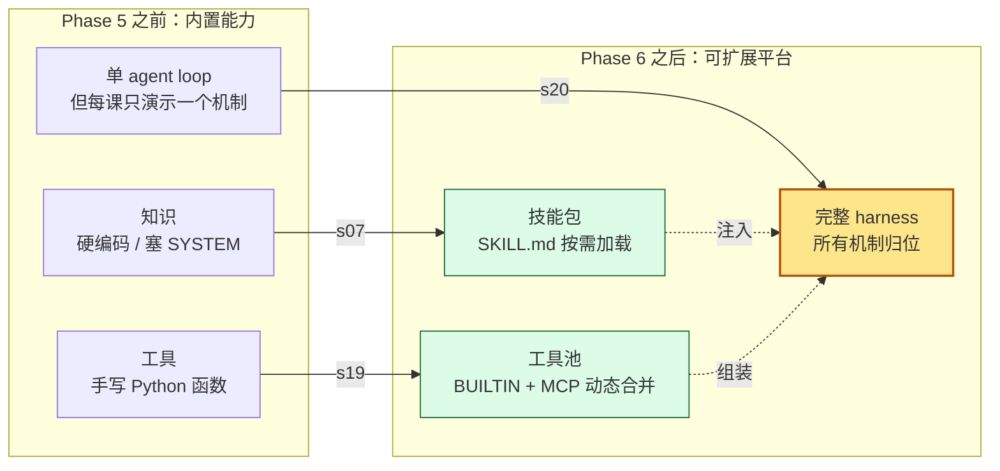
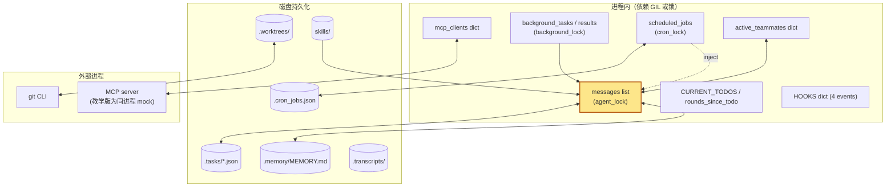

# Phase 6 综合总结 --- 扩展与组装

> [!note]
> Phase 1 让 Agent 能跑，Phase 2 让它能跑长任务，Phase 3 让它能跨会话连续，Phase 4 让它能跑后台/定时任务，Phase 5 让多个 Agent 协作。但**所有这些机制都是"内置"的**——能力由项目代码定义，加一个能力要改源码。Phase 6 的三课合起来回答：**"Agent 怎么扩展能力？怎么把所有扩展装回同一个可运行的 harness？"** 两个答案：**纵向扩展**——加知识包（s07 Skill Loading）；**横向扩展**——接外部工具生态（s19 MCP Plugin）；**最后归位**——把 s01-s19 全部装回同一个 `agent_loop`（s20 Comprehensive Agent）。共同主题：**Agent 不再是"被扩展"，而是"能扩展"**。

## 为什么 Phase 6 是"扩展与组装"

Phase 1-5 的 Agent 有三个"扩展性"瓶颈：

1. **知识是硬编码的**。所有规范、风格指南、领域知识要么塞 SYSTEM prompt（贵），要么不存在。要让 Agent 学新东西，得改代码或塞死文档。
2. **工具是手写的**。bash / read / write / task / worktree……每个工具都是项目代码里的 Python 函数。要让 Agent 调一个新工具（搜 GitHub / 发邮件 / 查 Linear），得改源码加 handler。
3. **学完每一课后没"全景图"**。s01-s18 + s19 每课加一个机制，但真实 Agent 不会只带一个机制跑。需要一个章节把所有零件装回同一个 harness，证明它们能共存。

Phase 6 解决这三件事：

| 课 | 解决什么 | 机制 |
|---|---|---|
| s07 Skill Loading | 知识包按需加载，不爆 SYSTEM | 两级加载（catalog 常驻 + 内容按需）+ SKILL.md manifest |
| s19 MCP Plugin | 外部工具生态接入，不动源码 | MCPClient + connect_mcp + assemble_tool_pool + `mcp__server__tool` 命名空间 |
| s20 Comprehensive Agent | 把所有机制装回同一个循环 | 27 工具 + 4 hook + RecoveryState + 四级压缩 + 后台 + cron + team + worktree + MCP |

三者机制不同，但**共同把 Agent 从"内置能力的封闭系统"扩展为"可扩展的开放平台"**。

## 每一步加了什么、为什么加

### s07 --- Skill Loading

| 维度 | 内容 |
|---|---|
| 加了什么 | `skills/` 目录 + 每个技能的 `SKILL.md`（YAML frontmatter）+ `SKILL_REGISTRY` dict + `_scan_skills()` 启动扫描 + `_parse_frontmatter()` + `list_skills()` 生成 catalog + `build_system()` 把 catalog 注入 SYSTEM + `load_skill(name)` 工具按需返回完整内容 |
| 为什么 | 全塞 SYSTEM 等于永远为无关内容付费；要让 Agent 学新东西得改代码；项目规范会越来越多 |
| 这是什么机制 | **Two-Tier Knowledge Loading + Manifest Pattern**——便宜层（catalog 常驻 SYSTEM）+ 贵层（完整内容按需 tool_result）；和 [[09 - Memory]] 的"索引 + 内容"同构 |
| Claude Code 怎么做 | 同样的两级加载；SKILL.md frontmatter 有 `name` / `description` / `allowed-tools`；渐进式披露（progressive disclosure）——catalog → full content → nested skills |

**关键贡献**：第一次让 Agent 拥有"**会自己挑文档读**"的能力——而不是把所有文档塞 SYSTEM。

### s19 --- MCP Plugin

| 维度 | 内容 |
|---|---|
| 加了什么 | `MCPClient` 类（模拟 server 代理）+ 两个 mock server（docs / deploy）+ `normalize_mcp_name` 命名空间清洗 + `connect_mcp` Lead 工具（写 `mcp_clients` dict）+ `assemble_tool_pool` 核心合并函数（BUILTIN + MCP 工具）+ `mcp__server__tool` 三段命名空间 + system prompt 显示已连接 server + agent_loop 每轮重组工具池（去掉 prompt cache）+ lambda 默认参数捕获 closure 变量 |
| 为什么 | 工具是手写的——加新能力要改源码；不同 Agent / IDE 之间没有工具复用标准；外部服务（GitHub / Slack / Linear）的语言和进程都不同 |
| 这是什么机制 | **Model Context Protocol**——发现工具（`tools/list`）+ 调用工具（`tools/call`）+ 命名空间隔离（`mcp__server__tool`）+ 工具池动态组装（mark change + next loop iteration） |
| Claude Code 怎么做 | 6 种 transport（stdio / sse / http / ws / sse-ide / sdk）+ OAuth 2.0 + PKCE + channel notifications（server → agent 反向）+ 5 层 config 优先级 + tool annotations（结构化，非文本）+ sub-agent 继承 MCP config |

**关键贡献**：第一次让 Agent "**被外部扩展**"——只要 MCP server 实现 `tools/list` + `tools/call`，无论它跑在哪台机器、用什么语言写，Agent 都能用。

### s20 --- Comprehensive Agent

| 维度 | 内容 |
|---|---|
| 加了什么 | **没有新机制**。把 s01-s19 的所有零件装回同一个 `agent_loop`：27 个工具 + 4 个 hook + RecoveryState + 四级压缩（tool_result_budget → snip → micro → compact_history）+ reactive_compact + with_retry + background dispatch + cron daemon + team protocols + worktree binding + assemble_tool_pool |
| 为什么 | 教学的代价是孤立——s05 单独讲 todo 时没 hooks、s13 单独讲 background 时没 team；真实 Agent 必须同时拥有全部；需要一个章节证明它们能共存 |
| 这是什么机制 | **归位（integration）**——每个零件按"循环时间轴"重新组织，互不打架；流水线（pipeline）模式；每个工位单一职责（SRP） |
| Claude Code 怎么做 | CC 就是 s20 的产品化形态——核心结构（while True + tool_use + dispatch）完全一样，但工程深度大得多：工具模块化、hooks 配置化、permission RBAC、压缩质量评估、6 种 MCP transport、AgentTool 多类型、proper-lockfile、IDE 集成 |

**关键贡献**：证明 **s01-s19 的所有机制可以共存且不冲突**——循环骨架本身从 s01 到 s20 基本不变。

## 三课的统一逻辑：Agent 从"被扩展"到"能扩展"



三课对应三种"扩展方向"：

- **s07 纵向扩展（深度）**：让 Agent 在**已有工具**（read_file）的基础上，按需加载**更多知识**（SKILL.md）。
- **s19 横向扩展（广度）**：让 Agent 接入**新的工具类型**（mcp__docs__search），不动源码。
- **s20 全景组装（整合）**：把所有扩展（技能 + MCP + 工具 + hooks + 压缩 + 恢复 + 团队 + worktree）装回同一个循环。

## 三种扩展性的对比

| 维度 | s07 Skill | s19 MCP | s20 Comprehensive |
|---|---|---|---|
| 扩展什么 | **知识**（文档、规范、领域知识） | **工具**（外部能力） | **机制共存**（所有零件装回） |
| 谁来扩展 | 项目维护者（写 SKILL.md） | 外部服务（实现 MCP server） | harness 本身（不扩展，只整合） |
| 何时进入上下文 | 模型调 `load_skill` 时 | 模型调 `connect_mcp` 后下一轮工具池出现 | 每轮 agent_loop |
| 形态 | 索引（catalog）+ 内容（SKILL.md） | server client + 工具池合并 | 27 工具 + 4 hook |
| 命名约定 | frontmatter `name` / `description` | `mcp__server__tool` 三段 | 各自原有命名 |
| 配套工具 | `load_skill(name)` | `connect_mcp(name)` | （没有新工具，只组装） |
| 类比 | 书架上的书（看到书脊，按需翻） | USB 设备（插上就能用） | 整机组装（每个零件归位） |

## 对 agent_loop 的影响

Phase 6 的三课对循环骨架的影响是**渐进的**：

### s07：循环不变，只加工具

```
+ load_skill 工具
+ SYSTEM prompt 加 catalog
+ SKILL_REGISTRY 启动时填充
```

agent_loop 一行不改。

### s19：循环略改，工具池动态化

```
- TOOLS / TOOL_HANDLERS 静态常量
+ assemble_tool_pool() 每轮合并 BUILTIN + MCP
+ connect_mcp 工具，调用后立即触发下一轮重组
- prompt cache（system prompt 不再稳定）
+ system prompt 显示已连接 MCP server
```

agent_loop 加 `tools, handlers = assemble_tool_pool()` 一行。

### s20：循环最完整，但骨架不变

```
+ cron_queue 注入（LLM 前）
+ background_notifications 注入（LLM 前）
+ todo reminder 注入（LLM 前）
+ prepare_context 四级压缩（LLM 前）
+ assemble_tool_pool 重组（LLM 前）
+ RecoveryState + with_retry 包装 LLM 调用
+ max_tokens 恢复（升级 → continuation → 放弃）
+ has_tool_use 检测（vs stop_reason）
+ PreToolUse hooks + permission
+ should_run_background 分流
+ PostToolUse hooks
+ build_user_content 合并 tool_result + bg notification
```

**循环骨架依然是 s01 那几行**。s20 多出来的 100 行全是外围工程代码。

## 多线程并行情况（s20 全景）

s20 至少存在 4 类线程：

| 线程 | 数量 | 职责 | 同步机制 |
|---|---|---|---|
| **CLI / main** | 1 | `input()` + `agent_loop` + Lead inbox 轮询 | `agent_lock` 互斥 |
| **cron_scheduler_loop** | 1 daemon | 每秒检查 cron jobs | `cron_lock` |
| **background worker** | N daemon | 跑慢 bash | `background_lock` |
| **teammate_thread** | N daemon | 每个 spawn_teammate 一个，独立 agent_loop | `agent_lock` + MessageBus |

**`agent_lock` 保证同一时间只有一个线程进入 `agent_loop`**——否则 messages 列表会被并发写坏。

**数据持久化分布**：
- `.tasks/*.json` — task graph
- `.memory/MEMORY.md` — 长期记忆
- `.worktrees/` — git worktree
- `.cron_jobs.json` — durable cron
- `.transcripts/` — 会话日志
- `.task_outputs/tool-results/` — 大 tool_result 持久化
- `skills/` — 技能包

## 共享状态总览（s20 完整）



## Phase 6 在整个教程中的位置

| Phase | 主题 | 核心问题 | 解决方案 |
|---|---|---|---|
| Phase 1 | 基础机制 | 最小骨架长什么样？ | 循环 + 工具 + 权限 + hooks |
| Phase 2 | 上下文治理 | 怎么跑长任务不爆？ | todo + subagent + compact |
| Phase 3 | 记忆与恢复 | 怎么跨会话连续？ | memory + system prompt + error recovery |
| Phase 4 | 长时间任务 | 怎么跑后台/定时任务？ | task graph + background + cron |
| Phase 5 | 多智能体 | 怎么让多个 Agent 协作？ | teams + protocols + autonomous + worktree |
| **Phase 6** | **扩展与组装** | **怎么接入外部世界？怎么归位？** | **skill loading + MCP + comprehensive** |

Phase 6 是**收尾**：Phase 1-5 每一课加一个机制，Phase 6 既加新机制（skill + MCP），又把所有机制装回同一个 harness（comprehensive）。

## 结束亦开始

教程到此结束。最重要的工程经验：

1. **循环骨架不变**：s01 → s20，`while True + has_tool_use + dispatch + append` 这个骨架没变。所有复杂性都挂在这上面。
2. **扩展有方向**：纵向（skill 加知识）、横向（MCP 加工具）、整合（comprehensive 归位）。
3. **每个工位单一职责**：注入 / 准备 / 调用 / 恢复 / 检测 / 派发 / 回写——互不交叉。
4. **真相在 messages 里**：用 `has_tool_use(response.content)` 而非 `stop_reason`；用 messages 列表本身作为会话状态真相来源。
5. **正确性 > 性能**：s20 故意不开 prompt cache（system prompt 每轮变）；教学版用 `agent_lock` 而非更细粒度锁。

读完 Phase 6，你应该能在脑子里画出完整的 Claude Code 结构图，并能解释每一块为什么必须存在。**机制很多，循环一个。**

## 相关概念

- [[07 - Skill Loading]] — Phase 6 第一课：纵向扩展（知识）
- [[19 - MCP Plugin]] — Phase 6 第二课：横向扩展（工具）
- [[20 - Comprehensive Agent]] — Phase 6 第三课：组装归位
- [[01 - Agent Loop]] — 所有复杂性的骨架
- [[10 - System Prompt]] — s07 和 s19 都在影响 system prompt
- [[02 - Tool Use]] — s19 扩展工具池，s20 装回 27 个工具
- [[04 - Hooks]] — s20 把 permission 实现为 PreToolUse hook
- [[09 - Memory]] — 和 s07 同构（索引 + 内容）

> [!warning] Phase 6 的常见误区
>
> - **"Phase 6 只是收尾，没新东西"** —— 不对。s07 和 s19 都是**真正的新机制**（技能加载 / 外部协议）。s20 才是收尾。
> - **"Skill 和 Memory 是一回事"** —— 同构但不同。Memory 是 Agent **写**给自己的笔记；Skill 是项目维护者**写**给 Agent 的规范。Memory 会变（Agent 更新），Skill 是静态资源。
> - **"MCP 工具就是普通工具"** —— 不完全。MCP 工具来自**外部进程**（真实 MCP）或**独立 client 实例**（教学版 mock），命名空间是 `mcp__server__tool` 三段，且 connect_mcp 后**下一轮**才出现在工具池里（mark change + next loop 模式）。
> - **"s20 是新版本 Agent"** —— 不是。s20 没有新机制，只是把前面 19 课装回同一个循环。它的贡献是**证明共存可行**。
> - **"学完 Phase 6 就完了"** —— 教程完了，但真实 CC 还有很多没教：OAuth / transport / IDE 集成 / enterprise policy / RBAC / SDK。Phase 6 是**起点**，不是**终点**。
