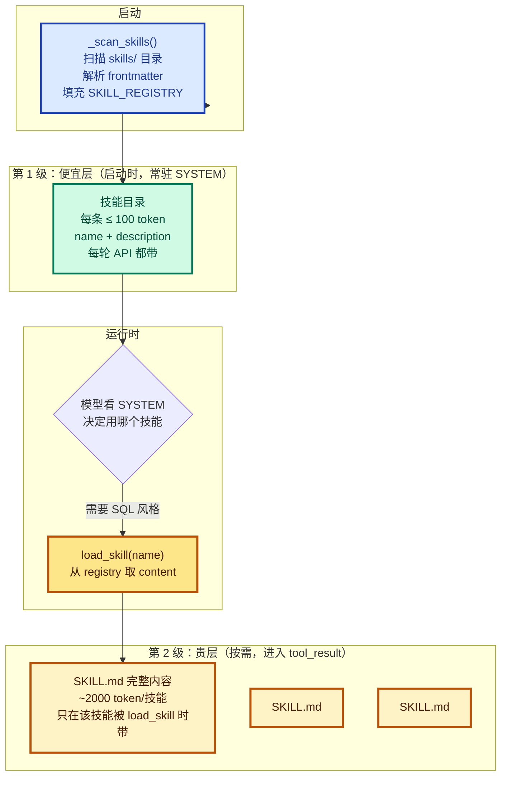

# 07 - Skill Loading

> [!note]
> 项目里有 React 规范、SQL 风格指南、API 设计文档，加起来 6500 行。全塞 SYSTEM prompt 等于每次调 API 都带 99% 无关内容。s07 的解法是**两级加载**：启动时只把技能**目录**（名字 + 一句话描述）注入 SYSTEM（便宜），完整内容**等模型调用 load_skill 时**才进上下文（贵但按需）。SKILL.md 是**清单（manifest）**，不是可执行入口——scripts 等附属资源仍通过现有 bash / read_file 工具使用。

## 这一步加了什么

- 一个 `skills/` 目录，每个技能一个子目录，包含 `SKILL.md`。
- 一个 `SKILL_REGISTRY`：dict，启动时填充，存所有技能的 name + description + content。
- 一个 `_scan_skills()`：启动时扫描 `skills/`，解析 YAML frontmatter，填充注册表。
- 一个 `_parse_frontmatter()`：解析 SKILL.md 的 `---yaml---` 块。
- 一个 `list_skills()`：从注册表生成 catalog 字符串。
- 一个 `build_system()`：把 catalog 注入 SYSTEM prompt。
- 一个 `load_skill(name)` 工具：返回完整 SKILL.md 内容。

## 为什么需要加

### 1. 全塞 SYSTEM 等于永远为不需要的东西付费

最直观的做法：

```python
SYSTEM = (
    f"You are a coding agent. "
    + open("docs/react-style.md").read()    # 2000 行
    + open("docs/sql-style.md").read()      # 1500 行
    + open("docs/api-design.md").read()     # 3000 行
)
```

6500 行 SYSTEM。Agent 改 CSS 颜色时带着 SQL 风格指南，写 SQL 时带着 API 文档。**99% 的 token 是浪费**。

更糟的是：**SYSTEM 每轮都要带**。这是 API 计费的主要部分（输入 token 比 output 贵）。等于每个工具回合都为无关文档付费。

### 2. 文档会越来越多

项目越成熟，规范文档越多。React 规范、SQL 规范、API 规范、Git 提交规范、Code Review 清单、部署流程……塞 SYSTEM 不可持续。

需要一种"**有但不用就当不存在**"的机制：文档存在磁盘上，模型知道有，但只在需要时才读到。

### 3. 让 Agent 主动判断"现在需要哪份文档"

如果只让模型用 `read_file("docs/sql-style.md")` 自己读，问题在于：**模型怎么知道这个文件存在**？它没法列目录（除非又调 bash + ls，又消耗 token）。

s07 的解法：把"有哪些技能"放进 SYSTEM（一行一条，便宜），让模型看到名字和描述后**自己决定**调 `load_skill`。

## 这是一个什么机制

这是 **Two-Tier Knowledge Loading + Manifest Pattern**。和 [[09 - Memory]] 的"索引 + 内容"是同构的。



### 两级的分工

| 层 | 位置 | 时机 | 代价 |
|---|---|---|---|
| 1 目录 | SYSTEM prompt | 启动时注入（harness 扫描） | ~100 token/技能，每轮都带 |
| 2 内容 | tool_result | 模型调 `load_skill` 时 | ~2000 token/技能，按需 |

这是经典的**缓存分级**思想：

- **便宜层**：高频访问、低信息量（目录）。
- **贵层**：低频访问、高信息量（完整内容）。

操作系统 L1/L2/L3 缓存、CPU 缓存、CDN 都是这个模式。

### Manifest Pattern：SKILL.md 是清单不是入口

SKILL.md 文件描述"这个技能是什么、何时用、怎么用"，但**它本身不被执行**。它是**给模型看的说明书**，模型读完之后用**已有的工具**（bash / read_file / write_file）去执行实际动作。

这和 [[02 - Tool Use]] 的工具是不同概念：

- **工具**：可执行的 handler，输入参数 → 副作用。
- **技能**：注入的知识，告诉模型"在这种情况下应该这样做"。

技能可以**引用**脚本，但脚本仍然通过 bash 跑，不是通过一个"执行 skill"的新工具。

## 原本的 Claude Code 怎么做的

Claude Code 的技能系统比 s07 复杂得多，但骨架完全一致。

### 1. 多来源加载

CC 不只有一个 `skills/` 目录，技能来自：

| 来源 | 路径 |
|---|---|
| 全局用户技能 | `~/.claude/skills/` |
| 项目技能 | `.claude/skills/` |
| `--add-dir` 指定 | 命令行参数 |
| 内置（bundled）skills | SDK 自带 |
| MCP 远程 skills | MCP server 提供 |
| 插件 skills | 已安装的插件 |
| Legacy commands | `.claude/commands/`（旧格式） |

s07 教学版只展示 1 个目录，足以说明概念。

### 2. 更丰富的 frontmatter

CC 的 SKILL.md YAML frontmatter 有很多字段：

| 字段 | 用途 |
|---|---|
| `name` / `description` | 显示名称和描述 |
| `when_to_use` | 指导模型何时调用 |
| `allowed-tools` | 技能可用工具的允许列表（自动授权） |
| `context` | `inline`（默认）或 `fork`（作为子 Agent 运行） |
| `model` | 模型覆盖（haiku / sonnet / opus / inherit） |
| `hooks` | 技能级别的 hook 配置 |
| `paths` | 条件激活的 glob 模式（"只在 .py 文件出现时激活"） |
| `user-invocable` | 用户可以通过 `/name` 调用 |

s07 只解析 `name` + `description`，是教学简化。

### 3. forked skills：技能作为子 Agent

CC 的技能可以声明 `context: fork`——加载时**作为子 Agent 运行**，独立的 messages[]。这是 s07 没展开的高级特性，但概念上很自然：

- `inline` 技能：内容进当前对话。
- `fork` 技能：内容进子 Agent，主对话只拿总结。

后者特别适合"大块独立工作"的技能（如"做完整的代码审查"）。

### 4. 条件激活（`paths`）

CC 的技能可以声明 `paths: "**/*.py"`——只在匹配文件出现在对话里时才**自动激活**目录项。这让技能目录更紧凑（不显示无关技能）。

s07 没这个机制——所有技能始终在目录里，模型自己判断用哪个。

### 5. catalog 预算控制

CC 给技能目录设了**预算上限**：~1% 上下文窗口（8000 字符）。超了就按优先级裁剪。这避免了"装了 100 个技能，目录比内容还大"。

s07 没这个限制，但实际项目里技能数不会爆炸。

## 设计要点

### 1. 目录注入 SYSTEM，内容注入 tool_result

关键设计。如果把内容也放 SYSTEM，每次任何一条变化都会让整个 prompt cache 失效（s10 详讲）。分开注入让 catalog 稳定（命中 cache），内容动态（不影响 cache）。

这和 [[09 - Memory]] 的"MEMORY.md 索引在 SYSTEM，记忆内容在 user turn"是完全相同的模式。

### 2. 启动时扫描，运行时查表

`SKILL_REGISTRY` 是**启动时一次性填充**的。运行时 `load_skill(name)` 只是 dict 查表，不走文件系统。

好处：

- **快**：dict lookup 是 O(1)。
- **安全**：没有路径遍历风险（不接收 path，只接收 name）。
- **可枚举**：list_skills 一次就能生成完整目录。

代价：技能文件**运行中修改**不会被读到（要重启）。但技能是配置类资源，运行中改的场景极少。

### 3. SKILL.md 是清单不是入口

再强调一次——SKILL.md 可以**引用** `scripts/`、`references/`、`assets/` 等附属资源，但模型用现有工具访问它们：

```markdown
---
name: code-review
description: Standard code review checklist
---

# Code Review Skill

Steps:
1. Read all changed files with `read_file`
2. Run `bash: git diff main...HEAD`
3. Check the checklist in `references/checklist.md`
4. ...
```

模型读完这个 SKILL.md 后，会按指引调 `read_file("references/checklist.md")` 和 `bash("git diff main...HEAD")`。

**没有"execute skill"工具**。技能是知识注入，不是新工具。

### 4. frontmatter 简化到极简

s07 的 `_parse_frontmatter` 只看 `name` 和 `description`，其他字段忽略。这避免了 YAML 解析的复杂性（教学版手写解析，不用 PyYAML）。

生产实现会用 PyYAML 或类似的库，把所有字段都解析出来。

### 5. 防路径遍历

`load_skill(name)` 只接收 name，不接收 path：

```python
def load_skill(name: str) -> str:
    skill = SKILL_REGISTRY.get(name)
    if not skill:
        return f"Skill not found: {name}"
    return skill["content"]
```

`SKILL_REGISTRY` 是启动时填充的 dict，**只能查到启动时扫到的技能**。模型不能构造恶意 path（如 `../../../etc/passwd`）——dict lookup 找不到就返回 "Skill not found"。

这比"接收 path 然后读文件"安全得多。

## 实现对照（s07/code.py）

启动时扫描：

```python
SKILL_REGISTRY: dict[str, dict] = {}

def _scan_skills():
    if not SKILLS_DIR.exists():
        return
    for d in sorted(SKILLS_DIR.iterdir()):
        if not d.is_dir():
            continue
        manifest = d / "SKILL.md"
        if manifest.exists():
            raw = manifest.read_text()
            meta, body = _parse_frontmatter(raw)
            name = meta.get("name", d.name)
            desc = meta.get("description", raw.split("\n")[0].lstrip("#").strip())
            SKILL_REGISTRY[name] = {"name": name, "description": desc, "content": raw}

_scan_skills()   # 模块加载时执行
```

注入目录到 SYSTEM：

```python
def list_skills() -> str:
    if not SKILL_REGISTRY:
        return "(no skills found)"
    return "\n".join(f"- **{s['name']}**: {s['description']}" for s in SKILL_REGISTRY.values())

def build_system() -> str:
    catalog = list_skills()
    return (
        f"You are a coding agent at {WORKDIR}. "
        f"Skills available:\n{catalog}\n"
        "Use load_skill to get full details when needed."
    )

SYSTEM = build_system()
```

load_skill 工具：

```python
def load_skill(name: str) -> str:
    skill = SKILL_REGISTRY.get(name)
    if not skill:
        return f"Skill not found: {name}"
    return skill["content"]

# 注册到 TOOLS 和 TOOL_HANDLERS
TOOLS.append({
    "name": "load_skill",
    "description": "Load the full content of a skill by name.",
    "input_schema": {"type": "object",
                      "properties": {"name": {"type": "string"}},
                      "required": ["name"]},
})
TOOL_HANDLERS["load_skill"] = load_skill
```

frontmatter 解析（教学版手写）：

```python
def _parse_frontmatter(text: str) -> tuple[dict, str]:
    if not text.startswith("---"):
        return {}, text
    parts = text.split("---", 2)
    if len(parts) < 3:
        return {}, text
    try:
        meta = yaml.safe_load(parts[1]) or {}    # s07 用 PyYAML
    except yaml.YAMLError:
        meta = {}
    return meta, parts[2].strip()
```

几个关键细节：

- `_scan_skills()` 在模块加载时跑一次（不是函数定义时），所以 `SKILL_REGISTRY` 在 import 完成后就填好了。
- SYSTEM 在启动时构建一次，整个进程内不变。**这是 s07 和 s10 的区别**——s07 的 SYSTEM 真的是静态的（启动扫描完就不变），s10 的 SYSTEM 会随运行时状态重算。
- `load_skill` 走标准 dispatch 路径（`TOOL_HANDLERS["load_skill"]`），不需要循环特殊处理。

## 相关概念

- [[09 - Memory]]：同构模式（索引在 SYSTEM，内容按需注入）。Memory 是**动态**知识（Agent 自己写），Skill 是**静态**知识（开发者预先写）。
- [[10 - System Prompt]]：s07 的 build_system 是 s10 update_context 的前身。s07 启动时构建一次，s10 每轮重算。
- [[02 - Tool Use]]：load_skill 走标准 dispatch。技能不是新工具类型，只是新工具名。
- [[06 - Subagent]]：CC 的 `context: fork` 技能用 subagent 机制运行。s07 没展开这个特性。

> [!warning]
> 几个容易踩的坑：
>
> 1. **把技能内容直接塞 SYSTEM**：违反两级设计，每轮都带所有技能的完整内容，token 爆炸。
> 2. **load_skill 接收 path 而非 name**：路径遍历漏洞。必须用 registry lookup。
> 3. **启动时扫描的副作用**：如果扫描本身耗时（远程加载、复杂解析），会拖慢启动。生产实现要异步或缓存。
> 4. **以为技能是可执行的**：SKILL.md 不是入口脚本。它指引模型用现有工具，不是被运行的程序。
> 5. **catalog 无上限**：装 100 个技能后目录占满 SYSTEM。要设预算（CC 的 8000 字符上限）。

## Q&A

### Q1: 如果 skill 文件夹里不止有 SKILL.md，还有 scripts/ 等附属文件，模型怎么调用？是通过读 md 然后直接运行 tool 来跑脚本吗？

**A**：是的，正是这样。SKILL.md 是**清单（manifest）**，不是可执行入口。它告诉模型"这个技能是什么、何时用、怎么做"。具体动作（包括跑脚本）**仍然通过现有的 bash / read_file / write_file 工具完成**。

完整流程：

1. SYSTEM prompt 里有技能目录（名字 + 一句话描述）。
2. 模型判断需要某个技能 → 调 `load_skill(name)`。
3. `load_skill` 返回完整 SKILL.md 内容（进 tool_result）。
4. 模型读完 SKILL.md，按里面的指引**调用 bash 跑脚本**（或别的工具）。

例如一个 `code-review/SKILL.md` 可能写：

```markdown
# Code Review Skill

1. Read changed files: read_file(...)
2. Run diff: bash("git diff main...HEAD")
3. Check the checklist: read_file("references/checklist.md")
4. Run lint: bash("scripts/lint.sh")
```

模型读完会按这个步骤调 bash 和 read_file。`scripts/lint.sh` 通过 **bash 工具**跑，不是通过"专门跑 skill 脚本的工具"。

**没有"execute skill"工具**。技能是知识注入，不是新工具。这是 manifest pattern 的核心：清单描述行动，行动用通用工具完成。

### Q2: 技能和记忆（s09）有什么区别？看起来都是两级加载。

**A**：**机制同构，定位不同**。

| 维度 | Skill (s07) | Memory (s09) |
|---|---|---|
| 谁写 | 开发者预先写 | Agent 运行中提取 |
| 内容 | 规范、流程、清单 | 用户偏好、项目背景 |
| 何时变 | 启动时扫一次，进程内不变 | 每轮 extract_memories 都可能写新 |
| 注入位置 | tool_result（load_skill 时） | user turn（load_memories 时） |
| 选择机制 | 模型读 catalog 自己选 | LLM side-query 选相关 |
| 生命周期 | 静态（重启才更新） | 动态（持续累积） |

它们都用"**索引在 SYSTEM、内容按需**"的两级模式。区别在于：

- Skill 解决"**有大量预定义知识**"问题（项目规范、最佳实践）。
- Memory 解决"**跨会话保留运行时观察**"问题（用户偏好、项目状态）。

实际系统里**两者都有**——Skill 提供领域知识，Memory 记录个体偏好。互补不冲突。

### Q3: 为什么不直接让模型 read_file("skills/sql-style/SKILL.md")？非要搞个 load_skill 工具？

**A**：因为模型**不知道 skills/ 目录里有什么文件**。

要让模型用 read_file，它得先知道文件路径。但模型没法列目录（除非调 bash + ls，又费一轮 API）。即使列出来，每个文件名也得模型自己推断"哪个相关"。

load_skill 工具的价值：

1. **SYSTEM 里就有目录**：模型一轮 API 就能看到所有技能名字 + 描述。
2. **按名字调用**：模型不用记路径，只记名字（"sql-style"）。
3. **统一接入点**：所有技能走同一条路（registry lookup），便于打日志、限流、加 hook。

如果用 read_file，模型得多调几次 API 才能完成"找文件 + 读内容"，每个回合多花 token。load_skill 把这些压成一步。

### Q4: SKILL_REGISTRY 启动时填充，运行时如果要加新技能怎么办？

**A**：s07 教学版**不支持运行时添加**——重启进程才能加载新技能。这是教学简化。

CC 的做法是：

- 监听 `skills/` 目录变化（`chokidar` 等）。
- 文件增删时重新扫描，更新注册表。
- 通过状态广播让运行中的会话感知到新技能。

这种动态加载的代价是要处理并发（多个会话同时访问 registry）、缓存失效等复杂问题。s07 把它简化掉，避免这些工程负担。

### Q5: `load_skill` 返回的 SKILL.md 进 tool_result，下一轮 API 调用还在不在？

**A**：**在**。tool_result 一旦进 messages，就会随历史一直带，直到：

- s08 的 micro_compact 把它替换成占位符。
- s08 的 compact_history 把整个历史压成摘要。
- 会话结束。

这意味着一旦加载了某个技能，后续几轮它的内容都在上下文里。模型可以反复参考。代价是占用 token——所以 s08 的压缩管线对长会话至关重要。

如果技能只用一次（"加载 sql-style 看一眼"），它仍然占着 token 直到压缩触发。这是当前设计的代价。CC 有一些优化（如 forked skill 跑完即丢），s07 没展开。

### Q6: 技能和 Phase 6 的 MCP（s19）有什么关系？

**A**：**机制类似，扩展方向不同**。

| 维度 | Skill (s07) | MCP (s19) |
|---|---|---|
| 扩展什么 | 知识（文档、规范） | 工具（外部 API、数据源） |
| 注入方式 | SKILL.md 内容进 tool_result | MCP server 提供的 tool schema 进 TOOLS |
| 谁提供 | 开发者写 SKILL.md 文件 | 外部 MCP server 进程 |
| 模型怎么用 | 读知识，用已有工具行动 | 调用新工具（像调 bash 一样） |

简单说：

- **Skill 扩展模型"知道什么"**。
- **MCP 扩展模型"能做什么"**。

两者经常配合：一个 MCP 工具（如 GitHub PR 工具）配合一个 Skill（如"如何做 PR review"的清单），让 Agent 既能做又有指导。
