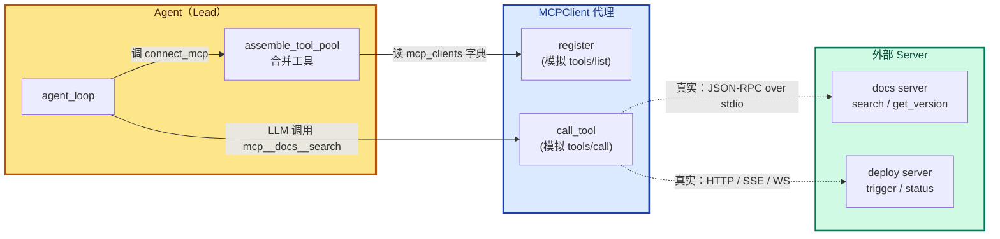
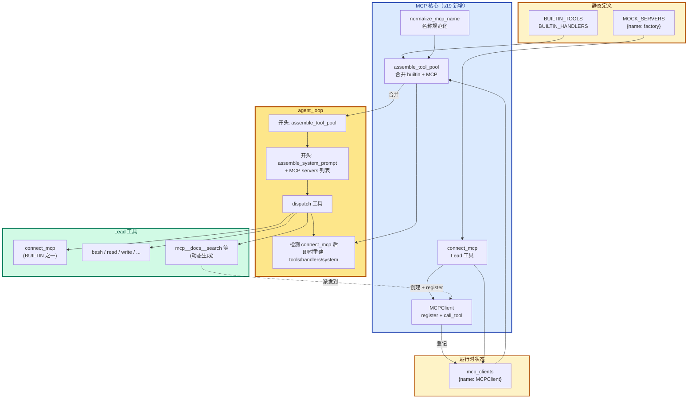
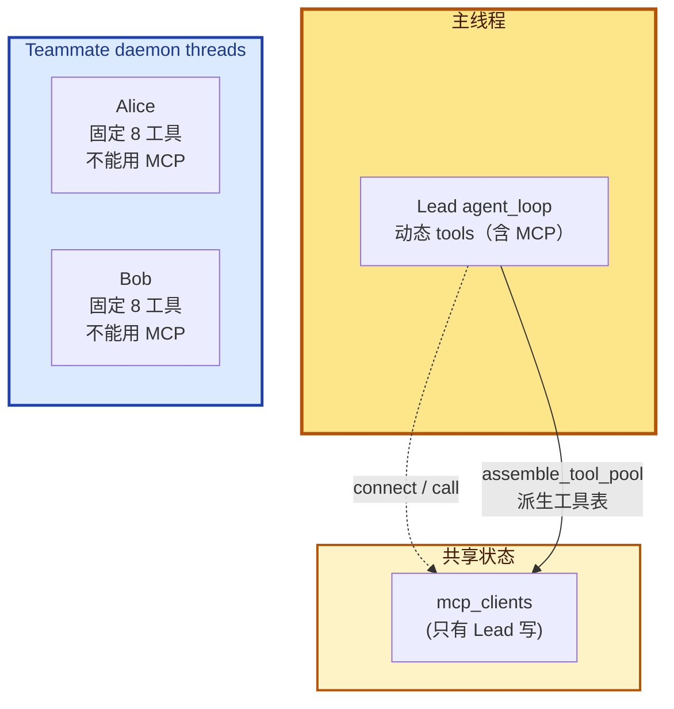

# 19 - MCP Plugin

> [!note]
> s01-s18 所有工具都是**手写**的——bash / read / write / task / worktree，每个工具的 schema、handler、错误处理都是项目代码里的 Python 函数。s19 引入 **MCP（Model Context Protocol）**——一个标准协议，让**外部服务**实现它就能被 Agent 直接调用，不管服务用什么语言写、跑在哪台机器。教学版用 Python 函数 mock 两个示例 server（docs / deploy），核心机制完整演示：发现工具（`tools/list`）+ 调用工具（`tools/call`）+ 命名空间隔离（`mcp__server__tool`）+ 工具池动态组装。这是 Phase 6 的第一课——**Agent 第一次能"扩展"而不是"被扩展"**。

## 这一步加了什么

### 1. `MCPClient` 类（模拟 server 在 Agent 端的代理）

```python
class MCPClient:
    def __init__(self, name: str):
        self.name = name
        self.tools: list[dict] = []               # 工具定义（schema）
        self._handlers: dict[str, callable] = {}  # 工具名 → 实现函数

    def register(self, tool_defs, handlers):      # 模拟 tools/list 响应
        self.tools = tool_defs
        self._handlers = handlers

    def call_tool(self, tool_name, args) -> str:  # 模拟 tools/call
        handler = self._handlers.get(tool_name)
        if not handler:
            return f"MCP error: unknown tool '{tool_name}'"
        try:
            return handler(**args)
        except Exception as e:
            return f"MCP error: {e}"
```

**Agent 端的 client 代理**。每个连接的 server 对应一个 MCPClient 实例。教学版用本地 Python 函数模拟 server 实现；真实 MCP 用 stdio / http / sse / ws 通信。

### 2. 全局状态：`mcp_clients` 字典

```python
mcp_clients: dict[str, MCPClient] = {}
```

**已连接 server 的登记表**——server name → MCPClient 实例。**这是连接状态的唯一真相**。`assemble_tool_pool` 从它派生工具表。

### 3. `connect_mcp(name)` —— Lead 工具：连接 server

```python
def connect_mcp(name: str) -> str:
    if name in mcp_clients:                       # ① 防重复
        return f"MCP server '{name}' already connected"
    factory = MOCK_SERVERS.get(name)              # ② 查工厂
    if not factory:
        return f"Unknown server '{name}'. Available: ..."
    mcp_client = factory()                        # ③ 创建 + register
    mcp_clients[name] = mcp_client                # ④ 登记字典
    return f"Connected to MCP server '{name}'. Discovered N tools: ..."
```

**关键认知**：`connect_mcp` **只登记字典，不改 agent 的工具表**。工具真正进 agent 是在**下一轮 `assemble_tool_pool`**——"标记变更 + 下次循环生效"的模式。

### 4. `normalize_mcp_name(name)` —— 名称规范化

```python
_DISALLOWED_CHARS = re.compile(r'[^a-zA-Z0-9_-]')

def normalize_mcp_name(name: str) -> str:
    return _DISALLOWED_CHARS.sub('_', name)
```

所有非 `[a-zA-Z0-9_-]` 的字符替换为 `_`。**防 server/tool 名带特殊字符**导致命名冲突或注入（比如 `"docs/v2"` → `"docs_v2"`）。

### 5. `assemble_tool_pool()` —— 核心合并函数

```python
def assemble_tool_pool() -> tuple[list[dict], dict]:
    tools = list(BUILTIN_TOOLS)                   # 内置工具原样加
    handlers = dict(BUILTIN_HANDLERS)
    for server_name, mcp_client in mcp_clients.items():
        safe_server = normalize_mcp_name(server_name)
        for tool_def in mcp_client.tools:
            safe_tool = normalize_mcp_name(tool_def["name"])
            prefixed = f"mcp__{safe_server}__{safe_tool}"   # ← 命名空间前缀
            tools.append({
                "name": prefixed,
                "description": tool_def.get("description", ""),
                "input_schema": tool_def.get("inputSchema", {}),
            })
            handlers[prefixed] = (                          # ← lambda 默认参数捕获
                lambda *, c=mcp_client, t=tool_def["name"], **kw:
                    c.call_tool(t, kw))
    return tools, handlers
```

**这是 s19 的真正核心**。每次调用时**遍历 `mcp_clients` 字典**，把所有已连接 server 的工具合并进统一的 (tools, handlers)。

### 6. agent_loop 改动：去掉 prompt cache + 检测 connect_mcp

```python
def agent_loop(messages, context):
    tools, handlers = assemble_tool_pool()        # ← 每轮重建（去掉了 s10 缓存）
    system = assemble_system_prompt(context)
    while True:
        response = client.messages.create(..., tools=tools, ...)
        ...
        # dispatch tools
        ...

        # 关键：检测到 connect_mcp 立即重建工具池
        if any(b.name == "connect_mcp" for b in response.content
               if b.type == "tool_use"):
            tools, handlers = assemble_tool_pool()
            context = update_context(context, messages)
            system = assemble_system_prompt(context)
```

两处改动：

1. **去掉 prompt cache**：s10-s18 用 `_last_context_hash, _last_prompt` 缓存 system prompt。s19 去掉——因为工具池动态变化，缓存会失效。
2. **connect_mcp 触发即时重建**：检测到本轮调了 `connect_mcp`，下一轮 API 调用前立刻重建 tools/handlers/system，避免 LLM 多等一轮才能用新工具。

### 7. assemble_system_prompt 加 MCP servers 列表

```python
def assemble_system_prompt(context: dict) -> str:
    sections = [PROMPT_SECTIONS["identity"],
                PROMPT_SECTIONS["tools"],
                PROMPT_SECTIONS["workspace"]]
    if context.get("memories"):
        sections.append(f"Relevant memories:\n{context['memories']}")
    mcp_names = list(mcp_clients.keys())          # ← s19 新增
    if mcp_names:
        sections.append(f"Connected MCP servers: {', '.join(mcp_names)}")
    return "\n\n".join(sections)
```

让 LLM 看到"当前连了哪些 server"——引导它合理使用 MCP 工具。

### 8. 工具描述的 readOnly / destructive 标注

```python
{"name": "search", "description": "Search documentation. (readOnly)", ...}
{"name": "trigger",
 "description": "Trigger a deployment. (destructive — requires approval in real CC)", ...}
```

教学版用文本标注。真实 CC 用结构化 **tool annotations**——权限系统根据声明决定是否需要用户确认。

## 为什么需要加

### 1. 手写工具不能扩展

s01-s18 的所有工具都是**项目内置**的——bash / read / write / task / worktree。如果你要接：

- 公司的 Jira API（查 issue / 建 ticket）
- 自建的部署系统（触发 deploy / 看日志）
- 团队的 Notion 知识库（搜文档 / 建页面）
- 第三方的 GitHub / Slack / Linear 集成

**每个都要改项目代码**——加 TOOLS 数组、写 handler、加 input_schema、加错误处理。这违反了"开放-封闭"原则。

### 2. 需要标准协议

每个外部服务都自己设计接入方式的话：

- 服务 A 用 REST API
- 服务 B 用 gRPC
- 服务 C 用 GraphQL
- 服务 D 用 CLI

Agent 要为每个服务学一套接入代码——**集成成本随服务数线性增长**。

MCP 提供**一个标准协议**：服务实现 `tools/list`（声明能力）+ `tools/call`（执行调用）就行。Agent 不关心服务怎么实现、用什么语言、跑在哪。

### 3. 需要命名空间隔离

如果两个 server 都有 `search` 工具（docs 的 search 和 slack 的 search），**直接合并会冲突**——后者覆盖前者。

MCP 用 `mcp__{server}__{tool}` 前缀避免冲突：

- `mcp__docs__search`
- `mcp__slack__search`

LLM 调用时显式指定哪个 server 的哪个工具——**零冲突**。

### 4. 需要"动态工具表"

之前的所有课，工具表是**静态**的（启动时就定死）。MCP 让工具表**运行时变化**——connect 一个 server 后，工具立即增加；disconnect 后减少。

这要求 agent_loop 能处理"工具表变化"——s19 通过每轮重建 + connect_mcp 触发即时重建解决。

## 这是一个什么机制

### 三方架构：Agent ↔ MCPClient ↔ MCP Server



教学版的 MCPClient 是"模拟"——server 实现就在同进程的 Python 函数里。真实 MCP 协议下，MCPClient 通过**网络 / 进程间通信**跟外部 server 对话。

### 协议语义：tools/list + tools/call

MCP 协议只有两个核心 RPC 方法：

| 方法 | 方向 | 用途 |
|---|---|---|
| `tools/list` | Agent → Server | "你有哪些工具？给我 schema" |
| `tools/call` | Agent → Server | "执行这个工具，参数是 ..." |

教学版的 `register` 对应 `tools/list`（一次性灌入），`call_tool` 对应 `tools/call`。简化但语义一致。

### 命名空间：`mcp__server__tool`

```
mcp__{normalized_server_name}__{normalized_tool_name}
```

**三段式**：

1. `mcp__`：统一前缀，跟内置工具区分
2. `{server_name}`：哪个 server
3. `{tool_name}`：哪个工具

例子：

```
内置: bash / read_file / create_task / spawn_teammate
MCP:  mcp__docs__search / mcp__docs__get_version
      mcp__deploy__trigger / mcp__deploy__status
```

**为什么用双下划线分隔**：单下划线在工具名里是合法的，会跟 tool 名混。双下划线作为分隔符（约定 tool/server 名里不含连续双下划线）。

### "标记变更 + 下次循环生效"模式

这是 s19 最值得讲清楚的工程模式。connect_mcp 是个**工具**——它在 dispatch 阶段被调用，但 dispatch 阶段**不能改 tools 数组**（LLM 这一轮用的就是当前 tools）。

只能"标记变更"（写 mcp_clients 字典），让**下一轮** assemble_tool_pool 看到新状态。

```
─── 第 N 轮 agent_loop ───
assemble_tool_pool():
  mcp_clients = {}                                    ← 空
  返回 (builtin 工具, builtin handlers)

LLM 收到 builtin 工具列表
LLM 调 connect_mcp("docs")
  ↓ mcp_clients["docs"] = MCPClient(...)              ← 字典更新
  ↓ 返回 "Connected to docs. Discovered 2 tools"

检测到 connect_mcp → 立即重建 tools/handlers/system

─── 第 N+1 轮 agent_loop（实际是同一轮的下一次 API 调用）───
LLM 现在能看到 mcp__docs__search 和 mcp__docs__get_version
LLM 调用 mcp__docs__search("auth")
```

跟 s14 cron 的"入队 + queue processor 消费"、s16 协议的"pending_requests 状态机"是同构模式——**异步状态机**。

## 原本的 Claude Code 怎么做的

CC 的 MCP 系统远比 s19 复杂——6 种 transport / OAuth 认证 / 反向通知 / 配置优先级 / 错误重试。但**架构骨架一致**。

### 1. 6 种 Transport 类型

教学版只有 mock（同进程函数调用）。CC 支持 6 种（`types.ts:23-25`）：

| Transport | 通信方式 | 适用场景 |
|---|---|---|
| `stdio` | 子进程 stdin/stdout | 跨平台默认（本地 server） |
| `sse` | HTTP Server-Sent Events | 远程 server，单向流 |
| `http` | Streamable HTTP | 远程 server，POST/SSE 双向 |
| `ws` | WebSocket | 远程 server，全双工 |
| `sse-ide` | IDE 内嵌 SSE | IDE 集成 |
| `sdk` | 进程内 SDK | 同进程扩展 |

连接时本地（stdio）和远程（http/sse/ws）**分批并发**：本地批量 3 个，远程批量 20 个——避免一个慢 server 阻塞其他。

### 2. 工具池组装算法

CC 的 `assembleToolPool()`（`tools.ts:345-364`）：

```typescript
return uniqBy(
  [...builtInTools.sort(byName), ...filteredMcpTools.sort(byName)],
  'name',
)
```

**关键**：内置工具和 MCP 工具**分开排序**，不是合起来排。原因是 CC 的 prompt cache 断点策略——内置工具之后某个位置放全局 cache 锚点，混排会破坏。

教学版的 `assemble_tool_pool` 没这个考虑，简单 concat。

### 3. 同样的命名规则

CC 的 `buildMcpToolName()`（`mcpStringUtils.ts:50-52`）：

```
mcp__<normalizedServerName>__<normalizedToolName>
```

完全一致。`normalization.ts:17-23` 的规范化规则也跟教学版的 `normalize_mcp_name` 一样——非 `[a-zA-Z0-9_-]` 替换为 `_`。

### 4. 权限系统：tool annotations

教学版只在 description 里用文本标注 `(readOnly)` / `(destructive)`：

```python
"description": "Trigger a deployment. (destructive — requires approval in real CC)"
```

CC 用结构化 **tool annotations**：

```typescript
{
  name: "trigger",
  annotations: {
    destructiveHint: true,       // ← 破坏性操作
    readOnlyHint: false,
    idempotentHint: false,
    openWorldHint: true
  }
}
```

权限系统**根据 annotations 决定**是否需要用户确认——`destructiveHint: true` 的工具默认要批准。教学版的文本标注只是给人读，没权限拦截。

### 5. 配置来源与优先级

CC 的 MCP 配置来自多个来源，从低到高：

```
claude.ai 连接器 < plugin < user settings.json < approved project .mcp.json < local settings.local.json
```

企业 `managed-mcp.json` 存在时**完全排除其他配置**——企业管控的最高优先级。

教学版直接传 server name 给 `MOCK_SERVERS` 字典，没配置合并。

### 6. Channel 通知：server 反向推消息

教学版只讲 Agent → Server 单向调用。CC 还支持**反向通知**（`channelNotification.ts`）：

1. Server 声明 `capabilities.experimental['claude/channel']`
2. Server 通过 `notifications/claude/channel` 给 Agent 发消息
3. 消息包装在 `<channel source="serverName">...</channel>` XML 标签
4. Agent 被 SleepTool 唤醒（1 秒内）

Server 甚至能**请求权限**——`notifications/claude/channel/permission_request` → Agent 回 `permission`。用户通过 5 字母短 ID 确认/拒绝。

这让 server 能"主动告诉 Agent 事情"——比如长任务的进度更新、外部事件触发（PR 被 review 了 / 部署完成了）。

### 7. OAuth 认证流程

CC 的 MCP 认证（`auth.ts`）支持完整 OAuth 2.0 + PKCE：

- 通过公钥客户端 + PKCE 发现 OAuth 元数据（RFC 8414 / RFC 9728）
- 本地回调服务器接收授权码
- 令牌通过 `getSecureStorage()` 持久化（macOS Keychain / Linux 加密文件 / Windows 凭据管理器）
- 过期前 5 分钟自动刷新
- 支持跨应用访问（XAA）：浏览器 id_token → RFC 8693 + RFC 7523 交换 → 无需反复弹浏览器

教学版假设 server 不需要认证——`connect_mcp` 一调就连。

### 8. 错误处理

CC 对 MCP 连接有精细的错误分类（`client.ts:1266-1402`）：

| 错误类型 | 处理 |
|---|---|
| 终局性错误（ECONNRESET / ETIMEDOUT / EPIPE） | 连续 3 次 → 关闭 + 重连 |
| 工具调用 401（令牌过期） | 抛 `McpAuthError` → 触发重认证 |
| 工具调用超时 | `Promise.race`（默认约 28 小时） |
| stdio 断连 | SIGINT → SIGTERM → SIGKILL 顺序杀进程 |

教学版只 `try/except Exception` 兜底返回错误字符串。

### 9. MCP 工具对子 agent 也可用

教学版的 MCP 工具**只给 Lead**——Teammate 仍用固定 8 个工具。

CC 的 MCP 工具**对主 agent 和子 agent 都可用**——子 agent 继承父级的 MCP 配置。这让 subagent 也能调用 Jira / GitHub 等外部服务。

### 教学版的简化总结

| 维度 | 教学版 | CC |
|---|---|---|
| transport | 1 种（mock） | 6 种 |
| 认证 | 无 | OAuth 2.0 + PKCE |
| 反向通知 | 无 | Channel notification |
| 配置合并 | 单字典 | 5 层优先级 |
| 错误处理 | try/except | 精细分类 + 重试 |
| 权限拦截 | 文本标注 | tool annotations 结构体 |
| 子 agent 可用 | 仅 Lead | Lead + subagent 继承 |
| 工具变更通知 | 无 | `notifications/tools/list_changed` |

## 整体逻辑：函数之间的关系



### 调用关系详解

#### 连接 server（一次性）

```
Lead LLM 看到 builtin 工具列表，决定连 docs server
  ↓
LLM 调 connect_mcp("docs")
  ↓
run_connect_mcp("docs"):
  ├─ if "docs" in mcp_clients:                  ← 防重复
  │    return "already connected"
  ├─ factory = MOCK_SERVERS["docs"]              ← _mock_server_docs
  ├─ mcp_client = factory()
  │    ├─ MCPClient("docs")                       ← __init__
  │    └─ client.register(
  │           tool_defs=[search, get_version],
  │           handlers={search: lambda, get_version: lambda})
  ├─ mcp_clients["docs"] = mcp_client            ← 登记字典
  └─ return "Connected to docs. Discovered 2 tools: search, get_version"

agent_loop 检测到本轮调了 connect_mcp:
  ↓
立即重建:
  tools, handlers = assemble_tool_pool()         ← mcp_clients 现在不空
  context = update_context(...)
  system = assemble_system_prompt(context)        ← 含 "Connected MCP servers: docs"

下一轮 API 调用，LLM 收到扩展后的 tools 列表（多了 mcp__docs__search / mcp__docs__get_version）
```

#### 调用 MCP 工具

```
LLM 调 mcp__docs__search(query="auth")
  ↓
agent_loop dispatch:
  handler = handlers["mcp__docs__search"]
  ↓ 这个 handler 是 assemble_tool_pool 注册的 lambda:
  lambda *, c=mcp_client, t="search", **kw: c.call_tool(t, kw)
  ↓
mcp_client.call_tool("search", {"query": "auth"})
  ├─ handler = self._handlers["search"]
  ├─ return handler(query="auth")
  └─ 返回 "[docs] Found 3 results for 'auth'"

结果塞回 messages 作为 tool_result
```

#### assemble_tool_pool 内部循环

```python
def assemble_tool_pool():
    tools = list(BUILTIN_TOOLS)            # 拷贝（不污染原数组）
    handlers = dict(BUILTIN_HANDLERS)
    for server_name, mcp_client in mcp_clients.items():   # 遍历所有已连接
        safe_server = normalize_mcp_name(server_name)      # "docs" → "docs"
        for tool_def in mcp_client.tools:
            safe_tool = normalize_mcp_name(tool_def["name"])
            prefixed = f"mcp__{safe_server}__{safe_tool}"
            tools.append({
                "name": prefixed,
                "description": tool_def.get("description", ""),
                "input_schema": tool_def.get("inputSchema", {}),
            })
            # 关键：lambda 默认参数捕获循环变量
            handlers[prefixed] = (
                lambda *, c=mcp_client, t=tool_def["name"], **kw:
                    c.call_tool(t, kw))
    return tools, handlers
```

### Lambda 默认参数捕获：避免 Python 闭包陷阱

```python
# 错误写法（典型陷阱）：
for mcp_client in clients:
    for tool_def in tools:
        handlers[name] = lambda **kw: mcp_client.call_tool(tool_def["name"], kw)
# 结果：所有 lambda 都引用循环最后一次的 mcp_client 和 tool_def！

# 正确写法（s19 用）：
handlers[prefixed] = (
    lambda *, c=mcp_client, t=tool_def["name"], **kw:
        c.call_tool(t, kw))
# 默认参数在 lambda 定义时绑定，每次循环都创建新的绑定
```

**原理**：Python 闭包对循环变量是**延迟绑定**——lambda 被调用时才查变量值，那时循环早结束。默认参数在 lambda 定义时求值，相当于"快照"。

## 对 agent_loop 的影响

### 主 `agent_loop` 函数：**首次结构性改动**

s15-s18 的 agent_loop 都跟 s14 基本一致。s19 是 Phase 4-6 里**第一次动 agent_loop 内部逻辑**：

```python
# s15-s18（继承 s14）
def agent_loop(messages, context):
    while True:
        response = client.messages.create(...)
        if response.stop_reason != "tool_use": return
        # dispatch
        ...

# s19
def agent_loop(messages, context):
    tools, handlers = assemble_tool_pool()           # ← 新增：每轮开头组装
    system = assemble_system_prompt(context)         # ← 改：去掉了 prompt cache
    while True:
        response = client.messages.create(..., tools=tools, ...)
        if response.stop_reason != "tool_use": return
        # dispatch
        ...

        # ← 新增：检测 connect_mcp 后即时重建
        if any(b.name == "connect_mcp" for b in response.content
               if b.type == "tool_use"):
            tools, handlers = assemble_tool_pool()
            context = update_context(context, messages)
            system = assemble_system_prompt(context)
```

**两处改动**：

1. **每轮开头组装工具池**（替代静态 TOOLS）——支持动态工具
2. **去掉 prompt cache**——工具池变化导致缓存失效

### "检测 connect_mcp 即时重建" 的价值

如果不重建，下一轮 API 调用还会用旧 tools——LLM 看不到 `mcp__docs__search`。要等到下一轮 agent_loop 才能用——多一次 API 调用，多一次延迟。

即时重建让 LLM **同一轮内**就能用刚连上的 MCP 工具——用户体验更好。

### 跟 Phase 4-5 的扩展方式对比

| 课 | 扩展方式 | 改动位置 |
|---|---|---|
| s12 | 加工具 | TOOLS / TOOL_HANDLERS |
| s13 | dispatch 加分支 | agent_loop 内部 dispatch 处 |
| s14 | 入口前 consume | agent_loop 开头 + 起守护线程 |
| s15 | 复制一份新的 mini loop | Teammate run() |
| s16-s18 | 改 Teammate loop | Teammate run() |
| **s19** | **动态工具表 + 去缓存** | **agent_loop 开头 + dispatch 后** |

s19 是**第一次让 agent_loop 内部的 tools 变量化**——为未来"运行时增减工具"打开大门。

## 多线程并行情况

s19 跟 s18 的线程结构**完全一样**——主线程 + Teammate daemon thread + scheduler（如继承 s14）。



### 关键约束：MCP 只给 Lead

教学版中：

- `connect_mcp` 是 **Lead 工具**（在 BUILTIN_TOOLS 里）
- `assemble_tool_pool` **只服务于 Lead 的 agent_loop**
- Teammate 仍用固定 8 个 sub_tools（bash / read / write / send_message / submit_plan / list_tasks / claim_task / complete_task）

**Teammate 不能调 MCP 工具**——即使 Lead 连了 docs server，alice 也调不了 `mcp__docs__search`。

### 为什么教学版这么简化

1. **代码结构清晰**：MCP 逻辑只在一个地方（Lead agent_loop）。
2. **避免并发问题**：`mcp_clients` 字典只有 Lead 写，没有竞态。
3. **聚焦核心**：教学目标是讲"MCP 协议"，不是讲"MCP 跨 agent 共享"。

### 真实 CC 的做法

CC 的 MCP 工具**对子 agent 也可用**——子 agent 继承父级的 MCP 配置。这让 subagent / teammate 都能调 Jira / GitHub 等外部服务。

实现上 CC 用**全局 MCP 配置 + 进程间共享**——子进程启动时拿到父进程的 MCP 配置，自己连接同样的 server。

### mcp_clients 的并发风险

教学版只有 Lead 写 `mcp_clients`——单写者，无竞态。

如果将来让 Teammate 也能 connect MCP（CC 的做法）：

- 多个 Teammate 同时 connect → 字典写竞态（CPython GIL 兜底，但仍可能丢更新）
- assemble_tool_pool 遍历时别的线程在写字典 → RuntimeError: dictionary changed size during iteration

需要加锁：`mcp_lock = threading.Lock()` 保护 `mcp_clients`。教学版省了。

## 设计要点

### 1. 工具池的"单一真相"是 mcp_clients

```python
mcp_clients: dict[str, MCPClient] = {}
```

**唯一真相**——assemble_tool_pool 每次从它派生工具表。字典什么状态，工具表就什么状态。

如果同时维护 `mcp_clients` 和 `tools` 两个地方，容易不同步。单一真相 + 派生 = 简单可靠。

### 2. 命名空间用三段式前缀

```
mcp__{server}__{tool}
```

- `mcp__` 区分内置工具
- `{server}` 区分不同 server
- `{tool}` 区分同 server 内不同工具

**为什么不用点号 `mcp.docs.search`**：工具名带点号在很多系统里有歧义（路径 / 命名空间 / 方法调用）。下划线是 LLM 工具名的安全字符。

### 3. normalize_mcp_name 防注入

```python
_DISALLOWED_CHARS = re.compile(r'[^a-zA-Z0-9_-]')
```

**白名单**而非黑名单——只允许 `[a-zA-Z0-9_-]`，其他全替换。比黑名单（拒绝已知危险字符）更安全——不会漏掉新出现的攻击字符。

### 4. 工具描述带语义标注

```python
"Search documentation. (readOnly)"
"Trigger a deployment. (destructive — requires approval in real CC)"
```

虽然教学版不做权限拦截，但**描述里的标注仍引导 LLM 行为**——LLM 看到 `(destructive)` 会更谨慎，可能先调用 readOnly 工具调研。

CC 把这个机制升级成结构化 annotations + 权限系统拦截——但**起点是描述标注**。

### 5. connect_mcp 不直接改 tools

这是 s19 最重要的工程模式——**工具不能改 tools 数组**。

LLM 调 connect_mcp 时，agent_loop 在 dispatch 阶段。dispatch 用的就是当前 tools，**中途改会出乱子**（LLM 这一轮已经基于旧 tools 决策）。

只能"标记变更"（写字典），让下次 assemble_tool_pool 看到新状态。这是**异步状态机**模式——所有"工具改变可用工具集"的场景都这样设计。

### 6. lambda 默认参数捕获

```python
lambda *, c=mcp_client, t=tool_def["name"], **kw: c.call_tool(t, kw)
```

Python 闭包陷阱的解法——默认参数在定义时绑定，避免循环变量延迟绑定。

**为什么用关键字参数 `*, c, t`**：强制调用者用关键字传参。assemble_tool_pool 注册的 handler 会被 `handler(**block.input)` 调用——block.input 是用户传入的 args dict（可能含 `query` / `service` 等）。用 `*, c, t` 隔离内部参数和用户参数，避免冲突（万一用户的工具参数叫 `c` 或 `t`）。

### 7. 去掉 prompt cache 换正确性

s10-s18 用 `_last_context_hash` 缓存 system prompt——避免重复序列化省 token。

s19 去掉——因为 connect_mcp 后工具池变了，缓存会失效（LLM 看不到新工具）。

**权衡**：每轮多花几毫秒序列化（成本）vs 工具表永远是最新的（正确性）。s19 选正确性。

更优的方案是**细粒度缓存**——只缓存 system prompt 里不变的部分（identity / workspace），动态部分（tools 列表）每次重新生成。CC 用这种策略。

## 实现对照（s19/code.py）

### MCPClient

```python
class MCPClient:
    """Discovers and calls tools on an MCP server (mock for teaching)."""

    def __init__(self, name: str):
        self.name = name
        self.tools: list[dict] = []
        self._handlers: dict[str, callable] = {}

    def register(self, tool_defs: list[dict],
                 handlers: dict[str, callable]):
        self.tools = tool_defs
        self._handlers = handlers

    def call_tool(self, tool_name: str, args: dict) -> str:
        handler = self._handlers.get(tool_name)
        if not handler:
            return f"MCP error: unknown tool '{tool_name}'"
        try:
            return handler(**args)
        except Exception as e:
            return f"MCP error: {e}"
```

### normalize_mcp_name + connect_mcp

```python
_DISALLOWED_CHARS = re.compile(r'[^a-zA-Z0-9_-]')

def normalize_mcp_name(name: str) -> str:
    return _DISALLOWED_CHARS.sub('_', name)

def connect_mcp(name: str) -> str:
    if name in mcp_clients:
        return f"MCP server '{name}' already connected"
    factory = MOCK_SERVERS.get(name)
    if not factory:
        available = ", ".join(MOCK_SERVERS.keys())
        return f"Unknown server '{name}'. Available: {available}"
    mcp_client = factory()
    mcp_clients[name] = mcp_client
    tool_names = [t["name"] for t in mcp_client.tools]
    return (f"Connected to MCP server '{name}'. "
            f"Discovered {len(mcp_client.tools)} tools: {', '.join(tool_names)}")
```

### assemble_tool_pool

```python
def assemble_tool_pool() -> tuple[list[dict], dict]:
    tools = list(BUILTIN_TOOLS)
    handlers = dict(BUILTIN_HANDLERS)
    for server_name, mcp_client in mcp_clients.items():
        safe_server = normalize_mcp_name(server_name)
        for tool_def in mcp_client.tools:
            safe_tool = normalize_mcp_name(tool_def["name"])
            prefixed = f"mcp__{safe_server}__{safe_tool}"
            tools.append({
                "name": prefixed,
                "description": tool_def.get("description", ""),
                "input_schema": tool_def.get("inputSchema", {}),
            })
            handlers[prefixed] = (
                lambda *, c=mcp_client, t=tool_def["name"], **kw:
                    c.call_tool(t, kw))
    return tools, handlers
```

### mock server 工厂

```python
def _mock_server_docs():
    client = MCPClient("docs")
    client.register(
        tool_defs=[
            {"name": "search", "description": "Search documentation. (readOnly)",
             "inputSchema": {"type": "object",
                             "properties": {"query": {"type": "string"}},
                             "required": ["query"]}},
            {"name": "get_version", "description": "Get API version. (readOnly)",
             "inputSchema": {"type": "object", "properties": {}, "required": []}},
        ],
        handlers={
            "search": lambda query: f"[docs] Found 3 results for '{query}'",
            "get_version": lambda: "[docs] API v2.1.0",
        })
    return client

MOCK_SERVERS = {
    "docs": _mock_server_docs,
    "deploy": _mock_server_deploy,
}
```

### agent_loop 改动

```python
def agent_loop(messages: list, context: dict):
    tools, handlers = assemble_tool_pool()           # 每轮重建
    system = assemble_system_prompt(context)         # 每轮重生成
    while True:
        try:
            response = client.messages.create(
                model=MODEL, system=system, messages=messages,
                tools=tools, max_tokens=8000)
        except Exception as e:
            messages.append({"role": "assistant", "content": [
                {"type": "text", "text": f"[Error] {type(e).__name__}: {e}"}]})
            return

        messages.append({"role": "assistant", "content": response.content})
        if response.stop_reason != "tool_use":
            return

        results = []
        for block in response.content:
            if block.type != "tool_use":
                continue
            handler = handlers.get(block.name)
            output = handler(**block.input) if handler else "Unknown"
            results.append({"type": "tool_result",
                            "tool_use_id": block.id, "content": output})
        messages.append({"role": "user", "content": results})

        # s19 新增：检测到 connect_mcp 立即重建工具池
        if any(b.name == "connect_mcp" for b in response.content
               if b.type == "tool_use"):
            tools, handlers = assemble_tool_pool()
            context = update_context(context, messages)
            system = assemble_system_prompt(context)
```

### assemble_system_prompt 加 MCP 列表

```python
def assemble_system_prompt(context: dict) -> str:
    sections = [PROMPT_SECTIONS["identity"],
                PROMPT_SECTIONS["tools"],
                PROMPT_SECTIONS["workspace"]]
    if context.get("memories"):
        sections.append(f"Relevant memories:\n{context['memories']}")
    mcp_names = list(mcp_clients.keys())             # s19 新增
    if mcp_names:
        sections.append(f"Connected MCP servers: {', '.join(mcp_names)}")
    return "\n\n".join(sections)
```

## 相关概念

- [[07 - Skill Loading]]：s07 的 skill 是另一种扩展方式（prompt 注入）；s19 的 MCP 是工具扩展。互补关系
- [[02 - Tool Use]]：s19 让"工具"从静态变为动态——继承 s02 的 dispatch 机制但工具表可变
- [[10 - System Prompt]]：s19 去掉了 s10 引入的 prompt cache——动态工具表使缓存失效
- [[18 - Worktree Isolation]]：s19 完全继承 s18 的所有机制（worktree / Teammate / 自治），只加 MCP 层
- [[03 - Permission]]：s19 的 (readOnly)/(destructive) 标注是权限系统的雏形——CC 升级成 tool annotations

> [!warning]
> 几个容易踩的坑：
>
> 1. **以为 connect_mcp 直接改了 tools**：不。它只写 `mcp_clients` 字典，工具真正进 agent 在下一轮 `assemble_tool_pool`。
> 2. **以为 prompt cache 还在**：s19 去掉了。每轮重新 assemble——成本是几毫秒序列化，价值是工具表永远最新。
> 3. **以为 Teammate 也能用 MCP**：教学版不能。MCP 工具只给 Lead。CC 里子 agent 可以继承。
> 4. **lambda 没用默认参数捕获**：如果直接写 `lambda **kw: mcp_client.call_tool(...)`，所有 handler 都引用循环最后的 client/tool——典型 Python 闭包陷阱。
> 5. **以为 mock server 是真实 MCP**：不是。教学版用同进程 Python 函数模拟；真实 MCP 用 stdio/HTTP/SSE/WS 通信，有 OAuth / 重试 / 超时。
> 6. **mcp_clients 字典没锁**：单写者（只 Lead）时安全；多 Teammate 同时 connect 会竞态。生产要加锁。
> 7. **normalize 只在 assemble 时做**：`mcp_clients` 字典的 key 是原始 server name（未规范化）；只有工具名前缀经过 normalize。如果 server name 有特殊字符，字典 key 和工具前缀不一致——容易混乱。
> 8. **(readOnly) / (destructive) 只是文本**：教学版没权限拦截。LLM 看 description 决定行为，但不强制。CC 用结构化 annotations + 权限系统才真拦截。

## Q&A

### Q1: MCPClient 是 server 还是 client

**A**：**client**——尽管它"模拟了 server 的行为"。

命名容易误导。MCPClient 是 **Agent 端的代理**：

- Agent 通过它跟外部 server 对话
- 它**代表 Agent** 发请求（tools/list, tools/call）
- 真正的 server 是**外部进程**（教学版用 Python 函数模拟）

类比：

- HTTP client（浏览器）代表用户跟 web server 对话
- MCPClient 代表 Agent 跟 MCP server 对话

教学版的 MCPClient 同时**模拟了 server 的响应**（register 灌工具定义，handler 实现工具）——因为是同进程 mock。真实 MCP 里 MCPClient 只负责"发请求 / 收响应"，server 实现跑在另一个进程。

### Q2: 为什么 connect_mcp 不能直接改 tools 数组

**A**：**因为工具调用的时机不对**。

`connect_mcp` 是个工具——它在 agent_loop 的 **dispatch 阶段**被调用。dispatch 阶段在做的事：

```python
for block in response.content:
    if block.type == "tool_use":
        handler = handlers.get(block.name)
        output = handler(**block.input)   # ← connect_mcp 在这里被调
```

**当前轮 LLM 已经基于旧 tools 决策完了**——它选了 connect_mcp 而不是 mcp__docs__search，因为它当时还看不到 mcp__docs__search。这一轮不可能再调 MCP 工具。

**这一轮结束后**，下一轮 API 调用前，agent_loop 检测到本轮调了 connect_mcp，立即重建 tools。下一轮 LLM 就能看到新工具了。

如果在 dispatch 中途改 tools：

- 当前 LLM response 已经基于旧 tools——改了也用不上
- 如果同时改 handlers，可能在 dispatch 完成前触发未知行为
- 违反"一轮内 tools 稳定"的不变量

**异步状态机原则**：dispatch 阶段是"执行当前决策"，不能改"决策依据"。改依据要等下一轮。

### Q3: assemble_tool_pool 为什么每轮都跑

**A**：因为 `mcp_clients` 可能变化——connect_mcp 任何时候都可能被调用。

如果只在 agent_loop 开头跑一次：

```python
def agent_loop(messages, context):
    tools, handlers = assemble_tool_pool()   # 只跑一次
    while True:
        ...
        # 如果 LLM 在第 5 轮调了 connect_mcp，第 6 轮还要用旧 tools
```

为了让 LLM **同一轮**就能用新工具，agent_loop 在检测到 connect_mcp 后**立即重建**：

```python
if any(b.name == "connect_mcp" for b in response.content ...):
    tools, handlers = assemble_tool_pool()    # 即时重建
```

代价：每轮多花几毫秒。价值：LLM 体验流畅，不用多等一轮。

### Q4: 工具名 `mcp__docs__search` 太长，LLM 会用错吗

**A**：**很少**。LLM 对结构化名字很在行。

三个理由：

1. **server name 提示来源**：`docs` 让 LLM 知道是文档服务；`deploy` 是部署服务。
2. **tool name 描述功能**：`search` / `get_version` / `trigger` / `status` 都是常用动词，LLM 见得多。
3. **description 详细**：每个工具有 description 解释用途。LLM 调用前会看。

实际测试中 LLM 调 MCP 工具的准确率跟内置工具差不多——名字长短不是问题，**结构清晰**才是关键。

CC 用同样的命名规则（`mcp__<server>__<tool>`），实际效果良好。

### Q5: 教学版去掉 prompt cache 会很慢吗

**A**：**不会**——多花的几毫秒跟 API 调用（几百毫秒到秒级）比可以忽略。

prompt cache 省的是**序列化时间**——把 context dict 转成字符串。s10 的实现：

```python
def get_system_prompt(context):
    key = json.dumps(context, sort_keys=True)
    if key == _last_context_key and _last_prompt:
        return _last_prompt                 # 命中缓存
    _last_prompt = assemble_system_prompt(context)
    return _last_prompt
```

s19 直接每次调 `assemble_system_prompt`——几毫秒的事。

但**API 层面的 prompt cache**（Anthropic API 的 cache_control）是另一回事——那个 cache 在服务端，s19 仍能用。教学版的"去掉 cache"指的是**本地组装 prompt 的 cache**，不是 API cache。

### Q6: 为什么教学版只用 mock server

**A**：**简化教学**——不依赖外部服务就能跑完整流程。

如果用真实 MCP server：

- 要装 Node.js / Python 的 MCP SDK
- 要起子进程跑 server
- 要处理 stdio / 网络通信
- 要写 server 实现代码

这些**跟 MCP 协议本身无关**——是工程基础设施。教学版用 mock 把这些全跳过，聚焦核心机制：

- `tools/list` → register
- `tools/call` → call_tool
- 命名空间 → mcp__server__tool
- 动态工具池 → assemble_tool_pool

学完教学版，看 CC 的 `services/mcp/client.ts` 不会迷路——只是把 mock 换成真实通信。

### Q7: s19 跟 s07 skill loading 是什么关系

**A**：**互补**——两种不同的扩展机制。

| 维度 | s07 Skill | s19 MCP |
|---|---|---|
| 扩展什么 | **prompt**（注入 SKILL.md） | **工具**（加新工具进 tools） |
| 来源 | 本地文件（`skills/xxx/SKILL.md`） | 外部 server（任何语言 / 进程） |
| 加载方式 | LLM 触发 + 关键字匹配 | Lead 显式 connect_mcp |
| LLM 视角 | "我现在懂某领域了" | "我现在能调某工具了" |
| 例子 | "做这个任务用 /python skill" | "连 Jira 后调 mcp__jira__create_issue" |

skill 改变 LLM **怎么想**（知识 / 流程），MCP 改变 LLM **能做什么**（能力 / 工具）。组合起来覆盖大部分扩展需求。

CC 两种都支持。你的 Claude Code 里 `/skills` 命令列 skill，`/mcp` 命令管 MCP server。

### Q8: s19 之后还差什么

**A**：**一个总集成**——s20。

s01-s19 每课加一个机制（loop / tools / permission / hooks / todo / subagent / skill / compact / memory / system_prompt / error_recovery / task / background / cron / teams / protocols / autonomous / worktree / mcp）。

但**真实 Agent 不会拆成 19 个 demo 跑**——所有机制挂在**同一个 agent_loop** 上：

```
agent_loop:
    while True:
        consume_cron_queue()                       # s14
        assemble_tool_pool()                       # s19
        system = assemble_system_prompt(...)        # s10 + memory + mcp list
        response = client.messages.create(..., tools, hooks)  # s02 + s04
        if error: error_recovery()                 # s11
        if stop_reason != tool_use: return
        for block in tool_use:
            check_permission(block)                # s03
            run_hooks(PreToolUse, block)           # s04
            if should_run_background(block):       # s13
                start_background_task(block)
            else:
                execute_tool(block)                # 含 MCP / spawn_teammate / ...
            run_hooks(PostToolUse, block)          # s04
        # 检测特殊工具
        if connect_mcp called: rebuild tools       # s19
        if context too long: auto_compact()        # s08
```

s20 把 s01-s19 的机制合回一个完整 harness。Phase 6 的最后一课。
