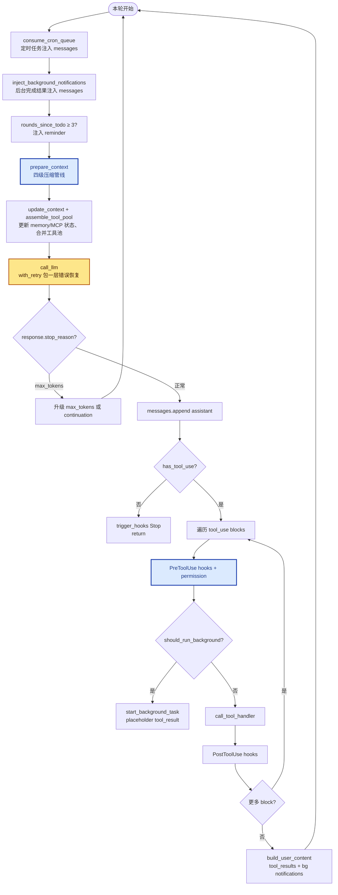
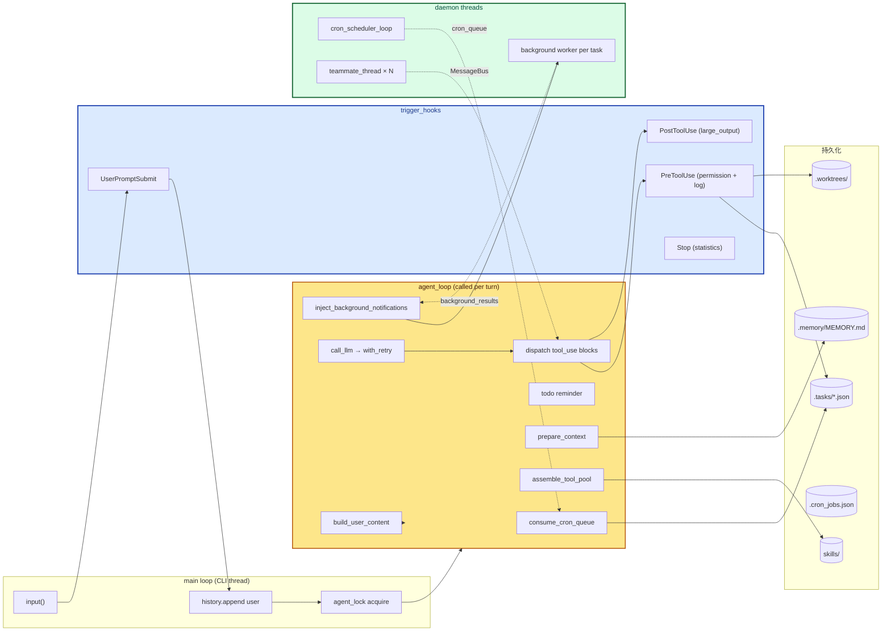

# 20 - Comprehensive Agent

> [!note]
> s01 → s19 每课只加一个机制：循环骨架、工具派发、权限、hooks、todo、子 agent、压缩、记忆、错误恢复、任务图、后台任务、cron、团队、协议、自治、worktree、MCP。教学这样做是为了**孤立地学每个零件**。但真实 Agent 不会只带一个机制跑——它要同时拥有全部。**s20 是终点章**：不发明任何新机制，把前面 19 个零件**全部装回同一个 `agent_loop`**，看清楚每个零件挂在循环的哪个位置。读完这一课，你应该能在脑子里画出一张完整的 Claude Code 结构图，并能解释每一块为什么必须存在。

## 这一步加了什么

**s20 没有新机制**。它做的事是把 s01-s19 的所有教学组件**装回同一个可运行的 harness**：

| 来自 | 组件 | 在 s20 里的形态 |
|---|---|---|
| s01 | agent loop | `while True` + `has_tool_use` + tool_result 反馈 |
| s02 | tool dispatch | 27 个工具的 BUILTIN_TOOLS + BUILTIN_HANDLERS |
| s03 | permission | 作为 `PreToolUse` hook 注册（`permission_hook`） |
| s04 | hooks | 4 个事件：UserPromptSubmit / PreToolUse / PostToolUse / Stop |
| s05 | todo_write | 工具 + `rounds_since_todo` reminder 注入 |
| s06 | subagent | `task` 工具（一次性、独立 messages[]） |
| s07 | skill | catalog 在 system prompt + `load_skill` 按需加载 |
| s08 | compact | 四级管线：tool_result_budget → snip → micro → compact_history + `compact` 工具 + reactive_compact |
| s09 | memory | `.memory/MEMORY.md` 注入 system prompt |
| s10 | system prompt | `assemble_system_prompt` 每轮重组 |
| s11 | error recovery | `RecoveryState` + `with_retry`（429 / 529 / max_tokens / prompt too long） |
| s12 | task graph | `create_task` / `list_tasks` / `claim_task` / `complete_task` |
| s13 | background | 慢 bash → daemon thread + placeholder tool_result + task_notification |
| s14 | cron | daemon scheduler + `cron_queue` + durable jobs |
| s15-s17 | teams | `spawn_teammate` + MessageBus + 协议 + 自治认领 |
| s18 | worktree | `create_worktree` + task.worktree 绑定 + `cwd` 参数 |
| s19 | MCP | `connect_mcp` + `assemble_tool_pool` 每轮合并 |

**核心代码量**：2123 行 Python（vs s01 的 ~30 行）。但**循环骨架本身**依然是那几行：

```python
while True:
    response = call_llm(messages, tools)
    if not has_tool_use(response.content):
        return
    results = execute_tools(response.content)
    messages.append({"role": "user", "content": results})
```

## 为什么需要加

**教学的代价是孤立**。s05 单独讲 todo 时，循环里没有 hooks、没有压缩、没有 MCP——你能看清楚 todo 怎么管"会话内计划"，但看不到它和 hooks 的协同。s13 单独讲 background 时，没有 cron、没有团队——你能看清楚 placeholder 模式，但看不到 background 和 task_notification 在完整循环里的位置。

**真实 Agent 必须同时拥有全部**。一个长期跑的 coding agent 会同时遇到：

- 用户突然发个新需求（→ UserPromptSubmit hook）
- 之前的 cron 到点了（→ cron_queue 注入）
- 后台 npm install 跑完了（→ task_notification 注入）
- 已经 3 轮没用 todo 了（→ reminder 注入）
- 上下文要爆了（→ prepare_context 四级压缩）
- 模型调用 429 了（→ with_retry 退避）
- 模型选了 `bash` 跑 `rm -rf` （→ PreToolUse permission_hook 拦截）
- 模型选了 `npm test`（→ should_run_background 转 daemon thread）
- 模型选了 `connect_mcp`（→ 触发下一轮 assemble_tool_pool 立即重建）
- 模型选了 `mcp__deploy__trigger`（→ permission_hook 看到 deploy 提示确认）
- 模型没 tool_use 了（→ Stop hook → return）

**s20 的存在是为了证明这些机制可以共存且不冲突**。教学版用 27 个工具 + 4 个 hook 点 + 一个 agent_loop 把它们全部装下。

## 这是一个什么机制

### 机制名称：「归位」（integration）

s20 没有给一个机制起名——它的"机制"就是**归位**本身：每个零件有自己的位置，互不打架。

可以把整个 harness 想成一条流水线，每个阶段是一个工位：



每个工位做一件**单一的事**，互不交叉。这是 s20 想传达的最重要的工程经验。

### 命名同构

- **归位 / integration**：把分散的零件按"循环时间轴"重新组织
- **流水线 / pipeline**：prepare_context 的四级压缩就是典型 pipeline
- **每个工位单一职责 / SRP**：PreToolUse 只管拦截、PostToolUse 只管后处理、dispatcher 只管派发
- **生命周期 / lifecycle**：Task 有 pending → in_progress → completed；Teammate 有 WORK ↔ IDLE → SHUTDOWN；CronJob 有 schedule → fire → (one-shot delete | recurring re-schedule)

## 原本的 Claude Code 怎么做的

CC 是 s20 的**产品化形态**。本质上 CC 就是 s20 这一套，但规模和工程深度大得多。

### CC 比 s20 多的东西

| 维度 | s20 教学 | CC 产品 |
|---|---|---|
| 工具数 | 27 | 数十个内置 + 无限 MCP |
| 工具实现 | 单文件 Python | TypeScript 模块化、每个工具独立测试 |
| hooks 注册 | `register_hook("PreToolUse", fn)` 全局字典 | `.claude/settings.json` 配置 + 命令行 hooks，每个项目独立 |
| permission | DENY_LIST + DESTRUCTIVE 黑名单 | RBAC + tool-level allowlist + 项目级 `.claude/settings.json` + `Shift+Tab` 切换模式 |
| 错误恢复 | 4 类错误（429 / 529 / max_tokens / prompt too long） | + 网络断连 + token 缓存失效 + 流式中断 + 模型路由切换 |
| 压缩 | 4 级管线（teaching 版） | + 自动摘要质量评估 + 用户可见的 compaction UI + token 计数精算 |
| MCP | 同步 mock，本地 dict | 6 种 transport（stdio / sse / http / ws / sse-ide / sdk）+ OAuth + PKCE + sub-agent 继承 |
| 子 agent | `task` 工具，独立 messages[] | `Agent` 工具 + 用户可自定义 subagent 类型（general-purpose / Explore / Plan / ...） |
| 团队 | spawn_teammate + MessageBus | （目前 CC 本身没有 exposed 这个能力，对应 SDK 才有） |
| worktree | 教学版用 dict + git CLI | `EnterWorktree` 工具 + hooks 集成 |
| 后台 | `should_run_background` keyword 匹配 | 用户显式 `run_in_background: true` + 完整的任务管理 UI（`/tasks`） |
| cron | daemon thread + durable JSON | s20 之前的教学简化；CC 真实形态是 `CronCreate` + durable + 时区感知 |
| 持久化 | `.tasks/` + `.memory/` + `.worktrees/` + `.transcripts/` | `.claude/` 目录 + 项目级配置 + 用户级配置 + 企业策略 |
| UI | terminal_print 同步打印 | 流式渲染 + IDE 集成（VS Code / JetBrains） + web（claude.ai/code） |

### CC 和 s20 共享的"魂"

无论工程深度差多少，**核心结构完全一样**：

1. **一个 `while True` 循环**
2. **每轮 LLM 前注入（cron / bg / reminder / compact）**
3. **每轮 LLM 后检查 tool_use**
4. **工具派发前 PreToolUse hook**
5. **工具派发后 PostToolUse hook**
6. **本轮无 tool_use 时 Stop hook + return**

CC 源码里也**不直接信任 `stop_reason == "tool_use"`**——而是检查响应里实际有没有 `tool_use` block。这是 s20 教学版和 CC 共同遵守的工程纪律：**真相在 messages 里，不在 stop_reason 字段里**。

## 整体逻辑

### 1. 函数关系图



### 2. 对 agent_loop 的影响（vs s19）

s20 的 `agent_loop` 是整套教程最长的一个（约 100 行），但**核心结构没有偏离 s01**：

| 阶段 | s01 | s20 |
|---|---|---|
| 循环条件 | `while True` | `while True` |
| LLM 前 | 无 | cron 注入 + bg 注入 + todo reminder + prepare_context + assemble_tool_pool |
| LLM 调用 | 直接 `client.messages.create` | `call_llm` 包装（`with_retry` + `assemble_system_prompt` + `RecoveryState`） |
| 错误处理 | try/except 顶层 | prompt too long → reactive_compact 重试；其他错误 → 写入 messages 后 return |
| max_tokens | 不处理 | 升级 → continuation prompt → 放弃 return |
| tool_use 检测 | `if response.stop_reason == "tool_use"` | `if not has_tool_use(response.content): return`（**更可靠**） |
| 工具派发 | 直接 handler | PreToolUse hook → should_run_background 分流 → call_tool_handler → PostToolUse hook |
| tool_result 写回 | `messages.append` | `build_user_content`（tool_results + background notifications 一起） |

**关键改变**：s20 把 `stop_reason == "tool_use"` 换成 `has_tool_use(response.content)`——以**实际 block 类型**为信号，不是 stop_reason 字段。CC 也这么做。原因：模型有时返回 `stop_reason="end_turn"` 但内容里有 tool_use block（罕见但存在）；以 block 为准更可靠。

### 3. 多线程并行情况

s20 至少存在 **4 类线程**：

| 线程 | 数量 | 职责 | 同步机制 |
|---|---|---|---|
| **CLI / main** | 1 | `input()` 读取用户、调用 `agent_loop`、Lead inbox 轮询 | `agent_lock`（互斥进入 agent_loop） |
| **cron_scheduler_loop** | 1（daemon） | 每秒检查 cron jobs，命中则 push 到 `cron_queue` | `cron_lock` 保护 `scheduled_jobs` |
| **background worker** | N（daemon） | 跑慢 bash，完成后写 `background_results` | `background_lock` |
| **teammate_thread** | N（daemon） | 每个 spawn_teammate 一个，独立 agent_loop | `agent_lock`（防止同时跑）、`MessageBus` 通信 |

**`agent_lock` 的作用**：同一时间只能有一个线程进入 `agent_loop`。CLI 用户、cron 自动触发、teammate 之间都通过这个锁串行化。否则 `messages` 列表会被并发写坏。

**数据竞争点**：
- `messages`（共享 history） → 锁保护
- `mcp_clients` dict → connect_mcp 写、assemble_tool_pool 读，依赖 Python GIL
- `background_tasks` / `background_results` → 显式 `background_lock`
- `scheduled_jobs` → 显式 `cron_lock`
- `.tasks/*.json` 文件 → 多 teammate 可能同时 claim 同一 task，依赖文件读写 + `can_start` 检查（教学版的 TOCTOU 防御较弱）

**任务结果回流路径**：
```
background worker → background_results[bg_id] = output
                          ↓ (next loop iteration)
inject_background_notifications → messages.append({"role": "user", ...})
                          ↓
LLM 看到 task_notification，知道之前的 bash 完成了
```

## 设计要点

### 1. 每轮重建 system prompt 和 tool pool

```python
while True:
    ...
    context = update_context(context, messages)   # memory, mcp, teammates
    tools, handlers = assemble_tool_pool()        # builtin + MCP
    response = call_llm(messages, context, tools, state, max_tokens)
    ...
```

**为什么每轮都重建**？因为运行中状态会变：

- 用户刚 `connect_mcp("deploy")` → 工具池多了 `mcp__deploy__trigger`
- 后台 teammate spawn 了 → system prompt 里多一行 active_teammates
- MEMORY.md 被改了 → 下一轮看到的记忆内容不一样

**代价**：每次 LLM 调用都要重算 system prompt（几百毫秒）+ 重组工具池（微秒级）。但相比 LLM 调用本身（几秒），这点开销忽略不计。

**取舍**：s20 不做 prompt cache（vs s10 教学）——因为 s10 的 cache 假设 system prompt 不变，但 s20 每轮都可能变（MCP / teammate / time）。**正确性 > 性能**。

### 2. 工具池作为派发器唯一入口

```python
handler = handlers.get(block.name)
output = call_tool_handler(handler, block.input, block.name)
```

无论工具来自 BUILTIN_HANDLERS 还是 MCP 的 lambda 拦截器，handler 字典统一存放。dispatcher **不关心工具来源**——只要 `assemble_tool_pool` 把它放进去，就能被调用。

这是**插件化架构的最小形态**：工具池是一个 dict，新插件只要往 dict 里加 entry。

### 3. 错误恢复用 RecoveryState 而非散落全局变量

```python
class RecoveryState:
    def __init__(self):
        self.has_escalated = False                # max_tokens 升级过吗
        self.recovery_count = 0                   # continuation 用了几次
        self.consecutive_529 = 0                  # 连续 529 次数
        self.has_attempted_reactive_compact = False  # prompt too long 紧凑过吗
        self.current_model = PRIMARY_MODEL        # 是否切到 fallback
```

每个 `agent_loop` 调用一个独立的 RecoveryState。退出后状态丢弃。**错误恢复是循环级的状态**，不是全局状态。

### 4. 后台任务用 placeholder + notification 模式

```python
if should_run_background(block.name, block.input):
    bg_id = start_background_task(block, handlers)
    output = f"[Background task {bg_id} started] Result will arrive as a task_notification."
    results.append({"type": "tool_result", "tool_use_id": block.id, "content": output})
    continue
```

慢 bash **不等**——立刻返回 placeholder。worker thread 在后台跑，完成后写 `background_results`。下一轮 `inject_background_notifications` 把结果作为 user-side content 注入 messages。

**为什么这样设计**？因为 LLM 调用是同步阻塞的——一个回合必须返回 tool_result 才能继续。如果 bash 要跑 5 分钟，主循环就会卡死。后台化让 Agent 在等 bash 期间能继续思考、回答用户。

### 5. 协议作为 Lead-Teammate 的"弱类型 RPC"

s20 的 `request_shutdown` / `request_plan` / `review_plan` 是**君子协定**——Lead 发请求、Teammate 选择性响应。没有 code-level gating 强制 Teammate 必须响应（vs 强类型 RPC 会要求必须 ack）。这让 Teammate 保持自治——可以忽略请求继续干活。

### 6. worktree 通过 `cwd` 参数隐式绑定

```python
def run_bash(command: str, cwd: Path = None, ...): ...
def run_read(path: str, ..., cwd: Path = None): ...
def run_write(path: str, content: str, cwd: Path = None): ...
```

所有文件工具都有 `cwd` 参数。Teammate 的 `wt_ctx = {"path": ...}` 会在调用时传入。**worktree 隔离不靠新建进程或 namespace，而靠每次工具调用时切换 `cwd`**——这是教学版的最小实现，真实 CC 用 git worktree（共享 .git，独立工作树）。

## 实现对照

### s20 的 agent_loop 核心（精简）

```python
def agent_loop(messages: list, context: dict):
    global rounds_since_todo
    tools, handlers = assemble_tool_pool()
    state = RecoveryState()
    max_tokens = DEFAULT_MAX_TOKENS

    while True:
        # ① LLM 前注入：cron / bg / todo reminder
        for job in consume_cron_queue():
            messages.append({"role": "user", "content": f"[Scheduled] {job.prompt}"})
        inject_background_notifications(messages)
        if rounds_since_todo >= 3:
            messages.append({"role": "user", "content": "<reminder>Update your todos.</reminder>"})
            rounds_since_todo = 0

        # ② LLM 前处理：四级压缩 + 工具池重组
        prepare_context(messages)
        context = update_context(context, messages)
        tools, handlers = assemble_tool_pool()

        # ③ LLM 调用（包了 retry + prompt 组装）
        try:
            response = call_llm(messages, context, tools, state, max_tokens)
        except Exception as e:
            if is_prompt_too_long_error(e) and not state.has_attempted_reactive_compact:
                messages[:] = reactive_compact(messages)
                state.has_attempted_reactive_compact = True
                continue
            messages.append({"role": "assistant", "content": [
                {"type": "text", "text": f"[Error] {type(e).__name__}: {e}"}]})
            return

        # ④ max_tokens 恢复：升级 → continuation → 放弃
        if response.stop_reason == "max_tokens":
            if not state.has_escalated:
                max_tokens = ESCALATED_MAX_TOKENS
                state.has_escalated = True
                continue
            messages.append({"role": "assistant", "content": response.content})
            if state.recovery_count < MAX_RECOVERY_RETRIES:
                messages.append({"role": "user", "content": CONTINUATION_PROMPT})
                state.recovery_count += 1
                continue
            return

        # ⑤ 写回 assistant + 检测 tool_use
        messages.append({"role": "assistant", "content": response.content})
        if not has_tool_use(response.content):
            trigger_hooks("Stop", messages)
            return

        # ⑥ 派发每个 tool_use block
        results = []
        for block in response.content:
            if block.type != "tool_use":
                continue
            if block.name == "compact":
                messages[:] = compact_history(messages)
                messages.append({"role": "user", "content": "[Compacted. Continue.]"})
                break

            # PreToolUse hooks（permission 在这里）
            blocked = trigger_hooks("PreToolUse", block)
            if blocked:
                results.append({"type": "tool_result", "tool_use_id": block.id, "content": str(blocked)})
                continue

            # 后台分流
            if should_run_background(block.name, block.input):
                bg_id = start_background_task(block, handlers)
                results.append({"type": "tool_result", "tool_use_id": block.id,
                                "content": f"[Background {bg_id} started. Result will arrive as notification.]"})
                continue

            # 同步派发
            handler = handlers.get(block.name)
            output = call_tool_handler(handler, block.input, block.name)
            trigger_hooks("PostToolUse", block, output)

            if block.name == "todo_write":
                rounds_since_todo = 0
            else:
                rounds_since_todo += 1

            results.append({"type": "tool_result", "tool_use_id": block.id, "content": output})

        # ⑦ tool_result + bg notifications 一起回到 messages
        messages.append({"role": "user", "content": build_user_content(results)})
```

### 27 个工具完整列表

```
基础:        bash, read_file, write_file, edit_file, glob
计划:        todo_write, task (subagent), load_skill, compact
任务图:      create_task, list_tasks, get_task, claim_task, complete_task
cron:        schedule_cron, list_crons, cancel_cron
团队:        spawn_teammate, send_message, check_inbox
协议:        request_shutdown, request_plan, review_plan
worktree:    create_worktree, remove_worktree, keep_worktree
MCP:         connect_mcp
```

## 相关概念

- [[01 - Agent Loop]] — s20 的循环骨架直接来自 s01
- [[02 - Tool Use]] — s20 的工具池扩展到 27 个
- [[03 - Permission]] — s20 把它实现为 PreToolUse hook
- [[04 - Hooks]] — s20 注册了 4 类 hook
- [[05 - TodoWrite]] — s20 加了 `rounds_since_todo` reminder
- [[06 - Subagent]] — s20 的 `task` 工具
- [[07 - Skill Loading]] — s20 在 system prompt 放 catalog
- [[08 - Context Compact]] — s20 的 `prepare_context` 四级管线
- [[09 - Memory]] — s20 注入 `.memory/MEMORY.md`
- [[10 - System Prompt]] — s20 的 `assemble_system_prompt` 每轮重组
- [[11 - Error Recovery]] — s20 的 `RecoveryState` + `with_retry`
- [[12 - Task System]] — s20 的 `.tasks/*.json`
- [[13 - Background Tasks]] — s20 的 placeholder + notification 模式
- [[14 - Cron Scheduler]] — s20 的 daemon thread + durable jobs
- [[15 - Agent Teams]] / [[16 - Team Protocols]] / [[17 - Autonomous Agents]] — s20 的 teammate + MessageBus + 自治认领
- [[18 - Worktree Isolation]] — s20 的 `cwd` 参数 + `task.worktree` 绑定
- [[19 - MCP Plugin]] — s20 的 `assemble_tool_pool` 合并 MCP 工具

> [!warning] s20 的常见误区
>
> - **"s20 是新机制"** —— 不是。s20 是**归位**。每一个零件都来自前面某一课，s20 只是把它们装回同一个循环。
> - **"27 个工具让 Agent 变复杂"** —— 工具多了，但**循环骨架没变**。`while True + has_tool_use + dispatch` 还是 s01 那几行。
> - **"agent_loop 太长，看不懂"** —— 把它拆成 7 段：① 注入 ② 准备 ③ 调用 ④ 恢复 ⑤ 检测 ⑥ 派发 ⑦ 回写。每一段做一件单一的事。
> - **"prompt cache 应该一直开"** —— s20 故意不开。因为 system prompt 每轮都变（MCP / teammate / time），开 cache 会出错。
> - **"stop_reason == 'tool_use' 就该继续"** —— 不可靠。s20 用 `has_tool_use(response.content)` 检测实际 block。CC 也这么做。
> - **"Agent 的复杂性来自模型"** —— 不。模型只负责判断和选择。复杂性来自 harness 组织环境、工具、权限、记忆、团队、外部能力的方式。
> - **"多线程只要加锁就够了"** —— 不够。`agent_lock` 保证 agent_loop 串行，但 `.tasks/*.json` 文件可能被多 teammate 同时读写，存在 TOCTOU 窗口。教学版简化了这部分。

## Q&A

### Q1: s20 的 agent_loop 大约 100 行，s01 才 30 行，"核心不变"怎么理解？

**核心结构不变**——`while True + has_tool_use + execute + append` 这个骨架从 s01 到 s20 没变。多出来的 70 行**全是挂在外围的工程代码**：注入、压缩、错误恢复、hook、background 分流。骨架本身是 5 行，外围是 95 行。CC 的 agent_loop 几百行 TypeScript，但骨架依然是那几行——只是外围挂了更多东西。

### Q2: 为什么 s20 不用 prompt cache（s10 引入过）？

s10 的 prompt cache 假设 `system` 字段在多轮调用间**不变**——这样 Anthropic API 可以缓存这个 prefix，省 token。

但 s20 的 system prompt 每轮都可能变：
- `datetime.now()` 每次不同（影响 cache key）
- `connect_mcp` 后多了 MCP 工具
- spawn_teammate 后多了 active_teammates
- 用户写了 MEMORY.md 后内容变

**正确性 > 性能**。教学版选择每轮重建 system prompt。CC 真实实现里有更精细的 cache 策略（拆成 stable / volatile 两段），但 s20 不教这个。

### Q3: `agent_lock` 会不会让 teammate 之间互相卡住？

会。`agent_lock` 保证同一时间只有一个线程进入 agent_loop。如果 3 个 teammate 同时想跑，会串行化。

教学版做了这个简化。CC 真实实现里：
- 每个 teammate 在**独立的进程**里跑（独立的 messages、独立的工具池）
- 通信通过消息总线，不共享内存状态
- Lead 和 Teammate 之间是异步消息，不是锁

s20 的 `agent_lock` 是教学版的"次优解"——用最小复杂度演示"多 agent 不能同时改 messages 列表"这个约束。

### Q4: `has_tool_use(response.content)` 和 `stop_reason == "tool_use"` 有什么区别？

理论上等价，实践中有差异：

- **`stop_reason == "tool_use"`**：API 告诉你它停下来的原因是"要调工具"。但如果 max_tokens 切到刚好切在 tool_use 块中间，stop_reason 会是 `max_tokens` 但内容里有部分 tool_use block。
- **`has_tool_use(response.content)`**：直接检查内容里有没有 `{"type": "tool_use", ...}` 块。**以实际内容为准**。

CC 也用第二种。工程纪律：**真相在 messages 里，不在 metadata 字段里**。

### Q5: s20 同时支持 todo_write 和 task graph，两者什么关系？

两者是**两个不同时间尺度的计划**：

| 维度 | todo_write | task graph |
|---|---|---|
| 生命周期 | 单会话内 | 跨会话 |
| 存储 | 内存（CURRENT_TODOS 列表） | `.tasks/*.json` 持久化 |
| 协作 | 单 agent 内 | 多 teammate 共享 |
| 依赖 | 无 | `blockedBy` 字段 |
| 认领 | 无 | `owner` 字段 |
| 用途 | 防**单 agent 漂移** | 支持**团队协作** |

简单任务用 todo_write，团队协作用 task graph。两者可以共存——Lead 用 todo_write 管自己的步骤，同时用 task graph 给 teammate 分派。

### Q6: `should_run_background` 怎么决定一个工具要不要后台化？

```python
def should_run_background(tool_name, tool_input):
    if tool_name != "bash":
        return False
    return bool(tool_input.get("run_in_background")) or is_slow_operation(tool_name, tool_input)

def is_slow_operation(tool_name, tool_input):
    command = tool_input.get("command", "").lower()
    slow_keywords = ["install", "build", "test", "deploy", "compile",
                     "docker build", "pip install", "npm install",
                     "cargo build", "pytest", "make"]
    return any(keyword in command for keyword in slow_keywords)
```

**两条路**：
1. 模型显式 `run_in_background: true`（用户/模型主动选择）
2. 命令里有 install/build/test/deploy 等 slow 关键词（自动后台化）

CC 真实实现**只走第一条**——让用户/模型显式选择。s20 教学版的"关键词自动检测"是为了演示方便，实际产品里太脆（用户跑 `npm run dev` 不会被检测，但 30 秒以上）。

### Q7: s20 的 RecoveryState 有 5 个字段，每个字段什么时候触发？

| 字段 | 触发场景 | 行为 |
|---|---|---|
| `has_escalated` | stop_reason == max_tokens 第一次 | 把 max_tokens 从 8000 升到 16000，continue |
| `recovery_count` | 升级后还 max_tokens，且 < 2 次 | append CONTINUATION_PROMPT，continue |
| `consecutive_529` | API 返回 529 overloaded | 累加，达到 2 次 → 切 fallback_model |
| `has_attempted_reactive_compact` | 抛 prompt too long 异常 | reactive_compact 后 continue，只触发一次 |
| `current_model` | consecutive_529 达阈值 | 从 PRIMARY_MODEL 切到 FALLBACK_MODEL |

每个字段都有**一次性触发**或**阈值触发**的语义——防止无限重试。RecoveryState 是 `agent_loop` 局部变量，每次调用重置。

### Q8: 学完 s20 后，下一站是哪里？

教程到此结束。**结束亦开始**：

- **想看真实产品**：clone [anthropics/claude-code](https://github.com/anthropics/claude-code)（如果开源）或读 SDK 源码
- **想自己造**：从 s20 的 2123 行开始，按需求加东西——加新工具、加新 hook、加新 transport
- **想做 MCP server**：写一个 stdio/http server 实现 `tools/list` + `tools/call`，就能被任何兼容 MCP 的 Agent（包括 CC、Cursor、Continue）调用
- **想读论文**：Anthropic 的 "Building effective agents" 博客、ToolUse 文档、Computer Use 文档

最重要的：**保持 s01 那个 `while True` 循环的心智模型**。所有复杂性都挂在这上面，不挂在模型上。
