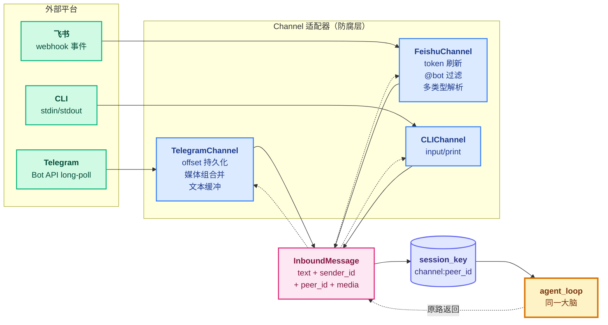
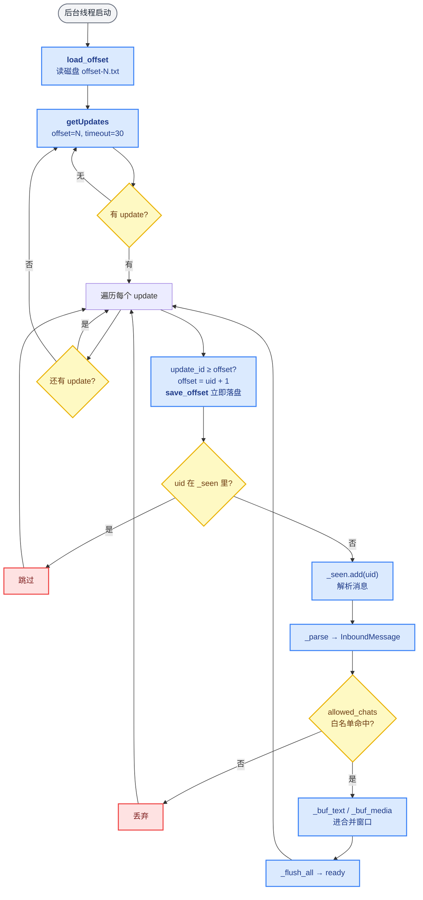
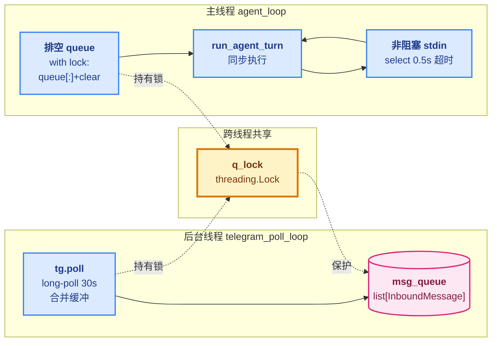

# 04 - Channels

> [!note]
> learn-claude-code 的 s01-s20 全在终端 stdin/stdout 里转——一个 `input()` 一个 `print()`，世界很简单。但真实产品级 Agent（OpenClaw / claw0）要面对 Telegram、飞书、Slack、Discord 等 N 个 IM 平台：每个平台的 API、消息格式、认证方式、限流策略都不一样。如果 agent_loop 直接 `if channel == "telegram": ...`，循环会被平台细节淹没。claw0 s04 的关键抽象是 **`InboundMessage`**——所有平台在进入循环前都先归一化成同一个 dataclass，循环只看归一化后的消息，永远不接触平台负载。"同一大脑，多个嘴巴"。

> [!warning] Phase 7 编号说明
> Phase 1-6 是 learn-claude-code 的 s01-s20（20 节）。Phase 7 切到 **claw0**（shareAI-lab），claw0 自己有 s01-s10 编号。本目录的文件名用 `04 - Channels.md`（claw0 原编号），**不是**续接 learn-claude-code 的 s04 Hooks。learn-claude-code 的 s04 在 `Phase 1 - 基础机制/04 - Hooks.md`。

## 这一步加了什么

| 新增 | 作用 |
|---|---|
| `InboundMessage` dataclass | 所有平台消息归一化的统一格式（text + sender_id + peer_id + media + raw） |
| `ChannelAccount` dataclass | 一个 bot 的配置（token + app_id 等），同通道可跑多账号 |
| `Channel` ABC | 接口契约：`receive() → InboundMessage \| None` + `send(to, text) → bool` |
| `CLIChannel` | 最小实现：`input()` + `print()` |
| `TelegramChannel` | Bot API 长轮询 + offset 持久化 + 媒体组缓冲 + 文本合并 |
| `FeishuChannel` | webhook 事件解析 + token 刷新 + @提及过滤 + 多类型消息 |
| `ChannelManager` | 注册中心：`register()` / `get(name)` / `list_channels()` |
| `telegram_poll_loop` 线程 | 后台轮询 + `queue + lock` 跨线程递交 |
| `run_agent_turn(inbound, ...)` | 与通道无关的回合入口，按 `inbound.channel` 路由回复 |

## 为什么需要加

### 1. agent_loop 不能认识平台

s01-s03 的循环假设输入是 `str`，输出也是 `str`。现在 Telegram 给你一个 `{"message": {"chat": {"id": 123}, "from": {"id": 456}, "text": "hi"}}` 嵌套字典，飞书给你 `{"event": {"message": {"content": "{\"text\":\"hi\"}"}}}`（content 还要二次 JSON 解析）。如果让循环直接吃这些负载：

```python
# 灾难现场
if channel == "telegram":
    text = payload["message"]["text"]
    chat_id = payload["message"]["chat"]["id"]
elif channel == "feishu":
    text = json.loads(payload["event"]["message"]["content"])["text"]
    chat_id = payload["event"]["message"]["chat_id"]
elif channel == "slack":
    ...
```

每加一个平台就要改循环里 N 个地方。**循环认识平台 = 强耦合 = 不可维护**。

### 2. 每个平台的"怪癖"需要被吸收掉

平台差异不只是 API 形状，还有**协议怪癖**：

- **Telegram 长粘贴会被拆成多条**：用户一次粘贴 10000 字，Telegram 拆成 5 条 message 递过来，agent 看到的是 5 个"不完整的问题"。需要 1s 静默窗口合并。
- **Telegram 媒体组**：用户一次发 5 张图，Telegram 用同一个 `media_group_id` 分 5 次 update 推过来。需要 500ms 窗口聚合。
- **飞书群聊 @过滤**：群里 100 个人说话，bot 只应该回应 @自己 的那条。需要在解析时丢弃非 @消息。
- **Telegram offset 持久化**：长轮询返回的 `update_id` 必须存盘，重启后从 `offset+1` 开始，否则会**重复处理所有历史消息**。

这些怪癖不应该泄漏到循环。Channel 的职责就是**把这些脏活全干完**，吐出一个干净的 `InboundMessage`。

### 3. 一个 Agent 要同时挂在多个平台

产品级 Agent 的常态：同一个 brain（agent_loop）同时接着 Telegram + 飞书 + CLI + Slack。用户在 Telegram 问的问题和飞书问的问题应该走同一个 agent，但会话要隔离（不能把 A 用户飞书的历史塞给 B 用户 Telegram）。

这要求：

- **输入归一化**：所有平台的消息进入同一种格式。
- **会话键统一**：`build_session_key(channel, account_id, peer_id)` 唯一标识一个会话。
- **输出回源**：回复必须从哪个通道来就回哪个通道（不能 Telegram 来的问题回在 stdout）。

## 这是一个什么机制

这是 **Hexagonal Architecture（Ports & Adapters）** + **Anti-Corruption Layer** 的经典组合：

- **Port**：`Channel` ABC 定义了"agent_loop 想要什么"（receive / send）。
- **Adapter**：`CLIChannel` / `TelegramChannel` / `FeishuChannel` 把具体平台适配到 port 上。
- **ACL**：`InboundMessage` 是防腐层，平台特定的 `raw` 字段保留原始负载（备查/调试），但**循环只看归一化字段**。



### `InboundMessage` 的字段语义

```python
@dataclass
class InboundMessage:
    text: str                    # 归一化后的纯文本（媒体组会合并 caption）
    sender_id: str               # 发送者唯一 ID（user_id / open_id）
    channel: str = ""            # "cli" / "telegram" / "feishu"
    account_id: str = ""         # 接收这条消息的 bot 账号（同通道可多 bot）
    peer_id: str = ""            # 会话范围（见下表）
    is_group: bool = False       # 群聊标志（影响 @过滤和会话隔离）
    media: list = field(...)     # 归一化后的媒体列表（type + file_id/key）
    raw: dict = field(...)       # 原始平台负载（调试用，循环不读）
```

`peer_id` 是**会话隔离的钥匙**——同一个 `peer_id` 共享一段对话历史：

| 上下文 | peer_id 格式 | 例子 |
|---|---|---|
| Telegram 私聊 | `user_id` | `482391` |
| Telegram 群组 | `chat_id` | `-1001234` |
| Telegram 话题（论坛） | `chat_id:topic:thread_id` | `-1001234:topic:88` |
| 飞书单聊 | `user_id` | `ou_abc...` |
| 飞书群组 | `chat_id` | `oc_xyz...` |
| CLI | 固定 `cli-user` | `cli-user` |

`account_id` 解决"同一通道多 bot"：你可能有 `tg-personal` 和 `tg-work` 两个 Telegram bot，它们的 token 不同但都跑在同一个进程里。

### `Channel` ABC 的契约

```python
class Channel(ABC):
    name: str = "unknown"

    @abstractmethod
    def receive(self) -> InboundMessage | None: ...

    @abstractmethod
    def send(self, to: str, text: str, **kwargs: Any) -> bool: ...

    def close(self) -> None: ...  # 可选：清理 httpx client 等
```

**关键约定**：

- `receive()` **必须非阻塞或可中断**——阻塞会让整个 REPL 卡死。CLIChannel 的 `input()` 是天然阻塞，但 TelegramChannel 把轮询放在后台线程里（见下文）。
- `send()` 返回 `bool`，失败不抛异常（让 agent_loop 决定是否重试）。
- `name` 是注册键，`ChannelManager.channels[name]` 唯一。

## TelegramChannel 的三个怪癖

这是 s04 最复杂的适配器（~180 行），吸收了 Telegram Bot API 的三个怪癖。

### 怪癖 1：长轮询 + offset 持久化

Telegram 的 `getUpdates` 是 HTTP long-poll：调用后服务器挂起最多 30 秒，有消息就立刻返回。**每次成功处理一个 update，下次调用必须传 `offset = update_id + 1`**，否则同一条消息会被反复推送。



两个细节值得注意：

- **`_seen` 集合**：即便 offset 正确，Telegram 偶尔会重推。`_seen` 是去重的第二道防线，超过 5000 条会清空（防止内存膨胀）。
- **offset 立即落盘**：每收到一个 update 就写一次 `.state/telegram/offset-{account_id}.txt`。如果批量写（等 100 条再写），崩溃会丢 offset → 重启后重处理。

### 怪癖 2：媒体组 500ms 窗口

用户一次发 5 张图 + 一段说明文字。Telegram 会用同一个 `media_group_id` 把它们拆成 5 个独立的 `update`，每个携带一张图和（可能）一段 caption。如果按 update 逐条进 agent，会触发 5 个回合，每个看到一张图，模型完全无法理解。

```python
def _buf_media(self, msg, update):
    mgid = msg["media_group_id"]
    if mgid not in self._media_groups:
        self._media_groups[mgid] = {"ts": time.monotonic(), "entries": []}
    self._media_groups[mgid]["entries"].append((msg, update))

def _flush_media(self):
    # 收集 ts 距今 ≥ 0.5s 的所有组
    expired = [k for k, g in self._media_groups.items()
               if (now - g["ts"]) >= 0.5]
    for mgid in expired:
        entries = self._media_groups.pop(mgid)["entries"]
        # 合并所有 caption、收集所有 file_id
        # 产出一个 InboundMessage（text = "\n".join(captions)）
```

**500ms 是 Telegram 推送媒体组的最坏延迟**——同一组的所有 update 一定在 500ms 内全部到达。窗口太短会漏条，太长会让用户感觉延迟。

### 怪癖 3：文本 1s 静默合并

Telegram 把长粘贴拆成多条 `message`，**每条都是独立的 update**，但语义上是"用户一次发言"。1s 静默窗口（用户停止打字 1 秒）作为合并边界：

```python
def _buf_text(self, inbound):
    key = (inbound.peer_id, inbound.sender_id)
    if key in self._text_buf:
        self._text_buf[key]["text"] += "\n" + inbound.text
        self._text_buf[key]["ts"] = now  # 重置计时器
    else:
        self._text_buf[key] = {"text": inbound.text, "msg": inbound, "ts": now}
```

注意 `ts` 在每次追加时**重新计起**——只要用户还在发，窗口就一直延长。1s 静默后才 flush，相当于"用户打字停下来了"的信号。

### 这三个怪癖的共同模式

**缓冲 + 时间窗口合并**。所有 IM 平台都有类似问题（飞书会拆长消息、Slack 也有 typing indicator）。s04 把这套机制封装在 `TelegramChannel` 内部，对外只暴露干净的 `InboundMessage`——循环看不到任何合并细节。

## 飞书 Channel 的两个怪癖

### 怪癖 1：tenant_access_token 需要刷新

飞书的 API 不接受 app_secret 直接调用，必须先用 app_id + app_secret 换一个 `tenant_access_token`，**有效期 2 小时**。每次发送前检查 token 是否过期：

```python
def _refresh_token(self):
    if self._tenant_token and time.time() < self._token_expires_at:
        return self._tenant_token  # 还有效
    resp = self._http.post(f"{self.api_base}/auth/v3/tenant_access_token/internal",
                           json={"app_id": ..., "app_secret": ...})
    self._tenant_token = resp.json()["tenant_access_token"]
    # 提前 5 分钟过期，避免临界竞争
    self._token_expires_at = time.time() + expire - 300
    return self._tenant_token
```

**提前 300 秒过期**——避免 token 在请求飞行途中过期导致 401。

### 怪癖 2：群聊只回应 @bot

飞书群消息事件会把所有消息推给 bot（不管有没有 @）。`_bot_mentioned()` 检查 `event.message.mentions` 里有没有自己：

```python
if is_group and self._bot_open_id and not self._bot_mentioned(event):
    return None  # 群里没 @ 我，直接丢弃
```

CLI / Telegram（私聊）天然不需要这个过滤，所以只在飞书群聊路径上跑。

## 并发模型：后台线程 + 共享队列

Telegram 是 long-poll（会阻塞 30 秒），如果放在主线程的 REPL 循环里，用户输入会卡死。claw0 的解法是**一个独立线程 + 一个 list 队列 + 一个锁**：



主循环每轮做的事（伪代码）：

```python
while True:
    # 1. 排空 Telegram 队列（持锁）
    with q_lock:
        tg_msgs = msg_queue[:]
        msg_queue.clear()
    for m in tg_msgs:
        run_agent_turn(m, conversations, mgr)  # 同步处理

    # 2. 看看 stdin 有没有输入（非阻塞 0.5s）
    if tg_channel:
        if not select.select([sys.stdin], [], [], 0.5)[0]:
            continue  # 0.5s 内没输入，回去排空 queue
        user_input = sys.stdin.readline().strip()
    else:
        # 没开 Telegram，CLI 可以阻塞
        msg = cli.receive()
        ...

    # 3. 处理 CLI 输入
    run_agent_turn(InboundMessage(text=user_input, channel="cli", ...), ...)
```

注意三个设计：

1. **`select.select([sys.stdin], [], [], 0.5)`** 是非阻塞读 stdin 的标准 POSIX 写法——把 stdin 当成文件描述符 poll。这让主循环能在"等待用户输入"和"处理 Telegram 队列"之间轮询。
2. **`queue[:] + clear()` 是原子的**（在锁内），不会丢消息。
3. **`run_agent_turn` 是同步的**——Telegram 消息一条一条处理。如果有 100 条堆积，最后一条要等前 99 条处理完。**这是 s04 的限制**，s10 Concurrency 会用命名 lane 解决。

## 实现对照（claw0/zh/s04_channels.py）

### 注册阶段（main → agent_loop 开头）

```python
mgr = ChannelManager()
mgr.register(CLIChannel())  # CLI 永远开

tg_token = os.getenv("TELEGRAM_BOT_TOKEN", "").strip()
if tg_token and HAS_HTTPX:
    acc = ChannelAccount(channel="telegram", account_id="tg-primary",
                         token=tg_token,
                         config={"allowed_chats": os.getenv("TELEGRAM_ALLOWED_CHATS", "")})
    mgr.accounts.append(acc)
    tg = TelegramChannel(acc)
    mgr.register(tg)
    # 启动后台轮询线程
    threading.Thread(target=telegram_poll_loop, daemon=True,
                     args=(tg, msg_queue, q_lock, stop_event)).start()

fs_id = os.getenv("FEISHU_APP_ID", "").strip()
if fs_id and ...:
    mgr.register(FeishuChannel(...))
```

**"有配置才注册"**——通道是 opt-in 的，没配置 token 就不存在。这避免了 `ImportError`（用户没装 httpx）和启动崩溃（token 无效）。

### 回合入口（run_agent_turn）

```python
def run_agent_turn(inbound, conversations, mgr):
    sk = build_session_key(inbound.channel, inbound.account_id, inbound.peer_id)
    conversations.setdefault(sk, [])
    messages = conversations[sk]
    messages.append({"role": "user", "content": inbound.text})

    # Telegram 打字指示器（非阻塞 send_typing）
    if inbound.channel == "telegram":
        tg = mgr.get("telegram")
        if isinstance(tg, TelegramChannel):
            tg.send_typing(inbound.peer_id.split(":topic:")[0])

    while True:
        response = client.messages.create(...)
        messages.append({"role": "assistant", "content": response.content})

        if response.stop_reason == "end_turn":
            text = "".join(b.text for b in response.content if hasattr(b, "text"))
            ch = mgr.get(inbound.channel)  # 按来源通道路由回去
            if ch:
                ch.send(inbound.peer_id, text)
            break
        elif response.stop_reason == "tool_use":
            # ... 分发工具
```

**关键三行**：

1. `build_session_key(channel, account_id, peer_id)` → 会话隔离。
2. `mgr.get(inbound.channel)` → **回复按来源通道发回去**（Telegram 来的问题不会 print 到 stdout）。
3. `tg.send_typing(...)` → 长任务时给用户"正在打字"反馈（Telegram 的 chat action）。

## OpenClaw 生产代码的对应

| 方面 | claw0（本节） | OpenClaw 生产 |
|---|---|---|
| `Channel` ABC | `receive() + send()` 两方法 | 相同接口 + 生命周期钩子（on_connect / on_disconnect） |
| 平台数 | CLI / Telegram / 飞书（3 个） | 10+（含 Slack / Discord / 钉钉 / WhatsApp） |
| 并发模型 | 每通道一个线程 + 共享 list | 相同线程模型 + 异步 gateway（aiohttp / FastAPI） |
| 消息格式 | `InboundMessage` dataclass | 相同的统一类型（+ 事件类型字段：message / edit / reaction） |
| offset 存储 | 纯文本 `offset-{id}.txt` | 带版本号 JSON + 原子写入（防崩溃损坏） |
| 白名单 | `allowed_chats: str → set` | DB 查询 + 动态权限策略 |
| 媒体 | `media: list[dict]` | 上传到对象存储 + 引用 URL（避免 file_id 过期） |
| 错误恢复 | `try/except` 单层 | s09 三层重试洋葱（auth profile 轮换） |

## 设计要点

### 1. ABC 的方法要少

`Channel` 只有 `receive` + `send` 两个抽象方法。如果加 `send_typing`、`send_image`、`edit_message`、`delete_message`，每加一个平台都要实现 N 个方法。claw0 的做法是：

- **核心契约**：`receive` / `send` / `close`（所有通道必须实现）。
- **扩展能力**：`send_typing` 等放在具体类上（`isinstance(tg, TelegramChannel)` 判断）。
- **牺牲了**：多态——`run_agent_turn` 里要 `if inbound.channel == "telegram"` 这种判断。

**OpenClaw 的做法**：扩展方法在 ABC 里提供默认实现（默认 no-op），具体类按需 override。这避免了 isinstance 但保留了可扩展性。

### 2. `raw` 字段是逃生通道

`InboundMessage.raw` 保留了原始平台负载。正常情况循环不读它，但调试时（"为什么这条消息解析出来 text 是空？"）可以直接 dump raw 看。这是"防腐层但有破窗"的设计——归一化是默认，原始数据是备查。

### 3. 白名单是安全底线

```python
if self.allowed_chats and inbound.peer_id not in self.allowed_chats:
    continue
```

如果 bot token 泄漏，攻击者可以直接给 bot 发消息触发工具调用（memory_write、bash 等）。`TELEGRAM_ALLOWED_CHATS` 是最后一道防线——只处理白名单里的 chat_id。**OpenClaw 把这个升级成了 DB 里的动态白名单 + 用户角色**。

### 4. 非阻塞读 stdin 的代价

`select.select([sys.stdin], [], [], 0.5)` 让主循环不卡死，但**每 0.5 秒唤醒一次**做无效轮询。在纯 CLI 模式（没开 Telegram）下，claw0 退化成阻塞 `input()` 省掉这个开销。这个分支选择写在主循环里而不是 channel 内部，是因为**这是主循环的调度策略**，不是通道的职责。

## 相关概念

- **前置**：`[[03 - Sessions]]`（claw0 s03）—— `build_session_key` 复用了 s03 的会话存储。
- **后继**：`[[05 - Gateway & Routing]]`（claw0 s05）—— s04 是"通道平铺"，s05 把多通道 + 多 agent 通过 5 级路由连起来。
- **learn-claude-code 对照**：`[[03 - Permission]]`（learn s03）—— 权限是工具层的安全，通道白名单是入口层的安全，两层正交。
- **同源机制**：`[[07 - Skill Loading]]` 的 manifest 模式——skill catalog 是"能力清单"，ChannelManager 是"通道清单"，都是"注册中心 + 按需查找"。

> [!warning]
> 三个容易踩的坑：
>
> 1. **offset 不立即落盘**：批量写 offset 看起来是性能优化，但崩溃后重启会**重复处理 N 条历史消息**，对用户是灾难。每条立即 fsync 才是正确做法。
> 2. **媒体组窗口选错**：窗口太短（< 300ms）会漏 update，太长（> 2s）会让用户感觉 bot 卡顿。500ms 是 Telegram 实测的合理上界，**不要随便改**。
> 3. **跨线程共享 dict 不加锁**：`conversations` 是主线程独占的，但 `msg_queue` 跨线程——必须用 `q_lock`。如果图省事用 `queue.Queue` 也可以，但 `queue.get()` 是阻塞的，与"非阻塞 stdin"配合需要 `block=False, timeout=0`。
