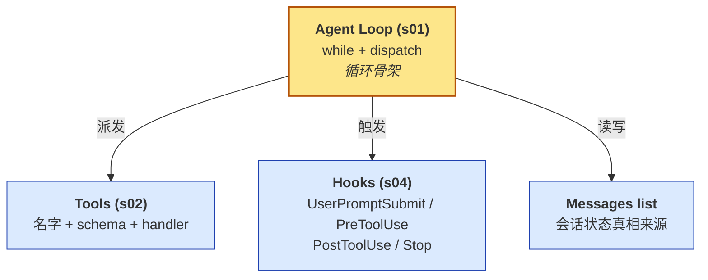

# Claude Code --- 一个 Agent Harness 的解剖

这一文件夹的笔记**只关注一个特定实现**：Anthropic 官方 CLI **Claude Code** 的开源复刻教程 [shareAI-lab/learn-claude-code](https://github.com/shareAI-lab/learn-claude-code)。每一个 phase 都按"原教程顺序"展开，逐课讲解**它每一课加的是什么、为什么加、这是什么机制、原本的 Claude Code 是怎么做的**。

## 这套笔记的主线

一个 LLM Agent 长成什么样，主要由四个接口决定：



**所有后续扩展（Phase 2 - 6）都是往这四个接口上挂东西**：

- 加工具 → 进 TOOLS / TOOL_HANDLERS
- 加扩展点 → 进 HOOKS
- 加上下文处理 → 操作 messages
- 加新行为 → 组合上面三个

循环骨架本身**从 s01 到 s20 基本不变**。这是这套教程最想传达的工程经验。

## Phase 划分

| Phase | 课程 | 主题 | 核心问题 | 状态 |
|---|---|---|---|---|
| Phase 1 | s01 - s04 | 基础机制 | 最小骨架长什么样？ | done |
| Phase 2 | s05, s06, s08 | 上下文治理 | 怎么跑长任务不爆？ | done |
| Phase 3 | s09 - s11 | 长期记忆与系统提示 | 怎么跨会话连续？ | done |
| Phase 4 | s12 - s14 | 任务编排 | 怎么跑后台/定时任务？ | todo |
| Phase 5 | s15 - s18 | 多智能体 | 怎么让多个 Agent 协作？ | todo |
| Phase 6 | s07, s19, s20 | 生态与整合 | 怎么接入外部世界？ | s07 done / s19 s20 todo |

## 阅读顺序

**强烈建议按 Phase 顺序读**。每个 Phase 都建立在前一个之上：

1. **Phase 1** 先读 `00 - 综合总结.md`，再按编号顺序读各课。
2. **Phase 2** 同样先读 `00 - 综合总结.md`，理解三课为什么放一起。
3. **对话精华 QA** 是学习过程的卡点记录，遇到具体疑问时翻。

## 每篇笔记的固定结构

```
---
type: concept                    ← Obsidian frontmatter
status: seed
---
# 课题名

> [!note]                        ← 一段话讲"它是什么、解决什么问题、为什么值得学"

## 这一步加了什么                ← 四个核心问题的回答
## 为什么需要加
## 这是一个什么机制               ← 类比、同构概念、命名
## 原本的 Claude Code 怎么做的    ← 产品化形态对照
## 设计要点                       ← 工程经验
## 实现对照                       ← 简化代码放在末尾
## 相关概念                       ← Obsidian 双链
> [!warning]                     ← 易踩坑
```

## 取舍声明

这套笔记**不是**：

- 不是 API 文档翻译（看 [Anthropic 官方文档](https://docs.anthropic.com/) 更准）。
- 不是逐行源码注释（看原仓库代码更直接）。
- 不教你如何安装、运行（[原仓库 README](https://github.com/shareAI-lab/learn-claude-code) 已经写得很清楚）。

它是**一份心智模型笔记**。读完之后，你应该能在脑子里画出 Claude Code 的结构图，并能解释每一块为什么必须存在。
