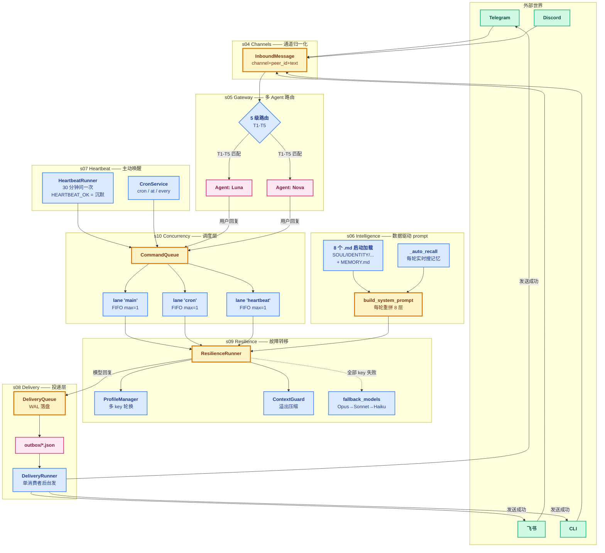

# Phase 7 综合总结 --- 常驻 Agent

> [!note]
> learn-claude-code（Phase 1-6）教的是"Agent 在一个终端里跑"——单 key、单 model、用户在场、失败就报错。Phase 7 的 7 节（s04-s10）合起来回答一个问题：**"怎么把 CLI Agent 推进成产品级常驻服务？"** 7 个答案：多通道接入（s04）、5 级路由（s05）、智能 prompt 组装（s06）、心跳与 cron（s07）、可靠投递（s08）、故障转移（s09）、并发治理（s10）。**共同主题：让 Agent 从"被动响应用户"进化成"7×24 自治系统"**。

## 为什么 Phase 7 是"常驻 Agent"

Phase 1-6 的 Agent 有 7 个不满足常驻服务需求的点：

1. **只能从 CLI 接输入** → 用户必须在终端里——但 IM bot 需要从 Telegram / Discord / 飞书接消息
2. **单 Agent 单对话** → 一个进程只能服务一个用户——但 IM bot 要服务多人
3. **prompt 写死在代码里** → 改性格要改代码——但生产 agent 需要按数据驱动
4. **用户不在场就静止** → 半夜 3 点出事没人管——但 IM bot 要主动汇报
5. **发送失败消息就丢** → 网络抖一下用户没收到回复——但 IM bot 必须保证投递
6. **LLM 调用失败就崩** → API 限流 / key 失效直接挂——但 IM bot 必须 7×24 在线
7. **后台任务和用户对话互相阻塞** → cron 跑 30s 用户等 30s——但 IM bot 必须随时响应

Phase 7 的 7 节**一一对应**这 7 个问题：

| 节 | 解决什么 | 机制 |
|---|---|---|
| s04 Channels | 多通道接入 | InboundMessage 归一化 + Channel ABC |
| s05 Gateway & Routing | 多 Agent 多对话 | 5 级路由 + BindingTable |
| s06 Intelligence | 数据驱动 prompt | workspace/*.md 启动加载 + hybrid memory |
| s07 Heartbeat & Cron | 主动唤醒 | 心跳（agent 决定沉默） + cron（按契约执行） |
| s08 Delivery | 可靠投递 | WAL 队列 + 原子写入 + 退避重试 |
| s09 Resilience | 故障转移 | 多 key 轮换 + 模型 fallback + 上下文压缩 |
| s10 Concurrency | 并发治理 | 命名 lane + FIFO 队列 + generation |

## 整体架构图（完整 claw 设计链路）



## 完整请求-响应链路（用户发一条消息的全过程）

下面用**一个具体场景**串起所有 7 层：用户在 Telegram 发"你好 Luna"。

### Step 1: 接入（s04 Channels）

```
Telegram → 后台线程收到 update → 解析成
InboundMessage(
    channel="telegram",
    peer_id="telegram:98765432",
    account_id="@luna_bot",
    text="你好 Luna",
    ts=1718956200.123
)
→ 投到 tg_msg_queue
```

**关键**：`InboundMessage` 把所有平台差异折叠掉——上面这一步对 Telegram / 飞书 / CLI 完全等价。详见 [[04 - Channels]]。

### Step 2: 路由（s05 Gateway）

```
InboundMessage → resolve_route(bindings)
  → 匹配 binding: {peer_id: "telegram:98765432", agent_id: "luna-personal"}
  → 返回 agent_id = "luna-personal"
→ AgentManager 获取 Luna 的 workspace + sessions
```

**关键**：5 级路由表决定"这条消息归哪个 agent 处理"。Luna 和 Nova 可以共用一个进程但完全隔离。详见 [[05 - Gateway & Routing]]。

### Step 3: 入队（s10 Concurrency）

```
agent_loop 拿到 InboundMessage
→ cmd_queue.enqueue(LANE_MAIN, _make_user_turn(msg))
→ Future 返回（agent_loop 等结果）

LaneQueue:
  - deque 里加入 (fn, future, gen=0)
  - _pump() 立刻启动 _run_task 线程
```

**关键**：用户消息进 `lane 'main'` 串行处理；同时 `lane 'cron'` / `lane 'heartbeat'` 完全独立跑——不互相阻塞。详见 [[10 - Concurrency]]。

### Step 4: 拼 system prompt（s06 Intelligence）

```
_run_task 调 run_agent_turn
→ build_system_prompt
  - load_evergreen: 读 MEMORY.md 全量
  - load_soul / load_identity / load_tools / ...
  - _auto_recall("你好 Luna"): 搜 daily/*.jsonl 找相关记忆
  - 拼 8 层 prompt
→ messages = [{"role": "user", "content": "你好 Luna"}]
→ 调 ResilienceRunner.run(system, messages, tools)
```

**关键**：每轮**实时重拼** prompt——记忆可能上一轮刚写入，缓存会漏。详见 [[06 - Intelligence]]。

### Step 5: 调 LLM（s09 Resilience）

```
ResilienceRunner.run 三层洋葱:

【外层】多 key 轮换
  for _rotation in profiles:
    profile = select_profile()
    try _run_attempt(...):
      【中层】ContextGuard
        if tokens > SAFE_LIMIT:
          compact_history(messages)
      【内层】调 LLM
        response = client.messages.create(...)
        while stop_reason == "tool_use":
          process_tool_call(...)
          response = client.messages.create(...)
        return response
    except exc:
      classify_failure(exc)
      if overflow: compact + 重试
      else: mark_failure → 换 key

  【fallback】主 key 全失败
    for fallback_model in ["sonnet", "haiku"]:
      重置 rate_limit/timeout 罚站
      重试 _run_attempt
```

**关键**：LLM 调用包三层保险——多 key、压缩、fallback model。用户完全感知不到故障。详见 [[09 - Resilience]]。

### Step 6: 入投递队列（s08 Delivery）

```
模型回复："你好！今天怎么样？"
→ chunk_message 切块（如果太长）
→ for chunk in chunks:
    queue.enqueue(QueuedDelivery(
        channel="telegram",
        to="98765432",
        text="你好！今天怎么样？",
        retry_count=0,
        ...
    ))
→ 原子写入: outbox/{id}.json
→ await asyncio.sleep(0) 让 DeliveryRunner 有机会发
```

**关键**：**先写磁盘再尝试发**——WAL 模式保证消息不丢。即使进程崩了，重启后 DeliveryRunner 还能从磁盘恢复。详见 [[08 - Delivery]]。

### Step 7: 后台投递（s08 Delivery）

```
DeliveryRunner 后台线程（每秒 tick）:
  entries = load_pending(outbox)   # 按 next_retry_at 排序
  for entry in entries:
    try:
      channel.send(entry.to, entry.text)
      queue.ack(entry.id)  → 删除 outbox/{id}.json
    except exc:
      queue.fail(entry.id, exc)
      → retry_count += 1
      → next_retry_at = now + backoff[jitter]
      → if retry_count >= MAX: move_to_failed
```

**关键**：**单消费者后台发**——3 个生产者（agent / heartbeat / cron）都进同一队列，但只有 1 个 runner 在发，避免 LLM 限流。详见 [[08 - Delivery]]。

### Step 8: Telegram 用户收到消息

```
Telegram API 返回 200 OK
→ ack 删除 outbox/{id}.json
→ Future.set_result（如果 enqueue 时注册了 callback）
→ 用户在 Telegram 看到 "你好！今天怎么样？"
```

**总耗时**：典型 ~2-3 秒（LLM 1-2s + 投递 0.5s）。用户**完全感知不到**后台经历了：路由 / 入队 / 拼 prompt / 3 层重试 / 落盘 / 后台发送。

---

## 心跳和 cron 在这个链路里怎么跑

### 心跳（HeartbeatRunner）

```
后台线程每 30 分钟触发：
  → 读 HEARTBEAT.md
  → 检查 lane 'heartbeat' 是否空闲
  → 入队 lane 'heartbeat' 跑一轮 LLM
  → LLM 决定:
      - 回 "HEARTBEAT_OK" → 沉默（不入 messages，不投递）
      - 回真实报告 → 入投递队列 → 用户在 Telegram 收到
```

**心跳的独立性**：跑在独立 lane、用独立 messages、不抢用户路径的锁。即使心跳跑 1 分钟，用户消息照样能立刻处理。

### cron（CronService）

```
cron-tick 线程每秒检查 CRON.json:
  for job in jobs:
    if now >= job.next_run_at:
      _enqueue_job → 入队 lane 'cron' 跑一轮 LLM
      → 模型输出 → 入投递队列 → 用户收到
```

**跟心跳的对比**：
- 心跳：探询式（agent 决定沉默）
- cron：承诺式（到点必有输出）

详见 [[07 - Heartbeat & Cron]]。

---

## 7 层的设计哲学

### Layer 1-2（接入 + 路由）：折叠外部差异

**核心**：InboundMessage 把所有平台差异折叠成统一格式；BindingTable 把所有路由规则折叠成统一表。**外部世界再复杂，内部看到的只有 InboundMessage + agent_id**。

### Layer 3（Intelligence）：折叠数据与代码

**核心**：8 个 .md 文件让"改 agent 性格 / 知识 / 行为" = 改 markdown，不用改代码。**数据驱动**让非程序员也能调 agent。

### Layer 4（Heartbeat & Cron）：折叠时间维度

**核心**：让 agent 从"被动响应"变成"主动行动"。心跳让 agent 有**沉默权**（不是每次醒都要说话），cron 让 agent 有**契约性**（到点必跑）。

### Layer 5-7（Delivery + Resilience + Concurrency）：折叠故障

**核心**：这 3 层都是"故障的兜底"。
- Delivery：消息必达（投递层兜底）
- Resilience：调用必通（LLM 层兜底）
- Concurrency：任务必序（调度层兜底）

**3 层一起构成"故障透明化"**——用户看到的永远是"发消息 → 等几秒 → 收回复"，感知不到背后经历了多少次重试 / 切换 / 排队。

---

## 跟 learn-claude-code 的关系

| 维度 | learn-claude-code (Phase 1-6) | claw0 (Phase 7) |
|---|---|---|
| **场景** | CLI 单次任务 | 常驻 IM bot |
| **用户** | 在场 | 可不在场 |
| **运行时长** | 分钟级 | 7×24 |
| **失败容忍** | 报错让用户重跑 | 必须自愈 |
| **多通道** | ✗ | ✓（s04） |
| **多 agent** | ✗ | ✓（s05） |
| **prompt 来源** | 代码写死 | workspace/*.md（s06） |
| **主动行为** | ✗ | 心跳 + cron（s07） |
| **消息必达** | ✗ | WAL 队列（s08） |
| **多 key** | ✗ | ProfileManager（s09） |
| **任务调度** | agent_lock 互斥 | LaneQueue（s10） |

**learn-claude-code 是骨架，claw0 是肌肉**。骨架不变（agent_loop / tool_use / memory），肌肉长出来（多通道 / 多 agent / 心跳 / 投递 / 韧性 / 并发）。

---

## PuinClaw 落地：差距清单

学完 Phase 7，下一步是 PuinClaw（基于 pi-mono 改造）。当前 PuinClaw 进度 vs claw0 设计：

| claw0 抽象 | PuinClaw 现状 | 差距 |
|---|---|---|
| s04 Channels | ✓（单通道 Slack） | 想加 Telegram / 飞书需要扩 |
| s05 Gateway & Routing | ✗（单 agent 单 bot） | 想多 agent 需要全做 |
| s06 Intelligence | 部分（agent.ts 拼 prompt） | 缺 _auto_recall 实时搜记忆 |
| s07 Heartbeat & Cron | 部分（eventsWatcher） | 缺 HEARTBEAT.md + 真正 cron |
| s08 Delivery | ✗（Slack SDK 直接发） | 缺 WAL 投递队列 |
| s09 Resilience | ✗（单 key env） | 缺 ProfileManager 多 key |
| s10 Concurrency | ✗（单实例） | 缺 LaneQueue |

**这就是接下来要逐步迁移的内容**——Phase 7 学完不是终点，是 PuinClaw 真正落地的起点。

参考 [[../../PUINCLAW-SETUP]]（如果在 pi-mono-main 目录）或本地路径 `/Users/mr.puin/LLMLearning/Agent/pi-mono-main/PUINCLAW-SETUP.md` 看当前 PuinClaw 状态。

---

## 7 节阅读顺序（推荐）

如果刚进 Phase 7，按这个顺序最顺：

1. **s04 Channels** —— 看 InboundMessage 怎么把平台差异折叠掉
2. **s05 Gateway & Routing** —— 看多 agent 怎么路由（注意：教学版多 agent 没真用上，重点看抽象）
3. **s06 Intelligence** —— 看 prompt 怎么从磁盘 + 记忆实时组装（**Phase 7 的灵魂**）
4. **s07 Heartbeat & Cron** —— 看 agent 怎么"自己醒来"
5. **s08 Delivery** —— 看消息怎么保证不丢
6. **s09 Resilience** —— 看 LLM 调用怎么不挂
7. **s10 Concurrency** —— 看任务怎么不互相踩

最后回到本综合总结，把 7 层在脑子里串成一张图。

---

## 数据样例参考

读笔记遇到不熟悉的数据文件，去 [`../数据样例/`](../数据样例/) 看：

- **workspace 配置文件**：[`数据样例/01 - workspace 配置文件`](../数据样例/01%20-%20workspace%20配置文件.md)（SOUL.md / HEARTBEAT.md / MEMORY.md 等 8 个）
- **CRON 调度**：[`数据样例/02 - CRON 调度配置`](../数据样例/02%20-%20CRON%20调度配置.md)
- **会话持久化**：[`数据样例/03 - 会话持久化`](../数据样例/03%20-%20会话持久化.md)
- **投递队列**：[`数据样例/04 - 投递队列`](../数据样例/04%20-%20投递队列.md)
- **AuthProfile**：[`数据样例/05 - AuthProfile 状态`](../数据样例/05%20-%20AuthProfile%20状态.md)
- **路由绑定**：[`数据样例/06 - 路由绑定`](../数据样例/06%20-%20路由绑定.md)

---

## 相关

- [[04 - Channels]] / [[05 - Gateway & Routing]] / [[06 - Intelligence]] —— 前 3 节（接入 + 路由 + 智能）
- [[07 - Heartbeat & Cron]] / [[08 - Delivery]] / [[09 - Resilience]] / [[10 - Concurrency]] —— 后 4 节（自治 + 韧性）
- [[../对话精华 QA/对话精华]] —— 42 条 Q&A 跨笔记精华
- [`../数据样例/`](../数据样例/) —— 数据文件样例集
- [`../claw0/`](../claw0/) —— claw0 源码（submodule）
- learn-claude-code 的 [[../../Learn-Claude-Code/Phase 4 - 长时间任务/00 - 综合总结|Phase 4 综合总结]]—— 跟 Phase 7 对照（CLI 长任务 vs 常驻服务）

---

## 学完之后做什么

读完 Phase 7，**真正去 PuinClaw 落地**：

1. 先跑通 PuinClaw 基础版（env + pm2 + Slack 模式，详见 PUINCLAW-SETUP.md）
2. 按"差距清单"选最痛的 1-2 项迁移（推荐先做 [[06 - Intelligence|_auto_recall]] —— 最容易加，价值最大）
3. 边迁移边对照 Phase 7 笔记——claw0 是设计蓝图，PuinClaw 是工程实现

**Phase 7 不是终点，是 PuinClaw 真正开始的起点。**
