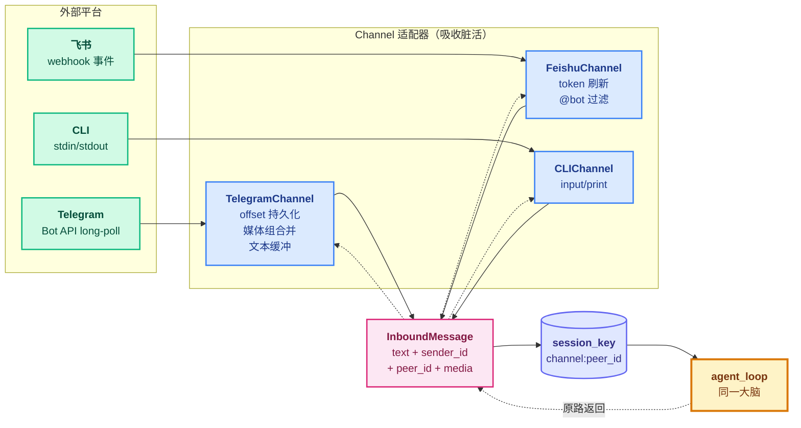
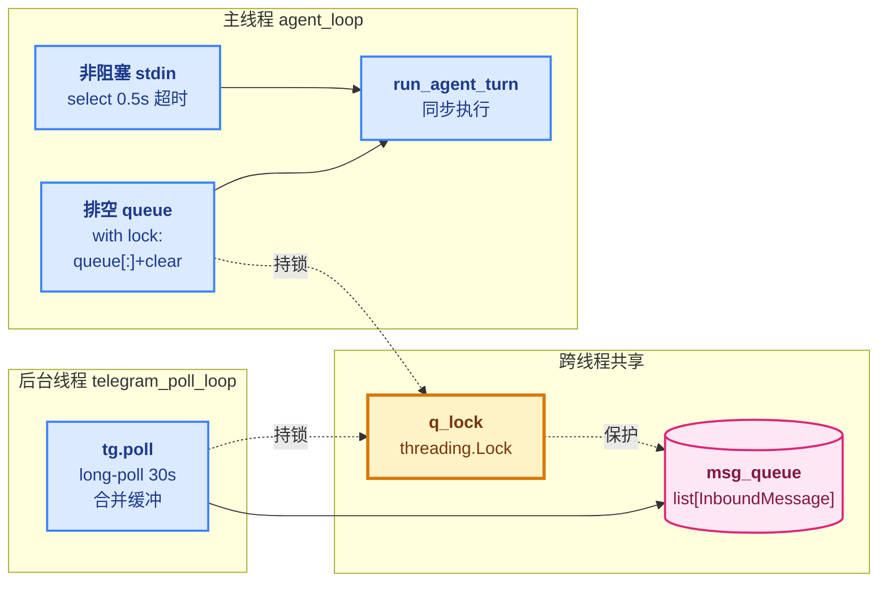

# 04 - Channels

> [!note]
> learn-claude-code 的 s01-s20 全在终端 stdin/stdout 里转——一个 `input()` 一个 `print()`。但真实产品级 Agent 要面对 Telegram、飞书、Slack 等 N 个 IM 平台：API、消息格式、认证方式、限流策略各不相同。如果 agent_loop 直接 `if channel == "telegram": ...`，循环会被平台细节淹没。s04 的核心抽象是 **`InboundMessage`**——所有平台在进入循环前都先归一化成同一个 dataclass，循环只看归一化后的消息，永远不接触平台负载。"同一大脑，多个嘴巴"。

> [!warning] Phase 7 编号说明
> Phase 1-6 是 learn-claude-code 的 s01-s20（20 节）。Phase 7 切到 **claw0**（shareAI-lab），claw0 自己有 s01-s10 编号。本目录文件名用 `04 - Channels.md`（claw0 原编号），**不是**续接 learn-claude-code 的 s04 Hooks。

## 这节重点关注

读完这节，你应该能在脑子里答出这 5 个问题：

1. **入口契约**：`InboundMessage` 是什么？为什么所有平台都要归一化成它？（→ [核心抽象](#核心抽象)）
2. **通道接口**：`Channel` ABC 只有哪两个方法？加新平台要做什么？（→ [核心抽象](#channel-abc-与-channelmanager)）
3. **会话隔离**：`peer_id` 怎么编码会话范围？多通道下怎么保证 A 用户飞书的历史不串到 B 用户 Telegram？（→ [核心抽象](#inboundmessage-字段语义)）
4. **并发模型**：为什么 Telegram 长轮询不能放主线程？后台线程 + 队列 + 锁怎么配合？（→ [并发模型](#并发模型后台线程--共享队列)）
5. **回复路由**：Telegram 来的问题怎么保证回复也走 Telegram？（→ [run_agent_turn](#run_agent_turn通道无关的回合入口)）

**可以略读/跳过**：`TelegramChannel` / `FeishuChannel` 内部所有 `_buf_*` / `_flush_*` / `_parse` / `_refresh_token` 方法——这些是平台细节，用到时翻源码就行。**抽象层是主菜，平台实现是配菜。**

## 这一步加了什么

| 新增 | 作用 | 重点? |
|---|---|---|
| `InboundMessage` dataclass | 所有平台消息归一化的统一格式（text + sender_id + peer_id + media + raw） | ⭐⭐⭐ |
| `Channel` ABC | 接口契约：`receive() → InboundMessage \| None` + `send(to, text) → bool` | ⭐⭐⭐ |
| `build_session_key()` | 一行函数：`channel:peer_id` 编码会话范围 | ⭐⭐ |
| `ChannelManager` | 注册中心：`register()` / `get(name)` / `list_channels()` | ⭐⭐ |
| `run_agent_turn(inbound, ...)` | 与通道无关的回合入口，按 `inbound.channel` 路由回复 | ⭐⭐⭐ |
| `agent_loop` 主循环 | 缝合 CLI + Telegram 后台线程 + 共享 queue | ⭐⭐ |
| `CLIChannel` | 最小参考实现：`input()` + `print()` | ⭐ |
| `TelegramChannel` | Bot API 长轮询 + offset 持久化 + 媒体组/文本缓冲 | 略读 |
| `FeishuChannel` | webhook 事件解析 + token 刷新 + @提及过滤 | 略读 |
| `telegram_poll_loop` 线程 | 后台轮询 + `queue + lock` 跨线程递交 | ⭐ |

## 演进与动机

s01-s03 的循环假设输入是 `str`，输出也是 `str`。现在 Telegram 给你嵌套字典 `{"message": {"chat": {"id": 123}, "text": "hi"}}`，飞书给你二次 JSON 解析的 `{"event": {"message": {"content": "{\"text\":\"hi\"}"}}}`。如果循环直接吃这些负载：

```python
# 灾难现场
if channel == "telegram":
    text = payload["message"]["text"]
    chat_id = payload["message"]["chat"]["id"]
elif channel == "feishu":
    text = json.loads(payload["event"]["message"]["content"])["text"]
    chat_id = payload["event"]["message"]["chat_id"]
elif channel == "slack":
    ...
```

每加一个平台就要改循环里 N 个地方。**循环认识平台 = 强耦合 = 不可维护**。

s04 的解法是经典的"加一层"：在循环和平台之间插入 Channel 适配器，**把所有平台差异吸收在适配器内部**，对外只暴露统一的 `InboundMessage`。循环从此再也不接触平台负载，加新平台 = 实现一个 Channel 子类，循环代码一行不改。

再叠一层产品需求——**同一个 brain 同时挂 Telegram + 飞书 + CLI**——这要求会话隔离（A 用户飞书的历史不能塞给 B 用户 Telegram）。s04 用 `build_session_key(channel, account_id, peer_id)` 把"哪个通道 + 哪个 bot + 哪个会话"编码成唯一键，conversations dict 按键分桶。回复时按 `inbound.channel` 反查通道发回去。

至于 Telegram 的 offset 持久化、媒体组合并、飞书的 token 刷新——这些是**协议怪癖**，被关在各自 Channel 内部，循环完全看不到。后面 [平台怪癖的共性模式](#平台怪癖的共性模式) 一节会归类讲。

## 核心抽象

```
[Telegram 用户]            ←  外部世界
      ↓ HTTPS update
[TelegramChannel.receive()]  ←  Channel 适配器（吸收脏活）
      ↓ 产出
[InboundMessage]             ←  归一化消息（agent 的入口契约）
      ↓ 传入
[run_agent_turn / agent_loop]  ←  agent 大脑
      ↓ 产出
[str] 纯文本回复             ←  agent 的出口
      ↓ 传入
[Channel.send(to, text)]    ←  Channel 适配器
      ↓ HTTPS sendMessage
[Telegram 用户]
```

注意**出口方向没有 `OutboundMessage` 类型**——就是 `str`。原因：入口复杂（平台消息结构天差地别，必须归一化），出口简单（"给个目标 ID + 一段文本"，平台差异在 `send()` 内部吸收）。归一化成本只花在入站。

### InboundMessage 字段语义

```python
@dataclass
class InboundMessage:
    text: str                    # 归一化后的纯文本（媒体组会合并 caption）
    sender_id: str               # 发送者唯一 ID（user_id / open_id)
    channel: str = ""            # "cli" / "telegram" / "feishu"
    account_id: str = ""         # 接收这条消息的 bot 账号（同通道可多 bot）
    peer_id: str = ""            # 会话范围（见下表）
    is_group: bool = False       # 群聊标志
    media: list = field(...)     # 归一化后的媒体列表
    raw: dict = field(...)       # 原始平台负载（调试用，循环不读）
```

`peer_id` 是**会话隔离的钥匙**——同一个 `peer_id` 共享一段对话历史：

| 上下文 | peer_id 格式 | 例子 |
|---|---|---|
| Telegram 私聊 | `user_id` | `482391` |
| Telegram 群组 | `chat_id` | `-1001234` |
| Telegram 话题（论坛） | `chat_id:topic:thread_id` | `-1001234:topic:88` |
| 飞书单聊 | `user_id` | `ou_abc...` |
| 飞书群组 | `chat_id` | `oc_xyz...` |
| CLI | 固定 `cli-user` | `cli-user` |

`account_id` 解决"同通道多 bot"：你可能同时跑 `tg-personal` 和 `tg-work` 两个 Telegram bot，token 不同但共享同一个 brain。

### Channel ABC 与 ChannelManager

```python
class Channel(ABC):
    name: str = "unknown"

    @abstractmethod
    def receive(self) -> InboundMessage | None: ...

    @abstractmethod
    def send(self, to: str, text: str, **kwargs: Any) -> bool: ...

    def close(self) -> None: ...  # 可选：清理 httpx client
```

**契约要点**：

- `receive()` **必须非阻塞或可中断**——阻塞会让 REPL 卡死。CLI 用 `input()`（天然阻塞），Telegram 把轮询放后台线程。
- `send()` 返回 `bool`，失败不抛异常（让 agent_loop 决定是否重试）。
- `name` 是注册键，`ChannelManager.channels[name]` 唯一。

```python
class ChannelManager:
    def __init__(self):
        self.channels: dict[str, Channel] = {}      # 活的 Channel 实例
        self.accounts: list[ChannelAccount] = []    # bot 配置记录（token/app_id 等）

    def register(self, channel): self.channels[channel.name] = channel
    def get(self, name): return self.channels.get(name)
    def close_all(self): ...
```

`channels` vs `accounts` 的职责分离：**"能干什么"**（活的 receive/send 实例）vs **"配了什么"**（配置记录）。s04 里 `accounts` 的唯一用途是 `/accounts` REPL 命令打印列表；未来可做"动态重载配置"。

## 整体架构图



## 平台怪癖的共性模式

Telegram / 飞书的内部代码不用记，但**它们解决的问题模式**值得记：

### 怪癖 1：状态必须持久化（Telegram offset）

Telegram 的 `getUpdates` 长轮询返回 `update_id`，下次必须传 `offset = update_id + 1` 才不会重推。**变量在内存里，进程一崩就丢**——所以每次更新立即写盘：

```python
for update in result:
    uid = update["update_id"]
    if uid >= self._offset:
        self._offset = uid + 1
        save_offset(self._offset_path, self._offset)   # 每条立即落盘
```

不立即写盘的后果：崩溃重启 → offset=0 → Telegram **重推所有历史消息** → 用户收到 1000 条重复回复 + 工具被重跑 1000 次。灾难级故障。

`save_offset` / `load_offset` 实现极简（纯文本 + 一个 int），但概念关键。OpenClaw 升级到 JSON + 版本号 + 原子写入。

### 怪癖 2：消息需要时间窗口合并

Telegram 把长粘贴拆成多条 message，媒体组用同一 `media_group_id` 分多条 update 推过来。两种解法都是**缓冲 + 静默窗口**：

```python
# 文本合并：1s 静默窗口（用户停止打字 1 秒后 flush）
def _buf_text(self, inbound):
    key = (inbound.peer_id, inbound.sender_id)
    if key in self._text_buf:
        self._text_buf[key]["text"] += "\n" + inbound.text
        self._text_buf[key]["ts"] = now  # 重置计时器
    else:
        self._text_buf[key] = {"text": inbound.text, "msg": inbound, "ts": now}

# 媒体组合并：500ms 窗口（Telegram 推送媒体组的最坏延迟）
# 收集 ts 距今 ≥ 0.5s 的组，合并所有 caption 和 file_id 产出一个 InboundMessage
```

注意文本窗口的 `ts` 在每次追加时**重新计起**——用户还在发就一直延长，1s 静默后才 flush，相当于"用户打字停下来了"的信号。

### 怪癖 3：群聊只回应 @bot（飞书）

飞书群消息事件会把所有消息推给 bot，不管有没有 @。`_bot_mentioned()` 检查 `event.message.mentions` 里有没有自己，没有就直接丢弃。CLI / Telegram 私聊天然不需要这个过滤。

### 怪癖 4：token 过期要提前刷新（飞书）

飞书 `tenant_access_token` 有效期 2 小时。每次发送前检查：

```python
if self._tenant_token and time.time() < self._token_expires_at:
    return self._tenant_token  # 还有效
# 提前 5 分钟过期，避免请求飞行途中 401
self._token_expires_at = time.time() + expire - 300
```

**提前 300 秒过期**——避免 token 在请求飞行途中失效。

## 并发模型：后台线程 + 共享队列

Telegram 是 long-poll（会阻塞 30 秒），放主线程的 REPL 里会卡死用户输入。解法是**一个独立线程 + 一个 list 队列 + 一个锁**：



主循环每轮顺序：

```python
while True:
    # 1. 排空 Telegram 队列（持锁快照 + 清空）
    with q_lock:
        tg_msgs = msg_queue[:]
        msg_queue.clear()
    for m in tg_msgs:
        run_agent_turn(m, conversations, mgr)   # 同步处理

    # 2. 看看 stdin 有没有输入（非阻塞 0.5s）
    if tg_channel:
        if not select.select([sys.stdin], [], [], 0.5)[0]:
            continue  # 0.5s 内没输入，回去排空 queue
        user_input = sys.stdin.readline().strip()
    else:
        # 没开 Telegram，CLI 可以阻塞
        msg = cli.receive()
        ...

    # 3. 处理 CLI 输入
    run_agent_turn(InboundMessage(text=user_input, channel="cli", ...), ...)
```

三个设计要点：

1. **`select.select([sys.stdin], [], [], 0.5)`** 是 POSIX 非阻塞读 stdin 的标准写法——把 stdin 当文件描述符 poll。让主循环在"等用户输入"和"处理 Telegram 队列"之间轮转。
2. **`queue[:] + clear()` 在锁内是原子的**，不会丢消息。
3. **`run_agent_turn` 同步执行**——Telegram 消息一条条串行处理。如果堆积 100 条，最后一条要等前 99 条处理完。**这是 s04 的限制**，s10 Concurrency 会用命名 lane 解决。

## run_agent_turn：通道无关的回合入口

```python
def run_agent_turn(inbound, conversations, mgr):
    # 1. 会话隔离
    sk = build_session_key(inbound.channel, inbound.account_id, inbound.peer_id)
    conversations.setdefault(sk, [])
    messages = conversations[sk]
    messages.append({"role": "user", "content": inbound.text})  # ← inbound.text 就是用户文本

    # 2. Telegram 独有的 typing 指示器（不影响消息内容，纯 UX）
    if inbound.channel == "telegram":
        tg = mgr.get("telegram")
        if isinstance(tg, TelegramChannel):
            tg.send_typing(inbound.peer_id.split(":topic:")[0])

    # 3. 标准 agent 循环（s01-s03 同款）
    while True:
        response = client.messages.create(...)
        messages.append({"role": "assistant", "content": response.content})

        if response.stop_reason == "end_turn":
            text = "".join(b.text for b in response.content if hasattr(b, "text"))
            mgr.get(inbound.channel).send(inbound.peer_id, text)  # 按来源通道路由回去
            break
        elif response.stop_reason == "tool_use":
            # 分发工具，继续循环
            ...
        else:
            # max_tokens / stop_sequence / pause_turn：模型没说完但已有片段
            # 把已有文本发回去，break（无法继续循环）
            ...
```

**关键三行**：

1. `build_session_key(channel, account_id, peer_id)` → 会话隔离。
2. `messages.append({"role": "user", "content": inbound.text})` → **入口归一化的体现**：`inbound.text` 对 Telegram/CLI/飞书都是同一种东西，循环分不出消息来自哪个平台。
3. `mgr.get(inbound.channel).send(...)` → **回复按来源通道发回去**（Telegram 来的问题不会 print 到 stdout）。

`isinstance(tg, TelegramChannel)` 是**类型守卫**——`mgr.get()` 返回 `Channel | None`，需要确认是 TelegramChannel 才能调它独有的 `send_typing` 方法。这是 s04 偷懒的做法（理想情况应该让 ABC 提供默认 no-op 的 `send_typing`，OpenClaw 的做法）。

## OpenClaw 生产代码对应

| 方面 | claw0 s04 | OpenClaw 生产 |
|---|---|---|
| `Channel` ABC | `receive() + send()` 两方法 | 相同接口 + 生命周期钩子（on_connect / on_disconnect） |
| 平台数 | CLI / Telegram / 飞书（3 个） | 10+（含 Slack / Discord / 钉钉 / WhatsApp） |
| 并发模型 | 每通道一个线程 + 共享 list | 相同线程模型 + 异步 gateway（aiohttp / FastAPI） |
| offset 存储 | 纯文本 `offset-{id}.txt` | 带版本号 JSON + 原子写入 |
| 白名单 | `allowed_chats: str → set` | DB 查询 + 动态权限策略 |
| 错误恢复 | `try/except` 单层 | s09 三层重试洋葱（auth profile 轮换） |

## 设计要点

### 1. ABC 方法要少

`Channel` 只有 `receive` / `send` 两个抽象方法。如果加 `send_typing`、`send_image`、`edit_message`，每加一个平台都要实现 N 个方法。claw0 的取舍：核心契约（receive/send/close）+ 扩展能力（send_typing 等放具体类，用 `isinstance` 判断）。**牺牲了多态换实现简单**——OpenClaw 改成"ABC 提供默认 no-op，子类按需 override"，避免 isinstance 但保留可扩展性。

### 2. `raw` 字段是逃生通道

`InboundMessage.raw` 保留原始平台负载。正常情况循环不读它，但调试时（"为什么这条消息解析出来 text 是空？"）可以直接 dump raw 看。这是"防腐层但有破窗"的设计——归一化是默认，原始数据是备查。

### 3. 白名单是安全底线

```python
if self.allowed_chats and inbound.peer_id not in self.allowed_chats:
    continue
```

bot token 泄漏 → 攻击者可以直接给 bot 发消息触发工具调用（memory_write、bash 等）。`TELEGRAM_ALLOWED_CHATS` 是最后一道防线——只处理白名单里的 chat_id。OpenClaw 升级成 DB 动态白名单 + 用户角色。

## 相关概念

- **前置**：`[[03 - Sessions]]`（claw0 s03）—— `build_session_key` 复用了 s03 的会话存储。
- **后继**：`[[05 - Gateway & Routing]]`（claw0 s05）—— s04 是"通道平铺"，s05 把多通道 + 多 agent 通过 5 级路由连起来。
- **learn-claude-code 对照**：`[[03 - Permission]]`（learn s03）—— 权限是工具层的安全，通道白名单是入口层的安全，两层正交。
- **同源机制**：`[[07 - Skill Loading]]` 的 manifest 模式——skill catalog 是"能力清单"，ChannelManager 是"通道清单"，都是"注册中心 + 按需查找"。

> [!warning]
> 三个容易踩的坑：
>
> 1. **offset 不立即落盘**：批量写看起来是性能优化，但崩溃后重启会**重复处理 N 条历史消息**，对用户是灾难。每条立即写才正确。
> 2. **媒体组窗口选错**：窗口太短（< 300ms）漏 update，太长（> 2s）让用户感觉 bot 卡顿。500ms 是 Telegram 实测的合理上界，不要随便改。
> 3. **跨线程共享不加锁**：`msg_queue` 跨线程必须用 `q_lock`。`queue.Queue` 也可以但 `get()` 是阻塞的，与非阻塞 stdin 配合要 `block=False`。

## Q&A

学习 s04 时卡过的点。

### Q1: `InboundMessage` 到底是 channel→agent 还是 agent→channel？

**A**: **channel → agent**。"Inbound" 站在 **agent 视角**——进入 agent 大脑的消息。出口方向（agent 回复）没有 `OutboundMessage` 类型，就是普通 `str` 传给 `channel.send(to, text)`。归一化成本只花在入站，因为入站结构复杂、出站简单。

### Q2: `run_agent_turn` 里 `messages.append({"content": inbound.text})` 这行，似乎根本没把 Telegram 输入加进去？

**A**: `inbound` **就是** Telegram 消息。主循环这样调它：

```python
# 排空 Telegram 后台线程攒的消息
for m in tg_msgs:
    run_agent_turn(m, conversations, mgr)   # m 是 Telegram 解析后的 InboundMessage
```

`inbound.text` 已经是 Telegram 用户发的文字（在 `TelegramChannel._parse()` 里从 `msg["text"]` 提取）。到了 `run_agent_turn` 这层，Telegram / CLI / 飞书完全等价——这就是归一化的意义。

### Q3: `ChannelManager.accounts` 是干什么的？和 `channels` 什么关系？

**A**: 职责分离：

- `channels: dict[str, Channel]` —— **能干什么**（活的 receive/send 实例）
- `accounts: list[ChannelAccount]` —— **配了什么**（token / app_id / allowed_chats 等配置记录）

s04 里 `accounts` 的唯一用途是 `/accounts` REPL 命令打印 bot 列表。分开是为了未来能做"动态重载配置"（改 accounts 不一定重建 channels）。

### Q4: `run_agent_turn` 最后那个 `else` 分支在干什么？

```python
if response.stop_reason == "end_turn": ...
elif response.stop_reason == "tool_use": ...
else:
    text = "".join(b.text for b in response.content if hasattr(b, "text"))
    if text: ch.send(inbound.peer_id, text)
    break
```

**A**: 兜底分支——处理 `stop_reason` 既不是 `end_turn` 也不是 `tool_use` 的情况：`max_tokens`（输出被截断）、`stop_sequence`（遇到停止词）、`pause_turn`（暂停）。模型可能已经吐出了一些文本但没说完，把这些片段发给用户然后 `break`（不继续循环，因为没法继续）。

### Q5: `tg.send_typing(inbound.peer_id.split(":topic:")[0])` 这段干什么？

**A**: 发 **"正在输入..."** 指示器给 Telegram——聊天框里显示 "bot is typing..." 3 秒，让用户知道 agent 在干活。

`peer_id.split(":topic:")[0]` 是因为话题模式下 `peer_id = chat_id:topic:88`，但 `sendChatAction` API 只要 `chat_id`，所以切掉后面。`isinstance(tg, TelegramChannel)` 是**类型守卫**——`mgr.get()` 返回 `Channel | None`，要确认是 TelegramChannel 才能调它独有的方法。

### Q6: 主循环里 `select.select([sys.stdin], [], [], 0.5)` 这段在干什么？

```python
if tg_channel:
    if not select.select([sys.stdin], [], [], 0.5)[0]:
        continue
    user_input = sys.stdin.readline().strip()
```

**A**: **非阻塞读 stdin**。核心矛盾：主循环要同时做两件事——

- 等用户 stdin 输入（CLI）
- 定期排空 Telegram 后台线程攒的消息

如果用阻塞的 `input()`，主线程一卡 Telegram 队列就堆着没人处理。`select.select([sys.stdin], [], [], 0.5)` 是 POSIX 系统调用，**最多等 0.5 秒**看 stdin 有没有数据，超时就返回空列表。主循环每 0.5 秒在"等 stdin"和"处理 Telegram"之间轮转一次。

### Q7: s04 是不是以 Telegram 为主要示例？

**A**: 是的。三个通道在 s04 里地位不同：

| 通道 | 演示重点 | 主循环逻辑 |
|---|---|---|
| **CLI** | 最小参考实现 | 默认开，阻塞或非阻塞读 stdin |
| **Telegram** | 长轮询 + 后台线程完整示范 | 启用就切到非阻塞 stdin |
| **飞书** | webhook 解析示范 | 只实现 `parse_event` + `send`，**没接入主循环** |

飞书需要起 HTTP server 接 webhook，s04 没写。完整接入在 s05 Gateway。

### Q8: 最后那段 `run_agent_turn(InboundMessage(text=user_input, channel="cli", ...))` 在干什么？为什么要现场构造？

**A**: 把 CLI 输入**现场包装成 InboundMessage** 再调 `run_agent_turn`，让它走和 Telegram 完全相同的入口。

为什么要包装？因为开 Telegram 时走了非阻塞分支（`select`），只拿到裸字符串 `user_input`，不是 `InboundMessage`。如果没开 Telegram 走 `else:` 分支，`cli.receive()` 内部已经返回 `InboundMessage`，就不用这步。

### Q9: `for m in tg_msgs: run_agent_turn(m, ...)` 这个循环在干什么？

**A**: 这是主循环**排空 Telegram 后台队列**的核心代码，紧跟在 `with q_lock: tg_msgs = msg_queue[:]; msg_queue.clear()` 之后。逐条处理 Telegram 消息——`m` 已经是 `InboundMessage`（后台线程的 `tg.poll()` 解析好了），直接传进 `run_agent_turn`。

**隐藏限制**：`run_agent_turn` 同步阻塞，10 条消息要串行处理 10 次。s10 Concurrency 用"命名 lane"解决——不同 `peer_id` 走不同 lane 并行，同一 `peer_id` 仍串行（保证对话顺序）。

### Q10: `save_offset` / `load_offset` 这两个函数在干什么？

**A**: 持久化 Telegram 的"已读位置"。`save_offset(path, offset)` 把当前 offset 写到 `.state/telegram/offset-{account_id}.txt`（内容就一个数字），`load_offset(path)` 启动时从文件恢复，没有就返回 0。

不存盘的后果：进程崩溃 → offset 丢 → 启动时 `getUpdates(offset=0)` → Telegram **重推所有历史消息** → 用户收到 1000 条重复回复。所以每收到一条 update 就立即写盘（看起来浪费，但人打字速度有限，IO 完全可接受）。

`load_offset` 的 `except Exception: return 0` 是合理的默认值——首次启动文件不存在、为空、损坏，都当"从没处理过"。

### Q11: 学 s04 要重点看哪几个函数？

**A**: 只看这 6 个：

| 行号 | 函数 | 为什么重要 |
|---|---|---|
| L79-89 | `InboundMessage` | 入口契约 |
| L103-104 | `build_session_key` | 会话隔离钥匙 |
| L110-120 | `Channel` ABC | 端口定义 |
| L551-568 | `ChannelManager` | 注册中心 |
| **L612-668** | **`run_agent_turn`** | **s04 最重要**——通道无关入口 |
| L674-766 | `agent_loop` | CLI + TG 线程 + queue 缝合 |

`TelegramChannel` / `FeishuChannel` 内部所有 `_buf_*`、`_flush_*`、`_parse`、`_refresh_token` 都是平台细节，**用到时再查**。

### Q12: 我不需要太关注 Telegram / 飞书的具体实现吧？

**A**: **对**。这正是 `Channel` 抽象的全部意义。只需记住 5 条抽象层要点：

1. `InboundMessage` 是 agent 的入口契约
2. `Channel` ABC = `receive() + send()`
3. `peer_id` 编码会话范围
4. 后台线程 + 共享队列 + 锁解决 long-poll 阻塞
5. `mgr.get(inbound.channel)` 按来源路由回复

平台细节（offset、media_group_id、token 刷新）写 bot 时翻文档/源码即可。**真正的价值在 s05+**——Gateway 路由、Heartbeat、Delivery 这些通道无关的架构。

### Q13: claw0 的讲解是不是比 learn-claude-code 简化很多？

**A**: 数据是反过来的——**claw0 文档和代码量都更大**：

| 项目 | 文档 | 代码 | 单节均 |
|---|---|---|---|
| claw0（10 节） | 1,798 行 | 7,469 行 | doc 180 + code 747 |
| learn-claude-code（13 节） | 1,393 行 | 4,633 行 | doc 115 + code 330 |

差异在**风格**不在体量：

- **claw0** 是"参考手册"风格——架构图 + 要点列表 + 核心代码走读 + OpenClaw 对照表。告诉你"是什么"和"怎么做"，不告诉你"为什么"。
- **learn-claude-code** 是"教程"风格——讲演进过程、不这么做的反例、设计权衡。

所以读 claw0 官方 md 时，"为什么"的部分得自己补（这篇笔记的"演进与动机"就在补这件事）。
