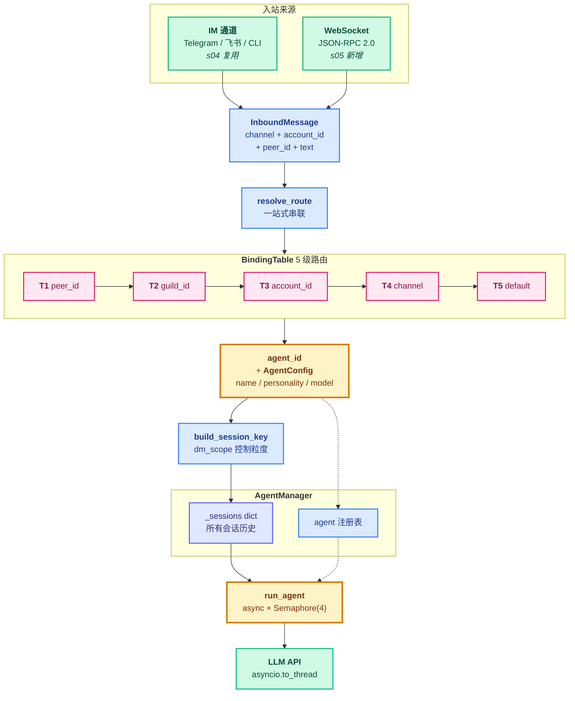

# 05 - Gateway & Routing

> [!note]
> s04 解决了"消息怎么进来 / 回复怎么出去"，但留下一个空缺：**消息进来后由哪个 agent 处理**？s04 只有一个 brain，所有消息走同一个 agent_loop。s05 引入**多 agent + 5 级路由表**——一张排序的 BindingTable 把每条消息从最具体（peer_id）到最宽泛（default）五个维度匹配，找到负责的 agent。再叠上 `dm_scope`（会话隔离粒度）和 WebSocket 入口，claw0 从此跑成"多 personality 服务"。骨架不变（s01 的循环），扩展方向是"从单 brain 到多 brain"。

> [!warning] Phase 7 编号说明
> Phase 1-6 是 learn-claude-code 的 s01-s20。Phase 7 切到 **claw0**（shareAI-lab），claw0 自己有 s01-s10 编号。本目录文件名 `05 - Gateway & Routing.md` 是 claw0 原编号。

## 这节重点关注

读完这节，你应该能在脑子里答出这 5 个问题：

1. **路由本质**：BindingTable 的 5 个 tier 是什么？为什么不能只用 channel？（→ [5 级路由表](#5-级路由表bindingtable)）
2. **会话隔离粒度**：`dm_scope` 的 4 种取值各是什么效果？为什么需要 4 种？（→ [dm_scope](#dm_scope会话隔离粒度)）
3. **多 agent 配置**：`AgentConfig` 携带哪些字段？怎么从 config 生成 SYSTEM prompt？（→ [AgentConfig 与 AgentManager](#agentconfig-与-agentmanager)）
4. **核心串联**：`resolve_route` 怎么把 BindingTable + AgentManager + build_session_key 串起来？（→ [resolve_route](#resolve_route把抽象串起来)）
5. **并发限流**：为什么用 `asyncio.Semaphore(4)`？多 agent 同时跑会怎样？（→ [并发模型](#并发模型asyncio--semaphore4)）

**可以略读/跳过**：`GatewayServer` 的 113 行 WebSocket + JSON-RPC 2.0 样板、各种 `cmd_*` REPL 命令实现。**抽象层是主菜，协议胶水是配菜。**

## 这一步加了什么

| 新增 | 作用 | 重点? |
|---|---|---|
| `Binding` dataclass | 路由表的一行：`agent_id / tier / match_key / match_value / priority` | ⭐⭐⭐ |
| `BindingTable` | 排序绑定列表，`resolve()` 线性扫描首次匹配 | ⭐⭐⭐ |
| `build_session_key()` 升级版 | 新增 `dm_scope` 参数，4 种会话隔离粒度 | ⭐⭐⭐ |
| `AgentConfig` | 每个 agent 的身份证：name / personality / model / dm_scope | ⭐⭐⭐ |
| `AgentManager` | agent 注册中心 + 集中存所有 sessions（dict） | ⭐⭐ |
| `resolve_route()` | 关键串联：inbound → BindingTable → agent → session_key | ⭐⭐⭐ |
| `run_agent()` 异步 | Semaphore(4) 限制并发，await `_agent_loop` | ⭐⭐ |
| `_agent_loop()` | 异步版 agent 循环（用 `asyncio.to_thread` 包同步 Anthropic API） | ⭐⭐ |
| `get_event_loop()` / `run_async()` | daemon 线程里跑 asyncio 循环 + 桥接同步代码 | ⭐ |
| `GatewayServer` | 可选 WebSocket 服务，JSON-RPC 2.0 协议 | 略读 |
| `cmd_*` 函数 | `/bindings` `/route` `/agents` `/sessions` `/switch` REPL | 略读 |
| `normalize_agent_id()` | agent_id 标准化（小写 + 替换非法字符） | ⭐ |

## 演进与动机

s04 的"路由"是**对称的**——`mgr.get(inbound.channel)` 决定回复发回哪，但消息处理只有一个 brain。产品需求很快撞墙：

- **多种性格共存**：客服场景要甜美助手 Luna + 技术顾问 Sage + 严肃审计 Agent 同时在线。
- **细粒度路由**：admin 这个特定用户不管在哪个通道都归 Sage；某个 Discord 服务器里所有人都用游戏 bot；Telegram 通道整体归一个 agent。
- **会话隔离可控**：公告板 bot 要所有人共享一个会话；个人助手要每个用户隔离；多 bot 同通道要最大隔离度。

如果硬塞进 s04 的 ChannelManager，会变成"按通道分桶"——`channel=telegram` 只能对应一个 agent，**无法表达"特定用户专属"或"特定服务器专属"**。

s05 的解法是**加一层路由表**——`BindingTable` 用 5 个粒度维度（peer_id / guild_id / account_id / channel / default）从最具体到最宽泛匹配，第一次命中就返回。同时 `AgentConfig` 让每个 agent 携带自己的 `dm_scope`，控制自己想要的会话隔离粒度。架构上把"消息进来 → 谁处理 → 怎么存对话"统一交给 `resolve_route()` 一站式决定。

并发层面，s04 是纯 threading（主线程 + TG 后台线程）。s05 又加了 asyncio——LLM 调用是 IO 密集型，asyncio 能让"等待 API 时切换到别的 agent"，再用 `Semaphore(4)` 给并发数封顶，避免 100 个用户同时来打爆 API quota。

## 核心抽象

### Binding 与 BindingTable

```python
@dataclass
class Binding:
    agent_id: str
    tier: int           # 1-5, 越小越具体
    match_key: str      # "peer_id" | "guild_id" | "account_id" | "channel" | "default"
    match_value: str    # e.g. "telegram:12345", "discord", "*"
    priority: int = 0   # 同一 tier 内, 越高越优先

    def display(self) -> str:
        return f"T{self.tier} {self.match_key}={self.match_value} → {self.agent_id}"
```

`BindingTable.resolve()` 的实现就是**排序 + 线性扫描 + 首次匹配返回**：

```python
class BindingTable:
    def __init__(self):
        self._bindings: list[Binding] = []

    def add(self, b: Binding):
        self._bindings.append(b)
        # 关键：按 (tier, -priority) 排序——tier 小的在前，同 tier 内 priority 大的在前
        self._bindings.sort(key=lambda x: (x.tier, -x.priority))

    def resolve(self, channel="", account_id="", guild_id="", peer_id=""):
        for b in self._bindings:
            if b.tier == 1 and b.match_key == "peer_id":
                # peer_id 可以是 "telegram:12345"（带通道前缀）或纯 "12345"
                if ":" in b.match_value:
                    if b.match_value == f"{channel}:{peer_id}": return b.agent_id, b
                elif b.match_value == peer_id: return b.agent_id, b
            elif b.tier == 2 and b.match_key == "guild_id" and b.match_value == guild_id:
                return b.agent_id, b
            elif b.tier == 3 and b.match_key == "account_id" and b.match_value == account_id:
                return b.agent_id, b
            elif b.tier == 4 and b.match_key == "channel" and b.match_value == channel:
                return b.agent_id, b
            elif b.tier == 5 and b.match_key == "default":
                return b.agent_id, b
        return None, None
```

注意 `peer_id` 的 match_value 支持 `"telegram:12345"` 这种**带通道前缀**的写法——解决"同一 peer_id 在不同通道是不同用户"的场景（Telegram 的 12345 和 Discord 的 12345 不是同一个人）。

### AgentConfig 与 AgentManager

```python
@dataclass
class AgentConfig:
    id: str
    name: str
    personality: str = ""
    model: str = ""              # 空 = 使用全局 MODEL_ID
    dm_scope: str = "per-peer"

    def effective_model(self) -> str:
        return self.model or MODEL_ID

    def system_prompt(self) -> str:
        parts = [f"You are {self.name}."]
        if self.personality:
            parts.append(f"Your personality: {self.personality}")
        parts.append("Answer questions helpfully and stay in character.")
        return " ".join(parts)
```

SYSTEM prompt 从 config 动态拼装——`personality` 字段就是"人设"。不同 agent 可以用不同 model（Luna 用 Sonnet 省钱，Sage 用 Opus 走深度推理）。

```python
class AgentManager:
    def __init__(self):
        self._agents: dict[str, AgentConfig] = {}     # agent 配置注册表
        self._sessions: dict[str, list[dict]] = {}    # 所有会话的消息历史

    def register(self, config): self._agents[config.id] = config
    def get_agent(self, agent_id): return self._agents.get(agent_id)
    def get_session(self, session_key):
        if session_key not in self._sessions:
            self._sessions[session_key] = []   # 懒初始化
        return self._sessions[session_key]
    def list_sessions(self, agent_id=""):
        # session_key 格式 agent:{aid}:... 按前缀过滤
        return {k: len(v) for k, v in self._sessions.items()
                if not agent_id or k.startswith(f"agent:{agent_id}:")}
```

`_sessions` 是 s04 `conversations` dict 的**升级版**——从局部变量搬进 manager，支持按 agent_id 过滤，为持久化预留接口（`agents_base` 目录已建但 s05 不写盘，见 [Q3](#q3-s05-的-agentmanager-sessions-真的落盘了吗)）。

## 整体架构图



## 5 级路由表（BindingTable）

```
T1 peer_id      最具体 ← ─────────────────── ───────────→ 最宽泛 T5 default
   │ "把 admin 这个特定用户路由到 Sage"
   │ 支持带通道前缀："discord:admin-001"
T2 guild_id
   │ "Discord 某服务器里所有人都用某 bot"
T3 account_id
   │ "我跑的 tg-personal 和 tg-work 分到不同 agent"
T4 channel
   │ "整个 Telegram 通道归一个 agent"
T5 default
   │ "*" 兜底，所有没匹配上的归这里
```

### 解析顺序：排序 + 首次匹配

```python
self._bindings.sort(key=lambda x: (x.tier, -x.priority))
# tier 小的排前面；同 tier 内 priority 大的排前面
```

`resolve()` 线性扫描这张已排序的表，**第一次匹配就 return**。所以：

- T1 的所有 binding 在最前（最具体）
- 同一 T1 内，priority 高的先生效
- 没匹配上才进入 T2

### 实战示例

给定绑定：

```python
bt.add(Binding(agent_id="luna", tier=5, match_key="default", match_value="*"))
bt.add(Binding(agent_id="sage", tier=4, match_key="channel", match_value="telegram"))
bt.add(Binding(agent_id="sage", tier=1, match_key="peer_id",
               match_value="discord:admin-001", priority=10))
```

| 输入 | 命中 tier | Agent |
|---|---|---|
| `channel=cli, peer=user1` | T5 | Luna（兜底） |
| `channel=telegram, peer=user2` | T4 | Sage（telegram 通道） |
| `channel=discord, peer=admin-001` | T1 | Sage（特定用户） |
| `channel=discord, peer=user3` | T5 | Luna（兜底） |

注意最后一行：`channel=discord` 没有 T4 绑定，`peer=user3` 也没匹配 T1，**一路落到 T5**。

### 为什么不只看 channel

如果只用 channel，所有 Telegram 来的消息强制归同一个 agent——但产品需求往往是：

- **特定用户专属**："admin 不管在哪个通道都归 Sage"——必须用 peer_id（T1）
- **特定服务器专属**："Discord 某服务器里所有人都用游戏 bot"——必须用 guild_id（T2）
- **多 bot 同通道**："tg-personal 和 tg-work 分到不同 agent"——必须用 account_id（T3）

channel 只是 5 个维度之一。**5 层路由本质是"多维度条件 → agent"的优先级匹配表**。

## dm_scope（会话隔离粒度）

```python
def build_session_key(agent_id, channel="", account_id="",
                      peer_id="", dm_scope="per-peer"):
    aid = normalize_agent_id(agent_id)
    if dm_scope == "per-account-channel-peer" and peer_id:
        return f"agent:{aid}:{channel}:{account_id}:direct:{peer_id}"
    if dm_scope == "per-channel-peer" and peer_id:
        return f"agent:{aid}:{channel}:direct:{peer_id}"
    if dm_scope == "per-peer" and peer_id:
        return f"agent:{aid}:direct:{peer_id}"
    return f"agent:{aid}:main"
```

| dm_scope | Key 格式 | 效果 | 典型场景 |
|---|---|---|---|
| `main` | `agent:{id}:main` | 所有人共享一个会话 | 公告板 bot / 群记忆 |
| `per-peer` | `agent:{id}:direct:{peer}` | 每用户隔离 | 个人助手（默认） |
| `per-channel-peer` | `agent:{id}:{ch}:direct:{peer}` | 同一用户在 Telegram / 飞书各开一段对话 | 多通道差异化人设 |
| `per-account-channel-peer` | `agent:{id}:{ch}:{acc}:direct:{peer}` | 最大隔离度 | 多 bot 同通道 |

**为什么需要 4 种**——不同 agent 的语义不同：

- 公告板 bot：所有用户该看到同一段对话历史（"刚才谁问了什么"）→ `main`
- 个人助手：A 用户不能看到 B 的历史 → `per-peer`
- 同一用户在 Telegram 是工作模式、在飞书是私人模式 → `per-channel-peer`
- 同一通道挂了两个 bot（personal / work）→ `per-account-channel-peer`

`dm_scope` 字段挂在 `AgentConfig` 上，**每个 agent 自己决定隔离粒度**——这是 s04 写死 session_key 做不到的灵活性。

## resolve_route：把抽象串起来

```python
def resolve_route(bindings, mgr, channel, peer_id, account_id="", guild_id=""):
    # 1. 路由：从绑定表找 agent
    agent_id, matched = bindings.resolve(
        channel=channel, account_id=account_id,
        guild_id=guild_id, peer_id=peer_id,
    )
    if not agent_id:
        agent_id = DEFAULT_AGENT_ID   # 兜底的兜底
    # 2. 取 agent 配置
    agent = mgr.get_agent(agent_id)
    dm_scope = agent.dm_scope if agent else "per-peer"
    # 3. 算 session_key（用 agent 自己的 dm_scope）
    sk = build_session_key(agent_id, channel=channel, account_id=account_id,
                           peer_id=peer_id, dm_scope=dm_scope)
    return agent_id, sk
```

三步：**路由 → 取 config → 算 session_key**。注意 session_key 用的 `dm_scope` 来自匹配到的 agent，不是全局——这就是"每个 agent 控制自己的隔离粒度"在代码里的落地。

调用方拿到 `(agent_id, sk)` 后，直接 `mgr.get_session(sk)` 拿到对应会话历史，丢给 `run_agent`。

## 并发模型：asyncio + Semaphore(4)

s04 是纯 threading。s05 引入 asyncio 的原因——**LLM 调用是 IO 密集型**，等 API 时可以切换到别的 agent。

### daemon 线程 + asyncio 循环

```python
_event_loop = None
_loop_thread = None

def get_event_loop():
    global _event_loop, _loop_thread
    if _event_loop is not None and _event_loop.is_running():
        return _event_loop
    _event_loop = asyncio.new_event_loop()
    def _run():
        asyncio.set_event_loop(_event_loop)
        _event_loop.run_forever()
    _loop_thread = threading.Thread(target=_run, daemon=True)  # daemon：进程退出自动结束
    _loop_thread.start()
    return _event_loop

def run_async(coro):
    # 同步代码调异步函数的桥
    loop = get_event_loop()
    return asyncio.run_coroutine_threadsafe(coro, loop).result()
```

模式：**主线程是同步代码（REPL / TG 轮询），需要并发时把协程丢给后台 asyncio 循环**。这是 threading + asyncio 混用的标准做法——`run_coroutine_threadsafe` 是跨线程递交协程的 API。

### Semaphore(4) 限流

```python
_agent_semaphore = None

async def run_agent(mgr, agent_id, session_key, user_text, on_typing=None):
    global _agent_semaphore
    if _agent_semaphore is None:
        _agent_semaphore = asyncio.Semaphore(4)   # 最多 4 个 agent 并发
    agent = mgr.get_agent(agent_id)
    messages = mgr.get_session(session_key)
    messages.append({"role": "user", "content": user_text})
    async with _agent_semaphore:                  # 第 5 个会阻塞在这里
        if on_typing: on_typing(agent_id, True)
        try:
            return await _agent_loop(agent.effective_model, agent.system_prompt(), messages)
        finally:
            if on_typing: on_typing(agent_id, False)
```

为什么是 4——**Anthropic API 的并发限额**（组织级 rate limit）。超过会 429，所以要主动限制。Semaphore 在 asyncio 里的语义：`async with` 拿不到就挂起等待，拿到才继续，**自动排队**。

### 同步 API 用 asyncio.to_thread 包

```python
async def _agent_loop(model, system, messages):
    for _ in range(15):
        response = await asyncio.to_thread(
            client.messages.create,    # 同步 API
            model=model, max_tokens=4096,
            system=system, tools=TOOLS, messages=messages,
        )
        ...
```

`asyncio.to_thread()` 把同步函数丢到线程池执行，返回 awaitable——**让同步 Anthropic SDK 不阻塞 asyncio 循环**。这是混用模型里的关键技巧。

## OpenClaw 生产代码对应

| 方面 | claw0 s05 | OpenClaw 生产 |
|---|---|---|
| 路由层级 | 5 层线性扫描 | 相同层级 + 配置文件驱动（hot reload） |
| session 存储 | 内存 dict（进程崩全丢） | 持久化 JSONL + Redis 缓存 |
| 多 agent | 内存 AgentConfig | 每个 agent 独立 workspace 目录 + 配置文件 |
| 网关协议 | WebSocket + JSON-RPC 2.0 | + HTTP REST API + 鉴权层 |
| 并发控制 | `asyncio.Semaphore(4)` | 相同信号量 + 按 agent 配额 |
| agent 注册 | 手写 `register()` 调用 | 启动时扫描 `agents/` 目录自动注册 |
| 持久化 | `agent_dir / "sessions"` 目录建好但不写 | JSONL session 文件 + WAL |

## 设计要点

### 1. 路由表为什么是"排序 + 线性扫描"

更"高效"的做法是按 tier 建多个 dict——`peer_dict[peer_id]` / `channel_dict[channel]` 等，O(1) 查找。claw0 偏偏用 O(N) 线性扫描，原因：

- **绑定数量极少**（通常 < 50 条）——线性扫描比 dict 维护简单，性能差异忽略不计。
- **priority 语义难用 dict 表达**——同 tier 同 match_key 但不同 priority 的冲突情况，dict 没法直接处理。
- **教学优先**——线性扫描一眼能看懂，dict 方案要解释多级索引。

OpenClaw 用配置文件 + 编译期生成查找表，但概念上仍然是"5 层优先级"。

### 2. dm_scope 为什么挂在 agent 上而不是 binding 上

直觉上"路由绑定决定隔离粒度"更自然。但 claw0 把 `dm_scope` 放在 `AgentConfig`：

- **同一个 agent 在不同 binding 下应该行为一致**——Luna 的所有会话都用 `per-peer`，不会因为某条 binding 就改成 `main`。
- **配置聚合**——agent 的"性格 + 模型 + 隔离粒度"是一组连贯的属性，应该一起配置。
- **简化路由表**——Binding 只关心"消息归谁"，不关心"怎么存对话"。

### 3. threading + asyncio 混用的代价

s05 的并发模型比 s04 复杂——主线程同步、后台 asyncio、跨线程递交协程。这种混用有三个坑：

- **`asyncio.run_coroutine_threadsafe().result()` 是阻塞调用**——主线程会被卡住等结果。如果 asyncio 循环里有别的协程在跑，可能死锁。
- **共享状态要小心**——`_sessions` dict 同时被同步代码和 asyncio 访问，Python GIL 保证 dict 操作原子，但跨协程的复合操作不安全。
- **调试困难**——异常栈跨线程，traceback 不直观。

OpenClaw 用纯 asyncio（FastAPI + httpx + anthropic 异步 SDK），避免混用。claw0 为了渐进式教学保留了 threading（s04 遗产），混用是过渡方案。

### 4. session 持久化的"预留位"

```python
def register(self, config):
    ...
    (agent_dir / "sessions").mkdir(parents=True, exist_ok=True)
```

`agent_dir / "sessions"` 目录建好了但 s05 没人往里写——这是**架构预留**。告诉读者"未来这里会存 session 文件"，但教学版聚焦在路由概念，不实现完整持久化。完整持久化在 OpenClaw / pi-mono 才有。

## 相关概念

- **前置**：`[[04 - Channels]]`（claw0 s04）—— s05 复用了 ChannelManager + InboundMessage，加上路由层。
- **后继**：`[[06 - Intelligence]]`（claw0 s06）—— s05 的 AgentConfig 只有简单 personality，s06 升级成 8 层提示词 + Soul。
- **learn-claude-code 对照**：`[[10 - System Prompt]]`（learn s10）—— 单 agent 的 SYSTEM 生成，s05 的 AgentConfig.system_prompt() 是多 agent 版的雏形。
- **同源机制**：`[[07 - Skill Loading]]`（learn s07）的 manifest 模式——BindingTable 是"路由清单"，ChannelManager 是"通道清单"，SKILL_REGISTRY 是"能力清单"，都是"注册中心 + 按需查找"。

> [!warning]
> 三个容易踩的坑：
>
> 1. **同 tier 同 match_value 多条 binding**：`add()` 会都加进表，按 priority 排序决定谁先生效。如果 priority 也没差，**注册顺序决定胜负**（后加的在同 priority 下排后面）。建议显式设置 priority，别依赖注册顺序。
> 2. **忘了 default binding**：没加 T5，所有没匹配上的消息会让 `resolve()` 返回 `(None, None)`。claw0 有 `DEFAULT_AGENT_ID` 兜底，但生产里最好显式注册一个 default，别依赖隐式行为。
> 3. **`asyncio.run_coroutine_threadsafe().result()` 死锁**：如果协程内部又尝试通过 `run_async` 递交新协程到同一个事件循环，会死锁（等自己完成）。混用模型下要严格保持"主线程递交 → asyncio 执行 → 返回结果"的单向流。

## 代码骨架总览

剥掉 WebSocket / JSON-RPC / REPL 样板，s05 的抽象层只有这么多代码：

```python
# === 1. 路由绑定 ===
@dataclass
class Binding:
    agent_id: str
    tier: int               # 1-5, 越小越具体
    match_key: str          # "peer_id"|"guild_id"|"account_id"|"channel"|"default"
    match_value: str
    priority: int = 0

class BindingTable:
    def __init__(self): self._bindings = []
    def add(self, b):
        self._bindings.append(b)
        self._bindings.sort(key=lambda x: (x.tier, -x.priority))
    def resolve(self, channel="", account_id="", guild_id="", peer_id=""):
        for b in self._bindings:
            if b.tier == 1 and b.match_key == "peer_id":
                target = f"{channel}:{peer_id}" if ":" in b.match_value else peer_id
                if b.match_value == target: return b.agent_id, b
            elif b.tier == 2 and b.match_value == guild_id: return b.agent_id, b
            elif b.tier == 3 and b.match_value == account_id: return b.agent_id, b
            elif b.tier == 4 and b.match_value == channel: return b.agent_id, b
            elif b.tier == 5: return b.agent_id, b
        return None, None

# === 2. Agent 配置 ===
@dataclass
class AgentConfig:
    id: str
    name: str
    personality: str = ""
    model: str = ""
    dm_scope: str = "per-peer"
    def effective_model(self): return self.model or MODEL_ID
    def system_prompt(self):
        parts = [f"You are {self.name}."]
        if self.personality: parts.append(f"Your personality: {self.personality}")
        parts.append("Answer questions helpfully and stay in character.")
        return " ".join(parts)

# === 3. Agent 注册 + 会话中心 ===
class AgentManager:
    def __init__(self):
        self._agents: dict[str, AgentConfig] = {}
        self._sessions: dict[str, list[dict]] = {}
    def register(self, cfg): self._agents[cfg.id] = cfg
    def get_agent(self, aid): return self._agents.get(aid)
    def get_session(self, sk):
        return self._sessions.setdefault(sk, [])

# === 4. 会话隔离键（带 dm_scope）===
def build_session_key(agent_id, channel="", account_id="", peer_id="", dm_scope="per-peer"):
    aid = normalize_agent_id(agent_id)
    if dm_scope == "per-account-channel-peer" and peer_id:
        return f"agent:{aid}:{channel}:{account_id}:direct:{peer_id}"
    if dm_scope == "per-channel-peer" and peer_id:
        return f"agent:{aid}:{channel}:direct:{peer_id}"
    if dm_scope == "per-peer" and peer_id:
        return f"agent:{aid}:direct:{peer_id}"
    return f"agent:{aid}:main"

# === 5. 一站式路由串联 ===
def resolve_route(bindings, mgr, channel, peer_id, account_id="", guild_id=""):
    agent_id, _ = bindings.resolve(channel=channel, account_id=account_id,
                                    guild_id=guild_id, peer_id=peer_id)
    if not agent_id: agent_id = DEFAULT_AGENT_ID
    agent = mgr.get_agent(agent_id)
    dm_scope = agent.dm_scope if agent else "per-peer"
    sk = build_session_key(agent_id, channel=channel, account_id=account_id,
                           peer_id=peer_id, dm_scope=dm_scope)
    return agent_id, sk

# === 6. 并发限流的 agent 运行器 ===
_agent_semaphore = None

async def run_agent(mgr, agent_id, session_key, user_text):
    global _agent_semaphore
    if _agent_semaphore is None:
        _agent_semaphore = asyncio.Semaphore(4)
    agent = mgr.get_agent(agent_id)
    messages = mgr.get_session(session_key)
    messages.append({"role": "user", "content": user_text})
    async with _agent_semaphore:
        return await _agent_loop(agent.effective_model, agent.system_prompt(), messages)

async def _agent_loop(model, system, messages):
    for _ in range(15):
        response = await asyncio.to_thread(
            client.messages.create,
            model=model, max_tokens=4096,
            system=system, tools=TOOLS, messages=messages,
        )
        messages.append({"role": "assistant", "content": response.content})
        if response.stop_reason == "end_turn":
            return "".join(b.text for b in response.content if hasattr(b, "text"))
        if response.stop_reason == "tool_use":
            results = [{"type": "tool_result", "tool_use_id": b.id,
                        "content": process_tool_call(b.name, b.input)}
                       for b in response.content if b.type == "tool_use"]
            messages.append({"role": "user", "content": results})
            continue
        return "".join(b.text for b in response.content if hasattr(b, "text"))
```

**这 6 块是 s05 的全部抽象层**。下一节 s06 Intelligence 会把 `AgentConfig.system_prompt()` 升级成 8 层提示词 + Soul，骨架不变。

## Q&A

学习 s05 时卡过的点。

### Q1: s05 相比 s04 多做了什么？

**A**: 把"单 brain + 多通道"升级成"**多 brain + 多通道 + 智能路由**"。具体五件事：

1. `BindingTable`：5 级路由表，按 peer_id / guild_id / account_id / channel / default 优先级匹配
2. `dm_scope`：4 种会话隔离粒度，每个 agent 自配
3. `AgentConfig`：多 agent 配置（name / personality / model / dm_scope）
4. WebSocket Gateway：JSON-RPC 2.0 协议，给 Web UI 接入
5. asyncio + Semaphore(4)：并发限流，防止打爆 API quota

### Q2: s05 是把多 agent 与"消息来源"绑定吗？

**A**: 不只是"消息来源"（channel）。"消息来源"只是 5 个匹配维度之一（T4 channel）。更准确的说法是 **"按 5 个粒度维度把消息路由到 agent"**：

- T1 peer_id（具体会话）
- T2 guild_id（Discord 服务器）
- T3 account_id（bot 账号）
- T4 channel（通道，即你说的"消息来源"）
- T5 default（兜底）

只用 channel 会强制"Telegram 来的消息全部归同一个 agent"，无法表达"特定用户专属"或"特定服务器专属"的需求。**5 层路由本质是"多维度条件 → agent"的优先级匹配表**。

### Q3: s05 的 AgentManager._sessions 真的落盘了吗？

**A**: **没有**。`_sessions` 是纯内存 dict，进程崩全丢。`register()` 里 `(agent_dir / "sessions").mkdir(...)` 建了目录但**没人往里写**——这是**架构预留**，告诉读者"未来这里会存 session 文件"，s05 自己不实现。

整个 claw0 s01-s10 里，只有 **s03 Sessions** 实现了完整 session 持久化（JSONL + index.json）。s04 / s05 为了教学聚焦把持久化砍了，OpenClaw 生产版才补回来。

详见 [AgentConfig 与 AgentManager](#agentconfig-与-agentmanager)。

### Q4: `AgentManager._sessions` 和 s04 的 `conversations` dict 是同一个东西吗？

**A**: 是的，本质完全一样——都是 `dict[str, list[dict]]` 映射 session_key → messages list。s05 把它**从局部变量搬进 manager**，带来三个升级：

1. **多 agent 统一管理**——所有 agent 的会话集中一处
2. **按 agent 过滤**——`list_sessions(agent_id)` 用前缀过滤出某 agent 的所有会话
3. **为持久化铺路**——`agents_base` 参数预留了落盘路径

### Q5: 为什么 `dm_scope` 挂在 AgentConfig 而不是 Binding 上？

**A**: 直觉上"路由绑定决定隔离粒度"更自然，但 claw0 把它放在 AgentConfig，原因：

- **同一 agent 在不同 binding 下行为应一致**——Luna 的所有会话都用 `per-peer`
- **配置聚合**——agent 的"性格 + 模型 + 隔离粒度"是一组连贯属性
- **简化路由表**——Binding 只关心"消息归谁"，不关心"怎么存对话"

### Q6: 为什么用 threading + asyncio 混用？

**A**: 历史包袱 + 渐进式教学。s04 是纯 threading（TG 后台轮询），s05 想引入并发限流（asyncio.Semaphore）又不重构整个 s04，于是 daemon 线程里跑 asyncio 循环，跨线程用 `run_coroutine_threadsafe` 桥接。

OpenClaw 生产代码用纯 asyncio（FastAPI + 异步 SDK），避免混用的死锁和调试困难。claw0 的混用是**过渡方案**，不是最终形态。

### Q7: s05 代码看起来比 s04 复杂很多？

**A**: 数据反过来——s05 是 625 行，**比 s04 的 780 行短**。复杂感来自一次性引入 5 个新概念（BindingTable / dm_scope / AgentConfig / WebSocket / asyncio）。

拆开看：
- **真正的新概念**：~70 行（Binding + BindingTable + dm_scope + AgentConfig）
- **协议样板**：~200 行（WebSocket + JSON-RPC，照搬即可）
- **并发模型升级**：~80 行（asyncio 设置 + Semaphore）

**只看 70 行核心 + resolve_route 串联，s05 就过关了**。

### Q8: 学 s05 要重点看哪几个函数？

**A**: 按优先级：

| Tier | 行号 | 函数 | 为什么 |
|---|---|---|---|
| ⭐⭐⭐ | L88-148 | `Binding` + `BindingTable` | 路由核心，必读 |
| ⭐⭐⭐ | L149-167 | `build_session_key` | dm_scope 4 种粒度 |
| ⭐⭐⭐ | L168-185 | `AgentConfig` | 多 agent 配置 |
| ⭐⭐⭐ | L281-297 | `resolve_route` | **关键串联**，把抽象接起来 |
| ⭐⭐ | L186-214 | `AgentManager` | agent 注册 + session 存储 |
| ⭐⭐ | L305-352 | `run_agent` + `_agent_loop` | 异步运行器 + Semaphore |
| ⭐ | L261-275 | `get_event_loop` + `run_async` | 并发模型，按需 |
| 跳过 | L358-470 | `GatewayServer` | WebSocket 协议样板 |
| 跳过 | L471-625 | REPL 命令 + main | 工程胶水 |

### Q9: `peer_id` 的 match_value 为什么支持 "telegram:12345" 这种带通道前缀的写法？

**A**: 解决"同一 peer_id 在不同通道是不同用户"的问题。Telegram 的 user_id `12345` 和 Discord 的 user_id `12345` 不是同一个人（两个平台独立编号）。

如果只用 `12345` 做 T1 绑定，会把两个不同用户都路由到同一个 agent。用 `telegram:12345` 显式指定通道，能精确到"Telegram 里的这个特定用户"。

不带前缀的写法（纯 `12345`）适用于"不管哪个通道，这个 ID 都是我"的统一身份场景——比如某些系统用 SSO 跨平台统一用户 ID。
