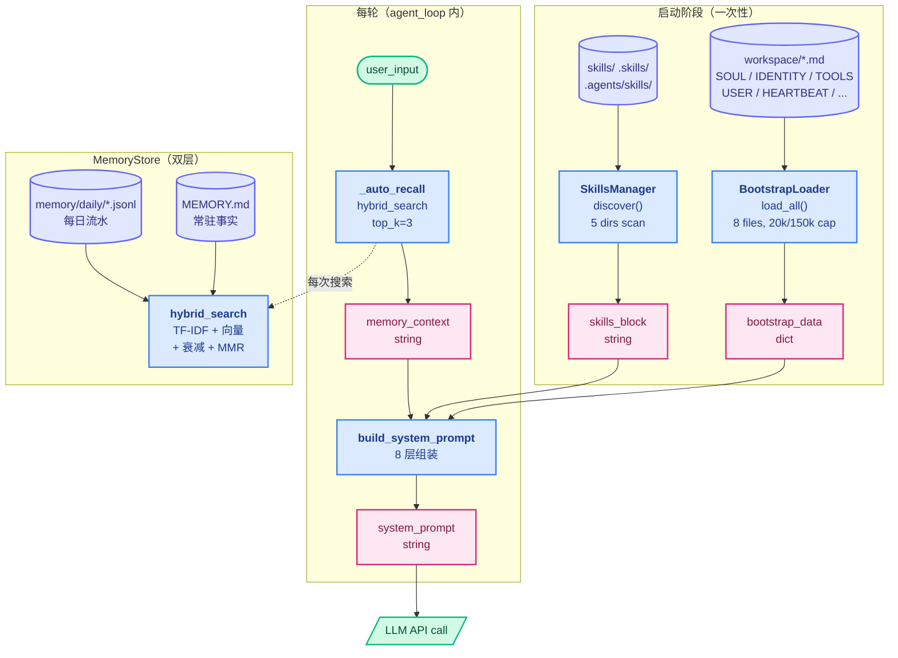
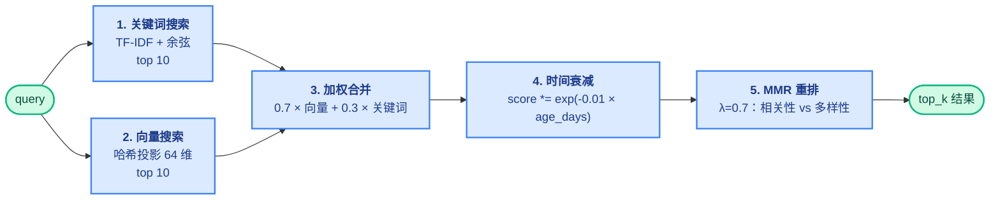

# 06 - Intelligence

> [!note]
> 把 system prompt 从**代码里的硬编码字符串**变成**磁盘 `workspace/*.md` 驱动 + 8 层动态组装 + 自动记忆召回**的智能层。换文件就换性格；同一句话在不同时间问，prompt 不一样（因为记忆变了）。
>
> 这一节是 **claw0 的"角色档案系统"**——它和 [[10 - System Prompt|learn-claude-code s10]] 的根本区别是：s10 是"按状态选 section"的智能组装，s06 是"从磁盘 + 记忆实时组装"的数据驱动组装。

> [!warning] 编号说明
> 这是 claw0 第 6 节（s06），属于 [[README|Claw-Theory]] Phase 7 的第 3 步。前置：[[04 - Channels]] / [[05 - Gateway & Routing]]。后继：s07 Heartbeat 会复用这里的 `HEARTBEAT.md`。

> [!tip] 数据样例
> 8 个 workspace markdown 文件（SOUL.md / IDENTITY.md / TOOLS.md / USER.md / HEARTBEAT.md / BOOTSTRAP.md / AGENTS.md / MEMORY.md）的实际内容看 [`../数据样例/01 - workspace 配置文件.md`](../数据样例/01%20-%20workspace%20配置文件.md)。

## 这节重点关注

读完这一节应该能回答 5 个问题：

1. **8 层 system prompt 的顺序是什么？为什么 SOUL 在第 2 层？** → 看 [[#build_system_prompt 的 8 层组装]]
2. **MemoryStore 怎么做到"每轮都搜"还不破产？** → 看 [[#MemoryStore 的混合搜索管道]]（算法搜索 vs LLM side-query 的成本差）
3. **bootstrap 到底指什么？和 runtime/memory 怎么区分？** → 看 [[#核心抽象]] 的"慢变量 vs 快变量"
4. **SkillsManager 扫哪几个目录？同名技能怎么处理？** → 看 [[#SkillsManager 的多目录扫描]]
5. **这一节和 learn-claude-code [[10 - System Prompt]] 的差异在哪？** → 看 [[#OpenClaw 生产代码对应]]

**略读指引**：`handle_repl_command`（L753）是 6 条用户态调试命令（`/soul` / `/skills` / `/memory` / `/search` / `/prompt` / `/bootstrap`），不是智能层核心；TF-IDF / 哈希向量 / MMR 的**数学公式细节**用时再查，重点是**管道顺序和为什么这么排**。

## 这一步加了什么

| 新增 | 作用 | 重点? |
|---|---|---|
| `BootstrapLoader` | 启动时从 `workspace/*.md` 读最多 8 个文件，单文件 20k 字符、总量 150k 截断 | ★ |
| `SkillsManager` | 按优先级扫描 5 个目录找 `SKILL.md`，同名后者覆盖，拼成 prompt 第 4 层 | |
| `MemoryStore` | 双层存储：`MEMORY.md` 常驻 + `memory/daily/{date}.jsonl` 流水；5 阶段混合搜索 | ★ |
| `build_system_prompt()` | 把 8 层按"越靠前影响越强"顺序拼成字符串，每轮重建 | ★★ |
| `_auto_recall()` | 每条用户消息进来都跑一次 `hybrid_search`，结果塞到第 5 层 | ★ |
| `memory_write` / `memory_search` 工具 | 让模型主动写 / 主动搜记忆（半自动机制） | |

## 演进与动机

### 反例：s05 的 system prompt 是一次性硬编码

```python
# s05 的做法（简化）
SYSTEM = "You are a helpful assistant. Use tools when needed."
# 进程启动时拼一次，跑整个进程不换
```

**4 个痛点**：

1. **改性格要改代码** —— 想把 "helpful" 改成 "warm" 要重启进程
2. **多 agent 没法区分** —— s05 路由能分到不同 agent_id，但所有 agent 用同一个 SYSTEM 字符串
3. **记忆没法实时召回** —— 模型不知道用户 5 分钟前说过什么（除非那件事进了 messages）
4. **运行时上下文丢失** —— model / channel / 时间戳都没注入 prompt，模型看不见自己在哪

### 解法核心：**把 prompt 从代码搬到磁盘 + 分层组装**

- **磁盘驱动**：8 个固定文件名（SOUL/IDENTITY/TOOLS/USER/HEARTBEAT/BOOTSTRAP/AGENTS/MEMORY），改文件即改性格
- **分层组装**：8 层固定顺序，每层解决一个维度的问题
- **快慢分离**：bootstrap（慢变量，启动时加载）vs memory（快变量，每轮重搜）vs runtime（实时变量，每轮重拼）

**关键洞察**：`SOUL.md` 放第 2 层不是随便选的——**越靠前的层对模型行为影响越强**（这是 LLM 的 attention 机制特性，靠前的指令不容易被后面的内容稀释）。把性格放在身份之后、其他所有内容之前，是为了让"性格"成为模型的"骨子里的偏好"，而不是"提醒"。

## 核心抽象

### 1. BootstrapLoader —— 慢变量加载器

```python
BOOTSTRAP_FILES = [
    "SOUL.md", "IDENTITY.md", "TOOLS.md", "USER.md",
    "HEARTBEAT.md", "BOOTSTRAP.md", "AGENTS.md", "MEMORY.md",
]
MAX_FILE_CHARS = 20000      # 单文件上限
MAX_TOTAL_CHARS = 150000    # 总量上限
```

**契约**：`load_all(mode="full")` 返回 `dict[str, str]`，键是文件名，值是（截断后的）内容。`mode="minimal"` 只读 AGENTS+TOOLS；`mode="none"` 返回空 dict。

**截断策略**：超长文件按**行边界**截断（`rfind("\n", 0, max)`），不是硬切字符。给读者一个清晰的"文件被截断了"信号。

### 2. SkillsManager —— 目录扫描器

```python
# 扫描顺序（前面的优先级低，后面的覆盖前面的）
scan_order = [
    workspace_dir / "skills",             # 内置技能
    workspace_dir / ".skills",            # 托管技能
    workspace_dir / ".agents" / "skills", # 个人 agent 技能
    cwd / ".agents" / "skills",           # 项目 agent 技能
    cwd / "skills",                       # 工作区技能
]
MAX_SKILLS = 150              # 总数上限
MAX_SKILLS_PROMPT = 30000     # prompt 字符上限
```

**契约**：`discover()` 按顺序扫，**同名后者覆盖前者**（dict 赋值语义）；`format_prompt_block()` 拼成 "## Available Skills" 块。

**关键约束**：技能必须有 `SKILL.md` + frontmatter 含 `name` 字段，否则跳过。不依赖 `pyyaml`，`_parse_frontmatter` 是手写的简单 YAML 解析器。

### 3. MemoryStore —— 双层存储 + 5 阶段搜索

```python
workspace/
  MEMORY.md                          # evergreen：长期事实，按段落切分
  memory/daily/
    2026-06-22.jsonl                 # 每条一行 {ts, category, content}
    2026-06-21.jsonl
```

**契约**：
- `write_memory(content, category)` → 追加到今天的 JSONL
- `hybrid_search(query, top_k=5)` → 5 阶段管道（见下节）
- `get_stats()` → 返回 evergreen 字符数 / 每日文件数 / 条目数（给 `/memory` 命令用）

### 4. build_system_prompt —— 8 层组装器

**契约**：`build_system_prompt(mode, bootstrap, skills_block, memory_context, agent_id, channel)` → 一个大字符串。每轮 agent_loop 调一次（因为 memory_context 会变）。

### 5. _auto_recall —— 隐式记忆注入

```python
def _auto_recall(user_message: str) -> str:
    results = memory_store.hybrid_search(user_message, top_k=3)
    return "\n".join(f"- [{r['path']}] {r['snippet']}" for r in results)
```

**契约**：**每条用户消息**都跑一次（不是每轮 agent_loop），返回字符串塞到第 5 层的 `### Recalled Memories` 子段。**用户不需要显式请求**，模型也不需要主动调 `memory_search`——这是"系统帮模型想起来的"机制。

## 整体架构图



**读图关键**：
- 启动阶段 3 个加载器只跑一次（BootstrapLoader / SkillsManager / MemoryStore 初始化）
- 每轮的工作只有 2 步：`_auto_recall` + `build_system_prompt`
- bootstrap 是**输入**（缓存），memory_context 是**临时变量**（每轮重算），system_prompt 是**输出**

## build_system_prompt 的 8 层组装

```
┌──────────────────────────────────────────────────┐
│ 第 1 层：Identity         ← IDENTITY.md          │  ← 强
│ 第 2 层：Personality/Soul ← SOUL.md              │     ↓
│ 第 3 层：Tool Usage       ← TONOS.md             │   影响力
│ 第 4 层：Available Skills ← skills_block         │     ↓
│ 第 5 层：Memory           ← MEMORY.md + 召回结果 │     ↓
│ 第 6 层：Bootstrap 上下文 ← HEARTBEAT/BOOTSTRAP  │     ↓
│         │                  /AGENTS/USER          │     ↓
│ 第 7 层：Runtime Context  ← 时间/agent_id/模型   │     ↓
│ 第 8 层：Channel Hints    ← Telegram/CLI/...     │  ← 弱
└──────────────────────────────────────────────────┘
```

**每层的具体职责**：

| 层 | 来源 | 内容样例 | 为什么这个位置 |
|---|---|---|---|
| 1 Identity | `IDENTITY.md` | "You are Luna, a personal AI companion." | 模型必须先知道"我是谁"才能进入角色 |
| 2 Soul | `SOUL.md` | "You are warm, curious, and encouraging." | 性格影响所有后续行为——靠前权重高 |
| 3 Tools | `TOOLS.md` | "Call memory_write when user mentions a preference." | 工具规范紧跟身份——模型要知道自己"能做什么" |
| 4 Skills | `skills_block` | "### Skill: code-reviewer\nInvocation: /review" | 技能是扩展能力，在工具规范之后 |
| 5 Memory | `MEMORY.md` + `_auto_recall` | "User prefers Python." + "User said they like blue." | 记忆是"事实层"，在性格/工具之后 |
| 6 Bootstrap | HEARTBEAT/BOOTSTRAP/AGENTS/USER | "User is a data scientist." | 元信息，影响弱于直接指令 |
| 7 Runtime | 实时变量 | "Agent ID: main / Channel: terminal / Time: 2026-06-22" | 上下文锚点，让模型知道当前环境 |
| 8 Channel | 字典查表 | "You are responding via Telegram. Keep messages concise." | 渠道规范在最末——最容易被覆盖 |

**关键工程取舍**：第 5 层 Memory 同时含 `### Evergreen Memory`（常驻）和 `### Recalled Memories`（召回）两个子段。**常驻永远在**，召回根据相关度变化。两个都进第 5 层是因为它们语义一致（都是"事实"），但来源不同（磁盘 vs 算法搜索）。

## MemoryStore 的混合搜索管道

`hybrid_search(query, top_k=5)` 的 5 阶段管道：



**每阶段做什么**：

1. **关键词搜索**：纯 TF-IDF，按余弦相似度返回 top 10。**精确匹配**强（"Python" 命中含 "Python" 的记忆）
2. **向量搜索**：基于哈希的 64 维随机投影，模拟 embedding。**模糊匹配**强（"编程" 也能找到 "coding" 的记忆，因为哈希分布相近）
3. **加权合并**：按文本前 100 字符取并集，`vector_weight=0.7, text_weight=0.3`——向量优先，关键词补漏
4. **时间衰减**：`score *= exp(-0.01 × age_days)`——30 天前的记忆分数打 0.74 折，越近权重越高
5. **MMR 重排**：`MMR = λ × relevance - (1-λ) × max_sim_to_selected`（用 token Jaccard 算相似度），保证 top_k 结果**不全是相似内容**

**为什么不用真 embedding API？** —— s06 是教学版，要展示"双通道搜索"的**模式**，不引入外部依赖。生产代码（OpenClaw）换成真 embedding 时，管道结构不变，只换第 2 步的实现。

**成本对比**（和 learn-claude-code s09 的 LLM 选记忆对比）：

| | s09（LLM side-query） | s06（纯算法） |
|---|---|---|
| 单次搜索成本 | 1 次 LLM 调用（~$0.01） | 微秒级 CPU |
| 敢多频繁 | 每次 agent_loop 进来一次 | **每条用户消息都搜** |
| 粒度 | 文件级（整篇读入） | 片段级（按段/按条） |

**这就是为什么 s06 敢每轮搜、s09 不敢** —— 算法搜索比 LLM 选择便宜 1000 倍。

## SkillsManager 的多目录扫描

```python
scan_order = [
    workspace_dir / "skills",             # 内置（系统级）
    workspace_dir / ".skills",            # 托管（npm-like 安装）
    workspace_dir / ".agents" / "skills", # 个人 agent 专属
    cwd / ".agents" / "skills",           # 项目级 agent 技能
    cwd / "skills",                       # 工作区级
]
```

**5 个目录代表 5 个优先级层**：

```
内置 → 托管 → 个人 → 项目 → 工作区
低                           高
```

**同名技能后者覆盖前者**——这是**用户覆盖系统**的机制：
- 系统装了 "code-reviewer" v1.0
- 你在 `workspace/skills/code-reviewer/` 放了自己的版本
- 你的版本覆盖系统的（因为 workspace 在最后扫）

**为什么要 5 层而不是 2 层（系统 + 用户）？** —— 区分不同来源的权限/信任级别：
- `.skills`（托管）= npm 包，可信但可批量更新
- `.agents/skills`（个人）= "我"给所有我的 agent 用的
- `.agents/skills`（项目 cwd）= 团队共享的
- `skills`（工作区 cwd）= 当前项目临时实验的

## OpenClaw 生产代码对应

| 方面 | claw0 s06（教学版） | OpenClaw 生产 |
|---|---|---|
| 提示词组装 | 8 层 `build_system_prompt` | 相同分层方案 |
| 引导文件 | 从 workspace 目录加载 | 相同文件集 + **每个 agent 的覆盖配置** |
| 记忆搜索 | TF-IDF + 哈希向量 + MMR | 相同管道 + **可选真 embedding API** |
| 技能发现 | 5 目录扫描 | 相同扫描 + **插件系统**（动态安装/卸载） |
| 自动召回 | 每条用户消息 top_k=3 | 相同模式，**top_k 和召回频率可配置** |
| 多 agent | `agent_id="main"` 写死 | 每 agent 独立 workspace 目录，真正用上 s05 路由 |

**最大的生产差异**：s06 的 `_auto_recall` 是**每条都搜**，生产代码会加**缓存层**（相似 query 复用结果）和**冷启动保护**（记忆少于 N 条时跳过搜索避免空转）。

## 设计要点

1. **位置即权重** —— 8 层的顺序不是任意的，是 LLM attention 机制的工程化利用。改顺序会改模型行为。
2. **快慢分离** —— bootstrap（启动加载，进程内不变）/ memory（每轮搜索）/ runtime（每轮重拼）三层刷新频率不同，必须分开管理。
3. **磁盘驱动的运营价值** —— 改 SOUL.md 立即生效，不需要重启进程、不需要开发介入。这是"运营人员能改"的工程基础。
4. **混合搜索是模式，不是实现** —— 教学版用哈希投影模拟 embedding；生产版换真 embedding 时，**管道结构不变**。学的是"为什么要 5 阶段"，不是"哈希怎么算"。
5. **双层记忆的语义** —— MEMORY.md 是"常驻事实"（用户偏好、长期约定），daily JSONL 是"事件流"（今天说了什么）。两者互补：前者保证一致性，后者保证时效性。
6. **自动召回 vs 工具召回的分工** —— `_auto_recall`（每轮 top_k=3）保证模型至少看见最相关的；`memory_search` 工具让模型在需要时**主动深挖**（top_k=10）。系统兜底 + 模型主动，两层互补。
7. **截断策略** —— 单文件 20k、总量 150k、技能 30k。所有截断在**行边界**做，给读者清晰的"被截断了"信号。`MAX_TOTAL_CHARS` 兜底防止 workspace 失控把 prompt 撑爆。

## 相关概念

- [[04 - Channels]] —— s06 的 `channel` 参数最终走的就是 s04 的归一化通道
- [[05 - Gateway & Routing]] —— s06 的 `agent_id="main"` 是 s05 多 agent 路由的单 agent退化版
- [[10 - System Prompt]] —— learn-claude-code 对应节，"按状态选 section" vs "从磁盘 + 记忆组装" 的范式对比
- [[09 - Memory]] —— learn-claude-code 对应节，LLM side-query 选记忆 vs 算法混合搜索的成本差异
- [[07 - Skill Loading]] —— learn-claude-code 对应节，单目录 SKILL.md 加载 vs s06 多目录优先级扫描
- [[对话精华]] —— Q15+ 记录 s06 的卡点

> [!warning] 易踩坑
> - **8 层不是 dict 是有序 list** —— Python 3.7+ dict 保序，但这里用 `sections: list[str]` + `"\n\n".join()`，顺序由 append 顺序决定。改顺序就是改行为。
> - **`_auto_recall` 每条都跑** —— 不是每轮 agent_loop。10 轮工具调用的复杂任务，`_auto_recall` 也只跑 1 次（在用户消息进来时）。但 10 个用户消息就是 10 次搜索——高并发场景必须加缓存。
> - **MEMORY.md 不是永远全量进 prompt** —— 它走 `bootstrap_data["MEMORY.md"]`，受 `MAX_FILE_CHARS=20000` 截断。如果你的 MEMORY.md 超过 20k 字符，**靠后的内容会被截掉**。生产代码应该按段切 + 智能选段，s06 没做。
> - **SkillsManager 同名覆盖的方向** —— `seen[skill["name"]] = skill`，**后扫的覆盖先扫的**。如果你在 `workspace/skills/` 和 `cwd/skills/` 都放了同名技能，**cwd 的会赢**（cwd 在 scan_order 最后）。这和 Python `dict.update` 的语义一致，但容易看反。
> - **`build_system_prompt` 每轮重拼** —— 没有"prompt 没变就不拼"的缓存（[[10 - System Prompt]] 有）。因为 memory 可能上一轮刚写入，s06 选择"宁可重拼也不漏"。生产代码可以加"memory_context 没变就不重拼"的细粒度缓存。

## 代码骨架总览

```python
# === 1. BootstrapLoader：慢变量加载 ===
BOOTSTRAP_FILES = [
    "SOUL.md", "IDENTITY.md", "TOOLS.md", "USER.md",
    "HEARTBEAT.md", "BOOTSTRAP.md", "AGENTS.md", "MEMORY.md",
]
MAX_FILE_CHARS, MAX_TOTAL_CHARS = 20000, 150000

class BootstrapLoader:
    def load_file(self, name): ...                    # 单文件读取，失败返回 ""
    def truncate_file(self, content, max_chars=MAX_FILE_CHARS):
        # 在行边界截断，附 "[... truncated ...]" 标记
        ...
    def load_all(self, mode="full") -> dict[str, str]:
        # 按 BOOTSTRAP_FILES 顺序加载，受 MAX_TOTAL_CHARS 总量约束
        # mode: "full"（8 个）/ "minimal"（只 AGENTS+TOOLS）/ "none"（空）
        ...

# === 2. SkillsManager：多目录扫描 ===
class SkillsManager:
    def _parse_frontmatter(self, text) -> dict: ...   # 手写 YAML 解析
    def _scan_dir(self, base) -> list[dict]: ...      # 找子目录的 SKILL.md
    def discover(self, extra_dirs=None):
        # 5 目录顺序扫描，同名后者覆盖前者，受 MAX_SKILLS=150 约束
        scan_order = [
            workspace_dir / "skills",
            workspace_dir / ".skills",
            workspace_dir / ".agents" / "skills",
            cwd / ".agents" / "skills",
            cwd / "skills",
        ]
        seen: dict[str, dict] = {}
        for d in scan_order:
            for skill in self._scan_dir(d):
                seen[skill["name"]] = skill          # ← 后者覆盖
        self.skills = list(seen.values())[:MAX_SKILLS]
    def format_prompt_block(self) -> str:             # 拼 "## Available Skills"

# === 3. MemoryStore：双层存储 + 5 阶段混合搜索 ===
class MemoryStore:
    def write_memory(self, content, category="general"):
        # 追加到 memory/daily/{today}.jsonl
        ...
    def _load_all_chunks(self) -> list[dict]:
        # MEMORY.md 按段落切 + 每个 JSONL 行作为独立 chunk
        ...
    def _keyword_search(self, query, chunks, top_k=10): ...  # TF-IDF + 余弦
    def _vector_search(self, query, chunks, top_k=10): ...   # 哈希投影 64 维
    @staticmethod
    def _merge_hybrid_results(vector, keyword,
                              vector_weight=0.7, text_weight=0.3): ...
    @staticmethod
    def _temporal_decay(results, decay_rate=0.01): ...       # exp(-0.01 × age_days)
    @staticmethod
    def _mmr_rerank(results, lambda_param=0.7): ...          # 多样性重排
    def hybrid_search(self, query, top_k=5):
        # keyword → vector → merge → decay → MMR → top_k
        ...
    def get_stats(self) -> dict: ...                          # 给 /memory 用

# === 4. build_system_prompt：8 层组装（核心） ===
def build_system_prompt(mode="full", bootstrap=None, skills_block="",
                        memory_context="", agent_id="main", channel="terminal"):
    sections: list[str] = []
    # 1 Identity  ← bootstrap["IDENTITY.md"] 或默认值
    # 2 Soul      ← bootstrap["SOUL.md"]（mode="full" 才注入）
    # 3 Tools     ← bootstrap["TOOLS.md"]
    # 4 Skills    ← skills_block
    # 5 Memory    ← MEMORY.md + memory_context
    # 6 Bootstrap ← HEARTBEAT/BOOTSTRAP/AGENTS/USER
    # 7 Runtime   ← agent_id / model / channel / time
    # 8 Channel   ← 字典查表
    return "\n\n".join(sections)

# === 5. _auto_recall：每条用户消息都跑 ===
def _auto_recall(user_message: str) -> str:
    results = memory_store.hybrid_search(user_message, top_k=3)
    if not results: return ""
    return "\n".join(f"- [{r['path']}] {r['snippet']}" for r in results)

# === 6. agent_loop：启动加载 + 每轮重拼 ===
def agent_loop() -> None:
    # 启动阶段（一次性）
    loader = BootstrapLoader(WORKSPACE_DIR)
    bootstrap_data = loader.load_all(mode="full")
    skills_mgr = SkillsManager(WORKSPACE_DIR)
    skills_mgr.discover()
    skills_block = skills_mgr.format_prompt_block()

    messages: list[dict] = []
    while True:
        user_input = input(...)
        if user_input.startswith("/"):
            if handle_repl_command(...): continue       # 用户态调试命令
        memory_context = _auto_recall(user_input)       # ← 每条消息都搜
        system_prompt = build_system_prompt(            # ← 每轮重拼
            mode="full", bootstrap=bootstrap_data,
            skills_block=skills_block, memory_context=memory_context,
        )
        messages.append({"role": "user", "content": user_input})
        # ... LLM 调用 + 工具循环（和 s04 一样）
```

## Q&A

### Q1: 为什么 `build_system_prompt` 每轮都重拼，不缓存？

**A**: 因为 **memory 可能上一轮刚写入**——模型可能调用 `memory_write` 写了新事实，下一轮的 `_auto_recall` 会搜到这条新记忆。如果缓存 prompt，新记忆就漏了。s06 选择"宁可重拼也不漏"。代价是每轮多耗点 CPU（字符串拼接很便宜）。生产代码可以加细粒度缓存："memory_context 没变就不重拼"，但教学版为了清晰不做。

### Q2: `_auto_recall` 每条用户消息都跑，性能扛得住吗？

**A**: 扛得住，因为**算法搜索是微秒级 CPU**。对比 learn-claude-code s09 用 LLM side-query 选记忆，每次 ~$0.01 + 几百毫秒，s06 的纯 TF-IDF + 哈希投影 + MMR 是**纯 Python 字典运算**，1000 条记忆也是毫秒级。**敢每轮搜是因为便宜**——这就是 s06 用算法、不用 LLM 的核心理由。

### Q3: `bootstrap_data["MEMORY.md"]` 和 `_auto_recall` 搜出来的记忆有什么区别？

**A**: 都是第 5 层，但来源和语义不同：

- **`bootstrap_data["MEMORY.md"]`**：启动时一次性加载的**整篇** MEMORY.md（受 20k 截断），进 `### Evergreen Memory` 子段。**永远在，不挑相关性**。
- **`_auto_recall` 结果**：每轮根据 user_input 实时搜的**片段**（包括 MEMORY.md 的段落 + daily JSONL 的条目），进 `### Recalled Memories` 子段。**根据相关性挑**。

类比：前者是"你的档案"，后者是"针对当前问题的检索结果"。两者互补——档案保证一致性，检索保证时效性。

### Q4: SkillsManager 5 个目录扫描顺序，为什么 workspace_dir 在前 cwd 在后？

**A**: 让 **cwd 的同名技能覆盖 workspace 的**——即"工作区覆盖系统"。这是**用户级覆盖机制**：系统装了 v1，你想试 v2 就在 `cwd/skills/my-skill/` 放，下次启动就生效，不污染系统安装。和 npm 的 `node_modules` vs 全局包的语义类似。

### Q5: s06 的 agent_loop() 没参数，s05 不是已经有 agent_id 吗？

**A**: 这是 claw0 教学版的"暂时退化"——s06 专心讲智能层，把 s05 的多 agent 路由暂时拿掉。`build_system_prompt(agent_id="main")` 写死 main 就是信号。s07+ 会把 s05 路由和 s06 智能层重新结合。每节只加一个新维度，这是 claw0 的教学策略。

### Q6: 为什么 `_hash_vector` 用哈希而不是用真的 embedding？

**A**: 教学版的两个考量：

1. **不引入外部依赖** —— 真 embedding 要么调 API（贵 + 网络）、要么加载本地模型（重 + 安装麻烦）。哈希投影纯 Python 标准库搞定。
2. **展示"双通道搜索"的模式** —— 重点不是"向量怎么算"，而是"为什么要同时跑关键词 + 向量 + 时间衰减 + MMR"。换成真 embedding 时，**管道结构不变**，只换第 2 步的实现。

哈希投影本身是 [simhash](https://en.wikipedia.org/wiki/SimHash) 家族的近亲——用 hash 位的奇偶模拟随机投影。教学版够用，生产换 embedding。

### Q7: hybrid_search 的 MMR 重排为什么用 Jaccard 而不是余弦？

**A**: **MMR 的目的是去重**，不是算相关性。Jaccard 用集合交并比，**只看有没有相同 token**，比余弦的"加权相似度"更直接。两条记忆如果都包含 "Python / 偏好 / 颜色"，Jaccard 会直接判高重复；余弦可能因为权重不同而漏判。

**这是一个工程取舍**——MMR 阶段要的是"够用的去重"，Jaccard 简单 + 快 + 够用。

### Q8: 如果 workspace 里没有 SOUL.md，会发生什么？

**A**: **第 2 层不拼**（不是拼空字符串，是整个跳过）。看 L691-694：

```python
if mode == "full":
    soul = bootstrap.get("SOUL.md", "").strip()
    if soul:
        sections.append(f"## Personality\n\n{soul}")
```

`soul` 为空时 if 不成立，sections 不加这一层。**没性格也是合法状态**——退化为"无个性助手"。这正是 s06 设计的灵活性：磁盘没文件 = 用默认行为，磁盘有文件 = 用文件定义的行为。

### Q9: 学 s06 要重点看哪几个函数？

**A**: 必读 5 个抽象层（共 ~250 行核心代码）：

1. `build_system_prompt`（L674-746，73 行）—— **本节灵魂**，看 8 层怎么拼
2. `_auto_recall`（L831-836，6 行）—— 简单但**信号量大**：每轮都搜
3. `BootstrapLoader.load_all`（L142-161，20 行）—— 慢变量加载契约
4. `MemoryStore.hybrid_search`（L556-572，17 行）—— 5 阶段管道入口
5. `agent_loop`（L839-930，92 行）—— 启动加载 + 每轮重拼的串联

跳过：`handle_repl_command`（L753-828，调试命令）、TF-IDF 数学实现细节（L362-398，用时再查）、哈希向量数学（L402-414，教学辅助）。
