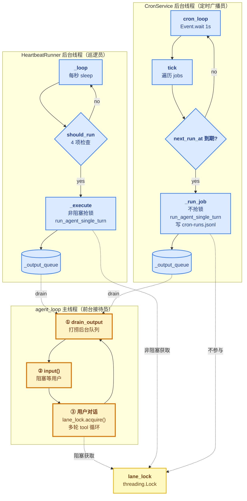

# 07 - Heartbeat & Cron

> [!note]
> 从**被动响应**（用户问 → agent 答）变成**主动唤醒**（agent 自己决定要不要说话）。两个独立后台线程：**HeartbeatRunner** 周期性"巡逻"让 LLM 判断"要不要开口"，**CronService** 按 `CRON.json` 定时跑结构化任务。
>
> 这一节是 **claw0 从 CLI 走向常驻服务**的标志——agent_loop 不再只接 `input()`，而是合成 3 个事件源（用户 / 心跳 / cron），靠一把 `lane_lock` 解决优先级。

> [!warning] 编号说明
> 这是 claw0 第 7 节（s07），属于 [[README|Claw-Theory]] Phase 7 的第 4 步。前置：[[06 - Intelligence]]（HEARTBEAT.md 在那里加载）。后继：[[08 - Delivery]] 会把 `_output_queue` 替换成更系统的投递管道。

> [!tip] 数据样例
> - HEARTBEAT.md 的实际内容（含 `HEARTBEAT_OK` 约定）：[`../数据样例/01 - workspace 配置文件.md#HEARTBEAT.md`](../数据样例/01%20-%20workspace%20配置文件.md)
> - CRON.json 的 4 种 schedule 类型（cron / at / every / 一次性）：[`../数据样例/02 - CRON 调度配置.md`](../数据样例/02%20-%20CRON%20调度配置.md)

## 这节重点关注

读完这一节应该能回答 6 个问题：

1. **心跳和 cron 都是"定时跑"，本质差异是什么？** → 看 [[#心跳 vs Cron：两种抽象的对比]]（探询 vs 任务）
2. **lane_lock 为什么只在用户和心跳之间共享，cron 不参与？** → 看 [[#Lane 锁的不对称设计]]（有意的不对称）
3. **s07 和 [[14 - Cron Scheduler|learn-claude-code s14]] 的对称互斥设计有什么取舍差异？** → 看 [[#vs learn-claude-code s14：两种 cron 范式]]
4. **心跳什么时候会真的"说话"？为什么教学版几乎看不到效果？** → 看 [[#HEARTBEAT_OK 与"沉默权"]] + [[#Q&A]] Q3
5. **CronService 的 3 种调度类型怎么算下次触发时间？** → 看 [[#CronService 的 3 种调度类型]]
6. **心跳和 cron 怎么跟主 agent_loop 通信？** → 看 [[#整体架构图]] 的 queue + drain 模式

**略读指引**：`/heartbeat` `/trigger` `/cron` `/lanes` 这些 REPL 命令（L562-599）都是 thin wrapper，不是机制核心；`croniter` 库的用法细节用时再查；`_compute_next` 的时区 / 锚点细节是工程难点但不是设计重点。

## 这一步加了什么

| 新增 | 作用 | 重点? |
|---|---|---|
| `HeartbeatRunner` 类（~167 行） | 后台线程每秒检查 should_run()，非阻塞抢 lane_lock，跑 agent 后去重入队 | ★★ |
| `CronService` + `CronJob` 类（~172 行） | 后台线程每秒 tick，按 `next_run_at` 到期触发，连续 5 次错误自动禁用 | ★★ |
| `lane_lock = threading.Lock()` | agent_loop 里建一次，传给 HeartbeatRunner，**不传给 CronService** | ★★★ |
| `_output_queue` + `drain_output()` | 后台 → 主线程的唯一通道（list + queue_lock） | ★ |
| REPL 命令 `/heartbeat` `/trigger` `/cron` `/lanes` | 用户态调试入口 | |
| `run_agent_single_turn()` | 单轮 LLM 调用（**不带 messages 历史**），心跳和 cron 共用 | ★ |
| `cron-runs.jsonl` | Cron 运行日志，每条一行 JSON（可审计） | |

## 演进与动机

### 反例：s06 的 agent_loop 只有 `input()` 一个事件源

```python
# s06 的做法（简化）
while True:
    user_input = input(...)         # ← 阻塞，唯一事件源
    run_agent_turn(user_input)
```

**3 个痛点**：

1. **agent 完全被动** —— 用户不发话，agent 啥也不干。无法做"早上 9 点主动日报"。
2. **后台任务没地方放** —— 想加"每 30 分钟检查邮件"要重写整个循环结构。
3. **后台和前台会撞车** —— 即便硬塞后台线程进去，也可能跟用户对话同时调 LLM API 撞 rate limit，或把回复插到用户对话中间。

### 解法核心：**事件合成器 + 不对称锁**

- **3 个事件源**：用户（同步阻塞）/ 心跳（后台线程，每秒探询）/ cron（后台线程，每秒 tick）
- **lane_lock 不对称**：用户阻塞抢、心跳非阻塞抢、**cron 不参与**
- **队列解耦**：后台产生消息塞 `_output_queue`，主循环开头统一 `drain_output()` 打捞

**关键洞察**：心跳和 cron 是**两种不同的抽象**，不要统一。心跳是"让 agent 自己决定要不要说话"（探询式），cron 是"按约定执行任务"（承诺式）。统一反而会丢失语义。

## 核心抽象

### 1. `lane_lock` —— 不对称的互斥锁

```python
lane_lock = threading.Lock()

# 用户路径：阻塞获取（永远赢）
lane_lock.acquire()
try: ... finally: lane_lock.release()

# 心跳路径：非阻塞获取（拿不到就跳过）
acquired = lane_lock.acquire(blocking=False)
if not acquired: return

# Cron 路径：完全不参与
# → 可能跟用户、心跳、其他 cron 任务并发跑
```

**契约**：锁只在 agent_loop 里创建一次，**传给 HeartbeatRunner 但不传给 CronService**。

**为什么不对称**：心跳是"问一句要不要说话"，被挡掉没损失（下次再问）；cron 是"9 点必须跑日报"，被挡掉就是漏跑，违背契约。

### 2. `HeartbeatRunner` —— 探询式唤醒器

```python
@dataclass-equivalent class HeartbeatRunner:
    workspace: Path
    heartbeat_path: Path                    # workspace/HEARTBEAT.md
    lane_lock: threading.Lock               # 共享自 agent_loop
    interval: float = 1800.0                # 默认 30 分钟
    active_hours: tuple[int, int] = (9, 22) # 不在时段内不跑
    max_queue_size: int = 10
    # 内部状态
    last_run_at: float
    running: bool
    _output_queue: list[str]
    _queue_lock: threading.Lock
    _last_output: str                       # 去重锚点
```

**契约**：
- `start()` / `stop()`：启停后台线程
- `should_run() -> tuple[bool, str]`：4 项前置检查（文件存在 / 非空 / 间隔到了 / 时段内 / 没在跑）
- `_execute()`：非阻塞抢锁 → 拼 prompt（HEARTBEAT.md + SOUL.md + MEMORY.md + 当前时间）→ 单轮 agent 调用 → 解析去重 → 入队
- `drain_output() -> list[str]`：主线程打捞消息（原子 copy + clear）
- `trigger() -> str`：手动触发（绕过 should_run，但仍抢锁）

### 3. `CronService` —— 任务调度器

```python
@dataclass
class CronJob:
    id: str
    name: str
    enabled: bool
    schedule_kind: str          # "at" | "every" | "cron"
    schedule_config: dict       # kind 不同，字段不同
    payload: dict               # {"kind": "agent_turn", "message": "..."}
                                # 或 {"kind": "system_event", "text": "..."}
    delete_after_run: bool = False
    consecutive_errors: int = 0
    last_run_at: float = 0.0
    next_run_at: float = 0.0

class CronService:
    cron_file: Path             # workspace/CRON.json
    jobs: list[CronJob]
    _run_log: Path              # workspace/cron/cron-runs.jsonl
```

**契约**：
- `load_jobs()`：启动时从 CRON.json 读，按 schedule_kind 解析，算初始 `next_run_at`
- `tick()`：每秒调一次，遍历 jobs，到期的执行
- `_run_job(job, now)`：执行单个任务，记日志，更新 `consecutive_errors` 和 `next_run_at`
- `trigger_job(id)`：手动触发（绕过调度，但仍跑）

### 4. `run_agent_single_turn()` —— 无状态 LLM 调用

```python
def run_agent_single_turn(prompt: str, system_prompt: str | None = None) -> str:
    """单次 LLM 调用，不带 messages 历史，不更新 messages。"""
```

**心跳和 cron 共用这个函数**，**不读 agent_loop 的 messages 列表**——这是个**有意的设计**：后台任务和用户对话的上下文完全隔离，避免互相污染。

## 整体架构图



**读图关键**：
- 3 个 subgraph 是**独立线程**，互不直接调用
- 唯一共享是 `lane_lock`（仅用户 + 心跳）和**输出队列**（心跳 + cron 各有自己的）
- 虚线表示"间接交互"（共享锁 / drain 打捞），实线表示线程内部控制流
- `cron-runs.jsonl` 是 cron 独有的持久化日志（心跳没有）

## Lane 锁的不对称设计

整节最容易看错的地方。一句话：

```python
# agent_loop L499
lane_lock = threading.Lock()

# L503-504: heartbeat 拿到锁的引用
heartbeat = HeartbeatRunner(..., lane_lock=lane_lock, ...)

# L509: cron 没拿到锁
cron_svc = CronService(WORKSPACE_DIR / "CRON.json")
```

**后果**：

| 组合 | 是否互斥 |
|---|---|
| 用户 ↔ 心跳 | ✅ 互斥（用户跑时心跳让步） |
| 用户 ↔ cron | ❌ **不互斥！并发跑** |
| 心跳 ↔ cron | ❌ **不互斥！并发跑** |
| 多个 cron 任务之间 | ❌ **不互斥！并发跑** |

**为什么这么设计**：

- **心跳是探询式**——"看看有没有事"，被挡掉也没损失，下次再问
- **Cron 是承诺式**——"9 点必须跑日报"，挡掉就是漏跑，违背契约

这是**有意的不对称**，不是疏漏。**cron 不抢锁是 feature，不是 bug**。

## vs learn-claude-code s14：两种 cron 范式

这一节和 [[14 - Cron Scheduler|learn-claude-code s14]] 是 **claw0 整个 Phase 7 跟 learn-claude-code 唯一的范式分歧**——其他节都是"同一思想的不同实现"，唯独 cron 这块，两个项目做了**根本不同的架构选择**。学过 learn-claude-code 再读 s07，必须理解这个对照，否则会把 claw0 的设计当成"标准"。

### s14：对称互斥（一把锁）

```python
# learn-claude-code s14 的核心
agent_lock = threading.Lock()    # 一把锁

# 用户路径
with agent_lock:
    run_agent_turn_locked(query)

# Cron 路径（queue_processor 守护线程）
if not agent_lock.acquire(blocking=False): continue   # 抢不到让步
try:
    run_agent_turn_locked()                             # ← 走同一条 agent turn
finally:
    agent_lock.release()
```

**设计**：
- Cron 任务通过 **queue + processor** 投递，最终走和用户**同一条 agent_turn 路径**
- **共享同一份 messages / session_history**
- 两路径都抢 `agent_lock`，**对称互斥**

**语义**：cron 就是"**延迟的用户消息**"。Agent 视角下分不清这次 turn 是用户还是 cron 触发的——cron 跑的内容进入主对话历史，用户下一句问"刚才那个报告什么意思"，agent 看得见上下文。

### s07：不对称（cron 不参与）

```python
# claw0 s07 的核心
lane_lock = threading.Lock()    # 一把锁

# 用户路径
lane_lock.acquire()
try: ... finally: lane_lock.release()

# 心跳路径（非阻塞抢，让步）
acquired = lane_lock.acquire(blocking=False)
if not acquired: return

# Cron 路径：完全不参与
output = run_agent_single_turn(msg, sys_prompt)   # ← 独立调用，独立 messages
```

**设计**：
- Cron **不走 agent_loop**，直接调 `run_agent_single_turn`（无状态、独立 messages）
- **后台和前台的 messages 完全隔离**
- Cron 不抢锁，跟用户可能并发跑

**语义**：cron 是"**独立的后台任务**"，跟用户对话是两条平行的故事线。

### 五维对比

| 维度 | s14（对称互斥） | s07（不对称） |
|---|---|---|
| 锁模型 | 一把 agent_lock，用户+cron 都抢 | 一把 lane_lock，仅用户+心跳 |
| Cron 路径 | agent_loop 同一条 | run_agent_single_turn 独立 |
| Messages | ✅ 共享 session_history | ❌ 各自独立 |
| 触发延迟 | 用户跑完才能跑（队列等待） | 立刻跑，不延迟 |
| 跑的内容 | 进主对话历史（用户后续看得见） | 进 `_output_queue`（独立投递） |
| LLM rate limit | 不会撞（互斥） | 可能撞（并发） |
| 上下文连续性 | 高（cron 跟用户对话衔接） | 低（cron 不知道用户聊了啥） |

### 为什么会分歧

两个项目**目标场景不同**：

- **learn-claude-code 是 CLI coding agent**——用户坐在终端前跟 agent 长时间协作。Cron 任务是"我等会儿帮我跑个测试"、"每天 9 点拉一下 PR 状态"——这些**本质是对话的一部分**。强行隔离会让用户问"昨天那个报告哪去了"时答不上来。

- **claw0 是常驻服务 / IM bot 前身**——用户**不在场**，agent 服务多个用户、多个通道。Cron 任务是"主动 push 通知"、"全局巡更"——这些**本质是系统侧主动行为**，跟某个用户的对话不属于一个故事。强行共享 messages 会污染对话。

**关键洞察**：cron 的语义在两种场景里**根本不一样**。

- CLI 场景：cron = **用户委托的延迟指令**（"替我跑") → 应该走对话路径
- IM 场景：cron = **agent 主动的告知行为**（"我要说") → 应该独立

所以 s07 不抢锁不是"claw0 的设计失误"（学过 s14 容易这么误读），而是**为了 IM 场景刻意做的偏离**。同理 s14 不让 cron 独立也不是"learn-claude-code 不懂解耦"，而是**为了对话连续性必须做的耦合**。

### 共通的部分

虽然锁模型不同，两者在**架构解耦**上是同源的：

| 抽象 | s14 | s07 |
|---|---|---|
| 调度层（Scheduler） | `cron_scheduler_loop` 守护线程 A，每秒检查时间 | `cron_loop` 守护线程，每秒 `tick()` |
| 触发缓冲 | `cron_queue` list + `cron_lock` | `_output_queue` list + `_queue_lock` |
| 持久化 | `.scheduled_tasks.json`（durable job） | `CRON.json` + `cron-runs.jsonl` 运行日志 |
| 错误处理 | 重试逻辑（在 queue_processor） | **5 次连续错误自动禁用** |
| 锁获取点 | queue_processor 抢 `agent_lock` | 用户抢 `lane_lock`、心跳非阻塞抢 |

**学到的东西**：cron 系统的"调度 + 缓冲 + 持久化"三层模式是通用的；**锁的获取点**才是项目根据场景做的取舍。

## HEARTBEAT_OK 与"沉默权"

心跳最特殊的设计：**让 LLM 自己决定要不要开口**。

```python
def _parse_response(self, response: str) -> str | None:
    if "HEARTBEAT_OK" in response:
        stripped = response.replace("HEARTBEAT_OK", "").strip()
        return stripped if len(stripped) > 5 else None  # ← HEARTBEAT_OK 主体则抑制
    return response.strip() or None
```

**约定**：LLM 输出包含 `HEARTBEAT_OK` → 表示"没事报告"，抑制输出。

**为什么这么设计**：
- 心跳代码本身**没有任何判断逻辑**——它不知道"什么算重要"
- 判断完全靠 `HEARTBEAT.md` 里的指令 + LLM 的理解
- 这是"**把判断权交给 LLM**"的工程化体现

**配套的去重机制**（L219-221）：

```python
if meaningful.strip() == self._last_output:
    return  # 跟上次说的一样，不入队
self._last_output = meaningful.strip()
```

避免 agent 每 30 分钟重复同一条"提醒"——这是"沉默权"的第二道防线。

## CronService 的 3 种调度类型

`_compute_next(job, now)` 算下次触发时间戳：

```python
if job.schedule_kind == "at":
    # 一次性：到指定时间跑一次
    ts = datetime.fromisoformat(cfg["at"]).timestamp()
    return ts if ts > now else 0.0  # 过期返回 0，永远不再跑

if job.schedule_kind == "every":
    # 间隔：固定周期，对齐到锚点
    every = cfg.get("every_seconds", 3600)
    anchor = parse(cfg.get("anchor")) or now
    steps = int((now - anchor) / every) + 1
    return anchor + steps * every    # 下一个对齐点

if job.schedule_kind == "cron":
    # 标准 cron 表达式："0 9 * * *"（每天 9 点）
    return croniter(expr, now).get_next(datetime).timestamp()
```

**关键差异**：

| kind | 配置字段 | 触发模式 | 失败后 |
|---|---|---|---|
| `at` | `{"at": "2026-06-22T09:00:00"}` | 一次性，跑完 `delete_after_run` 可选 | 重试（仍按 at 时间算 next） |
| `every` | `{"every_seconds": 3600, "anchor": "..."}` | 周期性，**对齐到锚点**保证触发时间可预测 | 下个对齐点继续 |
| `cron` | `{"expr": "0 9 * * *"}` | 标准 5 字段表达式 | 下个表达式匹配点继续 |

**为什么 `every` 要对齐到锚点**：

```python
# 假设 every=3600s, anchor=今天 00:00
# 当前 10:35 → steps=11 → next = 00:00 + 11*3600 = 11:00
# 而不是 11:35（从当前时间加 1 小时）
```

对齐的好处：触发时间**可预测**（总是整点），重启进程后下一次触发时间不变。如果按"当前时间 + interval"，重启就会漂移。

**错误自动禁用**（L430-438）：

```python
if status == "error":
    job.consecutive_errors += 1
    if job.consecutive_errors >= 5:
        job.enabled = False          # ← 静默停止
        # 告警塞进 _output_queue
else:
    job.consecutive_errors = 0       # ← 成功一次就清零
```

**5 次是经验阈值**——太少容易误杀（偶发网络错），太多变僵尸任务持续烧资源。生产代码（OpenClaw）可配置。

## OpenClaw 生产代码对应

| 方面 | claw0 s07（教学版） | OpenClaw 生产 |
|---|---|---|
| Lane 互斥 | `threading.Lock` 非阻塞 | 相同锁模式（生产用 `asyncio.Lock` 更常见） |
| 心跳配置 | `HEARTBEAT.md` 单文件 | 相同文件 + **环境变量覆盖** + 多 agent 各自心跳 |
| Cron 调度 | `CRON.json`，3 种类型 | 相同格式 + **webhook 触发器** + 分布式锁 |
| 自动禁用 | 连续 5 次错误 | 相同阈值 + **告警通道**（Slack/邮件） |
| 输出投递 | 内存队列 → REPL print | **投递管道**（s08 主题）：Slack DM / 邮件 / push |
| Cron 日志 | `cron-runs.jsonl` 本地 | 集中式日志（ELK / Loki）+ 告警 |
| 并发控制 | 无（cron 多任务并发跑） | **信号量限并发**，避免 LLM API rate limit |
| 错误恢复 | 自动禁用 = 静默 | 自动禁用 + **指数退避重试** + 人工恢复命令 |

**最大的生产差异**：教学版心跳只输出到屏幕（CLI），生产必须接 IM（Slack/飞书）才有意义——否则用户不在场，心跳说话也没人看到。这就是为什么 PuinClaw 接 Slack 是心跳生效的前提。

## 设计要点

1. **不对称锁是设计而非疏漏** —— 用户 ↔ 心跳互斥，用户 ↔ cron 不互斥。心跳可让步（下次再问），cron 不能让步（漏跑违背契约）。
2. **队列解耦后台与前台** —— 后台产生消息塞 `_output_queue`，主循环 `drain_output()` 打捞。后台**不直接调** agent_loop 的代码，主循环也**不感知**后台细节。
3. **沉默权交给 LLM** —— HEARTBEAT_OK 不是代码判断，是 prompt 约定。让 LLM 自己决定"这次要不要开口"是心跳的核心创新。
4. **去重避免唠叨** —— `_last_output` 记上次说的内容，相同则抑制。这是用户体验的最后一道防线。
5. **every 对齐锚点保证可预测** —— 重启进程后下一次触发时间不变，避免漂移。
6. **错误自动禁用避免僵尸任务** —— 5 次连续失败就停，写告警进队列。不让坏任务无限烧钱。
7. **后台任务的 messages 隔离** —— `run_agent_single_turn` 不读 agent_loop 的 messages，不写入 messages。后台和前台的对话历史完全独立。
8. **`threading.Event` vs `time.sleep`** —— Cron 后台用 `Event.wait(timeout=1.0)`，比 `sleep` 优雅（`set()` 立刻唤醒退出）。心跳用 `time.sleep(1.0)` 是简化，生产代码也该换成 Event。

## 相关概念

- [[06 - Intelligence]] —— HEARTBEAT.md 在 s06 第 6 层 Bootstrap 注入 prompt
- [[04 - Channels]] —— s07 的输出还只到 CLI 屏幕，s08 才会接入正式通道
- [[05 - Gateway & Routing]] —— 多 agent 场景下，每个 agent 该有独立的心跳（s07 是单 agent 退化版）
- [[14 - Cron Scheduler]] —— **learn-claude-code 对应节**，两种 cron 范式对照（详见 [[#vs learn-claude-code s14：两种 cron 范式]]）
- [[12 - Background Tasks]] —— learn-claude-code 的子任务 / spawn 模式
- [[对话精华]] —— Q22+ 记录 s07 的卡点

> [!warning] 易踩坑
> - **lane_lock 看似共享，实则不对称** —— cron 没拿到锁的引用，是**故意的**。如果你"统一"地给 cron 也加上锁，会破坏 cron 的承诺式语义。
> - **HEARTBEAT.md 改了不会立刻生效** —— 下次心跳才读到新内容（s07 不监听文件变化）。改完想立刻看效果用 `/trigger` 手动触发。
> - **教学版心跳"看不到效果"是正常的** —— 教学版没接外部数据源、没接 IM，agent 每次只能 HEARTBEAT_OK。心跳的真实价值要 IM + 外部数据 + HEARTBEAT.md 真实指令三件齐备才体现。详见 Q3。
> - **`_last_output` 去重是字节级比较** —— "Hello" 和 "Hello!" 算不同消息都会入队。如果 agent 容易说"差不多的废话"，去重效果会差。
> - **cron 多任务并发可能撞 rate limit** —— s07 没加信号量。多个 9 点同时到期的任务会同时调 LLM API。生产必须加并发限制。
> - **`cron-runs.jsonl` 无限增长** —— s07 没做日志轮转。长期跑会越积越大，需要外部 logrotate 或自己加轮转逻辑。
> - **CronJob 的 `delete_after_run` 只对 `at` 类型生效** —— `every` 和 `cron` 是周期性的，删了就永远不跑。s07 在 L400-401 显式判断，但容易看漏。

## 代码骨架总览

```python
# === 1. HeartbeatRunner：探询式唤醒器 ===
class HeartbeatRunner:
    def __init__(self, workspace, lane_lock, interval=1800.0,
                 active_hours=(9, 22), max_queue_size=10):
        self.heartbeat_path = workspace / "HEARTBEAT.md"
        self.lane_lock = lane_lock                 # ← 从 agent_loop 传入
        self.interval = interval
        self.active_hours = active_hours
        self.last_run_at = 0.0
        self.running = False
        self._output_queue = []
        self._queue_lock = threading.Lock()
        self._last_output = ""                      # 去重锚点

    def should_run(self) -> tuple[bool, str]:
        # 4 项前置检查（锁的检测放到 _execute 里，避免 TOCTOU）
        # 1. HEARTBEAT.md 存在
        # 2. 非空
        # 3. interval 已过
        # 4. 在 active_hours 内
        # 5. 没在跑
        ...

    def _execute(self):
        acquired = self.lane_lock.acquire(blocking=False)  # 非阻塞
        if not acquired: return                            # 用户在跑，让步
        self.running = True
        try:
            instructions, sys_prompt = self._build_heartbeat_prompt()
            response = run_agent_single_turn(instructions, sys_prompt)
            meaningful = self._parse_response(response)    # HEARTBEAT_OK 抑制
            if meaningful is None: return
            if meaningful.strip() == self._last_output: return  # 去重
            self._last_output = meaningful.strip()
            with self._queue_lock:
                self._output_queue.append(meaningful)
        finally:
            self.running = False
            self.last_run_at = time.time()
            self.lane_lock.release()

    def _loop(self):
        while not self._stopped:
            ok, _ = self.should_run()
            if ok: self._execute()
            time.sleep(1.0)

    def drain_output(self) -> list[str]:
        with self._queue_lock:
            items = list(self._output_queue)
            self._output_queue.clear()
            return items

# === 2. CronJob + CronService：任务调度 ===
@dataclass
class CronJob:
    id: str; name: str; enabled: bool
    schedule_kind: str       # "at" | "every" | "cron"
    schedule_config: dict
    payload: dict            # {"kind": "agent_turn"|"system_event", ...}
    consecutive_errors: int = 0
    next_run_at: float = 0.0

CRON_AUTO_DISABLE_THRESHOLD = 5

class CronService:
    def __init__(self, cron_file):
        self.jobs = []
        self._output_queue = []
        self._run_log = CRON_DIR / "cron-runs.jsonl"
        self.load_jobs()

    def _compute_next(self, job, now) -> float:
        # at: datetime.fromisoformat(...) 一次性
        # every: anchor + steps * every（对齐）
        # cron: croniter(expr, now).get_next(datetime)
        ...

    def tick(self):
        now = time.time()
        for job in self.jobs:
            if not job.enabled or now < job.next_run_at: continue
            self._run_job(job, now)

    def _run_job(self, job, now):
        try:
            if job.payload["kind"] == "agent_turn":
                output = run_agent_single_turn(job.payload["message"], sys_prompt)
            elif job.payload["kind"] == "system_event":
                output = job.payload["text"]
        except Exception as exc:
            status, error = "error", str(exc)

        if status == "error":
            job.consecutive_errors += 1
            if job.consecutive_errors >= 5:
                job.enabled = False              # ← 自动禁用
        else:
            job.consecutive_errors = 0

        job.next_run_at = self._compute_next(job, now)
        # 写 cron-runs.jsonl + 入队
        ...

    def drain_output(self) -> list[str]:
        ...  # 同 HeartbeatRunner

# === 3. agent_loop：3 事件源合成器 ===
def agent_loop():
    lane_lock = threading.Lock()                 # ← 整节核心

    heartbeat = HeartbeatRunner(WORKSPACE_DIR, lane_lock=lane_lock, ...)
    cron_svc = CronService(WORKSPACE_DIR / "CRON.json")
    heartbeat.start()                            # 后台线程 1

    cron_stop = threading.Event()
    def cron_loop():
        while not cron_stop.is_set():
            cron_svc.tick()
            cron_stop.wait(timeout=1.0)          # 1 秒 tick
    threading.Thread(target=cron_loop, daemon=True).start()  # 后台线程 2

    messages = []
    while True:
        # ① 打捞后台消息
        for msg in heartbeat.drain_output(): print_heartbeat(msg)
        for msg in cron_svc.drain_output(): print_cron(msg)

        # ② 阻塞等用户
        user_input = input(...)
        if user_input.startswith("/"): handle_repl_command(...); continue

        # ③ 用户对话（阻塞抢锁）
        lane_lock.acquire()
        try:
            messages.append({"role": "user", "content": user_input})
            while True:                          # 多轮 tool 循环
                response = client.messages.create(..., messages=messages)
                if response.stop_reason == "end_turn": break
                elif response.stop_reason == "tool_use": ...
        finally:
            lane_lock.release()                  # 多轮工具全程持锁

    heartbeat.stop()
    cron_stop.set()
```

## Q&A

### Q1: 心跳和 cron 都是"定时跑 agent"，本质差异是什么？

**A**: **两种完全不同的抽象**：

- **Cron = 任务**（"9 点了，跑这段话"）—— 无脑执行，必有输出
- **心跳 = 唤醒**（"我醒了，需要我说话吗？"）—— agent 自己决定沉默或开口

代码上的体现：心跳有 `_parse_response` 检查 `HEARTBEAT_OK`、有 `_last_output` 去重；cron 没这些，跑完就跑完。心跳是"让 LLM 拥有沉默权"，cron 是"按契约执行"。

### Q2: lane_lock 为什么只在用户和心跳之间共享，cron 不参与？

**A**: **有意的不对称**：

- 心跳是探询式——"看看有没有事"，被挡掉没损失（下次再问）
- Cron 是承诺式——"9 点必须跑日报"，被挡掉就是漏跑

所以心跳让步合理，cron 不让步也合理。如果给 cron 也加锁，反而会破坏承诺式语义——9 点到了但用户正在跑，cron 就被挡掉，承诺作废。

**代价**：cron 多任务并发可能撞 LLM rate limit。生产代码在 CronService 内部加信号量解决，**不是用 lane_lock**。

**对比 [[14 - Cron Scheduler|learn-claude-code s14]]**：s14 用**对称互斥**（一把 agent_lock，用户和 cron 都抢），因为 cron 走和用户同一条 agent_turn 路径、共享 messages。claw0 的不对称是为了 IM 场景**刻意做的偏离**——cron 在 IM 场景下是"主动 push 通知"，跟用户对话不属于同一故事线。详见 [[#vs learn-claude-code s14：两种 cron 范式]]。

### Q3: 心跳什么时候会真正说话？为什么教学版几乎看不到效果？

**A**: 心跳说话需要**三个前提同时满足**：

1. **HEARTBEAT.md 写了真实指令**（"如果 X 则报告"）
2. **agent 能访问外部数据源**（查邮件、日历、监控等）
3. **通过 IM 通道推送**（Slack / 飞书，用户不在场也能收到）

教学版**三件套全无**——HEARTBEAT.md 是占位、agent 没接外部数据、输出只到 CLI 屏幕。所以 agent 每次唤醒只能 HEARTBEAT_OK。

**心跳的真实价值场景**：邮件助手（重要邮件才提醒）、长任务监控（异常报警）、日程提醒（提前 15 分钟）、PR review（新 PR 摘要）。共同特征是**用户不在场 + 外部状态变化 + IM 主动 push**。PuinClaw 接上 Slack 后写真实的 HEARTBEAT.md，心跳才真正发光。

### Q4: 为什么心跳用 `run_agent_single_turn` 而不是 agent_loop 的多轮 messages？

**A**: **后台任务和用户对话的上下文必须隔离**：

- 心跳读 HEARTBEAT.md + SOUL.md + MEMORY.md 拼 prompt，不读 messages
- 心跳的输出不入 messages，只入 `_output_queue`
- 否则会污染：用户的对话里突然插一条 agent 的"心跳报告"，模型上下文乱掉

**代价**：心跳看不到用户最近聊了什么。这是**有意的取舍**——心跳的语义是"全局巡更"，不是"对话补充"。

### Q5: `_last_output` 去重为什么用字符串相等而不是相似度？

**A**: **够用 + 便宜**。心跳的输出是 LLM 生成的自然语言，理论上每次都不完全相同；但实际上 agent 在没有新事件时倾向于说"差不多的话"（"目前一切正常，无异常"）。字节比较直接抑制这种情况。

**失效场景**：agent 说 "Hello" 和 "Hello!" 算不同，都入队。这是已知缺陷，生产代码可以加 cosine 相似度判断（>0.9 视为重复），s07 教学版不做。

### Q6: CronService 的 `every` 类型为什么对齐到 anchor，不直接 `now + interval`？

**A**: **可预测性**。假设 `every=3600s`：

- 不对齐：第一次 10:35 跑，下次 11:35，再下次 12:35……漂移
- 对齐到 anchor=00:00：第一次 10:35 跑（迟到），下次 11:00，再下次 12:00……**稳定整点**

**关键场景**：进程重启。如果按"当前 + interval"，重启后第一次触发时间会漂；对齐到 anchor 则重启后立刻按原计划继续。这是分布式调度的基本功。

### Q7: 自动禁用阈值 5 次是凭感觉吗？

**A**: **经验值**：

- 太少（如 2 次）：偶发网络错就误杀
- 太多（如 20 次）：坏任务持续烧资源、烧 token

5 次是大多数 cron 系统的默认（Linux cron、systemd timers、Airflow 都接近这个数）。OpenClaw 生产代码可配置（`CRON_AUTO_DISABLE_THRESHOLD` 改成环境变量）。

**注意**：成功一次就清零（L440）。所以是**连续**错误数，不是累计。

### Q8: agent_loop 主循环开头为什么先 drain_output 再 input()？

**A**: **避免后台消息积压**。如果先 `input()` 再 drain，用户正在打字时心跳塞进队列的消息要等用户回车后才能显示，体验差。

先 drain 后 input 的顺序保证：**每次用户敲回车前，后台积累的消息先全部打印完**。用户看到的总是"最新状态"。

**小细节**：`drain_output` 是 O(n) copy + clear，**原子**（在 `_queue_lock` 内）。所以 drain 时心跳仍在跑，新消息会进新队列，下一轮再 drain。

### Q9: 心跳和 cron 用线程而非 asyncio，是因为 claw0 的历史包袱吗？

**A**: **部分是**。s04 是纯 threading（TG 后台轮询），后续节延续。生产代码（OpenClaw）用 asyncio 更合理——单事件循环 + `asyncio.create_task` 比 threading 更轻、更容易做 cancellation。

**但 s07 即便在 threading 框架下也有可取之处**：`threading.Lock(blocking=False)` 是经典的互斥模式，跟 asyncio 的 `asyncio.Lock` 语义几乎一样。学完 s07 切到 asyncio 版本，**抽象层不变**，只换底层原语。

### Q10: 学 s07 要重点看哪几个函数？

**A**: 必读 5 个抽象层（共 ~120 行核心代码）：

1. `HeartbeatRunner._execute`（L205-230，26 行）—— **本节灵魂**：非阻塞抢锁 + 去重 + 入队
2. `HeartbeatRunner.should_run`（L170-187，18 行）—— 4 项前置检查契约
3. `CronService.tick` + `_run_job`（L392-454，63 行）—— 调度 + 错误自动禁用
4. `CronService._compute_next`（L363-390，28 行）—— 3 种调度类型的核心
5. `agent_loop`（L498-645）的 **L499 + L503-504 + L544-548 + L602/L641** 共 ~10 行 —— 锁的诞生与共享、drain 模式、用户路径加锁

### Q11: s07 和 learn-claude-code s14 的 cron 范式有什么根本差异？

**A**: **两种相反的架构选择**：

- **s14（对称互斥）**：cron 通过 queue 投递、走 agent_loop 同一条路径、共享 messages。一把 `agent_lock` 让用户和 cron 排队。语义：cron 是"**用户委托的延迟指令**"。
- **s07（不对称）**：cron 直接调 `run_agent_single_turn`、独立 messages、不抢锁。一把 `lane_lock` 只在用户和心跳之间。语义：cron 是"**agent 主动的告知行为**"。

**分歧根源**是目标场景：s14 是 CLI coding agent（对话连续性优先），s07 是 IM bot 前身（系统侧通知与用户对话解耦优先）。**两个都不是错**——学过 s14 再读 s07 容易误以为 claw0 设计有缺陷，实际上是为了 IM 场景刻意做的偏离。详见 [[#vs learn-claude-code s14：两种 cron 范式]]。

跳过：`handle_repl_command`（L562-599，调试命令）、`print_*` 系列辅助、croniter 库用法细节（用时再查）。
