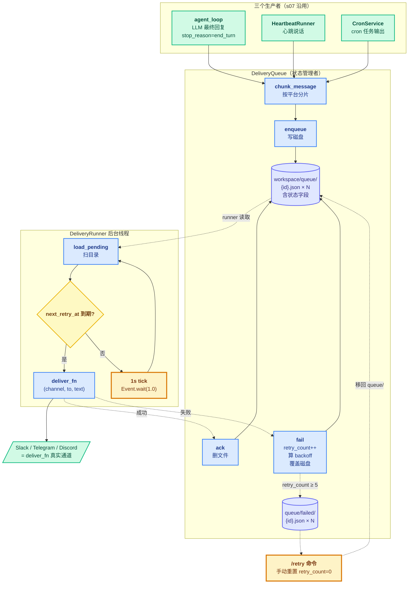

# 08 - Delivery

> [!note]
> 把 s07 的"直接 print 到屏幕"换成"**先写磁盘，再后台异步投递到任意通道**"。三个生产者（用户对话 / 心跳 / cron）都把消息推进同一个 `DeliveryQueue`（磁盘目录里每条一个 JSON 文件），独立的 `DeliveryRunner` 后台线程每秒扫描、尝试发送、失败重试，成功删文件。
>
> 这一节是 **claw0 的崩溃安全层**——核心理念一句话：**"先写磁盘，再尝试发送"**。所有代码（原子写入 / ack/fail / 退避 / 启动恢复）都是为这一句话服务的。这是数据库 **WAL（Write-Ahead Logging）** 思想在 agent 投递层的工程化。

> [!warning] 编号说明
> 这是 claw0 第 8 节（s08），属于 [[README|Claw-Theory]] Phase 7 的第 5 步。前置：[[07 - Heartbeat & Cron]]（三个生产者都来自 s07）。后继：[[09 - Resilience]] 会把投递重试跟模型重试、连接重试组成"三层韧性"。

> [!tip] 数据样例
> QueuedDelivery JSON 的 3 种状态（待发 / 重试中 / failed）和 outbox 目录布局：[`../数据样例/04 - 投递队列.md`](../数据样例/04%20-%20投递队列.md)

## 这节重点关注

读完这一节应该能回答 6 个问题：

1. **QueuedDelivery / DeliveryQueue / DeliveryRunner 三者的职责怎么分？** → 看 [[#核心抽象：三件套解耦]]
2. **原子写入三件套（tmp + fsync + os.replace）每步防什么崩溃场景？** → 看 [[#原子写入三件套：崩溃安全的工程保证]]
3. **三个生产者是怎么都接到同一个队列上的？** → 看 [[#整体架构图]] 的多生产者单消费者
4. **retry_count 为什么只增不减、只有手动 /retry 才重置？跟 [[07 - Heartbeat & Cron#Q7|s07 cron 的 consecutive_errors 成功清零]] 有什么反差？** → 看 [[#retry_count 不重置：跟 s07 cron 的反差]]
5. **±20% jitter 在 BACKOFF_MS 里防什么？** → 看 [[#退避 + jitter：防雷群效应]]
6. **DeliveryRunner 加在 agent_loop 的哪里？** → 看 [[#DeliveryRunner 在 agent_loop 的位置]]

**略读指引**：`MockDeliveryChannel`（50% 失败率模拟器，看一眼即可）；`/queue` `/failed` `/retry` `/stats` 这些 REPL 命令都是 thin wrapper；`chunk_message` 的 markdown / 代码围栏细节用时再查，重点是"按段落边界切不在词中间断"。

## 这一步加了什么

| 新增 | 作用 | 重点? |
|---|---|---|
| `QueuedDelivery` dataclass | 单条投递任务（**含状态字段**：retry_count / next_retry_at / last_error） | ★ |
| `DeliveryQueue` 类（~130 行） | **本节灵魂**：磁盘队列 + ack/fail/move_to_failed/retry_failed | ★★★ |
| `_write_entry()` 原子写入三件套 | tmp + fsync + os.replace，保证崩溃时不产生半写文件 | ★★★ |
| `compute_backoff_ms()` + `BACKOFF_MS` | 指数退避 [5s, 25s, 2min, 10min] + ±20% jitter | ★★ |
| `chunk_message()` | 按平台字符上限（telegram=4096、discord=2000）分片，尊重段落边界 | ★ |
| `DeliveryRunner` 类（~95 行） | 后台线程 1 秒 tick + 启动 recovery_scan + 串行投递 | ★★ |
| `MockDeliveryChannel` | 测试用假通道，支持 50% 失败率（看一眼即可） | |
| `/queue` `/failed` `/retry` `/stats` 命令 | REPL 调试入口 | |
| agent_loop 接入：3 个生产者都 enqueue | 替换 s07 的 `_output_queue` 模式 | ★ |

## 演进与动机

### 反例：s07 的 `_output_queue` 是内存队列

```python
# s07 的输出路径
with self._queue_lock:
    self._output_queue.append(meaningful)    # ← 内存

# 主线程
for msg in heartbeat.drain_output():
    print_heartbeat(msg)                     # ← print 到屏幕
```

**4 个痛点**：

1. **进程崩 → 队列清空 → 消息丢** —— 内存数据结构没有持久性
2. **print 到屏幕 ≠ 真实用户** —— CLI 场景碰巧等同，IM 场景根本没发出去
3. **没有重试** —— 网络抖动一次就丢一条消息，没有兜底
4. **没有反馈循环** —— agent 不知道发送是否成功，无失败 / 重试日志

### 解法核心：**磁盘 WAL + 异步投递 + 重试退避**

- **每条消息一个 JSON 文件**（不是一个大 queue 文件）—— 简化原子性，每条独立 ack/fail
- **入队时先落盘再返回** —— 即便发送前崩溃，重启时 recovery_scan 会重新扫到
- **独立的 DeliveryRunner 后台线程** —— 主循环不被慢速网络调用阻塞
- **指数退避 + jitter** —— 失败不立刻重试，避免雪崩

**关键洞察**：s08 把 s07 的"**输出 = print 字符串**"换成"**输出 = 往磁盘写一个 .json + 让后台线程异步投递**"。落盘的不是"消息文本"，是"**投递任务**"（含 retry_count / next_retry_at / last_error 等状态字段）。这让投递的可靠性与产生者彻底解耦。

## 核心抽象：三件套解耦

### 1. `QueuedDelivery` —— 投递任务（不是消息）

```python
@dataclass
class QueuedDelivery:
    id: str                  # 12 字符 uuid
    channel: str             # 发哪个通道（"slack" / "telegram" / "console" / ...）
    to: str                  # 发给谁（频道 id / 用户 id）
    text: str                # 消息文本
    enqueued_at: float       # 入队时间戳
    retry_count: int = 0     # 已重试次数（只增不减）
    next_retry_at: float = 0.0   # 下次重试时间（0 = 立即）
    last_error: str | None = None  # 上次失败原因
```

**8 个字段中只有 3 个是消息内容**（channel / to / text），**5 个是任务状态**。这就是为什么 s08 持久化的是"任务"而非"文本"——重启后 runner 知道接着干什么：哪条要重试、哪条等下次、哪条已经失败了几次。

### 2. `DeliveryQueue` —— 状态管理者（写盘 + 状态机）

```python
class DeliveryQueue:
    queue_dir: Path          # workspace/queue/
    failed_dir: Path         # workspace/queue/failed/
```

**对外 6 个方法**：

| 方法 | 作用 | 何时调 |
|---|---|---|
| `enqueue(channel, to, text)` | 写入磁盘（原子三件套），返回 id | 生产者产生消息时 |
| `ack(id)` | 删 .json 文件 | runner 投递成功时 |
| `fail(id, error)` | retry_count++ + 算 backoff + 覆盖磁盘；到 5 次移到 failed/ | runner 投递失败时 |
| `move_to_failed(id)` | os.replace 从 queue/ 移到 failed/ | fail() 内部触发 |
| `retry_failed()` | 把 failed/ 全部移回 queue/，**retry_count 重置为 0** | 用户调 `/retry` 命令 |
| `load_pending()` / `load_failed()` | 扫目录解析 JSON | runner 每 1 秒 / REPL 命令 |

**契约**：queue **不做投递逻辑**，只管"状态在磁盘上长什么样"。投递交给 runner 注入的 `deliver_fn`。

### 3. `DeliveryRunner` —— 调度器（1 秒 tick）

```python
class DeliveryRunner:
    queue: DeliveryQueue
    deliver_fn: Callable[[str, str, str], None]   # 依赖注入
    total_attempted / total_succeeded / total_failed: int   # 统计
```

**对外 4 个方法**：

| 方法 | 作用 |
|---|---|
| `start()` | 先 `recovery_scan()` 打印状态，再起后台线程 |
| `stop()` | `Event.set()` 唤醒 + join 3 秒 |
| `_process_pending()` | 扫 → 跳过未到期 → 调 deliver_fn → ack/fail |
| `get_stats()` | 给 `/stats` 命令用 |

**契约**：runner **不做状态管理**（不写 retry_count / next_retry_at），只把"投递结果"转发给 queue 的 ack/fail。两者职责严格分开。

## 整体架构图



**读图关键**：
- 3 个生产者**共用**一个 DeliveryQueue（多生产者）
- 1 个 DeliveryRunner 消费（单消费者）—— **多生产者单消费者** 解耦模式
- 生产者和消费者**不直接通信**，通过磁盘目录交换
- `deliver_fn` 是依赖注入，换通道（Slack → 飞书）只改这一处，queue/runner 一行不动

## 原子写入三件套：崩溃安全的工程保证

`_write_entry()` 是 s08 的设计基石，必须理解每一步防什么：

```python
def _write_entry(self, entry):
    final_path = self.queue_dir / f"{entry.id}.json"
    tmp_path = self.queue_dir / f".tmp.{os.getpid()}.{entry.id}.json"

    data = json.dumps(entry.to_dict(), indent=2, ensure_ascii=False)
    with open(tmp_path, "w", encoding="utf-8") as f:
        f.write(data)
        f.flush()                          # ← 第 1 步：写到 .tmp 文件 + flush
        os.fsync(f.fileno())               # ← 第 2 步：数据落盘

    os.replace(str(tmp_path), str(final_path))  # ← 第 3 步：原子 rename
```

### 每一步防什么崩溃

| 步骤 | 在这步崩溃 → 后果 | 为什么安全 |
|---|---|---|
| 写 .tmp 文件中途 | .tmp 文件是半写状态，但 final 文件**不存在**（没被生成） | 半写文件孤立无害，下次启动可清理 |
| flush 后、fsync 前 | 数据在 OS page cache，没到磁盘 → 断电丢失 | .tmp 还在，final 没生成，等同于"没入队" |
| **fsync 后、replace 前** | **数据已落盘到 .tmp，但 final 还不存在** | 重启时 recovery_scan 不会扫到（glob `*.json` 不匹配 `.tmp.*`），**这条消息丢了** ⚠ |
| **replace 中间** | POSIX 保证 `rename(2)` 是**原子**的 | 要么旧文件（如果有）要么新文件，绝不是半写 |

**唯一会丢消息的场景**：fsync 后、replace 前。这窗口通常几微秒，生产里可以接受。完全消除需要 `journal` 或事务性文件系统，超出 s08 教学版范围。

**为什么用 `.tmp.{pid}.{id}.json` 而不是 `.tmp.{id}.json`** —— 多进程并发时不会撞文件名。pid 前缀让每个进程的临时文件独立。

### ack/fail 也是磁盘状态变更

```python
def ack(self, id):
    (self.queue_dir / f"{id}.json").unlink()    # ← 删文件

def fail(self, id, error):
    entry.retry_count += 1
    entry.next_retry_at = time.time() + backoff
    self._write_entry(entry)                     # ← 覆盖磁盘，同样原子三件套
```

**所有状态变更都走 `_write_entry`** —— ack 是删（更简单）、fail 是覆盖（重写整个 JSON）。这保证 runner 跑完一轮后，磁盘上的 .json 永远是最新状态。

## retry_count 不重置：跟 s07 cron 的反差

s08 的 retry_count **只增不减**，唯一重置路径是手动 `/retry` 命令。这跟 [[07 - Heartbeat & Cron#Q7|s07 CronJob.consecutive_errors 成功清零]] **截然相反**：

| | s07 cron | s08 delivery |
|---|---|---|
| 成功后 | **自动清零** | 不清零（文件直接删，entry 没了） |
| 失败累计 | 5 次后 `enabled=False` | 5 次后 `move_to_failed` |
| 重置方式 | 自动（成功一次） | **只有手动 `/retry`** |

### 为什么差异

- **Cron 是周期性任务**——会反复跑，成功一次说明问题已解决，重置合理
- **Delivery 是一次性消息**——成功就消失了，不存在"下次"。retry_count 只在**这条消息**的生命周期里有意义，没必要清零
- **失败语义不同**：cron 的 5 次是"任务坏了"（停掉省钱），delivery 的 5 次是"这条消息送不到"（可能通道问题，挪到 failed/ 等人工看）

### `/retry` 是知情同意

`retry_failed()` 把 failed/ 全部移回 queue/，retry_count 重置为 0，last_error 清空：

```python
def retry_failed(self):
    for file_path in self.failed_dir.glob("*.json"):
        entry = QueuedDelivery.from_dict(json.load(open(file_path)))
        entry.retry_count = 0          # ← 重置
        entry.last_error = None
        entry.next_retry_at = 0.0
        self._write_entry(entry)        # ← 写回 queue/
        file_path.unlink()              # ← 删 failed/
        count += 1
```

**为什么手动而不是自动重试 failed/****：
- 自动 = 给坏任务无限重试机会，烧资源
- 手动 = 用户看过 `/failed`，决定再试（可能是临时通道问题已修复）

**关键洞察**：s08 的哲学是"**失败不丢，但也不无限重试**"——failed/ 是用户的"待办区"，用户决定要不要 `/retry` 或最终人工清理。

## 退避 + jitter：防雷群效应

```python
BACKOFF_MS = [5_000, 25_000, 120_000, 600_000]  # 5s, 25s, 2min, 10min
MAX_RETRIES = 5

def compute_backoff_ms(retry_count: int) -> int:
    idx = min(retry_count - 1, len(BACKOFF_MS) - 1)
    base = BACKOFF_MS[idx]
    jitter = random.randint(-base // 5, base // 5)   # ±20%
    return max(0, base + jitter)
```

### 三个设计决策

1. **指数增长**：5s → 25s（×5）→ 2min（×5）→ 10min（×5）。**第 5 次重试开始停在 10min**（`min(retry_count-1, len-1)`），不再增长——避免长退避把消息拖死。

2. **±20% jitter**：每次在 base 上随机 ±20%。**为什么必要**：假设 10 条消息同时因网络抖动失败，没 jitter → 全部 5 秒后重试 → 又同时撞 rate limit → 又同时失败 → 雪崩。Jitter 让它们错开到 4-6 秒之间，分散负载。

3. **`MAX_RETRIES = 5`**：BACKOFF_MS 只 4 档，但允许重试 5 次——第 5 次失败直接 move_to_failed，不再等。这是"给通道足够时间恢复，但不无限拖"。

### 对比 [[14 - Cron Scheduler|learn-claude-code s14]] 的重试

s14 也有重试但更简单（在 queue_processor 内部），没 jitter 防雷群设计。**s08 的 jitter 是工程化思维**——生产环境的并发失败比单进程重试复杂得多。

## DeliveryRunner 在 agent_loop 的位置

**主循环前 `start()`、主循环后 `stop()`**——跟 HeartbeatRunner 平级模式：

```python
def agent_loop():
    # === 主循环前：搭起来 ===
    queue = DeliveryQueue()
    runner = DeliveryRunner(queue, deliver_fn)
    runner.start()                    # ← 内部先 recovery_scan，再起后台线程

    heartbeat = HeartbeatRunner(queue=queue, ...)
    heartbeat.start()

    # === 主循环 ===
    messages = []
    while True:
        user_input = input(...)
        # ... LLM 调用
        if response.stop_reason == "end_turn":
            print_assistant(assistant_text)        # ← 还在（本地 debug）
            chunks = chunk_message(assistant_text, default_channel)
            for chunk in chunks:
                queue.enqueue(default_channel, default_to, chunk)   # ← 正式投递

    # === 主循环后：拆下来 ===
    runner.stop()
```

**三个观察**：

1. **`runner.start()` 包含 recovery_scan**——启动时打印 `Recovery: queue is clean` 或 `Recovery: 3 pending, 1 failed`，这是 s08 崩溃恢复在用户视角的体现。

2. **`print_assistant` 和 `queue.enqueue` 并联**——本地终端用户照常看到实时回复（开发友好），同时消息走正式投递管道（生产可靠）。这是"**debug 通道 + 生产通道并存**"的设计。

3. **DeliveryRunner 是 s08 的第 3 个后台线程**——前两个是 HeartbeatRunner 和 cron_loop（s07）。三个线程各自独立，互不直接通信。

## OpenClaw 生产代码对应

| 方面 | claw0 s08（教学版） | OpenClaw 生产 |
|---|---|---|
| 队列存储 | 目录中每条一个 JSON 文件 | 相同的"每条目一个文件"模式 |
| 原子写入 | tmp + fsync + os.replace | 相同方案 |
| 退避 | [5s, 25s, 2min, 10min] + ±20% jitter | 相同调度 + **可配置（每通道独立）** |
| 消息分片 | 段落边界分割 | 相同 + **代码围栏感知**（不在 ``` 中间切） |
| 恢复 | 启动时扫目录 | 相同扫描 + **孤立 .tmp 文件清理** |
| 失败处理 | move_to_failed + 手动 `/retry` | + **DLQ（Dead Letter Queue）+ 告警通道** |
| 并发控制 | runner 串行投递 | **多 worker 并行投递** + 信号量限并发 |
| 通道抽象 | `deliver_fn` 注入 | **ChannelAdapter 接口**（统一 Slack/TG/邮件） |
| 指标 | `total_attempted/succeeded/failed` 计数 | **Prometheus metrics** + 告警阈值 |

**最大的生产差异**：教学版 runner **串行**投递（一条失败影响下一条的延迟），生产用 worker pool 并行。并发场景下 jitter + 信号量 + circuit breaker 三件套是标配。

## 设计要点

1. **先写磁盘再操作** —— WAL 思想。`enqueue` 返回前，消息已经安全落盘；投递失败的代价是"重试"，不是"丢失"。
2. **每条一个文件，不是一个大 queue 文件** —— 简化原子性：每条独立 ack/fail，不需要事务。代价是大量小文件（Linux ext4 处理 10 万小文件级别无压力，生产上百万要换 LevelDB / RocksDB）。
3. **状态机交给 queue，调度交给 runner** —— DeliveryQueue 管状态（ack/fail/move_to_failed）、DeliveryRunner 管驱动（扫描/试发/转发结果）。两者职责严格分开，换通道时 runner 不动、换存储时 queue 不动。
4. **多生产者单消费者** —— 三个生产者（agent / heartbeat / cron）共用一个队列，互不感知。生产者只调 `enqueue`，不知道 runner 存在；消费者只调 `load_pending`，不知道生产者是谁。
5. **指数退避 + jitter 防雷群** —— 没 jitter 的退避在并发失败场景会雪崩。±20% 已经够分散，更多（如 ±50%）会让重试时间不可预测。
6. **MAX_RETRIES = 5 + move_to_failed** —— 不丢也不无限重试。failed/ 是用户的"待办区"，手动 `/retry` 重置 retry_count 给第二次机会。
7. **retry_count 只增不减** —— 跟 s07 cron 的"成功清零"反差。Delivery 是一次性消息，没必要清零（成功了文件直接删）；失败累计的语义是"这条消息送不到"，跟 cron 的"任务坏了"不同。
8. **debug 通道 + 生产通道并存** —— `print_assistant` 和 `queue.enqueue` 并联。CLI 用户实时看到回复（开发友好），生产环境走磁盘队列（可靠）。

## 相关概念

- [[07 - Heartbeat & Cron]] —— s08 的三个生产者（用户对话 / 心跳 / cron）全部来自 s07
- [[03 - Sessions]] —— s08 的"每条一个 JSON 文件"和 s03 的"每条 session 一行 JSONL"是两种不同的持久化模式
- [[09 - Resilience]] —— s08 是单层（投递重试），s09 会扩成"连接重试 + 模型重试 + 投递重试"三层
- [[14 - Cron Scheduler]] —— learn-claude-code 对应节，重试设计更简单（无 jitter），s08 是更工程化的版本
- [[对话精华]] —— Q29+ 记录 s08 的卡点

> [!warning] 易踩坑
> - **`print_assistant` 没删** —— 不是"换成 enqueue"，是"**并联**"。本地终端用户仍然实时看到回复（debug 用），生产环境依赖磁盘队列（可靠用）。看代码容易误以为是替换关系。
> - **fsync 后、replace 前的窗口会丢消息** —— 这是教学版已知的极小概率丢失场景。生产用 journal 文件系统或 DB 事务消除。
> - **runner 串行投递** —— 一条消息的 send 阻塞 30 秒，后面所有消息都被拖。生产必须用 worker pool 并发。
> - **`BACKOFF_MS` 只 4 档但允许重试 5 次** —— 第 5 次失败直接 move_to_failed，不等第 5 档。容易看错。
> - **`.tmp.*` 文件不会被扫到** —— `load_pending` 用 `glob("*.json")`，前缀 `.tmp.` 不匹配。这是有意的设计，不是 bug。
> - **`retry_count` 不会因为重启重置** —— 它存在 .json 文件里。重启后 runner 读出来继续累计。**只有 `/retry` 手动重置**。
> - **jitter 是 `[-base/5, +base/5]`** —— 不是 ±20% 的浮点，是整数除法。base=5000 时 jitter 范围是 [-1000, +1000]（含端点）。
> - **`failed/` 不会自动清理** —— 持续累积。生产要加定期清理或上限保护，否则磁盘会塞满。

## 代码骨架总览

```python
# === 1. QueuedDelivery：投递任务数据结构 ===
@dataclass
class QueuedDelivery:
    id: str                      # 12 字符 uuid
    channel: str
    to: str
    text: str
    enqueued_at: float
    retry_count: int = 0         # 只增不减
    next_retry_at: float = 0.0
    last_error: str | None = None

    def to_dict(self) -> dict: ...
    @staticmethod
    def from_dict(data: dict) -> "QueuedDelivery": ...

# === 2. compute_backoff_ms：指数退避 + jitter ===
BACKOFF_MS = [5_000, 25_000, 120_000, 600_000]  # 5s, 25s, 2min, 10min
MAX_RETRIES = 5

def compute_backoff_ms(retry_count: int) -> int:
    if retry_count <= 0: return 0
    idx = min(retry_count - 1, len(BACKOFF_MS) - 1)
    base = BACKOFF_MS[idx]
    jitter = random.randint(-base // 5, base // 5)
    return max(0, base + jitter)

# === 3. DeliveryQueue：状态管理者（写盘 + ack/fail）===
class DeliveryQueue:
    queue_dir = WORKSPACE_DIR / "queue"
    failed_dir = queue_dir / "failed"

    def _write_entry(self, entry: QueuedDelivery) -> None:
        # 原子写入三件套
        final_path = self.queue_dir / f"{entry.id}.json"
        tmp_path = self.queue_dir / f".tmp.{os.getpid()}.{entry.id}.json"
        with open(tmp_path, "w") as f:
            f.write(json.dumps(entry.to_dict(), indent=2, ensure_ascii=False))
            f.flush()
            os.fsync(f.fileno())                    # ← 落盘
        os.replace(str(tmp_path), str(final_path))   # ← 原子 rename

    def enqueue(self, channel, to, text) -> str:
        entry = QueuedDelivery(
            id=uuid.uuid4().hex[:12], channel=channel, to=to, text=text,
            enqueued_at=time.time(),
        )
        self._write_entry(entry)
        return entry.id

    def ack(self, id) -> None:
        (self.queue_dir / f"{id}.json").unlink(missing_ok=True)  # 成功 = 删

    def fail(self, id, error) -> None:
        entry = self._read_entry(id)
        entry.retry_count += 1                       # ← 只增
        entry.last_error = error
        if entry.retry_count >= MAX_RETRIES:
            self.move_to_failed(id); return
        entry.next_retry_at = time.time() + compute_backoff_ms(entry.retry_count) / 1000
        self._write_entry(entry)                      # ← 覆盖磁盘

    def move_to_failed(self, id) -> None:
        os.replace(self.queue_dir / f"{id}.json",
                   self.failed_dir / f"{id}.json")

    def retry_failed(self) -> int:
        # 把 failed/ 全部移回 queue/，retry_count 重置
        for fp in self.failed_dir.glob("*.json"):
            entry = QueuedDelivery.from_dict(json.load(open(fp)))
            entry.retry_count = 0                    # ← 唯一重置路径
            entry.last_error = None
            entry.next_retry_at = 0.0
            self._write_entry(entry)
            fp.unlink()

    def load_pending(self) -> list[QueuedDelivery]:
        # glob("*.json") 不会扫到 .tmp.* 文件
        ...

# === 4. chunk_message：按平台分片 ===
def chunk_message(text: str, channel: str = "default") -> list[str]:
    LIMITS = {"telegram": 4096, "discord": 2000, "slack": 40000, "default": 4096}
    limit = LIMITS.get(channel, LIMITS["default"])
    # 按段落 → 句子 → 词逐级 fallback 切，保证不在词中间断
    ...

# === 5. DeliveryRunner：调度器（1s tick）===
class DeliveryRunner:
    def __init__(self, queue, deliver_fn):
        self.queue = queue
        self.deliver_fn = deliver_fn            # 依赖注入
        self._stop_event = threading.Event()

    def start(self):
        self._recovery_scan()                   # 先打印遗留统计
        self._thread = Thread(target=self._background_loop, daemon=True)
        self._thread.start()

    def _recovery_scan(self):
        pending = self.queue.load_pending()
        failed = self.queue.load_failed()
        # 实际重投靠 _background_loop 启动后第一次 _process_pending
        print_delivery(f"Recovery: {len(pending)} pending, {len(failed)} failed")

    def _background_loop(self):
        while not self._stop_event.is_set():
            try: self._process_pending()
            except Exception as exc: print_error(...)
            self._stop_event.wait(timeout=1.0)   # ← 1s tick，可中断

    def _process_pending(self):
        pending = self.queue.load_pending()
        now = time.time()
        for entry in pending:
            if entry.next_retry_at > now: continue   # 没到期跳过
            try:
                self.deliver_fn(entry.channel, entry.to, entry.text)
                self.queue.ack(entry.id)              # 成功 → 删文件
            except Exception as exc:
                self.queue.fail(entry.id, str(exc))   # 失败 → 重算 backoff

    def stop(self):
        self._stop_event.set()
        self._thread.join(timeout=3.0)

# === 6. agent_loop：接入 3 个生产者 ===
def agent_loop():
    queue = DeliveryQueue()
    def deliver_fn(channel, to, text): ...   # 接 Slack/TG/Mock
    runner = DeliveryRunner(queue, deliver_fn)
    runner.start()                           # 主循环前启动

    heartbeat = HeartbeatRunner(queue=queue, channel=..., to=...)
    heartbeat.start()

    while True:
        user_input = input(...)
        # ... LLM 调用
        if response.stop_reason == "end_turn":
            print_assistant(assistant_text)               # debug 通道
            for chunk in chunk_message(assistant_text):
                queue.enqueue(default_channel, default_to, chunk)  # 生产通道

    runner.stop()                            # 主循环后停止
```

## Q&A

### Q1: QueuedDelivery / DeliveryQueue / DeliveryRunner 的职责怎么分？

**A**: **三件套严格解耦**：
- **QueuedDelivery** = 投递任务的数据结构（8 字段，3 个消息内容 + 5 个任务状态）
- **DeliveryQueue** = 状态管理者（写盘 / ack / fail / move_to_failed / retry_failed）
- **DeliveryRunner** = 调度器（1s tick / 扫描 / 试发 / 把结果转发给 queue）

**关键**：runner **不碰状态**（不写 retry_count），queue **不做投递**（不调 deliver_fn）。换通道（Slack → 飞书）只改 deliver_fn 一处，queue/runner 一行不动。换存储（文件 → RocksDB）只改 queue 内部，runner/生产者无感。

### Q2: 原子写入三件套（tmp + fsync + os.replace）每步防什么？

**A**: 见 [[#原子写入三件套：崩溃安全的工程保证]] 的表。**唯一会丢消息的窗口是 fsync 后、replace 前**（几微秒，生产可接受）。其他场景都安全：写 .tmp 中途崩溃 → 半写文件孤立无害；flush 后 fsync 前 → 等同于没入队；replace 中间 → POSIX 保证原子。

### Q3: retry_count 为什么不自动清零？跟 s07 cron 反差为什么这么大？

**A**: 见 [[#retry_count 不重置：跟 s07 cron 的反差]]。**Delivery 是一次性消息**，成功就消失了，retry_count 没必要清零；**Cron 是周期任务**，会反复跑，成功一次说明问题解决，清零合理。失败语义也不同：cron 5 次是"任务坏了"（停掉省钱），delivery 5 次是"这条送不到"（挪到 failed/ 等人工）。唯一重置路径是用户手动 `/retry`——知情同意，避免坏任务无限烧资源。

### Q4: ±20% jitter 在 BACKOFF_MS 里防什么？

**A**: **防雷群效应（thundering herd）**。10 条消息同时因网络抖动失败，没 jitter → 全部 5 秒后重试 → 又同时撞 rate limit → 又同时失败 → 雪崩。Jitter 让重试时间分散到 4-6 秒之间。生产环境的并发失败比单进程重试复杂得多，jitter 是必须的工程化设计。详见 [[#退避 + jitter：防雷群效应]]。

### Q5: DeliveryRunner 跟 HeartbeatRunner / cron_loop 是平级关系吗？

**A**: **是平级兄弟**——三个独立的 daemon 线程，互不直接通信。三者通过 `agent_loop` 的启动顺序搭起来：`queue = DeliveryQueue()` → `runner.start()` → `heartbeat.start()` → `cron_loop` 起。退出时反过来 stop。三者**唯一共享的状态是 DeliveryQueue**（heartbeat 和 cron 都把 queue 当 enqueue 目标，runner 把 queue 当消费源）。

### Q6: 为什么用 1 秒 tick 而不是事件驱动（比如 queue.enqueue 时立刻 notify）？

**A**: **简化 + 够用**。事件驱动要 condition variable 或 asyncio.Future，s08 用 threading 不好实现得干净。1 秒 tick 的代价是**最多 1 秒延迟**——IM 场景下用户感受不到。如果延迟敏感（如交易系统），用 asyncio + `asyncio.Event` 替代，runner 等待 `event.wait()` 被 enqueue 时 `set()` 唤醒。

### Q7: 进程在 enqueue 写完磁盘后、发送前崩溃，怎么办？

**A**: **重启时 recovery_scan 接着投**。`runner.start()` 内部先跑 recovery_scan（打印统计），然后起后台线程。后台线程第一秒就会扫到这些遗留 .json（因为 `next_retry_at` 默认是 0，立即到期），照常 `deliver_fn` 投递。**最坏情况是重复投递**（如果上次其实已发出去，只是 ack 没写完），不是丢失。这就是 "At-Least-Once" 语义。

### Q8: `/retry` 命令什么时候该用？

**A**: **当 failed/ 目录有内容、且判断失败是临时问题时**。典型场景：Slack API 维护了 30 分钟 → 一堆消息进 failed/ → 维护结束 → `/retry` 全部重投。**不该用的场景**：消息内容本身有问题（如超过通道字符上限），重试多少次都失败——这种情况要看 `last_error` 字段，手工修复后删除。**`/retry` 重置 retry_count=0，给第二次 5 次机会，不是无限重试**。

### Q9: chunk_message 为什么按段落边界切，不直接按字符数硬切？

**A**: **用户体验**。在段落中间硬切会让 markdown 格式错乱（代码块、列表、链接被截断），接收方看到的是乱码。chunk_message 按"段落 → 句子 → 词"三级 fallback 切，保证每个 chunk 是**自洽的语义单元**。生产版会加"代码围栏感知"（不在 ``` 中间切，否则接收方解析失败）。

### Q10: 学 s08 要重点看哪几个函数？

**A**: 必读 5 个抽象层（共 ~200 行核心代码）：

1. `DeliveryQueue._write_entry`（L186-220，~30 行）—— **本节灵魂**：原子写入三件套
2. `DeliveryQueue.enqueue` + `ack` + `fail`（L184-240，~60 行）—— 状态机核心
3. `DeliveryQueue.retry_failed`（L283-303，~20 行）—— 唯一重置路径
4. `DeliveryRunner._process_pending`（L389-419，~30 行）—— 调度循环
5. `compute_backoff_ms` + `BACKOFF_MS`（L103-112，~15 行）—— 指数退避 + jitter

跳过：`MockDeliveryChannel`（测试用）、`chunk_message` 的边界处理细节（用时再查）、REPL 命令实现（thin wrapper）。
