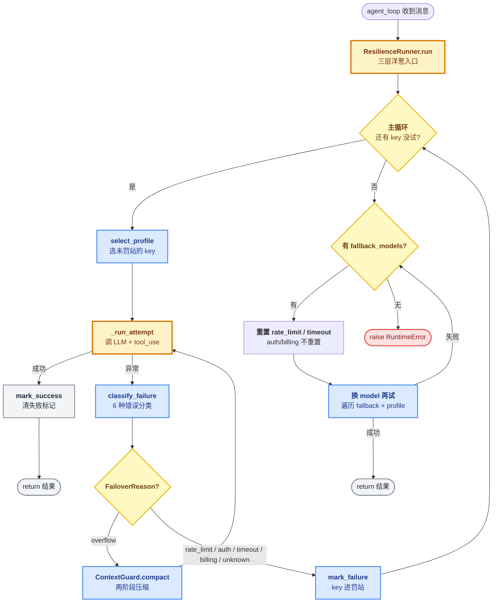

# 09 - Resilience

> [!note]
> 给每次 LLM 调用包**三层洋葱**：外层是 `ProfileManager`（多个 API key 轮换 + 冷却），中层是 `ContextGuard`（上下文溢出时压缩），内层才是真正的 `client.messages.create()`。任意一层失败都能被外层兜住，对用户完全透明。
>
> 这一节是 **claw0 的故障转移层**——核心理念一句话：**"一个 key 挂了换下一个，一个模型挂了换备胎，上下文超了就压缩。"** 这是常驻服务（IM bot / 7×24 agent）的基本功——单 key 单模型必然挂，要么自愈要么人工救火，s09 选了自愈。

> [!warning] 编号说明
> 这是 claw0 第 9 节（s09），属于 [[README|Claw-Theory]] Phase 7 的第 6 步。前置：[[08 - Delivery]]（投递层把消息写盘后，这一节回答"调 LLM 本身挂了怎么办"）。后继：[[10 - Concurrency]] 把单 lane 扩展成多 lane 并发。

## 这节重点关注

读完这一节应该能回答 6 个问题：

1. **三层洋葱是哪三层？每层兜什么类型的失败？** → 看 [[#三层洋葱：ResilienceRunner 的核心结构]]
2. **`classify_failure` 的 6 种错误各对应什么重试策略？** → 看 [[#6 种错误分类：classify_failure]]
3. **`ProfileManager` 怎么用 `cooldown_until` 时间戳实现"罚站 + 自动回归"？** → 看 [[#ProfileManager：多 key 轮换]]
4. **fallback 段为什么要重置 rate_limit/timeout 的冷却但不重置 auth/billing？** → 看 [[#fallback 段：换模型再试一遍]]
5. **`ContextGuard.compact_history` 为什么是"两阶段压缩"而不是直接丢尾部？** → 看 [[#ContextGuard：上下文溢出两阶段压缩]]
6. **跟 [[11 - Error Recovery|learn-claude-code s11]] 的根本差异？** → 看 [[#vs learn-claude-code s11：单 key 自愈 vs 多 key 轮换]]

**略读指引**：`SimulatedFailure`（L561-600，40 行教学辅助——演示注入错误用，生产代码没有，看一眼知道是干嘛的就够）；`safe_path / truncate / tool_bash / tool_read_file`（L434-553）都是 s01-s02 老代码；`handle_repl_command`（L895-987）的 `/resilience-stats` 命令是 thin wrapper。

## 这一步加了什么

| 新增 | 作用 | 行数 | 重点? |
|---|---|---|---|
| `FailoverReason` 枚举 + `classify_failure` | 6 种错误字符串匹配分类 | ~35 | ★★ |
| `AuthProfile` dataclass | 单个 API key + cooldown 状态 | ~18 | ★ |
| `ProfileManager` | **多 key 轮换调度**（select / mark_failure / mark_success） | ~65 | ★★ |
| `ContextGuard` | **上下文溢出两阶段压缩**（truncate_tool_results + LLM 摘要） | ~150 | ★★★ |
| `SimulatedFailure` | 教学用错误注入器 | ~40 | （跳过） |
| `ResilienceRunner` | **本节灵魂**：三层洋葱（profile 轮换 + context 压缩 + LLM 调用） | ~270 | ★★★ |
| `agent_loop` 集成 | 把 `client.messages.create` 替换为 `runner.run()` | ~10 | ★ |

**净增 ~260 行**（s08 → s09：869 → 1126）。最大块是 `ContextGuard`（150 行）和 `ResilienceRunner`（270 行）——这两块占了本节 80% 的信息量。

## 演进与动机

### 为什么 s08 还不够？

s08（Delivery）回答了"消息要发给用户时怎么保证不丢"——通过磁盘队列 + WAL。但 s08 **没回答另一个问题**：**"调 LLM 本身挂了怎么办？"**

s01-s08 的 agent_loop 里，调用 LLM 是这样的：

```python
response = client.messages.create(...)   # ← 挂了就抛异常
```

这一行有 100 种挂法：API 限流（429）、key 失效（401）、网络超时、上下文超限、Anthropic 那边 Opus 集群挂了……s08 不处理这些，直接让异常往上抛到 agent_loop，agent_loop 也没处理——进程崩掉，用户消息丢失。

### 常驻服务的"不能挂"约束

CLI agent（learn-claude-code 那种）挂了无所谓——用户在场，重跑一次就好。但 claw0 是 IM bot 前身：

- **7×24 在线**——bot 不能动不动就离线
- **用户不在场**——挂了用户不会马上知道，消息积累不回复
- **不能依赖人工救火**——半夜 3 点 Opus 集群维护，没人去切 key

所以必须有自动机制：**key 挂了换 key、模型挂了换模型、上下文超了压一压**。这就是 s09 要解决的。

### 三层洋葱的演化逻辑

不是一开始就设计成三层，而是**问题驱动的渐进叠加**：

1. **第一版**：单 key 直接调 → 429 一来就挂 → 加重试？治标不治本，429 期间重试也是 429
2. **第二版**：多 key 轮换 → 401 的 key 反复试浪费配额 → 加冷却
3. **第三版**：多 key + 冷却 → 上下文超限换 key 没用（哪个 key 都超） → 加 ContextGuard
4. **第四版**：上面三层都做了 → Opus 集群挂了所有 key 都失败 → 加 fallback_models
5. **s09 最终**：三层洋葱 + fallback 段 = 完整韧性

## 核心抽象：6 个新概念

### FailoverReason + classify_failure：错误分类器

```python
class FailoverReason(Enum):
    rate_limit = "rate_limit"    # HTTP 429
    auth       = "auth"          # HTTP 401
    timeout    = "timeout"       # 网络层超时
    billing    = "billing"       # HTTP 402 / quota
    overflow   = "overflow"      # context_length_exceeded
    unknown    = "unknown"       # 都不匹配

def classify_failure(exc: Exception) -> FailoverReason:
    msg = str(exc).lower()
    if "rate" in msg or "429" in msg: return FailoverReason.rate_limit
    if "auth" in msg or "401" in msg or "key" in msg: return FailoverReason.auth
    if "timeout" in msg: return FailoverReason.timeout
    if "billing" in msg or "quota" in msg: return FailoverReason.billing
    if "context" in msg or "token" in msg: return FailoverReason.overflow
    return FailoverReason.unknown
```

**为什么用字符串匹配而不是 HTTP 状态码**：Anthropic SDK 抛的是 `AnthropicError`，状态码不一定能稳定拿到；错误消息文案相对稳定。**代价**：Anthropic 改文案就失效（脆弱性）。

### AuthProfile + ProfileManager：多 key 轮换

```python
@dataclass
class AuthProfile:
    name: str                    # 可读标签
    api_key: str
    cooldown_until: float = 0.0  # 罚站截止时间戳
    failure_reason: str = None   # 最近一次失败原因

class ProfileManager:
    def select_profile(self) -> AuthProfile | None:
        now = time.time()
        for p in self.profiles:
            if now >= p.cooldown_until:
                return p
        return None

    def mark_failure(self, profile, reason, cooldown_seconds):
        profile.cooldown_until = time.time() + cooldown_seconds
        profile.failure_reason = reason.value

    def mark_success(self, profile):
        profile.failure_reason = None
        profile.last_good_at = time.time()
```

**核心是 `cooldown_until` 时间戳**——profile 的"罚站截止时间"。select 只看这一个字段，简单粗暴。

**关键设计**：用时间戳而不是 retry_count。s08 Delivery 用计数式（3 次失败归 failed），因为消息是**一次性**的；s09 用时间式，因为 key 是**长期资产**——429 一会儿就过去，不能因为一次失败永久弃用。

### ContextGuard：上下文溢出处理

```python
class ContextGuard:
    def compact_history(self, messages, api_client, model) -> list[dict]:
        # 两阶段：
        # 1. truncate_tool_results —— 截大 tool_result（>30% 限额的截掉）
        # 2. LLM 摘要前 50% —— 调 model 把老对话压成一段 summary
        # 失败兜底：丢老消息只留 recent
```

详见 [[#ContextGuard：上下文溢出两阶段压缩]]。

### ResilienceRunner：三层洋葱

```python
class ResilienceRunner:
    def run(self, system, messages, tools):
        # 外层：多 key 轮换
        for _rotation in range(len(profiles)):
            profile = select_profile()
            try:
                return _run_attempt(client, primary_model, ...)
            except Exception as exc:
                reason = classify_failure(exc)
                if reason == FailoverReason.overflow:
                    messages = context_guard.compact_history(...)
                else:
                    profile_manager.mark_failure(profile, reason, cooldown[reason])

        # fallback 段：换模型再试一遍
        for fallback_model in fallback_models:
            ...  # 详见 [[#fallback 段]]
```

**run 是 agent_loop 的直接替代品**——agent_loop 原来直接调 `client.messages.create()`，现在改成调 `runner.run()`，**对外接口完全不变**。

## 整体架构图



## 三层洋葱：ResilienceRunner 的核心结构

### 外层：ProfileManager 多 key 轮换

```python
for _rotation in range(len(profiles)):
    profile = select_profile()    # 选未罚站的
    if profile is None:           # 全部在罚站
        break
    if profile.name in tried:     # 防死循环
        break
    tried.add(profile.name)
    try:
        return _run_attempt(client, model, ...)
    except Exception as exc:
        classify → mark_failure
```

**`range(len(profiles))` 的语义**：每个 key 给一次机会，全用完就退出。不是 `while True`，避免死循环 + 浪费配额。

### 中层：ContextGuard 上下文管理

```python
def _run_attempt(self, client, model, system, messages, tools):
    # 调用前：检查 token 数，超了就压缩
    if context_guard.estimate_messages_tokens(messages) > SAFE_LIMIT:
        messages = context_guard.compact_history(messages, client, model)
    # 调用
    response = client.messages.create(...)
    # tool_use 循环
    while response.stop_reason == "tool_use":
        ...  # 同一个 key 继续
    return response
```

**关键**：overflow 错误**不换 key**——因为换 key 也没用，哪个 key 都超。**只压缩，用同一个 key 重试**。

### 内层：LLM 调用 + tool_use 循环

最里面就是普通的 Anthropic SDK 调用 + tool_use 多轮循环（s02 那套）。这层完全不知道外面有两层洋葱，**职责分离**。

### 三层的失败传播

```
内层抛异常
    ↓
中层接住 → 是 overflow? 是 → 压缩后重试内层
                     否 → 往外抛
    ↓
外层接住 → classify → mark_failure → 换 key 重试中层
    ↓
外层循环跑完仍失败 → 进 fallback 段
    ↓
fallback 也失败 → raise RuntimeError 给 agent_loop
```

## 6 种错误分类：classify_failure

| 错误类型 | 匹配关键词 | 重试策略 | 冷却时长 |
|---|---|---|---|
| **rate_limit** | `rate` / `429` | 换 key | 120s |
| **auth** | `auth` / `401` / `key` | 换 key | 3600s（1h） |
| **timeout** | `timeout` / `timed out` | 换 key | 60s |
| **billing** | `billing` / `quota` / `402` | 换 key | 3600s |
| **overflow** | `context` / `token` / `overflow` | **不换 key**，压缩后同 key 重试 | — |
| **unknown** | 都不匹配 | 换 key（保守） | 300s |

**为什么 auth/billing 冷却 1 小时**：这类问题不会自己好（key 不合法 / 账户欠费），给长冷却是为了避免反复尝试浪费配额——1 小时后也许用户已经续费或换了 key。

**为什么 unknown 给中等冷却（300s）**：不知道是什么错，保守处理——给个不太长的冷却，万一只是临时抖动，5 分钟后还能回来。

## ProfileManager：多 key 轮换

### select_profile 的简单粗暴

```python
def select_profile(self):
    now = time.time()
    for p in self.profiles:
        if now >= p.cooldown_until:
            return p
    return None
```

**只看 cooldown_until 这一个字段**——遍历找第一个没在罚站的。**优先用配置里靠前的 key**（用户可以把最稳定的 key 放第一个）。

### mark_failure 的"惩罚"差异

```python
COOLDOWN_BY_REASON = {
    FailoverReason.rate_limit: 120,   # 限流，2 分钟就好
    FailoverReason.timeout:    60,    # 网络抖动，1 分钟
    FailoverReason.auth:      3600,   # key 无效，1 小时
    FailoverReason.billing:   3600,   # 欠费，1 小时
    FailoverReason.unknown:    300,   # 未知，5 分钟
}
```

**核心洞察**：失败的"严重性"决定冷却时长。临时性问题（rate_limit / timeout）短冷却，永久性问题（auth / billing）长冷却。这就是为什么需要 6 种分类——**如果只分"成功 / 失败"，所有 key 都会被同等对待，临时问题和永久问题混在一起**。

### mark_success 的微妙设计

```python
def mark_success(self, profile):
    profile.failure_reason = None     # 清失败标记
    profile.last_good_at = time.time()
    # 注意：不清 cooldown_until！
```

**为什么不清 cooldown_until**：成功的 key 本来就不在罚站（select 只返回未罚站的），cooldown_until 是过去时戳。所以这里只清 `failure_reason`——纯粹是"健康记录"用途（看日志知道这个 key 最近好用过）。

## fallback 段：换模型再试一遍

主循环跑完所有 key 都失败后，进入 fallback 段：

```python
for fallback_model in self.fallback_models:   # ["sonnet", "haiku"]
    profile = select_profile()
    if profile is None:
        # 关键：重置 rate_limit/timeout 的罚站
        for p in self.profile_manager.profiles:
            if p.failure_reason in (
                FailoverReason.rate_limit.value,
                FailoverReason.timeout.value,
            ):
                p.cooldown_until = 0.0    # 解禁
        profile = self.profile_manager.select_profile()
    if profile is None:
        continue
    try:
        return _run_attempt(client, fallback_model, ...)
    except:
        continue
```

### 为什么只重置 rate_limit/timeout

| 错误 | 重置吗 | 原因 |
|---|---|---|
| rate_limit / timeout | ✓ 重置 | 临时问题；刚才 Opus 把 key 429 了，换 Sonnet 重试时 key 可能已经解禁 |
| auth / billing | ✗ 不重置 | key 本身的问题，换模型也救不了 |
| unknown | ✗ 不重置 | 保险起见 |

**语义**：fallback 段相当于"**新一轮尝试**"——临时性失败可以原谅，但 key 本身的问题（auth/billing）无论换什么模型都救不回来，干脆不浪费配额。

### fallback 模型的"质量降级"

典型配置：

```python
primary_models  = ["claude-opus-4"]                # 主用 Opus
fallback_models = ["claude-sonnet-4-5", "claude-haiku-4-5"]  # 备胎
```

**降级语义**：Opus 集群挂了 → 换 Sonnet（弱一点但能用）→ Sonnet 也挂 → 换 Haiku（最弱但最便宜）→ 全挂 → 认输。

**99% 时间用 Opus，1% 时间降级**——用户几乎感知不到故障。这就是常驻 bot 的"质量优先，可用性兜底"权衡。

## ContextGuard：上下文溢出两阶段压缩

### 为什么不能像 s11 那样"丢尾部 5 条"

[[11 - Error Recovery|learn-claude-code s11]] 的 `reactive_compact` 是简单粗暴版：溢出时直接丢最后 5 条消息。**这在 CLI 场景 OK**——用户在场，丢一点上下文影响不大。

但 claw0 是常驻 bot：**对话可能跨越几小时、几十轮**，丢尾部 5 条意味着丢掉"用户刚刚布置的任务"——灾难。所以 s09 必须做"**有损但保摘要**"的压缩。

### 两阶段流程

```
messages（超长）
    ↓
【阶段 1：truncate_tool_results】
    把超过 30% 限额的 tool_result 截断
    例：5000 行的 bash 输出 → 截到 1500 行 + "[... truncated ...]"
    ↓
还不够？
    ↓
【阶段 2：LLM 摘要】
    前 50% 消息 → 调 LLM 生成 summary
    后 50% 原样保留
    新 messages = [summary_msg, ...recent_msgs]
    ↓
LLM 摘要也失败？
    ↓
【兜底：丢老消息】
    只留最近 20%（至少 4 条）
```

### 阶段 2 的精巧设计

```python
keep_count = max(4, int(total * 0.2))         # 保留至少 4 条
compress_count = max(2, int(total * 0.5))     # 压缩前 50%
# 例：20 条 → 压 10 条、留 10 条
# 例：8 条 → 压 4 条、留 4 条
# 例：4 条 → 不压（compress_count < 2 时直接返回原样）
```

**`keep_count` 用 `max(4, ...)`**：保证至少留 4 条近期上下文。这是"**最小记忆保证**"——哪怕对话巨长，最近的几条必须原样保留，给模型一个"我们刚才聊到哪了"的锚点。

**LLM 摘要 prompt**：

```
"Summarize the following conversation concisely,
 preserving key facts and decisions.
 Output only the summary, no preamble."
```

把 `[user]: ... [assistant called X]: ... [tool_result]: ...` 展平成纯文本喂给 LLM。生成的 summary 替换掉前 50%，再接上后 50% 原样消息。

### LLM 摘要失败时的兜底

```python
try:
    summary_resp = api_client.messages.create(...)  # 用同一个 client
except Exception as exc:
    return recent_messages   # 丢老消息，只留 recent
```

**摘要调用本身也可能失败**（同一个 key 刚 429 过、刚 auth 错过）。失败时直接丢老消息——**有损总比彻底卡死强**。

## vs learn-claude-code s11：单 key 自愈 vs 多 key 轮换

| 维度 | s09 Resilience | [[11 - Error Recovery|s11 Error Recovery]] |
|---|---|---|
| **核心抽象** | 多 key 轮换 + 模型 fallback | 单 key 自愈状态机 |
| **错误分类** | 6 种（字符串匹配） | 瞬态 / 永久（2 种） |
| **API key 池** | ✓（核心能力） | ✗ |
| **401/402 处理** | ✓ 换 key | ✗ 让用户看错误 |
| **timeout 处理** | ✓ 换 key | ✗ |
| **429 处理** | ✓ 换 key（不退避） | ✓ 退避 + jitter |
| **max_tokens 截断** | ✗（当 end_turn 吞掉） | ✓ 升级 8K→64K + 续写 |
| **上下文压缩** | 两阶段：truncate + LLM 摘要 | reactive_compact 丢尾部 5 条 |
| **跨迭代记忆** | 无（profile cooldown 是状态） | ✓ RecoveryState |
| **设计场景** | 常驻 IM bot（7×24） | CLI 单次任务（用户在场） |

### 哲学分歧

- **s09 哲学**：资源冗余——准备多个 key + 多个模型，挂一个换下一个。"用资源换可用性"
- **s11 哲学**：智能自愈——单 key 单模型，用退避 / 升级 / 续写榨干每一次调用。"用智能换可用性"

### 学过 s11 的人读 s09 最易看错的 3 点

1. **rate_limit 不退避、只换 key**——s11 的 `with_retry` 对 429 做 `time.sleep(retry_delay)`；s09 直接 mark_failure 跳下一个 profile，**当前调用不等待**
2. **压缩是两阶段 + LLM 摘要**，不是 s11 的"丢尾部 5 条"
3. **max_tokens 被当成功路径吞掉**——s11 触发升级 / 续写，s09 直接 `return response`，**没有升级机制**

## OpenClaw 生产代码对应

| s09 教学 | OpenClaw 生产 | 差异 |
|---|---|---|
| `AuthProfile` | `AuthProfile` | 几乎一致 |
| `ProfileManager` | `ProfilePool` | 名字不同，逻辑一致；生产版加了 `health_check` 后台线程定期主动 ping |
| `FailoverReason` | 同名 | 生产版用 `error.code` 而不是字符串匹配 |
| `classify_failure` | 同名 | 生产版按 SDK 错误类型分发（APIError.status_code） |
| `ContextGuard` | `ContextManager` | 生产版多了 token 精算（用 tiktoken）+ 增量摘要（不全量重压） |
| `ResilienceRunner` | `ResilienceService` | 生产版是异步 + 多 lane 隔离（s10 内容） |
| `SimulatedFailure` | 无 | 教学辅助，生产代码没有 |

## 设计要点

### 1. 失败分类驱动冷却策略
**6 种错误 → 6 种冷却时长**。临时问题短冷却，永久问题长冷却。这是 s09 的核心智慧——**如果只分"成功/失败"，所有 key 都被同等对待，临时和永久问题混在一起**。

### 2. 时间戳 > 计数器（常驻场景）
s08 用 retry_count（消息一次性），s09 用 cooldown_until（key 长期资产）。**常驻服务必须用时间戳**——key 不能因为几次失败被永久弃用，必须自动回归。

### 3. 三层洋葱的职责分离
外层管调度（换 key / 换 model），中层管上下文（压缩），内层管执行（LLM + tool_use）。**每层只关心自己的事**，失败按层级传播。这种结构让每层都可以独立演进（比如内层换成 streaming，外层完全不用改）。

### 4. fallback 段的"二次机会"设计
主循环跑完后专门给 fallback 段，且重置 rate_limit/timeout 的罚站——**给被 Opus 限流的 key 用 Sonnet 再试一次的机会**。这是 s09 区别于普通"重试"机制的关键。

### 5. 上下文压缩的"有损但保摘要"原则
不是简单丢消息，而是**用 LLM 把老对话压成摘要**。代价：多一次 LLM 调用（成本 + 延迟）；收益：保留长期上下文的关键信息。对常驻 bot 是值得的——bot 跑几小时不能每次溢出都丢关键信息。

## 相关概念

- [[08 - Delivery]] —— 投递层的重试（消息层面），跟 s09 的 LLM 调用重试（请求层面）互补
- [[07 - Heartbeat & Cron]] —— s07 的 cron 也有错误处理（consecutive_errors），但只针对 CronService 内部
- [[11 - Error Recovery|learn-claude-code s11]] —— 对照设计：单 key 自愈 vs 多 key 轮换
- [[04 - Channels]] —— channel.send 失败会被 s08 投递层兜住，跟 s09 的 LLM 调用韧性是两层
- WAL（Write-Ahead Logging）—— s08 的核心思想；s09 的 ProfileManager 状态也可以看作"操作日志"

## 易踩坑

### 坑 1：以为 `for _rotation` 是死循环保护
`range(len(profiles))` **不是为了防死循环**（profiles_tried 已经防了），而是"每个 key 给一次机会"的语义——**多 key 失败就该认输，不要浪费配额**。

### 坑 2：以为 fallback 会无条件重置所有罚站
**只重置 rate_limit/timeout**——auth/billing 的罚站不动。这是有意设计：换模型救不了 key 本身的问题。

### 坑 3：以为 overflow 也会换 key
**不会**。overflow 在外层 catch 后**不调 mark_failure**，而是调 `compact_history` 压缩，然后用**同一个 key**重试。因为换 key 也救不了溢出。

### 坑 4：以为 `SimulatedFailure` 是核心组件
它是**教学辅助**——演示注入错误用的（让用户能模拟 429/auth/timeout 看 fallback 效果）。生产代码完全没有，读源码时可以跳过。

### 坑 5：以为 mark_success 会清 cooldown
**不清**。cooldown_until 是过去时戳（成功的 key 本来就没在罚站），mark_success 只清 `failure_reason` + 记录 `last_good_at`，纯粹是"健康记录"。

### 坑 6：以为 6 种错误的字符串匹配很可靠
**很脆弱**——Anthropic 改错误文案就失效。生产代码应该用 SDK 的 `error.code` / `error.status_code`。s09 用字符串匹配是为了教学可读性。

## 代码骨架总览

### 必读 5 处（共 ~150 行核心代码）

#### 1. `classify_failure`（L141-165，~25 行）
6 种错误分类的字符串匹配。看一遍知道每种匹配什么关键词就够。

```python
def classify_failure(exc: Exception) -> FailoverReason:
    msg = str(exc).lower()
    if "rate" in msg or "429" in msg: return FailoverReason.rate_limit
    if "auth" in msg or "401" in msg or "key" in msg: return FailoverReason.auth
    if "timeout" in msg or "timed out" in msg: return FailoverReason.timeout
    if "billing" in msg or "quota" in msg or "402" in msg: return FailoverReason.billing
    if "context" in msg or "token" in msg or "overflow" in msg: return FailoverReason.overflow
    return FailoverReason.unknown
```

#### 2. `ProfileManager`（L198-262，~65 行）
三个方法 `select_profile / mark_failure / mark_success`。核心是 `cooldown_until` 时间戳。

#### 3. `ResilienceRunner.run`（L650-816，~170 行）⭐⭐⭐
**本节灵魂**。三层洋葱：
- L654-700 主循环（多 key 轮换）
- L760-790 overflow 处理（不换 key，压缩重试）
- L800-870 _run_attempt（内层 tool_use 循环）
- L820-870 fallback 段（换模型 + 重置 rate_limit/timeout）

#### 4. `ContextGuard.compact_history`（L334-423，~90 行）
两阶段压缩：truncate_tool_results → LLM 摘要 → 兜底丢老消息。重点看 `keep_count` 和 `compress_count` 的 `max` 下界保护。

#### 5. `agent_loop` 集成点（L1050 附近）
原本调 `client.messages.create()` 的地方替换为 `runner.run()`，**对外接口不变**。

### 跳过

- `SimulatedFailure`（L561-600）—— 教学辅助
- `safe_path / truncate / tool_bash / tool_read_file`（L434-553）—— s01-s02 老代码
- `handle_repl_command`（L895-987）—— REPL 命令分发
- `print_* / colored_prompt`（L98-122）—— 终端 UI

## Q&A

### Q1: 为什么 `for _rotation in range(len(profiles))` 而不是 `while True`?

**A**: 两个原因：(1) **每个 key 给一次机会的语义**——多 key 失败就该认输，不要浪费配额；(2) **保险**：哪怕 `profiles_tried` 检查被绕过（比如未来改代码），硬性循环上限兜底。`while True` 会让"全部 key 都在罚站"的情况变成死循环（虽然有 break 保护，但读起来不直观）。`range(len(profiles))` 的语义是"**有限努力尝试**"，分布式系统常见模式。

### Q2: `select_profile` 总是返回第一个可用的 key，会不会造成流量倾斜?

**A**: 会。配置里靠前的 key 会被优先用，靠后的 key 只在前面罚站时才被选。**这是有意的设计**——用户可以把最稳定 / 配额最高的 key 放第一个。如果想要均衡负载，需要把 `select_profile` 改成 round-robin 或 weighted（生产代码会做，s09 教学版不做）。

### Q3: `profiles_tried` 检查 `profile.name in tried` 真的能防死循环吗?

**A**: 能。`select_profile` 总是返回第一个未罚站的——假设 key A 的冷却时长很短（比如 60s），第一次失败后 mark_failure，过 60 秒 select 又返回 A（如果其他 key 也都失败冷却更久）。这时 `A.name in tried` → break。**唯一漏洞**：fallback 段重置了 rate_limit/timeout 的 cooldown_until，会让 select 返回已试过的 profile——但 fallback 是独立的 `for fallback_model in ...` 循环，不和外层的 profiles_tried 共享，所以不影响。

### Q4: overflow 不换 key 是不是因为"换 key 救不了溢出"?

**A**: 完全正确。overflow 是 messages 总长度超限，**跟 key 无关**——任何 key 调同一个 model 都会超。所以 overflow 的正确处理是"压缩 messages + 同 key 重试"，不是"换 key"。这也是 classify_failure 分 6 类的核心价值——**如果统一处理，overflow 会被当成 rate_limit 一样换 key，浪费一次轮换**。

### Q5: `ContextGuard.compact_history` 调 LLM 生成摘要，会不会陷入循环（摘要本身又溢出）?

**A**: 不会。摘要 prompt 是单独的 messages（只含 old_text 一条 user 消息），加上 `max_tokens=2048` 上限，**远远不会溢出**。而且 prompt 里只有 `[user]: ... [assistant]: ... [tool_result]: ...` 展平的文本，没有累积的 tool_use 往返，单次调用很小。**唯一失败模式**是摘要调用本身抛异常——这时 fallback 是"丢老消息只留 recent"，直接返回不调 LLM。

### Q6: `mark_success` 为什么不清 `cooldown_until`?

**A**: 因为**成功的 key 本来就不在罚站**——select_profile 只返回 `now >= cooldown_until` 的 profile，所以成功的 profile 的 cooldown_until 一定是过去时戳。清它没意义。mark_success 主要清的是 `failure_reason`（清失败标记，方便日志看"这个 key 现在状态健康"）+ 记 `last_good_at`（健康监控用）。

### Q7: fallback 段为什么用独立的 for 循环，不跟主循环合并?

**A**: 因为**语义不同**。主循环是"用主模型试每个 key"，fallback 是"换模型再试一遍"。合并的话要么得在循环里判断"现在该用哪个 model"（复杂），要么得在 model 列表里把 fallback 拼到 primary 后面（语义混乱）。分开两个独立循环更清晰——**主循环耗尽 → 进 fallback → fallback 也耗尽 → 报错**。三层退出条件各自独立。

### Q8: rate_limit 和 timeout 在 fallback 段被重置，那主循环里它们为什么还要罚站?

**A**: **不矛盾**。主循环里罚站是为了**当前这次 run() 不再试同一个 key**（避免连续 429 浪费配额）。fallback 段重置是为了**新一轮尝试**（换了模型，重新给 key 机会）。两个阶段的语义是顺序的——主循环是"第一轮作战"，fallback 是"换装备再战"，第二轮开始时**原谅第一轮的临时失误**是合理的。

### Q9: `classify_failure` 用字符串匹配是不是太脆弱?

**A**: 是的，**很脆弱**——Anthropic 改文案就失效。生产代码应该用 SDK 的 `error.code` 或 `error.status_code`。s09 用字符串匹配是为了**教学可读性**（让读者一眼看到"429 对应 rate_limit"）。OpenClaw 生产代码改成：

```python
def classify_failure(exc):
    if isinstance(exc, AnthropicError):
        if exc.status_code == 429: return FailoverReason.rate_limit
        if exc.status_code == 401: return FailoverReason.auth
        ...
```

更可靠，但教学版不这么做——字符串匹配更容易理解。

### Q10: 学 s09 要重点看哪几个函数?

**A**: 必读 5 处（共 ~150 行核心代码）：

1. `ResilienceRunner.run`（L650-816，~170 行）—— **本节灵魂**：三层洋葱 + fallback 段
2. `classify_failure`（L141-165，~25 行）—— 6 种错误分类的字符串匹配
3. `ProfileManager`（L198-262，~65 行）—— select/mark_failure/mark_success 三件套
4. `ContextGuard.compact_history`（L334-423，~90 行）—— 两阶段压缩
5. `agent_loop` 集成点（L1050 附近）—— 看 runner.run() 怎么替代 client.messages.create()

跳过：`SimulatedFailure`（教学辅助）、`safe_path / tool_*`（s01-s02 老代码）、`handle_repl_command`（REPL 命令）、`print_*`（UI）。

详见 [[#代码骨架总览]]。

### Q11: s09 跟 [[11 - Error Recovery|learn-claude-code s11]] 的根本差异是什么?

**A**: 两种相反的哲学。**s11（智能自愈）**：单 key 单模型，用退避 + max_tokens 升级 + 续写榨干每次调用。**s09（资源冗余）**：多 key 多模型，挂一个换下一个。分歧根源是场景：s11 是 CLI（用户在场，失败可见），s09 是常驻 bot（7×24 在线，失败必须透明）。学过 s11 再读 s09 容易误以为"换 key 是因为没做退避"——其实是因为**常驻场景必须有冗余资源**，退避救不了 auth/billing 这类 key 本身的问题。

详见 [[#vs learn-claude-code s11：单 key 自愈 vs 多 key 轮换]]。
