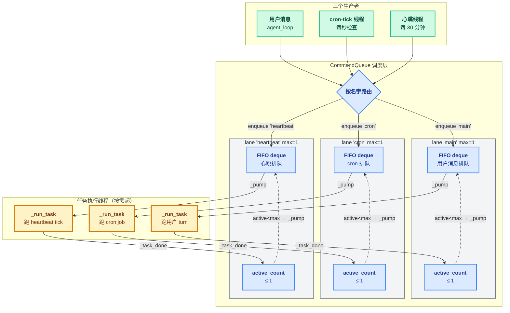

# 10 - Concurrency

> [!note]
> 引入**命名 lane** 概念——把"无序的线程起停"换成"按业务隔离的有序队列"。`CommandQueue` 是中央调度器，按名字路由任务到独立 `LaneQueue`（每个 lane 一个 FIFO deque + Condition + active_count + generation）。三个调用方（用户 / 心跳 / cron）全部从"直接 run"改成"入队 + 注册回调"。
>
> 这一节是 **claw0 的并发治理层**——核心理念一句话：**"用户消息和后台任务必须既隔离又有序。"** s07 已经有"并发"（裸 `threading.Thread`），s10 把它**结构化**：cron 在自己的 lane 串行、心跳在自己的 lane 串行、用户消息在自己的 lane 串行，**跨 lane 完全独立**。

> [!warning] 编号说明
> 这是 claw0 第 10 节（s10），属于 [[README|Claw-Theory]] Phase 7 的第 7 步（**收尾**）。前置：[[09 - Resilience]]（LLM 调用韧性），[[07 - Heartbeat & Cron]]（cron / 心跳改为入队模式）。这一节学完，Phase 7 完结——下一步就是 PuinClaw 真正落地（参考 [[00 - 综合总结]]）。

## 这节重点关注

读完这一节应该能回答 6 个问题：

1. **为什么需要 LaneQueue？只用 `dict[str, Lock]` 不够吗？** → 看 [[#为什么需要 LaneQueue：5 个失败场景]]
2. **LaneQueue 的 4 个核心概念（Future / generation / _pump / Condition）各干什么？** → 看 [[#LaneQueue 的 4 块基石]]
3. **HeartbeatRunner / CronService 怎么从"直接 run"改成"入队"？** → 看 [[#三个调用方都改成入队模式]]
4. **generation 计数器是怎么防 zombie 任务的？** → 看 [[#generation：防 zombie 任务]]
5. **s07 的 `lane_lock` 互斥 vs s10 的多 lane 独立，本质差异？** → 看 [[#vs s07：从一把锁到多个 lane]]
6. **`_pump` 为什么叫"自驱动调度"？** → 看 [[#_pump：自驱动调度引擎]]

**略读指引**：`SoulSystem / MemoryStore / run_agent_single_turn`（L275-345）都是 s06 老代码；REPL 命令 `/lanes /queue /enqueue /concurrency /generation /reset`（L700-810）是 thin wrapper，看一眼知道能干什么就够；`print_lane / print_*`（L69-88）是终端 UI。

## 这一步加了什么

| 新增 | 作用 | 行数 | 重点? |
|---|---|---|---|
| `LaneQueue` 类 | **单 lane 队列**：deque + Condition + active_count + generation | ~105 | ★★★ |
| `CommandQueue` 类 | **多 lane 调度器**：按名字路由 + reset_all + wait_for_all | ~65 | ★★ |
| `_pump()` 自驱动循环 | 任务完成后看下一个能不能跑，无需外部调度器 | ~15 | ★★★ |
| `generation` 计数器 | 防 zombie 任务在 reset 后错误排空队列 | ~10 | ★★ |
| `wait_for_idle()` / `wait_for_all()` | 用 Condition 高效等队列空 | ~25 | ★ |
| HeartbeatRunner 改造 | `command_queue.enqueue(LANE_HEARTBEAT, _do_heartbeat)` + Future 回调 | ~30 | ★★ |
| CronService 改造 | `command_queue.enqueue(LANE_CRON, _do_cron)` + Future 回调 | ~40 | ★★ |
| agent_loop 改造 | 用户消息走 `cmd_queue.enqueue(LANE_MAIN, _make_user_turn)` | ~30 | ★★ |
| 3 个 lane 常量 | `LANE_MAIN / LANE_CRON / LANE_HEARTBEAT` 字符串常量 | ~3 | — |

**净增 ~350 行**（s09 → s10：1126 → 1480）。这一节的代码量最大，但概念集中——全部围绕"LaneQueue 是什么 + 怎么用"。

## 演进与动机

### 为什么 s07 还不够？

s07 已经有"并发"——`HeartbeatRunner` 和 `CronService` 都起 daemon 线程跑后台任务。但 s07 的并发是**朴素的**：

```python
# s07：每个后台任务起裸线程
threading.Thread(target=self._tick, daemon=True).start()
```

**问题**：没有队列、没有限流、没有取消、没有等待、没有重置。

### s07 的"lane_lock"其实不算 lane

s07 有一把 `lane_lock`，名字像 lane，**但实际只有一把锁**：

```python
# s07：用户和心跳挤同一把锁
with lane_lock:
    run_agent_turn(...)        # 用户路径
with lane_lock:
    if not lock.acquire(blocking=False):
        return                  # 心跳抢不到就跳过
    run_heartbeat()
```

**用户被 cron 阻塞 30 秒**就是这里出的——它们在**一个通道**里互斥。

### s10 的真正突破：lane 概念 + 队列结构

s10 把"lane"提升为一等概念，每个 lane 是一个**独立的 FIFO 队列**：

```
s07：一把锁，所有任务挤一起
       ↓
s10：多个 lane，每个 lane 独立队列

         CommandQueue
         │  │  │
    ┌────┘  │  └────┐
    ▼       ▼       ▼
  main    cron   heartbeat
 (FIFO)  (FIFO)  (FIFO)
 max=1   max=1   max=1
```

这一步解决了"用户被后台任务阻塞"——3 个 lane **完全独立**，互不干扰。

### 但是光"分 lane"还不够

把锁换成 `dict[str, Lock]` 也能分 lane。为什么 s10 还要造 `LaneQueue` 这个数据结构？

因为 lane 还需要**5 件事**：

1. **FIFO 顺序**（锁记不住谁先来）
2. **背压缓冲**（锁会让 100 个线程同时阻塞）
3. **生命周期**（锁没法 cancel/wait/reset）
4. **异步结果**（锁没有返回值）
5. **可观测**（锁是黑盒）

**LaneQueue 就是"lane + 队列 + 调度 + Future"的一体化封装**。详见 [[#为什么需要 LaneQueue：5 个失败场景]]。

## 核心抽象：LaneQueue + CommandQueue

### LaneQueue 字段语义

```python
class LaneQueue:
    def __init__(self, name: str, max_concurrency: int = 1):
        self.name = name                       # lane 名字（"main" / "cron" / ...）
        self.max_concurrency = max(1, max_concurrency)   # 并发上限，默认 1（串行）
        self._deque = deque()                  # FIFO 队列：[(fn, future, gen), ...]
        self._condition = threading.Condition()  # 锁 + 通知（替代 s07 的 Lock）
        self._active_count = 0                 # 正在跑的任务数
        self._generation = 0                   # 版本号（防 zombie）
```

**字段角色**：
- `_deque` —— 任务排队区，先入先出
- `_condition` —— 保护 deque/active_count 的锁 + 让 wait_for_idle 高效等待
- `_active_count` —— 当前正在跑的任务数（必须 ≤ max_concurrency）
- `_generation` —— reset_all 时 +1，老任务完成后看版本不匹配就不 pump

### CommandQueue 字段语义

```python
class CommandQueue:
    def __init__(self):
        self._lanes: dict[str, LaneQueue] = {}   # lane 名字 → LaneQueue
        self._lock = threading.Lock()             # 保护 _lanes dict（创建 lane 时用）
```

**核心方法**：
- `enqueue(lane_name, fn) → Future` —— 按名字路由到对应 lane，调 lane.enqueue
- `get_or_create_lane(name, max_concurrency) → LaneQueue` —— 第一次用某 lane 时惰性创建
- `reset_all() → dict` —— 把所有 lane 的 generation +1（重启模拟）
- `wait_for_all(timeout) → bool` —— 等所有 lane 都空闲

### 三个常量：lane 名字

```python
LANE_MAIN = "main"               # 用户消息
LANE_CRON = "cron"               # cron 任务
LANE_HEARTBEAT = "heartbeat"     # 心跳任务
```

**用字符串而不是 enum**——让用户可以自定义新 lane（比如 "email" / "indexer"），不需要改框架代码。

## 整体架构图



## 为什么需要 LaneQueue：5 个失败场景

这一节的开篇问题——**LaneQueue 解决了什么 `dict[str, Lock]` 解决不了的事**？

### 场景 1：对话顺序错乱（同 peer ordering）

用户快速发 3 条消息："你好 / 今天天气 / 怎么样"。

**用锁**：3 个线程同时 acquire，抢锁顺序不定 → 用户看到回复顺序 "挺好的 / 晴天 / 你好"。
**LaneQueue**：3 条进 FIFO deque，严格按入队顺序执行（max=1）。

### 场景 2：后台任务阻塞用户

cron 跑 30 秒，期间用户发消息。

**s07 的 `lane_lock`**：cron 拿锁，用户等 30 秒。
**LaneQueue**：cron 在 `lane 'cron'`，用户在 `lane 'main'`，**完全独立**。

### 场景 3：后台任务互相踩踏

整点：cron + 心跳同时触发。

**裸线程**：两个线程同时调 LLM，可能 429 或上下文污染。
**LaneQueue**：cron 在自己的 lane、心跳在自己的 lane，各自多个任务串行。

### 场景 4：资源耗尽

1 秒发 100 条消息。

**裸线程**：100 个线程同时跑 → OOM + Anthropic 429。
**LaneQueue**：1 个跑、99 个在 deque 里（几乎零成本），**自然背压**。

### 场景 5：zombie 任务

`/reset` 时 cron 正在跑长任务。

**裸线程**：没法取消，任务完成后可能污染新状态。
**LaneQueue**：`reset_all()` 让 generation+1，老任务完成后看版本不匹配 → 不 pump → zombie 不再排空队列。

### 浓缩成 5 个抽象需求

| 需求 | Lock 能做？ | LaneQueue 怎么做 |
|---|---|---|
| 顺序保证 | ✗ | FIFO + max=1 |
| 隔离 | ✗（只能互斥） | 多 lane 完全独立 |
| 背压 | ✗ | deque 自然缓冲 |
| 生命周期 | ✗ | Future + generation + wait_for_idle |
| 可观测 | ✗ | stats() 看 active_count + queue_depth |

## LaneQueue 的 4 块基石

### 1. `concurrent.futures.Future`：异步结果欠条

**Future 就是一张"结果欠条"**——提交时立刻拿到，结果出来后凭欠条取。

```python
future = queue.enqueue(call_llm)   # 立刻返回欠条
result = future.result()           # 阻塞等结果
# 或
future.add_done_callback(fn)       # 完成时回调，不阻塞
```

**为什么 enqueue 必须返回 Future**：因为不同调用方需求不同。用户路径要等结果（`future.result()`），心跳不需要等（扔进队列就走）。Future 让两种调用方用同一接口。

### 2. `generation`：防 zombie 任务的版本号

每个任务入队时被盖上**当前 generation 戳**。`reset_all()` 让所有 lane 的 generation +1。

```python
def _task_done(self, gen):
    with self._condition:
        self._active_count -= 1
        if gen == self._generation:   # ← 版本匹配才 pump
            self._pump()
        self._condition.notify_all()
```

**老任务**（gen=0）在新状态（generation=1）下完成 → 版本不匹配 → 不 pump。**zombie 不会错误排空 reset 后的队列**。

### 3. `_pump`：自驱动调度引擎

```python
def _pump(self):
    while self._active_count < self.max_concurrency and self._deque:
        fn, future, gen = self._deque.popleft()
        self._active_count += 1
        threading.Thread(target=self._run_task, args=(fn, future, gen), daemon=True).start()
```

**两个触发时机**：
- `enqueue` 后立刻调（lane 空闲时低延迟启动）
- `_task_done` 时调（任务完成后看下一个）

**叫"自驱动"**：不需要外部调度器，lane 自己管理"何时启动下一个任务"。

### 4. `_condition`：锁 + 通知

`threading.Condition` = `Lock` + `wait()` + `notify_all()`。

**普通 Lock 不够用**——想等队列空闲只能轮询（`while not idle: sleep(0.1)`），浪费 CPU。

**Condition 让 wait_for_idle 高效**：
```python
def wait_for_idle(self):
    with self._condition:
        while self._deque or self._active_count > 0:
            self._condition.wait()   # 挂起，不占 CPU
```

被 `_task_done` 的 `notify_all()` 唤醒。

## generation：防 zombie 任务

### 失败场景（无 generation）

```
10:00  lane "main" 启动，任务 A、B、C 入队
10:00  A 开始跑（耗时 5 分钟）
10:01  用户按 /reset
       → 清空 deque（B、C 被丢弃）
       → 但 A 已经在跑，杀不死

10:05  A 终于完成
       → 触发 _task_done
       → 如果 _task_done 无脑 pump，会试图排空 deque
       → 但 deque 已经被 reset 清空，pump 什么也不做
       → ✗ 看起来没问题？

实际漏洞：
       reset 后用户立刻发新任务 D、E、F 入队
       A 完成时 _task_done 触发 pump → 启动 D
       但 A 是用"旧 session"跑的，结果可能污染"新 session"
```

### generation 怎么解

```python
def _task_done(self, gen):
    with self._condition:
        self._active_count -= 1
        if gen == self._generation:   # 关键检查
            self._pump()
        self._condition.notify_all()
```

A 入队时 gen=0，reset 后 generation=1。A 完成时带 gen=0，**0 ≠ 1**，**不 pump**。

**语义**："你这是上一场的任务，不要叫下一场的人。"

### generation 的生命周期

| 事件 | generation |
|---|---|
| lane 初始化 | 0 |
| 正常入队 / 完成 | 不变 |
| `reset_all()` | +1 |
| 老任务完成 | `gen_of_task ≠ _generation` → 不 pump |

## _pump：自驱动调度引擎

### 为什么叫"自驱动"

不需要外部 scheduler 线程"轮询 deque"——lane 自己在两个时机触发 pump：

1. **enqueue 时**：新任务入队，立刻看能不能启动
2. **_task_done 时**：任务完成，active_count 减 1，看能不能启动下一个

**触发点就这两个**——没有第三方调度器。这就是"自驱动"。

### pump 的幂等性

```python
def _pump(self):
    while self._active_count < self.max_concurrency and self._deque:
        ...
```

**条件不满足就什么都不做**——所以多调一次安全，少调一次会卡住。**宁可多调不可少调**。

### 不在 enqueue 时 pump 行不行？

理论上行——只要 `_task_done` 里 pump，队列最终会消化。

**但延迟会变高**：lane 空闲时（active=0），入队后如果不 pump，任务得等"下一次某任务完成"才被启动——但此时根本没任务在跑，永远不会触发 _task_done。

**所以 enqueue 必须立刻 pump**——否则空闲 lane 入队的任务会永远卡在 deque 里。

## 三个调用方都改成入队模式

s10 的核心改造——**用户 / 心跳 / cron 全部从"直接 run"改成"入队"**：

| 路径 | s07（直接 run） | s10（入队） |
|---|---|---|
| 用户消息 | `run_agent_turn(msg)` | `cmd_queue.enqueue(LANE_MAIN, _make_user_turn(...))` |
| 心跳 | `run_agent_single_turn(...)` | `command_queue.enqueue(LANE_HEARTBEAT, _do_heartbeat)` |
| cron | `run_agent_single_turn(...)` | `command_queue.enqueue(LANE_CRON, _do_cron)` |

### 统一的"闭包 + 回调"模式

```python
# 三个路径都是这套结构
def _do_work():
    # 1. 准备（prompt / messages / 等）
    sys_prompt = build_system_prompt(...)
    # 2. 调 LLM
    response = run_agent_single_turn(message, sys_prompt)
    # 3. 后处理
    return self._parse_response(response)

future = self.command_queue.enqueue(LANE_XXX, _do_work)   # 入队

def _on_done(f: Future):
    if f.exception():
        # 失败
    else:
        # 成功后置（更新 last_run_at / mark_success）
        self.last_run_at = time.time()

future.add_done_callback(_on_done)   # 异步回调，不阻塞
```

### HeartbeatRunner / CronService 的角色变化

- **s07**：自己起线程、自己跑、自己善后——**运动员**
- **s10**：只决定"何时入队 + 任务完成后做什么"——**教练**

业务逻辑（HEARTBEAT.md 解析、cron schedule 计算）**完全不变**，只是线程管理交给了 CommandQueue。

### HeartbeatRunner 多了个"双重检查"

L418-420：
```python
lane_stats = self.command_queue.get_or_create_lane(LANE_HEARTBEAT).stats()
if lane_stats["active"] > 0:
    return    # 已经有心跳在跑，跳过这次
```

**比 s07 的 `lane_lock` 抢锁更精准**——直接看队列真实状态（active_count），不会因为 race condition 误判。

## vs s07：从一把锁到多个 lane

| 维度 | s07 | s10 |
|---|---|---|
| "lane" 概念 | 只有名字，实际一把锁 | 一等公民，每个 lane 一个 LaneQueue |
| 用户 vs 心跳 | **互斥**（一把锁） | **完全独立**（不同 lane） |
| 同 peer 多消息 | 锁不保证 FIFO | FIFO + max=1 严格有序 |
| 任务排队 | 锁让线程阻塞，没队列 | deque 缓冲 |
| 等任务完成 | 没办法 | `future.result()` / `wait_for_idle()` |
| /reset 后的 zombie | 没保护 | generation 防污染 |
| 添加新后台任务 | 自己写线程管理 | `cmd_queue.enqueue("xxx", fn)` |
| 跨 lane 优先级 | 没办法 | main lane 优先，后台 lane 不阻塞 REPL |

### 一句话差异

**s07 用锁让任务"互相等"，s10 用 lane 让任务"互不干扰 + 各自有序"**。
- 锁：让冲突的访问串行化
- LaneQueue：让不冲突的任务并行 + 冲突的任务有序

## OpenClaw 生产代码对应

| s10 教学 | OpenClaw 生产 | 差异 |
|---|---|---|
| `LaneQueue` | `Lane` | 几乎一致；生产版支持 max_concurrency > 1 |
| `CommandQueue` | `LaneManager` | 名字不同，逻辑一致 |
| `threading.Condition` | `asyncio.Condition` | 生产用纯 asyncio，教学用 threading+asyncio 混用 |
| `threading.Thread` 起 _run_task | `asyncio.create_task` | 生产异步，教学同步 |
| 3 个固定 lane | 动态 lane 池 | 生产支持每 peer 一个 lane（真正隔离） |
| generation 整数 | generation UUID | 生产用 UUID 避免整数溢出（极端情况） |
| `wait_for_all` | `await manager.idle()` | 异步版 |

**最大差异**：s10 的 LaneQueue 用 `threading.Thread` 起 _run_task（每任务一线程），OpenClaw 生产用 `asyncio.create_task`（轻量协程）。生产版能撑成千上万个并发任务，教学版几个 lane 就够教学了。

## 设计要点

### 1. 分 lane 是为了隔离，FIFO 是为了顺序

两个独立需求：用户和 cron 不互相阻塞（需要分 lane），用户消息按顺序处理（需要 FIFO）。LaneQueue 用一个数据结构同时满足。

### 2. 自驱动调度 > 外部调度器

不需要专门起一个"调度线程"轮询 deque。`enqueue` 和 `_task_done` 两个触发点就够。**简化系统** = 更少的同步点 + 更少的 bug。

### 3. generation 是"软取消"

没法强杀线程（Python 的 `threading` 没有这个），但可以用 generation 让"老任务的影响范围"被限制——它跑完就跑完，但不能触发后续动作。这是**软取消**——比硬取消安全。

### 4. Future 让"调用方决定怎么等"

`future.result()` 阻塞、`add_done_callback` 异步、`future.done()` 探询——**调用方按需选择**。同一个 enqueue 接口服务三类调用方（用户路径要等、心跳不需要等、批量任务可以批量等）。

### 5. lane 名字用字符串不用 enum

允许业务方自定义新 lane（"email" / "indexer" / "webhook"），不需要改框架代码。**字符串命名 = 开放扩展**。

### 6. enqueue 立刻 pump 是低延迟关键

如果只在 `_task_done` 触发 pump，空闲 lane 入队的任务会永远卡住。**enqueue 时也 pump = 空闲任务立刻启动 + 忙任务乖乖排队**。

## 相关概念

- [[07 - Heartbeat & Cron]] —— s07 的 `lane_lock` 是 LaneQueue 的前身，对比看更清楚
- [[09 - Resilience]] —— ResilienceRunner 跑在 lane 内部，每个 lane 一个独立的韧性栈
- [[08 - Delivery]] —— DeliveryRunner 也是后台线程，但 s10 把它纳入 lane 体系
- [[14 - Cron Scheduler|learn-claude-code s14]] —— s14 的 cron 跟 s10 完全不同（s14 走 agent_loop 单路径，s10 走独立 lane）
- [[17 - Autonomous Agents|learn-claude-code s17]] —— 自主 agent 用的就是 lane 概念
- 生产模式：actor model、green thread、goroutine —— LaneQueue 是它们的简化版

## 易踩坑

### 坑 1：以为 LaneQueue 的核心价值是"分 lane"

不是。**分 lane 用 `dict[str, Lock]` 就够**。LaneQueue 的真正价值是 5 件事：FIFO + 背压 + 生命周期 + Future + 可观测。详见 [[#为什么需要 LaneQueue：5 个失败场景]]。

### 坑 2：以为 `_pump` 是外部调度器

不是。`_pump` 是**自驱动**——只在 `enqueue` 和 `_task_done` 时被调用。没有第三方调度线程。

### 坑 3：以为 generation 是用来取消任务的

**不是取消**——Python 的 threading 没法强杀。generation 是**软取消**——让老任务完成后**不触发后续动作**（不 pump）。任务本身会跑完，但影响被隔离。

### 坑 4：以为 enqueue 后任务立刻完成

不是。`enqueue` 返回 Future 时，任务**可能已经在新线程里开跑**（lane 空闲），**也可能还在 deque 里排队**（lane 忙）。要结果必须 `future.result()` 或 `add_done_callback`。

### 坑 5：以为 `wait_for_idle` 是死循环

不是。用 `Condition.wait()` 高效等待——`_task_done` 的 `notify_all()` 会唤醒它。**不占 CPU**。

### 坑 6：以为 max_concurrency 必须 = 1

不是。`max_concurrency=N` 允许 lane 内 N 个任务并行（生产 lane 用得多）。教学版默认 1 是因为"同 lane 任务必须串行"是大多数场景的需求。

### 坑 7：以为 HeartbeatRunner / CronService 被 LaneQueue 取代了

**没有**。它们还在，只是角色变了：从"运动员"（自己起线程）变成"教练"（往 lane 塞任务 + 注册回调）。业务逻辑完全不变。

## 代码骨架总览

### 必读 5 处（共 ~200 行核心代码）

#### 1. `LaneQueue.enqueue` + `_pump`（L128-154，~30 行）⭐⭐⭐
**本节灵魂**。看清楚 deque/condition/active_count/generation 四件套怎么协作。

```python
def enqueue(self, fn, generation=None):
    future = concurrent.futures.Future()
    with self._condition:
        gen = generation if generation is not None else self._generation
        self._deque.append((fn, future, gen))
        self._pump()
    return future

def _pump(self):
    while self._active_count < self.max_concurrency and self._deque:
        fn, future, gen = self._deque.popleft()
        self._active_count += 1
        threading.Thread(target=self._run_task, args=(fn, future, gen), daemon=True).start()
```

#### 2. `LaneQueue._task_done`（L171-177，~7 行）⭐⭐
generation 检查的精髓——版本匹配才 pump。

```python
def _task_done(self, gen):
    with self._condition:
        self._active_count -= 1
        if gen == self._generation:
            self._pump()
        self._condition.notify_all()
```

#### 3. `LaneQueue.wait_for_idle`（L179-193，~15 行）
Condition.wait 的高效等待——比 s07 的轮询强。

#### 4. `CommandQueue.enqueue` + `reset_all`（L229-245，~20 行）⭐
按名字路由 + 全局 generation 重置。

#### 5. `agent_loop` 集成（L626-680 + L810-870，~120 行）
看用户消息怎么进 main lane（L867）、cron-tick 线程怎么起（L646-656）、3 个 lane 怎么预创建（L629-631）、关闭时怎么 wait_for_all（L883）。

### 选读

- `HeartbeatRunner._execute`（L399-440）—— 双重检查 + enqueue + add_done_callback
- `CronService._enqueue_job`（L546-583）—— 同样的模式，cron 视角

### 跳过

- `SoulSystem / MemoryStore / run_agent_single_turn`（L275-345）—— s06 老代码
- REPL 命令实现（L700-810）—— thin wrapper
- `print_lane / print_*`（L69-88）—— 终端 UI

## Q&A

### Q1: 为什么 LaneQueue 用 `threading.Thread` 起 _run_task，不用线程池？

**A**: 教学版为了简单——直接 `threading.Thread().start()` 一目了然。生产代码会用 `ThreadPoolExecutor` 或 asyncio，原因：(1) 线程池避免频繁创建/销毁线程的开销；(2) asyncio 更轻量，能撑成千上万个并发。教学版 3-5 个 lane、每 lane max=1，开线程的成本可以忽略，所以选最简单的写法。

### Q2: generation 用整数不怕溢出吗？

**A**: 理论上有 `sys.maxsize` 上限（64 位系统是 2^63），实际中不可能 reset 这么多次。**生产代码会用 UUID**——极端情况下整数会溢出，UUID 不会。教学版用整数是为了可读性（`/generation` 命令输出 "main: generation=3" 比 "main: generation=a3f7-..." 友好）。

### Q3: `_condition` 和 `_lock` （CommandQueue 的）有什么区别？

**A**: 两个不同的锁：
- `LaneQueue._condition` —— 保护 **单个 lane** 的 deque/active_count，支持 wait/notify
- `CommandQueue._lock` —— 保护 **lanes dict**（创建新 lane 时用），普通 Lock，不需要 wait

锁的粒度不同——lane 内的高频操作用 Condition（要 wait），跨 lane 的低频操作（创建 lane）用普通 Lock（不需要 wait）。

### Q4: 同一 lane 的多个任务真的能保证 FIFO 吗？

**A**: 能。`deque.append` 入队、`deque.popleft` 出队——这是 FIFO 的标准实现。**只要 `_pump` 每次只启动一个任务**（max=1 时），FIFO 自然成立。max>1 时是"FIFO 入队 + 并发执行"——前 N 个同时启动，但启动顺序还是 FIFO。

### Q5: 为什么 `enqueue` 后不直接启动任务，而是调 `_pump`？

**A**: 因为 `_pump` 是**唯一**启动任务的入口。`enqueue` 只管"入队"，`_pump` 管"什么时候启动谁"。**职责分离**：
- enqueue：加任务到 deque
- _pump：检查条件，从 deque 启动任务

这样 `_task_done` 也能复用 `_pump`（任务完成后看下一个），不用重复写启动逻辑。

### Q6: Future 的 `add_done_callback` 在哪个线程执行？

**A**: **在调用 `future.set_result()` 的线程里**——也就是 `_run_task` 线程（任务线程）。所以 callback 里**不能做太重的事**（会阻塞 lane 的下一个任务启动）。HeartbeatRunner 的 `_on_done` 只做轻量操作（更新字段、塞 output_queue），重活（调 LLM）都在 `_do_heartbeat` 里。

### Q7: 如果一个任务抛异常，会污染 lane 吗？

**A**: 不会。`_run_task` 用 try/except/finally：

```python
def _run_task(self, fn, future, gen):
    try:
        result = fn()
        future.set_result(result)
    except Exception as exc:
        future.set_exception(exc)
    finally:
        self._task_done(gen)   # ← 无论成功失败都调
```

异常被塞进 Future，调用方通过 `future.exception()` 取。lane 的 active_count 一定减 1，下一个任务正常启动。

### Q8: s07 的 `lane_lock` 真的一无是处了吗？

**A**: 没完全废弃——`lane_lock` 解决的是"用户和心跳不能同时改 messages"，这个需求还在。但 s10 用更精细的方式：**用户和心跳在不同 lane，根本不会同时跑**（各自 lane 内 max=1）。**lane 隔离比锁互斥更彻底**——锁是"两个排一个"，lane 是"两个跑各的"。所以 s10 不需要 `lane_lock`，lane 隔离就够了。

### Q9: 用户路径 `cmd_queue.enqueue(LANE_MAIN, ...)` 之后还要 `future.result()`，不就退化成同步了吗？

**A**: 看场景。教学版的 agent_loop 确实 `future.result()` 同步等——因为 REPL 模式下用户在等回复，必须等。但**生产 IM bot 场景**会完全异步：enqueue 后立刻返回，结果通过 callback 投递到 DeliveryQueue，用户消息和回复完全解耦。**Future 让你"按需选择"**——同步 / 异步都能用同一接口。

### Q10: 学 s10 要重点看哪几个函数？

**A**: 必读 5 处（共 ~200 行核心代码）：

1. `LaneQueue.enqueue` + `_pump`（L128-154，~30 行）—— **本节灵魂**
2. `LaneQueue._task_done`（L171-177，~7 行）—— generation 检查
3. `LaneQueue.wait_for_idle`（L179-193，~15 行）—— Condition.wait 高效等待
4. `CommandQueue.enqueue` + `reset_all`（L229-245，~20 行）—— 多 lane 调度
5. `agent_loop` 集成（L626-680 + L810-870）—— 串联入口

跳过：`SoulSystem / MemoryStore / run_agent_single_turn`（s06 老代码）、REPL 命令、`print_*`。详见 [[#代码骨架总览]]。
