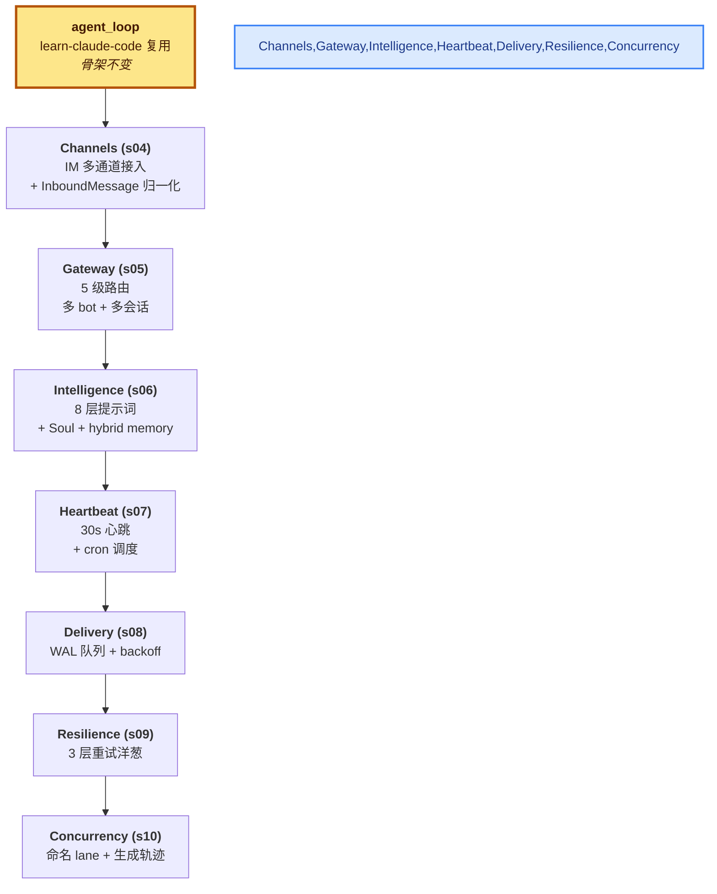

# Claw-Theory --- 产品级常驻 Agent 的解剖

这一文件夹的笔记**只关注一个特定实现**：[shareAI-lab/claw0](https://github.com/shareAI-lab/claw0)（10 节，~7,000 行 Python）。每一个 phase 按原教程顺序展开，目标是把 learn-claude-code 的 CLI Agent 推进到**产品级常驻服务**——能挂多个 IM 通道、能后台心跳、能可靠投递、能并发处理。

> [!tip] 学这一文件夹之前看哪里？
> **前置：[`../Learn-Claude-Code/`](../Learn-Claude-Code/)** —— Phase 1-6 的 learn-claude-code 是骨架（agent loop / tools / hooks / memory / subagent / skill）。claw0 复用了这些概念但不再重复讲解。

## 这套笔记的主线

learn-claude-code 教的是"Agent 在一个终端里"。claw0 教的是"Agent 跑成一个服务"：



每一节只引入**一个新概念**，前面所有节的代码保持不动。10 节学完，能直接读 OpenClaw 生产代码库。

## Phase 划分

| Phase | 课程 | 主题 | 核心问题 | 状态 |
|---|---|---|---|---|
| Phase 7 | s04 - s10 | 常驻 Agent | 怎么从 CLI 跑成生产服务？ | in progress |

## 阅读顺序

**按 s 编号顺序读**。每节都建立在前一节之上：

- s04 Channels（IM 多通道接入）—— **已完成**
- s05 Gateway & Routing（5 级路由）
- s06 Intelligence（8 层提示词 + Soul）
- s07 Heartbeat & Cron（30s 心跳 + 定时）
- s08 Delivery（可靠投递）
- s09 Resilience（3 层重试洋葱）
- s10 Concurrency（命名 lane）

遇到具体疑问时翻 **对话精华 QA**。

## 每篇笔记的固定结构

```
---
type: concept
series: claw0                    ← 标明来自 claw0
---
# 课题名

> [!note]                        ← 核心洞察

> [!warning]                     ← 编号说明（Phase 7 起）

## 这节重点关注                  ← TL;DR：5 个抽象要点 + 略读指引
## 这一步加了什么                ← 组件表格总览
## 演进与动机                    ← 反例 + 解法核心思想
## 核心抽象                      ← dataclass + ABC + 字段语义
## 整体架构图                    ← 主 mermaid 图
## 平台怪癖的共性模式            ← 抽象出来的 4 类问题
## 并发模型 / 核心算法           ← 每节的具体机制
## OpenClaw 生产代码对应          ← 教学版 vs 生产版对照
## 设计要点
## 相关概念                      ← Obsidian 双链
> [!warning]                     ← 易踩坑
## Q&A                           ← 本节学习时卡过的点（局部）
```

## 取舍声明

这套笔记**不是**：

- 不是 API 文档翻译（看 [claw0 原仓库](https://github.com/shareAI-lab/claw0) 更准）。
- 不是逐行源码注释（看原仓库代码更直接）。
- 不教你如何配置 Telegram bot token / 飞书 app_id（原仓库 README 已经写得很清楚）。

它是**一份心智模型笔记**。读完之后，你应该能在脑子里画出 claw0 的结构图，并能解释每一块为什么必须存在。平台细节（Telegram media_group_id、飞书 tenant_token 刷新等）**用到时再查**——抽象层才是这里的主菜。
