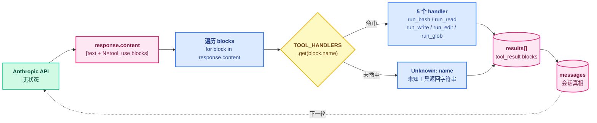

# 02 - Tool Use

> [!note]
> s01 的循环只认一个 `bash`。s02 把"工具"抽象成一张表：每个工具一个名字、一个 schema、一个 handler。模型每轮可以并发调用任意多个工具，循环按名字查表派发。这就是 Agent 拥有"行动能力"的标准姿势。

## 这节重点关注

读完这节，你应该能在脑子里答出这 5 个问题：

1. **两张表的关系**：`TOOLS`（喂 API）和 `TOOL_HANDLERS`（harness 用）为什么要分开？它们怎么对齐？（→ [核心抽象](#核心抽象)）
2. **派发机制**：循环怎么从模型回复里取出工具调用并按名字派发？（→ [代码骨架总览](#代码骨架总览)）
3. **schema 的作用**：`input_schema` 同时服务哪三方？为什么 schema 严模型就少犯错？（→ [Schema 的作用](#schema-的作用)）
4. **并发调用**：模型一轮里并发调 5 个工具，循环怎么不丢、不乱序？（→ [Tool 分发：查表派发](#tool-分发查表派发)）
5. **handler 失败语义**：为什么 handler 要 catch 异常返回字符串，而不是抛上去？（→ [设计要点](#设计要点)）

**可以略读/跳过**：`safe_path` 路径校验、各工具内部实现细节（`run_read` / `run_write` / `run_edit` / `run_glob`）。**两张表 + 派发那一行是主菜**。

## 这一步加了什么

| 新增 | 作用 | 重点? |
|---|---|---|
| `TOOL_HANDLERS: dict[str, callable]` | 工具名 → Python 函数的分发表 | ⭐⭐⭐ |
| `TOOLS: list[dict]` | 工具名 + JSON Schema，喂 API 让模型知道有哪些工具可用 | ⭐⭐⭐ |
| `safe_path(p)` | 路径安全校验，防止 `../../etc/passwd` 逃逸 | ⭐⭐ |
| `run_read / run_write / run_edit / run_glob` | 4 个新工具实现 | ⭐ |
| `handler(**block.input)` 派发那一行 | 替代 s01 硬编码的 `run_bash(...)` | ⭐⭐⭐ |

## 演进与动机

### 反例：一个 bash 工具走天下

s01 只用 `bash` 理论上能做所有事——文件读写、grep、网络请求都能 shell 出来。但有几个问题：

- **不安全**：模型写 `rm -rf` 你拦不住（s03 解决）。
- **不可靠**：模型对 `cat`、`grep` 输出格式的理解远不如它对结构化工具的理解。
- **不可观测**：`bash` 的输出是一坨字符串，harness 无法区分"读取文件"和"执行命令"，没法针对性打日志、限流、改权限。

把操作拆成 `read_file / write_file / edit_file / glob / bash` 等**语义化工具**，每个工具有清晰的 schema，模型才会用结构化的方式思考。

### 反例：一轮只支持一个工具

模型经常会在一轮里同时说：

> "我先 `read_file('a.py')` 看看，同时 `read_file('b.py')` 对比一下。"

如果只支持一轮一个工具，第二个就得等下一轮——多花一次往返、多一份 token。所以循环要**遍历 `response.content` 里所有的 `tool_use` block**，并发执行，把所有结果一次性塞回去。

### 解法核心：两张表 + 查表派发

```
工具名 (字符串)  →  handler (可调用对象)
"bash"          →  run_bash
"read_file"     →  run_read
"write_file"    →  run_write
...
```

加上 schema：

```
TOOLS = [
  {name, description, input_schema},  # 给模型看
  ...
]
TOOL_HANDLERS = {name: handler}       # 给 harness 用
```

两张表共享同一组名字，一张对外（API），一张对内（执行）。**循环骨架（s01 那个 while）完全不变**，只是循环体里"如何执行工具"从硬编码变成了查表。

## 核心抽象

这是经典的 **Dispatch Table / Strategy Pattern**：

```python
TOOL_HANDLERS = {
    "bash":       run_bash,
    "read_file":  run_read,
    "write_file": run_write,
    "edit_file":  run_edit,
    "glob":       run_glob,
}

# 循环里：
handler = TOOL_HANDLERS.get(block.name)
output = handler(**block.input) if handler else f"Unknown: {block.name}"
```

### Schema 的作用

`input_schema` 是 JSON Schema。它做了三件事：

1. **告诉模型有哪些参数**：模型据此生成合法的 `input`。
2. **告诉 API 校验**：API 会拒绝不符合 schema 的调用，省去 harness 自己写校验。
3. **文档化**：好的 `description` 能显著提升模型选对工具的概率。

一个常见的坑：模型可能传 `limit="50"`（字符串）而 schema 要 `integer`。s05 之后会用 `_normalize_todos` 这种手动转换兜底，但**首选是让 schema 严格**——schema 严，模型少犯错。

## 整体架构图



## Tool 分发：查表派发

s01 的循环里写死的是 `run_bash(block.input["command"])`。s02 改成：

```python
for block in response.content:
    if block.type != "tool_use":
        continue
    handler = TOOL_HANDLERS.get(block.name)
    output = handler(**block.input) if handler else f"Unknown: {block.name}"
    results.append({"type": "tool_result",
                     "tool_use_id": block.id, "content": output})
```

几个关键点：

- **`handler(**block.input)`** 把模型的 JSON input 解包成关键字参数。schema 严的话这里不会出错。
- **未知工具名返回字符串**而不是抛错，模型看到 "Unknown: xxx" 会自己停下来。
- **遍历 `response.content`** 而不是只取第一个，所以**支持模型并发调用多工具**——5 个 tool_use block 一次性派发执行，5 个 tool_result 一次性塞回。

### 两张表怎么对齐

`TOOLS` 和 `TOOL_HANDLERS` 共享同一组工具名，靠人工保持同步——加新工具时**两处都要加**。如果忘了其中一处：

- 只加 `TOOLS` 没加 `TOOL_HANDLERS`：模型会用，但派发时拿到 "Unknown: name"。
- 只加 `TOOL_HANDLERS` 没加 `TOOLS`：模型根本不知道有这工具，永远不会调。

s07 Skill Loading 会用 manifest + 装饰器把这两张表合成一处，消除人工同步的隐患。

## 原本的 Claude Code 怎么做的

Claude Code 内置工具大致是这套（部分）：

| 工具 | 作用 | 对应 s02 工具 |
|---|---|---|
| Bash | 跑命令 | bash |
| Read | 读文件（带行号、支持图片、PDF、ipynb） | read_file |
| Write | 覆盖写文件 | write_file |
| Edit | 精确替换（一次一处） | edit_file |
| Glob | 文件名模式匹配 | glob |
| Grep | 内容正则搜索（基于 ripgrep） | —— |
| TodoWrite / TaskCreate | 任务列表 | todo_write（s05） |
| Agent | 子智能体 | task（s06） |
| WebSearch / WebFetch | 联网 | —— |

每个工具的 schema 都很讲究——比如 `Edit` 会拒绝 `old_string` 不唯一的情况，逼模型用更多上下文定位；`Read` 默认 2000 行、可指定 `offset` 和 `limit`。

这些细节决定了 Agent 的**手感**：同样的模型，工具设计得好坏能让效率差好几倍。

## 设计要点

### 1. 工具越小越专一越好

不要写一个 `do_everything(action, ...)`。一个工具一件事，名字动词开头，schema 字段不超 5 个。

### 2. 失败要返回字符串，不要抛异常

循环里如果 handler 抛异常，整个回合就崩了。最佳实践是**捕获所有异常，把错误字符串塞回去当 tool_result**：

```python
def run_bash(command: str) -> str:
    try:
        ...
    except Exception as e:
        return f"Error: {e}"
```

模型看到 `Error: ...` 会自己修正——这比 harness 替它重试要可靠得多。

### 3. 输出要截断

工具输出可能极大（比如 `cat` 一个 10MB 日志）。直接塞回 `messages` 会瞬间爆上下文。s02 已经有 `out[:50000]` 的兜底，s04 会用 PostToolUse hook 做更精细的截断，s08 会用 budget 把超大输出落盘。

### 4. 路径要 escape 校验

`safe_path()` 把用户传的相对路径 resolve 后检查是否还在 WORKDIR 内：

```python
def safe_path(p: str) -> Path:
    path = (WORKDIR / p).resolve()
    if not path.is_relative_to(WORKDIR):
        raise ValueError(f"Path escapes workspace: {p}")
    return path
```

否则模型（或恶意 prompt 注入）可以 `read_file("../../etc/passwd")` 逃出沙箱。**这是工具层的安全，与 s03 Permission 的策略层正交**。

## 相关概念

- [[01 - Agent Loop]]：循环本身没变，只是循环体里"如何执行工具"从硬编码变成了查表。
- [[03 - Permission]]：在 `handler(**block.input)` 之前要插一道闸门。
- [[04 - Hooks]]：把闸门、日志、截断从循环里抽出去，做成可插拔回调。

> [!warning]
> 三个容易踩的坑：
>
> 1. **schema 太松**：`{"type": "object"}` 啥都不约束，模型乱传参数。
> 2. **handler 抛异常**：把异常冒泡到循环，整个回合崩溃。务必 catch 后返回字符串。
> 3. **不截断输出**：一次 `read_file` 一个大文件就把上下文撑爆，下一轮 API 直接 413。

## 代码骨架总览

剥掉具体工具实现，s02 的核心抽象只有这么多——`agent_loop` 的结构和 s01 完全一致，唯一变化是工具执行那一行。

```python
# === 1. 工具实现（5 个，每个 catch 异常返回字符串）===
def safe_path(p: str) -> Path:
    path = (WORKDIR / p).resolve()
    if not path.is_relative_to(WORKDIR):
        raise ValueError(f"Path escapes workspace: {p}")
    return path

def run_bash(command: str) -> str:
    try:
        r = subprocess.run(command, shell=True, cwd=WORKDIR,
                           capture_output=True, text=True, timeout=120)
        out = (r.stdout + r.stderr).strip()
        return out[:50000] if out else "(no output)"
    except Exception as e:
        return f"Error: {e}"

def run_read(path: str, limit: int | None = None) -> str:
    try:
        lines = safe_path(path).read_text().splitlines()
        if limit and limit < len(lines):
            lines = lines[:limit] + [f"... ({len(lines) - limit} more lines)"]
        return "\n".join(lines)
    except Exception as e:
        return f"Error: {e}"

# run_write / run_edit / run_glob 同构，略

# === 2. 两张表：给 API 的 schema + 给 harness 的 handler ===
TOOLS = [
    {"name": "bash", "description": "Run a shell command.",
     "input_schema": {"type": "object",
                      "properties": {"command": {"type": "string"}},
                      "required": ["command"]}},
    {"name": "read_file", "description": "Read file contents.",
     "input_schema": {"type": "object",
                      "properties": {"path": {"type": "string"},
                                     "limit": {"type": "integer"}},
                      "required": ["path"]}},
    # write_file / edit_file / glob 同构，略
]

TOOL_HANDLERS = {
    "bash": run_bash, "read_file": run_read, "write_file": run_write,
    "edit_file": run_edit, "glob": run_glob,
}   # ↑ 两张表靠同一组工具名对齐，加新工具两处都要改

# === 3. agent_loop —— 与 s01 结构一致，只改了工具执行那行 ===
def agent_loop(messages: list):
    while True:
        response = client.messages.create(
            model=MODEL, system=SYSTEM, messages=messages,
            tools=TOOLS, max_tokens=8000,
        )
        messages.append({"role": "assistant", "content": response.content})

        if response.stop_reason != "tool_use":
            return

        results = []
        for block in response.content:
            if block.type != "tool_use":
                continue
            # ↓↓↓ s01 → s02 的唯一变化：硬编码改查表派发 ↓↓↓
            handler = TOOL_HANDLERS.get(block.name)
            output = handler(**block.input) if handler else f"Unknown: {block.name}"
            results.append({"type": "tool_result", "tool_use_id": block.id,
                            "content": output})

        messages.append({"role": "user", "content": results})
```

**这 3 块就是 s02 的全部新增**。下一节 s03 Permission 会在 `handler(**block.input)` 之前插一道 `check_permission` 闸门。

## Q&A

（本节学习暂未记录卡点）
